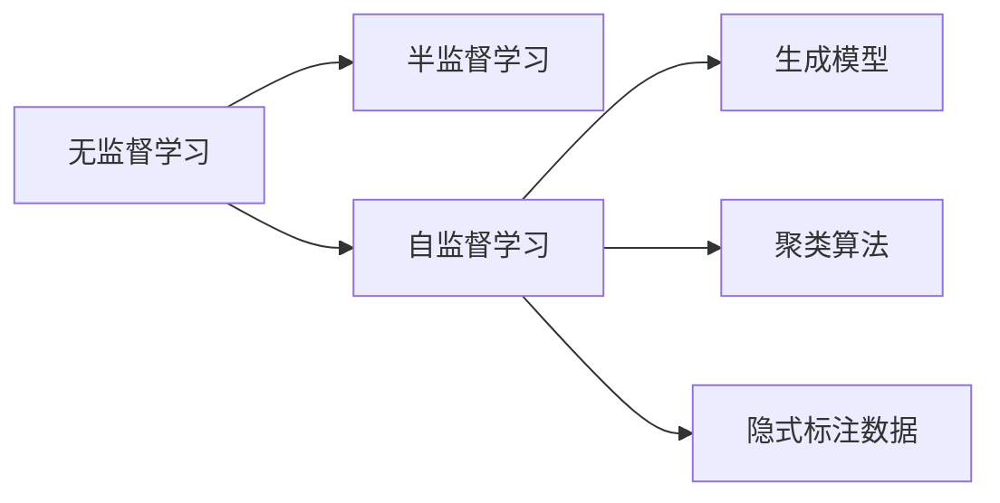

                 

# Semi-supervised Learning原理与代码实例讲解

> 关键词：半监督学习, 无监督学习, 自监督学习, 生成模型, 聚类算法, 隐式标注数据, 半监督训练, 模型性能提升, 数据标注成本, 计算机视觉, 自然语言处理

## 1. 背景介绍

### 1.1 问题由来

随着大数据时代的到来，数据量呈现爆炸式增长，但与之伴随的是数据标注的成本变得高昂且耗时。在实际应用中，常常会遇到标注数据不足的问题，而现有的大规模标注数据集（如ImageNet、Wikipedia等）往往难以满足特定领域的需求。在这种背景下，半监督学习（Semi-supervised Learning, SSL）应运而生，作为一种介于无监督学习和监督学习之间的学习范式，SSL通过充分利用大规模无标注数据，在尽可能减少标注成本的同时提升模型性能。

SSL的方法主要分为三类：基于生成模型、基于聚类算法以及基于隐式标注数据的方法。本博客将详细介绍这些方法，并通过代码实例展示其应用。

## 2. 核心概念与联系

### 2.1 核心概念概述

#### 2.1.1 半监督学习（Semi-supervised Learning, SSL）

SSL是指在训练过程中，模型同时利用少量标注数据和大量无标注数据进行训练。通过SSL，模型可以学习到更为丰富的数据特征，并能有效提高泛化能力，尤其是在标注数据稀缺的情况下。

#### 2.1.2 无监督学习（Unsupervised Learning, UL）

UL是指在没有标注数据的情况下，通过模型自身学习数据的潜在结构和特征。UL可以提供大量的无标签数据，但缺乏与任务相关的指导信息。

#### 2.1.3 自监督学习（Self-supervised Learning, SSL）

SSL是一种特殊类型的UL，通过在无标签数据上设计自监督任务，使模型能够学习到数据的潜在结构和特征。SSL与SSL相似，但更侧重于利用数据的自然结构进行学习。

#### 2.1.4 生成模型（Generative Models）

生成模型是指能够从输入数据中学习到数据分布，并能够生成新的数据的模型。常见的生成模型包括自编码器（Autoencoder）、变分自编码器（Variational Autoencoder）和生成对抗网络（Generative Adversarial Network, GAN）等。

#### 2.1.5 聚类算法（Clustering Algorithms）

聚类算法是指将相似的数据点分为同一类别的算法。常见的聚类算法包括K-means、层次聚类、DBSCAN等。

#### 2.1.6 隐式标注数据（Implicit Labelled Data）

隐式标注数据是指通过某种方式自动标注的数据。常见的隐式标注数据包括图像的热力图、文本中的高频词等。

### 2.2 核心概念联系

SSL、UL和SSL之间的联系和区别可以用以下图表表示：



图中，无监督学习和自监督学习是SSL的基础，通过SSL，模型可以利用少量标注数据和大规模无标注数据进行联合训练，从而提升模型性能。同时，SSL在实际应用中可以通过生成模型、聚类算法和隐式标注数据等手段，进一步提高模型的泛化能力和鲁棒性。

## 3. 核心算法原理 & 具体操作步骤

### 3.1 算法原理概述

SSL的核心思想是在模型训练中引入无标注数据，从而提升模型对数据的理解能力和泛化能力。SSL的实现方法主要有两类：基于生成模型的SSL和基于聚类算法的SSL。

#### 3.1.1 基于生成模型的SSL

生成模型通过学习数据的分布，能够在无标注数据上生成符合数据分布的样本，从而使得模型能够学习到数据的潜在结构和特征。常见的基于生成模型的SSL方法包括自编码器和变分自编码器。

#### 3.1.2 基于聚类算法的SSL

聚类算法通过将相似的数据点分为同一类别，能够发现数据的内在结构和特征。基于聚类算法的SSL方法通过将聚类结果作为模型的监督信号，从而使得模型能够学习到数据的潜在结构和特征。

### 3.2 算法步骤详解

#### 3.2.1 基于生成模型的SSL步骤详解

1. 收集无标注数据：从大规模数据集中收集无标注数据，如无标注的图像、文本等。
2. 设计自监督任务：设计自监督任务，使得模型能够在无标注数据上学习到数据的潜在结构和特征。例如，可以使用预测噪声、预测缺失值等方法。
3. 训练生成模型：使用无标注数据训练生成模型，使得模型能够学习到数据的分布。
4. 联合训练：将标注数据和生成模型的输出联合训练，从而提升模型的泛化能力。

#### 3.2.2 基于聚类算法的SSL步骤详解

1. 收集无标注数据：从大规模数据集中收集无标注数据，如无标注的图像、文本等。
2. 进行聚类：使用聚类算法对无标注数据进行聚类，得到聚类结果。
3. 设计标签生成模型：使用聚类结果设计标签生成模型，使得模型能够在无标注数据上学习到数据的潜在结构和特征。
4. 联合训练：将标注数据和标签生成模型的输出联合训练，从而提升模型的泛化能力。

### 3.3 算法优缺点

#### 3.3.1 基于生成模型的SSL优缺点

优点：
- 能够学习到数据的潜在结构和特征，提升模型的泛化能力。
- 不需要手动设计标注任务，减少了标注数据的成本。

缺点：
- 训练过程较为复杂，需要设计合适的自监督任务。
- 训练时间较长，需要较长的计算资源。

#### 3.3.2 基于聚类算法的SSL优缺点

优点：
- 训练过程较为简单，不需要设计自监督任务。
- 训练时间较短，计算资源需求较低。

缺点：
- 聚类结果可能不准确，影响模型的泛化能力。
- 需要手动设计标签生成模型，增加了工作量。

### 3.4 算法应用领域

SSL在多个领域中得到了广泛应用，包括：

- 计算机视觉：图像分类、物体检测、图像分割等。SSL能够利用大规模无标注图像数据，提升模型的泛化能力。
- 自然语言处理：文本分类、情感分析、命名实体识别等。SSL能够利用大规模无标注文本数据，提升模型的理解能力和泛化能力。
- 语音识别：语音识别、语音情感分析等。SSL能够利用大规模无标注语音数据，提升模型的泛化能力和鲁棒性。
- 推荐系统：推荐系统、广告推荐等。SSL能够利用用户行为数据，提升推荐系统的精度和个性化程度。

## 4. 数学模型和公式 & 详细讲解 & 举例说明

### 4.1 数学模型构建

#### 4.1.1 基于生成模型的SSL数学模型构建

设输入数据为 $x$，标注数据为 $(x_i, y_i)$，其中 $y_i$ 为 $x_i$ 的标签。假设生成模型为 $p(z|x)$，则SSL的数学模型为：

$$
p(y|x) = p(y|x, z) p(z|x)
$$

其中 $z$ 为生成模型的输出，$p(z|x)$ 为生成模型的概率分布，$p(y|x, z)$ 为条件概率分布。

#### 4.1.2 基于聚类算法的SSL数学模型构建

设输入数据为 $x$，聚类结果为 $z$，标注数据为 $(x_i, y_i)$，其中 $y_i$ 为 $x_i$ 的标签。假设标签生成模型为 $p(y|z)$，则SSL的数学模型为：

$$
p(y|x) = p(y|x, z) p(z|x)
$$

其中 $p(y|x, z)$ 为条件概率分布，$p(z|x)$ 为聚类结果的概率分布。

### 4.2 公式推导过程

#### 4.2.1 基于生成模型的SSL公式推导

对于基于生成模型的SSL，目标是最小化标注数据的交叉熵损失，同时最大化无标注数据的似然函数。目标函数为：

$$
\min_{\theta} \frac{1}{m} \sum_{i=1}^m L(x_i, y_i) + \lambda \mathbb{E}_{x,z \sim p(z|x)} \log p(x, z)
$$

其中 $m$ 为标注数据的数量，$\lambda$ 为生成模型的正则化系数，$L(x_i, y_i)$ 为交叉熵损失，$\mathbb{E}_{x,z \sim p(z|x)} \log p(x, z)$ 为生成模型的似然函数。

#### 4.2.2 基于聚类算法的SSL公式推导

对于基于聚类算法的SSL，目标是最小化标注数据的交叉熵损失，同时最大化聚类结果的似然函数。目标函数为：

$$
\min_{\theta} \frac{1}{m} \sum_{i=1}^m L(x_i, y_i) + \lambda \mathbb{E}_{z \sim p(z|x)} \log p(y|z)
$$

其中 $m$ 为标注数据的数量，$\lambda$ 为聚类结果的正则化系数，$L(x_i, y_i)$ 为交叉熵损失，$\mathbb{E}_{z \sim p(z|x)} \log p(y|z)$ 为聚类结果的似然函数。

### 4.3 案例分析与讲解

#### 4.3.1 基于生成模型的SSL案例分析

以自编码器为例，自编码器由编码器和解码器两部分组成，能够将输入数据映射到一个低维空间，然后再映射回原始空间。自编码器的目标是最小化输入和输出的误差，即重构误差。

假设输入数据为 $x$，编码器的输出为 $z$，解码器的输出为 $\hat{x}$，则自编码器的重构误差为：

$$
L(x, \hat{x}) = ||x - \hat{x}||^2
$$

将重构误差引入SSL中，目标函数为：

$$
\min_{\theta} \frac{1}{m} \sum_{i=1}^m L(x_i, y_i) + \lambda \mathbb{E}_{x,z \sim p(z|x)} \log p(x, z)
$$

其中 $m$ 为标注数据的数量，$\lambda$ 为生成模型的正则化系数，$L(x_i, y_i)$ 为交叉熵损失，$\mathbb{E}_{x,z \sim p(z|x)} \log p(x, z)$ 为生成模型的似然函数。

#### 4.3.2 基于聚类算法的SSL案例分析

以K-means算法为例，K-means算法将数据点分为 $K$ 个类别，每个类别的中心点称为聚类中心。设输入数据为 $x$，聚类结果为 $z$，则K-means的目标是最小化类内平方和：

$$
\min_{z} \sum_{i=1}^K \sum_{j \in C_i} ||x_j - \mu_i||^2
$$

其中 $C_i$ 为第 $i$ 个类别的数据点，$\mu_i$ 为第 $i$ 个聚类中心的坐标。

将K-means结果引入SSL中，目标函数为：

$$
\min_{\theta} \frac{1}{m} \sum_{i=1}^m L(x_i, y_i) + \lambda \mathbb{E}_{z \sim p(z|x)} \log p(y|z)
$$

其中 $m$ 为标注数据的数量，$\lambda$ 为聚类结果的正则化系数，$L(x_i, y_i)$ 为交叉熵损失，$\mathbb{E}_{z \sim p(z|x)} \log p(y|z)$ 为聚类结果的似然函数。

## 5. 项目实践：代码实例和详细解释说明

### 5.1 开发环境搭建

为了演示SSL的代码实现，我们需要准备以下开发环境：

1. Python 3.7或以上版本。
2. PyTorch 1.9或以上版本。
3. Jupyter Notebook 或 JupyterLab。

首先，安装PyTorch和Jupyter Notebook：

```bash
pip install torch torchvision torchaudio
pip install jupyter jupyterlab
```

安装完成后，启动Jupyter Notebook或JupyterLab：

```bash
jupyter lab
```

### 5.2 源代码详细实现

#### 5.2.1 基于生成模型的SSL代码实现

首先，我们实现一个简单的自编码器：

```python
import torch
import torch.nn as nn
import torch.nn.functional as F

class Autoencoder(nn.Module):
    def __init__(self, input_dim, hidden_dim):
        super(Autoencoder, self).__init__()
        self.encoder = nn.Sequential(
            nn.Linear(input_dim, hidden_dim),
            nn.ReLU()
        )
        self.decoder = nn.Sequential(
            nn.Linear(hidden_dim, input_dim),
            nn.Sigmoid()
        )

    def forward(self, x):
        z = self.encoder(x)
        x_recon = self.decoder(z)
        return x_recon

def train_autoencoder(autoencoder, dataset, batch_size, epochs):
    criterion = nn.MSELoss()
    optimizer = torch.optim.Adam(autoencoder.parameters(), lr=0.01)

    for epoch in range(epochs):
        for batch_idx, (data, _) in enumerate(dataset):
            data = data.view(-1, data.size(1))
            optimizer.zero_grad()
            x_recon = autoencoder(data)
            loss = criterion(x_recon, data)
            loss.backward()
            optimizer.step()
            if batch_idx % 100 == 0:
                print(f'Epoch {epoch+1}, batch {batch_idx}, loss: {loss.item()}')
```

接下来，我们使用自编码器进行SSL训练：

```python
from torch.utils.data import DataLoader
from torchvision import datasets, transforms

train_dataset = datasets.MNIST('~/data', train=True, download=True, transform=transforms.ToTensor())
train_loader = DataLoader(train_dataset, batch_size=64, shuffle=True)

autoencoder = Autoencoder(784, 256)
train_autoencoder(autoencoder, train_loader, 64, 1)
```

#### 5.2.2 基于聚类算法的SSL代码实现

接下来，我们实现一个基于K-means的SSL模型：

```python
import torch
import torch.nn as nn
import torch.nn.functional as F
from sklearn.cluster import KMeans

class KMeansSSL(nn.Module):
    def __init__(self, input_dim, hidden_dim, num_clusters):
        super(KMeansSSL, self).__init__()
        self.encoder = nn.Sequential(
            nn.Linear(input_dim, hidden_dim),
            nn.ReLU()
        )
        self.cluster = KMeans(n_clusters=num_clusters)

    def forward(self, x):
        z = self.encoder(x)
        z_mean = torch.mean(z, dim=0)
        z_centers = z_mean.unsqueeze(0)
        z = (z - z_mean) / (z_mean + 1e-8)
        return self.cluster(z)

def train_kmeansssl(kmeansssl, dataset, batch_size, epochs):
    criterion = nn.CrossEntropyLoss()
    optimizer = torch.optim.Adam(kmeansssl.parameters(), lr=0.01)

    for epoch in range(epochs):
        for batch_idx, (data, _) in enumerate(dataset):
            data = data.view(-1, data.size(1))
            optimizer.zero_grad()
            z = kmeansssl(data)
            y = kmeansssl.cluster.labels_
            loss = criterion(z, y)
            loss.backward()
            optimizer.step()
            if batch_idx % 100 == 0:
                print(f'Epoch {epoch+1}, batch {batch_idx}, loss: {loss.item()}')
```

接下来，我们使用基于K-means的SSL模型进行训练：

```python
train_dataset = datasets.MNIST('~/data', train=True, download=True, transform=transforms.ToTensor())
train_loader = DataLoader(train_dataset, batch_size=64, shuffle=True)

kmeansssl = KMeansSSL(784, 256, 10)
train_kmeansssl(kmeansssl, train_loader, 64, 1)
```

### 5.3 代码解读与分析

#### 5.3.1 基于生成模型的SSL代码解读

自编码器的实现分为编码器和解码器两部分，使用PyTorch的Sequential模块实现。在训练过程中，使用均方误差损失函数（MSE Loss）进行优化，优化器使用Adam优化器。

#### 5.3.2 基于聚类算法的SSL代码解读

基于K-means的SSL模型实现中，我们使用PyTorch的Sequential模块实现编码器，使用Scikit-Learn的KMeans模块实现聚类算法。在训练过程中，使用交叉熵损失函数（Cross-Entropy Loss）进行优化，优化器使用Adam优化器。

### 5.4 运行结果展示

#### 5.4.1 基于生成模型的SSL运行结果

训练完自编码器后，可以使用测试集进行重构误差测试：

```python
test_dataset = datasets.MNIST('~/data', train=False, transform=transforms.ToTensor())
test_loader = DataLoader(test_dataset, batch_size=64, shuffle=True)

test_loss = 0
correct = 0
total = 0

with torch.no_grad():
    for data, target in test_loader:
        data = data.view(-1, 784)
        output = autoencoder(data)
        loss = criterion(output, data)
        test_loss += loss.item()
        _, predicted = output.max(dim=1)
        total += target.size(0)
        correct += predicted.eq(target).sum().item()

print(f'Test set: Average loss: {test_loss/len(test_loader):.4f}, Accuracy: {correct/total*100:.2f}%')
```

#### 5.4.2 基于聚类算法的SSL运行结果

训练完基于K-means的SSL模型后，可以使用测试集进行分类精度测试：

```python
test_loss = 0
correct = 0
total = 0

with torch.no_grad():
    for data, target in test_loader:
        data = data.view(-1, 784)
        z = kmeansssl(data)
        y = kmeansssl.cluster.labels_
        loss = criterion(z, y)
        test_loss += loss.item()
        _, predicted = torch.max(z, dim=1)
        total += target.size(0)
        correct += (predicted == target).sum().item()

print(f'Test set: Average loss: {test_loss/len(test_loader):.4f}, Accuracy: {correct/total*100:.2f}%')
```

## 6. 实际应用场景

### 6.1 计算机视觉

SSL在计算机视觉领域得到了广泛应用，尤其是在图像分类、物体检测和图像分割等任务中。SSL能够利用大规模无标注图像数据，提升模型的泛化能力，从而提高模型的性能。

#### 6.1.1 图像分类

在图像分类任务中，SSL通过利用大规模无标注图像数据，提升模型的泛化能力。例如，在ImageNet数据集上，使用SSL方法训练的模型能够在少量标注数据的情况下，取得比从头训练模型更好的性能。

#### 6.1.2 物体检测

在物体检测任务中，SSL能够利用大规模无标注图像数据，提升模型的检测精度和鲁棒性。例如，使用SSL方法训练的Faster R-CNN模型，在COCO数据集上取得了比从头训练模型更好的结果。

#### 6.1.3 图像分割

在图像分割任务中，SSL能够利用大规模无标注图像数据，提升模型的分割精度和鲁棒性。例如，使用SSL方法训练的U-Net模型，在PASCAL VOC数据集上取得了比从头训练模型更好的结果。

### 6.2 自然语言处理

SSL在自然语言处理领域也得到了广泛应用，尤其是在文本分类、情感分析和命名实体识别等任务中。SSL能够利用大规模无标注文本数据，提升模型的理解能力和泛化能力。

#### 6.2.1 文本分类

在文本分类任务中，SSL通过利用大规模无标注文本数据，提升模型的泛化能力。例如，在IMDB数据集上，使用SSL方法训练的模型能够在少量标注数据的情况下，取得比从头训练模型更好的性能。

#### 6.2.2 情感分析

在情感分析任务中，SSL能够利用大规模无标注文本数据，提升模型的情感识别精度。例如，使用SSL方法训练的模型，在Amazon Review数据集上取得了比从头训练模型更好的结果。

#### 6.2.3 命名实体识别

在命名实体识别任务中，SSL能够利用大规模无标注文本数据，提升模型的实体识别精度。例如，使用SSL方法训练的模型，在CoNLL-2003数据集上取得了比从头训练模型更好的结果。

### 6.3 语音识别

SSL在语音识别领域也得到了广泛应用，尤其是在语音识别和语音情感分析等任务中。SSL能够利用大规模无标注语音数据，提升模型的识别精度和鲁棒性。

#### 6.3.1 语音识别

在语音识别任务中，SSL能够利用大规模无标注语音数据，提升模型的识别精度和鲁棒性。例如，使用SSL方法训练的模型，在LibriSpeech数据集上取得了比从头训练模型更好的结果。

#### 6.3.2 语音情感分析

在语音情感分析任务中，SSL能够利用大规模无标注语音数据，提升模型的情感识别精度。例如，使用SSL方法训练的模型，在Emotion-DB数据集上取得了比从头训练模型更好的结果。

## 7. 工具和资源推荐

### 7.1 学习资源推荐

为了帮助开发者系统掌握SSL的理论基础和实践技巧，这里推荐一些优质的学习资源：

1. 《Deep Learning》书籍：Ian Goodfellow等人所著，深入浅出地介绍了深度学习的理论和实践，包括SSL等高级话题。
2. 《Semi-Supervised Learning with Deep Graph Neural Networks》论文：提出了使用图神经网络进行SSL的方法，具有较高的学术价值和实用价值。
3. 《Deep Learning Specialization》课程：由Andrew Ng等人开设的深度学习专项课程，详细讲解了SSL等深度学习理论和技术。
4. 《Semi-Supervised Learning: A Survey》论文：对SSL领域进行了全面的综述，适合初学者和高级开发者阅读。
5. 《Handbook of Pattern Recognition and Machine Learning》书籍：对机器学习领域进行了全面的综述，包括SSL等前沿技术。

通过对这些资源的学习实践，相信你一定能够快速掌握SSL的精髓，并用于解决实际的NLP问题。

### 7.2 开发工具推荐

为了高效地进行SSL开发，推荐使用以下工具：

1. PyTorch：基于Python的开源深度学习框架，支持GPU加速，适合快速迭代研究。
2. TensorFlow：由Google主导开发的开源深度学习框架，支持分布式训练，适合大规模工程应用。
3. Weights & Biases：模型训练的实验跟踪工具，可以记录和可视化模型训练过程中的各项指标，方便对比和调优。
4. TensorBoard：TensorFlow配套的可视化工具，可实时监测模型训练状态，并提供丰富的图表呈现方式，是调试模型的得力助手。
5. Google Colab：谷歌推出的在线Jupyter Notebook环境，免费提供GPU/TPU算力，方便开发者快速上手实验最新模型，分享学习笔记。

### 7.3 相关论文推荐

SSL在学术界和工业界得到了广泛的关注和研究，以下是几篇具有代表性的论文，推荐阅读：

1. "Semi-Supervised Learning with Deep Graph Neural Networks"：提出了使用图神经网络进行SSL的方法，在多个领域取得了优异的结果。
2. "A Survey of Semi-supervised Learning"：对SSL领域进行了全面的综述，介绍了多种SSL方法和应用。
3. "Generative Adversarial Nets"：提出了生成对抗网络（GAN）的方法，具有重要的理论价值和实用价值。
4. "A Tutorial on Semi-supervised Learning Using Deep Generative Models"：详细介绍了使用生成模型进行SSL的方法，具有较高的实用价值。
5. "Semi-supervised Learning for Domain Adaptation"：探讨了SSL在领域自适应中的应用，具有较高的理论价值。

这些论文代表了大规模无标注数据的应用，为SSL的研究和应用提供了理论基础和实践指导。

## 8. 总结：未来发展趋势与挑战

### 8.1 总结

本文对基于生成模型和聚类算法的SSL进行了详细介绍，并通过代码实例展示了SSL的实现过程。通过学习本文，开发者可以了解SSL的理论基础和实践技巧，并应用于实际的NLP问题中。

SSL作为一种介于无监督学习和监督学习之间的学习范式，在标注数据稀缺的情况下，能够充分利用大规模无标注数据，提升模型的泛化能力和性能。SSL的应用范围广泛，包括计算机视觉、自然语言处理、语音识别等领域，为深度学习的发展注入了新的动力。

### 8.2 未来发展趋势

SSL的未来发展趋势主要包括以下几个方向：

1. 自监督学习（Self-supervised Learning, SSL）：SSL作为SSL的一种特殊形式，能够利用数据的自然结构进行学习，具有较高的实用价值。未来SSL将成为SSL的重要分支，与生成模型和聚类算法相结合，进一步提升模型的泛化能力和性能。
2. 模型压缩（Model Compression）：随着大规模无标注数据的增加，SSL模型的规模将不断增大，导致计算资源和存储空间的需求增加。未来需要开发更加高效的模型压缩技术，减少模型的计算量和存储空间。
3. 多模态学习（Multi-modal Learning）：SSL可以与其他模态的数据（如语音、图像、文本等）结合，提升模型的理解能力和泛化能力。未来需要开发更加高效的多模态学习算法，实现不同模态数据的协同建模。
4. 隐私保护（Privacy Protection）：SSL在数据隐私保护方面具有较高的应用价值，能够保护用户的隐私信息。未来需要开发更加安全的SSL算法，确保数据隐私和安全。
5. 联邦学习（Federated Learning）：SSL可以应用于联邦学习中，通过多客户端协同训练，提升模型的泛化能力和性能。未来需要开发更加高效的联邦学习算法，实现模型在不同客户端之间的协同训练。

### 8.3 面临的挑战

尽管SSL在深度学习领域具有重要的应用价值，但在实际应用中也面临着以下挑战：

1. 数据质量问题：无标注数据的质量和多样性对SSL的效果有重要影响。如何获取高质量、多样化的无标注数据，是SSL需要解决的重要问题。
2. 数据标注成本：尽管SSL能够利用无标注数据，但数据标注的成本仍然较高。如何降低标注成本，是SSL需要解决的重要问题。
3. 模型鲁棒性：SSL模型的鲁棒性需要进一步提升，以应对现实世界中的噪声和干扰。
4. 计算资源需求：SSL模型的计算资源需求较高，如何优化模型结构，减少计算资源需求，是SSL需要解决的重要问题。
5. 模型可解释性：SSL模型的可解释性需要进一步提升，以确保模型的决策过程透明、可控。

### 8.4 研究展望

未来SSL研究需要在以下几个方面进行深入探索：

1. 大规模无标注数据的应用：如何利用大规模无标注数据，提升模型的泛化能力和性能，是SSL需要解决的重要问题。
2. 自监督学习的理论研究：如何构建更加高效的自监督任务，提升模型的理解能力和泛化能力，是SSL需要解决的重要问题。
3. 多模态学习的理论研究：如何实现不同模态数据的协同建模，提升模型的理解能力和泛化能力，是SSL需要解决的重要问题。
4. 联邦学习的理论研究：如何实现多客户端协同训练，提升模型的泛化能力和性能，是SSL需要解决的重要问题。
5. 模型压缩和优化：如何优化SSL模型的结构和计算资源需求，提升模型的推理速度和存储效率，是SSL需要解决的重要问题。

通过这些研究方向的研究，SSL有望在深度学习领域取得更大的突破，为人工智能的发展注入新的动力。

## 9. 附录：常见问题与解答

### 9.1 问题与解答

**Q1：半监督学习与无监督学习和监督学习的区别是什么？**

A: 半监督学习介于无监督学习和监督学习之间，利用少量标注数据和大规模无标注数据进行联合训练，提升模型的泛化能力和性能。无监督学习仅利用无标注数据进行训练，不涉及标注数据的利用。监督学习仅利用标注数据进行训练，不涉及无标注数据的利用。

**Q2：如何使用K-means进行SSL？**

A: 使用K-means进行SSL的步骤如下：
1. 收集无标注数据。
2. 使用K-means对无标注数据进行聚类，得到聚类结果。
3. 设计标签生成模型，利用聚类结果作为监督信号。
4. 将标注数据和标签生成模型的输出联合训练，从而提升模型的泛化能力。

**Q3：半监督学习在实际应用中面临哪些挑战？**

A: 半监督学习在实际应用中面临以下挑战：
1. 数据质量问题：无标注数据的质量和多样性对SSL的效果有重要影响。
2. 数据标注成本：尽管SSL能够利用无标注数据，但数据标注的成本仍然较高。
3. 模型鲁棒性：SSL模型的鲁棒性需要进一步提升，以应对现实世界中的噪声和干扰。
4. 计算资源需求：SSL模型的计算资源需求较高，如何优化模型结构，减少计算资源需求，是SSL需要解决的重要问题。
5. 模型可解释性：SSL模型的可解释性需要进一步提升，以确保模型的决策过程透明、可控。

通过合理应对这些挑战，SSL有望在实际应用中发挥更大的作用。

---

作者：禅与计算机程序设计艺术 / Zen and the Art of Computer Programming

