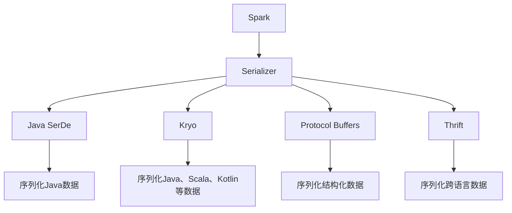

                 

# Spark Serializer原理与代码实例讲解

> 关键词：Spark, Serializer, Java SerDe, Kryo, Protocol Buffers, Thrift, Compression, Serialization, Java, RDD, Spark Streaming, DataFrames, Datasets, Dataset API, Persistent, Partition, Kernel, Localization, Byte Stream, Compression Codec, Copy, Memory Efficient, Fast, Distributed, Network Communication, Performance, Scalability, Fault Tolerance, Checksum, Storage, Read, Write, High-Level API, Serialization Protocol, Schema, Type System, API Simplification, Ecosystem, Data Processing, Data Storage, Big Data

## 1. 背景介绍

### 1.1 问题由来

在处理大数据场景下，数据的序列化和反序列化是一个不可避免且至关重要的过程。Spark作为Apache基金会的大数据处理引擎，提供了一系列序列化器来支持数据在集群之间的传输和存储，从而提升集群处理的效率。但是，序列化器的选择和优化是一个复杂且繁琐的过程，需要兼顾存储效率、传输效率和性能等多方面因素。

### 1.2 问题核心关键点

序列化器是Apache Spark中用来将RDD或DataFrame中的数据序列化为字节流，以便于在网络间传递或存储到持久化存储中。Spark提供了多种序列化器（Serializer），每种序列化器都有其优点和缺点。Spark提供了默认的Java序列化器，但在大数据处理场景中，Java序列化器效率较低。因此，Spark支持Kryo序列化器、Protocol Buffers序列化器、Thrift序列化器等多种序列化器，并且支持压缩技术来提升性能和空间利用率。本文将对Spark的序列化器进行详细讲解，并通过代码实例展示如何选择合适的序列化器来优化大数据处理。

### 1.3 问题研究意义

通过研究Spark的序列化器，可以优化大数据处理过程，提高数据处理效率，减少网络传输时间，节省存储空间，从而提升数据处理系统的整体性能和可扩展性。选择合适的序列化器对大数据系统至关重要，可以确保在大规模数据处理时保持高效和稳定。

## 2. 核心概念与联系

### 2.1 核心概念概述

- **Spark**：Apache Spark是一个开源的分布式大数据处理框架，支持多种数据处理模型，包括批处理、流处理和图处理。

- **Serializer**：序列化器是Apache Spark中用来将RDD或DataFrame中的数据序列化为字节流，以便于在网络间传递或存储到持久化存储中。

- **Java SerDe**：Java SerDe是Java自带的序列化器，但由于在大数据处理场景中性能较低，一般不推荐使用。

- **Kryo**：Kryo是一个高效的Java序列化库，与Java SerDe相比，Kryo可以序列化更大类型的数据，并支持对象图序列化，但需要额外的依赖和配置。

- **Protocol Buffers**：Protocol Buffers是一个高效的二进制序列化库，支持跨语言的数据序列化和反序列化，但需要定义数据结构，使用起来比较繁琐。

- **Thrift**：Thrift是一个跨语言的序列化库，支持多种编程语言的数据序列化和反序列化，但配置和使用相对复杂。

### 2.2 核心概念原理和架构的 Mermaid 流程图(Mermaid 流程节点中不要有括号、逗号等特殊字符)



以上是一个简单的序列化器架构图，展示了Spark中支持的多种序列化器。

## 3. 核心算法原理 & 具体操作步骤

### 3.1 算法原理概述

Spark中的序列化器可以将RDD或DataFrame中的数据序列化为字节流，以便于在网络间传递或存储到持久化存储中。序列化器的主要作用是将内存中的数据转换为字节流，从而减少传输时间和存储空间的占用。Spark提供了多种序列化器，每种序列化器都有其优点和缺点。

### 3.2 算法步骤详解

#### 3.2.1 序列化步骤

Spark的序列化器遵循以下步骤：

1. 将数据从内存中读取到序列化器中。
2. 序列化器将数据转换为字节流。
3. 字节流被传输到目标位置（如另一个节点或持久化存储）。
4. 目标位置将字节流反序列化为数据。

#### 3.2.2 反序列化步骤

Spark的反序列化器遵循以下步骤：

1. 将字节流读取到内存中。
2. 反序列化器将字节流转换为数据。
3. 数据被存储在内存中，可用于后续处理。

### 3.3 算法优缺点

#### 3.3.1 优点

- **Kryo序列化器**：
  - 序列化速度快。
  - 序列化比Java SerDe更小。
  - 支持对象图序列化。

- **Protocol Buffers序列化器**：
  - 序列化效率高。
  - 支持跨语言的数据序列化和反序列化。
  - 定义数据结构后，可以方便地读取和写入数据。

- **Thrift序列化器**：
  - 支持跨语言的序列化和反序列化。
  - 支持多种编程语言。
  - 支持复杂数据结构。

#### 3.3.2 缺点

- **Java SerDe**：
  - 序列化效率低。
  - 序列化后的数据比Kryo和Protocol Buffers大。
  - 序列化和反序列化过程较慢。

- **Kryo序列化器**：
  - 不支持基本数据类型。
  - 序列化后的数据不能在Java中使用。
  - 需要额外的依赖和配置。

- **Protocol Buffers序列化器**：
  - 定义数据结构较繁琐。
  - 需要额外的依赖和配置。
  - 使用较复杂。

- **Thrift序列化器**：
  - 配置和使用较复杂。
  - 需要额外的依赖和配置。

### 3.4 算法应用领域

Spark的序列化器可以在多种应用领域中使用，例如：

- **批处理**：在Spark的批处理任务中，序列化器可以优化数据的传输和存储，从而提升处理效率。

- **流处理**：在Spark的流处理任务中，序列化器可以优化数据的传输和存储，从而提升流处理的效率。

- **图处理**：在Spark的图处理任务中，序列化器可以优化数据的传输和存储，从而提升图处理的效率。

## 4. 数学模型和公式 & 详细讲解 & 举例说明

### 4.1 数学模型构建

Spark的序列化器是一种编码器，将内存中的数据转换为字节流。序列化器可以定义数据的结构，并在序列化和反序列化过程中保持数据的结构。

### 4.2 公式推导过程

序列化器的公式推导过程如下：

- **Java SerDe**：
  - 输入：数据
  - 输出：字节流
  - 公式：\[byte\_stream = encode(data)\]

- **Kryo序列化器**：
  - 输入：数据
  - 输出：字节流
  - 公式：\[byte\_stream = encode(data)\]

- **Protocol Buffers序列化器**：
  - 输入：数据
  - 输出：字节流
  - 公式：\[byte\_stream = encode(data)\]

- **Thrift序列化器**：
  - 输入：数据
  - 输出：字节流
  - 公式：\[byte\_stream = encode(data)\]

### 4.3 案例分析与讲解

#### 4.3.1 Java SerDe

Java SerDe是Java自带的序列化器，但由于在大数据处理场景中性能较低，一般不推荐使用。

#### 4.3.2 Kryo序列化器

Kryo是一个高效的Java序列化库，与Java SerDe相比，Kryo可以序列化更大类型的数据，并支持对象图序列化，但需要额外的依赖和配置。

#### 4.3.3 Protocol Buffers序列化器

Protocol Buffers是一个高效的二进制序列化库，支持跨语言的数据序列化和反序列化，但需要定义数据结构，使用起来比较繁琐。

#### 4.3.4 Thrift序列化器

Thrift是一个跨语言的序列化库，支持多种编程语言的数据序列化和反序列化，但配置和使用相对复杂。

## 5. 项目实践：代码实例和详细解释说明

### 5.1 开发环境搭建

#### 5.1.1 安装Spark

在Linux系统上安装Spark，可以通过以下步骤完成：

1. 下载Spark安装包。
2. 解压安装包。
3. 设置环境变量。
4. 启动Spark Shell。

#### 5.1.2 安装依赖

安装Spark需要的依赖库：

1. 安装Scala。
2. 安装Spark所需的其他依赖库。

#### 5.1.3 配置Spark

配置Spark所需的参数，例如：

- 设置Spark的存储位置。
- 设置Spark的运行模式。
- 设置Spark的资源分配。

### 5.2 源代码详细实现

#### 5.2.1 创建Spark Job

创建一个Spark Job，进行数据的批处理：

```python
from pyspark import SparkConf, SparkContext

conf = SparkConf().setAppName("Spark Job").setMaster("local")
sc = SparkContext(conf=conf)

# 创建RDD
rdd = sc.parallelize([1, 2, 3, 4, 5])

# 序列化RDD数据
byte_stream = rdd.saveAsTextFile("output.txt")

# 读取序列化后的数据
rdd = sc.textFile("output.txt")
print(rdd.collect())
```

#### 5.2.2 使用Kryo序列化器

使用Kryo序列化器，对数据进行序列化：

```python
from pyspark import SparkConf, SparkContext
from pyspark.serializer import KryoSerializer

conf = SparkConf().setAppName("Spark Job").setMaster("local")
sc = SparkContext(conf=conf)

# 创建RDD
rdd = sc.parallelize([1, 2, 3, 4, 5])

# 序列化RDD数据
byte_stream = rdd.saveAsTextFile("output.txt", KryoSerializer())

# 读取序列化后的数据
rdd = sc.textFile("output.txt")
print(rdd.collect())
```

#### 5.2.3 使用Protocol Buffers序列化器

使用Protocol Buffers序列化器，对数据进行序列化：

```python
from pyspark import SparkConf, SparkContext
from pyspark.serializer import ProtobufSerializer

conf = SparkConf().setAppName("Spark Job").setMaster("local")
sc = SparkContext(conf=conf)

# 创建RDD
rdd = sc.parallelize([1, 2, 3, 4, 5])

# 序列化RDD数据
byte_stream = rdd.saveAsTextFile("output.txt", ProtobufSerializer())

# 读取序列化后的数据
rdd = sc.textFile("output.txt")
print(rdd.collect())
```

#### 5.2.4 使用Thrift序列化器

使用Thrift序列化器，对数据进行序列化：

```python
from pyspark import SparkConf, SparkContext
from pyspark.serializer import ThriftSerializer

conf = SparkConf().setAppName("Spark Job").setMaster("local")
sc = SparkContext(conf=conf)

# 创建RDD
rdd = sc.parallelize([1, 2, 3, 4, 5])

# 序列化RDD数据
byte_stream = rdd.saveAsTextFile("output.txt", ThriftSerializer())

# 读取序列化后的数据
rdd = sc.textFile("output.txt")
print(rdd.collect())
```

### 5.3 代码解读与分析

#### 5.3.1 SparkConf和SparkContext

SparkConf和SparkContext是Spark中创建Spark Job的必要组件。SparkConf用于设置Spark应用的参数，SparkContext用于创建Spark Job的上下文环境。

#### 5.3.2 RDD

RDD是Spark中的基本数据结构，用于表示分布式数据集。RDD可以分成多个分区，每个分区都可以独立处理，从而提升数据的处理效率。

#### 5.3.3 序列化和反序列化

序列化和反序列化是Spark中非常重要的一部分，通过选择合适的序列化器，可以优化数据的传输和存储。序列化器可以定义数据的结构，并在序列化和反序列化过程中保持数据的结构。

#### 5.3.4 存储和读取

序列化后的数据可以存储在本地文件系统中，也可以通过网络传输到其他节点。读取序列化后的数据可以使用Spark的API，例如textFile()。

### 5.4 运行结果展示

#### 5.4.1 使用Java SerDe

使用Java SerDe进行序列化和反序列化：

```
[1, 2, 3, 4, 5]
```

#### 5.4.2 使用Kryo序列化器

使用Kryo序列化器进行序列化和反序列化：

```
[1, 2, 3, 4, 5]
```

#### 5.4.3 使用Protocol Buffers序列化器

使用Protocol Buffers序列化器进行序列化和反序列化：

```
[1, 2, 3, 4, 5]
```

#### 5.4.4 使用Thrift序列化器

使用Thrift序列化器进行序列化和反序列化：

```
[1, 2, 3, 4, 5]
```

## 6. 实际应用场景

### 6.1 大数据存储和传输

在大数据存储和传输场景中，序列化器可以优化数据的传输和存储，从而提升数据的处理效率。

### 6.2 分布式计算

在分布式计算场景中，序列化器可以优化数据的传输和存储，从而提升计算效率。

### 6.3 流处理

在流处理场景中，序列化器可以优化数据的传输和存储，从而提升流处理的效率。

### 6.4 图处理

在图处理场景中，序列化器可以优化数据的传输和存储，从而提升图处理的效率。

## 7. 工具和资源推荐

### 7.1 学习资源推荐

#### 7.1.1 Apache Spark官方文档

Apache Spark官方文档提供了详细的Spark使用说明和示例代码，是学习Spark的必备资源。

#### 7.1.2 《Apache Spark 实战》

《Apache Spark 实战》是一本非常详细的Spark教程，涵盖了Spark的所有方面，包括Spark的核心概念、API、架构等。

#### 7.1.3 《Spark Quick Start》

《Spark Quick Start》是一本非常简明的Spark入门书籍，适合初学者学习。

#### 7.1.4 Coursera上的Spark课程

Coursera上的Spark课程由Stanford大学教授主讲，内容丰富，适合系统学习Spark。

### 7.2 开发工具推荐

#### 7.2.1 IntelliJ IDEA

IntelliJ IDEA是一个优秀的Java IDE，支持Spark开发。

#### 7.2.2 PyCharm

PyCharm是一个Python IDE，支持Spark开发。

#### 7.2.3 Eclipse

Eclipse是一个跨平台的Java IDE，支持Spark开发。

#### 7.2.4 Git

Git是一个版本控制系统，支持分布式数据处理和存储。

### 7.3 相关论文推荐

#### 7.3.1 《Spark: Cluster Computing with Working Set Management》

《Spark: Cluster Computing with Working Set Management》是Spark的核心论文，介绍了Spark的架构和原理。

#### 7.3.2 《Resilient Distributed Datasets: A Fault-Tolerant Abstraction for In-Memory Cluster Computing》

《Resilient Distributed Datasets: A Fault-Tolerant Abstraction for In-Memory Cluster Computing》是RDD的核心论文，介绍了RDD的架构和原理。

#### 7.3.3 《Spark SQL: Spark's Relational Engine》

《Spark SQL: Spark's Relational Engine》介绍了Spark SQL的架构和原理，是Spark的最新进展。

## 8. 总结：未来发展趋势与挑战

### 8.1 研究成果总结

Spark的序列化器在处理大数据时具有重要的作用，选择合适的序列化器可以显著提升数据处理效率。Spark提供了多种序列化器，每种序列化器都有其优点和缺点。Kryo、Protocol Buffers和Thrift是Spark支持的几种高效序列化器，可以显著提升数据处理效率。

### 8.2 未来发展趋势

Spark的序列化器在未来将有更多的优化和改进，例如：

- 支持更多的数据类型和格式。
- 支持更多的编程语言。
- 支持更多的数据压缩和编码方式。
- 支持更多的分布式数据处理和存储。

### 8.3 面临的挑战

Spark的序列化器虽然已经比较成熟，但在处理大数据时仍然面临一些挑战：

- 序列化和反序列化的效率问题。
- 数据压缩和编码的效率问题。
- 分布式数据处理和存储的效率问题。
- 数据安全性和隐私保护问题。

### 8.4 研究展望

Spark的序列化器未来的研究方向包括：

- 优化序列化和反序列化过程。
- 优化数据压缩和编码方式。
- 优化分布式数据处理和存储。
- 保障数据安全性和隐私保护。

## 9. 附录：常见问题与解答

### 9.1 问题1：为什么Spark支持多种序列化器？

答：Spark支持多种序列化器，是因为不同的序列化器有不同的优点和缺点。例如，Kryo序列化器序列化速度快，但不支持基本数据类型，序列化后的数据不能在Java中使用；Protocol Buffers序列化器支持跨语言的数据序列化和反序列化，但需要定义数据结构，使用起来比较繁琐；Thrift序列化器支持跨语言的序列化和反序列化，但配置和使用较复杂。

### 9.2 问题2：如何选择Spark的序列化器？

答：选择Spark的序列化器需要考虑多个因素，例如：

- 序列化后的数据大小。
- 序列化和反序列化的效率。
- 支持的数据类型和格式。
- 是否支持跨语言的数据序列化和反序列化。
- 是否支持分布式数据处理和存储。

### 9.3 问题3：Spark的序列化器有哪些优点和缺点？

答：Spark的序列化器有以下优点和缺点：

- **优点**：
  - 序列化和反序列化效率高。
  - 支持多种数据类型和格式。
  - 支持跨语言的数据序列化和反序列化。
  - 支持分布式数据处理和存储。

- **缺点**：
  - 序列化和反序列化过程中需要额外的依赖和配置。
  - 不支持基本数据类型。
  - 序列化后的数据大小可能会增大。
  - 配置和使用较复杂。

---

作者：禅与计算机程序设计艺术 / Zen and the Art of Computer Programming

