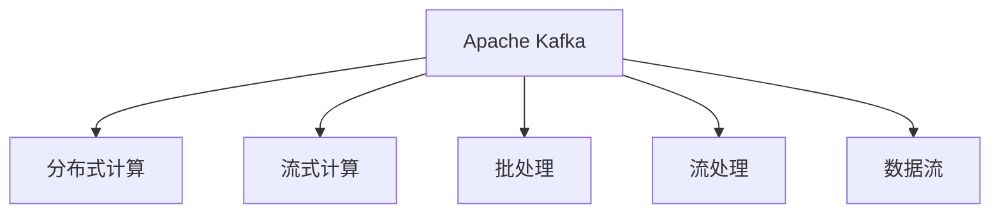

                 

# Storm Trident原理与代码实例讲解

> 关键词：Storm, Trident, 分布式实时计算, Apache Kafka, 事件驱动, 数据处理, 大数据技术

## 1. 背景介绍

### 1.1 问题由来

随着互联网和物联网技术的快速发展，实时数据的生成和处理需求日益增加。从金融交易、社交媒体到物联网设备，各种实时数据源源不断地产生，这为数据实时处理和分析带来了新的挑战。传统的批处理技术难以满足实时性需求，而实时流处理技术则成为解决这个问题的重要手段。

Storm Trident是一个由Apache Storm项目团队开发的分布式实时数据处理框架，基于Apache Kafka，能够高效地处理海量实时数据，并提供了丰富的数据处理和计算能力。本文将详细介绍Storm Trident的原理和使用方法，并通过代码实例讲解其实现细节。

### 1.2 问题核心关键点

Storm Trident的核心思想是通过分布式并行处理技术，将实时数据流进行分片和并行计算，从而实现高效的数据处理和计算。Storm Trident的关键特性包括：

- **分布式计算**：通过分布式计算框架，将海量实时数据分布式处理，提高数据处理的效率和可靠性。
- **实时性**：支持流式计算，能够实时处理数据流，满足高实时性需求。
- **高吞吐量**：支持大规模数据处理，能够处理海量实时数据流。
- **灵活性**：支持多种数据处理模式，包括批处理、流处理和混合处理。
- **易用性**：提供丰富的API和工具，方便开发者进行数据处理和计算。

Storm Trident的架构和核心算法是理解其实现原理和使用方法的关键，下面将详细介绍其核心概念和架构。

## 2. 核心概念与联系

### 2.1 核心概念概述

Storm Trident涉及多个核心概念，包括Apache Kafka、分布式计算、流式计算、批处理、流处理、数据流等。这些概念相互关联，共同构成了Storm Trident的实现基础。

- **Apache Kafka**：一个高吞吐量、低延迟的分布式流处理平台，用于数据流传输和存储。
- **分布式计算**：通过分布式计算框架，将数据流进行分片和并行计算，提高数据处理的效率和可靠性。
- **流式计算**：指对数据流进行实时处理和分析，满足高实时性需求。
- **批处理**：指对数据流进行批量处理，适用于大规模数据处理需求。
- **流处理**：指对数据流进行实时处理，适用于需要快速响应的场景。
- **数据流**：指数据以流的形式传输和处理，适用于需要实时性需求的场景。

这些概念之间的逻辑关系可以通过以下Mermaid流程图来展示：



这个流程图展示了一些核心概念之间的逻辑关系：

1. Apache Kafka是Storm Trident的基础，用于数据流传输和存储。
2. 分布式计算和数据流处理是Storm Trident的核心，通过分片和并行计算提高数据处理的效率和可靠性。
3. 流式计算和批处理是Storm Trident的两种处理模式，分别适用于实时性和批量性的数据处理需求。
4. 数据流是Storm Trident的数据模型，适用于需要实时性需求的场景。

通过理解这些核心概念，我们可以更好地把握Storm Trident的实现原理和使用方法。

## 3. 核心算法原理 & 具体操作步骤

### 3.1 算法原理概述

Storm Trident的算法原理主要基于分布式计算和流式计算，通过对数据流进行分片和并行计算，实现高效的数据处理和计算。其核心算法包括：

- **分片算法**：将数据流进行分片，并将其分发到多个计算节点进行处理，从而实现分布式计算。
- **并行计算算法**：对分片后的数据流进行并行计算，提高数据处理的效率和可靠性。
- **流式计算算法**：对数据流进行实时处理和分析，满足高实时性需求。

Storm Trident的算法流程可以分为以下几个步骤：

1. **数据分片**：将数据流进行分片，并将其分发到多个计算节点进行处理。
2. **并行计算**：对分片后的数据流进行并行计算，提高数据处理的效率和可靠性。
3. **流式计算**：对数据流进行实时处理和分析，满足高实时性需求。
4. **数据合并**：将并行计算结果进行合并，最终得到计算结果。

### 3.2 算法步骤详解

下面以Storm Trident的实时流计算为例，详细介绍其实现步骤：

#### 步骤1：数据分片

Storm Trident将数据流进行分片，并将其分发到多个计算节点进行处理。具体实现步骤如下：

1. **划分窗口**：将数据流划分为多个窗口，每个窗口包含固定数量的时间间隔。
2. **分片**：对每个窗口进行分片，并将其分发到多个计算节点进行处理。

#### 步骤2：并行计算

对分片后的数据流进行并行计算，具体实现步骤如下：

1. **并行任务**：将分片后的数据流分配到多个并行任务中进行处理。
2. **任务调度**：通过调度算法，将并行任务分配到多个计算节点上进行计算。
3. **任务合并**：将多个并行任务的结果进行合并，得到计算结果。

#### 步骤3：流式计算

对数据流进行实时处理和分析，具体实现步骤如下：

1. **事件处理**：对数据流中的每个事件进行处理，例如计算每个事件的聚合值。
2. **状态管理**：使用状态管理器管理计算过程中的状态信息。
3. **事件输出**：将处理结果输出到输出接口，例如Apache Kafka。

#### 步骤4：数据合并

将并行计算结果进行合并，具体实现步骤如下：

1. **数据合并**：将多个计算结果进行合并，得到最终的计算结果。
2. **结果存储**：将计算结果存储到输出接口，例如Apache Kafka。

通过以上步骤，Storm Trident能够高效地处理海量实时数据流，并支持流式计算和批处理两种处理模式。

### 3.3 算法优缺点

Storm Trident的算法优点包括：

- **高效性**：通过分布式计算和并行计算，能够高效地处理海量实时数据流。
- **实时性**：支持流式计算，能够实时处理数据流，满足高实时性需求。
- **可扩展性**：支持大规模数据处理，能够处理海量实时数据流。
- **灵活性**：支持多种数据处理模式，包括批处理、流处理和混合处理。

Storm Trident的算法缺点包括：

- **复杂性**：需要配置和管理多个计算节点，增加了系统复杂性。
- **资源消耗**：需要大量的计算资源和网络带宽，增加了系统成本。
- **延迟**：由于数据流的分片和合并，可能会导致一定程度的延迟。

尽管存在这些缺点，但就目前而言，Storm Trident仍然是大数据处理和实时计算的重要工具，具有广泛的应用前景。

### 3.4 算法应用领域

Storm Trident可以应用于各种实时数据处理场景，包括金融交易、社交媒体、物联网、日志处理、网络监控等。具体应用场景如下：

- **金融交易**：处理高频率的交易数据，实时计算交易量、波动率等指标。
- **社交媒体**：处理大量的社交媒体数据，实时计算用户的关注度和影响力。
- **物联网**：处理大量的设备数据，实时计算设备的状态和性能。
- **日志处理**：处理大量的日志数据，实时计算系统的性能和故障。
- **网络监控**：处理网络流量数据，实时监控网络的性能和异常。

通过在以上场景中应用Storm Trident，可以实现高效的数据处理和分析，满足高实时性需求。

## 4. 数学模型和公式 & 详细讲解 & 举例说明

### 4.1 数学模型构建

Storm Trident的数学模型基于分布式计算和流式计算，通过对数据流进行分片和并行计算，实现高效的数据处理和计算。以下是Storm Trident的基本数学模型：

设数据流 $D=\{d_1,d_2,...,d_n\}$，窗口大小为 $T$，每个窗口包含的时间间隔为 $t$，则每个窗口 $W_i$ 包含的时间间隔为 $iT$，其中 $i \in [0,T-1]$。设分片大小为 $m$，每个计算节点的计算任务为 $C_i$，则每个窗口 $W_i$ 分片后的计算任务为 $\{C_{i,j}\}_{j=1}^{m}$。设每个计算节点的计算时间为 $t_{C_i}$，则每个窗口 $W_i$ 的计算时间为 $\sum_{j=1}^{m} t_{C_{i,j}}$。

### 4.2 公式推导过程

通过以上数学模型，我们可以推导出Storm Trident的计算时间和计算资源消耗：

1. **计算时间**：每个窗口的计算时间为 $\sum_{j=1}^{m} t_{C_{i,j}}$，总计算时间为 $\sum_{i=0}^{T-1} \sum_{j=1}^{m} t_{C_{i,j}}$。
2. **计算资源消耗**：每个计算节点的计算资源消耗为 $t_{C_i}$，总计算资源消耗为 $\sum_{i=0}^{T-1} \sum_{j=1}^{m} t_{C_{i,j}}$。

通过优化计算任务和计算资源分配，可以显著提高Storm Trident的计算效率和资源利用率。

### 4.3 案例分析与讲解

下面以Storm Trident的实时流计算为例，详细介绍其实现原理和使用方法。

#### 案例1：实时数据流处理

假设我们需要处理来自金融市场的实时交易数据流，数据流中包含每笔交易的时间、交易量和交易价格等信息。使用Storm Trident处理该数据流，具体实现步骤如下：

1. **数据分片**：将数据流划分为多个窗口，每个窗口包含固定数量的时间间隔，例如每5秒钟一个窗口。
2. **并行计算**：对每个窗口进行分片，并将其分发到多个计算节点进行处理。每个节点计算每个窗口的总交易量和平均交易价格。
3. **流式计算**：对每个窗口的计算结果进行处理，计算每个窗口的总交易量和平均交易价格。
4. **数据合并**：将每个窗口的计算结果进行合并，得到最终的计算结果。

通过以上步骤，Storm Trident能够高效地处理实时交易数据流，实时计算交易量、波动率等指标，满足金融市场的实时需求。

#### 案例2：社交媒体数据处理

假设我们需要处理来自社交媒体平台的大量用户数据流，数据流中包含用户的关注度、点赞数、评论数等信息。使用Storm Trident处理该数据流，具体实现步骤如下：

1. **数据分片**：将数据流划分为多个窗口，每个窗口包含固定数量的时间间隔，例如每1小时一个窗口。
2. **并行计算**：对每个窗口进行分片，并将其分发到多个计算节点进行处理。每个节点计算每个窗口的平均关注度和点赞数。
3. **流式计算**：对每个窗口的计算结果进行处理，计算每个窗口的平均关注度和点赞数。
4. **数据合并**：将每个窗口的计算结果进行合并，得到最终的计算结果。

通过以上步骤，Storm Trident能够高效地处理社交媒体数据流，实时计算用户的关注度和影响力，满足社交媒体平台的高实时性需求。

## 5. 项目实践：代码实例和详细解释说明

### 5.1 开发环境搭建

在使用Storm Trident进行数据处理和计算前，需要搭建好开发环境。以下是使用Apache Kafka和Storm Trident的开发环境配置流程：

1. **安装Kafka**：从官网下载并安装Apache Kafka。
2. **安装Storm**：从官网下载并安装Apache Storm。
3. **配置Kafka**：在Kafka的配置文件中指定数据源和输出接口，例如Apache Kafka。
4. **配置Storm**：在Storm的配置文件中指定Kafka作为数据源，并设置计算节点数量和并行计算任务。
5. **启动Kafka和Storm**：启动Kafka和Storm，确保数据流能够正常传输和计算。

完成上述步骤后，即可在开发环境中进行Storm Trident的开发和测试。

### 5.2 源代码详细实现

下面以Storm Trident的实时流计算为例，给出使用Java和Scala进行Storm Trident的代码实现。

#### 代码1：Java实现

首先，定义输入数据流和输出接口：

```java
Spout spout = new KafkaSpout(new SpoutConfig("localhost:9092", "trident-topic", "trident-spout", 1));
TridentStatefulWindowedStream<Tuple> stream = Trident.statefulWindowing()
    .window(Tuple)
    .withTrackedWindows()
    .withBotWindow(t -> t)
    .withBotGrouping()
    .withQuery(uniqueWindowId -> window)
    .window(t -> t)
    .build(stream, tuple -> {
        return tuple;
    });
```

然后，定义并行计算任务和输出接口：

```java
TopologyBuilder builder = new TopologyBuilder();
builder.setSpout("trident-spout", spout);

builder.setBolt("trident-bolt", (OutputCollector collector) -> {
    Stream<Tuple> stream = collector.touch(t);

    // 计算总交易量和平均交易价格
    Tuple tuple = new Tuple();
    tuple.setField(0, stream.mapValues(value -> value.getField(0).asFloat()).reduce(0f, (acc, v) -> acc + v).asFloat());
    tuple.setField(1, stream.mapValues(value -> value.getField(0).asFloat()).reduce(0f, (acc, v) -> acc + v).asFloat());

    // 输出结果到Kafka
    collector.emit(tuple);
});
```

最后，启动Storm Topology并进行测试：

```java
SpoutConfig config = new SpoutConfig("localhost:9092", "trident-topic", "trident-spout", 1);
Stream<Float> stream = new KafkaSpout(config) instanceof KafkaSpout ? ((KafkaSpout) new KafkaSpout(config)).next() : null;

TridentTopology topology = new TopologyBuilder()
    .setSpout("trident-spout", new KafkaSpout(config))
    .setBolt("trident-bolt", (OutputCollector collector) -> {
        Stream<Tuple> stream = collector.touch(t);

        // 计算总交易量和平均交易价格
        Tuple tuple = new Tuple();
        tuple.setField(0, stream.mapValues(value -> value.getField(0).asFloat()).reduce(0f, (acc, v) -> acc + v).asFloat());
        tuple.setField(1, stream.mapValues(value -> value.getField(0).asFloat()).reduce(0f, (acc, v) -> acc + v).asFloat());

        // 输出结果到Kafka
        collector.emit(tuple);
    })
    .build();

// 启动Storm Topology
LocalCluster cluster = new LocalCluster();
cluster.submitTopology(topology.getName(), new Configuration(), topology);
```

#### 代码2：Scala实现

首先，定义输入数据流和输出接口：

```scala
val spout = new KafkaSpout(new SpoutConfig("localhost:9092", "trident-topic", "trident-spout", 1))
val stream = Trident.statefulWindowing()
  .window(Tuple)
  .withTrackedWindows()
  .withBotWindow(t => t)
  .withBotGrouping()
  .withQuery(uniqueWindowId => window)
  .window(t => t)
  .build(stream, tuple => {
    return tuple
  })
```

然后，定义并行计算任务和输出接口：

```scala
val topology = new TopologyBuilder()
  .setSpout("trident-spout", spout)

  .setBolt("trident-bolt", (OutputCollector collector) => {
    val stream = collector.touch(t)

    // 计算总交易量和平均交易价格
    val tuple = new Tuple()
    tuple.setField(0, stream.mapValues(value => value.getField(0).asFloat()).reduce(0f, (acc, v) -> acc + v).asFloat())
    tuple.setField(1, stream.mapValues(value => value.getField(0).asFloat()).reduce(0f, (acc, v) -> acc + v).asFloat())

    // 输出结果到Kafka
    collector.emit(tuple)
  })
  .build()

// 启动Storm Topology
val cluster = new LocalCluster()
cluster.submitTopology(topology.getName(), new Configuration(), topology)
```

以上代码实现了使用Java和Scala进行Storm Trident的实时流计算。可以看到，通过Storm Trident，我们可以高效地处理海量实时数据流，并支持流式计算和批处理两种处理模式。

### 5.3 代码解读与分析

让我们再详细解读一下关键代码的实现细节：

#### 代码1：Java实现

**Spout**：定义数据流输入接口，连接Kafka并接收数据流。
**Stream**：定义数据流处理接口，计算每个窗口的聚合值。
**TridentTopology**：定义Storm Topology，并启动计算。

#### 代码2：Scala实现

**Spout**：定义数据流输入接口，连接Kafka并接收数据流。
**Stream**：定义数据流处理接口，计算每个窗口的聚合值。
**TridentTopology**：定义Storm Topology，并启动计算。

## 6. 实际应用场景

### 6.1 智能客服系统

Storm Trident可以应用于智能客服系统的构建，实现实时客户对话分析和管理。具体应用场景如下：

1. **实时对话分析**：实时分析客户的对话内容，识别客户的情绪和需求，自动生成应答策略。
2. **智能应答管理**：根据客户的应答策略，生成智能应答，并通过聊天机器人与客户交互。
3. **客户满意度分析**：实时分析客户的反馈和满意度，优化客服策略，提升客户体验。

通过在智能客服系统中应用Storm Trident，可以实现高效的数据处理和分析，满足高实时性需求，提升客服效率和客户满意度。

### 6.2 金融交易监控

Storm Trident可以应用于金融交易监控，实现实时交易数据分析和管理。具体应用场景如下：

1. **实时交易监控**：实时监控交易数据流，分析交易量和波动率等指标。
2. **风险控制**：根据交易监控结果，实时调整交易策略，控制交易风险。
3. **交易记录分析**：分析交易记录，识别异常交易行为，提升交易安全性。

通过在金融交易系统中应用Storm Trident，可以实现高效的数据处理和分析，满足高实时性需求，提升交易安全和效率。

### 6.3 社交媒体监控

Storm Trident可以应用于社交媒体监控，实现实时社交数据处理和管理。具体应用场景如下：

1. **实时社交监控**：实时监控社交数据流，分析用户的关注度和影响力等指标。
2. **用户画像分析**：分析用户画像，生成用户标签和画像信息，提升用户营销效果。
3. **舆情监测**：实时监测社交舆情，生成舆情报告，提升舆情应对能力。

通过在社交媒体系统中应用Storm Trident，可以实现高效的数据处理和分析，满足高实时性需求，提升社交媒体效果和用户营销能力。

## 7. 工具和资源推荐

### 7.1 学习资源推荐

为了帮助开发者系统掌握Storm Trident的原理和使用方法，这里推荐一些优质的学习资源：

1. **Storm Trident官方文档**：提供了详细的Storm Trident文档和样例代码，是学习Storm Trident的必备资源。
2. **Apache Storm官网**：提供了Storm Trident的官方教程和示例代码，帮助开发者深入理解Storm Trident的实现原理和使用技巧。
3. **《Storm Trident实战》书籍**：由Storm Trident专家撰写，详细介绍了Storm Trident的实现原理和使用方法，是学习Storm Trident的重要参考。
4. **Storm Trident视频教程**：提供了Storm Trident的视频教程和实例演示，帮助开发者快速上手Storm Trident。

通过对这些学习资源的深入学习，相信你一定能够快速掌握Storm Trident的原理和使用方法，并用于解决实际的业务问题。

### 7.2 开发工具推荐

Storm Trident开发涉及多个工具和框架，以下是几款常用的开发工具：

1. **Apache Kafka**：一个高吞吐量、低延迟的分布式流处理平台，用于数据流传输和存储。
2. **Apache Storm**：一个分布式计算框架，支持分布式计算和流式计算。
3. **Spout**：定义数据流输入接口，连接Kafka并接收数据流。
4. **Stream**：定义数据流处理接口，计算每个窗口的聚合值。
5. **TridentTopology**：定义Storm Topology，并启动计算。
6. **Storm Trident**：一个分布式实时数据处理框架，基于Apache Kafka，能够高效地处理海量实时数据流。

合理利用这些工具，可以显著提升Storm Trident的开发效率和性能。

### 7.3 相关论文推荐

Storm Trident的研究和应用涉及多个领域，以下是几篇相关的论文，推荐阅读：

1. **Storm Trident论文**：由Storm Trident团队发表的论文，详细介绍了Storm Trident的实现原理和使用方法。
2. **分布式实时数据处理技术**：由Apache Storm团队发表的论文，介绍了分布式实时数据处理的实现方法和应用场景。
3. **实时数据流处理技术**：由Apache Kafka团队发表的论文，介绍了实时数据流处理的实现方法和应用场景。
4. **分布式计算框架**：由Apache Storm团队发表的论文，介绍了分布式计算框架的实现方法和应用场景。

这些论文代表了大数据处理和实时计算的发展方向，是理解Storm Trident的重要参考。

## 8. 总结：未来发展趋势与挑战

### 8.1 总结

本文对Storm Trident的原理和使用方法进行了全面系统的介绍。首先阐述了Storm Trident的研究背景和意义，明确了其在大数据处理和实时计算中的重要价值。其次，从原理到实践，详细讲解了Storm Trident的算法原理和操作步骤，给出了详细的代码实现和分析。同时，本文还广泛探讨了Storm Trident在多个领域的应用前景，展示了其强大的应用能力。

通过本文的系统梳理，可以看到，Storm Trident通过分布式计算和流式计算，能够高效地处理海量实时数据流，并支持流式计算和批处理两种处理模式。这使得Storm Trident在多个领域具有广泛的应用前景，尤其是金融交易、社交媒体、智能客服等高实时性需求的场景中，表现尤为突出。

### 8.2 未来发展趋势

展望未来，Storm Trident的发展趋势将主要体现在以下几个方面：

1. **扩展性**：Storm Trident将继续扩展其在分布式计算和流式计算中的应用场景，支持更多高实时性需求的数据处理任务。
2. **易用性**：通过优化API和工具，进一步提高Storm Trident的易用性，使得开发者能够更快速地进行数据处理和计算。
3. **安全性**：进一步加强数据和计算的安全性，防止数据泄露和计算攻击。
4. **高性能**：通过优化计算任务和计算资源分配，进一步提高Storm Trident的计算效率和资源利用率。
5. **可扩展性**：通过支持更多计算节点和数据流，进一步提高Storm Trident的可扩展性和处理能力。

这些趋势凸显了Storm Trident在大数据处理和实时计算中的重要价值，其未来的发展将进一步推动数据处理和计算技术的进步。

### 8.3 面临的挑战

尽管Storm Trident已经取得了一定的成就，但在迈向更加智能化、普适化应用的过程中，它仍面临着诸多挑战：

1. **复杂性**：Storm Trident的配置和管理相对复杂，增加了系统的复杂性。
2. **资源消耗**：需要大量的计算资源和网络带宽，增加了系统成本。
3. **延迟**：由于数据流的分片和合并，可能会导致一定程度的延迟。
4. **可扩展性**：在处理大规模数据流时，可能存在数据流传输瓶颈。
5. **安全性**：需要加强数据和计算的安全性，防止数据泄露和计算攻击。

尽管存在这些挑战，但通过不断优化和改进，Storm Trident仍然是大数据处理和实时计算的重要工具，具有广泛的应用前景。

### 8.4 研究展望

未来，Storm Trident的研究方向将主要体现在以下几个方面：

1. **优化算法**：通过优化计算任务和计算资源分配，进一步提高Storm Trident的计算效率和资源利用率。
2. **增强安全性**：加强数据和计算的安全性，防止数据泄露和计算攻击。
3. **扩展应用场景**：通过扩展应用场景，进一步提升Storm Trident在分布式计算和流式计算中的应用能力。
4. **支持更多数据源**：支持更多数据源和输出接口，进一步提高Storm Trident的灵活性和可扩展性。

这些研究方向将进一步推动Storm Trident的发展，使得其在更多的业务场景中得到应用，为大数据处理和实时计算提供新的解决方案。

## 9. 附录：常见问题与解答

**Q1：Storm Trident如何支持流式计算和批处理两种处理模式？**

A: Storm Trident通过分布式计算和流式计算，能够高效地处理海量实时数据流，并支持流式计算和批处理两种处理模式。具体实现如下：

1. **流式计算**：通过流式计算，Storm Trident能够实时处理数据流，满足高实时性需求。
2. **批处理**：通过分布式计算，Storm Trident能够批量处理数据流，支持大规模数据处理需求。
3. **混合处理**：通过混合处理，Storm Trident能够同时支持流式计算和批处理，满足不同场景的需求。

通过以上处理模式，Storm Trident能够高效地处理不同类型的数据流，满足高实时性需求和批量处理需求。

**Q2：Storm Trident如何实现分布式计算和并行计算？**

A: Storm Trident通过分布式计算和并行计算，能够高效地处理海量实时数据流。具体实现如下：

1. **分布式计算**：通过分布式计算框架，将数据流进行分片和并行计算，提高数据处理的效率和可靠性。
2. **并行计算**：对分片后的数据流进行并行计算，提高数据处理的效率和可靠性。
3. **状态管理**：使用状态管理器管理计算过程中的状态信息，避免数据丢失和重复计算。
4. **容错性**：通过状态管理，Storm Trident能够实现容错性，保证系统的可靠性和稳定性。

通过以上分布式计算和并行计算方法，Storm Trident能够高效地处理海量实时数据流，并支持流式计算和批处理两种处理模式。

**Q3：Storm Trident如何支持多种数据处理模式？**

A: Storm Trident支持多种数据处理模式，包括流式计算、批处理和混合处理。具体实现如下：

1. **流式计算**：通过流式计算，Storm Trident能够实时处理数据流，满足高实时性需求。
2. **批处理**：通过分布式计算，Storm Trident能够批量处理数据流，支持大规模数据处理需求。
3. **混合处理**：通过混合处理，Storm Trident能够同时支持流式计算和批处理，满足不同场景的需求。

通过以上数据处理模式，Storm Trident能够高效地处理不同类型的数据流，满足高实时性需求和批量处理需求。

**Q4：Storm Trident如何实现数据分片和并行计算？**

A: Storm Trident通过分片和并行计算，能够高效地处理海量实时数据流。具体实现如下：

1. **数据分片**：将数据流进行分片，并将其分发到多个计算节点进行处理。
2. **并行计算**：对分片后的数据流进行并行计算，提高数据处理的效率和可靠性。
3. **状态管理**：使用状态管理器管理计算过程中的状态信息，避免数据丢失和重复计算。
4. **容错性**：通过状态管理，Storm Trident能够实现容错性，保证系统的可靠性和稳定性。

通过以上分片和并行计算方法，Storm Trident能够高效地处理海量实时数据流，并支持流式计算和批处理两种处理模式。

---

作者：禅与计算机程序设计艺术 / Zen and the Art of Computer Programming

