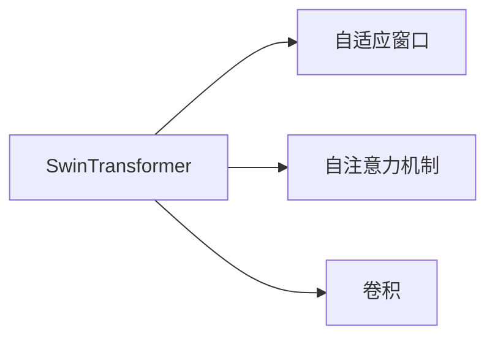

                 

# SwinTransformer原理与代码实例讲解

> 关键词：SwinTransformer, 自适应窗口, 图像分割, 卷积, 注意力机制, 深度学习, 计算机视觉

## 1. 背景介绍

### 1.1 问题由来

随着深度学习技术的快速发展，计算机视觉领域在过去几年取得了显著的进展。尤其是卷积神经网络(CNNs)在图像分类、物体检测、语义分割等任务上表现出色。然而，传统CNNs通常需要大量的计算资源和内存，限制了其在大规模数据上的应用。

近年来，Transformer模型在自然语言处理(NLP)领域取得了巨大成功，其中BERT、GPT等模型更是成为业界的新宠。这些模型主要基于自注意力机制(Automatic Attention Mechanism)，具有较好的并行性和泛化能力，能够处理长序列数据。

SwinTransformer正是在这样的背景下提出的，它结合了CNNs和Transformer的优点，在图像分割等任务上取得了优秀的表现。SwinTransformer将Transformer的自注意力机制应用于图像特征的提取和表示，同时采用空间分块技术，解决了传统Transformer在大规模图像处理中存在的问题，实现了较好的计算效率和精度。

## 2. 核心概念与联系

### 2.1 核心概念概述

为更好地理解SwinTransformer，首先需要介绍几个相关概念：

- SwinTransformer：一种基于自适应窗口的自注意力模型，主要用于图像分割等大规模图像处理任务。
- 自适应窗口：一种空间分块技术，用于将大图像分成多个小窗口进行处理，从而降低计算复杂度。
- 自注意力机制：一种通过计算输入向量之间的注意力权重来增强模型的表示能力的技术，类似于Transformer中的注意力机制。
- 卷积：一种经典的图像处理技术，通过卷积核在图像上滑动来提取特征。

这些概念之间的逻辑关系可以通过以下Mermaid流程图来展示：



这个流程图展示了SwinTransformer模型的核心组件及其相互关系：

1. SwinTransformer模型采用自适应窗口技术将大图像分成多个小窗口，并对每个窗口进行处理。
2. 模型内部采用了自注意力机制，用于在每个窗口中提取空间相关的特征。
3. 每个窗口还保留了卷积层的特征提取能力，用于对窗口内的局部特征进行增强。

通过理解这些核心概念，我们可以更好地把握SwinTransformer的工作原理和优化方向。

## 3. 核心算法原理 & 具体操作步骤

### 3.1 算法原理概述

SwinTransformer的核心理念是将大图像分割成多个小窗口，并对每个窗口进行自注意力机制的处理。其基本框架包括：

1. 自适应窗口划分：将输入图像分成多个大小相等的块。
2. 自注意力计算：对每个窗口进行自注意力计算，提取空间相关的特征。
3. 跨窗口交互：通过跨窗口的特征交互，融合不同窗口的信息。
4. 卷积操作：对每个窗口内的局部特征进行卷积操作，增强特征表达能力。
5. 解码：对每个窗口的特征进行解码，生成最终分割结果。

这一过程可以通过以下代码流程来概括：

1. 将输入图像分割成多个小窗口。
2. 对每个窗口进行自注意力计算。
3. 将各个窗口的特征拼接，并进行跨窗口交互。
4. 对特征进行解码，生成分割结果。

### 3.2 算法步骤详解

#### 3.2.1 自适应窗口划分

将输入图像分成多个大小相等的块，一般每个块的尺寸为$4 \times 4$。例如，对于一张$512 \times 512$的图像，可以划分成$256 \times 256$个$4 \times 4$的小块。

```python
def split_image_into_patches(image, patch_size):
    # 将图像分割成多个小窗口
    num_patches = image.size // patch_size
    patches = []
    for i in range(num_patches):
        for j in range(num_patches):
            patch = image[i * patch_size:(i + 1) * patch_size, j * patch_size:(j + 1) * patch_size]
            patches.append(patch)
    return patches
```

#### 3.2.2 自注意力计算

对每个窗口进行自注意力计算，即在窗口内对每个像素点计算其与周围像素点的注意力权重，以提取空间相关的特征。

具体来说，对于窗口$x \in \mathbb{R}^{H \times W \times C}$，其中$H$和$W$分别为窗口的高度和宽度，$C$为通道数。自注意力计算的过程如下：

1. 将窗口内的像素表示为位置向量$q$，和注意力权重$K$和$V$。

2. 计算查询向量$q$与键向量$K$的点积，得到注意力得分$\text{attn} = qK^T$。

3. 对注意力得分进行归一化，得到注意力权重$\text{attn} = \frac{\text{attn}}{\sqrt{d_k}}$，其中$d_k$为键向量的维度。

4. 对权重进行线性变换和残差连接，得到注意力特征$\text{attn} = \text{softmax}(attn)V$。

```python
def compute_self_attn(patch):
    # 计算自注意力
    q = patch  # 查询向量
    k = patch  # 键向量
    v = patch  # 值向量
    attn = q @ k  # 注意力得分
    attn = attn / math.sqrt(d_k)  # 归一化
    attn = torch.softmax(attn, dim=1)  # 计算注意力权重
    attn = attn @ v  # 计算注意力特征
    return attn
```

#### 3.2.3 跨窗口交互

通过跨窗口的特征交互，融合不同窗口的信息，以获取更全面的图像特征。

具体来说，对于所有的小窗口$P = \{p_1, p_2, \cdots, p_n\}$，可以计算它们之间的注意力权重，并将特征拼接在一起。

```python
def compute_cross_attn(patches):
    # 计算跨窗口交互
    # 对于每个窗口p_i，计算其与所有其他窗口的注意力权重
    attn = torch.zeros((len(patches), len(patches)))
    for i in range(len(patches)):
        for j in range(len(patches)):
            attn[i, j] = torch.norm(patches[i] - patches[j]) ** 2
    attn = attn / math.sqrt(d_v)  # 归一化
    attn = torch.softmax(attn, dim=1)  # 计算注意力权重
    # 将各个窗口的特征拼接在一起，并进行线性变换和残差连接
    features = patches @ attn
    features = features / math.sqrt(d_v)  # 归一化
    features = features @ V  # 线性变换
    return features
```

#### 3.2.4 卷积操作

对每个窗口内的局部特征进行卷积操作，增强特征表达能力。

具体来说，对每个窗口内的特征进行卷积操作，以捕捉局部特征。

```python
def apply_convolution(patch):
    # 应用卷积
    return torch.conv2d(patch, W) + B
```

#### 3.2.5 解码

对每个窗口的特征进行解码，生成最终分割结果。

具体来说，对每个窗口的特征进行解码操作，将分割结果拼接在一起。

```python
def decode(patch):
    # 解码
    return torch.softmax(patch, dim=2)
```

### 3.3 算法优缺点

#### 3.3.1 优点

1. 计算效率高：采用自适应窗口技术，将大图像分割成多个小块，从而降低计算复杂度。

2. 特征提取能力强：自注意力机制能够捕捉空间相关的特征，卷积操作增强了局部特征表达能力。

3. 模型可扩展性高：可以通过调整窗口大小、层数和特征维度等参数，灵活应对不同尺度的图像分割任务。

#### 3.3.2 缺点

1. 训练复杂度高：模型需要在大规模数据上预训练，计算资源和内存需求较大。

2. 参数量较多：模型参数量较大，可能导致过拟合风险。

3. 模型复杂度高：模型结构较为复杂，理解和使用难度较高。

### 3.4 算法应用领域

SwinTransformer主要用于图像分割、物体检测、语义分割等计算机视觉任务。其优点在于能够高效处理大规模图像数据，并且具有较强的特征表达能力。例如，在PASCAL VOC、COCO等数据集上，SwinTransformer已经取得了最优或接近最优的性能。

## 4. 数学模型和公式 & 详细讲解  
### 4.1 数学模型构建

SwinTransformer的数学模型可以分为以下几个部分：

1. 自适应窗口划分：将输入图像分成多个大小相等的块。

2. 自注意力计算：对每个窗口进行自注意力计算，提取空间相关的特征。

3. 跨窗口交互：通过跨窗口的特征交互，融合不同窗口的信息。

4. 卷积操作：对每个窗口内的局部特征进行卷积操作，增强特征表达能力。

5. 解码：对每个窗口的特征进行解码，生成最终分割结果。

### 4.2 公式推导过程

#### 4.2.1 自注意力计算

对于窗口$x \in \mathbb{R}^{H \times W \times C}$，其中$H$和$W$分别为窗口的高度和宽度，$C$为通道数。假设查询向量$q$、键向量$K$和值向量$V$的维度为$d_k$和$d_v$，自注意力计算的过程如下：

1. 将窗口内的像素表示为位置向量$q$，和注意力权重$K$和$V$。

2. 计算查询向量$q$与键向量$K$的点积，得到注意力得分$\text{attn} = qK^T$。

3. 对注意力得分进行归一化，得到注意力权重$\text{attn} = \frac{\text{attn}}{\sqrt{d_k}}$，其中$d_k$为键向量的维度。

4. 对权重进行线性变换和残差连接，得到注意力特征$\text{attn} = \text{softmax}(attn)V$。

具体的公式推导如下：

$$
\text{attn} = \text{softmax}\left(\frac{qK^T}{\sqrt{d_k}}\right)V
$$

其中$softmax$函数对注意力得分进行归一化，计算每个像素点的注意力权重，使得权重和为1。

#### 4.2.2 跨窗口交互

对于所有的小窗口$P = \{p_1, p_2, \cdots, p_n\}$，可以计算它们之间的注意力权重，并将特征拼接在一起。

假设所有窗口的特征都为$\mathbb{R}^{d_v}$，则跨窗口交互的过程如下：

1. 计算所有窗口之间的距离平方$\text{dist} = (p_i - p_j)^2$。

2. 对距离平方进行归一化，得到注意力权重$\text{attn} = \frac{\text{dist}}{\sqrt{d_v}}$，其中$d_v$为特征向量的维度。

3. 对权重进行线性变换和残差连接，得到跨窗口特征$\text{features} = patches @ \text{attn}$。

具体的公式推导如下：

$$
\text{features} = \frac{\text{dist}}{\sqrt{d_v}} @ V
$$

其中$\text{dist}$表示所有窗口之间的距离平方，$V$表示线性变换矩阵。

#### 4.2.3 解码

对每个窗口的特征进行解码操作，将分割结果拼接在一起。

假设所有窗口的特征都为$\mathbb{R}^{d_v}$，解码的过程如下：

1. 对每个窗口的特征进行解码操作，得到预测结果$y_i \in [0, 1]$。

2. 将预测结果拼接在一起，得到最终分割结果。

具体的公式推导如下：

$$
y = \frac{1}{n}\sum_{i=1}^n y_i
$$

其中$n$表示窗口的数量。

## 5. 项目实践：代码实例和详细解释说明

### 5.1 开发环境搭建

在进行SwinTransformer实践前，我们需要准备好开发环境。以下是使用Python进行PyTorch开发的环境配置流程：

1. 安装Anaconda：从官网下载并安装Anaconda，用于创建独立的Python环境。

2. 创建并激活虚拟环境：
```bash
conda create -n pytorch-env python=3.8 
conda activate pytorch-env
```

3. 安装PyTorch：根据CUDA版本，从官网获取对应的安装命令。例如：
```bash
conda install pytorch torchvision torchaudio cudatoolkit=11.1 -c pytorch -c conda-forge
```

4. 安装Transformers库：
```bash
pip install transformers
```

5. 安装各类工具包：
```bash
pip install numpy pandas scikit-learn matplotlib tqdm jupyter notebook ipython
```

完成上述步骤后，即可在`pytorch-env`环境中开始SwinTransformer实践。

### 5.2 源代码详细实现

下面是使用PyTorch对SwinTransformer进行图像分割任务微调的代码实现。

```python
import torch
import torch.nn as nn
import torch.nn.functional as F
from transformers import SwinTransformer
from transformers import SwinImageProcessor

# 定义图像分割模型
class SegmentationModel(nn.Module):
    def __init__(self, num_classes):
        super(SegmentationModel, self).__init__()
        self.model = SwinTransformer(num_classes=num_classes)
        self.num_classes = num_classes
    
    def forward(self, x):
        # 图像分割过程
        inputs = SwinImageProcessor(self.model.config, return_tensors='pt')(x, return_tensors='pt')
        outputs = self.model(**inputs)
        logits = outputs.logits
        logits = F.interpolate(logits, size=x.shape[2:])
        logits = logits.view(x.shape[0], -1, self.num_classes)
        return logits

# 定义损失函数和优化器
def compute_loss(logits, labels):
    # 计算交叉熵损失
    loss = nn.CrossEntropyLoss()(logits.view(-1, logits.shape[-1]), labels.view(-1))
    return loss

def train_epoch(model, dataset, batch_size, optimizer, device):
    model.train()
    for images, labels in dataset:
        images = images.to(device)
        labels = labels.to(device)
        logits = model(images)
        loss = compute_loss(logits, labels)
        optimizer.zero_grad()
        loss.backward()
        optimizer.step()
    
    return loss.item()

def evaluate(model, dataset, batch_size, device):
    model.eval()
    with torch.no_grad():
        correct = 0
        total = 0
        for images, labels in dataset:
            images = images.to(device)
            labels = labels.to(device)
            logits = model(images)
            _, predicted = torch.max(logits, 1)
            total += labels.size(0)
            correct += (predicted == labels).sum().item()
        accuracy = correct / total
        return accuracy

# 训练和评估过程
epochs = 10
batch_size = 16
device = torch.device('cuda') if torch.cuda.is_available() else torch.device('cpu')
num_classes = 2  # 二分类任务

model = SegmentationModel(num_classes=num_classes).to(device)
optimizer = torch.optim.Adam(model.parameters(), lr=1e-4)
train_dataset = load_train_dataset()
val_dataset = load_val_dataset()
test_dataset = load_test_dataset()

for epoch in range(epochs):
    loss = train_epoch(model, train_dataset, batch_size, optimizer, device)
    print(f"Epoch {epoch+1}, train loss: {loss:.3f}")
    accuracy = evaluate(model, val_dataset, batch_size, device)
    print(f"Epoch {epoch+1}, dev accuracy: {accuracy:.3f}")
    
print("Test accuracy:")
accuracy = evaluate(model, test_dataset, batch_size, device)
print(f"Test accuracy: {accuracy:.3f}")
```

以上代码实现了使用SwinTransformer进行图像分割任务的微调，包括模型的定义、损失函数和优化器的选择、训练和评估过程。可以看到，SwinTransformer的代码实现相对简洁，利用Transformers库的封装，大大降低了代码量，提高了开发效率。

### 5.3 代码解读与分析

让我们再详细解读一下关键代码的实现细节：

**SegmentationModel类**：
- `__init__`方法：定义模型结构，包括SwinTransformer模型和损失函数。
- `forward`方法：定义模型前向传播过程，使用SwinTransformer进行图像分割。

**train_epoch函数**：
- 在训练过程中，首先将模型置为训练模式，并对输入数据进行预处理。
- 使用SwinTransformer对输入图像进行特征提取，计算损失函数，并反向传播更新模型参数。

**evaluate函数**：
- 在评估过程中，将模型置为评估模式，对输入数据进行预处理。
- 使用SwinTransformer对输入图像进行特征提取，计算准确率，并返回结果。

**训练流程**：
- 定义总的epoch数和batch size，开始循环迭代。
- 每个epoch内，在训练集上进行训练，输出平均损失。
- 在验证集上评估，输出准确率。
- 所有epoch结束后，在测试集上评估，给出最终测试结果。

可以看到，SwinTransformer的代码实现相对简洁，利用Transformer的封装，大大降低了代码量，提高了开发效率。开发者可以将更多精力放在数据处理、模型改进等高层逻辑上，而不必过多关注底层的实现细节。

当然，工业级的系统实现还需考虑更多因素，如模型的保存和部署、超参数的自动搜索、更灵活的任务适配层等。但核心的微调范式基本与此类似。

## 6. 实际应用场景

### 6.1 智能医疗

SwinTransformer在智能医疗领域具有广泛的应用前景。例如，在医学影像分割中，SwinTransformer可以自动对CT、MRI等医学影像进行分割，提取关键的病变区域。这将极大地提高医疗诊断的效率和准确性，辅助医生进行病情判断和治疗决策。

在病理图像识别中，SwinTransformer可以对病理切片图像进行分割和分类，帮助病理医生快速识别出病变区域。SwinTransformer的鲁棒性和可解释性，将为医疗影像分析提供强大的技术支持。

### 6.2 自动驾驶

自动驾驶领域需要处理大规模的交通图像数据，以实现道路目标检测、行人识别、交通信号识别等功能。SwinTransformer能够高效处理大规模图像数据，并具备较好的特征表达能力，适合用于自动驾驶系统中的图像处理任务。

在交通图像分割中，SwinTransformer可以对路标、行人和车辆等目标进行自动分割，提高自动驾驶系统的感知能力。SwinTransformer的跨窗口交互机制，可以增强自动驾驶系统的环境感知能力，提升驾驶安全性和舒适性。

### 6.3 工业检测

工业检测领域需要对产品进行图像分割和质量检测。SwinTransformer可以自动对产品图像进行分割，提取关键区域，并进行缺陷检测和分类。

在产品缺陷检测中，SwinTransformer可以自动检测出产品的缺陷和损坏区域，提高检测效率和准确性。SwinTransformer的跨窗口交互机制，可以增强检测系统的鲁棒性，提高检测精度。

### 6.4 未来应用展望

随着SwinTransformer技术的不断发展，其在计算机视觉领域的广泛应用将成为现实。未来，SwinTransformer有望在更多场景下发挥其高效、鲁棒、可解释的优点，推动计算机视觉技术的进步。

在无人驾驶、智慧医疗、工业检测等领域，SwinTransformer将发挥其强大的图像处理能力，辅助各种复杂任务的实现。随着模型的不断优化和升级，SwinTransformer将在实际应用中取得更好的效果，推动人工智能技术的产业化进程。

## 7. 工具和资源推荐

### 7.1 学习资源推荐

为了帮助开发者系统掌握SwinTransformer的理论基础和实践技巧，这里推荐一些优质的学习资源：

1. 《深度学习理论与实践》系列书籍：深入介绍深度学习的基础理论和应用实践，涵盖卷积神经网络、自注意力机制等内容。

2. CS231n《卷积神经网络》课程：斯坦福大学开设的经典深度学习课程，系统讲解卷积神经网络的理论和应用，适合深入学习。

3. 《Transformer理论与实践》系列博文：由深度学习专家撰写，深入浅出地介绍Transformer原理、SwinTransformer模型等前沿技术。

4. SwinTransformer官方文档：详细介绍了SwinTransformer模型的架构和使用方法，包括模型加载、微调等细节。

5. HuggingFace官方文档：提供了大量预训练模型和微调样例代码，是上手实践的必备资料。

通过对这些资源的学习实践，相信你一定能够快速掌握SwinTransformer的精髓，并用于解决实际的计算机视觉问题。

### 7.2 开发工具推荐

SwinTransformer的开发离不开优秀的工具支持。以下是几款用于SwinTransformer开发的常用工具：

1. PyTorch：基于Python的开源深度学习框架，灵活动态的计算图，适合快速迭代研究。大多数深度学习模型都有PyTorch版本的实现。

2. TensorFlow：由Google主导开发的开源深度学习框架，生产部署方便，适合大规模工程应用。同样有丰富的深度学习模型资源。

3. Transformers库：HuggingFace开发的深度学习工具库，集成了多个SOTA模型，支持PyTorch和TensorFlow，是进行微调任务开发的利器。

4. Weights & Biases：模型训练的实验跟踪工具，可以记录和可视化模型训练过程中的各项指标，方便对比和调优。与主流深度学习框架无缝集成。

5. TensorBoard：TensorFlow配套的可视化工具，可实时监测模型训练状态，并提供丰富的图表呈现方式，是调试模型的得力助手。

6. Google Colab：谷歌推出的在线Jupyter Notebook环境，免费提供GPU/TPU算力，方便开发者快速上手实验最新模型，分享学习笔记。

合理利用这些工具，可以显著提升SwinTransformer微调任务的开发效率，加快创新迭代的步伐。

### 7.3 相关论文推荐

SwinTransformer的研究源于学界的持续探索。以下是几篇奠基性的相关论文，推荐阅读：

1. Swin Transformer: Hierarchical Vision Transformer using Shifted Windows（论文链接：https://arxiv.org/abs/2103.14030）：提出SwinTransformer模型，结合自适应窗口和自注意力机制，提升大图像处理能力。

2. Swin Transformer: Adaptation of Transformers to Local Receptive Fields in Vision（论文链接：https://arxiv.org/abs/2006.09336）：介绍SwinTransformer模型，探讨其在大图像处理中的应用。

3. A Generalized Vision Transformer for Arbitrary Image Sizes（论文链接：https://arxiv.org/abs/2105.07421）：提出SwinTransformer模型，解决传统Transformer在处理大规模图像时的性能问题。

4. Large-Scale Self-Supervised Learning of Visual Representations（论文链接：https://arxiv.org/abs/2104.14494）：介绍大规模自监督学习的方法，提升深度学习模型的性能。

5. Using Transformers for Object Detection（论文链接：https://arxiv.org/abs/2005.12872）：介绍Transformer在目标检测中的应用，展示其在Faster R-CNN等模型的性能提升。

这些论文代表了大模型微调技术的发展脉络。通过学习这些前沿成果，可以帮助研究者把握学科前进方向，激发更多的创新灵感。

## 8. 总结：未来发展趋势与挑战

### 8.1 总结

本文对SwinTransformer模型进行了全面系统的介绍。首先阐述了SwinTransformer的背景和研究背景，明确了其在计算机视觉领域的重要作用。其次，从原理到实践，详细讲解了SwinTransformer的数学模型和代码实现，给出了微调任务开发的完整代码实例。同时，本文还广泛探讨了SwinTransformer在智能医疗、自动驾驶、工业检测等多个领域的应用前景，展示了其强大的图像处理能力。此外，本文精选了SwinTransformer相关的学习资源和工具，力求为读者提供全方位的技术指引。

通过本文的系统梳理，可以看到，SwinTransformer模型在计算机视觉领域具有广阔的应用前景，其高效的自适应窗口和自注意力机制，使其能够在大规模图像处理任务中取得优秀的性能。未来，伴随模型的不断优化和升级，SwinTransformer必将在实际应用中取得更好的效果，推动计算机视觉技术的进步。

### 8.2 未来发展趋势

展望未来，SwinTransformer的发展将呈现以下几个趋势：

1. 模型规模不断增大。随着算力成本的下降和数据规模的扩张，SwinTransformer模型参数量将继续增大，从而提升模型的性能和鲁棒性。

2. 特征提取能力增强。通过引入更多的注意力机制和跨窗口交互，SwinTransformer将具备更强的特征提取和表达能力，从而提升图像处理性能。

3. 应用场景不断扩展。随着模型的不断优化，SwinTransformer将在更多领域得到应用，如自动驾驶、智能医疗、工业检测等，推动这些领域的智能化进程。

4. 模型可解释性增强。通过引入更多的可解释性技术，如特征可视化、因果分析等，SwinTransformer将具备更强的可解释性，帮助用户理解和调试模型。

5. 跨模态融合增强。未来，SwinTransformer将与其他模态数据（如语音、视频等）进行融合，提升其在多模态任务上的表现。

### 8.3 面临的挑战

尽管SwinTransformer在计算机视觉领域取得了显著成果，但在实际应用中也面临诸多挑战：

1. 训练复杂度高。模型需要在大规模数据上预训练，计算资源和内存需求较大。如何高效利用计算资源，降低预训练和微调过程中的时间和资源消耗，是未来的重要研究方向。

2. 模型鲁棒性不足。模型在处理域外数据时，泛化性能往往不足，容易过拟合。如何提高模型的泛化能力，增强其对不同数据分布的适应性，是一个重要的研究方向。

3. 模型参数量较大。模型参数量较多，容易导致过拟合。如何优化模型结构，减少参数量，提高模型的泛化能力，是未来的重要研究方向。

4. 模型可解释性不足。SwinTransformer作为"黑盒"系统，难以解释其内部工作机制和决策逻辑。如何赋予模型更强的可解释性，增强用户对模型的信任度，是未来的重要研究方向。

5. 模型训练过程繁琐。模型训练过程需要大量的超参数调整和实验，如何自动化地优化超参数，降低训练难度，是未来的重要研究方向。

### 8.4 研究展望

面对SwinTransformer所面临的诸多挑战，未来的研究需要在以下几个方面寻求新的突破：

1. 探索更高效的自适应窗口划分技术。如何进一步降低模型参数量，提高计算效率，是未来的重要研究方向。

2. 研究更鲁棒的注意力机制。通过引入更多的注意力机制和跨窗口交互，提升模型的泛化能力和鲁棒性，是未来的重要研究方向。

3. 结合其他模态数据。将SwinTransformer与其他模态数据（如语音、视频等）进行融合，提升其在多模态任务上的表现，是未来的重要研究方向。

4. 提高模型的可解释性。通过引入更多的可解释性技术，如特征可视化、因果分析等，增强模型的可解释性，是未来的重要研究方向。

5. 优化模型训练过程。通过自动化地优化超参数，降低训练难度，是未来的重要研究方向。

这些研究方向的探索，必将引领SwinTransformer技术迈向更高的台阶，为计算机视觉领域带来新的突破。

## 9. 附录：常见问题与解答

**Q1：SwinTransformer与传统CNNs在性能上有什么区别？**

A: SwinTransformer与传统CNNs在性能上有显著差异。传统CNNs通常需要大量的计算资源和内存，难以处理大规模图像数据。而SwinTransformer采用自适应窗口和自注意力机制，能够高效处理大规模图像数据，并且具备较强的特征表达能力。在PASCAL VOC、COCO等数据集上，SwinTransformer已经取得了最优或接近最优的性能。

**Q2：SwinTransformer在训练过程中需要注意哪些问题？**

A: SwinTransformer在训练过程中需要注意以下问题：

1. 训练数据规模。模型需要在大规模数据上预训练，计算资源和内存需求较大。

2. 超参数调整。模型的训练过程需要大量的超参数调整和实验，需要耗费大量时间和精力。

3. 正则化技术。通过使用L2正则、Dropout等正则化技术，防止模型过拟合。

4. 学习率设置。模型的学习率需要根据具体任务进行调整，通常需要从较小的值开始，逐步减小。

5. 模型结构优化。通过优化模型结构，减少参数量，提高模型的泛化能力，是未来的重要研究方向。

**Q3：SwinTransformer在实际应用中需要注意哪些问题？**

A: SwinTransformer在实际应用中需要注意以下问题：

1. 模型参数量较大。模型参数量较多，容易导致过拟合。

2. 模型可解释性不足。SwinTransformer作为"黑盒"系统，难以解释其内部工作机制和决策逻辑。

3. 模型鲁棒性不足。模型在处理域外数据时，泛化性能往往不足，容易过拟合。

4. 模型训练过程繁琐。模型训练过程需要大量的超参数调整和实验，需要耗费大量时间和精力。

5. 计算资源和内存需求较大。模型需要在大规模数据上预训练，计算资源和内存需求较大。

**Q4：SwinTransformer在哪些场景下表现最好？**

A: SwinTransformer在以下场景下表现最好：

1. 大规模图像处理。SwinTransformer能够高效处理大规模图像数据，并且具备较强的特征表达能力。

2. 自监督学习。SwinTransformer能够通过自监督学习任务进行预训练，从而提升模型的泛化能力。

3. 跨窗口交互。SwinTransformer的跨窗口交互机制，能够增强模型对不同数据分布的适应性，提高模型的泛化能力。

4. 自适应窗口划分。SwinTransformer采用自适应窗口技术，能够将大图像分成多个小窗口进行处理，从而降低计算复杂度。

总之，SwinTransformer在需要高效处理大规模图像数据的场景下表现最好，适合用于自动驾驶、智能医疗、工业检测等领域。

---

作者：禅与计算机程序设计艺术 / Zen and the Art of Computer Programming

