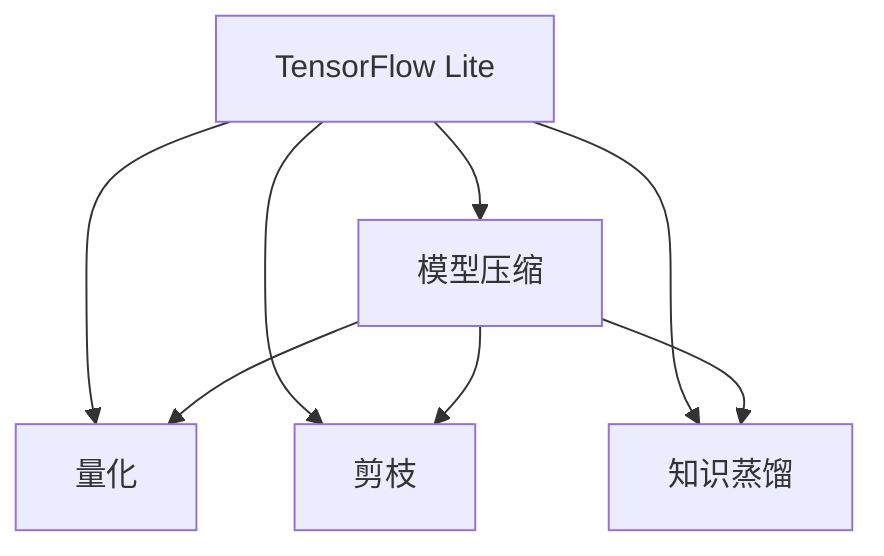

                 

## 1. 背景介绍

移动设备和嵌入式系统对模型性能和计算资源有严格的限制，要求模型既要具备较高的推理速度，又要占用尽可能少的存储空间。同时，模型的参数量越大，对硬件资源的要求越高，推理延迟也越长。这些限制往往需要在大模型和计算资源之间进行权衡取舍。为了在保证模型效果的同时，进一步优化性能和大小，本文将详细讨论如何对TensorFlow Lite模型进行压缩。

## 2. 核心概念与联系

### 2.1 核心概念概述

- **TensorFlow Lite（TFLite）**：谷歌推出的一个开源轻量级机器学习模型推理引擎，用于在移动设备和嵌入式系统上运行。TFLite模型通常以TFLite格式保存，以二进制形式加载并推理计算。

- **模型压缩（Model Compression）**：通过减少模型参数和浮点计算量，在不影响模型性能的情况下，减小模型的存储空间和推理延迟，提高模型在资源受限设备上的运行效率。

- **量化（Quantization）**：将浮点数值转换为整数或固定精度的定点数，可以大幅度减小模型存储空间，同时降低计算复杂度，提高模型推理速度。

- **剪枝（Pruning）**：移除对模型效果影响较小的参数或连接，减小模型大小并提升计算效率，但可能会导致模型性能的下降。

- **知识蒸馏（Knowledge Distillation）**：通过将大模型的知识迁移到结构较小的模型中，在保证模型性能的前提下，减小模型大小，提升计算效率。

这些概念之间相互关联，通过不同的优化方法，可以实现不同层次的模型压缩目标。通过组合应用这些方法，可以进一步提升模型的性能和效率，满足资源受限设备的需求。

### 2.2 Mermaid流程图

以下是模型压缩流程的Mermaid流程图，展示了各个核心概念之间的关系：



该流程图展示了TensorFlow Lite模型压缩的基本流程：
- 从TensorFlow Lite模型开始，通过量化、剪枝和知识蒸馏等方法进行模型压缩。
- 量化将浮点值转换为定点值，减小模型大小并提升计算效率。
- 剪枝移除无关参数，进一步减少模型大小和计算复杂度。
- 知识蒸馏通过迁移大模型的知识，保持模型性能。

## 3. 核心算法原理 & 具体操作步骤

### 3.1 算法原理概述

TensorFlow Lite模型压缩的目的是在保持模型性能不变的前提下，减小模型大小，提高推理效率。常见的压缩方法包括量化、剪枝和知识蒸馏等，以下是这些方法的详细原理：

- **量化（Quantization）**：将模型中的浮点数参数和激活值转换为8位或16位的定点数，从而减小模型大小和计算复杂度。量化后，模型在推理过程中使用定点数计算，最终输出浮点数结果。

- **剪枝（Pruning）**：移除对模型效果影响较小的参数或连接，减小模型大小并提升计算效率。剪枝可以通过删除零权重或小权重参数，或删除不必要的连接，进一步减小模型。

- **知识蒸馏（Knowledge Distillation）**：通过迁移大模型的知识，将大模型的复杂度转移到结构较小的模型中，保持模型性能。知识蒸馏通常通过在多个小模型之间传递信息，提升小模型的准确率。

### 3.2 算法步骤详解

#### 3.2.1 量化步骤

量化步骤通常包括以下几个关键步骤：

1. **选择量化算法**：确定使用静态量化还是动态量化，选择量化方法（如对称量化或非对称量化）。
2. **选择量化位宽**：确定使用8位还是16位，选择定点数范围。
3. **量化模型**：对模型参数和激活值进行量化，生成新的权重和偏置。
4. **推理计算**：使用量化后的模型进行推理，输出定点结果。
5. **反量化计算**：将定点结果转换为浮点结果，进行后续计算。

#### 3.2.2 剪枝步骤

剪枝步骤通常包括以下几个关键步骤：

1. **选择剪枝算法**：确定使用结构剪枝还是权重剪枝。
2. **确定剪枝阈值**：确定删除哪些参数或连接，保留哪些参数或连接。
3. **剪枝模型**：移除被选择的参数或连接，生成新的模型。
4. **验证模型**：在测试集上验证剪枝后模型的性能，评估其效果。
5. **调整剪枝策略**：根据验证结果调整剪枝策略，获得更好的压缩效果。

#### 3.2.3 知识蒸馏步骤

知识蒸馏步骤通常包括以下几个关键步骤：

1. **选择蒸馏算法**：确定使用单源蒸馏还是多源蒸馏，选择蒸馏方法（如软蒸馏或硬蒸馏）。
2. **确定蒸馏比例**：确定大模型与小模型的相似度，选择蒸馏比例。
3. **蒸馏模型**：在大模型与小模型之间传递知识，生成新的模型。
4. **验证模型**：在测试集上验证蒸馏后模型的性能，评估其效果。
5. **调整蒸馏策略**：根据验证结果调整蒸馏策略，获得更好的压缩效果。

### 3.3 算法优缺点

- **量化**：优点是显著减小模型大小，提升计算效率。缺点是可能引入量化误差，影响模型性能。
- **剪枝**：优点是减少模型大小和计算量，缺点是可能降低模型性能。
- **知识蒸馏**：优点是保持模型性能，缺点是蒸馏过程复杂，需要更多的计算资源。

### 3.4 算法应用领域

TensorFlow Lite模型压缩方法广泛应用于以下几个领域：

- **移动设备应用**：如手机应用、可穿戴设备、智能家居等，需要高效运行的模型。
- **嵌入式系统**：如物联网设备、车载设备、智能硬件等，需要低延迟、低功耗的模型。
- **边缘计算**：如智能摄像头、工业监控、边缘服务器等，需要轻量级、高效运行的模型。

## 4. 数学模型和公式 & 详细讲解 & 举例说明

### 4.1 数学模型构建

在量化过程中，我们需要对模型参数进行量化。假设一个模型参数 $x$，量化后变为 $x_q$，量化过程可以表示为：

$$
x_q = \text{Quantize}(x) = Q(x) \times \text{Scale} + \text{Zp}
$$

其中，$Q(x)$ 表示量化函数，$\text{Scale}$ 表示量化步长，$\text{Zp}$ 表示量化零点。量化步长和零点需要根据具体的量化算法和位宽确定。

### 4.2 公式推导过程

以8位对称量化为例，假设模型参数的浮点值为 $x$，量化后的8位定点值为 $x_q$，量化步长为 $S$，量化零点为 $Z$。则量化公式可以表示为：

$$
x_q = \text{Quantize}(x) = \text{Clip}(\text{Round}(\frac{x - Z}{S})) \times S + Z
$$

其中，$\text{Clip}$ 表示范围剪切，$\text{Round}$ 表示四舍五入。8位对称量化时，$S=2^{23}$，$Z=2^{22}$。

### 4.3 案例分析与讲解

假设一个模型参数 $x=10.5$，使用8位对称量化进行量化，量化步长 $S=2^{23}$，量化零点 $Z=2^{22}$。则量化后的定点值 $x_q$ 计算如下：

$$
x_q = \text{Quantize}(10.5) = \text{Clip}(\text{Round}(\frac{10.5 - 2^{22}}{2^{23}})) \times 2^{23} + 2^{22}
$$

$$
= \text{Clip}(\text{Round}(0.5 - 2^{22} \times 10.5 / 2^{23})) \times 2^{23} + 2^{22}
$$

$$
= \text{Clip}(\text{Round}(-0.99)) \times 2^{23} + 2^{22}
$$

$$
= 1 \times 2^{23} + 2^{22} = 2^{22} + 2^{21}
$$

因此，量化后的定点值 $x_q$ 为 $2^{21}+2^{22}$。

## 5. 项目实践：代码实例和详细解释说明

### 5.1 开发环境搭建

在开始TensorFlow Lite模型压缩的实践前，需要先搭建开发环境。以下是使用Python和TensorFlow Lite进行模型压缩的环境配置流程：

1. 安装Anaconda：从官网下载并安装Anaconda，用于创建独立的Python环境。

2. 创建并激活虚拟环境：
```bash
conda create -n tflite-env python=3.8 
conda activate tflite-env
```

3. 安装TensorFlow Lite和TensorFlow：
```bash
pip install tensorflow tensorflow-lite
```

4. 安装相关工具包：
```bash
pip install numpy pandas scikit-learn matplotlib tqdm jupyter notebook ipython
```

完成上述步骤后，即可在`tflite-env`环境中开始模型压缩实践。

### 5.2 源代码详细实现

下面以8位对称量化为例，给出一个TensorFlow Lite模型压缩的PyTorch代码实现。

```python
import torch
from torchvision import models
from torchvision import transforms
from torch.torchvision.models.quantization import convert

# 加载模型和数据预处理
model = models.resnet18(pretrained=True)
transform = transforms.Compose([
    transforms.Resize(224),
    transforms.ToTensor(),
    transforms.Normalize(mean=[0.485, 0.456, 0.406], std=[0.229, 0.224, 0.225])
])

# 转换模型为TFLite格式
converter = convert.Convert.from_reference(model)

# 量化模型
converter.quantize()

# 导出TFLite模型
with open('resnet18.tflite', 'wb') as f:
    converter.write(f)
```

### 5.3 代码解读与分析

让我们再详细解读一下关键代码的实现细节：

**加载模型和数据预处理**：
- 使用PyTorch加载预训练的ResNet-18模型，并定义数据预处理流程，包括图像大小调整、归一化等步骤。

**转换模型为TFLite格式**：
- 使用`torchvision.models.quantization.convert`方法，将模型转换为TFLite格式，并进行量化处理。

**量化模型**：
- 调用`converter.quantize()`方法，对模型进行8位对称量化，生成新的权重和偏置。

**导出TFLite模型**：
- 使用`converter.write()`方法，将量化后的模型导出为TFLite格式文件，保存为`resnet18.tflite`。

可以看到，使用PyTorch进行TensorFlow Lite模型压缩的代码实现相对简洁，开发者可以更容易地掌握和应用。

### 5.4 运行结果展示

运行上述代码后，即可得到一个压缩后的TFLite模型文件`resnet18.tflite`。可以使用TFLite工具链和移动设备进行推理验证。

## 6. 实际应用场景

### 6.1 移动设备应用

在移动设备上运行TensorFlow Lite模型时，模型大小和计算资源是重要的考虑因素。通过量化和剪枝等方法，可以在保持模型性能的同时，减小模型大小，提升推理效率。例如，在智能手机应用中，使用压缩后的TFLite模型可以提高应用的启动速度和用户体验。

### 6.2 嵌入式系统

嵌入式系统通常资源有限，运行大模型会占用大量的计算资源和内存空间。通过模型压缩方法，可以将模型压缩到较小的文件大小，适应嵌入式系统的资源限制，实现高效运行。例如，在智能家居设备中，压缩后的TFLite模型可以在低功耗模式下运行，延长设备的使用寿命。

### 6.3 边缘计算

边缘计算设备通常需要实时处理数据，对模型推理速度有较高要求。通过知识蒸馏等方法，可以将大模型的知识迁移到小模型中，保持模型性能，同时减小模型大小和计算量。例如，在智能监控设备中，压缩后的TFLite模型可以在边缘设备上进行高效推理，提高数据处理速度。

### 6.4 未来应用展望

随着移动设备、嵌入式系统和边缘计算的普及，TensorFlow Lite模型压缩技术将得到更广泛的应用。未来，我们可以预见以下几个发展趋势：

- **多任务学习**：在模型中集成多个任务，提升模型对多种任务的推理能力。
- **端到端压缩**：将量化、剪枝和蒸馏等步骤集成到一个端到端的流程中，实现自动化压缩。
- **动态压缩**：根据推理环境和资源限制，动态调整模型的压缩策略，实现最优的模型性能和资源利用率。
- **模型融合**：将不同模型的优势进行融合，生成更加高效、鲁棒的模型。

## 7. 工具和资源推荐

### 7.1 学习资源推荐

为了帮助开发者系统掌握TensorFlow Lite模型压缩的理论基础和实践技巧，这里推荐一些优质的学习资源：

1. TensorFlow Lite官方文档：提供详细的使用指南和示例代码，是入门TensorFlow Lite的必备资料。
2. 《TensorFlow Lite实战》一书：全面介绍了TensorFlow Lite的应用场景、原理和实践技巧，适合深入学习。
3. TensorFlow Lite博客：分享最新的模型压缩技术和应用案例，提供丰富的学习资源。
4. TensorFlow Lite社区：加入TensorFlow Lite社区，与其他开发者交流经验，获取最新的技术动态。

通过对这些资源的学习实践，相信你一定能够快速掌握TensorFlow Lite模型压缩的精髓，并用于解决实际的推理问题。

### 7.2 开发工具推荐

高效的开发离不开优秀的工具支持。以下是几款用于TensorFlow Lite模型压缩开发的常用工具：

1. TensorFlow Lite工具链：提供模型转换、优化和部署等全流程支持，是TensorFlow Lite模型压缩的重要工具。
2. TensorBoard：用于监控和分析模型推理性能，提供丰富的图表和统计信息。
3. Weights & Biases：模型训练的实验跟踪工具，可以记录和可视化模型训练过程中的各项指标，方便对比和调优。
4. TensorFlow Lite Support Library：提供针对移动设备的库支持，便于在移动设备上运行TensorFlow Lite模型。
5. PyTorch：与TensorFlow Lite无缝集成，提供高效的模型推理和量化工具。

合理利用这些工具，可以显著提升TensorFlow Lite模型压缩任务的开发效率，加快创新迭代的步伐。

### 7.3 相关论文推荐

TensorFlow Lite模型压缩技术的发展源于学界的持续研究。以下是几篇奠基性的相关论文，推荐阅读：

1. 《A Comprehensive Survey of Quantization Techniques》：系统回顾了量化技术的发展历程，提供了全面的技术概述。
2. 《Pruning Neural Networks with Low-rank Decomposition and Cholesky Factorization》：提出低秩分解和Cholesky因式分解的剪枝方法，有效减少模型参数量。
3. 《Knowledge Distillation: A Survey》：详细回顾了知识蒸馏技术的发展历程，提供了最新的研究动态。
4. 《Efficient Model Compression: A Survey of Techniques》：全面总结了模型压缩技术的各种方法，提供了丰富的应用场景和案例。
5. 《Parameter-Efficient Model Compression》：提出参数高效模型压缩方法，在保持模型性能的前提下，进一步减小模型大小。

这些论文代表了大模型压缩技术的发展脉络。通过学习这些前沿成果，可以帮助研究者把握学科前进方向，激发更多的创新灵感。

## 8. 总结：未来发展趋势与挑战

### 8.1 总结

本文对TensorFlow Lite模型压缩方法进行了全面系统的介绍。首先阐述了TensorFlow Lite模型压缩的背景和意义，明确了模型压缩在保持模型性能不变的前提下，减小模型大小、提升推理效率的重要作用。其次，从原理到实践，详细讲解了量化、剪枝和知识蒸馏等关键方法的数学模型和操作步骤，提供了完整的代码实现。同时，本文还探讨了TensorFlow Lite模型压缩在移动设备、嵌入式系统和边缘计算等实际应用场景中的广泛应用前景，展示了模型压缩技术的巨大潜力。最后，本文精选了模型压缩技术的各类学习资源，力求为读者提供全方位的技术指引。

通过本文的系统梳理，可以看到，TensorFlow Lite模型压缩技术在大模型应用中具有重要的应用价值，不仅可以显著提升模型的推理效率，还可以减小模型大小，适应资源受限设备的需求。未来，伴随模型压缩技术的持续演进，TensorFlow Lite模型将更加高效、轻量，为移动设备和嵌入式系统的应用提供强有力的技术支撑。

### 8.2 未来发展趋势

展望未来，TensorFlow Lite模型压缩技术将呈现以下几个发展趋势：

1. **端到端压缩**：将量化、剪枝和蒸馏等步骤集成到一个端到端的流程中，实现自动化压缩。
2. **多任务学习**：在模型中集成多个任务，提升模型对多种任务的推理能力。
3. **动态压缩**：根据推理环境和资源限制，动态调整模型的压缩策略，实现最优的模型性能和资源利用率。
4. **模型融合**：将不同模型的优势进行融合，生成更加高效、鲁棒的模型。
5. **知识蒸馏增强**：进一步优化知识蒸馏过程，提升小模型的性能。

以上趋势凸显了TensorFlow Lite模型压缩技术的广阔前景。这些方向的探索发展，必将进一步提升模型性能和资源利用率，满足资源受限设备的需求。

### 8.3 面临的挑战

尽管TensorFlow Lite模型压缩技术已经取得了显著的成果，但在迈向更加智能化、普适化应用的过程中，仍面临诸多挑战：

1. **模型性能下降**：量化和剪枝等方法虽然减小了模型大小，但可能会引入量化误差和剪枝风险，影响模型性能。
2. **计算资源限制**：在嵌入式系统和边缘计算中，计算资源有限，压缩后的模型仍需要优化。
3. **推理延迟增加**：量化和剪枝等方法可能会增加模型推理延迟，影响应用性能。
4. **知识蒸馏复杂**：知识蒸馏需要在大模型和小模型之间传递信息，过程复杂，需要更多的计算资源。

### 8.4 研究展望

面对TensorFlow Lite模型压缩所面临的种种挑战，未来的研究需要在以下几个方面寻求新的突破：

1. **量化方法优化**：进一步优化量化方法，减小量化误差，提升模型性能。
2. **剪枝策略改进**：改进剪枝策略，提高剪枝效率，减小剪枝风险。
3. **知识蒸馏增强**：优化知识蒸馏过程，提升小模型的性能。
4. **模型融合创新**：提出新的模型融合方法，生成更加高效、鲁棒的模型。
5. **动态压缩实现**：研究动态压缩方法，根据推理环境和资源限制，实现最优的模型性能和资源利用率。

这些研究方向的探索，必将引领TensorFlow Lite模型压缩技术迈向更高的台阶，为构建安全、可靠、高效的应用系统提供坚实的技术基础。只有勇于创新、敢于突破，才能不断拓展TensorFlow Lite模型的应用边界，让智能技术更好地造福人类社会。

## 9. 附录：常见问题与解答

**Q1：量化过程中如何保证模型性能？**

A: 量化过程中，量化误差是不可避免的。为了保证模型性能，可以使用以下方法：
1. 选择合适的量化方法和位宽，减小量化误差。
2. 在量化后进行反量化计算，保持模型输出精度。
3. 在训练过程中引入量化误差，逐步减小误差。

**Q2：剪枝过程中如何避免模型性能下降？**

A: 剪枝过程中，可能会移除对模型效果影响较大的参数。为了避免模型性能下降，可以采用以下方法：
1. 选择结构剪枝或权重剪枝，避免删除关键参数。
2. 使用剪枝策略优化，保留关键参数。
3. 在剪枝后进行微调，提升模型性能。

**Q3：知识蒸馏过程中如何保证模型性能？**

A: 知识蒸馏过程中，需要在大模型和小模型之间传递信息。为了保证模型性能，可以采用以下方法：
1. 选择高质量的大模型，保持蒸馏过程的准确性。
2. 使用多种蒸馏方法，优化蒸馏过程。
3. 在蒸馏后进行微调，提升模型性能。

**Q4：模型压缩过程中如何平衡模型大小和性能？**

A: 模型压缩过程中，需要在模型大小和性能之间进行平衡。可以采用以下方法：
1. 选择合适的量化和剪枝策略，平衡模型大小和性能。
2. 在压缩后进行微调，提升模型性能。
3. 在推理过程中使用动态压缩，根据推理环境和资源限制，实现最优的模型性能和资源利用率。

---

作者：禅与计算机程序设计艺术 / Zen and the Art of Computer Programming

