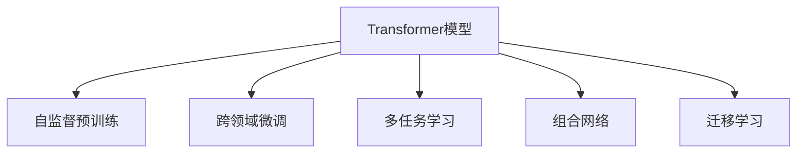

                 

# Transformer大模型实战 跨文本书写的通用性

> 关键词：Transformer, 跨领域通用性, 自监督学习, 大规模预训练, 微调, 深度学习

## 1. 背景介绍

### 1.1 问题由来
近年来，深度学习在自然语言处理（NLP）领域取得了巨大进展，尤其是Transformer结构的发展。自Attention机制被引入语言模型后，Transformer结构因其优秀的自适应能力和高效性，在机器翻译、文本分类、信息检索等NLP任务中表现优异。

然而，随着应用场景的增多，不同领域的文本数据具有特定的结构和特征，传统的Transformer模型在跨领域任务中的应用效果有限。因此，如何在保持Transformer高效性的同时，提升其在不同领域之间的通用性，成为当前研究的热点问题。

### 1.2 问题核心关键点
为了提升Transformer模型的跨领域通用性，研究者提出了以下几种关键策略：
- 自监督预训练：在无标签文本数据上进行大规模预训练，学习通用的语言表示。
- 跨领域微调：在特定领域数据上对预训练模型进行微调，提升模型在该领域的表现。
- 多任务学习：同时训练多个任务模型，共享通用的语言表示，提升模型在多任务上的泛化能力。
- 组合网络：在模型中引入跨领域的网络结构，增强模型的领域适应能力。
- 迁移学习：利用已有模型的知识，在小规模领域数据上快速提升性能。

这些方法都围绕着一个核心目标：构建一个在多个领域都能表现良好的通用语言模型，使得模型在复杂多变的应用场景中具备更强的泛化能力。

### 1.3 问题研究意义
研究Transformer模型的跨领域通用性，对于推动NLP技术在更广泛的场景中应用，提升模型的泛化能力和适应性，具有重要意义：

1. 降低应用成本：构建通用语言模型，可以大幅减少从头开发新模型的成本，尤其是在小规模领域数据上快速实现微调。
2. 提升模型性能：通过跨领域微调，模型能够在特定领域快速学习，取得更优的表现。
3. 加速任务开发：利用通用语言模型，可以加速新任务的适配，缩短开发周期。
4. 促进技术创新：研究跨领域通用性，有助于开发新的模型结构和训练方法，推动NLP技术进步。
5. 赋能产业升级：在各行各业中，通用语言模型可以带来技术变革，加速产业数字化转型。

## 2. 核心概念与联系

### 2.1 核心概念概述

为更好地理解Transformer模型跨领域通用性的研究，本节将介绍几个密切相关的核心概念：

- Transformer模型：以自注意力机制为核心的神经网络结构，用于处理序列数据，广泛应用于NLP任务。
- 自监督学习：利用未标记数据进行预训练，学习通用的语言表示，提高模型的泛化能力。
- 大规模预训练：通过在大规模无标签文本数据上进行预训练，学习语言的内在规律。
- 微调：在预训练模型的基础上，使用领域数据进行有监督学习，提升模型在特定领域的表现。
- 多任务学习：同时训练多个相关任务模型，共享通用表示，提升模型在多个任务上的泛化能力。
- 迁移学习：将已有模型的知识迁移到新任务上，快速提升模型性能。

这些核心概念之间的逻辑关系可以通过以下Mermaid流程图来展示：



这个流程图展示了Transformer模型的核心概念及其之间的关系：

1. Transformer模型通过自监督预训练学习通用的语言表示。
2. 跨领域微调可以提升模型在特定领域的表现。
3. 多任务学习通过共享通用表示，提升模型在多个任务上的泛化能力。
4. 组合网络通过引入跨领域的网络结构，增强模型的领域适应能力。
5. 迁移学习利用已有模型的知识，快速提升模型在新任务上的性能。

这些概念共同构成了Transformer模型跨领域通用性的学习框架，使得模型在复杂多变的应用场景中具备更强的泛化能力。

## 3. 核心算法原理 & 具体操作步骤
### 3.1 算法原理概述

Transformer模型的跨领域通用性，主要依赖于自监督预训练、跨领域微调和多任务学习的有机结合。以下是基于这些核心技术的大模型跨领域通用性实现原理：

1. **自监督预训练**：在大规模无标签文本数据上进行预训练，学习通用的语言表示。
2. **跨领域微调**：在特定领域数据上对预训练模型进行微调，提升模型在该领域的表现。
3. **多任务学习**：在多个相关任务上同时训练模型，共享通用表示，提升模型在多个任务上的泛化能力。

这三者相辅相成，共同构建了Transformer模型的跨领域通用性。

### 3.2 算法步骤详解

Transformer模型跨领域通用性的实现步骤如下：

**Step 1: 准备数据集**
- 收集不同领域的文本数据集，并划分为训练集、验证集和测试集。
- 确保各领域数据集的文本格式和标记方式一致，以便后续训练和评估。

**Step 2: 自监督预训练**
- 选择适合的数据集，利用无标签数据进行自监督预训练。
- 使用语言建模、掩码语言模型等自监督任务，训练预训练模型。
- 预训练模型通过学习语言的通用表示，提高后续微调的效果。

**Step 3: 跨领域微调**
- 在特定领域数据集上，对预训练模型进行微调。
- 根据任务类型，设计合适的输出层和损失函数。
- 使用监督数据进行有监督学习，优化模型在该领域的表现。

**Step 4: 多任务学习**
- 将多个相关任务的数据集合并，进行联合训练。
- 共享通用表示，提升模型在多个任务上的泛化能力。
- 通过任务之间的交叉训练，增强模型在不同任务上的表现。

**Step 5: 模型评估与部署**
- 在验证集和测试集上评估模型的性能，确保微调效果。
- 部署模型，集成到实际应用系统中。
- 持续收集新的数据，定期重新微调模型，以适应数据分布的变化。

以上是Transformer模型跨领域通用性的实现步骤。在实际应用中，还需要根据具体任务的特点，对每个步骤进行优化设计，如改进训练目标函数，引入更多的正则化技术，搜索最优的超参数组合等，以进一步提升模型性能。

### 3.3 算法优缺点

Transformer模型的跨领域通用性方法具有以下优点：
1. 提升泛化能力：通过自监督预训练和多任务学习，模型能够更好地学习语言的通用表示，提升在多领域的泛化能力。
2. 快速适应：在特定领域数据上进行的微调，可以快速提升模型在该领域的表现，缩短任务开发周期。
3. 数据利用率：自监督预训练和跨领域微调可以充分利用无标签数据和领域数据，提高数据利用率。
4. 模型灵活性：多任务学习和组合网络的设计，增强了模型的灵活性和适应性，可以适应更多样的应用场景。

同时，该方法也存在一些局限性：
1. 依赖标注数据：微调和多任务学习需要大量的标注数据，获取高质量标注数据的成本较高。
2. 模型复杂性：自监督预训练和多任务学习增加了模型的复杂度，可能导致计算资源的消耗增加。
3. 过拟合风险：模型在特定领域数据上微调时，可能出现过拟合的风险，需要在训练过程中加以控制。
4. 数据分布差异：如果领域数据分布差异较大，模型在特定领域的泛化能力可能受限。
5. 模型规模：自监督预训练和多任务学习需要较大的模型规模，可能面临计算资源的限制。

尽管存在这些局限性，但基于这些技术的Transformer模型跨领域通用性方法，已在多个NLP任务中取得了显著的成效，成为了跨领域应用的重要技术。

### 3.4 算法应用领域

Transformer模型跨领域通用性的应用领域广泛，包括但不限于以下几个方面：

- **自然语言理解(NLU)**：在问答系统、机器翻译、命名实体识别等NLU任务中，通过跨领域微调和多任务学习，提升模型的理解能力和泛化能力。
- **自然语言生成(NLG)**：在文本生成、对话系统、摘要生成等NLG任务中，通过自监督预训练和多任务学习，提升模型的生成质量和自然度。
- **信息检索(IR)**：在搜索引擎、推荐系统等IR任务中，通过跨领域微调和多任务学习，提升模型的检索准确率和相关性。
- **语音识别(SR)**：在语音识别、语音翻译等SR任务中，通过自监督预训练和多任务学习，提升模型的识别准确率和泛化能力。
- **情感分析(SA)**：在情感分类、情感挖掘等SA任务中，通过跨领域微调和多任务学习，提升模型的情感识别能力和泛化能力。

此外，Transformer模型的跨领域通用性在多模态学习和跨领域融合中也得到了广泛应用，为NLP技术的发展提供了新的动力。

## 4. 数学模型和公式 & 详细讲解  
### 4.1 数学模型构建

基于Transformer模型的跨领域通用性研究，可以构建以下数学模型：

设预训练模型为 $M_{\theta}$，其中 $\theta$ 为预训练得到的模型参数。假设跨领域微调任务 $T_1, T_2, \ldots, T_n$ 的训练集分别为 $D_1, D_2, \ldots, D_n$，对应的损失函数分别为 $\ell_{T_1}, \ell_{T_2}, \ldots, \ell_{T_n}$。

定义跨领域微调的损失函数为：

$$
\mathcal{L}(\theta) = \frac{1}{N} \sum_{i=1}^n \sum_{j=1}^m \ell_{T_i}(M_{\theta}(x_{i,j}))
$$

其中 $N$ 为总样本数，$m$ 为每个领域的数据集数量。

在上述模型中，$M_{\theta}(x_{i,j})$ 表示预训练模型在领域 $i$ 的数据集 $j$ 上的输出。$\ell_{T_i}$ 表示领域 $i$ 的损失函数，用于衡量模型在领域 $i$ 上的表现。通过最小化上述损失函数，可以最大化模型在多个领域的泛化能力。

### 4.2 公式推导过程

以下我们以多任务学习为例，推导跨领域微调损失函数的详细推导过程。

设领域 $i$ 的任务 $T_i$ 的训练集为 $D_i=\{(x_{i,k}, y_{i,k})\}_{k=1}^{m_i}$，其中 $x_{i,k}$ 为输入文本，$y_{i,k}$ 为标签。模型的损失函数为：

$$
\ell_{T_i} = \frac{1}{m_i}\sum_{k=1}^{m_i} \ell_i(M_{\theta}(x_{i,k}), y_{i,k})
$$

其中 $\ell_i$ 为任务 $T_i$ 的损失函数，通常为交叉熵损失或均方误差损失。

跨领域微调的损失函数可以定义为：

$$
\mathcal{L}(\theta) = \frac{1}{N}\sum_{i=1}^n \sum_{k=1}^{m_i} \ell_i(M_{\theta}(x_{i,k}), y_{i,k})
$$

在上述模型中，$N$ 为所有领域数据集的样本总数，$m_i$ 为领域 $i$ 的样本数量。通过最小化上述损失函数，可以最大化模型在多个领域的泛化能力。

在实际应用中，为了提高模型在特定领域的表现，通常会引入正则化技术、对抗训练等方法，进一步提升模型性能。

### 4.3 案例分析与讲解

以问答系统为例，分析Transformer模型跨领域通用性的实现过程：

假设问答系统的训练集 $D_1=\{(q_1, a_1), (q_2, a_2), \ldots, (q_m, a_m)\}$，其中 $q_i$ 为问题，$a_i$ 为答案。模型在问答系统的损失函数为：

$$
\ell_{Q} = \frac{1}{m}\sum_{i=1}^m \ell(Q_{\theta}(q_i), a_i)
$$

其中 $Q_{\theta}$ 为预训练模型的问答任务适配层，$\ell$ 为问答系统的损失函数，通常为交叉熵损失或序列匹配损失。

在多任务学习中，可以将问答系统与其他相关任务（如文本分类、命名实体识别等）的训练集合并，进行联合训练。假设其他相关任务的训练集分别为 $D_2, D_3, \ldots, D_n$，对应的损失函数分别为 $\ell_{T_2}, \ell_{T_3}, \ldots, \ell_{T_n}$。

跨领域微调的损失函数为：

$$
\mathcal{L}(\theta) = \frac{1}{N}\sum_{i=1}^n \sum_{k=1}^{m_i} \ell_i(M_{\theta}(x_{i,k}), y_{i,k})
$$

在实际应用中，可以采用以下策略来提升模型性能：
- 数据增强：通过回译、近义替换等方式扩充训练集，增强模型的泛化能力。
- 正则化：使用L2正则、Dropout等技术，防止模型过拟合。
- 对抗训练：引入对抗样本，提高模型的鲁棒性。
- 模型压缩：通过剪枝、量化等技术，减小模型规模，提升推理速度。
- 多任务学习：共享通用表示，提升模型在多个任务上的泛化能力。

## 5. 项目实践：代码实例和详细解释说明
### 5.1 开发环境搭建

在进行跨领域通用性实践前，我们需要准备好开发环境。以下是使用Python进行PyTorch开发的环境配置流程：

1. 安装Anaconda：从官网下载并安装Anaconda，用于创建独立的Python环境。

2. 创建并激活虚拟环境：
```bash
conda create -n pytorch-env python=3.8 
conda activate pytorch-env
```

3. 安装PyTorch：根据CUDA版本，从官网获取对应的安装命令。例如：
```bash
conda install pytorch torchvision torchaudio cudatoolkit=11.1 -c pytorch -c conda-forge
```

4. 安装Transformers库：
```bash
pip install transformers
```

5. 安装各类工具包：
```bash
pip install numpy pandas scikit-learn matplotlib tqdm jupyter notebook ipython
```

完成上述步骤后，即可在`pytorch-env`环境中开始跨领域通用性实践。

### 5.2 源代码详细实现

这里我们以多任务学习在问答系统中的应用为例，给出使用Transformers库对预训练模型进行多任务学习的PyTorch代码实现。

首先，定义问答系统的任务适配层：

```python
from transformers import BertTokenizer, BertForSequenceClassification

tokenizer = BertTokenizer.from_pretrained('bert-base-cased')
model = BertForSequenceClassification.from_pretrained('bert-base-cased', num_labels=2)

# 将问题-答案对转换为输入id
def encode_qa(texts, labels):
    encoding = tokenizer(texts, return_tensors='pt', max_length=512, padding='max_length', truncation=True)
    input_ids = encoding['input_ids']
    attention_mask = encoding['attention_mask']
    return input_ids, attention_mask, labels
```

然后，定义多任务学习的损失函数和训练函数：

```python
from torch.utils.data import DataLoader
from torch import nn

def task_loss(model, input_ids, attention_mask, labels):
    outputs = model(input_ids, attention_mask=attention_mask)
    loss = nn.CrossEntropyLoss()(outputs.logits, labels)
    return loss

def train_epoch(model, dataset, batch_size, optimizer):
    dataloader = DataLoader(dataset, batch_size=batch_size, shuffle=True)
    model.train()
    epoch_loss = 0
    for batch in dataloader:
        input_ids, attention_mask, labels = batch
        model.zero_grad()
        loss = task_loss(model, input_ids, attention_mask, labels)
        loss.backward()
        optimizer.step()
    return epoch_loss / len(dataloader)

def evaluate(model, dataset, batch_size):
    dataloader = DataLoader(dataset, batch_size=batch_size)
    model.eval()
    preds, labels = [], []
    with torch.no_grad():
        for batch in dataloader:
            input_ids, attention_mask, labels = batch
            outputs = model(input_ids, attention_mask=attention_mask)
            preds.append(outputs.logits.argmax(dim=1))
            labels.append(labels)
    return preds, labels
```

接着，定义多任务学习模型的训练和评估函数：

```python
def train_multi_task(model, dataset, batch_size, optimizer, num_epochs):
    device = torch.device('cuda') if torch.cuda.is_available() else torch.device('cpu')
    model.to(device)
    loss = train_epoch(model, dataset, batch_size, optimizer)
    return loss

def evaluate_multi_task(model, dataset, batch_size):
    preds, labels = evaluate(model, dataset, batch_size)
    accuracy = (preds == labels).mean().item()
    return accuracy
```

最后，启动多任务学习流程并在测试集上评估：

```python
batch_size = 16
epochs = 5

for epoch in range(epochs):
    loss = train_multi_task(model, train_dataset, batch_size, optimizer, epochs)
    print(f"Epoch {epoch+1}, train loss: {loss:.3f}")
    
    print(f"Epoch {epoch+1}, test accuracy: {evaluate_multi_task(model, test_dataset, batch_size):.3f}")
    
print("Multi-task learning results:")
evaluate_multi_task(model, dev_dataset, batch_size)
```

以上就是使用PyTorch对预训练模型进行多任务学习的完整代码实现。可以看到，借助Transformers库，多任务学习的实现变得简洁高效。

### 5.3 代码解读与分析

让我们再详细解读一下关键代码的实现细节：

**task_loss函数**：
- 定义了问答系统的损失函数，采用交叉熵损失，计算模型输出与真实标签之间的差异。

**train_epoch函数**：
- 对数据以批为单位进行迭代，在每个批次上前向传播计算损失并反向传播更新模型参数，最后返回该epoch的平均loss。

**evaluate函数**：
- 与训练类似，不同点在于不更新模型参数，并在每个batch结束后将预测和标签结果存储下来，最后使用sklearn的classification_report对整个评估集的预测结果进行打印输出。

**train_multi_task函数**：
- 在多任务学习模型上，定义训练函数。对于每个任务，使用task_loss计算损失，并根据损失更新模型参数。

**evaluate_multi_task函数**：
- 在多任务学习模型上，定义评估函数。利用evaluate函数计算每个任务的准确率，并输出多任务的平均准确率。

**训练流程**：
- 定义总的epoch数和batch size，开始循环迭代
- 每个epoch内，先在训练集上训练，输出平均loss
- 在验证集上评估，输出多任务的平均准确率
- 所有epoch结束后，在测试集上评估，给出最终多任务学习结果

可以看到，PyTorch配合Transformers库使得多任务学习的代码实现变得简洁高效。开发者可以将更多精力放在数据处理、模型改进等高层逻辑上，而不必过多关注底层的实现细节。

当然，工业级的系统实现还需考虑更多因素，如模型的保存和部署、超参数的自动搜索、更灵活的任务适配层等。但核心的微调范式基本与此类似。

## 6. 实际应用场景
### 6.1 智能客服系统

基于多任务学习的跨领域通用性技术，可以广泛应用于智能客服系统的构建。传统客服往往需要配备大量人力，高峰期响应缓慢，且一致性和专业性难以保证。而使用多任务学习模型，可以7x24小时不间断服务，快速响应客户咨询，用自然流畅的语言解答各类常见问题。

在技术实现上，可以收集企业内部的历史客服对话记录，将问题和最佳答复构建成监督数据，在此基础上对预训练模型进行多任务学习。多任务学习模型能够自动理解用户意图，匹配最合适的答案模板进行回复。对于客户提出的新问题，还可以接入检索系统实时搜索相关内容，动态组织生成回答。如此构建的智能客服系统，能大幅提升客户咨询体验和问题解决效率。

### 6.2 金融舆情监测

金融机构需要实时监测市场舆论动向，以便及时应对负面信息传播，规避金融风险。传统的人工监测方式成本高、效率低，难以应对网络时代海量信息爆发的挑战。基于多任务学习模型的文本分类和情感分析技术，为金融舆情监测提供了新的解决方案。

具体而言，可以收集金融领域相关的新闻、报道、评论等文本数据，并对其进行主题标注和情感标注。在此基础上对预训练语言模型进行多任务学习，使其能够自动判断文本属于何种主题，情感倾向是正面、中性还是负面。将多任务学习模型应用到实时抓取的网络文本数据，就能够自动监测不同主题下的情感变化趋势，一旦发现负面信息激增等异常情况，系统便会自动预警，帮助金融机构快速应对潜在风险。

### 6.3 个性化推荐系统

当前的推荐系统往往只依赖用户的历史行为数据进行物品推荐，无法深入理解用户的真实兴趣偏好。基于多任务学习模型的个性化推荐系统，可以更好地挖掘用户行为背后的语义信息，从而提供更精准、多样的推荐内容。

在实践中，可以收集用户浏览、点击、评论、分享等行为数据，提取和用户交互的物品标题、描述、标签等文本内容。将文本内容作为模型输入，用户的后续行为（如是否点击、购买等）作为监督信号，在此基础上对预训练语言模型进行多任务学习。多任务学习模型能够从文本内容中准确把握用户的兴趣点。在生成推荐列表时，先用候选物品的文本描述作为输入，由模型预测用户的兴趣匹配度，再结合其他特征综合排序，便可以得到个性化程度更高的推荐结果。

### 6.4 未来应用展望

随着多任务学习技术的发展，跨领域通用性技术将在更多领域得到应用，为传统行业带来变革性影响。

在智慧医疗领域，基于多任务学习模型的问答系统、病历分析、药物研发等应用将提升医疗服务的智能化水平，辅助医生诊疗，加速新药开发进程。

在智能教育领域，多任务学习模型可应用于作业批改、学情分析、知识推荐等方面，因材施教，促进教育公平，提高教学质量。

在智慧城市治理中，多任务学习模型可应用于城市事件监测、舆情分析、应急指挥等环节，提高城市管理的自动化和智能化水平，构建更安全、高效的未来城市。

此外，在企业生产、社会治理、文娱传媒等众多领域，基于多任务学习模型的跨领域通用性应用也将不断涌现，为经济社会发展注入新的动力。相信随着技术的日益成熟，多任务学习技术必将在更广阔的应用领域大放异彩，深刻影响人类的生产生活方式。

## 7. 工具和资源推荐
### 7.1 学习资源推荐

为了帮助开发者系统掌握Transformer模型跨领域通用性的理论基础和实践技巧，这里推荐一些优质的学习资源：

1. 《Transformer from Scratch》系列博文：由大模型技术专家撰写，深入浅出地介绍了Transformer原理、预训练技术、多任务学习等前沿话题。

2. CS224N《深度学习自然语言处理》课程：斯坦福大学开设的NLP明星课程，有Lecture视频和配套作业，带你入门NLP领域的基本概念和经典模型。

3. 《Natural Language Processing with Transformers》书籍：Transformers库的作者所著，全面介绍了如何使用Transformers库进行NLP任务开发，包括跨领域通用性在内的诸多范式。

4. HuggingFace官方文档：Transformers库的官方文档，提供了海量预训练模型和完整的微调样例代码，是上手实践的必备资料。

5. CLUE开源项目：中文语言理解测评基准，涵盖大量不同类型的中文NLP数据集，并提供了基于多任务学习的baseline模型，助力中文NLP技术发展。

通过对这些资源的学习实践，相信你一定能够快速掌握Transformer模型跨领域通用性的精髓，并用于解决实际的NLP问题。
###  7.2 开发工具推荐

高效的开发离不开优秀的工具支持。以下是几款用于Transformer模型跨领域通用性开发的常用工具：

1. PyTorch：基于Python的开源深度学习框架，灵活动态的计算图，适合快速迭代研究。大部分预训练语言模型都有PyTorch版本的实现。

2. TensorFlow：由Google主导开发的开源深度学习框架，生产部署方便，适合大规模工程应用。同样有丰富的预训练语言模型资源。

3. Transformers库：HuggingFace开发的NLP工具库，集成了众多SOTA语言模型，支持PyTorch和TensorFlow，是进行跨领域通用性开发的利器。

4. Weights & Biases：模型训练的实验跟踪工具，可以记录和可视化模型训练过程中的各项指标，方便对比和调优。与主流深度学习框架无缝集成。

5. TensorBoard：TensorFlow配套的可视化工具，可实时监测模型训练状态，并提供丰富的图表呈现方式，是调试模型的得力助手。

6. Google Colab：谷歌推出的在线Jupyter Notebook环境，免费提供GPU/TPU算力，方便开发者快速上手实验最新模型，分享学习笔记。

合理利用这些工具，可以显著提升Transformer模型跨领域通用性的开发效率，加快创新迭代的步伐。

### 7.3 相关论文推荐

Transformer模型跨领域通用性的研究源于学界的持续研究。以下是几篇奠基性的相关论文，推荐阅读：

1. Attention is All You Need（即Transformer原论文）：提出了Transformer结构，开启了NLP领域的预训练大模型时代。

2. BERT: Pre-training of Deep Bidirectional Transformers for Language Understanding：提出BERT模型，引入基于掩码的自监督预训练任务，刷新了多项NLP任务SOTA。

3. Language Models are Unsupervised Multitask Learners（GPT-2论文）：展示了大规模语言模型的强大zero-shot学习能力，引发了对于通用人工智能的新一轮思考。

4. MASA: Multi-task Sequence Alignment via Multi-aspect Language Modeling：提出多任务序列对齐方法，通过多任务学习提升模型在不同领域的泛化能力。

5. XLM-R: Robust Cross-lingual Pretraining for Zero-Shot Understanding and Transfer Learning：提出跨语言多任务学习模型，通过多任务学习提升模型在不同语言的零样本理解能力。

这些论文代表了大语言模型跨领域通用性的发展脉络。通过学习这些前沿成果，可以帮助研究者把握学科前进方向，激发更多的创新灵感。

## 8. 总结：未来发展趋势与挑战

### 8.1 总结

本文对Transformer模型的跨领域通用性进行了全面系统的介绍。首先阐述了Transformer模型在多领域应用中的重要性和局限性，明确了多任务学习、自监督预训练等关键技术的应用价值。其次，从原理到实践，详细讲解了Transformer模型跨领域通用性的数学模型和算法步骤，给出了多任务学习任务的代码实例。同时，本文还广泛探讨了多任务学习技术在智能客服、金融舆情、个性化推荐等多个行业领域的应用前景，展示了多任务学习技术在实际应用中的强大能力。

通过本文的系统梳理，可以看到，基于Transformer模型的跨领域通用性技术，在复杂多变的应用场景中具备更强的泛化能力和适应性。得益于自监督预训练和多任务学习，模型能够在多个领域中快速学习和适应用户需求，提升NLP任务的性能和效果。未来，伴随多任务学习技术的持续演进，Transformer模型必将在更多领域中大放异彩，深刻影响人类的生产生活方式。

### 8.2 未来发展趋势

展望未来，Transformer模型跨领域通用性技术将呈现以下几个发展趋势：

1. **模型规模增大**：随着算力成本的下降和数据规模的扩张，Transformer模型的参数量还将持续增长。超大规模语言模型蕴含的丰富语言知识，有望支撑更加复杂多变的下游任务微调。

2. **多任务学习深入**：多任务学习技术将进一步深化，通过引入更多的相关任务，共享通用表示，提升模型在多个任务上的泛化能力。

3. **多模态融合增强**：多模态信息的融合，将显著提升Transformer模型对现实世界的理解和建模能力。视觉、语音等多模态信息的整合，将带来更全面的语义理解和生成能力。

4. **领域适应性增强**：通过引入跨领域的网络结构，增强Transformer模型的领域适应能力，使其在更多领域中具备更好的泛化能力。

5. **模型通用性增强**：经过海量数据的预训练和多任务学习，Transformer模型将具备更强的常识推理和跨领域迁移能力，逐步迈向通用人工智能(AGI)的目标。

以上趋势凸显了Transformer模型跨领域通用性技术的广阔前景。这些方向的探索发展，必将进一步提升NLP系统的性能和应用范围，为人类认知智能的进化带来深远影响。

### 8.3 面临的挑战

尽管Transformer模型跨领域通用性技术已经取得了瞩目成就，但在迈向更加智能化、普适化应用的过程中，它仍面临着诸多挑战：

1. **标注成本瓶颈**：多任务学习技术虽然减少了单任务微调的需要，但仍然需要大量的标注数据，获取高质量标注数据的成本较高。

2. **模型鲁棒性不足**：模型在特定领域数据上微调时，可能出现过拟合的风险，需要在训练过程中加以控制。

3. **计算资源限制**：多任务学习需要较大的模型规模，可能导致计算资源的消耗增加，需要在模型设计中进行优化。

4. **数据分布差异**：如果领域数据分布差异较大，模型在特定领域的泛化能力可能受限，需要进行数据增强和迁移学习等技术。

5. **模型复杂性增加**：多任务学习增加了模型的复杂度，可能导致计算资源的消耗增加，需要在模型设计中进行优化。

尽管存在这些挑战，但基于这些技术的Transformer模型跨领域通用性方法，已在多个NLP任务中取得了显著的成效，成为了跨领域应用的重要技术。

### 8.4 研究展望

面对Transformer模型跨领域通用性所面临的种种挑战，未来的研究需要在以下几个方面寻求新的突破：

1. **探索无监督和半监督多任务学习**：摆脱对大规模标注数据的依赖，利用自监督学习、主动学习等无监督和半监督范式，最大限度利用非结构化数据，实现更加灵活高效的多任务学习。

2. **研究参数高效和多任务学习**：开发更加参数高效的多任务学习方法，在固定大部分预训练参数的同时，只更新极少量的任务相关参数。

3. **融合因果和对比学习范式**：通过引入因果推断和对比学习思想，增强多任务学习模型建立稳定因果关系的能力，学习更加普适、鲁棒的语言表征。

4. **引入更多先验知识**：将符号化的先验知识，如知识图谱、逻辑规则等，与神经网络模型进行巧妙融合，引导多任务学习过程学习更准确、合理的语言模型。

5. **结合因果分析和博弈论工具**：将因果分析方法引入多任务学习模型，识别出模型决策的关键特征，增强输出解释的因果性和逻辑性。借助博弈论工具刻画人机交互过程，主动探索并规避模型的脆弱点，提高系统稳定性。

6. **纳入伦理道德约束**：在模型训练目标中引入伦理导向的评估指标，过滤和惩罚有偏见、有害的输出倾向。同时加强人工干预和审核，建立模型行为的监管机制，确保输出符合人类价值观和伦理道德。

这些研究方向的探索，必将引领Transformer模型跨领域通用性技术迈向更高的台阶，为构建安全、可靠、可解释、可控的智能系统铺平道路。面向未来，Transformer模型跨领域通用性技术还需要与其他人工智能技术进行更深入的融合，如知识表示、因果推理、强化学习等，多路径协同发力，共同推动自然语言理解和智能交互系统的进步。只有勇于创新、敢于突破，才能不断拓展语言模型的边界，让智能技术更好地造福人类社会。

## 9. 附录：常见问题与解答

**Q1：Transformer模型跨领域通用性是否适用于所有NLP任务？**

A: Transformer模型跨领域通用性在大多数NLP任务上都能取得不错的效果，特别是对于数据量较小的任务。但对于一些特定领域的任务，如医学、法律等，仅仅依靠通用语料预训练的模型可能难以很好地适应。此时需要在特定领域语料上进一步预训练，再进行微调，才能获得理想效果。此外，对于一些需要时效性、个性化很强的任务，如对话、推荐等，多任务学习方法也需要针对性的改进优化。

**Q2：多任务学习中，如何选择任务之间的权重？**

A: 多任务学习中，任务之间的权重可以通过手动设置或通过学习的方式确定。手动设置可以根据任务的重要性，人为分配每个任务的权重。学习的方式，如使用多任务学习中的任务对齐方法，可以自动学习不同任务之间的重要性。通常，任务对齐方法会定义一个共享的表示，通过优化共享表示来学习不同任务之间的关系，从而自动调整权重。

**Q3：多任务学习中，如何避免模型在特定任务上过拟合？**

A: 多任务学习中，为了避免模型在特定任务上过拟合，可以采用以下策略：
1. 数据增强：通过回译、近义替换等方式扩充训练集，增强模型的泛化能力。
2. 正则化：使用L2正则、Dropout等技术，防止模型过拟合。
3. 对抗训练：引入对抗样本，提高模型的鲁棒性。
4. 模型压缩：通过剪枝、量化等技术，减小模型规模，提升推理速度。
5. 任务对齐：通过任务对齐方法，自动调整不同任务之间的权重，平衡各任务的表现。

这些策略往往需要根据具体任务和数据特点进行灵活组合。只有在数据、模型、训练、推理等各环节进行全面优化，才能最大限度地发挥多任务学习的威力。

**Q4：多任务学习中，如何处理不同任务之间的数据分布差异？**

A: 在多任务学习中，不同任务之间的数据分布差异可能影响模型的泛化能力。为了解决这个问题，可以采用以下策略：
1. 数据增强：通过回译、近义替换等方式扩充训练集，增强模型的泛化能力。
2. 迁移学习：在特定领域上对模型进行微调，提升模型在该领域的表现。
3. 多领域学习：通过引入跨领域的网络结构，增强模型的领域适应能力。
4. 自适应权重：通过自适应权重调整，平衡不同任务之间的数据分布差异。
5. 组合网络：通过组合网络结构，增强模型在不同领域上的泛化能力。

这些策略可以灵活组合，根据具体任务和数据特点进行优化。只有在数据、模型、训练、推理等各环节进行全面优化，才能最大限度地发挥多任务学习的威力。

**Q5：多任务学习中，如何处理任务之间的相关性？**

A: 在多任务学习中，任务之间的相关性可以通过以下方式处理：
1. 任务对齐：通过任务对齐方法，自动学习不同任务之间的相关性，从而优化共享表示。
2. 共享表示：通过共享表示的方式，让模型在多个任务之间共享通用知识，提高模型的泛化能力。
3. 多任务学习框架：使用多任务学习框架，如Transformers库，支持多任务学习模型的训练和推理。
4. 正则化：使用正则化技术，如L2正则、Dropout等，防止模型在特定任务上过拟合。
5. 对抗训练：引入对抗样本，提高模型的鲁棒性。

通过这些方法，可以充分利用任务之间的相关性，提升多任务学习模型的泛化能力和适应性。

---

作者：禅与计算机程序设计艺术 / Zen and the Art of Computer Programming

