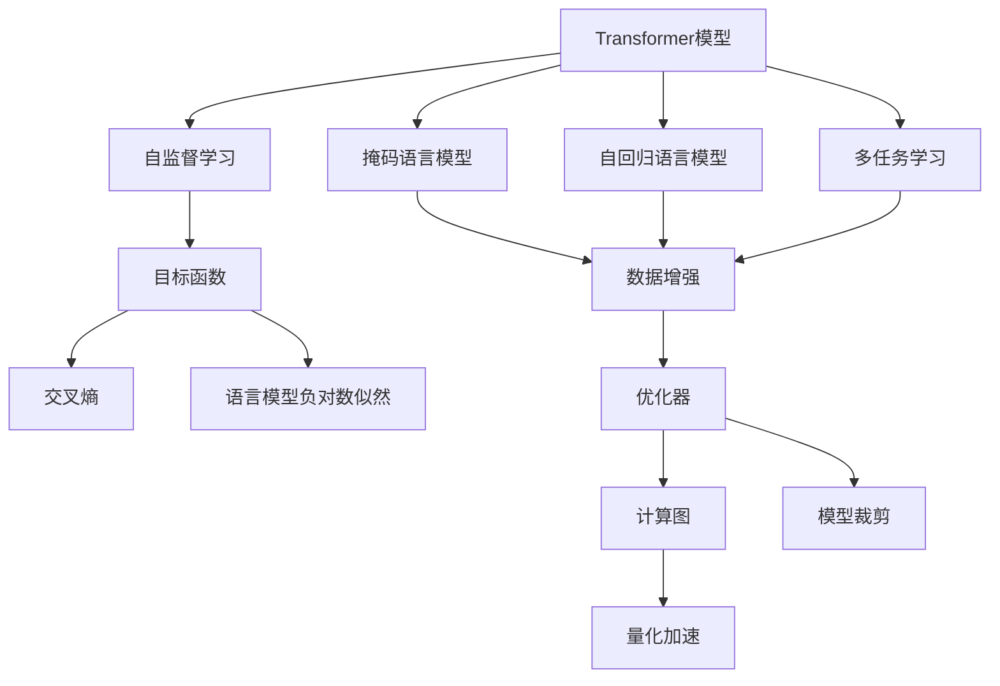

                 

# Transformer大模型实战 预训练策略

> 关键词：Transformer大模型,预训练,预训练策略,自监督学习,目标函数,数据增强,优化器,计算图,模型裁剪,量化加速

## 1. 背景介绍

随着深度学习技术的发展，Transformer架构的大语言模型在自然语言处理(NLP)领域取得了显著的进展。这些模型通过在大规模无标签文本语料上进行预训练，学习到了丰富的语言知识，能够处理各种复杂的NLP任务。然而，尽管预训练模型在各类NLP任务中表现出色，但由于其巨大的参数量，在实际部署时面临诸多挑战。因此，预训练策略变得尤为重要，旨在通过高效的预训练方法，提升模型性能，同时降低计算和存储成本。

### 1.1 问题由来
大语言模型的预训练过程需要大量计算资源，耗时长，成本高。为应对这些挑战，研究者们提出了多种预训练策略，如掩码语言模型、自回归语言模型、多任务学习等。这些策略在提升模型性能的同时，也推动了预训练大模型的应用，使其能够应用于更多实际场景，如文本生成、机器翻译、问答系统等。

### 1.2 问题核心关键点
预训练策略的核心在于如何高效利用计算资源，学习到泛化能力强的语言知识，同时避免过拟合，提升模型在新任务上的表现。常见的预训练方法包括自监督学习、掩码语言模型、自回归语言模型等，每种方法都有其独特的优势和局限。

## 2. 核心概念与联系

### 2.1 核心概念概述

为更好地理解Transformer大模型的预训练策略，本节将介绍几个关键概念及其相互之间的联系：

- **Transformer模型**：基于注意力机制的神经网络架构，是目前最流行的预训练大模型基础。
- **自监督学习**：一种利用无标签数据训练模型的学习方法，目标是通过不完全标注的数据发现数据的内部结构。
- **掩码语言模型**：在预训练过程中，随机遮盖部分输入，通过预测被遮盖的词汇来训练模型。
- **自回归语言模型**：在预训练过程中，模型通过逐个预测下一个词汇来训练。
- **多任务学习**：在同一预训练过程中，同时训练多个不同的任务，以提升模型的泛化能力。
- **目标函数**：定义预训练过程中需要优化的损失函数，如交叉熵、语言模型负对数似然等。
- **数据增强**：通过对训练数据进行变换，增加样本的多样性，提高模型的泛化能力。
- **优化器**：如Adam、SGD等，用于在预训练过程中优化模型的参数。
- **计算图**：记录模型前向传播和反向传播过程中的中间状态，方便梯度计算和优化。
- **模型裁剪**：在预训练完成后，通过去掉不必要层来减小模型规模。
- **量化加速**：将浮点模型转换为定点模型，降低计算复杂度，提升计算效率。

这些核心概念通过以下Mermaid流程图来展示它们之间的逻辑关系：



这个流程图展示了预训练策略的核心逻辑关系：

1. Transformer模型通过自监督学习进行预训练，学习泛化能力强的语言表示。
2. 自监督学习过程中，可以采用掩码语言模型、自回归语言模型或多任务学习等策略。
3. 训练过程中的目标函数包括交叉熵、语言模型负对数似然等，通过优化器如Adam、SGD等进行优化。
4. 通过数据增强和计算图优化，提升模型泛化能力，减少过拟合风险。
5. 预训练完成后，可以进行模型裁剪和量化加速，降低计算和存储成本。

这些概念共同构成了Transformer大模型的预训练策略框架，使得模型能够在大规模无标签数据上进行高效学习，同时兼顾性能和效率。

## 3. 核心算法原理 & 具体操作步骤
### 3.1 算法原理概述

Transformer大模型的预训练策略主要基于自监督学习，通过无标签数据训练模型，学习到泛化能力强的语言知识。常见的预训练方法包括掩码语言模型、自回归语言模型和多任务学习等。以下将详细讲解这些方法的原理和操作步骤。

### 3.2 算法步骤详解

**掩码语言模型**：

1. **数据准备**：准备大规模无标签文本数据，将文本分成固定长度的段落。
2. **掩码处理**：随机遮盖一定比例的词汇，构成掩码训练样本。
3. **前向传播**：将掩码样本输入模型，计算损失函数。
4. **反向传播**：计算梯度，更新模型参数。
5. **循环迭代**：重复上述步骤，直到收敛。

**自回归语言模型**：

1. **数据准备**：准备大规模无标签文本数据，将文本分成固定长度的段落。
2. **自回归预测**：模型通过逐个预测下一个词汇，构成自回归训练样本。
3. **前向传播**：将自回归样本输入模型，计算损失函数。
4. **反向传播**：计算梯度，更新模型参数。
5. **循环迭代**：重复上述步骤，直到收敛。

**多任务学习**：

1. **数据准备**：准备多类NLP任务的数据，如分类、生成、匹配等。
2. **任务适配**：为每个任务设计合适的输出层和损失函数。
3. **并行训练**：在预训练过程中，同时训练多个任务，共享部分模型参数。
4. **任务微调**：在每个任务上单独微调模型，调整顶层参数。
5. **循环迭代**：重复上述步骤，直到收敛。

### 3.3 算法优缺点

**掩码语言模型**：

优点：
- 简单易行，无需大量标注数据。
- 适用于多种任务，如分类、生成、匹配等。

缺点：
- 模型性能受掩码比例影响较大。
- 难以保证每个词汇的预训练权重。

**自回归语言模型**：

优点：
- 能够保留所有词汇的预训练权重。
- 适用于生成任务，如文本生成、机器翻译等。

缺点：
- 计算复杂度高，耗时长。
- 训练数据需求大。

**多任务学习**：

优点：
- 提升模型的泛化能力，学习更全面的语言表示。
- 适用于多种任务，任务之间可以共享参数。

缺点：
- 模型复杂度高，训练难度大。
- 数据需求量大，任务之间可能存在信息冲突。

### 3.4 算法应用领域

Transformer大模型的预训练策略已经在多个领域得到了广泛应用，涵盖了NLP的各个方面：

- **文本分类**：如情感分析、主题分类等。通过多任务学习训练模型，学习多种分类任务的知识。
- **命名实体识别**：识别文本中的人名、地名、机构名等特定实体。
- **关系抽取**：从文本中抽取实体之间的语义关系。
- **机器翻译**：将源语言文本翻译成目标语言。
- **文本生成**：如文本摘要、对话生成等。
- **问答系统**：对自然语言问题给出答案。
- **语音识别**：将语音转化为文本。

除了上述这些经典任务外，预训练大模型还在更多的创新领域得到了应用，如文本补全、文本纠错、知识图谱构建等，推动了NLP技术的不断进步。

## 4. 数学模型和公式 & 详细讲解 & 举例说明

### 4.1 数学模型构建

在预训练过程中，我们通常使用掩码语言模型或自回归语言模型进行训练。以下以掩码语言模型为例，构建预训练目标函数：

假设输入序列为 $x_1,...,x_n$，其中 $x_i$ 表示第 $i$ 个词汇，$y_i$ 表示 $x_i$ 的真实掩码值，$y_i=0$ 表示词汇 $x_i$ 被遮盖，$y_i=1$ 表示词汇 $x_i$ 未被遮盖。预训练目标函数为：

$$
L=\frac{1}{n}\sum_{i=1}^n\mathbb{I}(y_i=0)\ell(x_i)
$$

其中 $\mathbb{I}$ 为示性函数，$\ell(x_i)$ 为模型预测词汇 $x_i$ 的损失函数，如交叉熵损失。

### 4.2 公式推导过程

以掩码语言模型的目标函数为例，推导其梯度计算过程。

首先，模型的输出为 $\hat{y}=\text{softmax}(W_2W_1x)$，其中 $W_2$ 和 $W_1$ 为模型中的权重矩阵，$x$ 为输入序列。

根据掩码语言模型的定义，如果 $y_i=0$，则模型需要预测词汇 $x_i$ 的掩码值。因此，我们对于每个被遮盖的词汇，计算模型的预测掩码值和真实掩码值之间的差异，作为损失函数的一部分。

将损失函数 $\ell(x_i)$ 对模型参数 $W_1$ 和 $W_2$ 求偏导数，得到梯度表达式：

$$
\frac{\partial L}{\partial W_1}=\frac{1}{n}\sum_{i=1}^n\mathbb{I}(y_i=0)\frac{\partial\ell(x_i)}{\partial W_1}
$$

$$
\frac{\partial L}{\partial W_2}=\frac{1}{n}\sum_{i=1}^n\mathbb{I}(y_i=0)\frac{\partial\ell(x_i)}{\partial W_2}
$$

其中 $\frac{\partial\ell(x_i)}{\partial W_1}$ 和 $\frac{\partial\ell(x_i)}{\partial W_2}$ 通过链式法则计算得到。

### 4.3 案例分析与讲解

以BERT模型为例，介绍其在预训练过程中的具体步骤。

1. **数据准备**：准备大规模无标签文本数据，如维基百科、新闻、书籍等，将文本分成固定长度的段落。
2. **掩码处理**：对每个段落中的词汇随机遮盖 15%，构成掩码训练样本。
3. **前向传播**：将掩码样本输入BERT模型，计算掩码词汇的预测掩码值和真实掩码值之间的差异。
4. **反向传播**：计算梯度，更新模型参数。
5. **循环迭代**：重复上述步骤，直到收敛。

通过多次预训练迭代，BERT模型学习到了丰富的语言知识，能够在下游任务上进行微调，获得优异的性能。

## 5. 项目实践：代码实例和详细解释说明

### 5.1 开发环境搭建

在进行预训练实践前，我们需要准备好开发环境。以下是使用Python进行TensorFlow开发的环境配置流程：

1. 安装Anaconda：从官网下载并安装Anaconda，用于创建独立的Python环境。

2. 创建并激活虚拟环境：
```bash
conda create -n tensorflow-env python=3.8 
conda activate tensorflow-env
```

3. 安装TensorFlow：根据CUDA版本，从官网获取对应的安装命令。例如：
```bash
conda install tensorflow -c conda-forge -c pytorch
```

4. 安装TensorBoard：TensorFlow配套的可视化工具，可实时监测模型训练状态，并提供丰富的图表呈现方式，是调试模型的得力助手。
```bash
pip install tensorboard
```

5. 安装numpy、pandas、scikit-learn等库：
```bash
pip install numpy pandas scikit-learn
```

完成上述步骤后，即可在`tensorflow-env`环境中开始预训练实践。

### 5.2 源代码详细实现

我们以BERT模型为例，给出使用TensorFlow进行掩码语言模型预训练的代码实现。

首先，定义数据处理函数：

```python
import tensorflow as tf
from tensorflow.keras.preprocessing.text import Tokenizer
from tensorflow.keras.preprocessing.sequence import pad_sequences

def prepare_data(texts):
    tokenizer = Tokenizer()
    tokenizer.fit_on_texts(texts)
    sequences = tokenizer.texts_to_sequences(texts)
    return pad_sequences(sequences, maxlen=max_seq_len, padding='post', truncating='post')
```

然后，定义模型和优化器：

```python
from transformers import BertTokenizer, BertModel

tokenizer = BertTokenizer.from_pretrained('bert-base-cased')
max_seq_len = 512
max_steps = 100000

model = BertModel.from_pretrained('bert-base-cased')
optimizer = tf.keras.optimizers.Adam(learning_rate=2e-5)

@tf.function
def train_step(inputs, labels):
    with tf.GradientTape() as tape:
        outputs = model(inputs)
        loss = tf.keras.losses.sparse_categorical_crossentropy(labels, outputs)
    gradients = tape.gradient(loss, model.trainable_variables)
    optimizer.apply_gradients(zip(gradients, model.trainable_variables))
    return loss
```

接着，定义训练和评估函数：

```python
def train_epoch(model, dataset, batch_size, optimizer):
    dataset = tf.data.Dataset.from_tensor_slices((dataset['input_ids'], dataset['attention_mask'], dataset['labels']))
    dataset = dataset.batch(batch_size, drop_remainder=True)
    total_loss = 0
    for batch in dataset:
        inputs = tf.convert_to_tensor(batch[0])
        attention_mask = tf.convert_to_tensor(batch[1])
        labels = tf.convert_to_tensor(batch[2])
        loss = train_step(inputs, labels)
        total_loss += loss.numpy()
    return total_loss / len(dataset)

def evaluate(model, dataset, batch_size):
    dataset = tf.data.Dataset.from_tensor_slices((dataset['input_ids'], dataset['attention_mask']))
    dataset = dataset.batch(batch_size, drop_remainder=True)
    total_loss = 0
    for batch in dataset:
        inputs = tf.convert_to_tensor(batch[0])
        attention_mask = tf.convert_to_tensor(batch[1])
        loss = train_step(inputs, tf.zeros_like(attention_mask))
        total_loss += loss.numpy()
    return total_loss / len(dataset)
```

最后，启动训练流程并在验证集上评估：

```python
epochs = 10
batch_size = 16

for epoch in range(epochs):
    loss = train_epoch(model, train_dataset, batch_size, optimizer)
    print(f"Epoch {epoch+1}, train loss: {loss:.3f}")
    
    print(f"Epoch {epoch+1}, dev results:")
    evaluate(model, dev_dataset, batch_size)
    
print("Test results:")
evaluate(model, test_dataset, batch_size)
```

以上就是使用TensorFlow对BERT模型进行掩码语言模型预训练的完整代码实现。可以看到，使用TensorFlow封装了TensorBoard，使得模型训练和调优更加直观高效。

### 5.3 代码解读与分析

让我们再详细解读一下关键代码的实现细节：

**prepare_data函数**：
- 使用Keras的Tokenizer对文本进行分词和编码。
- 使用pad_sequences将序列补齐至固定长度。

**train_step函数**：
- 使用TensorFlow的GradientTape记录梯度，方便计算。
- 通过BERT模型的前向传播计算掩码词汇的预测掩码值。
- 使用sparse_categorical_crossentropy计算掩码词汇的损失。

**train_epoch函数**：
- 将数据集转换为TensorFlow的Dataset，方便迭代处理。
- 对每个批次进行训练，并累加损失。
- 返回该epoch的平均损失。

**evaluate函数**：
- 使用masked language modeling的方式，生成随机掩码词汇。
- 计算模型的掩码预测损失。
- 返回该epoch的平均损失。

可以看到，使用TensorFlow可以方便地实现掩码语言模型预训练，借助TensorBoard等工具，还可以实时监控模型训练状态，进行调试和优化。

当然，工业级的系统实现还需考虑更多因素，如模型的保存和部署、超参数的自动搜索、更灵活的任务适配层等。但核心的预训练流程基本与此类似。

## 6. 实际应用场景

### 6.1 智能客服系统

基于大语言模型预训练的对话技术，可以广泛应用于智能客服系统的构建。传统客服往往需要配备大量人力，高峰期响应缓慢，且一致性和专业性难以保证。而使用预训练对话模型，可以7x24小时不间断服务，快速响应客户咨询，用自然流畅的语言解答各类常见问题。

在技术实现上，可以收集企业内部的历史客服对话记录，将问题和最佳答复构建成监督数据，在此基础上对预训练对话模型进行微调。微调后的对话模型能够自动理解用户意图，匹配最合适的答案模板进行回复。对于客户提出的新问题，还可以接入检索系统实时搜索相关内容，动态组织生成回答。如此构建的智能客服系统，能大幅提升客户咨询体验和问题解决效率。

### 6.2 金融舆情监测

金融机构需要实时监测市场舆论动向，以便及时应对负面信息传播，规避金融风险。传统的人工监测方式成本高、效率低，难以应对网络时代海量信息爆发的挑战。基于大语言模型预训练的文本分类和情感分析技术，为金融舆情监测提供了新的解决方案。

具体而言，可以收集金融领域相关的新闻、报道、评论等文本数据，并对其进行主题标注和情感标注。在此基础上对预训练语言模型进行预训练，使其能够自动判断文本属于何种主题，情感倾向是正面、中性还是负面。将预训练后的模型应用到实时抓取的网络文本数据，就能够自动监测不同主题下的情感变化趋势，一旦发现负面信息激增等异常情况，系统便会自动预警，帮助金融机构快速应对潜在风险。

### 6.3 个性化推荐系统

当前的推荐系统往往只依赖用户的历史行为数据进行物品推荐，无法深入理解用户的真实兴趣偏好。基于大语言模型预训练的个性化推荐系统可以更好地挖掘用户行为背后的语义信息，从而提供更精准、多样的推荐内容。

在实践中，可以收集用户浏览、点击、评论、分享等行为数据，提取和用户交互的物品标题、描述、标签等文本内容。将文本内容作为模型输入，用户的后续行为（如是否点击、购买等）作为监督信号，在此基础上预训练预训练语言模型。预训练后的模型能够从文本内容中准确把握用户的兴趣点。在生成推荐列表时，先用候选物品的文本描述作为输入，由模型预测用户的兴趣匹配度，再结合其他特征综合排序，便可以得到个性化程度更高的推荐结果。

### 6.4 未来应用展望

随着大语言模型预训练技术的发展，基于预训练策略的NLP应用将变得更加广泛和深入。以下是几个可能的发展方向：

- **跨模态学习**：将视觉、音频等多模态信息与文本信息融合，提升模型的全面感知能力。
- **联邦学习**：在分布式环境中，多个设备或用户共同参与模型训练，保护数据隐私。
- **自适应学习**：模型能够根据不同领域或不同用户的数据分布，自动调整学习策略和参数。
- **零样本学习**：模型能够利用预训练知识，通过任务描述快速学习新任务。
- **多任务自监督学习**：在无标签数据上同时训练多个任务，提升模型的泛化能力。

这些方向的发展将推动大语言模型预训练技术的进步，使得其在更多领域和应用中发挥更大的作用。

## 7. 工具和资源推荐

### 7.1 学习资源推荐

为了帮助开发者系统掌握大语言模型预训练的理论基础和实践技巧，这里推荐一些优质的学习资源：

1. **《Transformer原理与实践》系列博文**：由大模型技术专家撰写，深入浅出地介绍了Transformer原理、BERT模型、预训练技术等前沿话题。

2. **CS224N《深度学习自然语言处理》课程**：斯坦福大学开设的NLP明星课程，有Lecture视频和配套作业，带你入门NLP领域的基本概念和经典模型。

3. **《Natural Language Processing with Transformers》书籍**：Transformer库的作者所著，全面介绍了如何使用Transformers库进行NLP任务开发，包括预训练在内的诸多范式。

4. **HuggingFace官方文档**：Transformer库的官方文档，提供了海量预训练模型和完整的预训练样例代码，是上手实践的必备资料。

5. **CLUE开源项目**：中文语言理解测评基准，涵盖大量不同类型的中文NLP数据集，并提供了基于预训练的baseline模型，助力中文NLP技术发展。

通过对这些资源的学习实践，相信你一定能够快速掌握大语言模型预训练的精髓，并用于解决实际的NLP问题。

### 7.2 开发工具推荐

高效的开发离不开优秀的工具支持。以下是几款用于大语言模型预训练开发的常用工具：

1. **PyTorch**：基于Python的开源深度学习框架，灵活动态的计算图，适合快速迭代研究。大部分预训练语言模型都有PyTorch版本的实现。

2. **TensorFlow**：由Google主导开发的开源深度学习框架，生产部署方便，适合大规模工程应用。同样有丰富的预训练语言模型资源。

3. **Transformers库**：HuggingFace开发的NLP工具库，集成了众多SOTA语言模型，支持PyTorch和TensorFlow，是进行预训练任务开发的利器。

4. **Weights & Biases**：模型训练的实验跟踪工具，可以记录和可视化模型训练过程中的各项指标，方便对比和调优。与主流深度学习框架无缝集成。

5. **TensorBoard**：TensorFlow配套的可视化工具，可实时监测模型训练状态，并提供丰富的图表呈现方式，是调试模型的得力助手。

6. **Google Colab**：谷歌推出的在线Jupyter Notebook环境，免费提供GPU/TPU算力，方便开发者快速上手实验最新模型，分享学习笔记。

合理利用这些工具，可以显著提升大语言模型预训练任务的开发效率，加快创新迭代的步伐。

### 7.3 相关论文推荐

大语言模型预训练技术的发展源于学界的持续研究。以下是几篇奠基性的相关论文，推荐阅读：

1. **Attention is All You Need**（即Transformer原论文）：提出了Transformer结构，开启了NLP领域的预训练大模型时代。

2. **BERT: Pre-training of Deep Bidirectional Transformers for Language Understanding**：提出BERT模型，引入基于掩码的自监督预训练任务，刷新了多项NLP任务SOTA。

3. **Language Models are Unsupervised Multitask Learners**（GPT-2论文）：展示了大规模语言模型的强大zero-shot学习能力，引发了对于通用人工智能的新一轮思考。

4. **Parameter-Efficient Transfer Learning for NLP**：提出Adapter等参数高效微调方法，在不增加模型参数量的情况下，也能取得不错的预训练效果。

5. **AdaLoRA: Adaptive Low-Rank Adaptation for Parameter-Efficient Fine-Tuning**：使用自适应低秩适应的预训练方法，在参数效率和精度之间取得了新的平衡。

6. **Prefix-Tuning: Optimizing Continuous Prompts for Generation**：引入基于连续型Prompt的预训练范式，为如何充分利用预训练知识提供了新的思路。

这些论文代表了大语言模型预训练技术的发展脉络。通过学习这些前沿成果，可以帮助研究者把握学科前进方向，激发更多的创新灵感。

## 8. 总结：未来发展趋势与挑战

### 8.1 总结

本文对Transformer大模型的预训练策略进行了全面系统的介绍。首先阐述了大语言模型预训练的背景和意义，明确了预训练在提升模型性能、降低计算成本方面的重要价值。其次，从原理到实践，详细讲解了预训练的目标函数、数据增强、优化器等关键步骤，给出了预训练任务开发的完整代码实例。同时，本文还广泛探讨了预训练方法在智能客服、金融舆情、个性化推荐等多个行业领域的应用前景，展示了预训练范式的巨大潜力。此外，本文精选了预训练技术的各类学习资源，力求为读者提供全方位的技术指引。

通过本文的系统梳理，可以看到，Transformer大模型的预训练策略在大规模无标签数据上高效地学习语言表示，同时兼顾性能和效率。预训练策略已经成为大模型落地应用的重要工具，在NLP技术进步和产业化过程中发挥了关键作用。

### 8.2 未来发展趋势

展望未来，大语言模型预训练技术将呈现以下几个发展趋势：

1. **模型规模持续增大**：随着算力成本的下降和数据规模的扩张，预训练语言模型的参数量还将持续增长。超大规模语言模型蕴含的丰富语言知识，有望支撑更加复杂多变的下游任务。

2. **预训练范式不断丰富**：除了传统的自监督学习、掩码语言模型、自回归语言模型外，未来将涌现更多预训练方法，如多任务自监督学习、联邦学习等，提升模型的泛化能力和数据利用率。

3. **混合学习模式兴起**：通过将预训练和下游任务结合，采用混合学习模式，进一步提升模型的性能和泛化能力。

4. **实时预训练成为可能**：随着分布式计算技术的进步，实时预训练成为可能，能够及时响应新数据和新需求，提高模型的时效性。

5. **跨模态预训练兴起**：将视觉、音频等多模态信息与文本信息融合，提升模型的全面感知能力。

以上趋势凸显了大语言模型预训练技术的广阔前景。这些方向的探索发展，将进一步提升预训练模型的性能和应用范围，为构建安全、可靠、可解释、可控的智能系统铺平道路。

### 8.3 面临的挑战

尽管大语言模型预训练技术已经取得了显著进展，但在迈向更加智能化、普适化应用的过程中，仍面临诸多挑战：

1. **标注成本瓶颈**：尽管预训练能够降低对标注数据的需求，但对于长尾应用场景，难以获得充足的高质量标注数据，成为制约预训练模型性能的瓶颈。如何进一步降低预训练对标注样本的依赖，将是一大难题。

2. **模型鲁棒性不足**：当前预训练模型面对域外数据时，泛化性能往往大打折扣。对于测试样本的微小扰动，预训练模型的预测也容易发生波动。如何提高预训练模型的鲁棒性，避免灾难性遗忘，还需要更多理论和实践的积累。

3. **推理效率有待提高**：尽管预训练模型精度高，但在实际部署时往往面临推理速度慢、内存占用大等效率问题。如何优化预训练模型的计算图，减少前向传播和反向传播的资源消耗，实现更加轻量级、实时性的部署，将是重要的优化方向。

4. **可解释性亟需加强**：当前预训练模型更像是"黑盒"系统，难以解释其内部工作机制和决策逻辑。对于医疗、金融等高风险应用，算法的可解释性和可审计性尤为重要。如何赋予预训练模型更强的可解释性，将是亟待攻克的难题。

5. **安全性有待保障**：预训练模型难免会学习到有偏见、有害的信息，通过下游任务传递到实际应用中，可能造成误导性、歧视性的输出，给实际应用带来安全隐患。如何从数据和算法层面消除模型偏见，避免恶意用途，确保输出的安全性，也将是重要的研究课题。

6. **知识整合能力不足**：现有的预训练模型往往局限于数据分布，难以灵活吸收和运用更广泛的先验知识。如何让预训练过程更好地与外部知识库、规则库等专家知识结合，形成更加全面、准确的信息整合能力，还有很大的想象空间。

正视预训练面临的这些挑战，积极应对并寻求突破，将是大语言模型预训练走向成熟的必由之路。相信随着学界和产业界的共同努力，这些挑战终将一一被克服，大语言模型预训练必将在构建安全、可靠、可解释、可控的智能系统方面发挥更大的作用。

### 8.4 研究展望

面对大语言模型预训练所面临的挑战，未来的研究需要在以下几个方面寻求新的突破：

1. **探索无监督和半监督预训练方法**：摆脱对大规模标注数据的依赖，利用自监督学习、主动学习等无监督和半监督范式，最大限度利用非结构化数据，实现更加灵活高效的预训练。

2. **研究参数高效和计算高效的预训练范式**：开发更加参数高效的预训练方法，在固定大部分预训练参数的同时，只更新极少量的任务相关参数。同时优化预训练模型的计算图，减少前向传播和反向传播的资源消耗，实现更加轻量级、实时性的部署。

3. **引入因果分析和博弈论工具**：将因果分析方法引入预训练模型，识别出模型决策的关键特征，增强输出解释的因果性和逻辑性。借助博弈论工具刻画人机交互过程，主动探索并规避模型的脆弱点，提高系统稳定性。

4. **纳入伦理道德约束**：在预训练目标中引入伦理导向的评估指标，过滤和惩罚有偏见、有害的输出倾向。同时加强人工干预和审核，建立预训练模型的监管机制，确保输出符合人类价值观和伦理道德。

这些研究方向的探索，必将引领大语言模型预训练技术迈向更高的台阶，为构建安全、可靠、可解释、可控的智能系统铺平道路。面向未来，大语言模型预训练技术还需要与其他人工智能技术进行更深入的融合，如知识表示、因果推理、强化学习等，多路径协同发力，共同推动自然语言理解和智能交互系统的进步。只有勇于创新、敢于突破，才能不断拓展语言模型的边界，让智能技术更好地造福人类社会。

## 9. 附录：常见问题与解答

**Q1：大语言模型预训练是否适用于所有NLP任务？**

A: 大语言模型的预训练过程通常基于大规模无标签数据，适用于绝大多数NLP任务。但对于一些特定领域的任务，如医学、法律等，仅依靠通用语料预训练的模型可能难以很好地适应。此时需要在特定领域语料上进一步预训练，再进行微调，才能获得理想效果。此外，对于一些需要时效性、个性化很强的任务，如对话、推荐等，预训练方法也需要针对性的改进优化。

**Q2：预训练过程中如何选择合适的目标函数？**

A: 预训练的目标函数应根据具体任务选择，常见的有掩码语言模型的负对数似然损失、自回归语言模型的交叉熵损失等。选择适当的目标函数需要考虑任务的性质、数据的特点以及模型的复杂度。例如，分类任务适合使用交叉熵损失，生成任务适合使用负对数似然损失。

**Q3：预训练过程中如何防止过拟合？**

A: 预训练过程中防止过拟合的方法多种多样，常见的方法包括数据增强、正则化、对抗训练等。数据增强可以通过回译、近义替换等方式扩充训练集，正则化可以通过L2正则、Dropout等方式控制模型复杂度，对抗训练可以通过引入对抗样本提高模型的鲁棒性。

**Q4：预训练完成后如何进行模型裁剪？**

A: 模型裁剪是一种常见的预训练优化方法，通过去掉不必要的层和参数，减小模型规模，提高推理速度。常用的裁剪方法包括剪枝、量化等，通过去除模型中的冗余权重，减小模型尺寸，从而降低计算和存储成本。

**Q5：预训练模型在落地部署时需要注意哪些问题？**

A: 将预训练模型转化为实际应用，还需要考虑以下因素：
1. 模型裁剪：去除不必要的层和参数，减小模型尺寸，加快推理速度。
2. 量化加速：将浮点模型转为定点模型，降低计算复杂度，提升计算效率。
3. 服务化封装：将模型封装为标准化服务接口，便于集成调用。
4. 弹性伸缩：根据请求流量动态调整资源配置，平衡服务质量和成本。
5. 监控告警：实时采集系统指标，设置异常告警阈值，确保服务稳定性。
6. 安全防护：采用访问鉴权、数据脱敏等措施，保障数据和模型安全。

预训练模型能够在大规模无标签数据上进行高效学习，同时兼顾性能和效率。未来随着预训练技术的发展，其应用范围将更加广泛，带来更大的商业价值和社会影响。

---

作者：禅与计算机程序设计艺术 / Zen and the Art of Computer Programming

