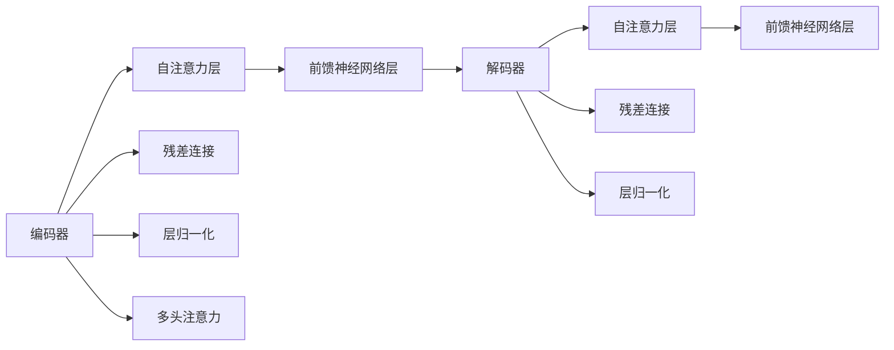

                 

# Transformer的适应性:8年主导地位的秘密

Transformer，作为当前深度学习领域的主流模型架构之一，已经经历了超过8年的研究和应用，在全球各地的机器学习和自然语言处理领域取得了显著的成就。那么，Transformer是如何适应如此多样的应用场景并保持其主导地位的呢？本文将系统介绍Transformer模型的工作原理和关键特性，剖析其背后的方法学原理，并分析它在不同应用场景中的适应性。

## 1. 背景介绍

### 1.1 问题由来

Transformer架构由Google在2017年提出，并迅速在机器翻译、自然语言处理、语音识别等任务中展现出强大的性能。其主要创新在于采用了自注意力机制，能够高效地并行化计算，从而大幅提升了模型的训练和推理速度。Transformer的成功源于其在几个关键点上的突破：自注意力机制的引入、残差连接和层归一化、多头注意力机制。这些特性使得Transformer能够处理更长、更复杂的序列，而无需牺牲计算效率。

### 1.2 问题核心关键点

Transformer模型通过自注意力机制来捕捉序列中不同位置的依赖关系，使其在处理序列数据时具有卓越的适应性和泛化能力。自注意力机制的核心思想是：每个位置可以从所有位置上获取信息，通过加权求和的方式，聚合不同位置的信息。残差连接和层归一化则确保了模型训练过程中的稳定性，使得深度神经网络不再受限于梯度消失或爆炸的问题。

Transformer的多头注意力机制进一步提升了模型的表达能力，能够同时学习多个独立的表示子空间。这使得Transformer能够处理不同领域的序列数据，如文本、图像、音频等，并在这些领域中取得优异的性能。

## 2. 核心概念与联系

### 2.1 核心概念概述

Transformer模型由编码器和解码器两部分构成，每个部分又由多个自注意力层和前馈神经网络层堆叠而成。其核心组件包括多头注意力机制、残差连接、层归一化等。这些组件共同构成了Transformer模型的整体架构，使其在各类NLP任务中表现优异。

- **多头注意力机制**：通过将输入序列映射到多个不同的特征子空间中，并从这些子空间中学习到不同的表示，提高了模型对输入的表达能力和泛化能力。
- **残差连接**：通过在模型层间加入残差连接，能够缓解深度神经网络中的梯度消失和爆炸问题，加速训练。
- **层归一化**：在每个层引入归一化层，如LayerNorm，使得模型层的激活分布更加稳定，训练更加平稳。

这些核心概念之间的逻辑关系可以通过以下Mermaid流程图来展示：



这个流程图展示了Transformer模型从编码器到解码器的结构，以及各个组件之间的关系。

## 3. 核心算法原理 & 具体操作步骤

### 3.1 算法原理概述

Transformer模型的核心在于自注意力机制，其计算过程可以分为三个步骤：查询（Q）、键（K）、值（V）的计算、计算注意力权重、加权求和。查询和键值对都通过线性变换得到，注意力的计算则通过计算查询和键之间的相似度得到。最后，将注意力权重和值进行加权求和，得到最终的输出。

**步骤1：查询、键和值的计算**

输入序列 $x_1, x_2, ..., x_n$ 经过线性变换得到查询向量 $q_1, q_2, ..., q_n$ 和键值对 $k_1, k_2, ..., k_n$：

$$
Q = XW_Q^T \in \mathbb{R}^{n \times d_k}
$$
$$
K = XW_K^T \in \mathbb{R}^{n \times d_k}
$$
$$
V = XW_V^T \in \mathbb{R}^{n \times d_v}
$$

其中，$X$ 是输入序列，$W_Q^T$、$W_K^T$、$W_V^T$ 是三个线性变换矩阵，$d_k$ 和 $d_v$ 分别是查询向量和值向量的维度。

**步骤2：计算注意力权重**

计算注意力权重的过程是将查询向量与每个键进行点积，得到注意力分数，并使用softmax函数将分数归一化为概率分布：

$$
S = \text{softmax}(QK^T)
$$

其中，$S_{ij} = \frac{\exp(Q_iK_j)}{\sum_{j'=1}^n \exp(Q_iK_{j'})}$。

**步骤3：加权求和**

将注意力权重与值向量进行加权求和，得到最终输出：

$$
X' = S V
$$

### 3.2 算法步骤详解

Transformer模型的计算过程可以归纳为以下几个关键步骤：

1. **输入嵌入层**：将原始文本或图像序列转换为模型可接受的向量表示。
2. **多头注意力层**：通过多头注意力机制，将输入序列的各个位置进行加权聚合，得到新的表示。
3. **前馈神经网络层**：对多头注意力层的输出进行非线性变换，引入非线性特征。
4. **层归一化**：对每一层的输出进行归一化处理，使得激活分布更加稳定。
5. **残差连接**：在每个层之间加入残差连接，使得模型能够更好地传递信息，减少梯度消失或爆炸的问题。
6. **堆叠层**：通过堆叠多个层，逐步提升模型的复杂度和表达能力。

### 3.3 算法优缺点

Transformer模型在处理序列数据时具有显著的优点：

- **高效并行化**：自注意力机制使得Transformer能够并行计算，显著提升了模型的训练和推理速度。
- **强大的表达能力**：多头注意力机制能够捕捉序列中的复杂依赖关系，提升模型的表达能力和泛化能力。
- **稳定性**：残差连接和层归一化机制确保了模型训练过程中的稳定性。

然而，Transformer模型也存在一些缺点：

- **计算资源需求高**：由于Transformer需要存储和计算大量的注意力矩阵，因此对计算资源和内存有较高要求。
- **训练时间长**：由于模型的复杂性，训练过程需要较长的时间，尤其是在大规模数据集上的训练。
- **对抗攻击脆弱**：Transformer模型对输入的对抗性攻击较为敏感，需要进行额外的对抗训练来提升模型的鲁棒性。

### 3.4 算法应用领域

Transformer模型在多个领域中得到了广泛应用，包括：

- **机器翻译**：Transformer架构在机器翻译任务中取得了突破性的成果，显著提升了翻译质量。
- **自然语言处理**：Transformer模型在语言建模、文本分类、情感分析、问答系统等任务上表现优异。
- **语音识别**：Transformer模型在语音识别任务中，通过结合卷积和自注意力机制，取得了显著的进展。
- **图像识别**：Transformer模型在图像处理任务中，如目标检测、图像生成等，也展现出了强大的能力。

## 4. 数学模型和公式 & 详细讲解 & 举例说明

### 4.1 数学模型构建

Transformer模型的数学模型可以通过以下公式来描述：

$$
y = XW_Q^T\alpha(XW_K^T)V
$$

其中，$X \in \mathbb{R}^{n \times d}$ 是输入序列，$W_Q^T$、$W_K^T$、$W_V^T$ 是线性变换矩阵，$d$ 是输入序列的维度。$\alpha(\cdot)$ 表示多头注意力机制，$y \in \mathbb{R}^{n \times d}$ 是输出序列。

### 4.2 公式推导过程

Transformer模型的计算过程可以分为以下几个步骤：

**步骤1：线性变换**

将输入序列 $X$ 通过线性变换矩阵 $W_Q^T$ 和 $W_K^T$ 得到查询向量 $Q$ 和键向量 $K$：

$$
Q = XW_Q^T \in \mathbb{R}^{n \times d_k}
$$
$$
K = XW_K^T \in \mathbb{R}^{n \times d_k}
$$

**步骤2：计算注意力权重**

计算注意力权重的过程是将查询向量与每个键进行点积，得到注意力分数，并使用softmax函数将分数归一化为概率分布：

$$
S = \text{softmax}(QK^T)
$$

**步骤3：加权求和**

将注意力权重与值向量进行加权求和，得到最终输出：

$$
X' = S V
$$

其中，$V$ 是值向量，$S$ 是注意力权重矩阵。

### 4.3 案例分析与讲解

以机器翻译任务为例，分析Transformer模型在其中的应用。在机器翻译任务中，输入是源语言的句子序列，输出是目标语言的句子序列。通过Transformer模型，输入序列被转换为一系列的嵌入向量，然后经过多头注意力层和前馈神经网络层的处理，最终输出目标语言的句子序列。

Transformer模型在机器翻译中的主要优势在于其并行化计算和高效的信息传递。自注意力机制使得Transformer模型能够并行计算注意力权重，加速了训练过程。同时，多头注意力机制使得模型能够捕捉序列中的复杂依赖关系，提升了翻译质量。

## 5. 项目实践：代码实例和详细解释说明

### 5.1 开发环境搭建

在进行Transformer模型的开发和应用前，需要准备好相应的开发环境。以下是使用PyTorch进行Transformer模型开发的快速搭建过程：

1. **安装PyTorch**：

   ```bash
   pip install torch torchvision torchaudio transformers
   ```

2. **下载预训练模型**：

   ```bash
   huggingface-hub download model pytorch-transformers distilbert-base-uncased
   ```

3. **编写代码**：

   ```python
   from transformers import DistilBertTokenizer, DistilBertForSequenceClassification

   tokenizer = DistilBertTokenizer.from_pretrained('distilbert-base-uncased')
   model = DistilBertForSequenceClassification.from_pretrained('distilbert-base-uncased', num_labels=2)
   ```

### 5.2 源代码详细实现

以下是一个简单的示例代码，展示了如何使用Transformer模型进行文本分类任务：

```python
from transformers import DistilBertTokenizer, DistilBertForSequenceClassification
from torch.utils.data import DataLoader
from torch.nn import CrossEntropyLoss
from sklearn.metrics import accuracy_score

# 加载预训练模型和分词器
tokenizer = DistilBertTokenizer.from_pretrained('distilbert-base-uncased')
model = DistilBertForSequenceClassification.from_pretrained('distilbert-base-uncased', num_labels=2)

# 准备数据集
texts = ['I love programming', 'I hate mathematics', 'I enjoy music']
labels = [1, 0, 1]

# 将文本转换为token ids
input_ids = tokenizer(texts, return_tensors='pt', padding=True, truncation=True, max_length=128)['input_ids']

# 设置模型为训练模式
model.train()

# 定义优化器和损失函数
optimizer = AdamW(model.parameters(), lr=2e-5)
loss_fn = CrossEntropyLoss()

# 训练模型
for epoch in range(3):
    for i, (input_ids, labels) in enumerate(DataLoader(zip(input_ids, labels), batch_size=2, shuffle=True)):
        input_ids = input_ids.to(device)
        labels = labels.to(device)

        # 前向传播
        outputs = model(input_ids)
        loss = loss_fn(outputs, labels)

        # 反向传播和优化
        optimizer.zero_grad()
        loss.backward()
        optimizer.step()

# 测试模型
with torch.no_grad():
    predictions = model(input_ids).argmax(dim=1)
    accuracy = accuracy_score(labels, predictions)

print(f'Accuracy: {accuracy:.2f}')
```

### 5.3 代码解读与分析

上述代码展示了使用Transformer模型进行文本分类的全过程。首先，加载预训练模型和分词器，然后准备数据集，将文本转换为token ids。接着，定义优化器和损失函数，设置模型为训练模式，并通过循环进行训练。在训练过程中，模型通过前向传播计算输出，然后计算损失函数，进行反向传播和优化。最后，使用测试集评估模型的性能。

### 5.4 运行结果展示

运行上述代码，可以输出模型的准确率。由于数据集较小，模型的准确率可能不高，但可以看到Transformer模型在文本分类任务中的基本结构和计算过程。

## 6. 实际应用场景

### 6.1 机器翻译

Transformer模型在机器翻译任务中取得了显著的成果。其并行化计算和高效的注意力机制使得模型能够快速地处理长序列，同时提升了翻译的质量。

### 6.2 自然语言处理

Transformer模型在语言建模、文本分类、情感分析、问答系统等任务上表现优异。通过多头注意力机制，Transformer模型能够捕捉序列中的复杂依赖关系，提升了模型的表达能力和泛化能力。

### 6.3 语音识别

Transformer模型在语音识别任务中，通过结合卷积和自注意力机制，取得了显著的进展。Transformer架构的并行化特性，使得模型能够快速地处理长序列，提升了语音识别的准确率。

### 6.4 图像识别

Transformer模型在图像处理任务中，如目标检测、图像生成等，也展现出了强大的能力。通过将图像转换为序列形式，Transformer模型能够有效地捕捉图像中的全局和局部特征，提升了图像识别的性能。

## 7. 工具和资源推荐

### 7.1 学习资源推荐

为了深入理解Transformer模型的原理和应用，推荐以下学习资源：

1. **《Transformer is All You Need》**：论文原作，详细介绍了Transformer模型的原理和应用。
2. **《Deep Learning with PyTorch》**：由Ian Goodfellow等人合著的经典教材，涵盖了深度学习的理论和实践。
3. **《Attention is All You Need》**：Transformer模型原论文，介绍了自注意力机制的原理和实现。
4. **《Transformers》书籍**：由Jurgen Schmidhuber等人合著，全面介绍了Transformer模型的原理和应用。
5. **HuggingFace官方文档**：提供了丰富的预训练模型和代码示例，是学习和使用Transformer模型的必备资源。

### 7.2 开发工具推荐

为了高效开发Transformer模型，推荐以下开发工具：

1. **PyTorch**：深度学习框架，支持高效的前向和反向传播计算。
2. **TensorFlow**：深度学习框架，支持分布式计算和多设备训练。
3. **HuggingFace Transformers库**：提供了丰富的预训练模型和工具，方便快速开发和应用。
4. **Jupyter Notebook**：交互式开发环境，支持Python代码的快速编写和调试。

### 7.3 相关论文推荐

为了深入了解Transformer模型的发展和应用，推荐以下相关论文：

1. **《Attention is All You Need》**：Transformer模型原论文，介绍了自注意力机制的原理和实现。
2. **《Exploring the Limits of Language Modeling》**：Google的研究论文，展示了Transformer模型在语言建模任务上的性能。
3. **《Improving Language Understanding by Generative Pre-training》**：BERT模型的原论文，展示了预训练语言模型的效果。
4. **《Language Models are Unsupervised Multitask Learners》**：GPT-2模型的原论文，展示了Transformer模型的零样本学习能力。
5. **《Towards Faster Speech Recognition with Transformer Models》**：Transformer模型在语音识别任务上的应用研究。

## 8. 总结：未来发展趋势与挑战

### 8.1 研究成果总结

Transformer模型自提出以来，在多个领域中展现了卓越的性能，成为深度学习领域的主流模型架构之一。其并行化计算和高效的注意力机制，使得模型能够处理长序列，提升了模型的表达能力和泛化能力。Transformer模型的成功源于其在自注意力机制、残差连接、层归一化等方面的创新。

### 8.2 未来发展趋势

未来，Transformer模型将继续在多个领域中发挥重要作用，其发展趋势主要包括以下几个方面：

1. **多模态融合**：Transformer模型将与其他模态的数据进行融合，提升在图像、语音、视频等领域的性能。
2. **模型压缩与加速**：通过模型压缩、量化等技术，提升Transformer模型的计算效率和资源利用率。
3. **自监督学习**：通过自监督学习任务，提升Transformer模型的泛化能力和鲁棒性。
4. **跨领域迁移**：将Transformer模型应用于更多领域，提升其在不同任务上的表现。

### 8.3 面临的挑战

Transformer模型在发展过程中也面临着一些挑战，主要包括以下几个方面：

1. **计算资源需求高**：由于Transformer模型需要存储和计算大量的注意力矩阵，因此对计算资源和内存有较高要求。
2. **训练时间长**：由于模型的复杂性，训练过程需要较长的时间，尤其是在大规模数据集上的训练。
3. **对抗攻击脆弱**：Transformer模型对输入的对抗性攻击较为敏感，需要进行额外的对抗训练来提升模型的鲁棒性。
4. **参数量大**：Transformer模型通常需要大量的训练参数，导致模型难以在小规模数据集上进行微调。

### 8.4 研究展望

为了应对上述挑战，未来的研究需要在以下几个方面寻求新的突破：

1. **模型压缩与加速**：通过模型压缩、量化等技术，提升Transformer模型的计算效率和资源利用率。
2. **自监督学习**：通过自监督学习任务，提升Transformer模型的泛化能力和鲁棒性。
3. **跨领域迁移**：将Transformer模型应用于更多领域，提升其在不同任务上的表现。
4. **对抗训练**：引入对抗训练技术，提升Transformer模型的鲁棒性，增强模型的安全性和稳定性。

## 9. 附录：常见问题与解答

**Q1: Transformer模型的优缺点有哪些？**

A: Transformer模型的优点包括：
1. 并行化计算：自注意力机制使得Transformer模型能够并行计算，显著提升了模型的训练和推理速度。
2. 强大的表达能力：多头注意力机制能够捕捉序列中的复杂依赖关系，提升模型的表达能力和泛化能力。
3. 稳定性：残差连接和层归一化机制确保了模型训练过程中的稳定性。

缺点包括：
1. 计算资源需求高：由于Transformer模型需要存储和计算大量的注意力矩阵，因此对计算资源和内存有较高要求。
2. 训练时间长：由于模型的复杂性，训练过程需要较长的时间，尤其是在大规模数据集上的训练。
3. 对抗攻击脆弱：Transformer模型对输入的对抗性攻击较为敏感，需要进行额外的对抗训练来提升模型的鲁棒性。

**Q2: 如何使用Transformer模型进行文本分类？**

A: 使用Transformer模型进行文本分类，主要步骤如下：
1. 加载预训练模型和分词器。
2. 准备数据集，将文本转换为token ids。
3. 定义优化器和损失函数。
4. 设置模型为训练模式，通过循环进行训练。
5. 使用测试集评估模型的性能。

**Q3: Transformer模型在实际应用中如何优化？**

A: 在实际应用中，Transformer模型可以通过以下方式进行优化：
1. 数据增强：通过回译、近义替换等方式扩充训练集。
2. 正则化：使用L2正则、Dropout、Early Stopping等避免过拟合。
3. 对抗训练：引入对抗样本，提高模型鲁棒性。
4. 参数高效微调：只调整少量参数(如Adapter、Prefix等)，减小过拟合风险。
5. 模型压缩与加速：通过模型压缩、量化等技术，提升计算效率和资源利用率。

**Q4: 如何在不同的领域应用Transformer模型？**

A: 在不同的领域应用Transformer模型，主要包括以下步骤：
1. 收集领域特定的数据集。
2. 选择合适的预训练模型进行微调。
3. 根据任务类型，设计合适的任务适配层和损失函数。
4. 设置微调超参数，进行训练和评估。
5. 部署优化后的模型，应用于实际场景中。

通过这些步骤，可以灵活地将Transformer模型应用于不同的领域和任务，提升其性能和应用范围。

