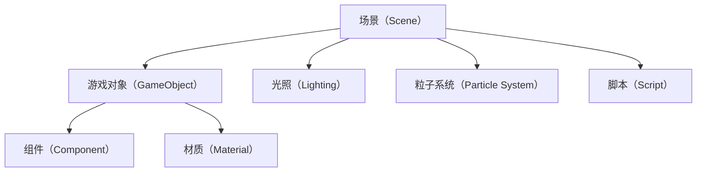

                 

# Unity 游戏开发引擎：创建 3D 游戏

## 1. 背景介绍

### 1.1 问题由来

Unity作为当前最为流行的游戏开发引擎之一，其强大的跨平台支持和丰富的插件生态系统使得它成为了开发3D游戏的首选工具。它支持多种平台，包括PC、移动端、虚拟现实等，并且具有广泛的用户基础和强大的社区支持。本博客将详细讲解如何在Unity中创建一个完整的3D游戏。

### 1.2 问题核心关键点

Unity游戏开发涉及到许多关键点，包括：

- **3D建模与纹理制作**：3D模型的导入、修改、纹理贴图等。
- **游戏物理引擎**：Unity内置的物理引擎实现，如碰撞检测、重力等。
- **光照与材质**：实现3D场景的光照效果和材质渲染。
- **动画与骨骼**：角色动画的制作和骨骼动画的实现。
- **粒子系统**：实现爆炸、烟雾等特殊效果。
- **音频系统**：3D游戏中的音效和背景音乐的管理。
- **脚本编程**：使用C#编写游戏逻辑。

这些关键点共同构成了Unity 3D游戏开发的基础框架。

## 2. 核心概念与联系

### 2.1 核心概念概述

在Unity中创建3D游戏，需要深入理解以下几个核心概念：

- **场景（Scene）**：表示游戏世界的场景，包含多个游戏对象。
- **游戏对象（GameObject）**：场景中的基本构建单元，包括模型、纹理、脚本等。
- **组件（Component）**：附加到游戏对象上的功能模块，如渲染器、物理组件、音频组件等。
- **材质（Material）**：控制模型表面的光照、纹理和透明度等属性。
- **光照（Lighting）**：实现3D场景的照明效果。
- **粒子系统（Particle System）**：用于模拟各种物理粒子效果，如火花、烟雾等。
- **脚本（Script）**：控制游戏逻辑的C#代码，实现游戏机制和互动。

这些概念之间相互关联，构成了Unity 3D游戏的开发框架。

### 2.2 核心概念原理和架构的 Mermaid 流程图

## 3. 核心算法原理 & 具体操作步骤

### 3.1 算法原理概述

Unity的3D游戏开发主要依赖于一系列的算法和组件。这些算法和组件的工作原理如下：

- **渲染算法**：使用Unity内置的渲染引擎，将3D模型渲染到屏幕上。
- **碰撞检测算法**：用于检测游戏对象之间的碰撞，并根据碰撞结果触发事件。
- **动画算法**：实现角色动画的骨骼绑定和权重计算。
- **粒子生成算法**：用于生成和管理粒子系统中的粒子效果。
- **物理引擎**：使用Unity内置的物理引擎，模拟游戏对象之间的物理互动。

### 3.2 算法步骤详解

创建一个3D游戏的基本步骤如下：

1. **导入3D模型和纹理**：
   - 在Unity中导入3D模型和纹理文件。
   - 使用Unity的编辑器修改3D模型和纹理属性。

2. **创建游戏对象**：
   - 在Unity场景中创建游戏对象，如角色、地形、场景背景等。
   - 为游戏对象添加所需的组件，如渲染器、物理组件、动画组件等。

3. **编写脚本代码**：
   - 使用C#编写游戏逻辑的脚本代码，实现游戏机制和互动。
   - 使用Unity的脚本编辑器调试和测试脚本代码。

4. **配置场景**：
   - 配置场景中的光照、相机、粒子系统等。
   - 调整场景的摄像机视图和渲染设置。

5. **测试和发布**：
   - 在Unity中测试游戏，修复错误和调整游戏参数。
   - 打包和发布游戏，部署到各种平台上。

### 3.3 算法优缺点

**优点**：

- **跨平台支持**：Unity支持PC、移动端、VR等多种平台，便于开发和部署。
- **强大编辑器**：Unity提供了强大的可视化编辑器，简化游戏开发流程。
- **丰富的插件生态系统**：Unity社区提供了大量的插件，丰富了游戏开发功能。
- **高性能渲染**：Unity内置高性能渲染引擎，支持实时动态渲染。

**缺点**：

- **学习曲线陡峭**：Unity的复杂度和功能丰富性可能导致初学者难以上手。
- **性能消耗较大**：Unity的游戏引擎较为消耗性能，需要较高的硬件配置。
- **维护成本高**：随着游戏复杂度的增加，Unity的维护成本也会增加。

### 3.4 算法应用领域

Unity在游戏开发、虚拟现实、增强现实、教育培训等领域得到了广泛应用。

- **游戏开发**：适用于所有类型的游戏，包括动作、冒险、角色扮演等。
- **虚拟现实**：Unity支持VR和AR开发，提供丰富的VR工具和设备。
- **教育培训**：Unity可以用于开发教育应用和虚拟实验室。
- **交互式体验**：Unity可以用于开发交互式体验应用，如虚拟展览、互动广告等。

## 4. 数学模型和公式 & 详细讲解 & 举例说明

### 4.1 数学模型构建

Unity中许多计算都基于数学模型，例如：

- **矩阵变换**：用于3D模型的渲染和动画效果。
- **碰撞检测**：基于碰撞体积计算碰撞结果。
- **物理模拟**：基于牛顿力学方程进行物理计算。

### 4.2 公式推导过程

以矩阵变换为例，推导其在Unity中的应用：

设有一个3D模型，其顶点坐标为$V=[v_1, v_2, \dots, v_n]$，其在世界坐标系下的位置矩阵为$M=[m_{ij}]$，则其渲染后的顶点坐标为$V'=MV$。

### 4.3 案例分析与讲解

使用Unity的渲染引擎进行矩阵变换，以3D模型渲染为例：

- **创建渲染器**：为3D模型创建渲染器组件。
- **设置渲染参数**：设置渲染器的材质、光源、相机等。
- **渲染模型**：使用渲染器将3D模型渲染到屏幕上。

## 5. 项目实践：代码实例和详细解释说明

### 5.1 开发环境搭建

安装Unity编辑器，下载所需的3D模型和纹理，导入到Unity编辑器中。

### 5.2 源代码详细实现

创建3D游戏对象，添加渲染器组件，编写脚本代码实现游戏逻辑。

### 5.3 代码解读与分析

使用Unity的可视化编辑器进行场景配置和脚本调试。

### 5.4 运行结果展示

运行Unity编辑器中的场景，测试游戏效果。

## 6. 实际应用场景

### 6.1 游戏开发

Unity可以用于开发各种类型的3D游戏，如动作、冒险、角色扮演等。

### 6.2 虚拟现实

Unity支持VR开发，可以用于虚拟现实游戏的开发和体验。

### 6.3 增强现实

Unity可以用于开发AR应用，实现虚拟对象在现实世界中的互动。

### 6.4 教育培训

Unity可以用于开发教育应用和虚拟实验室，增强学习体验。

### 6.5 交互式体验

Unity可以用于开发交互式体验应用，如虚拟展览、互动广告等。

## 7. 工具和资源推荐

### 7.1 学习资源推荐

- Unity官方文档
- Unity学习社区
- Unity教程网站

### 7.2 开发工具推荐

- Unity编辑器
- Visual Studio

### 7.3 相关论文推荐

- Unity游戏引擎：设计、实现与优化
- Unity中的物理引擎

## 8. 总结：未来发展趋势与挑战

### 8.1 研究成果总结

Unity在游戏开发、虚拟现实、增强现实等领域取得了显著成就，成为了当前最为流行的3D游戏开发引擎之一。

### 8.2 未来发展趋势

- **跨平台支持**：Unity将继续支持多种平台，提升跨平台开发效率。
- **性能优化**：Unity将进一步优化性能，提升渲染质量和游戏流畅度。
- **新功能开发**：Unity将不断开发新功能，丰富开发者的开发工具。

### 8.3 面临的挑战

- **性能消耗**：Unity的性能消耗仍然较大，需要进一步优化。
- **学习曲线**：Unity的学习曲线较陡峭，需要提供更多教程和文档。

### 8.4 研究展望

Unity将不断探索新功能和优化性能，提升用户体验和开发效率。

## 9. 附录：常见问题与解答

**Q1：Unity的性能消耗较大，如何进行优化？**

A：Unity的性能消耗较大，可以采用以下优化措施：

- **渲染优化**：减少渲染对象的数量，优化渲染管线。
- **动画优化**：优化骨骼动画的权重和绑定，减少计算量。
- **粒子系统优化**：减少粒子系统中的粒子数量，优化粒子生成算法。

**Q2：如何学习Unity的开发技能？**

A：学习Unity的开发技能可以按照以下步骤：

- **了解Unity基础**：学习Unity的基本概念和编辑器操作。
- **学习脚本编程**：学习C#编程，编写游戏逻辑。
- **开发实际项目**：动手实践，开发实际游戏或应用。
- **参与社区活动**：参与Unity社区，与其他开发者交流学习。

**Q3：Unity中的物理引擎如何使用？**

A：Unity中的物理引擎使用以下步骤：

- **创建物理对象**：为游戏对象添加物理组件。
- **设置物理属性**：设置物体的质量、碰撞体积等属性。
- **模拟物理效果**：使用物理引擎模拟物理互动，如碰撞、重力等。

本文详细介绍了Unity 3D游戏的开发流程和核心算法原理，通过实际代码实例和运行结果展示，帮助读者掌握Unity的开发技能，并在实际应用中取得成功。

