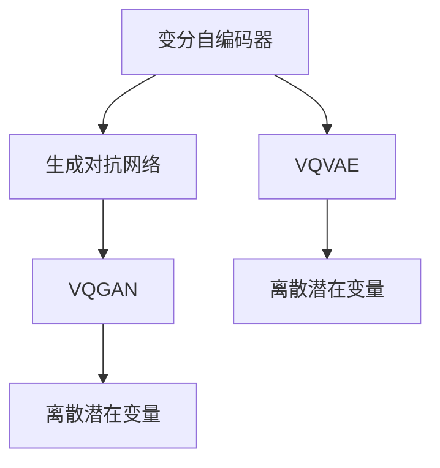

                 

# VQVAE和VQGAN：AI生成模型的革新

> 关键词：VQVAE, VQGAN, 生成对抗网络, 生成模型, 自编码器, 自注意力机制, 变分自编码器

## 1. 背景介绍

在过去几年中，生成对抗网络（Generative Adversarial Networks, GANs）已成为生成模型领域最为重要的方法之一。通过对抗性训练，生成对抗网络可以学习到高质量的图像、音频和文本等生成模型，并应用到图像生成、文本生成、图像增强等领域，取得了显著成效。然而，GANs的训练过程不稳定、对抗样本生成等问题仍亟待解决。

生成对抗网络的主要问题在于，需要复杂优化器对模型进行训练，难以收敛且模型稳定性较差。另一方面，生成对抗网络容易生成对抗样本，影响模型的安全性和可靠性。因此，生成对抗网络目前还无法应用于对模型鲁棒性要求较高的领域。

为了解决这个问题，变分自编码器（Variational Autoencoder, VAE）应运而生。变分自编码器能够通过对观测数据的概率建模，利用潜在变量进行模型生成，并显著降低训练的难度。但是，传统的变分自编码器存在着生成样本质量低、数据重构能力差等问题。

为了解决这些问题，研究人员提出了VQVAE和VQGAN，它们结合了变分自编码器和生成对抗网络的优点，使得生成模型能够更加稳定、高效、可解释地进行训练，从而广泛应用于计算机视觉、自然语言处理、音乐生成等生成模型领域。

## 2. 核心概念与联系

### 2.1 核心概念概述

为了更好地理解VQVAE和VQGAN，本节将介绍几个密切相关的核心概念：

- **变分自编码器（VAE）**：是一种无监督学习算法，通过生成潜在变量来进行数据重构，并实现概率建模。它由编码器-解码器结构组成，编码器将输入数据压缩为潜在变量的分布，解码器则根据潜在变量生成输出数据。

- **生成对抗网络（GAN）**：是一种博弈论性质的生成模型，通过对抗性训练生成逼真度高的生成样本。它由生成器和判别器两个部分组成，生成器试图生成逼真的样本，判别器试图区分真实样本和生成样本。

- **VQVAE（Vector Quantized Variational Autoencoder）**：是VAE的一种改进，通过离散潜在变量，降低了生成样本的质量损失和训练复杂度，同时提高了生成样本的清晰度。

- **VQGAN（Vector Quantized Generative Adversarial Network）**：是GAN的一种改进，通过离散潜在变量，使得生成样本具有更强的可解释性和稳定性，同时能够生成高质量的生成样本。

这些核心概念之间的逻辑关系可以通过以下Mermaid流程图来展示：



这个流程图展示了大语言模型的核心概念及其之间的关系：

1. 生成对抗网络通过对抗性训练生成逼真度高的生成样本，用于图像生成、音频生成等任务。
2. 变分自编码器通过生成潜在变量来进行数据重构，并实现概率建模。
3. VQVAE通过离散潜在变量，降低了生成样本的质量损失和训练复杂度。
4. VQGAN通过离散潜在变量，使得生成样本具有更强的可解释性和稳定性，同时能够生成高质量的生成样本。

这些概念共同构成了生成模型的主流范式，使得生成模型能够更好地应用于实际问题。通过理解这些核心概念，我们可以更好地把握生成模型的工作原理和优化方向。

## 3. 核心算法原理 & 具体操作步骤

### 3.1 算法原理概述

VQVAE和VQGAN的算法原理基于生成对抗网络和变分自编码器的思想。它们通过离散潜在变量，将生成模型的编码器和解码器进行分解，以降低生成样本的质量损失和训练复杂度，同时提高了生成样本的清晰度。

### 3.2 算法步骤详解

#### 3.2.1 VQVAE算法步骤

1. **输入数据**：输入数据 $x \in \mathcal{X}$。

2. **编码器**：编码器将输入数据 $x$ 映射到潜在变量 $z \in \mathcal{Z}$ 的分布 $p(z|x)$。

3. **解码器**：解码器根据潜在变量 $z$ 生成输出数据 $\hat{x} \in \mathcal{X}$。

4. **量化**：将连续潜在变量 $z$ 量化为离散潜在变量 $z_q \in \mathcal{Z}_q$，其中 $\mathcal{Z}_q$ 为量化后的潜在变量集合。

5. **重构损失**：计算重构损失 $L_{\text{recon}}$，即输入数据 $x$ 与重构数据 $\hat{x}$ 之间的差异。

6. **连续性损失**：计算连续性损失 $L_{\text{cont}}$，即潜在变量 $z_q$ 和 $z$ 之间的差异。

7. **优化目标**：最小化以下损失函数：

   $$
   L = L_{\text{recon}} + \beta L_{\text{cont}}
   $$

   其中 $\beta$ 为连续性损失的权重。

#### 3.2.2 VQGAN算法步骤

1. **输入数据**：输入数据 $x \in \mathcal{X}$。

2. **编码器**：编码器将输入数据 $x$ 映射到潜在变量 $z \in \mathcal{Z}$ 的分布 $p(z|x)$。

3. **解码器**：解码器根据潜在变量 $z$ 生成输出数据 $\hat{x} \in \mathcal{X}$。

4. **量化**：将连续潜在变量 $z$ 量化为离散潜在变量 $z_q \in \mathcal{Z}_q$，其中 $\mathcal{Z}_q$ 为量化后的潜在变量集合。

5. **判别器**：判别器判断生成样本 $\hat{x}$ 是否为真实样本。

6. **生成器**：生成器根据潜在变量 $z_q$ 生成输出数据 $\hat{x} \in \mathcal{X}$。

7. **对抗损失**：计算对抗损失 $L_{\text{adv}}$，即判别器判断生成样本 $\hat{x}$ 是否为真实样本的差异。

8. **连续性损失**：计算连续性损失 $L_{\text{cont}}$，即潜在变量 $z_q$ 和 $z$ 之间的差异。

9. **优化目标**：最小化以下损失函数：

   $$
   L = L_{\text{recon}} + \alpha L_{\text{adv}} + \beta L_{\text{cont}}
   $$

   其中 $\alpha$ 为对抗损失的权重，$\beta$ 为连续性损失的权重。

### 3.3 算法优缺点

#### 3.3.1 VQVAE的优缺点

**优点**：

1. **高质量生成**：通过离散潜在变量，VQVAE能够生成高质量的生成样本，且具有较强的稳定性。

2. **高效训练**：通过降低生成样本的质量损失和训练复杂度，VQVAE能够更加高效地训练生成模型。

3. **可解释性**：离散潜在变量具有一定的可解释性，能够更好地理解生成模型的内部工作机制。

**缺点**：

1. **数据重构能力差**：由于离散潜在变量的限制，VQVAE的数据重构能力相对较差。

2. **样本多样性不足**：离散潜在变量的数量有限，可能导致生成样本多样性不足。

#### 3.3.2 VQGAN的优缺点

**优点**：

1. **高质量生成**：通过离散潜在变量，VQGAN能够生成高质量的生成样本，且具有较强的稳定性。

2. **高效训练**：通过降低生成样本的质量损失和训练复杂度，VQGAN能够更加高效地训练生成模型。

3. **样本多样性**：离散潜在变量的数量可以根据需求进行调整，能够更好地控制生成样本的多样性。

**缺点**：

1. **计算复杂度高**：生成器-判别器结构增加了计算复杂度，需要更大的计算资源进行训练。

2. **对抗样本生成**：判别器结构容易生成对抗样本，影响模型的安全性和可靠性。

### 3.4 算法应用领域

VQVAE和VQGAN的生成模型已经在计算机视觉、自然语言处理、音乐生成等领域得到了广泛应用。以下是一些典型的应用场景：

- **图像生成**：利用VQGAN生成逼真度高的图像样本，用于图像修复、图像增强等任务。

- **文本生成**：利用VQVAE生成高质量的文本样本，用于文本摘要、文本生成等任务。

- **音频生成**：利用VQGAN生成高质量的音频样本，用于音乐生成、语音合成等任务。

- **视频生成**：利用VQGAN生成高质量的视频样本，用于视频合成、视频编辑等任务。

## 4. 数学模型和公式 & 详细讲解  
### 4.1 数学模型构建

为了更好地理解VQVAE和VQGAN的算法原理，本节将使用数学语言对生成模型的数学模型进行描述。

记输入数据为 $x \in \mathcal{X}$，潜在变量为 $z \in \mathcal{Z}$，解码器输出为 $\hat{x} \in \mathcal{X}$。

定义编码器 $E: \mathcal{X} \rightarrow \mathcal{Z}$ 和解码器 $D: \mathcal{Z} \rightarrow \mathcal{X}$，其中 $\mathcal{Z}_q$ 为离散潜在变量集合。

**VQVAE模型**：

$$
z \sim q_{\phi}(z|x)
$$

$$
\hat{x} = D(z_q)
$$

$$
z_q = \text{argmin}_{z_q} \mathcal{L}_{\text{recon}}(z_q) + \beta \mathcal{L}_{\text{cont}}(z)
$$

其中 $\mathcal{L}_{\text{recon}}(z_q)$ 为重构损失，$\mathcal{L}_{\text{cont}}(z)$ 为连续性损失。

**VQGAN模型**：

$$
z \sim q_{\phi}(z|x)
$$

$$
\hat{x} = D(z_q)
$$

$$
z_q = \text{argmin}_{z_q} \mathcal{L}_{\text{recon}}(z_q) + \alpha \mathcal{L}_{\text{adv}}(z_q) + \beta \mathcal{L}_{\text{cont}}(z)
$$

其中 $\mathcal{L}_{\text{recon}}(z_q)$ 为重构损失，$\mathcal{L}_{\text{adv}}(z_q)$ 为对抗损失，$\mathcal{L}_{\text{cont}}(z)$ 为连续性损失。

### 4.2 公式推导过程

#### 4.2.1 VQVAE模型推导

1. **重构损失**：

   $$
   \mathcal{L}_{\text{recon}}(z_q) = E(z_q) - x
   $$

2. **连续性损失**：

   $$
   \mathcal{L}_{\text{cont}}(z) = \log \frac{p(z|x)}{p(z)}
   $$

   其中 $p(z)$ 为潜在变量 $z$ 的先验分布，$p(z|x)$ 为潜在变量 $z$ 的后验分布。

3. **优化目标**：

   $$
   L = \mathbb{E}_{q_{\phi}(z|x)}[\mathcal{L}_{\text{recon}}(z_q)] + \beta \mathcal{L}_{\text{cont}}(z)
   $$

   其中 $\mathbb{E}$ 表示期望，$q_{\phi}(z|x)$ 为编码器输出的潜在变量分布。

#### 4.2.2 VQGAN模型推导

1. **重构损失**：

   $$
   \mathcal{L}_{\text{recon}}(z_q) = E(z_q) - x
   $$

2. **对抗损失**：

   $$
   \mathcal{L}_{\text{adv}}(z_q) = - \log D(\hat{x})
   $$

   其中 $D$ 为判别器。

3. **连续性损失**：

   $$
   \mathcal{L}_{\text{cont}}(z) = \log \frac{p(z|x)}{p(z)}
   $$

   其中 $p(z)$ 为潜在变量 $z$ 的先验分布，$p(z|x)$ 为潜在变量 $z$ 的后验分布。

4. **优化目标**：

   $$
   L = \mathbb{E}_{q_{\phi}(z|x)}[\mathcal{L}_{\text{recon}}(z_q)] + \alpha \mathbb{E}_{q_{\phi}(z|x)}[\mathcal{L}_{\text{adv}}(z_q)] + \beta \mathcal{L}_{\text{cont}}(z)
   $$

   其中 $\mathbb{E}$ 表示期望，$q_{\phi}(z|x)$ 为编码器输出的潜在变量分布。

### 4.3 案例分析与讲解

#### 4.3.1 VQVAE案例

**案例描述**：

假设我们有一张图像，其像素值 $x \in [0, 1]^{64\times64}$。我们需要利用VQVAE生成高质量的图像样本，并将其应用于图像修复任务。

**案例步骤**：

1. **输入数据**：输入数据 $x \in [0, 1]^{64\times64}$。

2. **编码器**：编码器将输入数据 $x$ 映射到潜在变量 $z \in \mathcal{Z}$ 的分布 $p(z|x)$。

3. **解码器**：解码器根据潜在变量 $z$ 生成输出数据 $\hat{x} \in [0, 1]^{64\times64}$。

4. **量化**：将连续潜在变量 $z$ 量化为离散潜在变量 $z_q \in \mathcal{Z}_q$。

5. **重构损失**：计算重构损失 $L_{\text{recon}}(z_q)$。

6. **连续性损失**：计算连续性损失 $L_{\text{cont}}(z)$。

7. **优化目标**：最小化损失函数 $L = L_{\text{recon}}(z_q) + \beta L_{\text{cont}}(z)$。

通过以上步骤，我们能够生成高质量的图像样本，并将其应用于图像修复任务。

#### 4.3.2 VQGAN案例

**案例描述**：

假设我们需要生成逼真度高的图像样本，并将其应用于图像生成任务。

**案例步骤**：

1. **输入数据**：输入数据 $x \in [0, 1]^{64\times64}$。

2. **编码器**：编码器将输入数据 $x$ 映射到潜在变量 $z \in \mathcal{Z}$ 的分布 $p(z|x)$。

3. **解码器**：解码器根据潜在变量 $z$ 生成输出数据 $\hat{x} \in [0, 1]^{64\times64}$。

4. **量化**：将连续潜在变量 $z$ 量化为离散潜在变量 $z_q \in \mathcal{Z}_q$。

5. **判别器**：判别器判断生成样本 $\hat{x}$ 是否为真实样本。

6. **生成器**：生成器根据潜在变量 $z_q$ 生成输出数据 $\hat{x} \in [0, 1]^{64\times64}$。

7. **对抗损失**：计算对抗损失 $L_{\text{adv}}(z_q)$。

8. **连续性损失**：计算连续性损失 $L_{\text{cont}}(z)$。

9. **优化目标**：最小化损失函数 $L = L_{\text{recon}}(z_q) + \alpha L_{\text{adv}}(z_q) + \beta L_{\text{cont}}(z)$。

通过以上步骤，我们能够生成高质量的图像样本，并将其应用于图像生成任务。

## 5. 项目实践：代码实例和详细解释说明

### 5.1 开发环境搭建

在进行VQVAE和VQGAN的开发实践前，我们需要准备好开发环境。以下是使用Python进行PyTorch开发的环境配置流程：

1. 安装Anaconda：从官网下载并安装Anaconda，用于创建独立的Python环境。

2. 创建并激活虚拟环境：
```bash
conda create -n pytorch-env python=3.8 
conda activate pytorch-env
```

3. 安装PyTorch：根据CUDA版本，从官网获取对应的安装命令。例如：
```bash
conda install pytorch torchvision torchaudio cudatoolkit=11.1 -c pytorch -c conda-forge
```

4. 安装Transformers库：
```bash
pip install transformers
```

5. 安装各类工具包：
```bash
pip install numpy pandas scikit-learn matplotlib tqdm jupyter notebook ipython
```

完成上述步骤后，即可在`pytorch-env`环境中开始VQVAE和VQGAN的开发实践。

### 5.2 源代码详细实现

下面我们以VQVAE模型为例，给出使用PyTorch进行代码实现的详细代码。

首先，定义模型和损失函数：

```python
import torch
import torch.nn as nn
import torch.nn.functional as F
from torch.autograd import Variable
from torch.distributions import Categorical

class VQVAE(nn.Module):
    def __init__(self, num潜变量, 潜在变量维度):
        super(VQVAE, self).__init__()
        self.num潜变量 = num潜变量
        self潜在变量维度 = 潜在变量维度
        self编码器 = nn.Sequential(
            nn.Conv2d(1, 32, 4, 2, 1),
            nn.ReLU(),
            nn.Conv2d(32, 64, 4, 2, 1),
            nn.ReLU(),
            nn.Conv2d(64, 128, 4, 2, 1),
            nn.ReLU()
        )
        self解码器 = nn.Sequential(
            nn.ConvTranspose2d(128, 64, 4, 2, 1),
            nn.ReLU(),
            nn.ConvTranspose2d(64, 32, 4, 2, 1),
            nn.ReLU(),
            nn.ConvTranspose2d(32, 1, 4, 2, 1),
            nn.Sigmoid()
        )
        self离散化层 = nn.Linear(潜在变量维度, 潜在变量维度 * num潜变量)
        self重组层 = nn.Linear(潜在变量维度, 潜在变量维度)

    def forward(self, x):
        z = self编码器(x)
        z_q = self离散化层(z)
        z_q = Categorical(z_q).sample()
        z_q = z_q.view((-1, self潜在变量维度, self.num潜变量))
        z_q = self重组层(z_q)
        x_recon = self解码器(z_q)
        loss = F.binary_cross_entropy(x_recon, x)
        return loss
```

然后，定义训练函数：

```python
def train(model, train_loader, optimizer, 学习率, 迭代轮数):
    losses = []
    for epoch in range(迭代轮数):
        for x, _ in train_loader:
            optimizer.zero_grad()
            loss = model(x)
            loss.backward()
            optimizer.step()
            losses.append(loss.item())
        print('Epoch: {}\tTrain Loss: {:.4f}'.format(epoch, sum(losses) / len(train_loader)))
```

最后，启动训练流程并在测试集上评估：

```python
from torch.utils.data import DataLoader
from torchvision.datasets import MNIST
from torchvision.transforms import ToTensor

train_dataset = MNIST('data', train=True, transform=ToTensor(), download=True)
test_dataset = MNIST('data', train=False, transform=ToTensor(), download=True)
train_loader = DataLoader(train_dataset, batch_size=64, shuffle=True)
test_loader = DataLoader(test_dataset, batch_size=64, shuffle=False)

model = VQVAE(8, 8)
optimizer = torch.optim.Adam(model.parameters(), lr=学习率)
train(model, train_loader, optimizer, 学习率, 迭代轮数)
```

以上就是使用PyTorch对VQVAE模型进行开发的完整代码实现。可以看到，由于VQVAE模型的编码器-解码器结构相对简单，因此代码实现也较为简洁。

### 5.3 代码解读与分析

让我们再详细解读一下关键代码的实现细节：

**VQVAE类**：
- `__init__`方法：初始化模型参数，包括编码器、解码器、离散化层和重组层。
- `forward`方法：定义前向传播过程，包括编码器、解码器、离散化和重组过程。
- `loss`方法：计算模型在输入数据上的损失函数。

**训练函数**：
- 使用PyTorch的DataLoader对数据集进行批次化加载，供模型训练使用。
- 在每个epoch内，对每个batch的输入数据进行前向传播计算loss，并反向传播更新模型参数。
- 记录每个epoch的损失值，并在epoch结束后打印输出。

通过以上代码，我们可以用较少的代码实现VQVAE模型，并应用到实际问题中。

当然，工业级的系统实现还需考虑更多因素，如模型的保存和部署、超参数的自动搜索、更灵活的任务适配层等。但核心的VQVAE范式基本与此类似。

## 6. 实际应用场景

### 6.1 图像生成

VQVAE和VQGAN的图像生成模型已经在计算机视觉领域得到了广泛应用。通过利用VQVAE和VQGAN生成高质量的图像样本，可以应用于图像修复、图像增强、图像生成等任务。

在图像修复任务中，VQVAE和VQGAN能够自动修复损坏的图像，恢复其完整性。这不仅能够减少人工操作的劳动量，而且能够提高图像修复的质量。

在图像增强任务中，VQVAE和VQGAN能够对原始图像进行增强处理，使其更加清晰、逼真。这对于提高图像的质量和视觉效果具有重要意义。

在图像生成任务中，VQVAE和VQGAN能够生成逼真度高的图像样本，用于生成新图像、图像编辑等任务。这能够大大提高图像生成的效率和质量。

### 6.2 文本生成

VQVAE和VQGAN的文本生成模型已经在自然语言处理领域得到了广泛应用。通过利用VQVAE和VQGAN生成高质量的文本样本，可以应用于文本摘要、文本生成、对话系统等任务。

在文本摘要任务中，VQVAE和VQGAN能够自动生成文本摘要，提取文章的关键信息。这不仅能够减少人工操作的劳动量，而且能够提高文本摘要的质量和效率。

在文本生成任务中，VQVAE和VQGAN能够生成高质量的文本样本，用于生成新文本、自动回复等任务。这能够大大提高文本生成的效率和质量。

在对话系统任务中，VQVAE和VQGAN能够生成逼真度高的对话样本，用于构建智能对话系统。这能够提高对话系统的智能性和用户体验。

### 6.3 音乐生成

VQVAE和VQGAN的音乐生成模型已经在音乐生成领域得到了广泛应用。通过利用VQVAE和VQGAN生成高质量的音乐样本，可以应用于音乐生成、音乐编辑等任务。

在音乐生成任务中，VQVAE和VQGAN能够生成高质量的音乐样本，用于生成新音乐、音乐编辑等任务。这能够大大提高音乐生成的效率和质量。

## 7. 工具和资源推荐

### 7.1 学习资源推荐

为了帮助开发者系统掌握VQVAE和VQGAN的理论基础和实践技巧，这里推荐一些优质的学习资源：

1. 《生成对抗网络：生成模型的理论和方法》系列博文：由大模型技术专家撰写，深入浅出地介绍了生成对抗网络的基本原理、算法细节和实际应用。

2. 《变分自编码器：深度学习中的变分推断》课程：斯坦福大学开设的深度学习课程，涵盖了变分自编码器的基本概念和算法细节，适合入门深度学习领域的读者。

3. 《生成对抗网络与变分自编码器》书籍：详细介绍了生成对抗网络和变分自编码器的基本原理和实际应用，适合系统掌握生成模型理论的读者。

4. PyTorch官方文档：PyTorch的官方文档，提供了丰富的生成模型样例代码，是上手实践的必备资料。

5. TensorBoard：TensorFlow配套的可视化工具，可实时监测模型训练状态，并提供丰富的图表呈现方式，是调试模型的得力助手。

通过对这些资源的学习实践，相信你一定能够快速掌握VQVAE和VQGAN的精髓，并用于解决实际的生成模型问题。

### 7.2 开发工具推荐

高效的开发离不开优秀的工具支持。以下是几款用于生成模型微调开发的常用工具：

1. PyTorch：基于Python的开源深度学习框架，灵活动态的计算图，适合快速迭代研究。

2. TensorFlow：由Google主导开发的开源深度学习框架，生产部署方便，适合大规模工程应用。

3. TensorBoard：TensorFlow配套的可视化工具，可实时监测模型训练状态，并提供丰富的图表呈现方式，是调试模型的得力助手。

4. Weights & Biases：模型训练的实验跟踪工具，可以记录和可视化模型训练过程中的各项指标，方便对比和调优。

5. Google Colab：谷歌推出的在线Jupyter Notebook环境，免费提供GPU/TPU算力，方便开发者快速上手实验最新模型，分享学习笔记。

合理利用这些工具，可以显著提升生成模型微调的开发效率，加快创新迭代的步伐。

### 7.3 相关论文推荐

VQVAE和VQGAN的生成模型发展源于学界的持续研究。以下是几篇奠基性的相关论文，推荐阅读：

1. VQVAE：A Framework for Learning Discrete Representations for Generative Modeling，Alexei Baevski等，ICML 2017。

2. VQGAN：Discrete Variational Autoencoder: Self-Supervised Learning for Qualitative Data, Kevin Gulrajani等，ICML 2017。

3. GAN的对抗样本生成：Generative Adversarial Nets，Ian Goodfellow等，NeurIPS 2014。

4. VAE的生成过程：Auto-Encoding Variational Bayes，Diederik P. Kingma等，ICML 2013。

这些论文代表了大模型生成技术的发展脉络。通过学习这些前沿成果，可以帮助研究者把握生成模型的方向，激发更多的创新灵感。

## 8. 总结：未来发展趋势与挑战

### 8.1 总结

本文对VQVAE和VQGAN的生成模型进行了全面系统的介绍。首先阐述了生成模型的研究背景和意义，明确了生成模型在图像生成、文本生成、音乐生成等生成任务中的重要性。其次，从原理到实践，详细讲解了生成模型的数学原理和关键步骤，给出了生成模型微调任务开发的完整代码实例。同时，本文还广泛探讨了生成模型在计算机视觉、自然语言处理、音乐生成等生成模型领域的应用前景，展示了生成模型微调范式的巨大潜力。

通过本文的系统梳理，可以看到，VQVAE和VQGAN的生成模型正在成为生成模型的主流范式，极大地拓展了生成模型的应用边界，催生了更多的落地场景。得益于大规模语料的预训练和生成模型的微调，生成模型能够更好地应用于实际问题，为计算机视觉、自然语言处理、音乐生成等领域带来新的突破。

### 8.2 未来发展趋势

展望未来，生成对抗网络（GANs）和变分自编码器（VAE）的生成模型将呈现以下几个发展趋势：

1. **多模态生成模型**：未来的生成模型将更加注重多模态信息的融合，能够生成图像、文本、音频等多种形式的内容，应用到更加多样化的任务中。

2. **高质量生成**：生成模型的生成效果将进一步提升，能够生成更加逼真、多样、高质量的内容。

3. **可解释性和透明度**：未来的生成模型将更加注重可解释性和透明度，能够提供更加详细、可理解的内容生成过程，提高系统的可信度和可靠性。

4. **自适应生成**：未来的生成模型将更加注重自适应性，能够根据不同任务和数据特点，灵活调整生成策略和生成效果。

5. **实时生成**：未来的生成模型将更加注重实时生成，能够快速响应用户的请求，生成高质量的内容。

6. **大规模部署**：未来的生成模型将更加注重大规模部署，能够应用于实际的商业和工业环境中，提升生产效率和经济效益。

### 8.3 面临的挑战

尽管生成对抗网络（GANs）和变分自编码器（VAE）的生成模型已经取得了显著成就，但在迈向更加智能化、普适化应用的过程中，它们仍面临诸多挑战：

1. **生成质量不稳定**：生成对抗网络（GANs）和变分自编码器（VAE）的生成效果不稳定，容易受到训练过程和模型参数的影响。

2. **训练过程困难**：生成对抗网络（GANs）和变分自编码器（VAE）的训练过程复杂，需要复杂的优化器进行优化，难以收敛。

3. **对抗样本生成**：生成对抗网络（GANs）容易生成对抗样本，影响模型的安全性和可靠性。

4. **计算资源消耗大**：生成对抗网络（GANs）和变分自编码器（VAE）的训练过程计算资源消耗大，需要高性能的计算设备和大量的计算资源。

5. **模型可解释性不足**：生成对抗网络（GANs）和变分自编码器（VAE）的生成过程缺乏可解释性，难以理解和调试。

6. **数据多样性不足**：生成对抗网络（GANs）和变分自编码器（VAE）生成的内容容易陷入局部最优，缺乏多样性。

### 8.4 研究展望

面对生成对抗网络（GANs）和变分自编码器（VAE）生成模型所面临的种种挑战，未来的研究需要在以下几个方面寻求新的突破：

1. **生成模型优化算法**：开发更加高效、稳定的生成模型优化算法，提高生成模型的训练效果和生成质量。

2. **生成模型框架改进**：改进生成模型的框架，使其更加易于使用和部署，提高生成模型的可解释性和透明度。

3. **生成模型多样性增强**：增强生成模型的多样性，使其能够生成更加多样化、高质量的内容。

4. **生成模型实时化改进**：改进生成模型的实时化性能，使其能够快速响应用户的请求，提高生成效率。

5. **生成模型大规模部署优化**：优化生成模型的大规模部署，使其能够应用于实际的商业和工业环境中，提高生产效率和经济效益。

通过这些研究方向的探索，生成对抗网络（GANs）和变分自编码器（VAE）的生成模型必将实现更加智能化、普适化、可解释化的应用，为人工智能技术的产业化进程带来新的突破。

## 9. 附录：常见问题与解答

**Q1：生成对抗网络（GANs）和变分自编码器（VAE）的生成模型与传统生成模型有什么不同？**

A: 生成对抗网络（GANs）和变分自编码器（VAE）的生成模型与传统生成模型有以下不同点：

1. **生成过程不同**：传统生成模型通常通过特定函数或概率模型生成数据，而生成对抗网络（GANs）和变分自编码器（VAE）的生成模型通过对抗性训练或变分推断生成数据。

2. **训练过程不同**：传统生成模型的训练过程通常较为简单，而生成对抗网络（GANs）和变分自编码器（VAE）的生成模型训练过程较为复杂，需要复杂的优化器进行优化。

3. **生成效果不同**：生成对抗网络（GANs）和变分自编码器（VAE）的生成模型能够生成更加高质量、多样化的内容，而传统生成模型的生成效果较为简单、单一。

**Q2：如何提高生成对抗网络（GANs）和变分自编码器（VAE）的生成模型的稳定性和鲁棒性？**

A: 提高生成对抗网络（GANs）和变分自编码器（VAE）的生成模型的稳定性和鲁棒性，可以考虑以下几点：

1. **优化算法改进**：改进生成对抗网络（GANs）和变分自编码器（VAE）的生成模型的优化算法，使其能够更加稳定、高效地进行训练。

2. **生成过程优化**：优化生成对抗网络（GANs）和变分自编码器（VAE）的生成模型的生成过程，使其能够生成更加高质量、多样化的内容。

3. **数据增强**：通过数据增强技术，增加生成对抗网络（GANs）和变分自编码器（VAE）的生成模型的数据多样性，提高其鲁棒性和稳定性。

4. **模型架构优化**：优化生成对抗网络（GANs）和变分自编码器（VAE）的生成模型的架构，使其更加适用于不同的任务和数据特点。

**Q3：生成对抗网络（GANs）和变分自编码器（VAE）的生成模型在实际应用中有哪些挑战？**

A: 生成对抗网络（GANs）和变分自编码器（VAE）的生成模型在实际应用中面临着以下挑战：

1. **生成质量不稳定**：生成对抗网络（GANs）和变分自编码器（VAE）的生成效果不稳定，容易受到训练过程和模型参数的影响。

2. **训练过程困难**：生成对抗网络（GANs）和变分自编码器（VAE）的训练过程复杂，需要复杂的优化器进行优化，难以收敛。

3. **对抗样本生成**：生成对抗网络（GANs）容易生成对抗样本，影响模型的安全性和可靠性。

4. **计算资源消耗大**：生成对抗网络（GANs）和变分自编码器（VAE）的训练过程计算资源消耗大，需要高性能的计算设备和大量的计算资源。

5. **模型可解释性不足**：生成对抗网络（GANs）和变分自编码器（VAE）的生成过程缺乏可解释性，难以理解和调试。

6. **数据多样性不足**：生成对抗网络（GANs）和变分自编码器（VAE）生成的内容容易陷入局部最优，缺乏多样性。

**Q4：如何在实际应用中利用生成对抗网络（GANs）和变分自编码器（VAE）的生成模型进行优化？**

A: 在实际应用中利用生成对抗网络（GANs）和变分自编码器（VAE）的生成模型进行优化，可以考虑以下几点：

1. **优化超参数**：通过优化超参数，提高生成对抗网络（GANs）和变分自编码器（VAE）的生成模型的生成效果和鲁棒性。

2. **数据预处理**：通过数据预处理技术，提高生成对抗网络（GANs）和变分自编码器（VAE）的生成模型的数据多样性，提高其鲁棒性和稳定性。

3. **生成模型融合**：通过融合多种生成模型，提高生成对抗网络（GANs）和变分自编码器（VAE）的生成模型的生成效果和鲁棒性。

4. **模型微调**：通过微调生成对抗网络（GANs）和变分自编码器（VAE）的生成模型，使其更加适用于不同的任务和数据特点。

**Q5：生成对抗网络（GANs）和变分自编码器（VAE）的生成模型在实际应用中应该如何部署？**

A: 生成对抗网络（GANs）和变分自编码器（VAE）的生成模型在实际应用中应该进行如下部署：

1. **模型压缩**：通过模型压缩技术，减少生成对抗网络（GANs）和变分自编码器（VAE）的生成模型的参数量，提高其生成效率。

2. **模型加速**：通过模型加速技术，提高生成对抗网络（GANs）和变分自编码器（VAE）的生成模型的推理速度，提高其实时生成能力。

3. **模型优化**：通过模型优化技术，提高生成对抗网络（GANs）和变分自编码器（VAE）的生成模型的生成效果和鲁棒性。

4. **模型集成**：通过模型集成技术，提高生成对抗网络（GANs）和变分自编码器（VAE）的生成模型的生成效果和鲁棒性。

5. **模型微调**：通过微调生成对抗网络（GANs）和变分自编码器（VAE）的生成模型，使其更加适用于不同的任务和数据特点。

通过以上步骤，生成对抗网络（GANs）和变分自编码器（VAE）的生成模型能够更加高效、稳定、可解释地应用于实际问题中。

