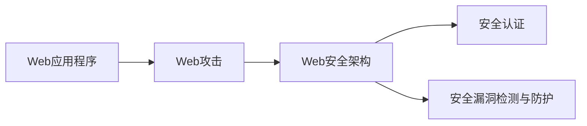

                 

## Web 安全策略：保护网站和应用程序

### 1. 背景介绍

随着互联网的飞速发展，Web应用已经成为连接人们与世界的桥梁。然而，Web应用也面临着来自各个方面的安全威胁，包括跨站脚本攻击(XSS)、SQL注入攻击、跨站请求伪造(CSRF)等。这些攻击不仅可能导致数据泄露、服务中断，甚至危及国家安全。因此，开发安全的Web应用程序已成为当务之急。

为了保护Web应用程序的安全，本文将从多个角度探讨Web安全策略，包括安全架构设计、常见攻击防御方法、安全漏洞检测和防护技术等。通过本文的学习，读者将能够掌握如何构建安全、可靠的Web应用程序，并防范各种安全威胁。

### 2. 核心概念与联系

在探讨Web安全策略之前，我们需要理解一些核心概念及其相互之间的联系。

#### 2.1 核心概念概述

- **Web应用程序**：利用Web技术构建的应用程序，通常使用HTTP协议进行通信。常见的Web应用程序包括网站、在线商店、博客等。
- **Web攻击**：利用Web应用的漏洞，对应用程序进行恶意攻击的行为。常见的Web攻击包括XSS、SQL注入、CSRF等。
- **Web安全架构**：为Web应用提供安全保障的整体结构，包括防火墙、Web应用防火墙、安全认证等。
- **安全认证**：用于验证用户身份的方法，如用户名密码、双因素认证等。
- **安全漏洞检测与防护**：通过自动化工具和手动分析，发现并修复Web应用程序中的安全漏洞。

#### 2.2 核心概念原理和架构的 Mermaid 流程图



该流程图展示了Web应用程序与Web攻击、Web安全架构、安全认证以及安全漏洞检测与防护之间的关系。Web应用程序通过Web安全架构和各个安全组件来抵御Web攻击，从而保护Web应用程序的安全性。

### 3. 核心算法原理 & 具体操作步骤

#### 3.1 算法原理概述

Web安全策略的核心是构建安全的Web应用程序架构，并采用多种安全技术来防范各种Web攻击。Web安全架构通常包括防火墙、Web应用防火墙、安全认证、安全漏洞检测与防护等组件。

#### 3.2 算法步骤详解

##### 3.2.1 防火墙

防火墙是保护Web应用程序的第一道防线，用于阻止未经授权的访问。常见的防火墙包括：

- **硬件防火墙**：部署在网络边缘的设备，用于监控和过滤网络流量。
- **软件防火墙**：安装在Web服务器上的软件，用于监控和过滤Web服务器的流量。

##### 3.2.2 Web应用防火墙

Web应用防火墙(WAF)是专门为Web应用程序设计的防火墙，可以识别和阻止各种Web攻击。常见的WAF包括：

- **基于规则的WAF**：根据预定义的规则进行流量过滤，如拒绝SQL注入攻击的规则。
- **基于机器学习的WAF**：利用机器学习算法识别和阻止未知的Web攻击。

##### 3.2.3 安全认证

安全认证用于验证用户身份，防止未经授权的访问。常见的安全认证方法包括：

- **用户名密码认证**：用户输入用户名和密码进行身份验证。
- **双因素认证**：除了用户名密码外，还需要用户提供第二个验证因素，如短信验证码、邮箱验证等。
- **OAuth认证**：用户授权第三方应用访问其资源，如社交媒体登录。

##### 3.2.4 安全漏洞检测与防护

安全漏洞检测与防护用于发现和修复Web应用程序中的安全漏洞。常见的安全漏洞检测与防护方法包括：

- **静态分析**：对Web应用程序的源代码进行分析，发现潜在的安全漏洞。
- **动态分析**：对Web应用程序的运行时行为进行分析，发现潜在的安全漏洞。
- **自动化扫描**：利用自动化工具对Web应用程序进行扫描，发现潜在的安全漏洞。

#### 3.3 算法优缺点

##### 3.3.1 优点

- **防御能力强**：防火墙、WAF、安全认证等组件可以提供多层次的安全防护，防止各种Web攻击。
- **易于配置和维护**：许多安全组件可以自动配置和维护，减少安全管理员的工作量。
- **成本较低**：相比传统的网络安全设备，Web安全架构的成本相对较低。

##### 3.3.2 缺点

- **复杂度高**：Web安全架构涉及多个组件，配置和维护相对复杂。
- **误报率高**：许多安全组件容易误报正常流量，需要进行人工确认。
- **无法防止内部攻击**：Web安全架构主要针对外部攻击，对内部攻击防御能力较弱。

#### 3.4 算法应用领域

Web安全策略广泛应用于各种Web应用程序，包括网站、在线商店、博客等。通过应用Web安全策略，可以有效防范各种Web攻击，保护Web应用程序的安全性。

### 4. 数学模型和公式 & 详细讲解 & 举例说明

#### 4.1 数学模型构建

在Web安全策略中，我们可以使用数学模型来描述各种安全组件的行为和作用。

假设Web应用程序的安全架构由防火墙、WAF、安全认证和安全漏洞检测与防护组成，我们可以使用以下数学模型来表示：

- **防火墙**：$F_{\text{firewall}} = \text{Filter}(\text{IncomingTraffic})$
- **Web应用防火墙**：$F_{\text{WAF}} = \text{Filter}(\text{WebTraffic})$
- **安全认证**：$A_{\text{auth}} = \text{Authenticate}(\text{Username, Password})$
- **安全漏洞检测与防护**：$P_{\text{vulnerability}} = \text{Detect}(\text{Code}, \text{Data})$

#### 4.2 公式推导过程

- **防火墙**：防火墙通过过滤规则来识别和阻止恶意流量。假设过滤规则为$R$，则防火墙的过滤过程可以表示为：

$$ F_{\text{firewall}} = \text{Filter}(\text{IncomingTraffic}, R) = \left\{\begin{array}{ll} 
\text{Allow} & \text{if}~\text{IncomingTraffic}~\text{matches}~R \\
\text{Block} & \text{otherwise}
\end{array}\right. $$

- **Web应用防火墙**：Web应用防火墙通过对Web流量进行分析，识别和阻止各种Web攻击。假设Web流量为$T$，Web攻击特征为$F$，则WAF的过滤过程可以表示为：

$$ F_{\text{WAF}} = \text{Filter}(\text{WebTraffic}, F) = \left\{\begin{array}{ll} 
\text{Allow} & \text{if}~\text{WebTraffic}~\text{does not match}~F \\
\text{Block} & \text{otherwise}
\end{array}\right. $$

- **安全认证**：安全认证通过验证用户输入的用户名和密码来确认用户身份。假设用户输入的用户名为$U$，密码为$P$，则安全认证的过程可以表示为：

$$ A_{\text{auth}} = \text{Authenticate}(\text{Username, Password}) = \left\{\begin{array}{ll} 
\text{Success} & \text{if}~\text{U}~\text{and}~\text{P}~\text{are valid} \\
\text{Failure} & \text{otherwise}
\end{array}\right. $$

- **安全漏洞检测与防护**：安全漏洞检测与防护通过静态分析、动态分析和自动化扫描等方法来发现和修复安全漏洞。假设代码为$C$，数据为$D$，则安全漏洞检测与防护的过程可以表示为：

$$ P_{\text{vulnerability}} = \text{Detect}(\text{Code}, \text{Data}) = \left\{\begin{array}{ll} 
\text{Vulnerability} & \text{if}~\text{C}~\text{and}~\text{D}~\text{contain}~\text{vulnerabilities} \\
\text{Clean} & \text{otherwise}
\end{array}\right. $$

#### 4.3 案例分析与讲解

假设我们正在开发一个电子商务网站，需要应用Web安全策略来保护其安全性。我们可以按照以下步骤进行：

1. **配置防火墙**：在Web服务器上安装软件防火墙，配置允许的流量和禁止的流量。
2. **部署Web应用防火墙**：在Web服务器前部署Web应用防火墙，配置Web攻击规则。
3. **实施安全认证**：在用户登录页面上实施双因素认证。
4. **进行安全漏洞检测与防护**：定期进行安全漏洞扫描，发现并修复漏洞。

通过这些步骤，我们可以有效提高电子商务网站的安全性，保护用户数据和交易安全。

### 5. 项目实践：代码实例和详细解释说明

#### 5.1 开发环境搭建

要实施Web安全策略，需要搭建相应的开发环境。以下是一个简单的开发环境搭建步骤：

1. **安装操作系统**：选择适合的操作系统，如Ubuntu、CentOS等。
2. **安装Web服务器**：安装Apache或Nginx等Web服务器。
3. **安装Web应用防火墙**：安装ModSecurity或AWS WAF等Web应用防火墙。
4. **安装双因素认证插件**：安装双因素认证插件，如Google Authenticator或Authy等。
5. **安装安全漏洞检测工具**：安装OWASP ZAP或Nikto等安全漏洞检测工具。

#### 5.2 源代码详细实现

以下是一个简单的Web安全策略实现示例：

```python
# 导入必要的库
import flask
import modsecurity
import double_factor_auth
import owasp_zap

# 配置Web应用防火墙
modsecurity.init()

# 配置双因素认证
double_factor_auth.init()

# 配置安全漏洞检测
owasp_zap.init()

# 定义路由
@app.route('/')
def index():
    # 进行双因素认证
    if not double_factor_auth.authenticate():
        return 'Authentication failed'

    # 进行安全漏洞检测
    owasp_zap.scan()

    # 返回欢迎页面
    return 'Welcome to our website'

# 运行Web应用程序
if __name__ == '__main__':
    flask.run(host='0.0.0.0', port=8080)
```

#### 5.3 代码解读与分析

在上述示例代码中，我们使用了Flask框架来搭建Web应用程序，并通过ModSecurity、双因素认证和OWASP ZAP等组件来实现Web安全策略。

- **ModSecurity**：用于配置Web应用防火墙，拦截和阻止各种Web攻击。
- **双因素认证**：用于验证用户身份，防止未经授权的访问。
- **OWASP ZAP**：用于安全漏洞检测，发现并修复安全漏洞。

通过这些组件的配置和实现，我们可以有效提高Web应用程序的安全性，防止各种Web攻击。

#### 5.4 运行结果展示

在上述示例代码运行后，我们可以访问网站并查看运行结果。如果用户输入正确的用户名和密码，并通过了双因素认证，则可以看到欢迎页面。如果存在安全漏洞，则OWASP ZAP会进行提示和修复。

### 6. 实际应用场景

Web安全策略广泛应用于各种Web应用程序，包括网站、在线商店、博客等。通过应用Web安全策略，可以有效防范各种Web攻击，保护Web应用程序的安全性。

#### 6.1 电子商务网站

电子商务网站需要保护用户数据和交易安全，防止恶意攻击和数据泄露。可以通过配置防火墙、Web应用防火墙、双因素认证和安全漏洞检测与防护等组件来提高安全性。

#### 6.2 在线教育平台

在线教育平台需要保护用户的学习数据和交易安全，防止恶意攻击和数据泄露。可以通过配置防火墙、Web应用防火墙、双因素认证和安全漏洞检测与防护等组件来提高安全性。

#### 6.3 医疗网站

医疗网站需要保护患者数据和医疗记录的安全，防止恶意攻击和数据泄露。可以通过配置防火墙、Web应用防火墙、双因素认证和安全漏洞检测与防护等组件来提高安全性。

### 7. 工具和资源推荐

#### 7.1 学习资源推荐

为了帮助读者深入理解Web安全策略，以下推荐一些学习资源：

1. **《Web应用程序安全》（Web Application Security）**：一本介绍Web安全策略的经典书籍，涵盖了Web安全架构、常见攻击防御方法、安全漏洞检测与防护等内容。
2. **OWASP官方网站**：OWASP（开放式Web应用程序安全项目）是一个国际性的非营利组织，提供了大量关于Web安全策略的资源和指南。
3. **Coursera Web安全课程**：Coursera提供的Web安全课程，由知名安全专家授课，涵盖Web安全策略、渗透测试、安全漏洞检测等内容。

#### 7.2 开发工具推荐

为了实现Web安全策略，需要选择合适的开发工具和平台。以下推荐一些开发工具：

1. **Flask框架**：一个轻量级的Python Web框架，易于搭建和管理Web应用程序。
2. **OWASP ZAP**：一个开源的安全测试工具，用于发现和修复Web应用程序中的安全漏洞。
3. **ModSecurity**：一个开源的Web应用防火墙，用于拦截和阻止各种Web攻击。

#### 7.3 相关论文推荐

为了进一步了解Web安全策略，以下推荐一些相关论文：

1. **《Web应用防火墙的设计与实现》（Design and Implementation of Web Application Firewall）**：介绍Web应用防火墙的设计和实现，涵盖防御Web攻击、日志记录和报警等功能。
2. **《Web应用程序的双因素认证》（Double Factor Authentication for Web Applications）**：介绍Web应用程序的双因素认证方法，涵盖用户名密码、短信验证码和生物识别等多种认证方式。
3. **《Web安全漏洞检测与防护》（Web Security Vulnerability Detection and Protection）**：介绍Web安全漏洞检测与防护的方法，涵盖静态分析、动态分析和自动化扫描等多种技术。

### 8. 总结：未来发展趋势与挑战

#### 8.1 研究成果总结

Web安全策略是一个综合性的技术领域，涉及防火墙、Web应用防火墙、安全认证和安全漏洞检测与防护等多个方面。通过实施Web安全策略，可以有效保护Web应用程序的安全性，防止各种Web攻击。

#### 8.2 未来发展趋势

未来Web安全策略的发展趋势包括以下几个方面：

1. **自动化和智能化**：随着自动化工具和机器学习算法的不断发展，Web安全策略的自动化和智能化水平将不断提高，减少人工干预和误报率。
2. **跨平台和跨技术**：Web安全策略将逐步突破平台和技术的限制，实现跨平台和跨技术的通用性。
3. **零信任架构**：零信任架构将成为未来Web安全策略的核心，实现从网络到应用程序的多层次安全防护。

#### 8.3 面临的挑战

尽管Web安全策略已经取得了一定进展，但仍面临以下挑战：

1. **新攻击技术层出不穷**：随着攻击技术的不断发展，Web安全策略需要不断更新和改进，以应对新的攻击手段。
2. **资源消耗大**：Web安全策略需要配置和维护多个安全组件，资源消耗较大，如何降低资源消耗是一个重要的挑战。
3. **安全管理员技能不足**：许多企业缺乏专业的安全管理员，难以有效地配置和管理Web安全策略。

#### 8.4 研究展望

未来的Web安全策略研究将在以下几个方向进行：

1. **跨平台安全技术**：研究跨平台安全技术，实现安全策略的通用性和可移植性。
2. **智能安全检测**：研究智能安全检测技术，提高安全漏洞的发现和修复效率。
3. **自动化安全管理**：研究自动化安全管理技术，减少安全管理员的工作量，提高Web应用程序的安全性。

### 9. 附录：常见问题与解答

#### Q1：Web安全策略的核心是什么？

A: Web安全策略的核心是构建安全的Web应用程序架构，并采用多种安全技术来防范各种Web攻击。

#### Q2：如何配置Web应用防火墙？

A: 配置Web应用防火墙通常需要以下步骤：

1. 安装Web应用防火墙，如ModSecurity或AWS WAF。
2. 配置Web应用防火墙的规则，根据实际需求设置允许和禁止的流量。
3. 部署Web应用防火墙，将其配置到Web服务器的前端。

#### Q3：双因素认证有哪些类型？

A: 双因素认证通常包括以下几种类型：

1. 用户名和密码：用户输入用户名和密码进行身份验证。
2. 短信验证码：用户输入通过短信发送的验证码进行身份验证。
3. 邮箱验证：用户输入通过邮箱发送的验证码进行身份验证。
4. 生物识别：用户通过指纹、面部识别等生物识别方式进行身份验证。

#### Q4：什么是Web安全漏洞检测与防护？

A: Web安全漏洞检测与防护是指通过自动化工具和手动分析，发现并修复Web应用程序中的安全漏洞。常用的方法包括静态分析、动态分析和自动化扫描等。

#### Q5：Web安全策略的优点有哪些？

A: Web安全策略的优点包括：

1. 防御能力强：可以提供多层次的安全防护，防止各种Web攻击。
2. 易于配置和维护：许多安全组件可以自动配置和维护，减少安全管理员的工作量。
3. 成本较低：相比传统的网络安全设备，Web安全架构的成本相对较低。

---

作者：禅与计算机程序设计艺术 / Zen and the Art of Computer Programming

