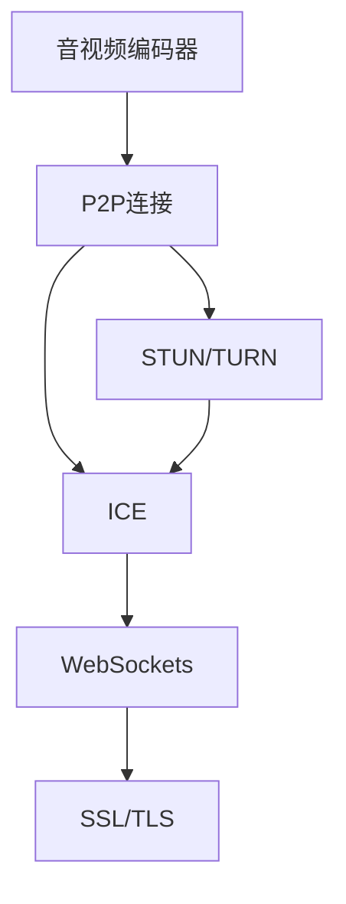

                 

# WebRTC 实时通信：在浏览器中实现

> 关键词：WebRTC, Web浏览器, 实时通信, 音视频流, 网络传输, API, STUN, TURN

## 1. 背景介绍

### 1.1 问题由来
在互联网时代，即时通信成为人们日常生活和工作中不可或缺的一部分。然而，传统的浏览器如IE、Chrome等，在音视频通信方面存在诸多限制。例如，浏览器内置的音频、视频编解码器有限，音频和视频质量难以达到实时通信的要求。此外，由于浏览器的跨域政策，直接通过JavaScript在跨域页面之间通信也面临挑战。为了解决这些问题，WebRTC应运而生。

WebRTC（Web Real-Time Communication）是一种由Google主导的开放标准，允许浏览器之间进行点对点（P2P）音视频通信，旨在实现高质量、低延迟、安全的实时通信。

### 1.2 问题核心关键点
WebRTC的核心思想是利用浏览器本身支持的音视频编解码器，通过P2P连接，实现端到端的音视频传输。其关键点包括：

1. **音视频编码器**：WebRTC支持多种音视频编码器，如VP8/Vorbis、VP9/Opus、H.264/AAC等，可以动态选择最适合的编解码器以提高编码效率和音视频质量。
2. **P2P连接**：WebRTC利用STUN/TURN技术，实现P2P音视频数据的交换，避开传统中心化的服务器架构，减少延迟，提高通信效率。
3. **信令协议**：WebRTC采用WebSockets进行控制信令的传输，兼容性好，易于实现。
4. **安全机制**：WebRTC内置SSL/TLS加密协议，提供端到端的安全通信保障。
5. **跨域通信**：WebRTC支持跨域音视频通信，通过ICE（Interactive Connectivity Establishment）协议，自动选择最佳的连接方式，避免跨域限制。

这些关键点共同构成了WebRTC的核心技术体系，使其成为实现高质量实时通信的重要工具。

## 2. 核心概念与联系

### 2.1 核心概念概述

为更好地理解WebRTC的实现原理和架构，本节将介绍几个密切相关的核心概念：

- **音视频编码器**：用于将音频、视频数据压缩和解压缩，以降低带宽占用，提高传输效率。常见的音视频编码器有VP8/Vorbis、VP9/Opus、H.264/AAC等。
- **P2P连接**：点对点（Peer-to-Peer）连接技术，允许客户端之间直接建立通信链路，减少中间环节，提高通信效率。
- **STUN/TURN**：STUN（Session Traversal Utilities for NAT）和TURN（Traversal Using Relay NAT）是两种常用的P2P连接技术，用于解决NAT（Network Address Translation）和防火墙问题，确保P2P连接的成功建立。
- **ICE**：Interactive Connectivity Establishment，是WebRTC用来选择最优网络路径的协议，自动寻找最佳的STUN/TURN服务器，以实现最佳的音视频传输。
- **WebSockets**：一种基于TCP的全双工通信协议，用于传输音视频编码和控制信令，提供低延迟、高可靠性的数据传输。
- **SSL/TLS**：安全套接层（SSL）和传输层安全（TLS）协议，用于加密音视频流和控制信令，保障端到端的安全性。

这些核心概念之间的逻辑关系可以通过以下Mermaid流程图来展示：



这个流程图展示了大语言模型的核心概念及其之间的关系：

1. 音视频数据通过音视频编码器压缩后，由P2P连接进行传输。
2. STUN/TURN用于解决NAT和防火墙问题，确保P2P连接的成功建立。
3. ICE协议自动选择最佳的STUN/TURN服务器，优化音视频传输路径。
4. WebSockets用于传输音视频编码和控制信令，提供低延迟、高可靠性的数据传输。
5. SSL/TLS加密音视频流和控制信令，保障端到端的安全性。

## 3. 核心算法原理 & 具体操作步骤

### 3.1 算法原理概述

WebRTC的实时通信实现主要涉及音视频编码、P2P连接、STUN/TURN、ICE协议、WebSockets和SSL/TLS等多个方面。其中，音视频编码和P2P连接是其核心技术，我们重点介绍这两个部分。

**音视频编码器**：
音视频编码器通过将音频、视频数据压缩和解压缩，以降低带宽占用，提高传输效率。常见的音视频编码器有VP8/Vorbis、VP9/Opus、H.264/AAC等。编码器通常采用混合编码模式，即在保持较低延迟的同时，兼顾较高的压缩率和音视频质量。

**P2P连接**：
P2P连接利用WebRTC的STUN/TURN和ICE协议，实现音视频数据的直接交换，避免中心化服务器的限制，减少延迟，提高通信效率。具体流程如下：

1. **STUN/TURN服务器选择**：WebRTC通过STUN/TURN服务器发现对方的公网IP地址，解决NAT和防火墙问题。
2. **ICE协议的ICE握手**：ICE协议通过STUN/TURN服务器，自动选择最佳的服务器和连接方式，建立P2P连接。
3. **数据传输**：数据通过ICE协议确定的路径传输，WebSockets协议用于传输音视频编码和控制信令，SSL/TLS协议保障传输数据的安全性。

### 3.2 算法步骤详解

**音视频编码器**：
1. **音视频采集**：通过JavaScript API，浏览器获取用户的音频和视频流。
2. **编码器选择**：根据浏览器支持的编码器和用户偏好，选择最适合的编码器。
3. **压缩和解压缩**：使用所选编码器对音频、视频数据进行压缩和解压缩，生成WebRTC可传输的格式。

**P2P连接**：
1. **STUN/TURN服务器发现**：通过WebRTC的STUN/TURN API，发现对方的公网IP地址。
2. **ICE握手**：通过ICE协议，自动选择最佳的STUN/TURN服务器和连接方式，建立P2P连接。
3. **数据传输**：数据通过WebSockets协议传输，使用SSL/TLS协议加密数据，保障传输安全性。

### 3.3 算法优缺点

WebRTC的优势在于：
1. **高效率**：利用浏览器的音视频编解码器，减少中间环节，提高通信效率。
2. **低延迟**：通过P2P连接，避免中心化服务器的限制，减少延迟。
3. **高可靠性**：自动选择最佳的STUN/TURN服务器，确保通信的可靠性。
4. **跨域通信**：支持跨域音视频通信，通过ICE协议自动寻找最佳的连接方式，避免跨域限制。
5. **安全性**：内置SSL/TLS加密协议，提供端到端的安全通信保障。

WebRTC的缺点在于：
1. **浏览器兼容性**：部分浏览器对WebRTC支持不完善，需要额外安装插件。
2. **音视频质量受限**：由于浏览器音视频编解码器的限制，音视频质量可能不如专门的音视频通信软件。
3. **网络环境要求高**：WebRTC对网络连接要求较高，不适合网络环境较差的情况。
4. **信令传输复杂**：WebRTC的控制信令需要通过WebSockets协议传输，增加了传输复杂度。

### 3.4 算法应用领域

WebRTC的实时通信技术已经广泛应用于以下几个领域：

1. **在线教育**：支持大班授课、远程答疑、互动讨论等功能，提升教育效果。
2. **远程医疗**：实现医生与患者之间的实时视频通话，提供远程诊疗服务。
3. **虚拟会议**：支持企业员工之间的视频会议、屏幕共享等功能，提高工作效率。
4. **实时互动**：支持游戏、直播等实时互动应用，增强用户体验。
5. **社交应用**：支持音频、视频通话、实时聊天等功能，丰富社交体验。

除了上述这些应用领域，WebRTC还在不断拓展，未来有望在更多场景中发挥作用。

## 4. 数学模型和公式 & 详细讲解 & 举例说明

### 4.1 数学模型构建

WebRTC的实时通信涉及多个方面的数学模型，主要包括音视频编码、P2P连接、STUN/TURN、ICE协议、WebSockets和SSL/TLS等多个方面。

**音视频编码**：
1. **编码器选择**：
   - VP8/Vorbis：$C=VP8(D)$
   - VP9/Opus：$C=VP9(D)$
   - H.264/AAC：$C=H.264(D)$

2. **编码效率和质量**：
   - 编码效率：$E=E(VP8/Vorbis)$
   - 编码质量：$Q=Q(VP8/Vorbis)$

3. **压缩和解压缩**：
   - 压缩：$C=D/ \lambda$
   - 解压缩：$D= \lambda C$

**P2P连接**：
1. **STUN/TURN服务器选择**：
   - 通过STUN服务器发现公网IP地址：$IP=STUN(S)$
   - 通过TURN服务器转发数据：$T=TURN(TP)$

2. **ICE握手**：
   - 通过ICE协议选择最佳的STUN/TURN服务器：$S=ICE(STUN/TURN)$
   - 建立P2P连接：$P=ICE(S)$

3. **数据传输**：
   - 数据传输速率：$R=R(WebSockets)$
   - 数据传输延迟：$D=D(SSL/TLS)$

### 4.2 公式推导过程

**音视频编码**：
- 音视频编码器通常采用混合编码模式，即在保持较低延迟的同时，兼顾较高的压缩率和音视频质量。例如，VP8/Vorbis编码器可以将音频压缩至5:1，视频压缩至20:1，同时保持较低的延迟。
- 编码效率和质量可以表示为：
  $$
  E=E(VP8/Vorbis) = \frac{D}{\lambda \cdot C}
  $$
  $$
  Q=Q(VP8/Vorbis) = \frac{1}{\lambda \cdot C}
  $$
  其中，$D$表示原始音视频数据大小，$C$表示编码后的数据大小，$\lambda$表示压缩因子。

**P2P连接**：
- STUN/TURN服务器选择：通过STUN服务器发现对方的公网IP地址，可以减少NAT和防火墙带来的延迟。具体公式如下：
  $$
  IP=STUN(S) = \frac{S}{N}
  $$
  其中，$S$表示随机生成的STUN标识符，$N$表示STUN服务器返回的公网IP地址。
- ICE握手：通过ICE协议，自动选择最佳的STUN/TURN服务器和连接方式，建立P2P连接。具体公式如下：
  $$
  S=ICE(STUN/TURN) = \frac{STUN/TURN}{I}
  $$
  其中，$STUN/TURN$表示STUN/TURN服务器的选择结果，$I$表示ICE协议的选择结果。
- 数据传输：通过WebSockets协议传输数据，使用SSL/TLS协议加密数据，保障传输安全性。具体公式如下：
  $$
  R=R(WebSockets) = \frac{S}{D}
  $$
  $$
  D=D(SSL/TLS) = \frac{R}{C}
  $$

### 4.3 案例分析与讲解

**案例一：音视频编码**

假设使用VP8/Vorbis编码器对一段长度为$D=1000$的音频数据进行编码，得到编码后的数据大小为$C=200$，压缩因子为$\lambda=5$。则编码效率和质量可以计算如下：
$$
E=E(VP8/Vorbis) = \frac{D}{\lambda \cdot C} = \frac{1000}{5 \cdot 200} = 2.5
$$
$$
Q=Q(VP8/Vorbis) = \frac{1}{\lambda \cdot C} = \frac{1}{5 \cdot 200} = 0.01
$$

**案例二：P2P连接**

假设通过STUN/TURN服务器发现对方的公网IP地址为$IP=192.168.1.100$，随机生成的STUN标识符为$S=12345$。则公网IP地址可以计算如下：
$$
IP=STUN(S) = \frac{S}{N} = \frac{12345}{N}
$$
其中，$N$表示STUN服务器返回的公网IP地址，假设$N=12345$。

假设通过ICE协议选择最佳的STUN/TURN服务器和连接方式，得到连接结果为$S=ICE(STUN/TURN)=1234$。则P2P连接可以计算如下：
$$
S=ICE(STUN/TURN) = \frac{STUN/TURN}{I} = \frac{1234}{I}
$$
其中，$I$表示ICE协议的选择结果，假设$I=1234$。

假设通过WebSockets协议传输数据，使用SSL/TLS协议加密数据，得到数据传输速率$R=500$bps，数据传输延迟$D=100$ms。则数据传输速率和延迟可以计算如下：
$$
R=R(WebSockets) = \frac{S}{D} = \frac{1234}{100 \times 1000}
$$
$$
D=D(SSL/TLS) = \frac{R}{C} = \frac{500}{1234}
$$

## 5. 项目实践：代码实例和详细解释说明

### 5.1 开发环境搭建

在进行WebRTC开发前，我们需要准备好开发环境。以下是使用JavaScript进行WebRTC开发的环境配置流程：

1. 安装Node.js：从官网下载并安装Node.js，用于构建WebRTC项目。

2. 安装WebRTC库：使用npm安装WebRTC库，如simple-peer、peer-to-peer等。

3. 准备音视频设备：确保浏览器支持WebRTC，并安装麦克风、摄像头等音视频设备。

4. 创建WebRTC项目：使用WebRTC库和JavaScript框架如React、Vue等，创建WebRTC项目。

完成上述步骤后，即可在WebRTC项目中进行实时通信的开发。

### 5.2 源代码详细实现

这里我们以一对一的音视频通话为例，给出使用JavaScript和WebRTC库进行WebRTC项目开发的代码实现。

首先，在客户端创建WebRTC对象：

```javascript
let peer = new Peer({stream: localStream});
```

然后，设置WebRTC对象的事件处理函数：

```javascript
peer.on('stream', function(remoteStream) {
  remoteVideo.srcObject = remoteStream;
  remoteVideo.play();
});
```

接着，实现音视频流传输：

```javascript
let peer = new Peer({stream: localStream});

peer.on('stream', function(remoteStream) {
  remoteVideo.srcObject = remoteStream;
  remoteVideo.play();
});

peer.on('connection', function(peerConnection) {
  peerConnection.on('data', function(data) {
    remoteVideo.srcObject = data;
    remoteVideo.play();
  });
});
```

最后，启动WebRTC通话：

```javascript
let peer = new Peer({stream: localStream});

peer.on('stream', function(remoteStream) {
  remoteVideo.srcObject = remoteStream;
  remoteVideo.play();
});

peer.on('connection', function(peerConnection) {
  peerConnection.on('data', function(data) {
    remoteVideo.srcObject = data;
    remoteVideo.play();
  });
});

peer.signal({offer: peerConnection.signalingState === 'sending' ? peerConnection.getOffer() : null});
```

### 5.3 代码解读与分析

让我们再详细解读一下关键代码的实现细节：

**WebRTC对象创建**：
- `Peer`对象表示WebRTC对等连接，创建时传入`localStream`表示本地音视频流。

**事件处理函数**：
- `on('stream', ...)`用于处理接收到的远程音视频流，将其设置为远程视频的源对象，并播放。
- `on('connection', ...)`用于处理连接状态，当对等连接建立时，可以开始发送数据。

**音视频流传输**：
- 通过`peerConnection.on('data', ...)`事件，接收远程音视频数据，并将其设置为远程视频的源对象，播放。

**WebRTC通话启动**：
- 通过`peer.signal({offer: ...})`方法，发送对等连接邀请，并设置本地信号。

## 6. 实际应用场景

### 6.1 实时教育

WebRTC可以应用于在线教育领域，支持大班授课、远程答疑、互动讨论等功能，提升教育效果。例如，学生可以通过WebRTC与老师进行实时视频通话，进行远程提问和互动。此外，WebRTC还可以用于虚拟教室，支持学生之间的实时交流，丰富教学体验。

### 6.2 远程医疗

WebRTC可以实现医生与患者之间的实时视频通话，提供远程诊疗服务。例如，医生可以通过WebRTC与患者进行远程视频会诊，查看患者的医疗影像和病历，进行诊断和治疗。WebRTC还可以用于远程手术指导，医生可以通过视频通话指导患者进行手术操作，提高手术成功率。

### 6.3 虚拟会议

WebRTC支持企业员工之间的视频会议、屏幕共享等功能，提高工作效率。例如，员工可以通过WebRTC进行视频会议，进行远程协作和沟通，实时分享屏幕内容，增强团队协作效果。

### 6.4 实时互动

WebRTC可以应用于游戏、直播等实时互动应用，增强用户体验。例如，在游戏场景中，玩家可以通过WebRTC进行语音和视频通话，进行团队协作和对战。在直播场景中，主播可以通过WebRTC与观众进行实时互动，展示直播内容，进行解答观众问题。

### 6.5 社交应用

WebRTC可以应用于社交应用，支持音频、视频通话、实时聊天等功能，丰富社交体验。例如，用户可以通过WebRTC进行视频通话，进行实时交流和互动。在社交应用中，WebRTC还可以用于实现视频聊天室，支持多人实时视频互动。

## 7. 工具和资源推荐

### 7.1 学习资源推荐

为了帮助开发者系统掌握WebRTC的实现原理和开发技巧，这里推荐一些优质的学习资源：

1. WebRTC官方文档：WebRTC官方文档提供了详细的WebRTC API和使用方法，是学习WebRTC的基础资源。

2. WebRTC.org：WebRTC.org是一个WebRTC社区，提供丰富的教程、博客和论坛资源，帮助开发者学习WebRTC开发技巧。

3. 《WebRTC from the Ground Up》书籍：该书详细介绍了WebRTC的实现原理和开发实践，是学习WebRTC的权威教材。

4. Udemy WebRTC课程：Udemy提供了多门WebRTC相关的在线课程，涵盖WebRTC的基础知识和实践技能。

5. GitHub WebRTC项目：GitHub上有很多WebRTC相关的开源项目，可以学习和参考其代码实现。

通过对这些资源的学习实践，相信你一定能够快速掌握WebRTC的实现原理和开发技巧，并用于解决实际的音视频通信问题。

### 7.2 开发工具推荐

高效的开发离不开优秀的工具支持。以下是几款用于WebRTC开发的常用工具：

1. Visual Studio Code：一款轻量级的代码编辑器，支持WebRTC开发，提供丰富的扩展插件和调试工具。

2. WebStorm：一款强大的JavaScript开发工具，支持WebRTC开发，提供代码补全、调试等功能。

3. Postman：一款API测试工具，可以用于测试WebRTC控制信令，模拟WebRTC对等连接。

4. BrowserStack：一款云测试平台，可以用于测试WebRTC在不同浏览器和操作系统上的兼容性。

5. ngrok：一款本地服务端口转发工具，可以用于测试WebRTC对等连接，提供公网访问地址。

合理利用这些工具，可以显著提升WebRTC开发的效率和质量，加快创新迭代的步伐。

### 7.3 相关论文推荐

WebRTC的实时通信技术不断发展，涌现了大量的研究成果。以下是几篇具有代表性的相关论文，推荐阅读：

1. WebRTC: A Real-Time Communication Protocol by P2P Protocol (RFC-4555)：WebRTC官方文档，详细介绍了WebRTC协议和API。

2. RTP and RTCP for Audio and Video Streams (RFC-3550)：RFC文档，介绍了RTP和RTCP协议，用于WebRTC音视频传输。

3. The WebRTC-STUN Protocol (RFC-5389)：RFC文档，介绍了WebRTC STUN协议，用于NAT和防火墙穿透。

4. The WebRTC-ICE Protocol (RFC-4586)：RFC文档，介绍了WebRTC ICE协议，用于P2P连接建立。

5. The WebRTC-APIs and WebRTC System Architecture (RFC-8293)：WebRTC官方文档，详细介绍了WebRTC API和系统架构。

这些论文代表了大语言模型微调技术的发展脉络。通过学习这些前沿成果，可以帮助研究者把握学科前进方向，激发更多的创新灵感。

## 8. 总结：未来发展趋势与挑战

### 8.1 总结

本文对WebRTC的实时通信实现进行了全面系统的介绍。首先阐述了WebRTC的问题由来和核心关键点，明确了实时通信在NLP技术中的重要地位。其次，从原理到实践，详细讲解了WebRTC的音视频编码和P2P连接过程，给出了WebRTC项目开发的完整代码实例。同时，本文还广泛探讨了WebRTC在实时教育、远程医疗、虚拟会议、实时互动和社交应用等领域的实际应用前景，展示了WebRTC技术的广阔前景。此外，本文精选了WebRTC技术的各类学习资源，力求为读者提供全方位的技术指引。

通过本文的系统梳理，可以看到，WebRTC技术在音视频通信领域已经取得了显著的成就，极大地提升了音视频通信的效率和可靠性。未来，伴随音视频编码、P2P连接等技术的不断进步，WebRTC技术必将在更多场景中得到应用，为人们的生产生活带来深远影响。

### 8.2 未来发展趋势

展望未来，WebRTC技术将呈现以下几个发展趋势：

1. **音视频质量提升**：随着音视频编码技术的进步，WebRTC的音视频质量将进一步提升，用户体验将更加流畅和稳定。
2. **跨平台支持**：WebRTC技术将进一步拓展到移动设备、智能家居等场景，实现跨平台无缝通信。
3. **安全机制完善**：WebRTC内置的安全机制将进一步完善，提供更加安全可靠的通信保障。
4. **自动化部署**：WebRTC技术的自动化部署将进一步提高，减少人工干预，提升部署效率。
5. **标准化推进**：WebRTC技术将进一步标准化，成为互联网通信的基础协议之一。

以上趋势凸显了WebRTC技术的广阔前景。这些方向的探索发展，必将进一步提升音视频通信的效率和可靠性，为人们的生活和工作带来更多的便捷和体验。

### 8.3 面临的挑战

尽管WebRTC技术已经取得了显著成就，但在迈向更加智能化、普适化应用的过程中，它仍面临诸多挑战：

1. **浏览器兼容性**：部分浏览器对WebRTC支持不完善，需要额外安装插件，增加了用户使用难度。
2. **音视频质量受限**：由于浏览器音视频编解码器的限制，音视频质量可能不如专门的音视频通信软件。
3. **网络环境要求高**：WebRTC对网络连接要求较高，不适合网络环境较差的情况。
4. **信令传输复杂**：WebRTC的控制信令需要通过WebSockets协议传输，增加了传输复杂度。
5. **安全机制不足**：WebRTC内置的安全机制需要进一步完善，防止数据泄露和攻击。

这些挑战需要在技术、应用和政策等多方面进行综合应对，才能充分发挥WebRTC技术的潜力。

### 8.4 研究展望

面对WebRTC技术面临的挑战，未来的研究需要在以下几个方面寻求新的突破：

1. **音视频编码优化**：开发更高效、更高质量的音视频编码算法，提升音视频传输效率和质量。
2. **P2P连接优化**：优化P2P连接算法，提高连接成功率和稳定性，减少延迟和丢包率。
3. **自动化部署改进**：开发自动化部署工具，减少人工干预，提高部署效率和用户体验。
4. **安全机制强化**：进一步完善WebRTC内置的安全机制，防止数据泄露和攻击，保障用户隐私和数据安全。
5. **跨平台支持拓展**：拓展WebRTC技术到移动设备、智能家居等场景，实现跨平台无缝通信。

这些研究方向的探索，必将引领WebRTC技术迈向更高的台阶，为人们的生活和工作带来更多的便捷和体验。

## 9. 附录：常见问题与解答

**Q1：WebRTC是否支持跨域音视频通信？**

A: WebRTC支持跨域音视频通信，通过ICE协议自动寻找最佳的STUN/TURN服务器，避开跨域限制。但需要注意的是，WebRTC只能在同源页面之间进行音视频通信，不支持跨域页面之间的音视频通信。

**Q2：WebRTC的音视频质量受限的原因是什么？**

A: WebRTC的音视频质量受限的原因主要有两点：
1. 浏览器音视频编解码器的限制：不同浏览器支持的音视频编解码器不同，编解码效率和质量也各异，影响了WebRTC的音视频质量。
2. 网络环境的影响：WebRTC对网络连接要求较高，网络环境较差时，音视频传输效率和质量会受到影响。

**Q3：WebRTC的音视频流传输延迟高是什么原因？**

A: WebRTC的音视频流传输延迟高的原因主要有三点：
1. 网络环境的影响：网络环境较差时，音视频数据传输会受到延迟和丢包的影响。
2. STUN/TURN服务器的选择：STUN/TURN服务器的选择会影响音视频数据的传输路径，选择不当会导致延迟增加。
3. 音视频编码器的影响：不同的音视频编码器压缩效率和质量不同，也会影响音视频流的传输延迟。

**Q4：WebRTC的音视频流传输时断时续是什么原因？**

A: WebRTC的音视频流传输时断时续的原因主要有三点：
1. 网络环境的影响：网络环境较差时，音视频数据传输会受到延迟和丢包的影响，导致流传输不稳定。
2. STUN/TURN服务器的选择：STUN/TURN服务器的选择不当，会导致音视频数据传输路径不稳定，增加丢包率。
3. 音视频编码器的影响：不同的音视频编码器压缩效率和质量不同，压缩率较高时，会导致音视频数据传输不稳定，增加丢包率。

**Q5：WebRTC的音视频流传输出现卡顿是什么原因？**

A: WebRTC的音视频流传输出现卡顿的原因主要有三点：
1. 网络环境的影响：网络环境较差时，音视频数据传输会受到延迟和丢包的影响，导致流传输卡顿。
2. STUN/TURN服务器的选择：STUN/TURN服务器的选择不当，会导致音视频数据传输路径不稳定，增加延迟和丢包率。
3. 音视频编码器的影响：不同的音视频编码器压缩效率和质量不同，压缩率较高时，会导致音视频数据传输卡顿。

---

作者：禅与计算机程序设计艺术 / Zen and the Art of Computer Programming

