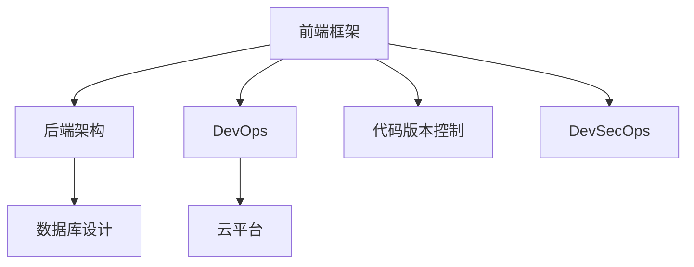

                 

# Web全栈开发：前端到后端的完整技术栈

> 关键词：Web全栈开发,前端框架,后端架构,数据库设计,微服务架构,DevOps,云平台,代码版本控制,DevSecOps

## 1. 背景介绍

### 1.1 问题由来
随着Web技术的不断进步和互联网应用的日益普及，Web全栈开发已成为软件开发的重要趋势。在传统的Web开发中，前端和后端工作被划分为两个独立的团队，各自负责不同技术栈的开发，容易出现沟通不畅、协作效率低下的问题。而Web全栈开发则将前端和后端工作集成在一个团队内完成，能够提高开发效率、提升系统性能和用户体验，成为提升企业竞争力的重要手段。

### 1.2 问题核心关键点
Web全栈开发的核心在于如何将前端和后端技术有机结合，构建一个高效、稳定、易于维护的Web应用。这需要开发者具备全面掌握多种技术栈的能力，涵盖前端框架、后端架构、数据库设计、DevOps、云平台等多个方面。

## 2. 核心概念与联系

### 2.1 核心概念概述

为更好地理解Web全栈开发的技术栈和工作流程，本节将介绍几个密切相关的核心概念：

- 前端框架(Frontend Framework)：如React、Vue、Angular等，用于构建交互式、动态的Web页面。
- 后端架构(Backend Architecture)：如RESTful API、GraphQL、微服务架构等，用于处理后端业务逻辑和数据存储。
- 数据库设计(Database Design)：如关系型数据库(RDBMS)、非关系型数据库(NoSQL)、文档数据库等，用于存储和管理数据。
- DevOps(Development and Operations)：涵盖持续集成(CI)、持续部署(CD)、容器化、自动化运维等，用于提升开发和运维效率。
- 云平台(Cloud Platform)：如AWS、Azure、Google Cloud等，用于提供计算、存储、网络等基础设施服务。
- 代码版本控制(Version Control)：如Git、SVN等，用于版本管理、协作开发、代码审计等。
- DevSecOps(Development and Security Operations)：结合DevOps和信息安全，确保开发过程中安全问题得到及时处理。

这些核心概念之间的逻辑关系可以通过以下Mermaid流程图来展示：



这个流程图展示了一些核心概念以及它们之间的相互关系。前端框架是Web应用的基础，后端架构负责处理业务逻辑和数据存储，DevOps和云平台提供基础设施支持，代码版本控制用于版本管理和协作开发，而DevSecOps确保开发过程中考虑安全问题。

## 3. 核心算法原理 & 具体操作步骤
### 3.1 算法原理概述

Web全栈开发的核心在于如何将前端和后端技术有机结合，构建一个高效、稳定、易于维护的Web应用。这需要开发者具备全面掌握多种技术栈的能力，涵盖前端框架、后端架构、数据库设计、DevOps、云平台等多个方面。

### 3.2 算法步骤详解

Web全栈开发一般包括以下几个关键步骤：

**Step 1: 选择技术栈**
- 根据项目需求，选择合适的前端框架和后端架构。如React+Node.js、Vue+Spring Boot、Angular+ASP.NET Core等。
- 选择适合的数据库，如MySQL、PostgreSQL、MongoDB等。

**Step 2: 设计数据模型**
- 根据业务需求，设计数据库表结构和关系。
- 确定表之间的关联关系和数据类型。

**Step 3: 搭建前端应用**
- 使用前端框架搭建Web应用。
- 编写API接口，实现前后端数据交互。

**Step 4: 搭建后端服务**
- 设计后端API接口，实现业务逻辑。
- 配置数据库连接，进行数据操作。

**Step 5: 部署应用**
- 使用DevOps工具进行持续集成和持续部署。
- 使用云平台进行应用部署和扩展。

**Step 6: 监控运维**
- 使用DevOps工具进行性能监控和异常告警。
- 定期更新应用，提升系统性能和安全性。

### 3.3 算法优缺点

Web全栈开发的主要优点在于能够提高开发效率、提升系统性能和用户体验，降低团队协作成本。同时，前端和后端集成在一个团队内，便于统一管理，提升开发质量和系统稳定性。

然而，Web全栈开发也面临一些挑战：
1. 技术栈复杂。需要全面掌握前端和后端技术，工作量大。
2. 协作难度高。前端和后端工作在一个团队内，容易出现沟通不畅和冲突。
3. 学习成本高。需要不断学习新技术，保持技术栈的前沿性。

尽管存在这些挑战，但Web全栈开发仍是当前软件开发的重要趋势，有助于提升开发效率和系统质量。

### 3.4 算法应用领域

Web全栈开发在Web应用开发、电子商务、社交媒体、在线教育、金融科技等多个领域都有广泛应用。例如：

- 电子商务网站：需要实现产品展示、购物车、支付、物流等复杂功能，前端和后端集成可以提高用户体验和系统性能。
- 社交媒体平台：需要实时处理用户生成内容、社区管理、个性化推荐等功能，前端和后端集成可以提升互动性和服务质量。
- 在线教育平台：需要实现课程管理、学习进度跟踪、在线互动等功能，前端和后端集成可以提升教学效果和学习体验。
- 金融科技应用：需要处理复杂的交易逻辑、风控管理、用户体验等，前端和后端集成可以提高系统稳定性和用户体验。

## 4. 数学模型和公式 & 详细讲解 & 举例说明

### 4.1 数学模型构建

在Web全栈开发中，数学模型主要用于优化算法和性能分析。例如，数据库索引设计、缓存策略、负载均衡算法等，都可以通过数学模型来优化。

假设有一个Web应用，有$m$个用户同时访问，每次请求需要$t$秒响应时间，使用RPS（Request Per Second）来表示每秒请求数。使用数学模型计算系统吞吐量，即每秒处理请求数：

$$
吞吐量 = \frac{m}{t} \times RPS
$$

其中$m$为并发用户数，$t$为单请求响应时间，$RPS$为每秒请求数。

### 4.2 公式推导过程

以缓存策略为例，假设每次请求需要访问数据库，时间复杂度为$O(n)$，使用缓存可以减少访问次数。令$c$为每次请求的缓存命中小于$c$的概率，则使用数学模型推导缓存策略的命中率$H$：

$$
H = 1 - (1 - c)^n
$$

其中$n$为请求次数。当$c$较小，$n$较大时，$H$趋近于1，即缓存能够显著提高性能。

### 4.3 案例分析与讲解

假设某电商网站，有100个并发用户同时访问商品详情页，每次请求响应时间为1秒，使用RPS为2000。此时，使用数学模型计算系统吞吐量：

$$
吞吐量 = \frac{100}{1} \times 2000 = 20000
$$

即系统每秒可以处理20000个请求。如果将缓存命中率$c$设置为0.9，则使用数学模型推导缓存策略的命中率：

$$
H = 1 - (1 - 0.9)^{100} \approx 0.999
$$

即使用缓存后，系统可以处理99.9%的请求，性能显著提升。

## 5. 项目实践：代码实例和详细解释说明

### 5.1 开发环境搭建

在进行Web全栈开发实践前，我们需要准备好开发环境。以下是使用Node.js和Vue.js进行Web开发的环境配置流程：

1. 安装Node.js：从官网下载并安装Node.js，用于运行JavaScript代码。
2. 安装Vue.js：从官网下载并安装Vue.js，用于搭建前端应用。
3. 安装npm/yarn：从官网下载并安装npm/yarn，用于管理Node.js包和依赖。

完成上述步骤后，即可在Node.js环境下开始Web全栈开发实践。

### 5.2 源代码详细实现

下面以一个简单的电子商务网站为例，给出使用Node.js和Vue.js进行Web全栈开发的项目代码实现。

首先，定义后端API接口：

```javascript
const express = require('express');
const app = express();
const port = 3000;

app.get('/api/products', (req, res) => {
  // 获取商品列表
  res.json({ products: products });
});

app.post('/api/products', (req, res) => {
  // 添加商品
  res.json({ success: true });
});

app.listen(port, () => {
  console.log(`Server running on port ${port}`);
});
```

然后，编写Vue.js前端代码：

```html
<template>
  <div>
    <h1>商品列表</h1>
    <ul>
      <li v-for="product in products" :key="product.id">
        {{ product.name }} - ${{ product.price }}
      </li>
    </ul>
    <form @submit.prevent="addProduct">
      <input v-model="newProduct.name" placeholder="商品名称" />
      <input v-model="newProduct.price" placeholder="商品价格" />
      <button type="submit">添加商品</button>
    </form>
  </div>
</template>

<script>
import axios from 'axios';

export default {
  data() {
    return {
      products: [],
      newProduct: { name: '', price: '' }
    };
  },
  mounted() {
    axios.get('/api/products')
      .then(response => {
        this.products = response.data.products;
      });
  },
  methods: {
    addProduct() {
      axios.post('/api/products', this.newProduct)
        .then(response => {
          this.newProduct.name = '';
          this.newProduct.price = '';
          this.products.push(this.newProduct);
        });
    }
  }
};
</script>
```

最后，使用npm/yarn进行项目打包和部署：

```bash
npm run build
npm run serve
```

以上就是使用Node.js和Vue.js进行Web全栈开发的前后端代码实现。可以看到，通过前端和后端的集成，可以实现功能完整的Web应用。

### 5.3 代码解读与分析

让我们再详细解读一下关键代码的实现细节：

**后端代码**：
- 使用Express框架搭建HTTP服务器。
- 定义两个API接口，分别用于获取商品列表和添加商品。
- 使用Node.js内置的http模块监听端口3000，等待请求。

**前端代码**：
- 使用Vue.js搭建Web应用。
- 使用axios库进行前后端数据交互。
- 使用数据绑定(v-model)实现表单输入和组件状态管理。
- 使用挂载生命周期钩子(mounted)进行数据初始化。

通过这些代码，我们实现了简单的商品列表和添加功能，展示了前后端的集成。前端代码通过调用后端API接口，实现商品数据的获取和提交。后端代码使用Express框架，处理HTTP请求和响应，存储和管理商品数据。

## 6. 实际应用场景

### 6.1 智能客服系统

Web全栈开发在智能客服系统的构建中也有广泛应用。传统的客服系统往往需要配备大量人力，高峰期响应缓慢，且一致性和专业性难以保证。而使用Web全栈开发的智能客服系统，可以7x24小时不间断服务，快速响应客户咨询，用自然流畅的语言解答各类常见问题。

在技术实现上，可以收集企业内部的历史客服对话记录，将问题和最佳答复构建成监督数据，在此基础上对Web应用进行微调。微调后的Web应用能够自动理解用户意图，匹配最合适的答案模板进行回复。对于客户提出的新问题，还可以接入检索系统实时搜索相关内容，动态组织生成回答。如此构建的智能客服系统，能大幅提升客户咨询体验和问题解决效率。

### 6.2 金融舆情监测

金融机构需要实时监测市场舆论动向，以便及时应对负面信息传播，规避金融风险。传统的人工监测方式成本高、效率低，难以应对网络时代海量信息爆发的挑战。使用Web全栈开发的金融舆情监测系统，可以实时抓取网络文本数据，使用自然语言处理技术进行情感分析、主题分析等，自动监测不同主题下的情感变化趋势，一旦发现负面信息激增等异常情况，系统便会自动预警，帮助金融机构快速应对潜在风险。

### 6.3 个性化推荐系统

当前的推荐系统往往只依赖用户的历史行为数据进行物品推荐，无法深入理解用户的真实兴趣偏好。使用Web全栈开发的个性化推荐系统，可以更好地挖掘用户行为背后的语义信息，从而提供更精准、多样的推荐内容。

在实践中，可以收集用户浏览、点击、评论、分享等行为数据，提取和用户交互的物品标题、描述、标签等文本内容。将文本内容作为模型输入，用户的后续行为（如是否点击、购买等）作为监督信号，在此基础上微调预训练语言模型。微调后的模型能够从文本内容中准确把握用户的兴趣点。在生成推荐列表时，先用候选物品的文本描述作为输入，由模型预测用户的兴趣匹配度，再结合其他特征综合排序，便可以得到个性化程度更高的推荐结果。

### 6.4 未来应用展望

随着Web全栈开发技术的不断演进，Web应用开发将具备更高的灵活性和扩展性。未来，Web全栈开发将广泛应用于更多场景中，为传统行业带来变革性影响。

在智慧医疗领域，使用Web全栈开发的医疗问答、病历分析、药物研发等应用将提升医疗服务的智能化水平，辅助医生诊疗，加速新药开发进程。

在智能教育领域，Web全栈开发的学情分析、知识推荐等应用将促进教育公平，提高教学质量。

在智慧城市治理中，Web全栈开发的应急指挥、舆情分析等应用将提高城市管理的自动化和智能化水平，构建更安全、高效的未来城市。

此外，在企业生产、社会治理、文娱传媒等众多领域，Web全栈开发的应用也将不断涌现，为经济社会发展注入新的动力。相信随着Web全栈开发技术的成熟，Web应用将更加普及，广泛渗透到人们的生活和工作各个方面。

## 7. 工具和资源推荐

### 7.1 学习资源推荐

为了帮助开发者系统掌握Web全栈开发的技术栈和工作流程，这里推荐一些优质的学习资源：

1. React官方文档：React官方文档提供了全面的React组件库、API文档和开发指南，是学习React框架的不二选择。
2. Vue.js官方文档：Vue.js官方文档涵盖了Vue.js的API和开发实践，是学习Vue.js框架的必备资源。
3. Express官方文档：Express官方文档提供了Express框架的API和开发指南，是学习Node.js框架的重要参考。
4. Git官方文档：Git官方文档介绍了Git版本控制系统的基本概念和用法，是学习版本控制技术的入门指南。
5. Docker官方文档：Docker官方文档介绍了Docker容器化技术的用法，是学习容器化技术的重要参考。
6. Webpack官方文档：Webpack官方文档介绍了Webpack模块打包和加载器的用法，是学习前端构建工具的重要参考。

通过对这些资源的学习实践，相信你一定能够快速掌握Web全栈开发的技术栈，并用于解决实际的Web开发问题。

### 7.2 开发工具推荐

高效的开发离不开优秀的工具支持。以下是几款用于Web全栈开发开发的常用工具：

1. VSCode：一款功能强大的开源编辑器，支持多种编程语言和插件，是Web开发的首选。
2. Webpack：一个模块打包和加载工具，可以自动将代码编译、压缩和打包成生产环境可用的文件。
3. Git：一个版本控制系统，用于版本管理、协作开发、代码审计等，是Web开发的重要工具。
4. Docker：一个容器化平台，可以方便地构建、部署和管理Web应用。
5. Kubernetes：一个容器编排平台，用于管理大规模分布式系统的容器化应用。
6. Jenkins：一个自动化集成和部署工具，可以持续集成、持续部署Web应用。

合理利用这些工具，可以显著提升Web全栈开发任务的开发效率，加快创新迭代的步伐。

### 7.3 相关论文推荐

Web全栈开发技术的发展源于学界的持续研究。以下是几篇奠基性的相关论文，推荐阅读：

1. React: A JavaScript Library for Building User Interfaces：提出React框架，用于构建高效、可重用、组件化的用户界面。
2. Vue.js: The Progressive JavaScript Framework：提出Vue.js框架，用于构建响应式、动态的Web应用。
3. Express: Web Application Framework for Node.js：提出Express框架，用于构建高效、可扩展的Node.js Web应用。
4. Git: The Story of a Single Change：Git之父Linus Torvalds回顾Git的开发历程，介绍了版本控制技术的演进。
5. Docker: An Open Platform for Distributing, Running, and Managing Applications：提出Docker容器化技术，用于构建、部署和管理Web应用。
6. Kubernetes: Container Orchestration：提出Kubernetes容器编排平台，用于管理大规模分布式系统的容器化应用。

这些论文代表了大前端和后端开发技术的发展脉络。通过学习这些前沿成果，可以帮助研究者把握学科前进方向，激发更多的创新灵感。

## 8. 总结：未来发展趋势与挑战

### 8.1 总结

本文对Web全栈开发的技术栈和工作流程进行了全面系统的介绍。首先阐述了Web全栈开发的背景和意义，明确了前后端集成对提升开发效率、系统性能和用户体验的重要性。其次，从原理到实践，详细讲解了Web全栈开发的数学模型和算法步骤，给出了Web全栈开发的项目代码实例。同时，本文还广泛探讨了Web全栈开发在智能客服、金融舆情、个性化推荐等众多领域的应用前景，展示了Web全栈开发技术的巨大潜力。此外，本文精选了Web全栈开发的学习资源、开发工具和相关论文，力求为读者提供全方位的技术指引。

通过本文的系统梳理，可以看到，Web全栈开发技术正逐步成为软件开发的重要趋势，有助于提升开发效率和系统质量。未来，Web全栈开发还将与其他人工智能技术进行更深入的融合，如自然语言处理、机器学习等，共同推动Web应用的发展。

### 8.2 未来发展趋势

展望未来，Web全栈开发技术将呈现以下几个发展趋势：

1. 技术栈整合。未来Web全栈开发技术栈将更加全面，涵盖前端框架、后端架构、数据库设计、DevOps、云平台等多个方面。
2. 开发效率提升。Web全栈开发工具将更加智能化，自动完成代码生成、测试、部署等任务，提升开发效率。
3. 跨平台应用。Web全栈开发技术将逐步支持跨平台开发，如Web、移动端、桌面端等。
4. 实时数据处理。Web全栈开发将结合实时数据处理技术，如流计算、大数据分析等，提升系统的响应速度和决策能力。
5. 云计算融合。Web全栈开发将更加紧密地与云计算技术融合，实现更高效的资源管理和应用部署。

以上趋势凸显了Web全栈开发技术的广阔前景。这些方向的探索发展，必将进一步提升Web应用的质量和性能，为Web开发带来新的突破。

### 8.3 面临的挑战

尽管Web全栈开发技术已经取得了显著进展，但在迈向更加智能化、普适化应用的过程中，它仍面临一些挑战：

1. 技术栈复杂。需要全面掌握前端和后端技术，工作量大。
2. 协作难度高。前端和后端工作在一个团队内，容易出现沟通不畅和冲突。
3. 学习成本高。需要不断学习新技术，保持技术栈的前沿性。

尽管存在这些挑战，但Web全栈开发仍是当前软件开发的重要趋势，有助于提升开发效率和系统质量。

### 8.4 研究展望

面对Web全栈开发面临的挑战，未来的研究需要在以下几个方面寻求新的突破：

1. 探索无监督和半监督开发方法。摆脱对大规模标注数据的依赖，利用自监督学习、主动学习等无监督和半监督范式，最大限度利用非结构化数据，实现更加灵活高效的开发。
2. 研究参数高效和计算高效的开发方法。开发更加参数高效的开发方法，在固定大部分预训练参数的同时，只更新极少量的任务相关参数。同时优化开发模型的计算图，减少前向传播和反向传播的资源消耗，实现更加轻量级、实时性的部署。
3. 融合因果和对比学习范式。通过引入因果推断和对比学习思想，增强开发模型建立稳定因果关系的能力，学习更加普适、鲁棒的语言表征，从而提升模型泛化性和抗干扰能力。
4. 引入更多先验知识。将符号化的先验知识，如知识图谱、逻辑规则等，与神经网络模型进行巧妙融合，引导开发过程学习更准确、合理的语言模型。同时加强不同模态数据的整合，实现视觉、语音等多模态信息与文本信息的协同建模。
5. 结合因果分析和博弈论工具。将因果分析方法引入开发模型，识别出模型决策的关键特征，增强输出解释的因果性和逻辑性。借助博弈论工具刻画人机交互过程，主动探索并规避模型的脆弱点，提高系统稳定性。

这些研究方向的探索，必将引领Web全栈开发技术迈向更高的台阶，为构建安全、可靠、可解释、可控的智能系统铺平道路。面向未来，Web全栈开发技术还需要与其他人工智能技术进行更深入的融合，如知识表示、因果推理、强化学习等，多路径协同发力，共同推动Web应用的发展。只有勇于创新、敢于突破，才能不断拓展Web全栈开发技术的边界，让Web应用更好地服务社会。

## 9. 附录：常见问题与解答

**Q1：Web全栈开发是否适用于所有Web应用？**

A: Web全栈开发在大多数Web应用上都能取得不错的效果，特别是对于数据量较小的应用。但对于一些特定领域的Web应用，如医疗、金融等，仅仅依靠通用Web框架可能难以很好地适应。此时需要在特定领域Web框架上进一步开发，才能获得理想效果。

**Q2：Web全栈开发如何选择合适的技术栈？**

A: 根据项目需求，选择合适的Web前端框架和后端框架。如React+Node.js、Vue.js+Spring Boot、Angular+ASP.NET Core等。同时，选择适合的数据库，如MySQL、PostgreSQL、MongoDB等。

**Q3：Web全栈开发如何提高开发效率？**

A: 使用开发工具如VSCode、Webpack等，自动生成代码和配置，减少手工作业量。同时，使用DevOps工具如Git、Jenkins等，自动化测试和部署，提升开发效率。

**Q4：Web全栈开发如何提升系统性能？**

A: 使用缓存技术如Redis、CDN等，减少数据库访问次数，提升系统响应速度。同时，使用负载均衡技术如Nginx、HAProxy等，提升系统的并发处理能力。

**Q5：Web全栈开发如何保障系统安全性？**

A: 使用安全技术如SSL/TLS、OAuth2、JWT等，保障数据传输和认证安全。同时，使用安全工具如OWASP、Snyk等，进行漏洞扫描和风险评估，确保系统安全。

通过本文的系统梳理，可以看到，Web全栈开发技术正逐步成为软件开发的重要趋势，有助于提升开发效率和系统质量。未来，Web全栈开发还将与其他人工智能技术进行更深入的融合，如自然语言处理、机器学习等，共同推动Web应用的发展。相信随着Web全栈开发技术的成熟，Web应用将更加普及，广泛渗透到人们的生活和工作各个方面。总之，Web全栈开发需要开发者不断学习和探索，才能把握最新技术趋势，构建高效、稳定、易于维护的Web应用。

---

作者：禅与计算机程序设计艺术 / Zen and the Art of Computer Programming

