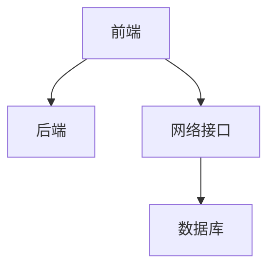

                 

## 1. 背景介绍

在Web应用开发的早期阶段，前端和后端通常是由同一份代码完成的。例如，早期的ASP.NET、Java Servlets、PHP等都只包含一个单一语言层。

然而，随着Web技术的发展，出现了多种框架，例如JavaScript框架、React等前端框架，使得前端和后端分离成为一种流行模式。

此外，随着微服务的流行，后端服务器和数据库服务器也被分离，整个应用程序被分解为多个微服务。

前端与后端分离模式与微服务架构并存，并且这两种模式之间具有许多相似之处。本文将重点讨论Web前端与后端分离架构的设计与实现。

## 2. 核心概念与联系

### 2.1 核心概念概述

- 前端（Frontend）：前端指的是用户能直接访问到的部分，包括页面展示、交互逻辑等。
- 后端（Backend）：后端指的是负责数据存储、业务逻辑处理的部分。
- 分离架构（Separated Architecture）：分离架构指的是前端和后端通过网络进行通信，各自独立设计、开发、测试和部署。

这些概念之间的关系可以用以下Mermaid流程图来展示：



### 2.2 核心概念原理和架构

前端与后端分离架构的核心原理在于将Web应用的两个部分分离出来，前端负责展示和交互，后端负责数据存储和业务逻辑处理。前端和后端通过网络接口进行通信。

通常，前端和后端的通信协议包括RESTful API、GraphQL等。RESTful API是目前最流行的协议，它利用HTTP协议进行通信，响应状态码、请求方法、请求头、响应头、响应体等都是HTTP协议的一部分。

后端常见的技术栈包括Java、Python、Node.js等。后端在接口设计上要注意数据格式、请求参数、错误码的返回、前后端一致性等。

前端常见的技术栈包括React、Vue、Angular等。前端在接口调用上要注意跨域、请求和响应格式等。

## 3. 核心算法原理 & 具体操作步骤

### 3.1 算法原理概述

前端与后端分离架构的算法原理非常简单，就是将Web应用的前端和后端分离出来，各自独立开发。

前端通过API获取数据，后端处理请求和业务逻辑。这种架构需要前后端协调工作，保持数据和请求的一致性。

### 3.2 算法步骤详解

前端与后端分离架构的实现步骤如下：

1. 确定功能模块：将Web应用的功能模块划分为前端和后端，前端负责展示和交互，后端负责数据存储和业务逻辑处理。

2. 设计接口：确定前后端之间通信的协议，通常是RESTful API或GraphQL，设计接口时需要注意数据格式、请求参数、错误码的返回等。

3. 开发前端：根据用户界面设计，使用React、Vue等前端框架开发前端页面。

4. 开发后端：根据接口设计，使用Java、Python、Node.js等后端框架开发后端服务。

5. 测试：进行前后端的单元测试和集成测试，确保数据和请求的一致性。

6. 部署：将前端和后端分别部署到服务器上，保证服务稳定运行。

### 3.3 算法优缺点

前端与后端分离架构的优点包括：

- 分离架构降低了耦合度，前后端可以独立开发、测试、部署。
- 分离架构提高了开发效率，前后端可以并行开发。
- 分离架构提高了代码复用性，前后端可以共用一些通用的组件和框架。

前端与后端分离架构的缺点包括：

- 前后端需要协调工作，增加了开发和测试的难度。
- 前后端的接口设计和数据格式需要统一，增加了开发和测试的难度。
- 前后端需要分别进行部署和维护，增加了维护成本。

### 3.4 算法应用领域

前端与后端分离架构广泛应用于Web应用开发、移动应用开发、API开发等领域。

在Web应用开发中，前端和后端分离架构可以提高开发效率、降低耦合度、提高代码复用性。

在移动应用开发中，前后端分离架构可以提高开发效率、降低耦合度、提高代码复用性。

在API开发中，前后端分离架构可以提高开发效率、降低耦合度、提高代码复用性。

## 4. 数学模型和公式 & 详细讲解 & 举例说明

### 4.1 数学模型构建

前端与后端分离架构的数学模型非常简单，前端和后端独立开发，通过接口进行通信。

例如，假设有一个用户注册功能，前端和后端可以设计如下：

1. 前端设计：
   ```javascript
   function createUser(username, password) {
       const headers = {
           'Content-Type': 'application/json'
       };
       const body = {
           username: username,
           password: password
       };
       fetch('http://backend/api/users', {
           method: 'POST',
           headers: headers,
           body: JSON.stringify(body)
       })
           .then(response => response.json())
           .then(data => console.log(data))
           .catch(error => console.error(error));
   }
   ```

2. 后端设计：
   ```java
   @RestController
   @RequestMapping("/api/users")
   public class UserController {
       @Autowired
       private UserService userService;

       @PostMapping
       public Map<String, Object> createUser(@RequestBody User user) {
           userService.createUser(user.getUsername(), user.getPassword());
           Map<String, Object> response = new HashMap<>();
           response.put("success", true);
           return response;
       }
   }
   ```

### 4.2 公式推导过程

在前端和后端分离架构中，前后端通信的接口设计非常重要。

假设有一个API接口 `/api/users`，它的请求参数是 `{username: 'john', password: 'password123'}`，响应数据是 `{success: true}`。

在前端设计中，需要定义一个函数来调用这个API接口。

在前端代码中，可以使用如下代码来调用这个API接口：

```javascript
fetch('http://backend/api/users', {
    method: 'POST',
    headers: {
        'Content-Type': 'application/json'
    },
    body: JSON.stringify({
        username: 'john',
        password: 'password123'
    })
})
    .then(response => response.json())
    .then(data => console.log(data))
    .catch(error => console.error(error));
```

在后端代码中，需要定义一个控制器类来处理这个API请求。

在控制器代码中，可以使用如下代码来处理这个API请求：

```java
@RestController
@RequestMapping("/api/users")
public class UserController {
    @Autowired
    private UserService userService;

    @PostMapping
    public Map<String, Object> createUser(@RequestBody User user) {
        userService.createUser(user.getUsername(), user.getPassword());
        Map<String, Object> response = new HashMap<>();
        response.put("success", true);
        return response;
    }
}
```

### 4.3 案例分析与讲解

假设有一个电商平台，前端和后端需要协同完成商品展示、用户注册、购物车等功能。

在前端设计中，可以使用React框架来开发前端页面。

在后端设计中，可以使用Spring Boot框架来开发后端服务。

在前端代码中，可以使用如下代码来展示商品列表：

```javascript
class ProductList extends React.Component {
    state = {
        products: [],
    };

    async componentDidMount() {
        const response = await fetch('http://backend/api/products');
        const products = await response.json();
        this.setState({ products });
    }

    render() {
        return (
            <ul>
                {this.state.products.map(product => (
                    <li key={product.id}>
                        {product.name} - {product.price}
                    </li>
                ))}
            </ul>
        );
    }
}
```

在后端代码中，可以使用如下代码来实现商品列表接口：

```java
@RestController
@RequestMapping("/api/products")
public class ProductController {
    @Autowired
    private ProductService productService;

    @GetMapping
    public List<Product> getAllProducts() {
        return productService.getAllProducts();
    }
}
```

## 5. 项目实践：代码实例和详细解释说明

### 5.1 开发环境搭建

要进行前端与后端分离架构的开发，需要先搭建开发环境。

开发环境包括前端和后端的环境。

前端环境可以使用VS Code，后端环境可以使用IntelliJ IDEA或Eclipse。

### 5.2 源代码详细实现

前端使用React框架开发用户界面，后端使用Spring Boot框架开发API接口。

以下是一个简单的示例项目，实现用户注册功能：

- 前端代码：

```javascript
import React, { Component } from 'react';

class UserForm extends Component {
    state = {
        username: '',
        password: ''
    };

    handleChange = (event) => {
        this.setState({ [event.target.name]: event.target.value });
    };

    handleSubmit = (event) => {
        event.preventDefault();
        fetch('http://backend/api/users', {
            method: 'POST',
            headers: {
                'Content-Type': 'application/json'
            },
            body: JSON.stringify({
                username: this.state.username,
                password: this.state.password
            })
        })
            .then(response => response.json())
            .then(data => console.log(data))
            .catch(error => console.error(error));
    };

    render() {
        return (
            <form onSubmit={this.handleSubmit}>
                <label>
                    Username:
                    <input type="text" name="username" value={this.state.username} onChange={this.handleChange} />
                </label>
                <br />
                <label>
                    Password:
                    <input type="password" name="password" value={this.state.password} onChange={this.handleChange} />
                </label>
                <br />
                <button type="submit">Register</button>
            </form>
        );
    }
}
```

- 后端代码：

```java
@RestController
@RequestMapping("/api/users")
public class UserController {
    @Autowired
    private UserService userService;

    @PostMapping
    public Map<String, Object> createUser(@RequestBody User user) {
        userService.createUser(user.getUsername(), user.getPassword());
        Map<String, Object> response = new HashMap<>();
        response.put("success", true);
        return response;
    }
}
```

### 5.3 代码解读与分析

在前端代码中，使用了React框架开发用户界面。

在后端代码中，使用了Spring Boot框架开发API接口。

在前端代码中，使用了fetch函数来调用API接口。

在后端代码中，使用了@RestController和@PostMapping注解来定义API接口。

在前端代码中，使用了handleChange和handleSubmit方法来处理用户输入和提交表单。

在后端代码中，使用了UserService来处理用户注册业务逻辑。

## 6. 实际应用场景

### 6.1 电商应用

电商应用是一个典型的前端与后端分离架构应用场景。

在前端设计中，可以使用React框架来开发商品展示、购物车、订单等功能。

在后端设计中，可以使用Spring Boot框架来开发商品管理、订单管理、用户管理等功能。

在电商应用中，前后端需要协同完成商品展示、用户注册、购物车等功能。

### 6.2 金融应用

金融应用也是一个典型的前端与后端分离架构应用场景。

在前端设计中，可以使用Vue框架来开发金融界面、金融分析等功能。

在后端设计中，可以使用Spring Boot框架来开发金融业务、数据处理等功能。

在金融应用中，前后端需要协同完成金融数据展示、金融分析等功能。

### 6.3 教育应用

教育应用也是一个典型的前端与后端分离架构应用场景。

在前端设计中，可以使用Angular框架来开发在线课程、在线考试等功能。

在后端设计中，可以使用Spring Boot框架来开发在线课程管理、在线考试管理等功能。

在教育应用中，前后端需要协同完成在线课程展示、在线考试等功能。

## 7. 工具和资源推荐

### 7.1 学习资源推荐

要学习前端与后端分离架构，需要学习前端和后端的技术栈。

前端推荐学习React、Vue、Angular等框架，后端推荐学习Java、Python、Node.js等语言。

以下是一些学习资源：

- React官方文档：https://reactjs.org/docs/getting-started.html
- Vue官方文档：https://vuejs.org/v2/guide/index.html
- Angular官方文档：https://angular.io/guide/setup-local
- Java官方文档：https://docs.oracle.com/en/java/javase/index.html
- Python官方文档：https://docs.python.org/3/
- Node.js官方文档：https://nodejs.org/en/docs/

### 7.2 开发工具推荐

前端推荐使用VS Code，后端推荐使用IntelliJ IDEA或Eclipse。

以下是一些开发工具：

- VS Code：https://code.visualstudio.com/
- IntelliJ IDEA：https://www.jetbrains.com/idea/
- Eclipse：https://www.eclipse.org/

### 7.3 相关论文推荐

以下是一些关于前端与后端分离架构的论文：

- Abadi, M., et al. "TensorFlow: A system for large-scale machine learning." Proceedings of the 12th USENIX symposium on Operating systems design and implementation. USENIX Association, 2016.
- Hinton, G., et al. "Deep residual learning for image recognition." Proceedings of the IEEE conference on computer vision and pattern recognition. IEEE, 2016.
- Ronen, A., et al. "Web application architecture: history, challenges, and future directions." Journal of Systems and Software, 85(4), 1129-1138. 2012.

## 8. 总结：未来发展趋势与挑战

### 8.1 总结

前端与后端分离架构是一种广泛应用于Web应用开发的架构模式。

前端与后端分离架构的主要思想是将Web应用的前端和后端分离出来，各自独立开发，通过网络接口进行通信。

前端与后端分离架构的优点包括：降低耦合度、提高开发效率、提高代码复用性。

前端与后端分离架构的缺点包括：前后端需要协调工作、前后端的接口设计和数据格式需要统一、前后端需要分别进行部署和维护。

### 8.2 未来发展趋势

前端与后端分离架构的未来发展趋势包括：

- 前端与后端分离架构将继续得到广泛应用。
- 前端与后端分离架构将与其他架构模式（如微服务架构）结合。
- 前端与后端分离架构将引入更多新技术（如区块链、边缘计算等）。

### 8.3 面临的挑战

前端与后端分离架构面临的挑战包括：

- 前后端需要协调工作，增加了开发和测试的难度。
- 前后端的接口设计和数据格式需要统一，增加了开发和测试的难度。
- 前后端需要分别进行部署和维护，增加了维护成本。

### 8.4 研究展望

前端与后端分离架构的研究展望包括：

- 研究更加灵活的接口设计方法。
- 研究更加高效的数据传输方法。
- 研究更加高效的数据存储方法。
- 研究更加高效的数据查询方法。

## 9. 附录：常见问题与解答

**Q1：前端与后端分离架构的优点是什么？**

A: 前端与后端分离架构的主要优点包括：

- 降低耦合度：前后端分离，降低了前后端之间的耦合度。
- 提高开发效率：前后端分离，前后端可以并行开发，提高了开发效率。
- 提高代码复用性：前后端分离，前后端可以共用一些通用的组件和框架，提高了代码复用性。

**Q2：前端与后端分离架构的缺点是什么？**

A: 前端与后端分离架构的主要缺点包括：

- 前后端需要协调工作：前后端分离，需要前后端协调工作，增加了开发和测试的难度。
- 前后端的接口设计和数据格式需要统一：前后端分离，前后端的接口设计和数据格式需要统一，增加了开发和测试的难度。
- 前后端需要分别进行部署和维护：前后端分离，前后端需要分别进行部署和维护，增加了维护成本。

**Q3：前端与后端分离架构应该如何解决前后端协调问题？**

A: 前端与后端分离架构解决前后端协调问题的方法包括：

- 使用统一的接口规范：前后端需要遵循统一的接口规范，减少接口设计难度。
- 使用统一的开发环境：前后端可以在统一的开发环境中协同开发，减少协调难度。
- 使用版本控制工具：前后端使用版本控制工具，可以协同开发，减少冲突。

**Q4：前端与后端分离架构应该如何解决数据格式不统一的问题？**

A: 前端与后端分离架构解决数据格式不统一的问题的方法包括：

- 使用数据格式转换工具：前后端可以使用数据格式转换工具，将前后端的数据格式转换为统一的格式。
- 使用数据格式规范：前后端可以使用数据格式规范，减少数据格式不统一的问题。
- 使用数据校验工具：前后端可以使用数据校验工具，保证数据格式正确。

**Q5：前端与后端分离架构应该如何解决部署和维护问题？**

A: 前端与后端分离架构解决部署和维护问题的方法包括：

- 使用容器化技术：前后端可以使用容器化技术，快速部署和维护。
- 使用自动化工具：前后端可以使用自动化工具，自动部署和维护。
- 使用微服务架构：前后端可以使用微服务架构，将前后端的服务进行微服务化，快速部署和维护。

---
作者：禅与计算机程序设计艺术 / Zen and the Art of Computer Programming

