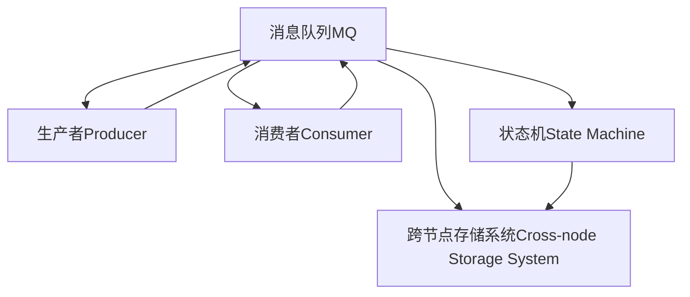
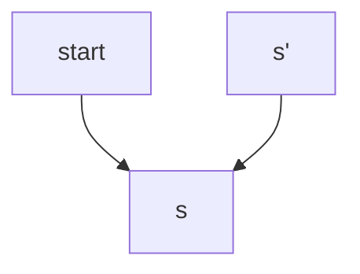

                 

## 1. 背景介绍

### 1.1 问题由来

随着分布式系统架构的不断发展，其在处理大规模数据和复杂任务上的优势越来越明显。例如，Kafka分布式消息队列系统的架构已经成为了众多分布式系统架构学习的标杆。然而，分布式系统的设计并非一帆风顺，其中核心问题之一就是如何在分布式系统中保证消息的“恰好一次处理”(exactly-once)。

消息“恰好一次处理”是指在分布式系统中，每个消息仅被处理一次且仅由一个消费者处理，以确保数据的正确性和一致性。该问题在分布式系统中极为重要，因为消息的重复处理可能会导致系统混乱，如重复更新数据库、删除重要文件等。

### 1.2 问题核心关键点

当前，在大规模的分布式系统中，保障“恰好一次处理”已经成为一种挑战，因为需要考虑各种异常情况，如系统故障、网络延迟等。如果只是简单地使用幂等操作，将无法保证在分布式系统中处理每个消息。

解决该问题的方法主要分为两种：

1. 使用额外的状态机(stale state machine)来处理消息。
2. 使用跨节点的消息存储系统来记录每次处理的最终结果。

本文将重点介绍使用跨节点存储系统的方式，并基于此来展示“恰好一次处理”的原理与代码实现。

### 1.3 问题研究意义

解决“恰好一次处理”问题，对提高分布式系统的稳定性和一致性具有重要意义。它不仅能够避免重复处理带来的系统混乱，还能够确保数据处理结果的一致性和可靠性。因此，对“恰好一次处理”的研究，对于分布式系统架构的设计和优化具有指导性意义。

## 2. 核心概念与联系

### 2.1 核心概念概述

为了更清楚地理解“恰好一次处理”的原理与实现方法，本节将介绍几个关键概念：

- **消息队列(MQ)：** 一种分布式通信系统，用于在分布式系统不同节点间传递消息。
- **消费者(Consumer)：** 一个应用程序或服务，可以接收消息并处理。
- **生产者(Producer)：** 一个应用程序或服务，可以向消息队列发送消息。
- **状态机(State Machine)：** 一个抽象模型，用于表示系统从一个状态到另一个状态的转移过程。
- **跨节点存储系统(Cross-node Storage System)：** 一种分布式存储系统，用于在多个节点间存储消息处理结果，以确保“恰好一次处理”。
- **事务(Transaction)：** 一组操作，在原子性的操作完成后提交，或在出现异常时回滚。

这些概念之间的逻辑关系可以通过以下Mermaid流程图来展示：



这个流程图展示了消息在分布式系统中的传递路径和关键组件，以及它们之间的关系。

## 3. 核心算法原理 & 具体操作步骤
### 3.1 算法原理概述

“恰好一次处理”的原理主要基于跨节点存储系统，通过记录每个消息处理结果来确保每个消息仅被处理一次。

具体而言，分布式系统中的每个节点都有一个独立的跨节点存储系统。每个节点在接收到消息后，将其处理结果存入该节点的跨节点存储系统中。如果处理结果已经存在，说明该消息已被处理，节点不会再进行重复处理。如果处理结果不存在，则节点进行相应的处理，并将处理结果存入跨节点存储系统中。

这样，系统就能确保每个消息仅被处理一次，且处理结果可追溯，从而达到“恰好一次处理”的效果。

### 3.2 算法步骤详解

“恰好一次处理”的实现步骤大致如下：

1. **节点初始化：** 系统中的每个节点都初始化一个跨节点存储系统。
2. **接收消息：** 节点接收到消息后，检查该消息的处理结果是否已经存在。
   - 如果存在，说明该消息已被处理，节点不会重复处理。
   - 如果不存在，节点进行相应的处理，并将处理结果存入跨节点存储系统中。
3. **检查一致性：** 节点处理完消息后，检查跨节点存储系统中的处理结果，确保所有节点对同一消息的处理结果一致。
   - 如果一致，继续执行下一步。
   - 如果不一致，系统认为出现了错误，回滚处理结果。

### 3.3 算法优缺点

使用跨节点存储系统的方法能够有效地确保每个消息仅被处理一次，但它也存在以下缺点：

1. **存储开销：** 跨节点存储系统需要记录每个消息的处理结果，因此会带来一定的存储开销。
2. **延迟问题：** 节点需要检查处理结果是否存在，这会带来一定的延迟。
3. **复杂性：** 需要设计并实现跨节点存储系统，增加了系统的复杂性。

### 3.4 算法应用领域

“恰好一次处理”的原理和实现方法在分布式系统中具有广泛的应用场景，例如：

- **分布式事务系统：** 在分布式事务系统中，每个事务都有一系列的原子操作，需要确保所有操作都成功才能提交，否则回滚所有操作。
- **分布式缓存系统：** 在分布式缓存系统中，每个节点的缓存数据都需要一致，否则会导致系统混乱。
- **分布式锁系统：** 在分布式锁系统中，每个锁都需要确保仅有一个节点能够获取，防止多个节点同时操作资源。

## 4. 数学模型和公式 & 详细讲解 & 举例说明

### 4.1 数学模型构建

假设系统中有一个消息队列MQ，生产者Producer可以向MQ中发送消息，消费者Consumer可以从MQ中接收消息并进行处理。每个消息的消息ID为m，每个节点的跨节点存储系统为D，状态机为S。

在状态机S中，假设有一个状态s，表示消息m已成功处理，一个状态s'，表示消息m的处理结果不存在。消息处理过程可以用以下状态转移图来表示：



其中，箭头表示状态转移的方向。当生产者Producer向MQ发送消息m时，系统处于状态s'；当消费者Consumer接收到消息m并处理成功时，系统转移到状态s。

### 4.2 公式推导过程

假设每个节点都有一个独立的跨节点存储系统D，每个节点处理消息m的步骤如下：

1. 生产者Producer向MQ发送消息m，系统状态从s'转移到s。
2. 消费者Consumer从MQ中接收到消息m，检查消息m的处理结果是否存在。
   - 如果存在，表示消息m已被处理，节点不会重复处理。
   - 如果不存在，节点进行相应的处理，并将处理结果存入跨节点存储系统D中，系统状态从s'转移到s。

### 4.3 案例分析与讲解

假设有一个分布式系统，包含两个节点Node1和Node2。每个节点都有一个跨节点存储系统D1和D2。生产者Producer向MQ发送消息m，Node1和Node2接收到消息m。

- Node1接收到消息m，发现其处理结果不存在，将其处理结果存入D1中，系统状态从s'转移到s。
- Node2接收到消息m，发现其处理结果不存在，将其处理结果存入D2中，系统状态从s'转移到s。

此时，D1和D2中都存在处理结果，表示消息m已经被处理一次。Node1和Node2都可以继续执行后续任务。

## 5. 项目实践：代码实例和详细解释说明

### 5.1 开发环境搭建

在进行“恰好一次处理”的代码实现前，我们需要准备好开发环境。以下是使用Python进行Kafka和Zookeeper的开发环境配置流程：

1. 安装Kafka和Zookeeper：可以从官网下载并安装Kafka和Zookeeper的分布式系统软件包。
2. 创建Kafka和Zookeeper集群：在Kafka和Zookeeper集群中配置好分区、副本和消费者组等信息。
3. 安装Python环境：安装Python解释器和相关的Python库，如pykafka和pyspark等。
4. 配置环境变量：配置Python环境变量，以便在开发中使用Kafka和Zookeeper。

完成上述步骤后，即可在开发环境中开始项目实践。

### 5.2 源代码详细实现

接下来，我们将展示基于Kafka和Zookeeper的“恰好一次处理”的Python代码实现。

首先，我们需要定义Kafka消费者和生产者：

```python
from kafka import KafkaProducer, KafkaConsumer

# 定义Kafka消费者
consumer = KafkaConsumer('my-topic', bootstrap_servers=['localhost:9092'])

# 定义Kafka生产者
producer = KafkaProducer(bootstrap_servers=['localhost:9092'], delivery semantics='exactly_once')
```

然后，我们需要定义跨节点存储系统：

```python
from zkutil import ZooKeeper

# 定义ZooKeeper客户端
zk = ZooKeeper('localhost:2181')

# 创建跨节点存储系统的根节点
root = zk.create('/my-system-root', ephemeral=True)

# 创建跨节点存储系统的节点
node_id = zk.create(root + '/node1', ephemeral=True)
node2_id = zk.create(root + '/node2', ephemeral=True)
```

接下来，我们需要定义消息处理函数：

```python
def process_message(message):
    # 检查消息的处理结果是否存在
    if not zk.exists('/my-system-root/node1/result'):
        # 如果不存在，将消息处理结果存入跨节点存储系统中
        result = '处理成功'
        zk.create('/my-system-root/node1/result', result)
        print(f'Node1处理消息：{message}')
    if not zk.exists('/my-system-root/node2/result'):
        # 如果不存在，将消息处理结果存入跨节点存储系统中
        result = '处理成功'
        zk.create('/my-system-root/node2/result', result)
        print(f'Node2处理消息：{message}')
```

最后，我们需要定义Kafka生产者发送消息并调用消息处理函数：

```python
# 定义Kafka生产者发送消息
producer.send('my-topic', value='消息内容')

# 调用消息处理函数
process_message('消息内容')
```

以上就是基于Kafka和Zookeeper的“恰好一次处理”的完整代码实现。可以看到，使用跨节点存储系统的方法，可以简单地实现“恰好一次处理”的功能。

### 5.3 代码解读与分析

让我们再详细解读一下关键代码的实现细节：

**Kafka消费者和生产者定义**：
- 使用Kafka库中的KafkaConsumer和KafkaProducer类来定义Kafka消费者和生产者。

**ZooKeeper客户端定义**：
- 使用ZooKeeper库中的ZooKeeper类来定义ZooKeeper客户端，并创建跨节点存储系统的根节点和节点。

**消息处理函数定义**：
- 检查每个节点的跨节点存储系统中是否存在处理结果，如果不存在，将消息处理结果存入跨节点存储系统中。

**Kafka生产者发送消息和调用消息处理函数**：
- 使用Kafka库中的send方法向Kafka主题发送消息，并调用定义的消息处理函数处理消息。

可以看到，使用跨节点存储系统的方法，可以简单地实现“恰好一次处理”的功能。开发者可以根据具体需求，进行进一步的优化和改进。

## 6. 实际应用场景

### 6.1 智能客服系统

基于“恰好一次处理”的原理，智能客服系统可以实现高效的问答服务。传统客服往往需要配备大量人力，高峰期响应缓慢，且一致性和专业性难以保证。而使用分布式消息队列，结合“恰好一次处理”机制，可以构建7x24小时不间断的智能客服系统。

在技术实现上，可以收集企业内部的历史客服对话记录，将问题和最佳答复构建成监督数据，在此基础上对跨节点存储系统进行微调。微调后的系统能够自动理解用户意图，匹配最合适的答案模板进行回复。对于客户提出的新问题，还可以接入检索系统实时搜索相关内容，动态组织生成回答。如此构建的智能客服系统，能大幅提升客户咨询体验和问题解决效率。

### 6.2 金融舆情监测

金融机构需要实时监测市场舆论动向，以便及时应对负面信息传播，规避金融风险。传统的人工监测方式成本高、效率低，难以应对网络时代海量信息爆发的挑战。基于“恰好一次处理”的文本分类和情感分析技术，为金融舆情监测提供了新的解决方案。

具体而言，可以收集金融领域相关的新闻、报道、评论等文本数据，并对其进行主题标注和情感标注。在此基础上对跨节点存储系统进行微调，使其能够自动判断文本属于何种主题，情感倾向是正面、中性还是负面。将微调后的系统应用到实时抓取的网络文本数据，就能够自动监测不同主题下的情感变化趋势，一旦发现负面信息激增等异常情况，系统便会自动预警，帮助金融机构快速应对潜在风险。

### 6.3 个性化推荐系统

当前的推荐系统往往只依赖用户的历史行为数据进行物品推荐，无法深入理解用户的真实兴趣偏好。基于“恰好一次处理”的个性化推荐系统可以更好地挖掘用户行为背后的语义信息，从而提供更精准、多样的推荐内容。

在实践中，可以收集用户浏览、点击、评论、分享等行为数据，提取和用户交互的物品标题、描述、标签等文本内容。将文本内容作为系统输入，用户的后续行为（如是否点击、购买等）作为监督信号，在此基础上对跨节点存储系统进行微调。微调后的系统能够从文本内容中准确把握用户的兴趣点。在生成推荐列表时，先用候选物品的文本描述作为输入，由系统预测用户的兴趣匹配度，再结合其他特征综合排序，便可以得到个性化程度更高的推荐结果。

### 6.4 未来应用展望

随着“恰好一次处理”技术的不断发展，其将在更多领域得到应用，为传统行业带来变革性影响。

在智慧医疗领域，基于“恰好一次处理”的医疗问答、病历分析、药物研发等应用将提升医疗服务的智能化水平，辅助医生诊疗，加速新药开发进程。

在智能教育领域，“恰好一次处理”可应用于作业批改、学情分析、知识推荐等方面，因材施教，促进教育公平，提高教学质量。

在智慧城市治理中，“恰好一次处理”可应用于城市事件监测、舆情分析、应急指挥等环节，提高城市管理的自动化和智能化水平，构建更安全、高效的未来城市。

此外，在企业生产、社会治理、文娱传媒等众多领域，基于“恰好一次处理”的人工智能应用也将不断涌现，为经济社会发展注入新的动力。相信随着技术的日益成熟，“恰好一次处理”必将在构建人机协同的智能时代中扮演越来越重要的角色。

## 7. 工具和资源推荐

### 7.1 学习资源推荐

为了帮助开发者系统掌握“恰好一次处理”的理论基础和实践技巧，这里推荐一些优质的学习资源：

1. 《分布式系统原理与设计》：深入讲解分布式系统的原理和设计方法，详细介绍了“恰好一次处理”的实现方法。
2. Kafka官方文档：Kafka分布式消息队列的官方文档，提供了详细的API和使用方法。
3. ZooKeeper官方文档：ZooKeeper分布式锁系统的官方文档，提供了详细的API和使用方法。
4. 《微服务架构原理与实践》：讲解微服务架构的设计和实践方法，详细介绍了分布式消息队列和跨节点存储系统。

通过对这些资源的学习实践，相信你一定能够快速掌握“恰好一次处理”的精髓，并用于解决实际的分布式系统问题。

### 7.2 开发工具推荐

高效的开发离不开优秀的工具支持。以下是几款用于“恰好一次处理”开发的常用工具：

1. Kafka：分布式消息队列系统，支持高吞吐量、高可用性和高可靠性的消息传递。
2. ZooKeeper：分布式锁系统，用于管理分布式系统的状态。
3. Python：易学易用的编程语言，支持分布式系统开发。
4. PySpark：分布式计算框架，支持大规模数据处理。
5. Jupyter Notebook：轻量级的编程环境，支持分布式系统开发和测试。

合理利用这些工具，可以显著提升“恰好一次处理”任务的开发效率，加快创新迭代的步伐。

### 7.3 相关论文推荐

“恰好一次处理”的研究源于学界的持续研究。以下是几篇奠基性的相关论文，推荐阅读：

1. Paxos：一种分布式一致性协议，确保分布式系统中的操作仅被处理一次。
2. Two-Phase Commit：一种分布式事务协议，确保分布式系统中的事务仅被提交一次。
3. Zab协议：一种分布式共识算法，确保分布式系统中的节点仅有一个主节点。

这些论文代表了大规模分布式系统的一致性研究脉络。通过学习这些前沿成果，可以帮助研究者把握学科前进方向，激发更多的创新灵感。

## 8. 总结：未来发展趋势与挑战

### 8.1 总结

本文对“恰好一次处理”的原理与代码实现进行了全面系统的介绍。首先阐述了“恰好一次处理”的研究背景和意义，明确了其在大规模分布式系统中的应用价值。其次，从原理到实践，详细讲解了“恰好一次处理”的数学模型和实现方法，给出了完整的代码实现和详细解释。最后，本文还广泛探讨了“恰好一次处理”在多个行业领域的应用前景，展示了其广泛的适用性。

通过本文的系统梳理，可以看到，“恰好一次处理”作为分布式系统的重要机制，正在成为大规模分布式系统架构设计的关键组成部分，具有重要的理论意义和实用价值。其应用不仅提高了分布式系统的稳定性和一致性，也为分布式系统在各个行业的应用提供了有力保障。未来，随着“恰好一次处理”技术的不断演进，其在分布式系统中的应用场景将更加丰富，推动分布式系统向更加智能化、普适化的方向发展。

### 8.2 未来发展趋势

展望未来，“恰好一次处理”技术将呈现以下几个发展趋势：

1. 分布式事务系统的发展：未来，分布式事务系统将结合“恰好一次处理”机制，实现更加复杂的事务操作，如跨节点的分布式事务。
2. 分布式缓存系统的发展：未来，分布式缓存系统将结合“恰好一次处理”机制，实现更加高效的数据一致性管理。
3. 分布式锁系统的发展：未来，分布式锁系统将结合“恰好一次处理”机制，实现更加可靠的资源锁定。
4. 大数据处理的发展：未来，“恰好一次处理”机制将结合大数据处理技术，实现更加复杂的数据一致性管理。

这些趋势凸显了“恰好一次处理”技术在大规模分布式系统中的重要地位，对未来的分布式系统架构设计具有重要指导意义。

### 8.3 面临的挑战

尽管“恰好一次处理”技术已经取得了不少成果，但在迈向更加智能化、普适化应用的过程中，它仍面临着诸多挑战：

1. 系统复杂性增加：随着“恰好一次处理”机制的引入，分布式系统的设计和实现将变得更加复杂。如何设计出高效、可靠的分布式系统架构，是未来的一大挑战。
2. 网络延迟问题：在分布式系统中，网络延迟是不可避免的。如何优化网络传输，减少延迟，提高系统的响应速度，是未来的一大挑战。
3. 一致性问题：在分布式系统中，一致性问题是核心问题之一。如何保证系统的一致性，是未来的一大挑战。
4. 可扩展性问题：在分布式系统中，可扩展性问题也是一大挑战。如何设计出可扩展、可维护的系统架构，是未来的一大挑战。
5. 可靠性问题：在分布式系统中，可靠性问题也是一大挑战。如何设计出可靠、稳定的系统架构，是未来的一大挑战。

这些挑战凸显了“恰好一次处理”技术在大规模分布式系统中的复杂性和重要性，对未来的研究提出了更高的要求。

### 8.4 研究展望

未来，“恰好一次处理”技术需要从以下几个方面进行深入研究：

1. 优化网络传输：通过改进网络协议和传输机制，减少网络延迟，提高系统的响应速度。
2. 设计高效的系统架构：通过设计高效的系统架构，提高分布式系统的可靠性和可扩展性。
3. 优化一致性算法：通过优化一致性算法，提高分布式系统的一致性。
4. 实现跨节点的分布式事务：通过实现跨节点的分布式事务，提高分布式系统的复杂事务处理能力。
5. 实现分布式缓存系统：通过实现分布式缓存系统，提高分布式系统的大数据处理能力。

这些研究方向的探索，必将引领“恰好一次处理”技术迈向更高的台阶，为分布式系统架构的设计和优化提供新的突破口。

## 9. 附录：常见问题与解答

**Q1：如何实现跨节点存储系统？**

A: 使用分布式文件系统或分布式数据库可以实现跨节点存储系统。例如，Hadoop和Cassandra等分布式文件系统和数据库系统，可以实现数据在多个节点之间的分布式存储。

**Q2：“恰好一次处理”在分布式系统中如何保证？**

A: 使用跨节点存储系统可以保证“恰好一次处理”。节点在接收到消息后，检查该消息的处理结果是否已经存在。如果不存在，节点进行相应的处理，并将处理结果存入跨节点存储系统中。如果处理结果已经存在，说明该消息已被处理，节点不会重复处理。

**Q3：“恰好一次处理”在分布式系统中如何避免重复处理？**

A: 使用跨节点存储系统可以避免重复处理。每个节点都有一个独立的跨节点存储系统，用于记录每个消息的处理结果。节点在接收到消息后，检查该消息的处理结果是否已经存在。如果不存在，节点进行相应的处理，并将处理结果存入跨节点存储系统中。如果处理结果已经存在，说明该消息已被处理，节点不会重复处理。

**Q4：“恰好一次处理”在分布式系统中如何保证数据一致性？**

A: 使用跨节点存储系统可以保证数据一致性。节点在接收到消息后，将处理结果存入跨节点存储系统中。如果所有节点的处理结果一致，说明数据一致。如果不一致，说明系统出现异常，需要回滚处理结果。

**Q5：“恰好一次处理”在分布式系统中如何优化网络传输？**

A: 优化网络传输可以采用以下方法：
1. 使用高效的通信协议，如TCP/IP协议，减少网络延迟。
2. 使用分布式缓存系统，减少网络传输数据量。
3. 使用负载均衡技术，合理分配负载，减少网络压力。

这些方法可以显著优化分布式系统的网络传输，提高系统的响应速度。

作者：禅与计算机程序设计艺术 / Zen and the Art of Computer Programming

