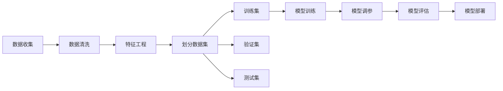

                 

# 【AI大数据计算原理与代码实例讲解】Dataset

## 1. 背景介绍

在大数据时代，数据的收集和处理已经变得越来越重要。数据集（Dataset）是人工智能和机器学习项目中的基础，是训练模型的原材料。本文将详细讲解数据集的概念、重要性、构建过程和实际应用场景，并结合代码实例进行分析。

### 1.1 数据集概述

数据集是指包含一组数据样本的数据集合，每个样本由特征和标签两部分组成。特征是用于描述样本的属性，标签则是样本的类别或目标值。例如，在图像识别任务中，每个样本可能是一张图片，特征是像素值，标签是图片中物体类别（如猫、狗等）。数据集可以帮助训练算法，使机器能够学习数据的规律，并进行预测或分类。

### 1.2 数据集的重要性

数据集的重要性体现在以下几个方面：
1. **训练模型**：数据集是机器学习算法的输入，通过训练数据集，算法可以学习数据的特征和规律。
2. **验证和测试**：训练数据集用于训练模型，验证数据集用于调整模型参数，测试数据集用于评估模型性能。
3. **推动研究进步**：数据集的多样性和质量直接影响模型的效果，高质量的数据集可以促进机器学习领域的研究进步。

### 1.3 数据集构建过程

数据集的构建过程包括以下步骤：
1. **数据收集**：从多个来源收集数据，包括在线数据库、公开数据集、公司内部数据等。
2. **数据清洗**：清洗数据以去除噪声、错误和不完整数据，确保数据的质量。
3. **特征工程**：提取和构造特征，以便算法能够更好地理解数据。
4. **划分数据集**：将数据集划分为训练集、验证集和测试集，以便进行模型训练、调参和评估。
5. **数据标注**：为数据集中的样本添加标签，以便算法进行分类或回归任务。

## 2. 核心概念与联系

### 2.1 核心概念概述

以下概念是理解数据集构建和应用的基础：
- **特征（Feature）**：描述样本的属性，可以是数值型、分类型或文本型数据。
- **标签（Label）**：样本的类别或目标值，用于监督学习任务的训练。
- **训练集（Training Set）**：用于训练模型的数据集。
- **验证集（Validation Set）**：用于调整模型参数的数据集。
- **测试集（Test Set）**：用于评估模型性能的数据集。

### 2.2 核心概念关系（Mermaid 流程图）



## 3. 核心算法原理 & 具体操作步骤

### 3.1 算法原理概述

数据集的构建和应用是基于机器学习算法进行的。常见的算法包括监督学习（Supervised Learning）、无监督学习（Unsupervised Learning）和半监督学习（Semi-supervised Learning）等。以下是几种典型的算法原理：

- **监督学习**：使用带有标签的数据集训练模型，使其能够预测新样本的标签。常见的算法包括线性回归、逻辑回归、决策树等。
- **无监督学习**：使用无标签的数据集训练模型，发现数据的内在结构和规律。常见的算法包括聚类、降维等。
- **半监督学习**：结合少量标签和大量无标签数据，训练模型以提高性能。

### 3.2 算法步骤详解

#### 3.2.1 数据收集

数据收集是构建数据集的第一步，常见的数据来源包括：
- **公开数据集**：如MNIST、CIFAR-10等，由学术机构或公司发布。
- **在线数据库**：如Kaggle、UCI等，提供免费的数据下载和竞赛平台。
- **公司内部数据**：企业内部收集的数据，用于特定任务的研究。

#### 3.2.2 数据清洗

数据清洗是指去除数据中的噪声、错误和不完整数据，确保数据的质量。常见的数据清洗方法包括：
- **处理缺失值**：填补缺失值或删除含有缺失值的样本。
- **去除噪声**：去除异常值和错误数据。
- **标准化数据**：将数据缩放到[0, 1]或[-1, 1]等标准范围内。

#### 3.2.3 特征工程

特征工程是指提取和构造特征，以便算法能够更好地理解数据。常见的特征工程方法包括：
- **特征选择**：选择对目标变量有重要影响的特征。
- **特征缩放**：将特征缩放到相同范围内，以提高算法的性能。
- **特征组合**：将多个特征组合成新的特征，以提高算法的表达能力。

#### 3.2.4 划分数据集

数据集的划分是将数据集划分为训练集、验证集和测试集，以便进行模型训练、调参和评估。常见的划分方法包括：
- **随机划分**：随机将数据集划分为训练集和测试集。
- **分层划分**：按照类别比例将数据集划分为训练集和测试集。
- **留出法**：将数据集划分为训练集和验证集，再从验证集中选择一小部分数据作为测试集。

#### 3.2.5 数据标注

数据标注是为数据集中的样本添加标签，以便算法进行分类或回归任务。常见的数据标注方法包括：
- **人工标注**：由人工为样本添加标签。
- **半自动标注**：结合人工和算法，由算法生成初步标签，由人工修正。
- **自动标注**：使用算法自动为样本生成标签。

### 3.3 算法优缺点

#### 3.3.1 优点

1. **提高模型性能**：高质量的数据集可以显著提高机器学习模型的性能。
2. **支持多种算法**：数据集可以用于多种机器学习算法，如分类、回归、聚类等。
3. **便于研究**：数据集提供了研究机器学习算法的基础，促进了学术和工业界的研究进展。

#### 3.3.2 缺点

1. **数据获取困难**：高质量的数据集获取困难，需要大量人力和时间。
2. **数据标注成本高**：数据标注需要人工干预，成本较高。
3. **数据隐私问题**：数据集中的敏感数据可能涉及隐私问题，需要谨慎处理。

### 3.4 算法应用领域

数据集在各个领域都有广泛的应用，例如：
- **计算机视觉**：用于图像识别、目标检测、图像分割等任务。
- **自然语言处理**：用于文本分类、情感分析、语言模型训练等任务。
- **推荐系统**：用于用户行为分析、商品推荐等任务。
- **医疗领域**：用于疾病诊断、药物研发、患者信息管理等任务。

## 4. 数学模型和公式 & 详细讲解 & 举例说明

### 4.1 数学模型构建

数据集的数学模型构建基于机器学习算法。以线性回归模型为例，其数学模型如下：

$$ y = \theta_0 + \theta_1 x_1 + \theta_2 x_2 + \cdots + \theta_n x_n + \epsilon $$

其中，$y$为样本的标签，$x_1, x_2, \cdots, x_n$为样本的特征，$\theta_0, \theta_1, \theta_2, \cdots, \theta_n$为模型参数，$\epsilon$为误差项。

### 4.2 公式推导过程

线性回归模型的推导过程如下：
1. 假设样本的标签和特征之间存在线性关系，即$y = \theta_0 + \theta_1 x_1 + \theta_2 x_2 + \cdots + \theta_n x_n + \epsilon$。
2. 通过最小二乘法求解模型参数，使得预测值与实际值之间的误差最小。
3. 得到模型参数的表达式$\theta_0 = \bar{y} - \theta_1 \bar{x}_1 - \theta_2 \bar{x}_2 - \cdots - \theta_n \bar{x}_n$，$\theta_1 = \frac{\sum_{i=1}^n (x_{i1}-\bar{x}_1)(y_i-\bar{y})}{\sum_{i=1}^n (x_{i1}-\bar{x}_1)^2}$，以此类推。

### 4.3 案例分析与讲解

以房价预测为例，假设有一个包含房屋特征和价格的数据集。可以使用线性回归模型对房屋价格进行预测。步骤如下：
1. 收集房屋面积、房间数量、地理位置等特征。
2. 对数据集进行清洗和标准化处理。
3. 使用部分数据集进行训练，得到模型参数。
4. 使用测试集进行评估，得到预测结果。
5. 根据评估结果调整模型参数，再次进行训练和评估，直到达到理想的效果。

## 5. 项目实践：代码实例和详细解释说明

### 5.1 开发环境搭建

数据集构建和分析可以使用Python编程语言，结合Scikit-learn、Pandas、NumPy等库进行实现。以下是Python开发环境的搭建步骤：
1. 安装Anaconda，创建虚拟环境。
2. 安装Scikit-learn、Pandas、NumPy等库。
3. 安装Jupyter Notebook，方便编写和运行代码。

### 5.2 源代码详细实现

#### 5.2.1 数据收集

```python
import pandas as pd

# 加载数据集
data = pd.read_csv('data.csv')

# 显示数据集的前几行
data.head()
```

#### 5.2.2 数据清洗

```python
# 处理缺失值
data.fillna(method='ffill', inplace=True)

# 去除异常值
data = data[data['price'] < 1000]

# 标准化数据
from sklearn.preprocessing import StandardScaler
scaler = StandardScaler()
data['price'] = scaler.fit_transform(data[['price']])
```

#### 5.2.3 特征工程

```python
# 特征选择
features = ['area', 'rooms', 'location']
data = data[features]

# 特征缩放
scaler = StandardScaler()
data = pd.DataFrame(scaler.fit_transform(data), columns=features)
```

#### 5.2.4 数据划分

```python
from sklearn.model_selection import train_test_split

# 划分训练集和测试集
X_train, X_test, y_train, y_test = train_test_split(data, data['price'], test_size=0.2, random_state=42)
```

#### 5.2.5 数据标注

```python
# 数据标注
y_train = X_train['price']
y_test = X_test['price']
X_train = X_train.drop('price', axis=1)
X_test = X_test.drop('price', axis=1)
```

### 5.3 代码解读与分析

代码中使用了Pandas库进行数据处理，Scikit-learn库进行数据划分和特征工程，实现了数据集的构建和预处理。以下是代码的详细解读：
- `pd.read_csv()`：从CSV文件中加载数据集。
- `fillna()`：处理缺失值。
- `drop()`：删除数据集中的某列。
- `train_test_split()`：将数据集划分为训练集和测试集。

### 5.4 运行结果展示

运行以上代码后，可以得到处理后的数据集。例如，`data.head()`将输出前五条数据的预览，`X_train.head()`和`y_train.head()`将分别输出训练集的前五条特征和标签。

## 6. 实际应用场景

### 6.1 医疗领域

在医疗领域，数据集可以用于疾病诊断、患者信息管理等任务。例如，可以使用患者的历史医疗记录和症状数据，训练机器学习模型进行疾病预测和诊断。

### 6.2 金融领域

在金融领域，数据集可以用于风险评估、欺诈检测等任务。例如，可以使用客户的交易记录和行为数据，训练机器学习模型预测客户是否存在欺诈行为。

### 6.3 电商领域

在电商领域，数据集可以用于商品推荐、用户行为分析等任务。例如，可以使用用户的购买记录和行为数据，训练机器学习模型推荐相关商品。

### 6.4 未来应用展望

未来，数据集将在更多领域得到广泛应用。例如：
- **智慧城市**：用于城市事件监测、交通流量分析等任务。
- **环境监测**：用于气象数据、水质监测等任务。
- **安全领域**：用于视频监控、入侵检测等任务。

## 7. 工具和资源推荐

### 7.1 学习资源推荐

以下是一些优质的学习资源，帮助你掌握数据集构建和应用：
- **《Python数据科学手册》**：介绍Python在数据科学中的应用，包括数据清洗、特征工程等。
- **《机器学习实战》**：通过实战项目讲解机器学习算法，包括数据集构建和模型训练。
- **Kaggle**：提供大量的公开数据集和竞赛平台，帮助你练习和展示数据集构建技能。

### 7.2 开发工具推荐

以下是一些常用的开发工具，帮助你构建和分析数据集：
- **Jupyter Notebook**：支持Python、R等语言，提供丰富的数据分析和可视化功能。
- **Pandas**：提供数据处理和分析功能，支持多种数据格式。
- **Scikit-learn**：提供机器学习算法和工具，支持数据集构建和模型训练。

### 7.3 相关论文推荐

以下是一些前沿的论文，深入探讨数据集的构建和应用：
- **《A Survey on Datasets for Deep Learning》**：综述性论文，介绍了数据集在深度学习中的应用。
- **《Datasets for Deep Learning: A Critical Overview》**：探讨数据集对深度学习性能的影响。
- **《Benchmarking Datasets for Machine Learning》**：讨论了数据集构建和评估的标准。

## 8. 总结：未来发展趋势与挑战

### 8.1 研究成果总结

数据集是大数据时代的重要基础，其构建和应用对机器学习算法的性能和效果有着决定性的影响。未来的研究将集中在以下几个方面：
- **数据获取**：如何高效地获取高质量的数据集，减少数据收集和标注的成本。
- **数据标注**：如何降低数据标注的成本，提升数据标注的准确性。
- **数据隐私**：如何保护数据隐私，避免数据泄露和滥用。

### 8.2 未来发展趋势

未来数据集的发展趋势包括：
- **自动化标注**：使用自动化标注工具减少人工标注的成本和错误。
- **大数据技术**：利用大数据技术，从更多数据源获取数据，提升数据集的质量和多样性。
- **跨领域数据融合**：将不同领域的数据进行融合，构建更全面、更通用的数据集。

### 8.3 面临的挑战

数据集构建和应用面临的挑战包括：
- **数据质量**：数据质量差、噪声多，影响算法的性能。
- **数据标注成本**：数据标注成本高，难以大规模应用。
- **数据隐私**：数据隐私问题突出，需要谨慎处理。

### 8.4 研究展望

未来的研究将注重以下几个方面：
- **数据集标准化**：制定数据集的标准和规范，提高数据集的可复现性和可比性。
- **数据集开放共享**：构建开放的数据共享平台，促进数据集的多样性和应用。
- **数据集隐私保护**：研究数据集的隐私保护技术，保障数据安全。

## 9. 附录：常见问题与解答

### Q1：数据集构建过程中需要注意哪些问题？

A: 数据集构建过程中需要注意以下几个问题：
- **数据质量**：确保数据的准确性和完整性，避免噪声和错误。
- **数据平衡**：保证数据集中的各个类别样本数量均衡，避免数据倾斜。
- **数据隐私**：保护数据隐私，避免数据泄露和滥用。

### Q2：如何构建高质量的数据集？

A: 构建高质量的数据集需要以下几个步骤：
- **数据收集**：从多个数据源收集数据，确保数据的多样性和丰富性。
- **数据清洗**：去除噪声和错误数据，保证数据的质量。
- **数据标注**：准确地为数据集中的样本添加标签，确保数据的正确性。

### Q3：数据集构建对机器学习算法的性能有什么影响？

A: 数据集构建对机器学习算法的性能有显著影响。高质量的数据集能够提高算法的准确性和泛化能力，而低质量的数据集则可能导致算法性能下降。

### Q4：如何处理数据集中的缺失值？

A: 处理数据集中的缺失值有以下几种方法：
- **填补缺失值**：使用均值、中位数、众数等填补缺失值。
- **删除缺失值**：删除含有缺失值的样本。
- **插值法**：使用插值法填补缺失值。

### Q5：数据集的划分对机器学习算法的性能有什么影响？

A: 数据集的划分对机器学习算法的性能有显著影响。合理的划分方式可以提高算法的训练效果和泛化能力，而不合理的划分方式可能导致算法性能下降。

作者：禅与计算机程序设计艺术 / Zen and the Art of Computer Programming

