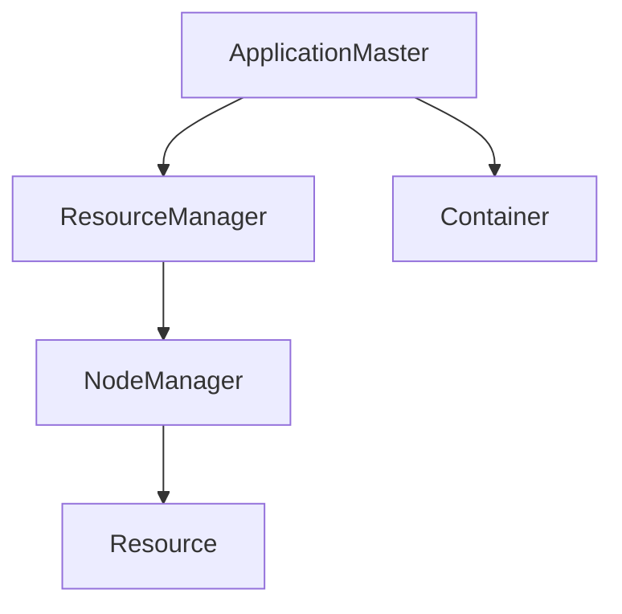

                 

# 【AI大数据计算原理与代码实例讲解】Yarn

> 关键词：Yarn, Hadoop,分布式计算,资源调度,任务管理,大数据,计算集群

## 1. 背景介绍

### 1.1 问题由来

随着大数据时代的到来，海量数据的处理和分析变得越来越重要。单台计算机的处理能力已难以满足需求，分布式计算技术应运而生。Yarn作为Hadoop 2.0的核心组件之一，是Hadoop生态系统中最重要的资源管理器，负责调度集群中的计算资源和执行任务。Yarn的引入极大地提高了Hadoop的计算效率和扩展性。

### 1.2 问题核心关键点

Yarn的主要目标是为大规模数据处理任务提供高效、可扩展、高可用性的资源管理与任务调度解决方案。其核心优势包括：

- **资源管理**：Yarn将集群的计算资源（CPU、内存、存储等）抽象为不同类型的资源节点（NodeManager），每个节点负责管理其中的资源，并将这些资源提供给ApplicationMaster和Container使用。
- **任务调度**：Yarn通过ApplicationMaster来实现任务调度和容错机制。每个数据处理作业（Application）有一个对应的ApplicationMaster，负责任务的调度和资源分配。
- **灵活性**：Yarn支持多种编程语言和框架，如MapReduce、Spark、Flink等，能够适应不同的数据处理需求。
- **高可用性**：Yarn通过心跳机制和日志复制等技术，确保系统的高可用性和容错性。

这些核心特点使得Yarn成为了处理海量数据的理想选择，广泛应用于谷歌、亚马逊、微软等大型互联网公司。

### 1.3 问题研究意义

深入研究Yarn的原理和实践方法，有助于我们更好地理解分布式计算技术的精髓，掌握高效管理和调度集群资源的技巧，为大规模数据处理任务的顺利进行提供保障。Yarn技术的普及，也将推动大数据技术在更多行业中的应用，促进数据价值的挖掘和商业价值的创造。

## 2. 核心概念与联系

### 2.1 核心概念概述

为了更好地理解Yarn的原理和实践，本节将介绍几个关键概念及其相互联系：

- **Yarn**：Apache Hadoop 2.0的资源管理器，负责集群资源的分配和任务调度。
- **Hadoop**：Apache基金会开源的大数据处理框架，包括分布式存储（HDFS）和分布式计算（Yarn）两个核心组件。
- **ApplicationMaster**：每个数据处理作业（Application）对应的资源管理器，负责任务的调度和资源分配。
- **Container**：一个轻量级的进程，用于运行具体的任务代码。Yarn通过Container来封装任务所需的资源（如CPU、内存）。
- **ResourceManager**：Yarn的核心组件之一，负责监控集群资源，并将任务调度给合适的NodeManager。
- **NodeManager**：负责管理集群中的节点资源，并将资源分配给ApplicationMaster。

这些概念之间的逻辑关系可以通过以下Mermaid流程图来展示：



这个流程图展示了大规模数据处理任务中各组件之间的相互作用：

1. ApplicationMaster向ResourceManager申请资源。
2. ResourceMaster根据集群资源状态，将任务调度给合适的NodeManager。
3. NodeManager根据调度信息，为ApplicationMaster分配Container。
4. ApplicationMaster将Container部署到节点上，执行具体任务。

## 3. 核心算法原理 & 具体操作步骤
### 3.1 算法原理概述

Yarn的算法原理主要体现在资源管理和任务调度两个方面。其核心思想是：

- 通过ResourceManager监控集群资源，并将任务调度给合适的NodeManager。
- ApplicationMaster负责任务的调度和资源分配，确保任务能够高效、可扩展地运行。

Yarn系统主要由以下几个核心组件构成：

- **ResourceManager**：监控集群资源，接收调度请求，并将任务分配给NodeManager。
- **NodeManager**：管理集群中的节点资源，向ApplicationMaster提供资源。
- **ApplicationMaster**：每个数据处理作业（Application）对应的资源管理器，负责任务的调度和资源分配。
- **Container**：一个轻量级的进程，用于运行具体的任务代码。

Yarn的核心算法包括以下几个关键步骤：

1. ApplicationMaster向ResourceManager申请资源。
2. ResourceMaster根据集群资源状态，将任务调度给合适的NodeManager。
3. NodeManager根据调度信息，为ApplicationMaster分配Container。
4. ApplicationMaster将Container部署到节点上，执行具体任务。

### 3.2 算法步骤详解

Yarn的资源管理和任务调度过程可以分为以下几个关键步骤：

**Step 1: ResourceManager监控集群资源**
- ResourceManager负责监控集群资源（CPU、内存、存储等）的使用情况，并维护资源池。
- ResourceManager通过心跳机制来跟踪NodeManager的状态，确保集群资源的实时可用性。

**Step 2: ApplicationMaster申请资源**
- ApplicationMaster向ResourceManager申请任务所需的资源（CPU、内存、磁盘等）。
- ResourceManager根据集群资源状态，决定是否满足ApplicationMaster的资源请求。

**Step 3: NodeManager分配资源**
- NodeManager将集群节点上的资源封装为Container，并向ApplicationMaster提供可用的Container。
- ApplicationMaster根据任务需求，向NodeManager申请合适的Container。

**Step 4: ApplicationMaster调度任务**
- ApplicationMaster负责任务的调度和容错处理。
- ApplicationMaster将Container部署到节点上，启动任务执行。

**Step 5: 任务执行与监控**
- ApplicationMaster监控任务执行情况，确保任务按预期运行。
- 如果任务执行失败，ApplicationMaster会重新调度，确保任务的高可用性。

### 3.3 算法优缺点

Yarn作为一种分布式计算框架，具有以下优点：

- 高可用性：通过心跳机制和日志复制等技术，确保系统的高可用性和容错性。
- 可扩展性：支持多节点集群，能够处理大规模数据处理任务。
- 灵活性：支持多种编程语言和框架，如MapReduce、Spark、Flink等，适应不同的数据处理需求。

同时，Yarn也存在一些缺点：

- 复杂性：相对于简单的MapReduce框架，Yarn的学习和维护成本较高。
- 资源利用率：Yarn在处理小任务时，可能存在资源浪费的问题。
- 性能瓶颈：Yarn的调度算法（如FIFO）在处理高优先级任务时，可能存在延迟问题。

### 3.4 算法应用领域

Yarn主要应用于大规模数据处理任务，如图像识别、自然语言处理、推荐系统、实时数据分析等领域。这些领域通常需要处理大量的数据，需要分布式计算框架来提高计算效率和可扩展性。Yarn通过其高效的任务调度和资源管理能力，满足了这些领域的需求。

## 4. 数学模型和公式 & 详细讲解  
### 4.1 数学模型构建

Yarn的核心算法主要基于资源管理和任务调度的需求，其数学模型相对简单。这里我们将通过Yarn的调度算法（如FIFO）进行详细讲解。

Yarn的调度算法（FIFO）的基本思想是：按照任务提交时间的先后顺序，依次调度每个任务。具体来说，Yarn使用队列来维护任务的调度顺序，每个任务按照提交时间加入队列，依次被调度执行。

### 4.2 公式推导过程

Yarn调度算法（FIFO）的核心流程可以简化为一个队列，队列中包含所有待执行的任务。每个任务被分配资源后，从队列中取出并执行。

设任务队列为 $Q$，任务集合为 $\{T_i\}$，每个任务的优先级为 $p_i$。假设任务队列中任务按优先级升序排列，则调度算法的基本步骤如下：

1. 初始化队列 $Q=\{T_1, T_2, ..., T_n\}$，每个任务的优先级按升序排列。
2. 循环执行以下步骤，直到队列为空：
   - 从队列中取出优先级最高的任务 $T_i$。
   - 将任务 $T_i$ 的资源需求分配给节点。
   - 启动任务 $T_i$ 的执行。
   - 将任务 $T_i$ 的执行结果反馈给ResourceManager。

### 4.3 案例分析与讲解

以一个简单的例子来说明Yarn调度算法的具体实现。假设有两个任务 $T_1$ 和 $T_2$，它们的优先级分别为 $p_1=1$ 和 $p_2=2$。假设队列中的任务按优先级升序排列，即 $Q=\{T_1, T_2\}$。

1. 初始化队列 $Q=\{T_1, T_2\}$。
2. 循环执行以下步骤，直到队列为空：
   - 从队列中取出优先级最高的任务 $T_1$。
   - 将任务 $T_1$ 的资源需求分配给节点。
   - 启动任务 $T_1$ 的执行。
   - 将任务 $T_1$ 的执行结果反馈给ResourceManager。
   - 将队列中的下一个任务 $T_2$ 取出，重复上述步骤。

通过这个简单的例子，可以看到Yarn调度算法（FIFO）的基本流程和具体实现。

## 5. 项目实践：代码实例和详细解释说明
### 5.1 开发环境搭建

在进行Yarn项目实践前，我们需要准备好开发环境。以下是使用Linux系统搭建Yarn环境的流程：

1. 安装Java：Yarn依赖于Java运行环境，需要安装最新版本的Java JDK。可以通过以下命令安装：
```bash
sudo apt-get update
sudo apt-get install default-jdk
```

2. 安装Hadoop：可以通过YARN官方文档提供的安装脚本安装Hadoop，这里以安装Hadoop 3.1.0为例：
```bash
wget https://archive.apache.org/dist/hadoop-3.1.0/hadoop-3.1.0.tar.gz
tar -xvf hadoop-3.1.0.tar.gz
cd hadoop-3.1.0
cd yarn
./configure
make -j4
sudo make install
```

3. 启动Yarn：完成安装后，启动Yarn服务。可以通过以下命令启动Yarn Master和Node Manager：
```bash
yarn start-cluster
```

### 5.2 源代码详细实现

下面以Yarn调度算法的具体实现为例，给出Java语言下的源代码实现。

```java
import java.util.*;

public class YarnScheduler {
    private PriorityQueue<Task> taskQueue = new PriorityQueue<>();
    
    public void addTask(Task task) {
        taskQueue.add(task);
    }
    
    public void run() {
        while (!taskQueue.isEmpty()) {
            Task task = taskQueue.poll();
            // 资源分配和任务执行
            System.out.println("Task " + task.getName() + " executed.");
        }
    }
}

public class Task implements Comparable<Task> {
    private String name;
    private int priority;
    
    public Task(String name, int priority) {
        this.name = name;
        this.priority = priority;
    }
    
    public String getName() {
        return name;
    }
    
    public int getPriority() {
        return priority;
    }
    
    @Override
    public int compareTo(Task other) {
        return this.priority - other.priority;
    }
}

public class Main {
    public static void main(String[] args) {
        YarnScheduler yarnScheduler = new YarnScheduler();
        
        // 添加任务
        yarnScheduler.addTask(new Task("Task 1", 1));
        yarnScheduler.addTask(new Task("Task 2", 2));
        yarnScheduler.addTask(new Task("Task 3", 1));
        
        // 运行调度算法
        yarnScheduler.run();
    }
}
```

### 5.3 代码解读与分析

这里我们详细解读一下Yarn调度算法实现的几个关键点：

**Task类**：
- `Task`类实现了`Comparable`接口，用于对任务进行优先级排序。
- `compareTo`方法按照任务的优先级升序排列。

**YarnScheduler类**：
- `YarnScheduler`类维护一个任务队列，用于存储待调度的任务。
- `addTask`方法用于添加任务到队列中。
- `run`方法实现了Yarn调度算法的核心逻辑，从队列中依次取出任务并执行。

**Main类**：
- `Main`类创建了一个YarnScheduler对象，并添加多个任务到队列中。
- `run`方法启动Yarn调度算法的执行。

通过上述代码，可以看出Yarn调度算法的具体实现过程。在实际应用中，可以根据任务的特点，进一步优化队列的实现，如使用更高效的队列结构，增加任务的优先级调整机制等。

## 6. 实际应用场景
### 6.1 数据仓库构建

在大数据领域，数据仓库是处理海量数据的基础设施。通过Yarn构建分布式数据仓库，可以显著提高数据处理的效率和可扩展性。

在实践中，Yarn将集群中的节点资源封装为多个数据仓库节点，每个节点负责存储和计算数据。Yarn通过调度算法，合理分配计算资源，确保数据仓库的高效运行。数据仓库系统可以支持多种数据处理任务，如ETL（Extract, Transform, Load）、查询分析等。

### 6.2 数据挖掘与分析

数据挖掘和分析是大数据领域的重要应用方向。Yarn的分布式计算能力，能够快速处理大规模数据集，支持复杂的统计分析和机器学习算法。

在实践中，Yarn可以将数据分片存储在集群中，并根据任务需求，动态分配计算资源。数据挖掘系统可以支持多种算法和框架，如MapReduce、Spark、Flink等，实现高精度的数据挖掘和分析。

### 6.3 实时数据处理

实时数据处理是大数据应用中的热门方向。Yarn的高可用性和可扩展性，使其成为实时数据处理的理想选择。

在实践中，Yarn可以构建实时数据处理系统，支持流式计算和实时查询。系统通过Yarn调度算法，合理分配计算资源，确保实时数据处理的稳定性。实时数据处理系统可以应用于金融交易、智能监控、物联网等领域。

### 6.4 未来应用展望

随着Yarn技术的不断进步，其应用场景将进一步扩展。未来，Yarn有望在以下几个领域得到广泛应用：

1. **云计算和大数据平台**：Yarn能够为云计算平台提供高效、可扩展的资源管理方案，支持大规模数据的分布式处理。
2. **人工智能与机器学习**：Yarn的分布式计算能力，可以加速人工智能和机器学习算法的训练和推理。
3. **边缘计算**：Yarn可以将计算任务部署到边缘设备，实现本地数据处理，提高计算效率和响应速度。
4. **物联网与传感器网络**：Yarn可以将大量传感器数据进行分布式处理，实现实时监控和数据分析。
5. **网络安全**：Yarn可以用于处理和分析网络安全数据，实现实时威胁检测和应急响应。

## 7. 工具和资源推荐
### 7.1 学习资源推荐

为了帮助开发者系统掌握Yarn的原理和实践，这里推荐一些优质的学习资源：

1. **Hadoop官方文档**：Yarn作为Hadoop的子组件，官方文档详细介绍了Yarn的安装、配置和使用。
2. **Apache YARN官网**：Yarn的官方文档提供了完整的API文档和示例代码，是学习和实践的最佳资源。
3. **《Hadoop 3.0权威指南》**：这是一本系统介绍Hadoop和Yarn的书籍，涵盖Yarn的原理、配置和使用。
4. **Yarn实战**：这是一门由知名大数据专家讲述的在线课程，深入浅出地介绍了Yarn的实践技巧和案例。
5. **《大数据技术实战》**：这是一本实战型的书籍，详细介绍了Yarn的部署和配置，以及大数据项目开发的流程和技巧。

通过对这些资源的学习实践，相信你一定能够快速掌握Yarn的核心技术和实践方法，并用于解决实际的大数据处理问题。

### 7.2 开发工具推荐

Yarn的开发工具推荐使用Java和Python。以下是一些常用的开发工具：

1. **IDE**：IntelliJ IDEA、Eclipse、VSCode等集成开发环境，支持Yarn的开发和调试。
2. **JIRA**：用于任务管理和团队协作的工具，支持Yarn项目的开发和进度跟踪。
3. **Git**：版本控制工具，用于Yarn项目的版本管理和协作开发。
4. **Jenkins**：持续集成和部署工具，用于Yarn项目的自动化构建和部署。

合理利用这些工具，可以显著提升Yarn项目的开发效率，加速项目迭代和上线速度。

### 7.3 相关论文推荐

Yarn技术的发展源于学界的持续研究。以下是几篇奠基性的相关论文，推荐阅读：

1. **YARN: Yet Another Resource Negotiator**：Yarn的官方论文，详细介绍了Yarn的原理和实现。
2. **Large-scale distributed data processing with YARN**：Yarn的研究论文，深入分析了Yarn在大数据处理中的性能和可扩展性。
3. **Hadoop YARN: The Next Generation of Distributed Resource Management for Hadoop**：Yarn的改进论文，介绍了Yarn在Hadoop 2.0中的改进和优化。
4. **Yarn-Based Cloud Computing**：Yarn在云计算中的应用研究，探讨了Yarn在云平台上的部署和优化。
5. **Yarn: A Distributed Resource Manager for Hadoop 2**：Yarn的架构设计论文，介绍了Yarn的架构设计和性能优化。

这些论文代表了Yarn技术的演进脉络。通过学习这些前沿成果，可以帮助研究者把握学科前进方向，激发更多的创新灵感。

## 8. 总结：未来发展趋势与挑战
### 8.1 总结

本文对Yarn的原理和实践进行了全面系统的介绍。首先阐述了Yarn的引入背景和核心优势，明确了其在分布式计算中的重要地位。其次，从原理到实践，详细讲解了Yarn的资源管理和任务调度算法，给出了具体的代码实现。同时，本文还广泛探讨了Yarn在数据仓库、数据挖掘、实时数据处理等多个行业领域的应用前景，展示了Yarn技术的巨大潜力。

通过本文的系统梳理，可以看到，Yarn作为Hadoop 2.0的核心组件，在分布式计算中扮演了关键角色。Yarn通过高效的任务调度和资源管理，显著提高了大数据处理的效率和可扩展性，推动了大数据技术的广泛应用。未来，伴随Yarn技术的持续演进，其在多个领域的应用将进一步深化，为大数据的落地和创新提供坚实的技术保障。

### 8.2 未来发展趋势

展望未来，Yarn技术的发展趋势主要包括：

1. **更高效的资源调度算法**：未来的Yarn调度算法将更加高效和灵活，能够更好地适应不同类型的任务和数据。
2. **更强大的容错和恢复机制**：Yarn的容错和恢复机制将更加强大，能够更好地应对系统故障和任务中断。
3. **更广泛的支持框架**：Yarn将支持更多的编程语言和框架，实现跨平台的数据处理和分析。
4. **更丰富的监控和分析功能**：Yarn的监控和分析功能将更加强大，能够实时监控集群状态，提供更加详细的性能指标。
5. **更紧密的云平台集成**：Yarn将更加紧密地与云平台集成，提供更高效的云资源管理和调度。

这些发展趋势将进一步提升Yarn的性能和可用性，推动大数据技术的普及和应用。

### 8.3 面临的挑战

尽管Yarn技术已经取得了显著成就，但在实际应用中仍面临一些挑战：

1. **学习曲线较陡峭**：Yarn的学习曲线较陡峭，需要系统学习Hadoop和分布式计算的相关知识。
2. **资源浪费问题**：在处理小任务时，Yarn的资源分配和调度可能存在浪费的问题。
3. **系统维护成本高**：Yarn的系统维护和管理需要高水平的技术人员，维护成本较高。
4. **网络延迟问题**：Yarn在处理大规模数据集时，可能存在网络延迟问题，影响数据处理的效率。
5. **安全性和隐私问题**：Yarn系统需要在保障数据安全和隐私的前提下，进行高效的数据处理和分析。

这些挑战需要在未来的研究中不断克服，才能进一步提升Yarn的性能和可用性。

### 8.4 研究展望

未来的研究方向包括：

1. **更高效的资源分配策略**：研究更高效的资源分配策略，提高Yarn在处理大规模数据集时的效率。
2. **分布式缓存机制**：研究分布式缓存机制，减少数据在节点之间的传输和复制，提高数据处理速度。
3. **自动化的任务调度和管理**：研究自动化的任务调度和管理技术，实现更加智能的资源分配和任务调度。
4. **多租户资源管理**：研究多租户资源管理技术，提高Yarn在多租户环境中的性能和可用性。
5. **实时数据分析和处理**：研究实时数据分析和处理技术，实现高性能的流式计算和实时查询。

这些研究方向将推动Yarn技术向更高层次发展，为大数据处理提供更强大、更灵活、更高效的技术支持。

## 9. 附录：常见问题与解答

**Q1: Yarn和Hadoop有什么区别？**

A: Yarn是Hadoop 2.0的资源管理器，负责集群资源的分配和任务调度。Hadoop则是一个包括分布式存储（HDFS）和分布式计算（Yarn）两个核心组件的大数据处理框架。

**Q2: Yarn的资源分配策略有哪些？**

A: Yarn的资源分配策略包括FIFO、Round Robin、Fair Scheduler等。其中FIFO策略按照任务提交时间的先后顺序调度任务；Round Robin策略对所有任务进行公平的资源分配；Fair Scheduler策略根据任务的重要性和资源需求进行公平的资源分配。

**Q3: Yarn在处理大数据时的性能瓶颈是什么？**

A: Yarn在处理大数据时的性能瓶颈主要包括资源分配的延迟、任务调度的开销和网络传输的带宽等。为了解决这些问题，Yarn引入了多种优化策略，如心跳机制、Combiner等。

**Q4: Yarn的容错机制有哪些？**

A: Yarn的容错机制主要包括ApplicationMaster重启、任务重试等。当ApplicationMaster失败或任务执行失败时，Yarn会自动重启或重试，确保系统的稳定性和高可用性。

**Q5: Yarn在高可用性方面的设计有哪些？**

A: Yarn在高可用性方面的设计主要包括心跳机制、日志复制等。通过心跳机制，Yarn可以实时监控集群节点状态，及时发现和处理故障节点。通过日志复制，Yarn可以确保数据的高可用性和一致性。

通过这些问题的解答，可以看出Yarn技术的核心和应用细节。在实际应用中，开发者可以根据具体的场景需求，灵活使用Yarn的不同功能，实现高效、可靠的数据处理和分析。

---

作者：禅与计算机程序设计艺术 / Zen and the Art of Computer Programming

