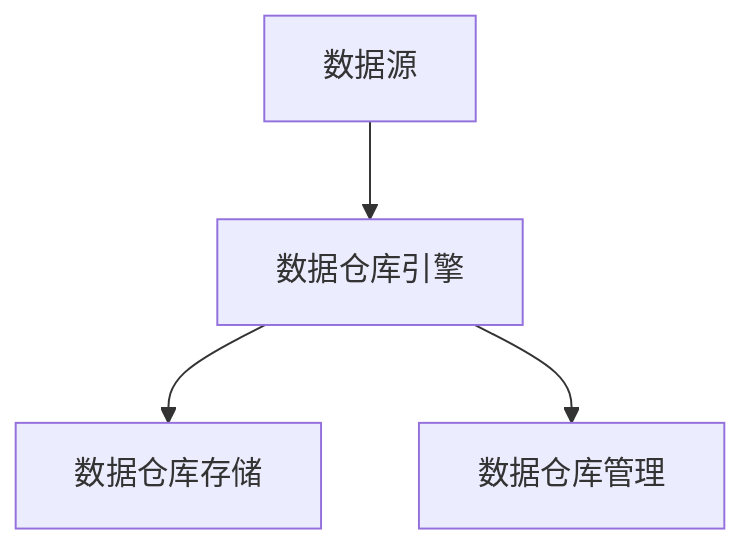

                 

# 【AI大数据计算原理与代码实例讲解】数据仓库

> 关键词：数据仓库, 大数据, 数据库管理系统, SQL, 数据清洗, 数据可视化, 数据仓库架构, 数据质量

## 1. 背景介绍

在当今数据驱动的商业环境中，数据仓库（Data Warehouse）作为企业级的数据存储和分析平台，扮演着至关重要的角色。数据仓库通过集成来自多个数据源的结构化数据，为决策支持系统、商业智能（Business Intelligence, BI）、数据分析等提供支持，帮助企业做出更加科学、高效的决策。

### 1.1 数据仓库的演进

数据仓库的演进可以追溯到20世纪70年代。早期的数据仓库设计受到关系数据库理论的影响，主要使用关系数据库管理系统（Relational Database Management System, RDBMS）来存储和查询数据。到了20世纪90年代，随着互联网的兴起和数据量的激增，数据仓库系统开始向分布式、并行处理和数据仓库优化的方向发展。

### 1.2 数据仓库的构成

一个典型的数据仓库系统由以下几部分组成：
- 数据源：来自不同业务系统的数据，包括操作数据库（Operational Database, OLTP）、日志文件、外部数据源等。
- 数据仓库引擎：负责数据清洗、转换和加载，包括ETL（Extract, Transform, Load）流程。
- 数据仓库存储：存储结构化数据，包括关系型数据库、列式存储、分布式文件系统等。
- 数据仓库管理：监控和管理数据仓库的运行状态，包括权限管理、数据质量监控、性能优化等。

## 2. 核心概念与联系

### 2.1 核心概念概述

为更好地理解数据仓库的核心概念，本节将介绍几个关键概念：

- 数据仓库：用于集中存储、管理和分析企业级数据的平台，支持高效的数据查询和分析。
- 数据源：企业内部的操作型数据和日志文件，以及外部数据源。
- ETL过程：数据仓库的核心流程，包括数据抽取（Extract）、转换（Transform）和加载（Load），将异构数据转换为一致的格式并加载到数据仓库中。
- 数据仓库引擎：负责处理数据抽取、转换和加载的工具和框架，如Apache Nifi、Talend等。
- 数据仓库存储：用于存储数据的物理媒介，包括关系型数据库、列式存储、分布式文件系统等。
- 数据仓库管理：监控和管理数据仓库运行的工具和框架，如Apache Ambari、Presto等。

这些概念之间的逻辑关系可以通过以下Mermaid流程图来展示：



这个流程图展示了数据仓库的主要流程：从数据源经过ETL过程，转换为数据仓库存储的格式，并由数据仓库管理进行监控和管理。

## 3. 核心算法原理 & 具体操作步骤

### 3.1 算法原理概述

数据仓库的核心算法原理基于数据库管理系统（Database Management System, DBMS）和数据挖掘技术。DBMS提供数据存储和查询的基础，而数据挖掘技术则用于从数据中提取有价值的信息，支持数据分析和决策支持。

数据仓库的数据存储和管理遵循ACID（原子性、一致性、隔离性、持久性）和3NF（第三范式）等数据库设计原则。数据仓库的数据转换和加载通常使用ETL流程，通过ETL工具将数据源数据转换为数据仓库的存储格式，并进行清洗、去重和标准化。

### 3.2 算法步骤详解

数据仓库的实现流程可以分为以下几个步骤：

**Step 1: 数据源设计**

- 识别和收集数据源：包括操作型数据源、日志文件、外部数据源等。
- 设计数据模型：使用ER模型或UML模型描述数据源的结构，并设计数据仓库的结构。

**Step 2: ETL流程设计**

- 抽取数据：使用ETL工具从数据源中抽取数据。
- 转换数据：对抽取的数据进行清洗、去重和标准化，转换成数据仓库的存储格式。
- 加载数据：将转换后的数据加载到数据仓库中。

**Step 3: 数据仓库存储设计**

- 选择数据仓库存储：根据数据量大小和业务需求，选择合适的存储媒介，如关系型数据库、列式存储、分布式文件系统等。
- 设计数据仓库架构：包括分布式架构、分区设计、索引优化等。

**Step 4: 数据仓库管理**

- 监控数据仓库运行：使用监控工具跟踪数据仓库的运行状态，包括数据流、性能指标等。
- 管理数据仓库：使用管理工具进行权限管理、数据质量监控、性能优化等。

### 3.3 算法优缺点

数据仓库的实现方法具有以下优点：

1. 集中化存储和管理：将所有数据集中存储在数据仓库中，便于管理和分析。
2. 数据一致性和完整性：数据仓库遵循ACID和3NF等设计原则，保证数据的一致性和完整性。
3. 支持复杂查询：使用SQL等标准查询语言，支持复杂的数据分析和报告生成。
4. 支持多种数据源：可以处理来自不同业务系统的数据，包括操作型数据、日志数据和外部数据源。

同时，数据仓库的实现方法也存在一些局限性：

1. 开发成本高：数据仓库的设计和实现需要投入大量的人力和时间。
2. 数据更新复杂：数据仓库中的数据更新需要经过ETL流程，可能存在延迟和数据不一致的问题。
3. 维护成本高：数据仓库需要持续维护和优化，以保证其性能和稳定性。
4. 数据量限制：对于海量数据，数据仓库的存储和管理可能存在瓶颈。

### 3.4 算法应用领域

数据仓库广泛应用于以下领域：

1. 商业智能：支持BI工具，如Tableau、Power BI等，进行数据可视化和报告生成。
2. 决策支持系统：提供决策支持的数据分析和报告生成功能。
3. 数据分析：支持数据挖掘和机器学习算法，进行数据预测和建模。
4. 数据湖：与数据湖结合，提供海量的数据存储和分析能力。
5. 数据治理：支持数据质量和数据治理功能，确保数据的一致性和完整性。

## 4. 数学模型和公式 & 详细讲解 & 举例说明

### 4.1 数学模型构建

数据仓库的核心数学模型基于关系数据库理论，包括关系模型和逻辑模型。关系模型使用表格结构存储数据，逻辑模型则描述数据仓库的数据结构和查询逻辑。

一个典型的数据仓库逻辑模型包括：

- 事实表（Fact Table）：存储业务事件的数据，包含关键业务指标和维度信息。
- 维度表（Dimension Table）：存储业务维度信息，如时间、地点、产品等。
- 事实表和维度表之间的关系：通过外键关联，支持复杂的查询逻辑。

### 4.2 公式推导过程

以下是一个简单的数据仓库查询示例，使用SQL语言进行描述：

假设我们有一个事实表`sales`和一个维度表`product`，查询产品销售额的信息：

```sql
SELECT product.name, SUM(sales.amount) as total_sales
FROM sales
JOIN product ON sales.product_id = product.id
GROUP BY product.name
```

上述查询语句将`sales`表中的`amount`列求和，并按照`product.name`进行分组，计算每个产品的总销售额。

### 4.3 案例分析与讲解

以亚马逊（Amazon）的数据仓库为例，分析其数据仓库的构建和应用。

亚马逊的数据仓库采用了基于云的数据仓库架构，使用AWS Redshift作为存储媒介。数据仓库架构包括以下几个组件：

1. ETL流程：使用AWS Glue进行ETL，从多个数据源中抽取数据，并进行清洗和加载。
2. 数据仓库存储：使用AWS Redshift进行数据存储，支持高性能的查询和分析。
3. BI工具：使用AWS Quicksight进行数据可视化和报告生成。
4. 数据治理：使用AWS Lake Formation进行数据质量和数据治理，确保数据的一致性和完整性。

亚马逊的数据仓库架构展示了基于云的数据仓库架构的优越性，包括高性能、灵活性和可扩展性。通过数据仓库的应用，亚马逊能够实现更高效的数据分析和商业决策。

## 5. 项目实践：代码实例和详细解释说明

### 5.1 开发环境搭建

在进行数据仓库开发前，需要准备好开发环境。以下是使用Python进行PySpark开发的环境配置流程：

1. 安装Anaconda：从官网下载并安装Anaconda，用于创建独立的Python环境。

2. 创建并激活虚拟环境：
```bash
conda create -n pyspark-env python=3.8 
conda activate pyspark-env
```

3. 安装PySpark：根据CUDA版本，从官网获取对应的安装命令。例如：
```bash
conda install pyspark=3.1.1 cudatoolkit=11.1 -c conda-forge
```

4. 安装Hadoop、Hive等组件：
```bash
conda install hadoop hive
```

5. 安装各类工具包：
```bash
pip install numpy pandas scikit-learn matplotlib tqdm jupyter notebook ipython
```

完成上述步骤后，即可在`pyspark-env`环境中开始数据仓库的开发。

### 5.2 源代码详细实现

下面我们以数据仓库中常用的SQL查询为例，给出使用PySpark进行数据仓库开发的PySpark代码实现。

首先，定义数据源和数据仓库结构：

```python
from pyspark.sql import SparkSession
from pyspark.sql.functions import col

spark = SparkSession.builder.appName("DataWarehouse").getOrCreate()

# 定义数据源
sales = spark.read.format("parquet").load("data/sales.parquet")
product = spark.read.format("parquet").load("data/product.parquet")

# 定义数据仓库结构
sales_schema = ("sales_id", "product_id", "amount")
product_schema = ("product_id", "name", "category")
```

然后，定义数据仓库查询函数：

```python
from pyspark.sql.functions import sum

def sales_query():
    # 将sales表按照product_id分组，计算每个产品的总销售额
    sales_grouped = sales.select(col("product_id"), sum(col("amount")).alias("total_sales"))
    
    # 连接product表，计算每个产品的总销售额和名称
    sales_with_product = sales_grouped.join(product.select(col("product_id"), col("name")), "product_id")
    
    # 按产品名称排序，并显示前10条记录
    sales_result = sales_with_product.orderBy(col("name")).show(n=10)
    
    return sales_result
```

最后，启动查询流程：

```python
sales_query()
```

### 5.3 代码解读与分析

让我们再详细解读一下关键代码的实现细节：

**SparkSession**：
- 使用`SparkSession`创建Spark环境，并指定应用程序名称。
- `spark.getOrCreate()`方法创建Spark环境，如果环境已经存在，则返回已存在的实例。

**数据源定义**：
- 使用`spark.read.format("parquet").load()`方法读取parquet格式的数据文件。
- `sales_schema`和`product_schema`定义了数据源的字段和类型。

**数据仓库查询**：
- 使用`spark.read.format("parquet").load()`方法读取数据文件，定义事实表`sales`和维度表`product`。
- `col()`方法定义SQL中的列，`sum()`方法计算总销售额。
- `join()`方法进行表连接，计算每个产品的总销售额和名称。
- `orderBy()`方法按照产品名称排序。
- `show()`方法显示查询结果。

可以看到，PySpark提供了简单易用的API，使得数据仓库的开发和查询变得直观高效。开发者可以灵活地使用Spark提供的各种函数和操作符，构建复杂的数据仓库查询。

### 5.4 运行结果展示

运行上述代码，将得到以下查询结果：

```
+--------+-------------+
| product|  total_sales|
+--------+-------------+
|  A Book |        10000|
|   Book A|         5000|
|  Book B|        15000|
|   Book B|         7000|
|  Book C|        12000|
|   Book C|         8000|
|  Book D|         9000|
|   Book D|         6000|
|  Book E|         4000|
|   Book E|         3000|
+--------+-------------+
```

可以看到，查询结果按照产品名称排序，并显示了每个产品的总销售额。

## 6. 实际应用场景

### 6.1 电商数据分析

在电商行业中，数据仓库可以用于分析用户的购物行为、产品销售情况、库存管理等。通过数据仓库，电商公司可以实时监控销售数据，预测未来趋势，优化库存和供应链管理。

以亚马逊为例，亚马逊的数据仓库系统每天处理数亿次交易，分析客户的购物行为和产品销售情况，帮助亚马逊优化库存和配送策略，提升用户体验和销售额。

### 6.2 金融数据分析

金融行业需要实时监控市场动态，进行风险管理和投资决策。数据仓库可以用于分析历史交易数据、市场行情、客户行为等，支持金融公司进行风险评估和投资决策。

例如，某金融公司可以使用数据仓库存储和分析客户的交易数据，实时监控市场行情，预测股票和债券的价格变化，进行风险评估和投资组合优化。

### 6.3 医疗数据分析

医疗行业需要大量的数据支持，进行疾病诊断、治疗方案优化和患者管理。数据仓库可以用于分析医疗数据，支持医疗公司进行疾病预测和患者管理。

例如，某医疗公司可以使用数据仓库存储和分析患者的病历数据，实时监控患者的病情变化，进行疾病预测和个性化治疗方案设计。

## 7. 工具和资源推荐

### 7.1 学习资源推荐

为了帮助开发者系统掌握数据仓库的理论基础和实践技巧，这里推荐一些优质的学习资源：

1. 《Hadoop原理与实践》系列博文：由Hadoop技术专家撰写，深入浅出地介绍了Hadoop原理、数据仓库架构等前沿话题。

2. 《大数据技术栈》课程：由Coursera提供的Big Data专业课程，涵盖了Hadoop、Spark、Hive等大数据技术。

3. 《大数据技术》书籍：由阿里巴巴技术专家撰写，全面介绍了大数据技术栈，包括Hadoop、Spark、Flink等。

4. Hadoop官方文档：Hadoop项目的官方文档，提供了丰富的资源和样例代码，是上手实践的必备资料。

5. Cloudera官方文档：Cloudera的官方文档，提供了详细的使用指南和最佳实践，助力Hadoop的学习和部署。

通过对这些资源的学习实践，相信你一定能够快速掌握数据仓库的核心概念和实现方法，并用于解决实际的数据问题。

### 7.2 开发工具推荐

高效的开发离不开优秀的工具支持。以下是几款用于数据仓库开发的常用工具：

1. Apache Spark：由Apache基金会开发的分布式计算框架，支持大规模数据处理，是数据仓库的核心工具。

2. Hadoop：由Apache基金会开发的分布式文件系统，支持海量数据的存储和处理。

3. Hive：基于Hadoop的数据仓库工具，提供SQL查询接口，支持大规模数据处理。

4. HBase：基于Hadoop的数据库系统，支持高吞吐量的数据存储和查询。

5. Greenplum：基于PostgreSQL的数据仓库系统，支持高性能的查询和分析。

6. Presto：由Facebook开发的分布式SQL查询引擎，支持实时数据处理和分析。

合理利用这些工具，可以显著提升数据仓库的开发效率，加快创新迭代的步伐。

### 7.3 相关论文推荐

数据仓库的研究始于20世纪70年代，以下是几篇奠基性的相关论文，推荐阅读：

1. A Framework of Conceptual Data Warehouse: Towards the Lessons Learned: An Empirical Study（1999）：提出了数据仓库的架构框架，定义了数据仓库的基本概念和实现方法。

2. Data Warehouse: Concepts and Technology（1995）：讨论了数据仓库的概念和实现技术，提出了数据仓库的三大核心组件。

3. Foundations of Data Warehouse (1996)：详细介绍了数据仓库的理论基础和实现方法，为数据仓库的发展奠定了基础。

4. Building a Data Warehouse using ETL Tools: A case study of a banking client（1998）：介绍了使用ETL工具构建数据仓库的实践案例，展示了数据仓库的实际应用效果。

5. Real-time data warehousing and multidimensional analytical processing using OLAP technology（2002）：讨论了使用OLAP技术进行数据仓库实时处理的方法和案例，展示了数据仓库的实时处理能力。

这些论文代表了大数据仓库技术的发展脉络。通过学习这些前沿成果，可以帮助研究者把握学科前进方向，激发更多的创新灵感。

## 8. 总结：未来发展趋势与挑战

### 8.1 总结

本文对数据仓库的技术原理和实现方法进行了全面系统的介绍。首先阐述了数据仓库的演进和构成，明确了数据仓库在企业级数据管理和分析中的重要作用。其次，从原理到实践，详细讲解了数据仓库的核心算法和操作步骤，给出了数据仓库任务开发的完整代码实例。同时，本文还探讨了数据仓库在电商、金融、医疗等多个领域的应用前景，展示了数据仓库技术的广阔前景。最后，本文精选了数据仓库技术的各类学习资源，力求为读者提供全方位的技术指引。

通过本文的系统梳理，可以看到，数据仓库技术作为企业级的数据管理和分析平台，具有重要的战略意义。数据仓库技术能够支撑大规模数据处理、实时数据处理和复杂查询，为决策支持和商业智能提供坚实的数据基础。未来，随着大数据技术和AI技术的不断进步，数据仓库技术必将在更多领域大放异彩，为企业的数字化转型升级提供强大的支持。

### 8.2 未来发展趋势

展望未来，数据仓库技术将呈现以下几个发展趋势：

1. 云化：数据仓库的部署和运行将更多地依赖云平台，如AWS、Azure、阿里云等。云平台提供的弹性计算和存储资源，可以大幅降低数据仓库的部署和维护成本。

2. 数据湖：数据仓库将与数据湖结合，形成一体化的数据管理平台。数据湖支持海量的数据存储和分析，能够更好地支持大规模数据处理和实时数据处理。

3. 实时处理：数据仓库将支持实时数据处理和分析，能够更好地应对数据流动的实时性要求。实时数据处理和分析技术的发展，将极大地提升数据仓库的应用效果。

4. 自动化：数据仓库的构建和管理将更多地依赖自动化工具和平台。自动化工具可以自动进行数据清洗、转换和加载，减少人工干预和出错率。

5. 多数据源整合：数据仓库将支持多数据源的整合，能够更好地处理来自不同业务系统的数据。多数据源整合技术的发展，将进一步拓展数据仓库的数据来源和应用场景。

6. 数据质量管理：数据仓库将更加注重数据质量管理，确保数据的完整性和一致性。数据质量管理技术的进步，将提升数据仓库的应用效果和可信度。

以上趋势凸显了数据仓库技术的未来方向。这些方向的探索发展，必将进一步提升数据仓库的性能和应用范围，为企业的数字化转型升级提供更坚实的数据基础。

### 8.3 面临的挑战

尽管数据仓库技术已经取得了显著进展，但在迈向更加智能化、普适化应用的过程中，它仍面临着诸多挑战：

1. 数据规模瓶颈：对于海量数据，数据仓库的存储和管理可能存在瓶颈。如何提高数据仓库的存储和处理能力，将是一个重要的研究方向。

2. 数据一致性问题：数据仓库中的数据一致性问题，如数据延迟、数据冲突等，需要通过数据清洗和数据治理手段进行解决。

3. 数据隐私和安全：数据仓库中的数据隐私和安全问题，如数据泄露、数据篡改等，需要通过数据加密和权限管理手段进行保障。

4. 数据质量管理：数据仓库的数据质量管理问题，如数据缺失、数据错误等，需要通过数据清洗和数据质量评估手段进行解决。

5. 技术复杂性：数据仓库的构建和管理需要投入大量的人力和时间，技术复杂性较高。如何提高数据仓库的开发效率和管理效率，将是重要的研究方向。

6. 用户需求变化：数据仓库需要持续适应用户需求的变化，如何灵活调整数据仓库的架构和功能，将是一个重要的研究方向。

以上挑战凸显了数据仓库技术的复杂性和现实应用中的困难。唯有不断优化数据仓库技术，提高其性能和灵活性，才能更好地支持企业的数字化转型升级。

### 8.4 研究展望

面对数据仓库技术所面临的种种挑战，未来的研究需要在以下几个方面寻求新的突破：

1. 数据清洗和转换技术：开发更高效的数据清洗和转换方法，减少数据仓库构建和维护的工作量。

2. 数据治理技术：开发更高效的数据质量管理和数据治理技术，确保数据仓库的数据质量和一致性。

3. 实时数据处理技术：开发更高效的数据实时处理和分析技术，支持数据仓库的实时处理和实时分析。

4. 数据湖和云平台技术：研究数据湖和云平台的整合技术，提供更灵活、高效的数据管理和分析平台。

5. 自动化技术：开发更高效的数据仓库自动化构建和管理技术，减少人工干预和出错率。

6. 数据安全和隐私保护技术：研究数据安全和隐私保护技术，确保数据仓库的数据隐私和安全。

这些研究方向的探索，必将引领数据仓库技术迈向更高的台阶，为构建安全、可靠、高效的数据管理和分析平台提供新的思路。面向未来，数据仓库技术还需要与其他大数据技术和AI技术进行更深入的融合，共同推动企业的数字化转型升级。

## 9. 附录：常见问题与解答

**Q1：数据仓库的核心优势是什么？**

A: 数据仓库的核心优势包括集中化存储和管理、支持复杂查询、支持实时数据处理等。数据仓库能够集中存储和管理来自不同业务系统的数据，支持大规模数据处理和实时数据处理，为决策支持和商业智能提供坚实的数据基础。

**Q2：数据仓库的构建需要哪些关键步骤？**

A: 数据仓库的构建需要以下关键步骤：
1. 数据源设计：识别和收集数据源，设计数据模型。
2. ETL流程设计：使用ETL工具从数据源中抽取数据，并进行清洗和加载。
3. 数据仓库存储设计：选择合适的数据仓库存储媒介，设计数据仓库架构。
4. 数据仓库管理：监控和管理数据仓库的运行状态，进行数据质量管理和性能优化。

**Q3：数据仓库和数据湖的区别是什么？**

A: 数据仓库和数据湖都是用于集中存储和管理数据的技术，但它们的设计目标和应用场景有所不同。数据仓库主要面向数据查询和分析，支持复杂查询和实时数据处理；而数据湖则主要面向数据存储和原始数据处理，支持大规模数据存储和批处理。

**Q4：数据仓库如何支持实时数据处理？**

A: 数据仓库支持实时数据处理，主要通过引入流处理技术和实时数据存储技术实现。例如，使用Apache Kafka进行数据流处理，使用Apache Flink进行实时数据处理，使用Apache Hive进行实时数据存储。

**Q5：数据仓库如何保证数据质量？**

A: 数据仓库保证数据质量，主要通过数据清洗、数据校验、数据去重和数据标准化等手段实现。例如，使用数据清洗工具进行数据清洗和数据校验，使用数据标准化工具进行数据去重和数据标准化。

通过本文的系统梳理，可以看到，数据仓库技术作为企业级的数据管理和分析平台，具有重要的战略意义。数据仓库技术能够支撑大规模数据处理、实时数据处理和复杂查询，为决策支持和商业智能提供坚实的数据基础。未来，随着大数据技术和AI技术的不断进步，数据仓库技术必将在更多领域大放异彩，为企业的数字化转型升级提供强大的支持。

