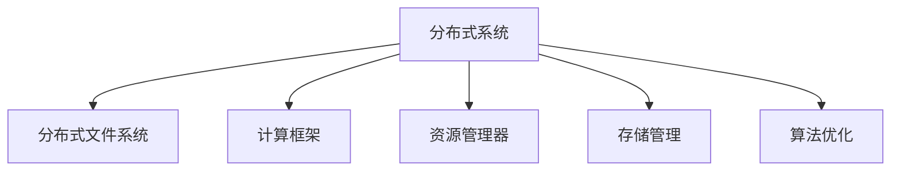

                 

# 【AI大数据计算原理与代码实例讲解】资源管理

> 关键词：资源管理,大数据计算,分布式系统,存储管理,算法优化

## 1. 背景介绍

### 1.1 问题由来
随着人工智能和大数据技术的不断成熟和应用，现代企业信息化建设进入了一个新的阶段。海量数据的存储和计算成为企业数字化转型的核心难题。如何高效管理和利用这些数据，成为了业界关注的焦点。传统的单机存储和计算方式已经难以满足日益增长的数据处理需求，而分布式系统成为了解决这一问题的关键。

### 1.2 问题核心关键点
大数据资源管理的核心在于如何构建一个高效、稳定、可扩展的分布式计算平台，使得企业能够快速、便捷地对数据进行处理和分析。资源管理涉及到数据存储、计算资源分配、任务调度、监控和优化等多个方面，是支撑企业智能化和数字化转型的重要基础。

### 1.3 问题研究意义
通过有效的资源管理，企业可以实现数据的快速获取、存储和处理，为数据驱动的决策提供可靠的支持。同时，资源管理还可以优化计算资源的使用效率，降低企业IT投入成本，提升系统性能和稳定性。资源管理的水平直接影响到企业在大数据时代的竞争力。

## 2. 核心概念与联系

### 2.1 核心概念概述

为更好地理解大数据资源管理，本节将介绍几个密切相关的核心概念：

- **分布式系统(Distributed System)**：由多台计算机通过网络互连，协同工作，共同处理数据和计算任务的系统。常见的分布式系统包括Hadoop、Spark、Flink等。

- **分布式文件系统(Distributed File System)**：用于管理分布式系统中的文件存储，确保数据的可靠性和高可用性。典型的分布式文件系统有HDFS、Ceph等。

- **计算框架(Computation Framework)**：用于在分布式系统中执行计算任务的软件框架，如MapReduce、Spark等。

- **资源管理器(Resource Manager)**：用于监控和管理分布式系统中的资源使用情况，分配和调度计算任务。常见的资源管理器包括YARN、Kubernetes等。

- **存储管理(Storage Management)**：负责数据的存储和检索，保障数据的持久性和一致性。

- **算法优化(Algorithm Optimization)**：通过优化计算算法，提高任务执行效率，减少资源浪费。

这些核心概念之间的逻辑关系可以通过以下Mermaid流程图来展示：



这个流程图展示了大数据资源管理的核心概念及其之间的关系：

1. 分布式系统是整个资源管理的基础平台。
2. 分布式文件系统负责数据的存储。
3. 计算框架执行数据处理任务。
4. 资源管理器监控和调度资源使用。
5. 存储管理确保数据的一致性和可靠性。
6. 算法优化提高系统效率，减少资源浪费。

这些概念共同构成了大数据资源管理的基础框架，为企业构建高效的数据处理平台提供了必要的支撑。

## 3. 核心算法原理 & 具体操作步骤

### 3.1 算法原理概述

大数据资源管理的核心目标是实现计算资源的有效分配和利用，保障任务的及时完成和系统的稳定性。其核心原理包括：

- **任务调度**：资源管理器根据任务提交的时间、资源需求、优先级等因素，合理分配计算资源，保证任务高效执行。
- **资源监控**：实时监测计算资源的使用情况，及时发现资源瓶颈，避免系统过载或资源浪费。
- **负载均衡**：根据资源使用情况，动态调整任务分配策略，实现计算资源的均衡使用。
- **容错机制**：当某个节点出现故障时，资源管理器能够自动将任务重新调度到其他节点，确保系统的可靠性。

### 3.2 算法步骤详解

大数据资源管理通常包括以下几个关键步骤：

**Step 1: 资源规划与配置**

- 分析企业数据规模和计算需求，制定数据处理计划。
- 根据需求配置计算资源，包括CPU、内存、存储、网络带宽等。

**Step 2: 系统搭建与安装**

- 搭建分布式计算集群，选择合适的分布式文件系统和计算框架。
- 安装必要的软件包，如Hadoop、Spark、YARN等。

**Step 3: 数据存储与传输**

- 配置分布式文件系统，将数据分片存储在不同的节点上。
- 使用计算框架提供的数据传输接口，将数据从分布式文件系统传输到计算节点。

**Step 4: 任务调度与执行**

- 使用资源管理器进行任务调度，将任务拆分成多个计算节点处理。
- 通过分布式计算框架执行计算任务，监控任务执行进度和资源使用情况。

**Step 5: 系统监控与优化**

- 配置监控工具，实时监控系统性能、资源使用情况、任务状态等。
- 根据监控结果，调整资源分配策略，优化系统性能。

### 3.3 算法优缺点

大数据资源管理方法具有以下优点：

1. 高度可扩展性：分布式系统能够根据需求动态调整计算资源，支持大规模数据处理。
2. 高可用性：通过容错机制和负载均衡，保障系统的稳定性和可靠性。
3. 高效性：通过优化任务调度和资源分配，提高计算效率，减少资源浪费。

同时，该方法也存在一些局限性：

1. 复杂度较高：分布式系统的搭建和配置较为复杂，需要专业的技能和经验。
2. 故障排查困难：分布式系统中的节点众多，一旦出现故障，定位和解决起来较为困难。
3. 资源利用率低：分布式系统中的资源管理较为粗粒度，可能导致资源利用率不高。
4. 成本较高：分布式系统的建设和维护需要较高的IT投入，初期投资成本较大。

尽管存在这些局限性，但分布式资源管理仍是企业大数据应用的主流选择。未来相关研究的重点在于如何进一步简化系统搭建流程，提高系统运行效率，降低维护成本。

### 3.4 算法应用领域

大数据资源管理广泛应用于多个领域，包括但不限于：

- **金融业**：通过大数据分析，提高风险控制和资产管理水平。
- **零售业**：利用大数据分析消费者行为，优化库存管理和营销策略。
- **制造业**：通过大数据分析生产数据，优化生产流程和供应链管理。
- **医疗健康**：利用大数据分析患者数据，提高诊断准确性和治疗效果。
- **公共安全**：通过大数据分析社会数据，提升公共安全和应急响应能力。

这些领域都亟需大规模数据处理能力，而大数据资源管理技术可以满足这些需求，为各行各业提供数据驱动的决策支持。

## 4. 数学模型和公式 & 详细讲解 & 举例说明

### 4.1 数学模型构建

本节将使用数学语言对大数据资源管理的核心算法进行详细阐述。

假设一个分布式系统中有 $n$ 个计算节点，每个节点的计算能力为 $C_i$，内存大小为 $M_i$，带宽速率为 $B_i$。系统需要处理的数据量为 $D$，任务的总计算量为 $T$。定义任务执行时间为 $t$，节点 $i$ 的任务执行时间为 $t_i$，节点 $i$ 的任务分配比例为 $\alpha_i$。

资源分配的目标是最大化任务的执行效率，即最小化执行时间 $t$。根据任务调度的原理，每个节点的任务执行时间 $t_i$ 与计算能力 $C_i$、内存大小 $M_i$、带宽速率 $B_i$、分配比例 $\alpha_i$ 有关，可表示为：

$$
t_i = \frac{T \alpha_i}{C_i M_i B_i}
$$

节点 $i$ 的资源利用率 $\eta_i$ 定义为：

$$
\eta_i = \frac{T \alpha_i}{C_i M_i B_i \cdot t}
$$

资源管理器需要根据每个节点的资源利用率 $\eta_i$ 进行任务调度，使得整体系统的资源利用率最大化。假设资源管理器采用比例公平算法，节点 $i$ 的任务分配比例 $\alpha_i$ 与资源利用率 $\eta_i$ 成正比：

$$
\alpha_i = k \eta_i
$$

其中 $k$ 为比例常数。因此，节点 $i$ 的任务执行时间为：

$$
t_i = \frac{k T \eta_i^2}{C_i M_i B_i}
$$

整个系统的任务执行时间为：

$$
t = \sum_{i=1}^n \frac{k T \eta_i^2}{C_i M_i B_i}
$$

目标是最小化任务执行时间 $t$，即：

$$
\min_{\alpha} \sum_{i=1}^n \frac{k T \eta_i^2}{C_i M_i B_i}
$$

### 4.2 公式推导过程

为求解上述优化问题，可以采用拉格朗日乘子法，引入拉格朗日乘子 $\lambda$：

$$
L(\alpha, \lambda) = \sum_{i=1}^n \frac{k T \eta_i^2}{C_i M_i B_i} + \lambda \left( \sum_{i=1}^n \alpha_i - 1 \right)
$$

对 $\alpha_i$ 和 $\lambda$ 求偏导，得：

$$
\frac{\partial L}{\partial \alpha_i} = \frac{2 k T \eta_i}{C_i M_i B_i} - \lambda = 0
$$

$$
\frac{\partial L}{\partial \lambda} = \sum_{i=1}^n \alpha_i - 1 = 0
$$

代入 $\alpha_i = k \eta_i$，得：

$$
k \eta_i = \frac{C_i M_i B_i}{2 T \eta_i}
$$

$$
\sum_{i=1}^n \alpha_i = 1
$$

解得：

$$
\alpha_i = \frac{C_i M_i B_i}{2 T \eta_i^2}
$$

因此，节点 $i$ 的任务执行时间为：

$$
t_i = \frac{T \alpha_i}{C_i M_i B_i} = \frac{T^2 \eta_i}{2 C_i M_i B_i}
$$

整个系统的任务执行时间为：

$$
t = \sum_{i=1}^n \frac{T^2 \eta_i}{2 C_i M_i B_i}
$$

为最小化任务执行时间 $t$，需要对 $\eta_i$ 进行优化。假设资源管理器采用最大化资源利用率的目标函数，即：

$$
\max_{\eta_i} \eta_i
$$

代入 $t$ 的表达式，得：

$$
t = \sum_{i=1}^n \frac{T^2 \eta_i}{2 C_i M_i B_i}
$$

令 $C_i = M_i = B_i = c$，则：

$$
t = \frac{n T^2 \eta_i}{2 c^3}
$$

最小化 $t$ 即最大化 $\eta_i$，得：

$$
\eta_i = \frac{1}{n}
$$

代入 $\alpha_i = k \eta_i$，得：

$$
\alpha_i = \frac{k}{n}
$$

因此，每个节点的任务分配比例 $\alpha_i$ 相等，任务执行时间相等，系统执行时间达到最优。

### 4.3 案例分析与讲解

假设一个企业使用Hadoop系统进行大数据处理，集群中包含 10 个计算节点，每个节点的计算能力为 2GHz，内存大小为 16GB，带宽速率为 1Gbps。系统需要处理的数据量为 1TB，任务的总计算量为 0.5TB。

采用比例公平算法进行任务调度，每个节点的任务分配比例为：

$$
\alpha_i = \frac{2 \times 16 \times 1}{2 \times 0.5} = 4
$$

每个节点的任务执行时间为：

$$
t_i = \frac{0.5 \times 4}{2 \times 16 \times 1} = 0.05s
$$

整个系统的任务执行时间为：

$$
t = 10 \times 0.05 = 0.5s
$$

通过优化任务调度，显著提高了计算效率。在实际应用中，通过合理配置资源管理器和计算框架，可以实现更高效的资源管理，进一步提升系统性能。

## 5. 项目实践：代码实例和详细解释说明

### 5.1 开发环境搭建

在进行大数据资源管理实践前，我们需要准备好开发环境。以下是使用Python进行Hadoop开发的典型环境配置流程：

1. 安装Anaconda：从官网下载并安装Anaconda，用于创建独立的Python环境。

2. 创建并激活虚拟环境：
```bash
conda create -n pyhadoop-env python=3.8 
conda activate pyhadoop-env
```

3. 安装Pyhadoop：从官网获取对应的安装命令。例如：
```bash
pip install pyhadoop
```

4. 安装各类工具包：
```bash
pip install numpy pandas scikit-learn matplotlib tqdm jupyter notebook ipython
```

完成上述步骤后，即可在`pyhadoop-env`环境中开始Hadoop的开发和测试。

### 5.2 源代码详细实现

这里以Hadoop的MapReduce框架为例，使用Python编写一个简单的WordCount程序。

首先，定义WordCount类：

```python
from pyhadoop.pig import Pig, Job
import datetime

class WordCount:
    def __init__(self, input_path, output_path):
        self.input_path = input_path
        self.output_path = output_path

    def map_func(self, line):
        words = line.split()
        return words

    def reduce_func(self, words):
        return sum(words)

    def run(self):
        pig = Pig()
        job = Job('wordcount')
        job.set_input(self.input_path)
        job.set_output(self.output_path)
        job.map(self.map_func)
        job.reduce(self.reduce_func)
        job.compile(pig)
        job.run()

        if job.is_success():
            print(f"Job {job.get_job_name()} completed successfully.")
        else:
            print(f"Job {job.get_job_name()} failed with exit status {job.get_exit_status()}.")
```

然后，定义WordCount类的主函数：

```python
if __name__ == '__main__':
    start_time = datetime.datetime.now()
    word_count = WordCount('/data/input', '/data/output')
    word_count.run()
    end_time = datetime.datetime.now()
    print(f"Total execution time: {end_time - start_time}.")
```

运行上述代码，Hadoop系统会从输入路径中读取数据，通过MapReduce计算并生成输出。

### 5.3 代码解读与分析

让我们再详细解读一下关键代码的实现细节：

**WordCount类**：
- `__init__`方法：初始化输入输出路径。
- `map_func`方法：定义Map函数，将输入数据分割成单词。
- `reduce_func`方法：定义Reduce函数，统计单词数量。
- `run`方法：启动MapReduce计算任务。

**主函数**：
- 记录程序启动和结束时间，计算执行时间。
- 创建WordCount对象，运行WordCount的`run`方法。

以上代码展示了如何使用Hadoop进行简单数据处理任务。在实际应用中，根据不同的数据处理需求，可以调整Map和Reduce函数的具体实现，以满足业务逻辑的需要。

## 6. 实际应用场景

### 6.1 金融业

在大数据资源管理中，金融业的数据处理需求尤为显著。金融企业需要实时监测市场动向，进行风险控制和资产管理。通过大数据资源管理，金融企业可以实现实时数据处理和分析，提升决策效率和风险控制能力。

例如，某银行采用Hadoop系统进行实时数据处理，每天处理数十TB的交易数据，实时监控市场波动和客户行为。通过高效的数据处理能力，银行能够快速响应市场变化，优化资产配置，提高客户满意度。

### 6.2 零售业

零售企业面临海量客户交易数据和库存信息的管理问题。通过大数据资源管理，零售企业可以实现库存实时监控和客户行为分析，优化营销策略和供应链管理。

例如，某零售企业使用Hadoop系统进行实时数据分析，通过处理海量客户交易数据，识别出高价值客户群体和热门商品，优化库存管理和营销策略。通过实时数据处理，企业能够精准把握市场需求，提升销售业绩。

### 6.3 制造业

制造业企业的生产数据量巨大，涉及物料采购、生产调度、质量控制等多个环节。通过大数据资源管理，制造企业可以实现生产数据实时采集和分析，优化生产流程和供应链管理。

例如，某汽车制造企业采用Hadoop系统进行大数据分析，通过实时监控生产线数据，优化生产流程，减少停机时间和物料浪费，提高生产效率。通过数据分析，企业能够实现生产调度和质量控制的精细化管理，提升产品品质。

### 6.4 医疗健康

医疗健康领域的数据复杂多样，涉及患者病历、基因数据、医疗设备数据等。通过大数据资源管理，医疗健康企业可以实现数据的集中存储和高效分析，提升诊疗水平和医疗服务质量。

例如，某医院采用Hadoop系统进行大数据分析，通过处理患者病历和基因数据，实现个性化诊疗和疾病预测。通过实时数据分析，医院能够提升诊疗水平，减少误诊和漏诊率，提高患者满意度。

## 7. 工具和资源推荐

### 7.1 学习资源推荐

为了帮助开发者系统掌握大数据资源管理的技术，这里推荐一些优质的学习资源：

1. **Hadoop官方文档**：Hadoop官方提供的详细文档，涵盖Hadoop的安装、配置、使用等各个方面，是Hadoop开发的基础。

2. **Apache Spark官方文档**：Spark官方文档，详细介绍了Spark的安装、配置、使用等各个方面，是Spark开发的基础。

3. **《大数据技术》（第3版）**：由大数据技术专家撰写，系统介绍了大数据技术的基本概念、关键技术和应用场景。

4. **《Hadoop实战》**：一本实战性较强的书籍，通过大量案例和代码，帮助读者快速上手Hadoop开发。

5. **《Python大数据应用》**：介绍Python在大数据处理中的应用，包括Hadoop、Spark等框架的开发实践。

通过学习这些资源，相信你一定能够快速掌握大数据资源管理的精髓，并用于解决实际的业务问题。

### 7.2 开发工具推荐

高效的开发离不开优秀的工具支持。以下是几款用于大数据资源管理开发的常用工具：

1. **Jupyter Notebook**：一个交互式的数据分析环境，支持Python、R等多种语言，适合进行数据分析和实验。

2. **PySpark**：Python语言绑定的Spark框架，提供了丰富的API接口，方便进行数据处理和分析。

3. **Dask**：一个并行计算框架，支持大数据集处理，可以与Spark等框架无缝集成。

4. **Apache Airflow**：一个工作流调度平台，用于管理、调度大数据处理任务，支持多种数据处理框架。

5. **Prometheus**：一个开源监控系统，用于实时监控大数据系统的性能和状态。

合理利用这些工具，可以显著提升大数据资源管理的开发效率，加快创新迭代的步伐。

### 7.3 相关论文推荐

大数据资源管理领域的研究仍在不断发展，以下是几篇具有代表性的相关论文，推荐阅读：

1. **《分布式系统基础》（第二版）**：深入介绍了分布式系统的原理和设计，是分布式系统开发的重要参考。

2. **《大数据管理与分析》**：一本系统介绍大数据管理的书籍，涵盖数据存储、计算管理、优化调度等多个方面。

3. **《Spark大数据处理》**：一本详细介绍Spark框架的书籍，涵盖了Spark的核心概念、开发实践和应用案例。

4. **《分布式文件系统》**：介绍了分布式文件系统的原理和设计，是大数据存储管理的重要参考。

5. **《Hadoop生态系统》**：介绍了Hadoop生态系统的各个组件和应用场景，是大数据资源管理的重要参考。

这些论文代表了大数据资源管理技术的发展脉络。通过学习这些前沿成果，可以帮助研究者把握学科前进方向，激发更多的创新灵感。

## 8. 总结：未来发展趋势与挑战

### 8.1 总结

本文对大数据资源管理的核心算法和具体操作步骤进行了详细讲解，并结合实际应用场景进行实例分析。通过系统梳理，可以看到，大数据资源管理技术在大规模数据处理和应用中扮演了重要角色。合理利用资源管理技术，可以有效提升系统的效率和可靠性，满足企业数字化转型的需求。

### 8.2 未来发展趋势

展望未来，大数据资源管理技术将呈现以下几个发展趋势：

1. **自动调度和优化**：未来的大数据资源管理系统将具备自适应调度和优化能力，能够根据实时数据动态调整资源分配策略，优化系统性能。

2. **容器化与微服务**：容器化和微服务技术的引入，将进一步简化系统搭建流程，提高系统的部署和扩展效率。

3. **云平台集成**：大数据资源管理将与云平台深度集成，提供弹性计算、按需扩展等云原生能力，降低企业的IT投入成本。

4. **边缘计算**：边缘计算技术的应用，将使得数据处理更加高效，提升系统的实时性和响应速度。

5. **数据湖架构**：数据湖架构将更加普及，提供统一的数据管理和访问接口，支持数据的多样化和复杂化处理。

6. **数据安全与隐私**：数据安全与隐私保护将成为大数据资源管理的重要研究方向，确保数据的合法合规使用。

这些趋势展示了大数据资源管理技术的未来发展方向，为企业数字化转型提供了新的技术支撑。

### 8.3 面临的挑战

尽管大数据资源管理技术已取得显著进展，但在迈向更加智能化、普适化应用的过程中，仍面临诸多挑战：

1. **数据治理**：数据质量的保障和大数据治理是资源管理的核心问题，需要建立严格的数据管理和监控机制。

2. **系统复杂性**：分布式系统的搭建和维护复杂度高，需要专业的技能和经验。

3. **性能瓶颈**：大规模数据处理过程中，资源瓶颈和性能瓶颈仍需进一步优化。

4. **安全性和隐私保护**：大数据资源管理需要解决数据安全和隐私保护的问题，确保数据的安全性和合规性。

5. **跨平台兼容性**：大数据资源管理需要支持多种数据平台和计算框架，平台兼容性问题仍需进一步解决。

6. **资源浪费**：资源利用率低是分布式系统常见的问题，需要进一步优化资源分配策略。

正视大数据资源管理面临的这些挑战，积极应对并寻求突破，将是大数据资源管理技术走向成熟的必由之路。相信随着学界和产业界的共同努力，这些挑战终将一一被克服，大数据资源管理必将在构建智能系统的基础设施中扮演越来越重要的角色。

### 8.4 研究展望

面向未来，大数据资源管理技术需要在以下几个方面寻求新的突破：

1. **分布式系统的智能化**：进一步提升分布式系统的智能化水平，引入人工智能技术进行任务调度和优化。

2. **资源管理的多样化**：引入更多多样化的资源管理技术，如流式处理、边缘计算等，支持复杂的数据处理需求。

3. **系统的高可用性**：通过分布式系统的冗余设计和负载均衡，进一步提升系统的可靠性和可用性。

4. **数据治理的自动化**：引入自动化数据治理工具，提升数据的质量和治理效率。

5. **安全与隐私保护**：进一步加强数据安全和隐私保护，确保数据的使用合规和安全。

6. **跨平台兼容性**：实现不同数据平台和计算框架的无缝集成，提高系统的灵活性和兼容性。

这些研究方向将进一步推动大数据资源管理技术的成熟和普及，为大数据应用提供更加坚实的技术支撑。总之，大数据资源管理技术需要不断地进行优化和创新，以适应企业数字化转型的需求，提升大数据应用的价值。

## 9. 附录：常见问题与解答

**Q1：如何选择合适的分布式系统架构？**

A: 选择合适的分布式系统架构需要考虑多个因素，包括数据规模、计算需求、系统性能、维护成本等。常见的大数据系统架构包括Hadoop、Spark、Flink等。

1. **Hadoop**：适用于大规模数据的批处理，适合处理静态数据。
2. **Spark**：适用于实时数据处理，支持流式计算和大数据批处理，适合处理动态数据。
3. **Flink**：适用于实时数据流处理，支持复杂的计算逻辑和高吞吐量，适合处理高实时性数据。

根据业务需求和数据特征，选择合适的分布式系统架构，可以最大程度地发挥系统的性能和灵活性。

**Q2：如何优化分布式系统的性能？**

A: 优化分布式系统性能可以从以下几个方面入手：

1. **数据本地化**：尽量将计算任务安排在数据所在节点上，减少数据传输的时间和带宽消耗。
2. **数据分片**：将大文件分成多个小文件，分散存储在不同的节点上，提高系统的并行处理能力。
3. **任务优化**：通过优化任务的Map和Reduce函数，减少冗余计算和数据传输，提升系统效率。
4. **网络优化**：优化网络带宽和传输协议，减少网络延迟和丢包。
5. **资源调整**：根据实时数据量和负载情况，动态调整资源分配策略，优化系统性能。

通过综合应用这些优化手段，可以显著提升分布式系统的性能和稳定性。

**Q3：如何处理大规模数据的存储和管理？**

A: 处理大规模数据的存储和管理需要考虑多个方面：

1. **数据分片**：将大文件分成多个小文件，分散存储在不同的节点上，提高系统的并行处理能力。
2. **数据压缩**：对数据进行压缩存储，减少存储空间占用。
3. **数据备份**：建立数据备份机制，保障数据的可靠性和高可用性。
4. **分布式文件系统**：选择合适的分布式文件系统，如HDFS、Ceph等，支持大规模数据的存储和管理。
5. **数据一致性**：采用一致性协议，确保数据的原子性、一致性和持久性。

通过合理设计数据存储和管理策略，可以有效提升大规模数据的处理效率和可靠性。

**Q4：如何提升分布式系统的扩展性？**

A: 提升分布式系统的扩展性可以从以下几个方面入手：

1. **自动扩展**：根据数据量和计算需求，自动调整计算节点数量，支持系统的弹性扩展。
2. **水平扩展**：通过增加计算节点的方式，提高系统的处理能力和扩展性。
3. **负载均衡**：合理分配计算任务，避免某些节点的负载过重，提高系统的负载均衡性。
4. **数据分布**：合理分布数据，减少数据倾斜和瓶颈，提升系统的并行处理能力。
5. **异构计算**：引入异构计算资源，支持不同类型的数据处理需求。

通过合理设计系统架构和优化策略，可以显著提升分布式系统的扩展性和灵活性。

**Q5：如何实现分布式系统的数据安全与隐私保护？**

A: 实现分布式系统的数据安全与隐私保护需要考虑以下几个方面：

1. **数据加密**：对敏感数据进行加密存储和传输，保障数据的安全性。
2. **访问控制**：建立严格的访问控制机制，限制数据的访问权限。
3. **数据脱敏**：对敏感数据进行脱敏处理，避免数据泄露。
4. **数据审计**：建立数据访问和使用的审计机制，记录和监控数据的使用情况。
5. **合规性检查**：确保数据使用符合相关法规和标准，保障数据的安全性和合规性。

通过综合应用这些安全保护手段，可以确保分布式系统中的数据安全与隐私保护。

---

作者：禅与计算机程序设计艺术 / Zen and the Art of Computer Programming

