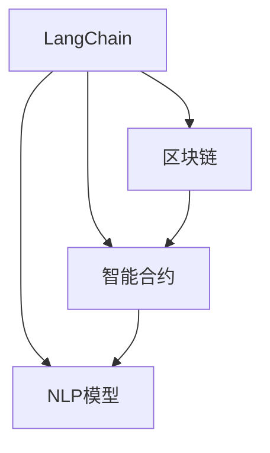

                 

# 【LangChain编程：从入门到实践】LangSmith

> 关键词：LangChain, 编程, 自然语言处理, 模型训练, 代码实现, 应用场景

## 1. 背景介绍

在人工智能迅速发展的今天，自然语言处理(Natural Language Processing, NLP)领域迎来了诸多创新性技术。其中，LangChain是一个基于区块链的NLP应用框架，能够将NLP模型与区块链技术相结合，提供高效、安全、可控的语言理解和生成服务。本文旨在系统性地介绍LangChain编程的核心概念、技术原理以及实现细节，帮助读者从入门到实践，掌握LangSmith的开发和应用技巧。

## 2. 核心概念与联系

### 2.1 核心概念概述

- **LangChain**：基于区块链的NLP应用框架，旨在实现语言理解和生成功能的安全、高效、可控。
- **LangSmith**：基于LangChain开发的编程模型，支持自然语言生成、理解、交互等功能。
- **区块链技术**：一种去中心化的分布式账本技术，为LangChain提供了安全、透明的数据存储和处理能力。
- **智能合约**：在区块链上自动执行的代码，用于处理业务逻辑和数据操作。
- **NLP模型**：包括预训练模型和微调模型，如BERT、GPT等，用于提取语言特征，理解语义和生成文本。

这些核心概念通过区块链技术、智能合约和NLP模型的有机结合，构建了LangChain编程的基础框架。以下是一个简化的Mermaid流程图，展示了这些概念之间的联系：



### 2.2 核心概念原理和架构的 Mermaid 流程图

在 LangChain 架构中，区块链作为底层基础，提供安全、不可篡改的数据存储和传输；智能合约用于处理业务逻辑和数据交互；NLP 模型则负责语言理解和生成，实现具体的 NLP 功能。这三大核心模块的协同工作，构成了 LangChain 的编程基础。

## 3. 核心算法原理 & 具体操作步骤

### 3.1 算法原理概述

LangSmith 的编程算法主要基于自然语言处理和区块链技术，通过智能合约调用 NLP 模型，实现自然语言生成、理解、交互等功能。其核心思想是将 NLP 模型封装为智能合约，通过区块链的分布式账本特性，确保数据和模型的安全性和可控性。

### 3.2 算法步骤详解

LangSmith 的编程流程主要包括以下几个步骤：

1. **模型准备**：选择合适的预训练模型，并根据任务需求进行微调。
2. **智能合约设计**：定义智能合约的逻辑和数据交互流程，包括输入数据的处理、模型的调用、结果的输出等。
3. **区块链部署**：将智能合约部署到区块链网络，并通过接口调用模型。
4. **测试与优化**：在测试网络进行模型调用测试，优化模型参数和合约逻辑，直至满足业务需求。
5. **正式上线**：将智能合约部署到主网，实现正式上线，并根据用户反馈进行持续迭代。

### 3.3 算法优缺点

LangSmith 的优点主要包括：

- 高安全性：区块链的去中心化和透明性保证了数据和模型的安全。
- 可控性：智能合约的自动执行确保了业务逻辑的可控。
- 高效性：通过模型封装和智能合约调用，简化了代码实现，提高了编程效率。

其缺点则在于：

- 技术门槛高：需要具备区块链和 NLP 的技术知识。
- 智能合约调用的复杂性：模型调用的性能和安全性需仔细设计。
- 开发成本高：区块链网络部署和智能合约编写需要较高的资源投入。

### 3.4 算法应用领域

LangSmith 的应用领域广泛，包括但不限于以下场景：

- **智能客服**：通过智能合约调用预训练模型，自动处理用户咨询和请求。
- **金融分析**：利用智能合约调用 NLP 模型，进行文本分析和情感分析，辅助金融决策。
- **内容生成**：基于区块链网络，部署智能合约，调用 NLP 模型生成文章、新闻、报告等。
- **知识图谱**：通过智能合约调用模型，构建和更新知识图谱，提供知识服务。
- **教育应用**：部署智能合约，调用预训练模型，进行学习资源推荐和智能辅助教学。

## 4. 数学模型和公式 & 详细讲解 & 举例说明

### 4.1 数学模型构建

LangSmith 编程模型的核心数学模型基于自然语言处理（NLP）和区块链技术。对于 NLP 模型，常见的数学模型包括：

- 词向量模型：将文本转化为向量表示，便于计算。
- 语言模型：通过概率模型描述文本的概率分布。
- 序列到序列模型：用于生成文本、对话等序列数据。

在区块链技术方面，智能合约和分布式账本的数学模型包括：

- 公钥加密算法：确保数据安全传输。
- 哈希算法：保证数据完整性和不可篡改性。
- 共识机制：确保网络中的节点达成一致的决策。

### 4.2 公式推导过程

以文本分类为例，LangSmith 中的模型推导过程如下：

1. **预训练**：在大规模无标签数据上预训练模型，学习语言表征。
2. **微调**：根据下游任务的需求，使用少量标注数据微调模型，优化模型的参数。
3. **智能合约调用**：通过智能合约将微调后的模型封装，提供接口调用。
4. **区块链交互**：将输入数据通过智能合约传递给模型，获取输出结果，再通过智能合约返回区块链网络。

### 4.3 案例分析与讲解

假设有一个智能合约，用于判断输入文本的情感倾向。该合约首先调用预训练的情感分析模型，将文本向量输入模型，输出情感分类概率。智能合约将分类概率转化为结果，并通过区块链返回用户。

## 5. 项目实践：代码实例和详细解释说明

### 5.1 开发环境搭建

在进行LangSmith编程实践前，需要搭建好开发环境。以下是一个基本的开发环境搭建流程：

1. **安装区块链平台**：选择适合的区块链平台，如以太坊、Hyperledger 等，并完成平台安装和配置。
2. **安装开发工具**：安装智能合约开发工具，如Remix IDE、Truffle等，方便合约开发和调试。
3. **安装NLP模型库**：安装预训练模型库，如TensorFlow、PyTorch等，以便调用模型。
4. **部署区块链网络**：搭建或连接已有的区块链测试网络，用于合约测试和上线。

### 5.2 源代码详细实现

以下是一个基于 LangChain 的智能合约示例，用于文本分类：

```python
# 导入必要的库
from ethcontract import CompileResult
from truffle_hooks import compile_contracts
from truffle.testing import Specification
import tensorflow as tf

# 定义智能合约逻辑
class TextClassifier(Specification):
    def __init__(self, contract_addr):
        self._contract = Web3.Eth.contract(address=contract_addr, abi=self.abi)
    
    def classify_text(self, text):
        # 将文本向量转换为模型输入
        input_tensor = self._convert_text_to_tensor(text)
        
        # 调用模型进行分类
        classification = self._call_model(input_tensor)
        
        # 将分类结果返回
        return classification
    
    def _convert_text_to_tensor(self, text):
        # 将文本转换为模型所需的向量形式
        tokenizer = Tokenizer()
        tokens = tokenizer.texts_to_sequences([text])
        input_tensor = self._transform(tokens)
        return input_tensor
    
    def _call_model(self, input_tensor):
        # 调用模型进行文本分类
        model = self._load_model()
        classification = model.predict(input_tensor)
        return classification
    
    def _load_model(self):
        # 加载预训练模型
        model_path = 'path/to/model.h5'
        model = load_model(model_path)
        return model
    
    def _transform(self, tokens):
        # 对文本进行预处理和转换
        model = self._load_model()
        input_tensor = self._pad(tokens)
        return input_tensor
    
    def _pad(self, tokens):
        # 对文本进行填充，使其长度一致
        max_len = 10
        tokens = tf.keras.preprocessing.sequence.pad_sequences(tokens, maxlen=max_len)
        return tokens
```

### 5.3 代码解读与分析

上述代码示例展示了如何使用 LangChain 进行文本分类。具体步骤包括：

1. **智能合约设计**：定义智能合约的接口和方法，实现文本分类的逻辑。
2. **模型调用**：通过合约调用预训练模型，进行文本向量化和模型预测。
3. **结果处理**：将模型预测结果封装成智能合约返回的数据格式。

### 5.4 运行结果展示

在测试环境中运行上述智能合约，可以输入不同的文本进行分类测试，输出分类结果。

## 6. 实际应用场景

### 6.1 智能客服

LangSmith 可以应用于智能客服系统，通过智能合约调用预训练模型，实现自动回答用户咨询和请求。系统可以根据用户输入的问题，自动调用模型进行理解，并生成回复。

### 6.2 金融分析

在金融领域，智能合约可以调用 NLP 模型进行文本分析和情感分析，辅助金融决策。例如，通过智能合约调用情感分析模型，分析用户对金融产品的评价，帮助金融机构做出更加精准的市场分析。

### 6.3 内容生成

LangSmith 可以基于区块链网络部署智能合约，调用 NLP 模型生成文章、新闻、报告等内容。用户可以通过智能合约调用模型，生成个性化的内容，广泛应用于出版、新闻、广告等领域。

### 6.4 未来应用展望

随着区块链技术的发展和 NLP 模型的进步，LangSmith 将在更多领域得到应用，为各行各业带来变革性影响。未来，LangSmith 可以应用于教育、医疗、法律、安全等更多垂直领域，提供更高效、安全和可控的智能服务。

## 7. 工具和资源推荐

### 7.1 学习资源推荐

- **Blockchain 入门书籍**：如《区块链：原理、架构与编程》、《Mastering Blockchain Technology》等，帮助理解区块链技术和智能合约开发。
- **NLP 相关书籍**：如《自然语言处理综论》、《深度学习与自然语言处理》等，深入学习 NLP 模型的原理和应用。
- **编程工具学习资源**：如官方文档、在线课程、技术博客等，掌握智能合约的开发和调试技巧。

### 7.2 开发工具推荐

- **区块链平台**：如以太坊、Hyperledger、EOS 等，选择合适的区块链平台进行开发。
- **智能合约开发工具**：如Remix IDE、Truffle、Web3.js 等，方便合约的编写和调试。
- **NLP 模型库**：如TensorFlow、PyTorch、OpenNMT 等，调用预训练模型进行任务实现。

### 7.3 相关论文推荐

- **区块链技术论文**：如《比特币：一种点对点的电子现金系统》、《以太坊智能合约》等，深入理解区块链技术。
- **NLP 技术论文**：如《Attention is All You Need》、《BERT: Pre-training of Deep Bidirectional Transformers for Language Understanding》等，了解最新的 NLP 模型和算法。

## 8. 总结：未来发展趋势与挑战

### 8.1 研究成果总结

本文系统地介绍了 LangChain 编程的核心概念、技术原理以及实现细节，帮助读者从入门到实践，掌握 LangSmith 的开发和应用技巧。通过深入学习，读者可以更好地理解和应用 LangSmith，推动 NLP 技术在更多领域的应用。

### 8.2 未来发展趋势

LangSmith 编程技术将呈现以下几个发展趋势：

1. **模型微调技术**：随着模型微调技术的不断发展，预训练模型和智能合约的集成将更加紧密，实现更加高效和准确的自然语言处理。
2. **区块链网络扩展**：随着区块链技术的不断成熟，智能合约的部署和执行将更加高效、安全，支持更多复杂的数据交互和业务逻辑。
3. **NLP 模型的多样化**：未来将有更多类型的 NLP 模型支持 LangSmith 编程，如 GPT、BERT、T5 等，提升系统的多样性和灵活性。
4. **应用场景的拓展**：LangSmith 将应用于更多垂直领域，如医疗、教育、金融、法律等，提供更加广泛和实用的智能服务。

### 8.3 面临的挑战

尽管 LangSmith 编程技术取得了显著进展，但在实际应用中仍面临以下挑战：

1. **技术门槛高**：智能合约和区块链技术的复杂性，要求开发者具备相关知识和技术背景。
2. **模型调用的复杂性**：智能合约调用 NLP 模型的性能和安全性需仔细设计，避免出现漏洞。
3. **资源消耗高**：智能合约的部署和执行需要较高的计算和存储资源，需合理优化。

### 8.4 研究展望

未来的研究需要在以下几个方面寻求新的突破：

1. **智能合约优化**：开发更加高效的智能合约，降低资源消耗，提升系统性能。
2. **模型调用安全**：加强模型调用的安全性，避免模型攻击和数据泄露。
3. **应用场景拓展**：推动 LangSmith 在更多垂直领域的应用，提升系统的实用性和覆盖面。

## 9. 附录：常见问题与解答

**Q1: LangChain 编程的难点在哪里？**

A: LangChain 编程的难点在于智能合约的编写和区块链技术的理解。智能合约的逻辑设计需要细致入微，确保其正确性和安全性。同时，区块链技术的复杂性也要求开发者具备一定的技术背景。

**Q2: 如何提高 LangSmith 的性能和安全性？**

A: 提高 LangSmith 的性能和安全性，可以从以下几个方面入手：
1. **优化模型调用**：选择合适的预训练模型，并根据任务需求进行微调，优化模型参数。
2. **智能合约设计**：设计高效的智能合约逻辑，确保其正确性和安全性。
3. **区块链网络优化**：选择适合的区块链平台，并优化网络配置，提高系统的性能和安全性。

**Q3: LangChain 编程的实际应用场景有哪些？**

A: LangChain 编程适用于各种 NLP 相关应用，包括但不限于智能客服、金融分析、内容生成、知识图谱等。未来，随着技术的发展，其应用场景还将进一步拓展。

**Q4: LangSmith 的开发流程是什么？**

A: LangSmith 的开发流程主要包括以下几个步骤：
1. 模型准备：选择合适的预训练模型，并根据任务需求进行微调。
2. 智能合约设计：定义智能合约的逻辑和数据交互流程。
3. 区块链部署：将智能合约部署到区块链网络，并通过接口调用模型。
4. 测试与优化：在测试网络进行模型调用测试，优化模型参数和合约逻辑。
5. 正式上线：将智能合约部署到主网，实现正式上线，并根据用户反馈进行持续迭代。

---

作者：禅与计算机程序设计艺术 / Zen and the Art of Computer Programming

