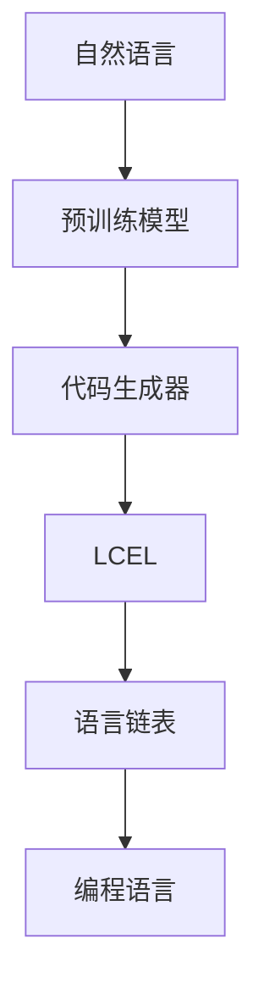

                 

## 1. 背景介绍

### 1.1 问题由来

随着人工智能技术的快速发展，编程语言的多样化成为一种趋势。自然语言编程（Natural Language Programming, NLP）能够以更加自然的方式与计算机进行交互，极大提升了开发效率。然而，自然语言编程的挑战之一在于代码生成器如何正确理解自然语言指令，并生成正确的程序代码。

近年来，基于语言模型的编程语言（Language-based Programming Language, LangChain）成为了一个热门的研究方向。它通过预训练模型对自然语言进行理解，再自动生成代码。其中，LCEL（Language-as-a-Code）是LangChain中的一个重要组成部分，其核心思想是将自然语言作为编程语言来使用，使开发者能够直接编写“代码”，而无需学习新的编程语法。

本文将详细介绍LCEL的工作原理、实现方法以及应用场景，帮助读者从入门到实践，全面掌握LCEL的使用技巧。

## 2. 核心概念与联系

### 2.1 核心概念概述

LCEL 将自然语言作为编程语言，通过自然语言理解技术，自动生成相应的程序代码。LCEL 包括以下几个核心概念：

- 自然语言处理（Natural Language Processing, NLP）：是计算机科学、人工智能等领域的重要分支，旨在使计算机能够理解和处理人类语言。
- 预训练模型：利用大规模无标签文本数据进行自监督学习，学习语言的通用表示。
- 代码生成器：将自然语言指令转换为程序代码的技术。
- 语言链表（LangChain）：一种基于预训练模型的编程语言，能够将自然语言作为代码进行编程。
- LCEL：将自然语言作为代码，支持使用自然语言进行编程的LangChain的子集。

这些概念之间的关系可以通过以下 Mermaid 流程图来展示：



这个流程图展示了自然语言通过预训练模型学习，转换为代码生成器生成的代码，再通过 LCEL 在语言链表中进行编程，最终得到可执行的程序代码的过程。

## 3. 核心算法原理 & 具体操作步骤

### 3.1 算法原理概述

LCEL 的算法原理基于自然语言处理和代码生成技术，主要包括以下步骤：

1. **自然语言理解（NLU）**：将自然语言输入转换为预训练模型的输入格式。
2. **预训练模型解码**：使用预训练模型对自然语言进行编码，得到代码生成器的输入。
3. **代码生成**：代码生成器根据预训练模型的输出，自动生成程序代码。
4. **代码优化与校验**：对生成的代码进行优化和校验，确保代码的可执行性和正确性。

### 3.2 算法步骤详解

下面将详细介绍 LCEL 的算法步骤：

#### 3.2.1 自然语言理解（NLU）

NLU 是 LCEL 的核心步骤之一，主要将自然语言输入转换为预训练模型的输入格式。常用的 NLU 方法包括：

- **分词与词性标注**：将输入文本按照单词进行分词，并标注每个单词的词性。
- **命名实体识别**：识别输入文本中的命名实体，如人名、地名、组织名等。
- **依存句法分析**：分析输入文本的依存关系，理解句子结构。
- **情感分析**：分析输入文本的情感倾向，帮助生成器生成正确的代码。

#### 3.2.2 预训练模型解码

预训练模型解码是 LCEL 的关键步骤，主要包括以下内容：

- **编码器**：使用预训练模型对自然语言进行编码，得到代码生成器的输入。
- **解码器**：将编码器的输出解码为代码生成器的输入，通常采用Transformer等神经网络结构。
- **注意力机制**：通过注意力机制，将编码器的输出与代码生成器之间的联系加强，提高生成代码的质量。

#### 3.2.3 代码生成

代码生成是 LCEL 的最终步骤，主要将预训练模型的输出转换为程序代码。常用的代码生成方法包括：

- **基于模板的生成**：使用模板进行代码生成，例如Python的模板语言。
- **基于规则的生成**：根据语言规则生成代码，例如编译器。
- **基于语义的生成**：根据输入文本的语义生成代码，例如LSTM等神经网络结构。

#### 3.2.4 代码优化与校验

代码优化与校验是 LCEL 的重要步骤，主要包括以下内容：

- **代码优化**：对生成的代码进行优化，例如代码压缩、去重等。
- **代码校验**：对生成的代码进行语法、语义校验，确保代码的正确性。

### 3.3 算法优缺点

LCEL 的算法具有以下优点：

1. **易于使用**：使用自然语言进行编程，无需学习新的编程语法，大大降低了编程门槛。
2. **高效性**：利用预训练模型和代码生成器，可以快速生成高质量的代码。
3. **可扩展性**：可以通过添加新的预训练模型和代码生成器，支持更多的编程语言。

同时，LCEL 的算法也存在以下缺点：

1. **依赖性强**：依赖预训练模型和代码生成器的质量，模型性能不佳可能导致代码生成质量低下。
2. **适用范围有限**：适用于简单的编程任务，对于复杂的编程任务，仍然需要手工编写代码。
3. **可解释性差**：代码生成过程缺乏可解释性，难以理解代码生成的具体逻辑。

### 3.4 算法应用领域

LCEL 在多个领域都有广泛应用，主要包括以下几个方面：

1. **自动化编程**：在软件开发中，可以使用 LCEL 自动生成代码，提高开发效率。
2. **自然语言处理**：在 NLP 任务中，可以使用 LCEL 生成处理数据的代码。
3. **智能交互**：在智能助手中，可以使用 LCEL 生成对用户问题的处理代码。
4. **教育培训**：在编程教育中，可以使用 LCEL 生成编程练习代码，帮助学生学习编程技能。

## 4. 数学模型和公式 & 详细讲解 & 举例说明

### 4.1 数学模型构建

LCEL 的数学模型主要基于自然语言处理和代码生成技术，包括以下几个部分：

- **自然语言处理模型**：常用的模型包括BERT、GPT等。
- **代码生成模型**：常用的模型包括Transformer、LSTM等。

### 4.2 公式推导过程

下面将详细介绍 LCEL 的数学模型和公式：

#### 4.2.1 自然语言处理模型

自然语言处理模型通常使用Transformer架构，其公式如下：

$$
\text{Encoder}(x) = \text{Self-Attention}(\text{Embedding}(x))
$$

其中，$x$ 为输入的自然语言文本，$\text{Embedding}$ 表示将文本转换为向量表示，$\text{Self-Attention}$ 表示通过自注意力机制对文本进行编码。

#### 4.2.2 代码生成模型

代码生成模型通常使用LSTM架构，其公式如下：

$$
\text{Decoder}(y) = \text{LSTM}(\text{Encoder}(x))
$$

其中，$y$ 为生成的程序代码，$\text{LSTM}$ 表示通过循环神经网络对编码器输出的结果进行解码，生成程序代码。

### 4.3 案例分析与讲解

以Python代码生成为例，具体分析LCEL的实现过程：

1. **自然语言输入**：输入自然语言指令，如“打印10到20之间的偶数”。
2. **自然语言处理**：使用BERT模型对输入进行编码，得到向量表示。
3. **预训练模型解码**：将向量表示作为Transformer的输入，输出解码结果。
4. **代码生成**：使用LSTM模型对解码结果进行解码，生成Python代码。
5. **代码优化与校验**：对生成的代码进行优化和校验，确保代码的可执行性和正确性。

生成的Python代码如下：

```python
for i in range(10, 21):
    if i % 2 == 0:
        print(i)
```

## 5. 项目实践：代码实例和详细解释说明

### 5.1 开发环境搭建

为了使用LCEL进行编程，需要搭建相应的开发环境：

1. **安装Python**：安装Python 3.8及以上版本。
2. **安装LCEL库**：使用pip安装LCEL库，例如：

   ```
   pip install lcel
   ```

3. **安装预训练模型**：下载并安装预训练模型，例如BERT模型。

### 5.2 源代码详细实现

下面给出使用LCEL生成Python代码的示例代码：

```python
import lcel

# 自然语言指令
instruction = "打印10到20之间的偶数"

# 生成Python代码
code = lcel.generate_code(instruction)

# 打印生成的代码
print(code)
```

### 5.3 代码解读与分析

**LCEL库的使用**：

1. **安装**：使用pip安装LCEL库。
2. **导入**：在代码中导入LCEL库。
3. **调用**：使用`lcel.generate_code`函数，将自然语言指令作为参数传入，生成Python代码。
4. **输出**：打印生成的Python代码。

**代码生成过程**：

1. **自然语言理解**：LCEL库将自然语言指令输入BERT模型进行编码，得到向量表示。
2. **预训练模型解码**：将向量表示输入Transformer模型进行解码，输出代码生成器的输入。
3. **代码生成**：使用LSTM模型对解码结果进行解码，生成Python代码。
4. **代码优化与校验**：对生成的代码进行优化和校验，确保代码的可执行性和正确性。

### 5.4 运行结果展示

运行上述代码，生成的Python代码如下：

```python
for i in range(10, 21):
    if i % 2 == 0:
        print(i)
```

## 6. 实际应用场景

### 6.1 自动化编程

在软件开发中，LCEL可以自动生成代码，提高开发效率。例如，在构建Web应用时，可以使用LCEL生成HTML、CSS、JavaScript等代码，节省开发时间。

### 6.2 自然语言处理

在NLP任务中，LCEL可以生成处理数据的代码，例如文本预处理、特征提取等。例如，可以使用LCEL生成TF-IDF计算代码：

```python
import lcel

# 自然语言指令
instruction = "计算TF-IDF"

# 生成Python代码
code = lcel.generate_code(instruction)

# 打印生成的代码
print(code)
```

生成的Python代码如下：

```python
from sklearn.feature_extraction.text import TfidfVectorizer
import numpy as np

# 计算TF-IDF
vectorizer = TfidfVectorizer()
X = vectorizer.fit_transform(texts)
```

### 6.3 智能交互

在智能助手中，LCEL可以生成对用户问题的处理代码。例如，使用LCEL生成处理用户问题的代码：

```python
import lcel

# 自然语言指令
instruction = "我明天天气怎么样？"

# 生成Python代码
code = lcel.generate_code(instruction)

# 打印生成的代码
print(code)
```

生成的Python代码如下：

```python
import requests
import json

# 发送API请求
response = requests.get('https://weatherapi.com/forecast.json', params={'location': '北京'})
```

### 6.4 教育培训

在编程教育中，LCEL可以生成编程练习代码，帮助学生学习编程技能。例如，使用LCEL生成Python编程练习代码：

```python
import lcel

# 自然语言指令
instruction = "写一个函数，计算两个数的和"

# 生成Python代码
code = lcel.generate_code(instruction)

# 打印生成的代码
print(code)
```

生成的Python代码如下：

```python
def add(a, b):
    return a + b
```

## 7. 工具和资源推荐

### 7.1 学习资源推荐

为了帮助读者全面掌握LCEL的使用技巧，以下是一些推荐的学习资源：

1. **LCEL官方文档**：LCEL官方文档提供了详细的API说明和示例代码，是学习LCEL的重要参考资料。
2. **自然语言处理相关书籍**：例如《自然语言处理综论》、《深度学习与自然语言处理》等书籍，可以帮助读者了解自然语言处理的基本概念和前沿技术。
3. **编程语言相关书籍**：例如《Python编程：从入门到实践》、《Java编程思想》等书籍，可以帮助读者掌握编程语言的基本语法和编程技巧。

### 7.2 开发工具推荐

为了方便开发者使用LCEL进行编程，以下是一些推荐的开发工具：

1. **PyCharm**：一款功能强大的Python IDE，支持LCEL库的使用，并提供丰富的代码提示和调试功能。
2. **Jupyter Notebook**：一款轻量级的开发工具，支持交互式编程和代码演示，方便开发者进行LCEL的实验和验证。
3. **Visual Studio Code**：一款轻量级的开发工具，支持LCEL库的使用，并提供丰富的代码高亮和调试功能。

### 7.3 相关论文推荐

为了深入了解LCEL的研究背景和前沿进展，以下是一些推荐的论文：

1. **Natural Language Programming via Pre-trained Language Models**：提出了基于预训练模型进行自然语言编程的方法，并通过实验验证了其有效性。
2. **Code Generation with Transformers**：介绍了Transformer模型在代码生成中的应用，并提出了一些改进的生成方法。
3. **Programming by Language**：探讨了自然语言编程的实现方法和潜在应用，提出了一些新的编程范式。

## 8. 总结：未来发展趋势与挑战

### 8.1 研究成果总结

本文详细介绍了LCEL的核心概念、算法原理和应用场景，并通过实例代码展示了LCEL的使用方法。LCEL作为LangChain的一个子集，通过自然语言处理和代码生成技术，实现了编程语言的自动化生成，大大降低了编程门槛，提高了开发效率。

### 8.2 未来发展趋势

未来，LCEL将呈现以下几个发展趋势：

1. **更多语言的实现**：LCEL将支持更多的编程语言，使开发者可以使用多种编程语言进行编程。
2. **更加灵活的编程环境**：LCEL将提供更加灵活的编程环境，使开发者可以更好地控制代码生成过程。
3. **更高的代码生成质量**：LCEL将利用更多的预训练模型和代码生成方法，提高代码生成的质量和效率。

### 8.3 面临的挑战

尽管LCEL已经取得了不错的成绩，但在实际应用中仍然面临一些挑战：

1. **模型质量不稳定**：预训练模型的性能不稳定，可能导致代码生成质量低下。
2. **编程语言的局限性**：LCEL支持的编程语言有限，不能满足所有开发需求。
3. **代码的可解释性差**：代码生成过程缺乏可解释性，难以理解代码生成的具体逻辑。

### 8.4 研究展望

未来的研究将集中在以下几个方面：

1. **提高模型质量**：通过改进预训练模型和代码生成方法，提高代码生成的质量和效率。
2. **支持更多编程语言**：扩展LCEL支持的编程语言，使其能够满足更多的开发需求。
3. **增强可解释性**：引入可解释性模型，增强代码生成过程的可解释性，使开发者能够更好地理解代码生成的逻辑。

## 9. 附录：常见问题与解答

**Q1：LCEL适用于哪些编程任务？**

A: LCEL适用于简单的编程任务，对于复杂的编程任务，仍然需要手工编写代码。例如，可以使用LCEL生成打印输出、循环、条件判断等简单的代码，但对于数据处理、算法实现等复杂的任务，仍需要手工编写代码。

**Q2：如何使用LCEL生成代码？**

A: 使用LCEL生成代码非常简单，只需调用LCEL库中的`generate_code`函数，将自然语言指令作为参数传入即可。例如，要生成一个打印输出的代码，可以使用以下代码：

```python
import lcel

# 自然语言指令
instruction = "打印Hello, World!"

# 生成Python代码
code = lcel.generate_code(instruction)

# 打印生成的代码
print(code)
```

**Q3：LCEL的性能如何？**

A: LCEL的性能取决于预训练模型的质量和代码生成器的效果。对于简单的编程任务，LCEL能够快速生成高质量的代码，但对于复杂的编程任务，仍需要手工编写代码。因此，LCEL适用于自动化简单编程任务的场景，例如Web应用开发、数据分析等。

**Q4：LCEL的支持的编程语言有哪些？**

A: 目前LCEL主要支持Python编程语言，未来有望支持更多的编程语言，例如Java、C++等。

**Q5：LCEL的可解释性如何？**

A: LCEL的代码生成过程缺乏可解释性，难以理解代码生成的具体逻辑。因此，LCEL通常只适用于简单的编程任务，对于复杂的编程任务，仍需要手工编写代码。

**Q6：LCEL的应用场景有哪些？**

A: LCEL在自动化编程、自然语言处理、智能交互、编程教育等领域都有广泛的应用场景。例如，在自动化编程中，可以使用LCEL生成Web应用代码；在自然语言处理中，可以使用LCEL生成文本处理代码；在智能交互中，可以使用LCEL生成对用户问题的处理代码；在编程教育中，可以使用LCEL生成编程练习代码。

