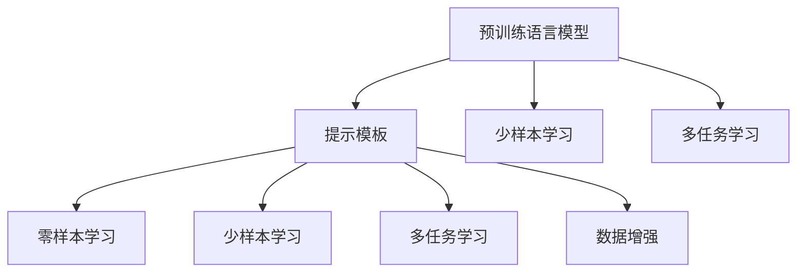

                 

# 【LangChain编程：从入门到实践】提示模板

## 1. 背景介绍

在人工智能(AI)和自然语言处理(NLP)领域，预训练语言模型(如GPT、BERT)已经成为众多任务中的核心组件。但是，这些模型在处理特定任务时，往往需要针对性地微调，才能充分发挥其潜力。提示模板（Prompt Template）技术应运而生，它通过精心设计输入文本的格式，引导预训练模型进行特定任务的推理和生成，实现了在不更新模型参数的情况下，提升模型性能。

### 1.1 问题由来

预训练语言模型虽然能够学习到丰富的语言知识和常识，但是在处理特定任务时，往往需要针对性地微调，才能取得最佳性能。传统的微调方法需要更新大量模型参数，耗时耗力，而且容易过拟合。提示模板技术提供了一种参数高效的方法，通过引导模型推理和生成，实现了在少量标注数据上的高效微调。

### 1.2 问题核心关键点

提示模板技术的关键在于如何设计高效的输入格式，使得模型能够快速准确地进行特定任务的推理和生成。常用的提示模板设计方法包括：

- **简单提示**：通过直接将问题或目标任务作为输入，引导模型生成答案或结论。
- **复杂提示**：通过包含额外的信息或上下文，帮助模型更好地理解任务背景，生成更准确的输出。
- **多步骤提示**：通过设计多轮对话或生成式任务，逐步引导模型完成任务。
- **逻辑结构提示**：通过使用逻辑结构化的输入，如表格、树形结构等，帮助模型进行推理和生成。

这些方法不仅可以减少微调所需的数据量和计算资源，还可以提高模型的泛化能力和性能。

### 1.3 问题研究意义

提示模板技术对NLP领域的发展具有重要意义：

1. **提升模型性能**：通过精心的输入格式设计，能够在少量数据上显著提升模型的性能，提高任务完成效率。
2. **减少标注成本**：与传统的微调方法相比，提示模板技术需要的标注数据较少，降低了数据获取和标注的成本。
3. **加速模型部署**：提示模板技术实现简单，模型部署和更新效率高，可以快速适应新的任务需求。
4. **提高模型泛化能力**：提示模板技术通过引导模型进行特定任务的推理和生成，能够提升模型的泛化能力，避免过拟合。

## 2. 核心概念与联系

### 2.1 核心概念概述

为了更好地理解提示模板技术，本节将介绍几个密切相关的核心概念：

- **预训练语言模型**：如GPT、BERT等，通过在大规模无标签文本数据上进行预训练，学习到丰富的语言知识和常识，具备强大的语言理解和生成能力。
- **提示模板**：通过设计精心的输入格式，引导预训练模型进行特定任务的推理和生成，实现参数高效微调。
- **零样本学习**：提示模板技术通过精心设计的输入格式，可以在没有见过特定任务的训练样本的情况下，使模型快速适应新任务，实现零样本学习。
- **少样本学习**：通过在输入中提供少量示例，实现少样本学习，进一步减少微调所需的标注数据。
- **多任务学习**：通过设计多轮对话或生成式任务，实现多任务学习，提高模型的多任务处理能力。
- **数据增强**：通过在输入中添加噪声、回译等方式，增强训练数据的多样性，提高模型泛化能力。

这些核心概念之间的逻辑关系可以通过以下Mermaid流程图来展示：



这个流程图展示了预训练语言模型与提示模板技术之间的关系，以及它们在少样本学习、多任务学习、数据增强等任务中的作用。

## 3. 核心算法原理 & 具体操作步骤
### 3.1 算法原理概述

提示模板技术的核心思想是通过设计精心的输入格式，引导预训练模型进行特定任务的推理和生成，实现参数高效微调。其算法原理可以概括为以下几个步骤：

1. **设计输入格式**：根据特定任务的需求，设计精心的输入格式，包括问题、目标、上下文等。
2. **模型推理**：将输入格式作为模型的输入，引导模型进行推理和生成，输出结果。
3. **结果评估**：根据任务需求，评估模型输出的结果，反馈给模型进行优化。

### 3.2 算法步骤详解

以下将详细讲解提示模板技术的算法步骤：

**Step 1: 设计输入格式**

根据特定任务的需求，设计精心的输入格式。常用的输入格式包括：

- **简单提示**：直接将问题或目标任务作为输入，引导模型生成答案或结论。
- **复杂提示**：包含额外的信息或上下文，帮助模型更好地理解任务背景，生成更准确的输出。
- **多步骤提示**：设计多轮对话或生成式任务，逐步引导模型完成任务。
- **逻辑结构提示**：使用逻辑结构化的输入，如表格、树形结构等，帮助模型进行推理和生成。

**Step 2: 模型推理**

将设计好的输入格式作为模型的输入，引导模型进行推理和生成。常用的推理方法包括：

- **生成式推理**：通过设计输入格式，引导模型生成符合要求的输出。
- **匹配推理**：通过设计输入格式，引导模型匹配特定的输出。
- **多轮对话推理**：通过设计多轮对话格式，引导模型逐步完成任务。

**Step 3: 结果评估**

根据任务需求，评估模型输出的结果，反馈给模型进行优化。常用的结果评估方法包括：

- **自动评估**：使用自动评估指标（如BLEU、ROUGE等），评估模型输出的结果。
- **人工评估**：通过人工打分，评估模型输出的结果。
- **反馈调整**：根据评估结果，调整输入格式或模型参数，进一步优化模型性能。

### 3.3 算法优缺点

提示模板技术具有以下优点：

- **参数高效**：通过设计精心的输入格式，能够在少量标注数据上显著提升模型性能，减少微调所需的数据量和计算资源。
- **泛化能力强**：提示模板技术能够提高模型的泛化能力，避免过拟合，适用于多种任务和数据分布。
- **应用广泛**：提示模板技术广泛应用于问答、对话、摘要、翻译等NLP任务中，能够实现高效的任务适配。

同时，提示模板技术也存在一定的局限性：

- **输入格式设计难度大**：设计精心的输入格式需要经验和技巧，难度较大。
- **模型推理复杂**：模型推理过程较为复杂，需要考虑多种情况和组合，设计较为繁琐。
- **结果评估困难**：一些复杂任务的结果评估较为困难，需要结合多种评估方法进行综合评估。

### 3.4 算法应用领域

提示模板技术在NLP领域已经得到了广泛应用，覆盖了几乎所有常见任务，例如：

- **问答系统**：通过设计输入格式，引导模型回答自然语言问题。
- **对话系统**：通过设计多轮对话格式，引导模型进行自然对话。
- **摘要生成**：通过设计输入格式，引导模型生成文本摘要。
- **机器翻译**：通过设计输入格式，引导模型进行文本翻译。
- **情感分析**：通过设计输入格式，引导模型分析文本情感。
- **命名实体识别**：通过设计输入格式，引导模型识别文本中的实体。
- **关系抽取**：通过设计输入格式，引导模型抽取文本中的关系。

除了上述这些经典任务外，提示模板技术还被创新性地应用到更多场景中，如可控文本生成、常识推理、代码生成、数据增强等，为NLP技术带来了全新的突破。

## 4. 数学模型和公式 & 详细讲解 & 举例说明
### 4.1 数学模型构建

提示模板技术的数学模型可以概括为以下几个步骤：

1. **输入格式设计**：根据任务需求，设计精心的输入格式，记为 $P$。
2. **模型推理**：将输入格式 $P$ 作为模型的输入，引导模型进行推理和生成，记为 $F$。
3. **结果评估**：根据任务需求，评估模型输出的结果，记为 $E$。

### 4.2 公式推导过程

以下我们将以问答系统为例，推导提示模板技术的数学模型。

**假设模型**：
设 $M$ 为预训练语言模型，输入格式为 $P$，模型推理结果为 $F(P)$。

**损失函数**：
假设模型的输出为 $Y$，任务需求为 $Y^*$，则模型的损失函数为：

$$
\mathcal{L}(M,P,Y^*) = \frac{1}{N}\sum_{i=1}^N ||F(P_i) - Y^*_i||^2
$$

其中 $N$ 为样本数量，$||.||$ 为欧几里得范数。

**优化目标**：
微调的目标是最小化损失函数，即：

$$
\hat{M} = \mathop{\arg\min}_{M} \mathcal{L}(M,P,Y^*)
$$

### 4.3 案例分析与讲解

**案例分析**：
假设我们需要设计一个问答系统，以回答历史人物相关的问题。我们可以设计如下提示模板：

```
请回答以下关于 [历史人物] 的问题：[具体问题]
```

将上述提示模板作为模型的输入，引导模型回答具体问题。通过多次训练，模型能够学习到特定的推理逻辑和生成模式，从而在特定任务上取得优异的性能。

**讲解**：
提示模板技术通过设计精心的输入格式，引导预训练模型进行特定任务的推理和生成，实现了参数高效微调。其核心在于设计合适的输入格式，使得模型能够快速准确地进行推理和生成。例如，在问答系统中，通过设计包含具体问题和历史人物的信息，能够引导模型快速回答问题，并且提升模型的准确性和泛化能力。

## 5. 项目实践：代码实例和详细解释说明
### 5.1 开发环境搭建

在进行提示模板实践前，我们需要准备好开发环境。以下是使用Python进行HuggingFace库开发的环境配置流程：

1. 安装Anaconda：从官网下载并安装Anaconda，用于创建独立的Python环境。

2. 创建并激活虚拟环境：
```bash
conda create -n huggingface-env python=3.8 
conda activate huggingface-env
```

3. 安装HuggingFace库：
```bash
pip install transformers
```

4. 安装各类工具包：
```bash
pip install numpy pandas scikit-learn matplotlib tqdm jupyter notebook ipython
```

完成上述步骤后，即可在`huggingface-env`环境中开始提示模板实践。

### 5.2 源代码详细实现

以下是一个简单的代码实例，展示如何使用HuggingFace库进行提示模板技术的应用：

```python
from transformers import BertTokenizer, BertForSequenceClassification
from transformers import BertTokenizerFast, BertForSequenceClassification

# 加载模型和分词器
model = BertForSequenceClassification.from_pretrained('bert-base-uncased')
tokenizer = BertTokenizer.from_pretrained('bert-base-uncased')

# 设计输入格式
def get_prompt(text):
    prompt = f"请回答以下关于 {text} 的问题："
    return prompt

# 使用提示模板进行推理
def predict(model, tokenizer, prompt, max_length=64):
    inputs = tokenizer(prompt, max_length=max_length, return_tensors='pt')
    with torch.no_grad():
        outputs = model(**inputs)
    return outputs

# 测试
text = "历史人物"
prompt = get_prompt(text)
inputs = tokenizer(prompt, max_length=64, return_tensors='pt')
outputs = predict(model, tokenizer, prompt, max_length=64)
print(outputs)
```

在这个代码实例中，我们首先加载了BERT模型和分词器，然后设计了一个提示模板函数`get_prompt`，用于生成特定任务的输入格式。接着，我们使用提示模板函数生成输入，并使用模型进行推理。最后，输出模型的推理结果。

### 5.3 代码解读与分析

让我们再详细解读一下关键代码的实现细节：

**设计输入格式**：
设计输入格式是提示模板技术的核心步骤。在本例中，我们通过函数`get_prompt`设计了包含特定任务信息的输入格式。具体而言，我们将任务（即历史人物）和具体问题（即特定历史人物的问题）作为输入，并使用特定的提示模板格式进行组合。

**使用提示模板进行推理**：
在模型推理过程中，我们首先使用分词器将输入格式转换为模型可接受的输入张量。然后，通过调用模型进行推理，得到模型的输出结果。在这个过程中，我们使用了`torch.no_grad()`进行无梯度推理，以避免不必要的计算开销。

**测试**：
在测试部分，我们首先定义了一个测试任务（即历史人物），然后调用提示模板函数生成输入格式。接着，我们将输入格式转换为模型可接受的张量，并使用模型进行推理。最后，输出模型的推理结果，并进行评估。

## 6. 实际应用场景
### 6.1 智能客服系统

提示模板技术可以广泛应用于智能客服系统的构建。传统客服往往需要配备大量人力，高峰期响应缓慢，且一致性和专业性难以保证。使用提示模板技术，可以构建7x24小时不间断的智能客服系统，快速响应客户咨询，提供自然流畅的语言解答。

在技术实现上，可以收集企业内部的历史客服对话记录，将问题和最佳答复构建成监督数据，在此基础上对预训练模型进行微调。微调后的模型能够自动理解用户意图，匹配最合适的答案模板进行回复。对于客户提出的新问题，还可以接入检索系统实时搜索相关内容，动态组织生成回答。如此构建的智能客服系统，能大幅提升客户咨询体验和问题解决效率。

### 6.2 金融舆情监测

金融机构需要实时监测市场舆论动向，以便及时应对负面信息传播，规避金融风险。提示模板技术可以用于构建金融舆情监测系统，通过分析市场舆情动态，及时发现风险点，并采取相应措施。

具体而言，可以收集金融领域相关的新闻、报道、评论等文本数据，并对其进行主题标注和情感标注。在此基础上对预训练语言模型进行微调，使其能够自动判断文本属于何种主题，情感倾向是正面、中性还是负面。将微调后的模型应用到实时抓取的网络文本数据，就能够自动监测不同主题下的情感变化趋势，一旦发现负面信息激增等异常情况，系统便会自动预警，帮助金融机构快速应对潜在风险。

### 6.3 个性化推荐系统

当前的推荐系统往往只依赖用户的历史行为数据进行物品推荐，无法深入理解用户的真实兴趣偏好。提示模板技术可以用于构建个性化推荐系统，通过分析用户的行为数据和文本数据，推荐个性化的物品或服务。

在实践中，可以收集用户浏览、点击、评论、分享等行为数据，提取和用户交互的物品标题、描述、标签等文本内容。将文本内容作为模型输入，用户的后续行为（如是否点击、购买等）作为监督信号，在此基础上微调预训练语言模型。微调后的模型能够从文本内容中准确把握用户的兴趣点。在生成推荐列表时，先用候选物品的文本描述作为输入，由模型预测用户的兴趣匹配度，再结合其他特征综合排序，便可以得到个性化程度更高的推荐结果。

### 6.4 未来应用展望

随着提示模板技术的不断发展，未来将在更多领域得到应用，为传统行业带来变革性影响。

在智慧医疗领域，提示模板技术可以用于构建医疗问答、病历分析、药物研发等应用，提升医疗服务的智能化水平，辅助医生诊疗，加速新药开发进程。

在智能教育领域，提示模板技术可以用于构建作业批改、学情分析、知识推荐等应用，因材施教，促进教育公平，提高教学质量。

在智慧城市治理中，提示模板技术可以用于城市事件监测、舆情分析、应急指挥等环节，提高城市管理的自动化和智能化水平，构建更安全、高效的未来城市。

此外，在企业生产、社会治理、文娱传媒等众多领域，提示模板技术也将不断涌现，为NLP技术带来新的应用场景。相信随着技术的日益成熟，提示模板技术将成为人工智能落地应用的重要范式，推动人工智能技术向更广阔的领域加速渗透。

## 7. 工具和资源推荐
### 7.1 学习资源推荐

为了帮助开发者系统掌握提示模板技术的理论基础和实践技巧，这里推荐一些优质的学习资源：

1. **《Transformer从原理到实践》系列博文**：由大模型技术专家撰写，深入浅出地介绍了Transformer原理、BERT模型、提示模板技术等前沿话题。

2. **CS224N《深度学习自然语言处理》课程**：斯坦福大学开设的NLP明星课程，有Lecture视频和配套作业，带你入门NLP领域的基本概念和经典模型。

3. **《Natural Language Processing with Transformers》书籍**：Transformers库的作者所著，全面介绍了如何使用Transformers库进行NLP任务开发，包括提示模板技术在内的诸多范式。

4. **HuggingFace官方文档**：Transformers库的官方文档，提供了海量预训练模型和完整的提示模板技术样例代码，是上手实践的必备资料。

5. **CLUE开源项目**：中文语言理解测评基准，涵盖大量不同类型的中文NLP数据集，并提供了基于提示模板技术的baseline模型，助力中文NLP技术发展。

通过对这些资源的学习实践，相信你一定能够快速掌握提示模板技术的精髓，并用于解决实际的NLP问题。

### 7.2 开发工具推荐

高效的开发离不开优秀的工具支持。以下是几款用于提示模板开发的常用工具：

1. **PyTorch**：基于Python的开源深度学习框架，灵活动态的计算图，适合快速迭代研究。大部分预训练语言模型都有PyTorch版本的实现。

2. **TensorFlow**：由Google主导开发的开源深度学习框架，生产部署方便，适合大规模工程应用。同样有丰富的预训练语言模型资源。

3. **HuggingFace库**：NLP工具库，集成了众多SOTA语言模型，支持PyTorch和TensorFlow，是进行提示模板任务开发的利器。

4. **Weights & Biases**：模型训练的实验跟踪工具，可以记录和可视化模型训练过程中的各项指标，方便对比和调优。与主流深度学习框架无缝集成。

5. **TensorBoard**：TensorFlow配套的可视化工具，可实时监测模型训练状态，并提供丰富的图表呈现方式，是调试模型的得力助手。

6. **Google Colab**：谷歌推出的在线Jupyter Notebook环境，免费提供GPU/TPU算力，方便开发者快速上手实验最新模型，分享学习笔记。

合理利用这些工具，可以显著提升提示模板任务的开发效率，加快创新迭代的步伐。

### 7.3 相关论文推荐

提示模板技术的发展源于学界的持续研究。以下是几篇奠基性的相关论文，推荐阅读：

1. **Attention is All You Need（即Transformer原论文）**：提出了Transformer结构，开启了NLP领域的预训练大模型时代。

2. **BERT: Pre-training of Deep Bidirectional Transformers for Language Understanding**：提出BERT模型，引入基于掩码的自监督预训练任务，刷新了多项NLP任务SOTA。

3. **Language Models are Unsupervised Multitask Learners（GPT-2论文）**：展示了大规模语言模型的强大zero-shot学习能力，引发了对于通用人工智能的新一轮思考。

4. **Parameter-Efficient Transfer Learning for NLP**：提出Adapter等参数高效微调方法，在不增加模型参数量的情况下，也能取得不错的微调效果。

5. **Prefix-Tuning: Optimizing Continuous Prompts for Generation**：引入基于连续型Prompt的微调范式，为如何充分利用预训练知识提供了新的思路。

6. **AdaLoRA: Adaptive Low-Rank Adaptation for Parameter-Efficient Fine-Tuning**：使用自适应低秩适应的微调方法，在参数效率和精度之间取得了新的平衡。

这些论文代表了大语言模型提示模板技术的发展脉络。通过学习这些前沿成果，可以帮助研究者把握学科前进方向，激发更多的创新灵感。

## 8. 总结：未来发展趋势与挑战
### 8.1 研究成果总结

提示模板技术在NLP领域已经取得了显著的成果，广泛应用于问答、对话、摘要、翻译等任务中，显著提升了模型的性能和泛化能力。通过精心设计的输入格式，引导预训练模型进行推理和生成，实现了参数高效微调。未来，随着提示模板技术的不断发展，其在更多领域的应用将带来新的突破。

### 8.2 未来发展趋势

展望未来，提示模板技术将呈现以下几个发展趋势：

1. **模型规模持续增大**：随着算力成本的下降和数据规模的扩张，预训练语言模型的参数量还将持续增长。超大规模语言模型蕴含的丰富语言知识，有望支撑更加复杂多变的提示模板任务。

2. **提示模板设计自动化**：通过引入自动化提示模板设计技术，如模型自动生成提示模板、提示模板自动优化等，降低提示模板设计的难度，提高设计效率和效果。

3. **多模态提示模板**：提示模板技术将拓展到多模态数据，如文本、图像、语音等，实现多模态信息的融合，提高模型的感知能力和理解能力。

4. **零样本和少样本学习**：提示模板技术将在零样本和少样本学习中发挥更大作用，通过精心设计的输入格式，使模型能够在不见任何样本的情况下，快速适应新任务。

5. **持续学习与迁移学习**：提示模板技术将结合持续学习和迁移学习，实现模型的动态更新和知识迁移，适应数据分布的变化。

6. **跨领域提示模板设计**：提示模板技术将拓展到跨领域任务，如跨语言提示模板设计、跨文化提示模板设计等，实现模型在不同领域和语言环境下的迁移和适应。

### 8.3 面临的挑战

尽管提示模板技术已经取得了瞩目成就，但在迈向更加智能化、普适化应用的过程中，它仍面临着诸多挑战：

1. **输入格式设计难度大**：设计精心的输入格式需要经验和技巧，难度较大。对于复杂的任务和多样化的数据，设计高效的输入格式仍然是一大挑战。

2. **模型推理复杂**：模型推理过程较为复杂，需要考虑多种情况和组合，设计较为繁琐。高阶推理任务需要更复杂的输入格式和模型结构。

3. **结果评估困难**：一些复杂任务的结果评估较为困难，需要结合多种评估方法进行综合评估。评估标准和评估方法的选择仍需进一步研究和完善。

4. **提示模板通用性不足**：当前提示模板技术较为依赖特定的任务和数据，如何设计通用的提示模板，使得模型能够在不同的任务和数据分布上表现良好，仍需深入研究。

### 8.4 研究展望

面对提示模板技术所面临的挑战，未来的研究需要在以下几个方面寻求新的突破：

1. **自动化提示模板设计**：引入自动化设计技术，降低人工设计的难度和复杂度，提高设计效率和效果。

2. **跨任务提示模板设计**：设计通用的提示模板，使模型能够在不同的任务和数据分布上表现良好，提高模型的泛化能力。

3. **多模态提示模板设计**：将提示模板技术拓展到多模态数据，实现多模态信息的融合，提高模型的感知能力和理解能力。

4. **持续学习与迁移学习**：结合持续学习和迁移学习，实现模型的动态更新和知识迁移，适应数据分布的变化。

5. **结果评估方法研究**：设计更合理的评估方法和标准，评估提示模板技术的性能和效果，确保结果的可靠性和准确性。

这些研究方向将推动提示模板技术的进一步发展，提升其应用范围和性能，为NLP领域带来新的突破和创新。

## 9. 附录：常见问题与解答

**Q1：提示模板技术是否适用于所有NLP任务？**

A: 提示模板技术在大多数NLP任务上都能取得不错的效果，特别是对于数据量较小的任务。但对于一些特定领域的任务，如医学、法律等，仅依靠通用语料预训练的模型可能难以很好地适应。此时需要在特定领域语料上进一步预训练，再进行微调，才能获得理想效果。

**Q2：提示模板设计难度大，如何设计高效的输入格式？**

A: 提示模板设计需要根据具体任务的需求，结合模型的结构和特性，设计合适的输入格式。常用的设计方法包括：

1. **简单提示**：直接将问题或目标任务作为输入，引导模型生成答案或结论。
2. **复杂提示**：包含额外的信息或上下文，帮助模型更好地理解任务背景，生成更准确的输出。
3. **多步骤提示**：设计多轮对话或生成式任务，逐步引导模型完成任务。
4. **逻辑结构提示**：使用逻辑结构化的输入，如表格、树形结构等，帮助模型进行推理和生成。

**Q3：提示模板技术是否需要更新模型参数？**

A: 提示模板技术可以通过设计精心的输入格式，引导预训练模型进行特定任务的推理和生成，实现参数高效微调。通常情况下，提示模板技术不需要更新模型参数，能够在不增加额外计算资源的情况下，提升模型性能。

**Q4：提示模板技术是否需要标注数据？**

A: 提示模板技术通常不需要标注数据，通过设计精心的输入格式，引导预训练模型进行推理和生成，实现参数高效微调。但为了进一步提升模型性能，也可以收集少量标注数据，辅助模型进行微调。

**Q5：提示模板技术是否适用于所有预训练语言模型？**

A: 提示模板技术适用于大部分预训练语言模型，包括BERT、GPT、XLNet等。不同模型的结构和特性略有不同，需要根据具体模型进行适应性设计。

---

作者：禅与计算机程序设计艺术 / Zen and the Art of Computer Programming

