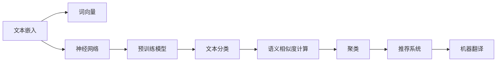

                 

# 【LangChain编程：从入门到实践】文本嵌入

> 关键词：
- 文本嵌入(Text Embedding)
- 词向量(Word Embeddings)
- 预训练模型(Pre-trained Models)
- 神经网络(Neural Networks)
- 自然语言处理(NLP)
- 深度学习(Deep Learning)
- 语义相似性(Semantic Similarity)

## 1. 背景介绍

### 1.1 问题由来

在自然语言处理（Natural Language Processing, NLP）中，文本嵌入（Text Embedding）是处理文本数据的关键步骤。传统的NLP模型常将文本转换为离散化的词袋模型或TF-IDF等，但这些方法无法捕捉到词与词之间的语义关系和上下文信息。而文本嵌入通过将文本映射到低维空间中，保留了丰富的语义信息，使得模型可以更好地理解文本中的隐含意义。

文本嵌入最初是由Word2Vec和GloVe等词向量模型提出的，逐渐成为深度学习时代的标配。近年来，大语言模型（如BERT、GPT等）的兴起，更是将文本嵌入技术推向了新的高度。本文旨在介绍文本嵌入的核心概念、算法原理以及实际应用，从入门到实践，带读者全面掌握这一重要技术。

### 1.2 问题核心关键点

文本嵌入的核心在于将文本中的词汇转换为向量表示，使得相似的词汇在向量空间中距离较近。传统的词向量模型通过统计语言模型或协同训练等方式构建，存在数据稀疏、维度高等问题。而基于神经网络的文本嵌入，如Word2Vec、GloVe、BERT等，可以更好地捕捉词汇之间的语义关系，且向量维度低，易于处理。

文本嵌入的应用包括但不限于：

- 语义相似度计算：计算两个句子或词汇之间的语义相似度。
- 文本分类：将文本映射到高维空间中，进行分类任务。
- 聚类：对文本进行聚类分析，发现文本间的相似性。
- 推荐系统：通过用户兴趣的文本嵌入，预测用户可能感兴趣的物品。
- 机器翻译：将源语言和目标语言之间的语义映射为向量，进行翻译。

## 2. 核心概念与联系

### 2.1 核心概念概述

文本嵌入的核心概念包括以下几点：

- **文本嵌入**：将文本中的词汇或短语映射为向量表示，使得在向量空间中相似的词汇距离较近。
- **词向量**：每个词汇对应一个向量，向量空间中维度通常为300或500。
- **神经网络**：利用神经网络对词汇进行训练，构建词向量。
- **预训练模型**：在大规模语料库上预训练模型，获得更好的词向量表示。

这些核心概念通过以下Mermaid流程图进行展示：



此图展示了文本嵌入从词向量到实际应用的全过程，其中神经网络和预训练模型是文本嵌入的核心技术。

## 3. 核心算法原理 & 具体操作步骤

### 3.1 算法原理概述

文本嵌入的算法原理主要基于神经网络模型。常用的神经网络模型包括Word2Vec、GloVe和BERT等。这些模型通过在大量文本语料上训练，学习词汇之间的语义关系，并映射到低维向量空间中。

以Word2Vec为例，其基本思路是构建一个浅层神经网络，训练两个任务：词的预测和词的连续上下文预测。通过学习这些预测任务，网络能够自动学习到词汇的向量表示。具体步骤如下：

1. **词向量训练**：将文本数据中的每个词汇映射为向量，使得相似的词汇在向量空间中距离较近。
2. **预测任务**：对于每个词汇，使用神经网络预测其上下文词汇，以及上下文词汇预测该词汇。
3. **反向传播**：通过反向传播算法更新网络参数，最小化预测误差。
4. **嵌入得到**：训练完成后，词汇映射到低维向量空间中，每个词汇对应一个向量。

### 3.2 算法步骤详解

接下来，我们将以Word2Vec为例，详细介绍文本嵌入的具体实现步骤：

**Step 1: 准备数据集**
- 获取一个大规模的文本语料库，如维基百科、新闻等。
- 对语料进行预处理，去除停用词、标点符号等无关信息。

**Step 2: 构建神经网络**
- 使用深度学习框架，如TensorFlow或PyTorch，构建一个浅层神经网络。
- 网络包含输入层、隐藏层和输出层，通常隐藏层包含若干个神经元。

**Step 3: 定义损失函数**
- 对于预测任务，定义交叉熵损失函数，用于衡量预测值和实际值之间的差异。
- 对于连续上下文预测任务，定义平方误差损失函数，用于衡量预测值和实际值之间的距离。

**Step 4: 训练网络**
- 使用随机梯度下降等优化算法，最小化损失函数。
- 每次迭代中，随机选择一批文本数据，输入网络，计算损失，反向传播更新网络参数。
- 重复迭代多次，直到网络收敛。

**Step 5: 生成词向量**
- 训练完成后，每个词汇都被映射为一个低维向量，存储在词向量矩阵中。
- 使用余弦相似度或欧式距离等方法计算词汇间的相似度。

### 3.3 算法优缺点

文本嵌入技术的主要优点包括：

- 捕捉词汇之间的语义关系，提高模型的表达能力。
- 将文本映射到低维空间中，便于处理和存储。
- 可应用于多种NLP任务，如分类、聚类、推荐等。

然而，文本嵌入也存在以下缺点：

- 向量维度较小，难以捕捉复杂的语义信息。
- 对噪声敏感，不同文本库构建的词向量可能有较大差异。
- 计算成本较高，特别是在大规模语料库上训练时。

### 3.4 算法应用领域

文本嵌入技术被广泛应用于以下领域：

- **自然语言处理**：在文本分类、情感分析、命名实体识别等任务中使用，提高模型的准确性。
- **推荐系统**：通过用户和物品的文本嵌入，预测用户可能感兴趣的物品，提高推荐效果。
- **信息检索**：将查询和文档映射到向量空间中，计算相似度，进行文档检索。
- **机器翻译**：将源语言和目标语言的句子转换为向量，进行翻译。
- **知识图谱**：将知识实体和关系映射到向量空间中，进行知识推理。

## 4. 数学模型和公式 & 详细讲解 & 举例说明

### 4.1 数学模型构建

文本嵌入的数学模型通常包括以下几个部分：

- **输入层**：将文本转换为词汇序列，每个词汇对应一个向量。
- **隐藏层**：通过神经网络计算每个词汇的表示向量。
- **输出层**：计算预测结果或上下文预测结果。

以Word2Vec中的连续上下文预测模型为例，其输入为词汇序列，输出为每个词汇在上下文中的预测值，隐藏层为神经网络。

**公式表示如下**：

$$
\text{hidden}_{i} = \text{W}_i \cdot \text{input}_{i} + \text{b}_i
$$

$$
\text{output}_{i} = \sigma(\text{hidden}_{i})
$$

其中，$\text{hidden}_{i}$表示隐藏层的输出，$\text{input}_{i}$表示输入层，$\text{W}_i$和$\text{b}_i$为神经网络的参数，$\sigma$为激活函数。

### 4.2 公式推导过程

接下来，我们以连续上下文预测模型为例，进行公式推导：

**Step 1: 构建损失函数**
- 对于预测任务，定义交叉熵损失函数为：

$$
L_1 = -\frac{1}{n} \sum_{i=1}^{n} \sum_{j=1}^{m} \text{y}_{ij} \log(\text{output}_{ij})
$$

其中，$n$表示文本数，$m$表示上下文大小，$\text{y}_{ij}$表示词汇$i$在上下文$j$中是否出现，$\text{output}_{ij}$表示预测值。

**Step 2: 定义上下文预测损失函数**
- 对于连续上下文预测任务，定义平方误差损失函数为：

$$
L_2 = -\frac{1}{n} \sum_{i=1}^{n} \sum_{j=1}^{m} (\text{output}_{ij} - \text{target}_{ij})^2
$$

其中，$\text{target}_{ij}$表示词汇$i$在上下文$j$中的真实出现概率。

**Step 3: 计算梯度**
- 使用反向传播算法计算梯度，更新网络参数：

$$
\frac{\partial L}{\partial \text{W}_i} = \frac{\partial L}{\partial \text{hidden}_{i}} \cdot \frac{\partial \text{hidden}_{i}}{\partial \text{input}_{i}} \cdot \frac{\partial \text{input}_{i}}{\partial \text{W}_i}
$$

$$
\frac{\partial L}{\partial \text{b}_i} = \frac{\partial L}{\partial \text{hidden}_{i}}
$$

其中，$\frac{\partial L}{\partial \text{hidden}_{i}}$为损失函数对隐藏层的梯度，$\frac{\partial \text{hidden}_{i}}{\partial \text{input}_{i}}$为隐藏层到输入层的导数，$\frac{\partial \text{input}_{i}}{\partial \text{W}_i}$为输入层到权重矩阵的导数。

### 4.3 案例分析与讲解

以下是一个简单的Word2Vec案例，展示了如何构建和训练词向量模型：

**案例分析：训练电影评论情感分析模型**

1. **数据准备**：获取大规模电影评论数据集，去除无关信息，构建词汇表。

2. **模型构建**：使用PyTorch框架，构建一个简单的神经网络，输入层和输出层分别映射为词汇表大小，隐藏层包含100个神经元。

3. **损失函数定义**：使用交叉熵损失函数，衡量预测情感分类与真实情感分类的差异。

4. **训练网络**：随机选择一批数据，输入网络，计算损失，反向传播更新参数。

5. **生成词向量**：训练完成后，使用余弦相似度计算词汇间的相似度，用于情感分类任务。

## 5. 项目实践：代码实例和详细解释说明

### 5.1 开发环境搭建

在开始项目实践之前，需要搭建好开发环境。以下是使用Python进行PyTorch开发的流程：

1. 安装Anaconda：从官网下载并安装Anaconda，用于创建独立的Python环境。

2. 创建并激活虚拟环境：
```bash
conda create -n pytorch-env python=3.8 
conda activate pytorch-env
```

3. 安装PyTorch：根据CUDA版本，从官网获取对应的安装命令。例如：
```bash
conda install pytorch torchvision torchaudio cudatoolkit=11.1 -c pytorch -c conda-forge
```

4. 安装TensorFlow：
```bash
conda install tensorflow -c tf
```

5. 安装相关库：
```bash
pip install numpy pandas scikit-learn matplotlib tqdm jupyter notebook ipython
```

完成上述步骤后，即可在`pytorch-env`环境中进行项目开发。

### 5.2 源代码详细实现

下面以Word2Vec为例，展示代码实现：

```python
import torch
import torch.nn as nn
import torch.optim as optim
import torchtext.datasets as datasets
import torchtext.data as data

class Word2Vec(nn.Module):
    def __init__(self, vocabulary_size, embedding_dim):
        super(Word2Vec, self).__init__()
        self.embedding = nn.Embedding(vocabulary_size, embedding_dim)
        self.fc = nn.Linear(embedding_dim, 1)
        
    def forward(self, input):
        embedded = self.embedding(input)
        hidden = self.fc(embedded)
        return hidden
    
# 加载数据集
train_data, test_data = datasets.IMDB.load_data()
tokenized_data = data.BucketIterator(train_data, test_data, batch_size=16)

# 定义网络
embedding_dim = 100
model = Word2Vec(len(tokenized_data.vocab), embedding_dim)

# 定义损失函数和优化器
criterion = nn.BCELoss()
optimizer = optim.SGD(model.parameters(), lr=0.01)

# 训练网络
epochs = 10
for epoch in range(epochs):
    for batch in tokenized_data:
        optimizer.zero_grad()
        output = model(batch)
        loss = criterion(output, batch.labels)
        loss.backward()
        optimizer.step()

# 测试模型
correct = 0
total = 0
with torch.no_grad():
    for batch in test_data:
        output = model(batch)
        _, predicted = torch.max(output, 1)
        total += batch.labels.size(0)
        correct += (predicted == batch.labels).sum().item()

print(f"Accuracy: {100 * correct / total:.2f}%")
```

**代码解读与分析**：

- **数据准备**：使用PyTorch的`datasets`模块，加载IMDB数据集，将文本数据转换为词汇序列。
- **模型定义**：定义一个简单的神经网络，包含嵌入层和全连接层，用于映射词汇到向量空间。
- **损失函数和优化器**：使用交叉熵损失函数和随机梯度下降优化器。
- **训练网络**：在每个epoch中，随机选择一批数据，输入网络，计算损失，反向传播更新参数。
- **测试模型**：计算模型在测试集上的准确率，评估模型性能。

## 6. 实际应用场景

### 6.1 智能推荐系统

文本嵌入在智能推荐系统中的应用非常广泛。通过将用户和物品的文本描述映射到向量空间中，计算相似度，可以推荐用户可能感兴趣的商品、文章、视频等。

以下是一个简单的文本推荐系统的实现案例：

**案例分析：推荐电影评分**

1. **数据准备**：获取电影评分数据集，构建用户和电影的词汇表。

2. **模型构建**：使用Word2Vec模型，将用户和电影的文本描述映射到向量空间中。

3. **相似度计算**：计算用户和电影的向量相似度，推荐评分较高的电影。

4. **评估模型**：计算推荐系统的效果指标，如准确率、召回率等。

5. **优化模型**：根据效果指标，调整模型参数，优化推荐效果。

### 6.2 情感分析

文本嵌入在情感分析中的应用也非常重要。通过将文本映射到向量空间中，可以计算情感分类任务的准确率。

以下是一个简单的情感分析系统的实现案例：

**案例分析：情感分类**

1. **数据准备**：获取电影评论数据集，去除无关信息，构建词汇表。

2. **模型构建**：使用Word2Vec模型，将文本映射到向量空间中。

3. **情感分类**：使用余弦相似度计算文本的情感分类向量，判断情感类别。

4. **评估模型**：计算情感分类任务的准确率、F1-score等指标。

5. **优化模型**：根据效果指标，调整模型参数，优化情感分类效果。

### 6.3 自然语言生成

文本嵌入还可以用于自然语言生成任务，如文本摘要、对话生成等。通过将文本映射到向量空间中，可以生成与输入文本语义相似的新文本。

以下是一个简单的文本生成系统的实现案例：

**案例分析：生成电影评论**

1. **数据准备**：获取电影评论数据集，构建词汇表。

2. **模型构建**：使用Word2Vec模型，将文本映射到向量空间中。

3. **生成文本**：使用生成模型，根据输入文本生成新的电影评论。

4. **评估模型**：计算生成文本与真实文本的相似度。

5. **优化模型**：根据生成文本的质量，调整模型参数，优化生成效果。

## 7. 工具和资源推荐

### 7.1 学习资源推荐

为了帮助开发者系统掌握文本嵌入的核心概念和实践技巧，这里推荐一些优质的学习资源：

1. 《深度学习入门：基于Python的理论与实现》：由深度学习专家撰写，深入浅出地介绍了深度学习的基本理论和实践技巧，涵盖文本嵌入等前沿话题。

2. 《自然语言处理入门：基于Python的理论与实现》：介绍自然语言处理的基本理论和实现方法，涵盖了文本嵌入、情感分析、机器翻译等重要技术。

3. 《神经网络与深度学习》：斯坦福大学开设的深度学习经典课程，详细介绍了神经网络的基本理论和实践方法，包含文本嵌入等关键技术。

4. TensorFlow官方文档：包含TensorFlow框架的详细使用教程，涵盖文本嵌入等NLP任务开发的代码实现。

5. PyTorch官方文档：包含PyTorch框架的详细使用教程，涵盖文本嵌入等NLP任务开发的代码实现。

通过对这些资源的学习实践，相信你一定能够快速掌握文本嵌入的核心技术，并用于解决实际的NLP问题。

### 7.2 开发工具推荐

高效的开发离不开优秀的工具支持。以下是几款用于文本嵌入开发的常用工具：

1. PyTorch：基于Python的开源深度学习框架，灵活动态的计算图，适合快速迭代研究。支持TensorFlow、PyTorch等深度学习框架。

2. TensorFlow：由Google主导开发的开源深度学习框架，生产部署方便，适合大规模工程应用。支持TensorFlow等深度学习框架。

3. Weights & Biases：模型训练的实验跟踪工具，可以记录和可视化模型训练过程中的各项指标，方便对比和调优。与主流深度学习框架无缝集成。

4. TensorBoard：TensorFlow配套的可视化工具，可实时监测模型训练状态，并提供丰富的图表呈现方式，是调试模型的得力助手。

5. Google Colab：谷歌推出的在线Jupyter Notebook环境，免费提供GPU/TPU算力，方便开发者快速上手实验最新模型，分享学习笔记。

合理利用这些工具，可以显著提升文本嵌入任务的开发效率，加快创新迭代的步伐。

### 7.3 相关论文推荐

文本嵌入技术的发展源于学界的持续研究。以下是几篇奠基性的相关论文，推荐阅读：

1. Word2Vec：《Distributed Representations of Words and Phrases and their Compositionality》：提出Word2Vec模型，基于神经网络进行词向量的训练。

2. GloVe：《Global Vectors for Word Representation》：提出GloVe模型，基于共现矩阵进行词向量的训练。

3. BERT：《BERT: Pre-training of Deep Bidirectional Transformers for Language Understanding》：提出BERT模型，利用自监督学习进行词向量的训练。

4. ELMo：《Deep Contextualized Word Representations》：提出ELMo模型，通过上下文信息进行词向量的训练。

5. T5：《Exploring the Limits of Transfer Learning with a Unified Text-to-Text Transformer》：提出T5模型，通过自监督学习进行预训练，可以用于多种NLP任务。

这些论文代表了大语言模型和文本嵌入技术的发展脉络。通过学习这些前沿成果，可以帮助研究者把握学科前进方向，激发更多的创新灵感。

## 8. 总结：未来发展趋势与挑战

### 8.1 总结

本文对文本嵌入的核心概念、算法原理以及实际应用进行了全面系统的介绍。从Word2Vec、GloVe到BERT、T5，展示了文本嵌入技术的发展历程。文本嵌入技术在自然语言处理中的应用广泛，从情感分析、推荐系统到文本生成、对话系统，文本嵌入为各种NLP任务提供了强大的支持。通过本文的系统梳理，可以看到，文本嵌入技术正在成为NLP领域的重要范式，极大地拓展了文本数据的处理能力，为构建智能系统提供了坚实的基础。

### 8.2 未来发展趋势

展望未来，文本嵌入技术将呈现以下几个发展趋势：

1. **向量空间维度的增加**：随着预训练模型的发展，向量空间的维度将不断增加，可以更好地捕捉复杂的语义信息。

2. **模型的预训练**：通过大规模语料库的预训练，提升文本嵌入的质量，使其更加稳定和泛化性强。

3. **多模态融合**：将文本嵌入与其他模态（如视觉、听觉）的信息结合，提高多模态数据融合的效率和效果。

4. **小样本学习**：在数据稀缺的情况下，通过少样本学习技术，提升模型对新数据的适应能力。

5. **自监督学习**：通过自监督学习技术，提高模型的鲁棒性和泛化能力，减少对标注数据的依赖。

6. **迁移学习**：通过迁移学习，将预训练模型在不同领域之间的知识进行转移，提升模型的泛化能力。

这些趋势展示了文本嵌入技术的广阔前景，随着技术的不断演进，文本嵌入技术将在更多领域得到应用，为人工智能的发展提供新的动力。

### 8.3 面临的挑战

尽管文本嵌入技术已经取得了显著成果，但在迈向更广泛应用的过程中，仍面临以下挑战：

1. **计算资源需求**：大规模语料库和深度模型的训练需要大量的计算资源，如何降低计算成本，提高训练效率，是亟待解决的问题。

2. **模型泛化能力**：文本嵌入模型在不同领域、不同数据集上的泛化能力有待提升，避免模型在特定数据集上过拟合。

3. **数据隐私和伦理**：在文本嵌入中，如何保护用户隐私和数据安全，避免模型对敏感信息的泄露，是重要的研究方向。

4. **模型的可解释性**：文本嵌入模型的决策过程缺乏可解释性，难以理解模型内部的工作机制，限制了其应用场景。

5. **模型的公平性**：文本嵌入模型可能存在性别、种族等偏见，如何消除模型偏见，提升模型的公平性，是重要的研究方向。

6. **模型的鲁棒性**：文本嵌入模型对噪声和攻击的鲁棒性有待提高，避免模型在攻击下失效。

这些挑战展示了文本嵌入技术的复杂性和多样性，需要在算法、数据、工程等多个层面进行深入研究。

### 8.4 研究展望

面对文本嵌入技术面临的挑战，未来的研究需要在以下几个方面寻求新的突破：

1. **小样本学习的改进**：开发更加高效的小样本学习算法，在数据稀缺的情况下，提升模型的适应能力。

2. **多模态融合的创新**：探索新的多模态融合方法，提高跨模态数据的协同建模能力。

3. **预训练模型的优化**：优化预训练模型的训练策略，提高模型的泛化能力和鲁棒性。

4. **隐私保护技术的开发**：开发新的隐私保护技术，如差分隐私、联邦学习等，保护用户隐私和数据安全。

5. **可解释性模型的构建**：构建可解释性更强的模型，提高模型的透明度和可靠性。

6. **公平性模型的研究**：研究公平性模型，消除模型中的偏见，提升模型的公平性和公正性。

这些研究方向的探索，必将引领文本嵌入技术迈向更高的台阶，为构建安全、可靠、可解释的智能系统铺平道路。面向未来，文本嵌入技术还需要与其他人工智能技术进行更深入的融合，如知识表示、因果推理、强化学习等，多路径协同发力，共同推动自然语言理解和智能交互系统的进步。只有勇于创新、敢于突破，才能不断拓展文本嵌入技术的边界，让智能技术更好地造福人类社会。

## 9. 附录：常见问题与解答

**Q1：文本嵌入有哪些应用？**

A: 文本嵌入在自然语言处理中有着广泛的应用，包括但不限于：

- 情感分析：将文本映射到向量空间中，计算情感分类任务。
- 推荐系统：通过用户和物品的文本描述，推荐用户可能感兴趣的商品、文章等。
- 信息检索：将查询和文档映射到向量空间中，计算相似度，进行文档检索。
- 机器翻译：将源语言和目标语言的句子转换为向量，进行翻译。
- 知识图谱：将知识实体和关系映射到向量空间中，进行知识推理。

**Q2：文本嵌入的计算成本较高，如何解决？**

A: 文本嵌入的计算成本较高，可以通过以下方法进行优化：

- **并行计算**：使用多核CPU、GPU、TPU等硬件设备，进行并行计算，提高计算效率。
- **模型裁剪**：去除不必要的层和参数，减小模型尺寸，加快推理速度。
- **量化加速**：将浮点模型转为定点模型，压缩存储空间，提高计算效率。
- **分布式训练**：使用分布式训练技术，在多个设备上进行训练，提高训练效率。

**Q3：文本嵌入的向量空间维度较小，如何解决？**

A: 文本嵌入的向量空间维度较小，可以通过以下方法进行扩展：

- **预训练模型**：使用预训练模型，如BERT、T5等，学习更复杂的语义关系，提高向量空间的维度。
- **多模态融合**：将文本嵌入与其他模态（如视觉、听觉）的信息结合，提高多模态数据融合的效率和效果。
- **小样本学习**：在数据稀缺的情况下，通过少样本学习技术，提升模型的适应能力。

**Q4：文本嵌入的鲁棒性不足，如何解决？**

A: 文本嵌入的鲁棒性不足，可以通过以下方法进行改进：

- **数据增强**：通过回译、近义替换等方式扩充训练集，提高模型的鲁棒性。
- **正则化技术**：使用L2正则、Dropout、Early Stopping等正则化技术，防止模型过度适应小规模训练集。
- **对抗训练**：加入对抗样本，提高模型鲁棒性。
- **参数高效微调**：只调整少量模型参数，减小需优化的参数量，避免模型过拟合。

**Q5：文本嵌入的模型可解释性不足，如何解决？**

A: 文本嵌入的模型可解释性不足，可以通过以下方法进行改进：

- **可解释性模型**：构建可解释性更强的模型，提高模型的透明度和可靠性。
- **对抗样本分析**：使用对抗样本分析技术，识别模型决策的关键特征，增强输出解释的因果性和逻辑性。
- **符号化推理**：引入符号化的先验知识，如知识图谱、逻辑规则等，与神经网络模型进行融合，引导微调过程学习更准确、合理的语言模型。

这些方法可以帮助提高文本嵌入的鲁棒性和可解释性，使模型在实际应用中更加可靠和安全。

---

作者：禅与计算机程序设计艺术 / Zen and the Art of Computer Programming

