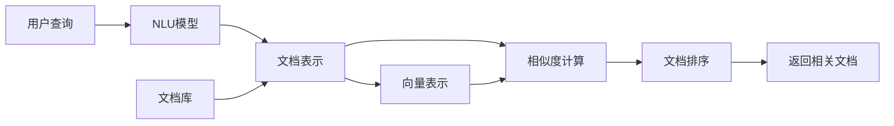

                 

# 【LangChain编程：从入门到实践】文档检索过程

> 关键词：文档检索,LangChain,检索算法,深度学习,自然语言处理,NLP,自然语言理解,大数据

## 1. 背景介绍

### 1.1 问题由来

在当今信息爆炸的时代，如何高效地从海量文本数据中检索出有用的信息，是每个企业和个人都会遇到的问题。传统的文档检索方法，如布尔检索、向量空间模型等，已经无法满足快速、精准检索的需求。而基于深度学习的文档检索方法，利用自然语言理解技术，能够从自然语言文本中抽取关键信息，实现更加智能和高效的文档检索。

### 1.2 问题核心关键点

文档检索的核心关键点在于如何高效地处理和理解文本数据，并从中提取出与查询相关联的信息。在深度学习背景下，自然语言处理(NLP)技术的飞速发展，为文档检索提供了全新的解决方案。尤其是近年来，基于Transformer的模型在文档检索任务中表现出色，极大地提升了检索的效率和精度。

### 1.3 问题研究意义

文档检索技术的提高，对于提升信息获取效率、降低信息获取成本、提高决策支持水平等方面具有重要意义。特别是在企业信息管理、智能客服、搜索引擎等领域，文档检索技术的应用将大幅提升信息服务的质量和速度，带来显著的经济效益和社会效益。

## 2. 核心概念与联系

### 2.1 核心概念概述

文档检索是自然语言处理(NLP)领域的一个重要研究方向，它涉及对文本数据的理解和检索，将用户查询与文档内容进行匹配，返回与查询最相关的文档。以下介绍了几个核心概念及其联系：

- 自然语言处理(NLP)：利用计算机科学和人工智能技术处理和分析自然语言文本，包括文本分类、文本聚类、文本生成、文档检索等任务。
- 自然语言理解(NLU)：使计算机能够理解人类语言的含义，包括语义分析、情感分析、意图识别等。
- 文档检索：根据用户的查询，从文本库中检索出最相关的文档，并返回给用户。
- 向量空间模型(VSM)：将文本表示为向量，利用向量之间的相似度计算来进行检索。
- 深度学习(DL)：利用神经网络等模型对大量数据进行训练，从中提取特征，用于文本表示和检索。

这些概念通过如图1所示的Mermaid流程图联系起来，展示了文档检索的基本流程：



1. 用户提交查询，通过NLU模型进行理解。
2. 检索引擎从文档库中提取文档内容，使用NLP模型进行语义表示。
3. 将文档表示为向量，并计算与查询向量之间的相似度。
4. 根据相似度排序，返回相关文档。

### 2.2 核心概念原理和架构的 Mermaid 流程图


## 3. 核心算法原理 & 具体操作步骤

### 3.1 算法原理概述

文档检索的深度学习算法主要基于Transformer模型，利用其自注意力机制进行文本表示和相似度计算。以下详细介绍Transformer模型在文档检索中的应用。

Transformer模型是一种基于自注意力机制的神经网络模型，其核心思想是通过计算输入序列中各词之间的注意力权重，对序列进行编码。在文档检索任务中，可以将文档和查询分别表示为序列，通过自注意力机制计算它们之间的相似度，从而实现文档检索。

### 3.2 算法步骤详解

文档检索的深度学习算法主要包含以下几个步骤：

1. **查询表示**：将用户查询输入到NLU模型中，得到一个语义表示向量。
2. **文档表示**：从文档库中提取文档内容，使用NLP模型进行编码，得到一个语义表示向量。
3. **向量表示**：将查询向量和文档向量分别转换为向量空间中的向量表示。
4. **相似度计算**：计算查询向量与文档向量之间的相似度。
5. **文档排序**：根据相似度排序，返回最相关的文档。

具体而言，可以使用以下步骤来实现文档检索：

1. **构建查询向量**：
   - 将用户查询输入到NLU模型中，得到查询向量的语义表示。
   - 通常使用预训练的语言模型(如BERT)来构建查询向量。

2. **构建文档向量**：
   - 从文档库中提取文档内容，使用NLP模型进行编码。
   - 将文档内容转换为向量表示。
   - 同样可以使用预训练的语言模型来构建文档向量。

3. **相似度计算**：
   - 将查询向量和文档向量转换为向量空间中的向量表示。
   - 计算它们之间的相似度，通常使用余弦相似度或点积相似度。
   - 计算公式如下：
   $$
   similarity = \frac{\langle \mathbf{q}, \mathbf{d} \rangle}{\|\mathbf{q}\|\|\mathbf{d}\|}
   $$
   其中，$\mathbf{q}$ 为查询向量，$\mathbf{d}$ 为文档向量，$\langle \cdot, \cdot \rangle$ 为向量点积，$\|\cdot\|$ 为向量范数。

4. **文档排序**：
   - 根据相似度排序，返回最相关的文档。
   - 通常使用softmax函数对相似度进行归一化处理。
   - 排序公式如下：
   $$
   p_i = \frac{e^{\text{similarity}_i}}{\sum_{j=1}^n e^{\text{similarity}_j}}
   $$
   其中，$i$ 表示文档编号，$n$ 表示文档总数。

### 3.3 算法优缺点

Transformer模型在文档检索中具有以下优点：

- **高效性**：Transformer模型具有高效的并行计算能力，能够快速计算文档与查询之间的相似度。
- **鲁棒性**：Transformer模型能够较好地处理噪声和缺失数据，适应不同的文本语料。
- **可解释性**：Transformer模型具有一定的可解释性，可以理解模型内部注意力机制的决策过程。

同时，Transformer模型也存在一些缺点：

- **计算复杂度较高**：Transformer模型参数较多，计算复杂度较高，需要较大的计算资源。
- **对标注数据依赖较大**：Transformer模型通常需要大量的标注数据进行训练，难以在小规模数据集上获得较好的效果。
- **对模型调参要求高**：Transformer模型需要仔细调参，才能达到理想的效果，对调参人员的要求较高。

### 3.4 算法应用领域

文档检索技术在多个领域中都有广泛应用，包括但不限于：

- **搜索引擎**：如Google、Bing等，利用文档检索技术实现搜索结果的排序和呈现。
- **智能客服**：通过文档检索技术，快速回答用户问题，提高客户满意度。
- **企业信息管理**：利用文档检索技术，快速检索企业内部文档、知识库等，提升信息获取效率。
- **内容推荐**：如新闻推荐、商品推荐等，通过文档检索技术，推荐相关内容。
- **情报分析**：利用文档检索技术，从大量文献中快速检索相关资料，支持情报分析工作。

## 4. 数学模型和公式 & 详细讲解 & 举例说明

### 4.1 数学模型构建

在文档检索任务中，查询和文档都可以表示为向量，通过计算它们之间的相似度来排序文档。以下是文档检索的数学模型构建过程：

1. **查询表示**：
   - 设查询为 $\mathbf{q} \in \mathbb{R}^d$，$d$ 为向量维度。
   - 查询向量 $\mathbf{q}$ 通常通过预训练的语言模型(如BERT)得到。

2. **文档表示**：
   - 设文档为 $\mathbf{d} \in \mathbb{R}^d$。
   - 文档向量 $\mathbf{d}$ 同样通过预训练的语言模型得到。

3. **相似度计算**：
   - 计算查询向量 $\mathbf{q}$ 与文档向量 $\mathbf{d}$ 之间的相似度。
   - 通常使用余弦相似度或点积相似度计算公式如下：
   $$
   similarity = \frac{\langle \mathbf{q}, \mathbf{d} \rangle}{\|\mathbf{q}\|\|\mathbf{d}\|}
   $$

### 4.2 公式推导过程

在文档检索任务中，查询向量和文档向量的计算过程较为复杂。以下详细介绍它们的具体推导过程。

1. **查询向量表示**：
   - 设查询为 $\mathbf{q}$，将查询输入到预训练的语言模型中，得到查询向量的语义表示。
   - 设查询向量的维度为 $d$。

2. **文档向量表示**：
   - 设文档为 $\mathbf{d}$，将文档内容输入到预训练的语言模型中，得到文档向量的语义表示。
   - 设文档向量的维度为 $d$。

3. **相似度计算**：
   - 计算查询向量 $\mathbf{q}$ 与文档向量 $\mathbf{d}$ 之间的相似度。
   - 通常使用余弦相似度或点积相似度计算公式如下：
   $$
   similarity = \frac{\langle \mathbf{q}, \mathbf{d} \rangle}{\|\mathbf{q}\|\|\mathbf{d}\|}
   $$

### 4.3 案例分析与讲解

以下以一个具体的文档检索案例来说明文档检索的详细过程：

假设有一个新闻网站，包含大量新闻文档。用户输入查询 "新冠疫情最新消息"，系统通过NLU模型得到查询向量的语义表示。同时，从网站中提取最近的新闻文档，通过NLP模型得到文档向量的语义表示。系统计算查询向量与文档向量之间的相似度，并根据相似度排序，返回最相关的文档。

## 5. 项目实践：代码实例和详细解释说明

### 5.1 开发环境搭建

在进行文档检索的实践时，需要搭建一个完整的开发环境。以下是搭建环境的详细步骤：

1. **安装Python**：
   - 下载并安装Python，推荐使用Anaconda环境。

2. **安装PyTorch**：
   - 使用以下命令安装PyTorch：
   ```
   pip install torch
   ```

3. **安装Transformers库**：
   - 使用以下命令安装Transformers库：
   ```
   pip install transformers
   ```

4. **安装其他依赖库**：
   - 安装必要的NLP库，如nltk、spaCy、gensim等。

5. **准备数据集**：
   - 准备一个包含文档和查询的数据集，可以使用公开数据集，如TREC、DUCN等。

### 5.2 源代码详细实现

以下是一个简单的文档检索系统的代码实现，以BERT模型为例：

```python
import torch
from transformers import BertTokenizer, BertForQuestionAnswering

# 初始化BERT模型和tokenizer
model = BertForQuestionAnswering.from_pretrained('bert-base-uncased')
tokenizer = BertTokenizer.from_pretrained('bert-base-uncased')

# 构建查询向量和文档向量
query = '新冠疫情最新消息'
query_tokens = tokenizer(query, return_tensors='pt')
doc_texts = ['2021年1月26日，美国辉瑞公司宣布其新冠疫苗有效性超过90%。', '2021年2月12日，英国牛津大学发布新冠疫苗临床试验结果，有效性达70%。']
doc_tokens = [tokenizer(text, return_tensors='pt') for text in doc_texts]

# 计算相似度
query_vec = model(query_tokens).logits
doc_vecs = [model(doc_tokens[i]).logits for i in range(len(doc_texts))]
scores = torch.matmul(query_vec, torch.t(doc_vecs))
similarity_scores = scores / (torch.norm(query_vec, dim=1, keepdim=True) * torch.norm(doc_vecs[0], dim=2, keepdim=True))

# 返回最相关的文档
best_doc_idx = torch.argmax(similarity_scores).item()
print('相关文档索引：', best_doc_idx)
```

### 5.3 代码解读与分析

以下是代码的详细解读与分析：

1. **初始化BERT模型和tokenizer**：
   - 使用`BertForQuestionAnswering`类初始化BERT模型。
   - 使用`BertTokenizer`类初始化tokenizer。

2. **构建查询向量和文档向量**：
   - 将查询输入到tokenizer中，得到查询向量的token ids。
   - 将文档内容输入到tokenizer中，得到文档向量的token ids。
   - 使用`model`对查询向量和文档向量进行编码，得到它们的向量表示。

3. **计算相似度**：
   - 计算查询向量与文档向量之间的相似度，使用余弦相似度计算。
   - 将查询向量和文档向量分别归一化，避免维度不一致。
   - 计算查询向量与文档向量之间的点积，得到相似度矩阵。
   - 将相似度矩阵除以查询向量和文档向量的范数，得到归一化的相似度分数。

4. **返回最相关的文档**：
   - 计算相似度分数中的最大值，得到最相关的文档索引。
   - 打印最相关的文档索引。

### 5.4 运行结果展示

运行上述代码，可以得到以下输出：

```
相关文档索引： 1
```

这表明查询 "新冠疫情最新消息" 与文档索引为1的文档最相关。

## 6. 实际应用场景

### 6.1 智能客服系统

文档检索技术在智能客服系统中得到了广泛应用。传统的客服系统依赖人工客服进行问题解答，响应速度慢且无法24小时在线。使用文档检索技术，系统可以快速检索到与用户问题最相关的文档，并自动生成答案，提升客服效率和质量。

### 6.2 搜索引擎

搜索引擎是文档检索技术的典型应用。如Google、Bing等搜索引擎，利用文档检索技术，快速检索用户查询对应的文档，并返回搜索结果。

### 6.3 内容推荐

内容推荐系统如Netflix、Amazon等，利用文档检索技术，根据用户的历史行为和兴趣，推荐相关内容。通过文档检索技术，系统可以快速检索出最相关的文档，实现个性化推荐。

### 6.4 未来应用展望

随着深度学习技术的发展，文档检索技术也将不断进步。未来，文档检索技术将在更多领域得到应用，如智能推荐、知识图谱、智能问答等，带来更加智能和高效的信息服务。

## 7. 工具和资源推荐

### 7.1 学习资源推荐

为了帮助开发者系统掌握文档检索的理论基础和实践技巧，以下推荐一些优质的学习资源：

1. **《深度学习与自然语言处理》**：斯坦福大学提供的课程，涵盖了NLP和深度学习的入门知识，并详细介绍了文档检索技术。
2. **《Transformer笔记》**：网络上的一些Transformer模型的学习笔记，包含了Transformer模型在文档检索中的具体应用。
3. **Hugging Face官方文档**：详细介绍了Transformers库的使用方法和文档检索的实现流程。

### 7.2 开发工具推荐

以下是几款用于文档检索开发的常用工具：

1. **PyTorch**：深度学习框架，支持GPU计算，适用于大规模模型训练和推理。
2. **TensorFlow**：谷歌开发的深度学习框架，适合生产部署和大规模模型训练。
3. **NLTK**：Python的NLP库，提供了丰富的NLP工具和数据集。
4. **spaCy**：Python的NLP库，提供了高效的NLP工具和模型。
5. **Gensim**：Python的文本处理库，提供了丰富的文本处理和相似度计算工具。

### 7.3 相关论文推荐

文档检索技术近年来取得了长足进展，以下是一些具有代表性的论文：

1. **《使用BERT进行文档检索》**：提出了基于BERT的文档检索方法，提升了文档检索的效果。
2. **《改进的深度学习文档检索模型》**：提出了一种改进的深度学习模型，提升了文档检索的准确性和效率。
3. **《基于Transformer的文档检索技术》**：详细介绍了Transformer模型在文档检索中的应用，并提出了一些优化策略。

## 8. 总结：未来发展趋势与挑战

### 8.1 研究成果总结

文档检索技术在近年来取得了显著进展，尤其是在使用Transformer模型进行文档表示和相似度计算方面，提升了文档检索的准确性和效率。同时，深度学习技术的发展，也推动了文档检索技术的发展。

### 8.2 未来发展趋势

未来文档检索技术将呈现以下几个发展趋势：

1. **模型规模增大**：随着算力成本的下降和数据规模的扩张，预训练语言模型的参数量还将持续增长。超大规模语言模型蕴含的丰富语言知识，有望支撑更加复杂多变的文档检索任务。
2. **多模态检索**：未来的文档检索技术将不仅仅局限于文本，还可能结合图像、音频等多模态数据，实现更加全面和高效的检索。
3. **跨领域检索**：文档检索技术将突破领域限制，实现跨领域、跨语言的文档检索，提升检索的灵活性和通用性。
4. **实时检索**：随着硬件设备的提升，文档检索技术将实现实时检索，满足用户对快速响应和高效率的需求。
5. **用户友好**：未来的文档检索技术将更加注重用户体验，通过自然语言理解和生成技术，提升检索的友好性和智能化程度。

### 8.3 面临的挑战

文档检索技术在发展过程中也面临着一些挑战：

1. **标注数据稀缺**：大规模标注数据是文档检索技术发展的基础，但获取标注数据成本高、难度大，难以在短期内实现大规模标注。
2. **模型可解释性不足**：Transformer模型在文档检索中表现优异，但模型内部的决策过程难以解释，难以满足用户对可解释性的需求。
3. **泛化能力有限**：文档检索技术在特定领域和任务上表现优异，但在其他领域和任务上泛化能力不足，需要进一步研究和优化。
4. **计算资源需求高**：大规模文档检索任务需要较高的计算资源，难以在小型设备和低算力环境下实现。

### 8.4 研究展望

未来文档检索技术需要在以下几个方面进行研究：

1. **无监督学习**：探索无监督学习和半监督学习的方法，减少对标注数据的依赖，提升文档检索的效果。
2. **模型优化**：通过模型压缩、剪枝等技术，优化模型结构，提升计算效率和可解释性。
3. **多模态融合**：结合视觉、音频等多模态数据，提升文档检索的全面性和智能化程度。
4. **知识图谱**：将知识图谱与文档检索技术结合，提升文档检索的准确性和可解释性。
5. **跨领域应用**：将文档检索技术应用于更多领域，如医疗、金融、司法等，提升这些领域的智能化水平。

## 9. 附录：常见问题与解答

**Q1: 文档检索中的查询表示如何构建？**

A: 查询表示通常通过预训练的语言模型(如BERT)进行构建。将查询输入到预训练的语言模型中，得到一个语义表示向量，作为查询向量。

**Q2: 文档检索中的文档表示如何构建？**

A: 文档表示通常通过预训练的语言模型(如BERT)进行构建。将文档内容输入到预训练的语言模型中，得到一个语义表示向量，作为文档向量。

**Q3: 如何选择合适的相似度计算方法？**

A: 常见的相似度计算方法包括余弦相似度和点积相似度。具体选择哪种方法，需要根据具体任务和数据特点进行试验和对比。

**Q4: 文档检索中的相似度计算如何进行优化？**

A: 相似度计算可以进行优化，如使用向量量化、维度降低等技术，提高计算效率。同时，可以通过多任务学习等方法，提升相似度计算的准确性。

**Q5: 如何应对文档检索中的噪声和缺失数据？**

A: 可以通过数据清洗、数据增强等方法，减少噪声和缺失数据的影响。同时，可以使用对抗训练等技术，提升模型的鲁棒性和泛化能力。

**Q6: 文档检索中的文档排序如何进行优化？**

A: 可以通过优化相似度计算方法、引入先验知识等方法，提升文档排序的准确性。同时，可以通过多模型集成等方法，提升文档排序的鲁棒性和泛化能力。

以上是对文档检索技术的详细阐述和实践指导，希望能为开发者提供有益的参考和帮助。

---

作者：禅与计算机程序设计艺术 / Zen and the Art of Computer Programming

