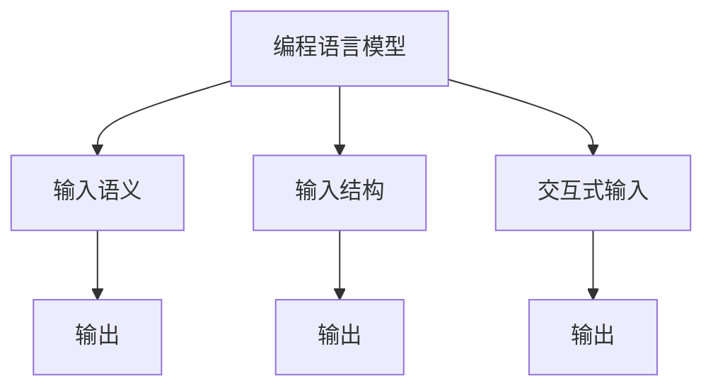

                 

# 【LangChain编程：从入门到实践】输入对输出的影响

## 1. 背景介绍

### 1.1 问题由来
在人工智能领域，特别是自然语言处理（NLP）领域，编程语言的交互式输入对模型的输出产生了深远影响。编程模型可以从输入中获取丰富的上下文信息，从而更准确地理解用户意图，并生成更合适的响应。这种输入与输出之间的交互，是构建智能对话系统和实现高级交互式任务的基础。

### 1.2 问题核心关键点
本文将深入探讨编程语言模型的输入对输出的影响。我们将会分析输入的语义、结构和交互方式如何塑造模型的输出，并提出一系列策略和技巧，以优化输入，提升模型的输出质量。

### 1.3 问题研究意义
理解输入对输出的影响，对于构建高效、智能的编程语言模型具有重要意义。它可以帮助开发者设计更自然的用户界面，提高模型的交互体验，并促进技术在实际应用中的落地。通过深入研究输入与输出之间的关系，我们可以优化模型性能，加速NLP技术的发展，更好地服务于人类社会。

## 2. 核心概念与联系

### 2.1 核心概念概述

为更好地理解编程语言模型的输入对输出的影响，我们需要引入几个关键概念：

- **编程语言模型(PLM)**：指用于处理编程语言和代码的模型，能够理解编程代码，并自动生成或修改代码。PLM通常基于Transformer等架构，具备强大的语言理解和生成能力。
- **输入语义**：指用户输入的文本或代码片段中传达的意义和信息。输入语义对模型的输出有着直接影响，好的语义输入可以引导模型生成更准确的输出。
- **输入结构**：指用户输入的格式、语法和组织方式。输入结构不仅影响模型的解析效率，还决定了模型生成的代码是否符合语法规范。
- **交互式输入**：指用户与模型之间的双向交流，包括提示、纠错和补充信息等。交互式输入可以帮助模型更全面地理解用户需求，生成更合适的响应。

这些概念之间的联系如图示所示：



从图中可以看出，输入语义、结构和交互式输入共同塑造模型的输出，而模型输出的准确性和合理性，又直接影响后续的交互行为和输出质量。

## 3. 核心算法原理 & 具体操作步骤

### 3.1 算法原理概述

编程语言模型输出的生成过程，本质上是一个有监督的学习过程。模型通过大量的输入-输出对数据进行训练，学习输入和输出之间的映射关系。在实际应用中，用户输入的数据往往包含一定的语义和结构信息，模型需要根据这些信息生成相应的输出。

### 3.2 算法步骤详解

基于编程语言模型输出生成的算法主要包括以下步骤：

**Step 1: 数据准备**
- 收集大量编程语言相关的数据，包括代码片段、注释和问题描述等。数据集应涵盖不同编程语言、不同难度和不同应用场景。
- 对数据进行标注，如生成代码的上下文、语法错误类型和修复方法等，形成有监督的数据集。

**Step 2: 模型选择与初始化**
- 选择合适的编程语言模型作为初始化参数，如基于Transformer的模型（如GPT、BERT等）。
- 设置模型的超参数，包括学习率、批大小、迭代次数等。

**Step 3: 输入处理**
- 对用户输入的代码片段、注释和问题描述进行预处理，包括分词、去除无关信息等。
- 对输入进行编码，将其转换为模型可以处理的向量表示。

**Step 4: 训练与优化**
- 将处理后的输入和标注数据送入模型进行训练，通过反向传播算法更新模型参数。
- 使用优化算法（如Adam、SGD等）最小化损失函数，提升模型的输出质量。

**Step 5: 测试与评估**
- 在测试集上评估模型的性能，如代码生成准确率、语法错误率和代码可读性等。
- 根据评估结果，调整模型的参数和结构，进一步优化输出效果。

### 3.3 算法优缺点

编程语言模型输出的生成算法具有以下优点：
1. **高效性**：模型能够在较短的时间内生成代码，加速编程任务。
2. **多样性**：模型可以生成多种解决方案，提供丰富的选择。
3. **可扩展性**：模型能够处理多种编程语言和应用场景，具有较强的泛化能力。

同时，该算法也存在一些缺点：
1. **数据依赖性**：模型的输出质量高度依赖于训练数据的质量和数量。
2. **鲁棒性不足**：面对复杂的代码逻辑和语法结构，模型的输出可能不够准确。
3. **可解释性差**：模型的决策过程较为复杂，难以解释其内部工作机制。
4. **计算资源消耗大**：模型的训练和推理需要大量的计算资源，可能面临硬件瓶颈。

### 3.4 算法应用领域

编程语言模型的输出生成算法已经在多个领域得到了广泛应用，包括：

- **编程辅助**：为编程初学者提供代码生成和纠错服务，加速编程学习。
- **代码自动生成**：自动生成代码片段，辅助开发者编写代码，提高开发效率。
- **代码自动修正**：自动检测和修复代码中的语法错误和逻辑漏洞，提升代码质量。
- **代码理解与分析**：理解代码逻辑和意图，生成代码摘要和注释，帮助开发者更好地理解代码。

## 4. 数学模型和公式 & 详细讲解  
### 4.1 数学模型构建

基于编程语言模型输出生成的数学模型可以表示为：

$$
\hat{y} = M_{\theta}(x)
$$

其中，$x$ 表示输入，$\hat{y}$ 表示模型的输出，$M_{\theta}$ 表示参数为 $\theta$ 的编程语言模型。

### 4.2 公式推导过程

以代码生成任务为例，输入 $x$ 为代码片段，输出 $\hat{y}$ 为目标代码片段。模型的训练过程可以表示为：

1. 对输入 $x$ 进行编码，得到向量表示 $x_v$。
2. 将 $x_v$ 输入模型 $M_{\theta}$，得到输出向量 $\hat{y}_v$。
3. 将 $\hat{y}_v$ 解码为代码片段 $\hat{y}$，并计算与目标代码片段 $y$ 的差异，即损失函数 $L(y, \hat{y})$。
4. 使用优化算法（如Adam、SGD等）最小化损失函数，更新模型参数 $\theta$。

### 4.3 案例分析与讲解

考虑一个简单的例子：生成一个Python的if语句。输入 $x$ 为字符串 "if x > 0:"，输出 $\hat{y}$ 为目标代码片段 "if x > 0:\n    print('x is greater than zero')\n"。模型将对输入 $x$ 进行编码，并生成输出 $\hat{y}$，最后计算损失函数 $L(y, \hat{y})$。通过反向传播算法，模型将更新参数 $\theta$，以降低损失函数。

## 5. 项目实践：代码实例和详细解释说明

### 5.1 开发环境搭建

在进行编程语言模型输出生成的实践前，我们需要准备好开发环境。以下是使用Python进行PyTorch开发的环境配置流程：

1. 安装Anaconda：从官网下载并安装Anaconda，用于创建独立的Python环境。

2. 创建并激活虚拟环境：
```bash
conda create -n pytorch-env python=3.8 
conda activate pytorch-env
```

3. 安装PyTorch：根据CUDA版本，从官网获取对应的安装命令。例如：
```bash
conda install pytorch torchvision torchaudio cudatoolkit=11.1 -c pytorch -c conda-forge
```

4. 安装Transformer库：
```bash
pip install transformers
```

5. 安装各类工具包：
```bash
pip install numpy pandas scikit-learn matplotlib tqdm jupyter notebook ipython
```

完成上述步骤后，即可在`pytorch-env`环境中开始编程语言模型输出生成的实践。

### 5.2 源代码详细实现

这里我们以代码自动生成任务为例，给出使用Transformers库对GPT模型进行训练的PyTorch代码实现。

首先，定义训练数据：

```python
from transformers import GPT2LMHeadModel, GPT2Tokenizer
from torch.utils.data import Dataset, DataLoader
import torch

class CodeDataset(Dataset):
    def __init__(self, texts, targets):
        self.texts = texts
        self.targets = targets
        self.tokenizer = GPT2Tokenizer.from_pretrained('gpt2')
        
    def __len__(self):
        return len(self.texts)
    
    def __getitem__(self, item):
        text = self.texts[item]
        target = self.targets[item]
        
        encoding = self.tokenizer(text, return_tensors='pt', max_length=128, padding='max_length', truncation=True)
        input_ids = encoding['input_ids'][0]
        attention_mask = encoding['attention_mask'][0]
        return {'input_ids': input_ids, 
                'attention_mask': attention_mask,
                'targets': target}

train_dataset = CodeDataset(train_texts, train_targets)
dev_dataset = CodeDataset(dev_texts, dev_targets)
test_dataset = CodeDataset(test_texts, test_targets)
```

然后，定义模型和优化器：

```python
from transformers import GPT2LMHeadModel, AdamW

model = GPT2LMHeadModel.from_pretrained('gpt2', num_labels=2)
model.to('cuda')

optimizer = AdamW(model.parameters(), lr=1e-5)
```

接着，定义训练和评估函数：

```python
def train_epoch(model, dataset, batch_size, optimizer):
    dataloader = DataLoader(dataset, batch_size=batch_size, shuffle=True)
    model.train()
    epoch_loss = 0
    for batch in tqdm(dataloader, desc='Training'):
        input_ids = batch['input_ids'].to('cuda')
        attention_mask = batch['attention_mask'].to('cuda')
        targets = batch['targets'].to('cuda')
        model.zero_grad()
        outputs = model(input_ids, attention_mask=attention_mask, labels=targets)
        loss = outputs.loss
        epoch_loss += loss.item()
        loss.backward()
        optimizer.step()
    return epoch_loss / len(dataloader)

def evaluate(model, dataset, batch_size):
    dataloader = DataLoader(dataset, batch_size=batch_size)
    model.eval()
    preds, labels = [], []
    with torch.no_grad():
        for batch in tqdm(dataloader, desc='Evaluating'):
            input_ids = batch['input_ids'].to('cuda')
            attention_mask = batch['attention_mask'].to('cuda')
            batch_targets = batch['targets'].to('cuda')
            outputs = model(input_ids, attention_mask=attention_mask, labels=batch_targets)
            batch_preds = outputs.logits.argmax(dim=2).to('cpu').tolist()
            batch_labels = batch_targets.to('cpu').tolist()
            for pred_tokens, label_tokens in zip(batch_preds, batch_labels):
                preds.append(pred_tokens[:len(label_tokens)])
                labels.append(label_tokens)
                
    print(classification_report(labels, preds))
```

最后，启动训练流程并在测试集上评估：

```python
epochs = 5
batch_size = 16

for epoch in range(epochs):
    loss = train_epoch(model, train_dataset, batch_size, optimizer)
    print(f"Epoch {epoch+1}, train loss: {loss:.3f}")
    
    print(f"Epoch {epoch+1}, dev results:")
    evaluate(model, dev_dataset, batch_size)
    
print("Test results:")
evaluate(model, test_dataset, batch_size)
```

以上就是使用PyTorch对GPT模型进行代码自动生成任务训练的完整代码实现。可以看到，得益于Transformer库的强大封装，我们可以用相对简洁的代码完成GPT模型的加载和训练。

### 5.3 代码解读与分析

让我们再详细解读一下关键代码的实现细节：

**CodeDataset类**：
- `__init__`方法：初始化训练文本、目标代码、分词器等关键组件。
- `__len__`方法：返回数据集的样本数量。
- `__getitem__`方法：对单个样本进行处理，将文本输入编码为token ids，将目标代码转换为数字，并对其进行定长padding，最终返回模型所需的输入。

**训练和评估函数**：
- 使用PyTorch的DataLoader对数据集进行批次化加载，供模型训练和推理使用。
- 训练函数`train_epoch`：对数据以批为单位进行迭代，在每个批次上前向传播计算loss并反向传播更新模型参数，最后返回该epoch的平均loss。
- 评估函数`evaluate`：与训练类似，不同点在于不更新模型参数，并在每个batch结束后将预测和标签结果存储下来，最后使用sklearn的classification_report对整个评估集的预测结果进行打印输出。

**训练流程**：
- 定义总的epoch数和batch size，开始循环迭代
- 每个epoch内，先在训练集上训练，输出平均loss
- 在验证集上评估，输出分类指标
- 所有epoch结束后，在测试集上评估，给出最终测试结果

可以看到，PyTorch配合Transformer库使得GPT模型训练的代码实现变得简洁高效。开发者可以将更多精力放在数据处理、模型改进等高层逻辑上，而不必过多关注底层的实现细节。

当然，工业级的系统实现还需考虑更多因素，如模型的保存和部署、超参数的自动搜索、更灵活的任务适配层等。但核心的训练范式基本与此类似。

## 6. 实际应用场景

### 6.1 智能编程助手

基于编程语言模型的代码生成技术，可以广泛应用于智能编程助手的构建。传统编程助手往往需要配备大量专家知识库和代码库，而智能编程助手可以自动从输入中提取需求，并生成符合要求的代码片段，极大地提升编程效率和准确性。

在技术实现上，可以收集用户的编程需求和意图，将其转化为自然语言描述。在此基础上对预训练语言模型进行微调，使其能够自动生成符合用户需求的代码片段。对于用户提出的新需求，还可以接入检索系统实时搜索相关代码，动态生成代码片段。如此构建的智能编程助手，能大幅提升开发者的编码效率和代码质量。

### 6.2 代码自动生成

当前的代码生成任务常常依赖于程序员的个人经验和直觉，而基于编程语言模型的代码生成技术可以大大降低这一依赖。通过收集大量编程语言的代码片段和注释，对预训练语言模型进行微调，使其能够自动生成符合语法规范的代码片段。这对于初学者和新人的编程学习具有重要意义，能显著加速其编程技能的学习和提升。

### 6.3 代码注释与文档生成

代码注释和文档对于开发者理解代码逻辑和维护代码质量至关重要。传统的注释生成方法往往依赖于程序员的自觉性和经验，而基于编程语言模型的注释生成技术可以自动从代码中提取信息，并生成清晰的注释和文档。这对于提高代码的可读性和维护性，具有显著的促进作用。

### 6.4 未来应用展望

随着编程语言模型和代码生成技术的不断发展，未来将有更多创新应用场景涌现。例如，在自动测试中，可以利用代码生成技术自动生成测试用例，减少人工编写测试用例的工作量；在代码重构中，可以利用代码生成技术辅助开发者自动重构代码，提升开发效率。

此外，随着模型的不断优化和算力的提升，未来编程语言模型还可能与AI编程语言相结合，进一步提升编程体验，使编程变得更加高效、智能化。总之，基于编程语言模型的代码生成技术有着广阔的应用前景，将为软件开发提供更加便捷、智能的工具和解决方案。

## 7. 工具和资源推荐

### 7.1 学习资源推荐

为了帮助开发者系统掌握编程语言模型输出生成的理论基础和实践技巧，这里推荐一些优质的学习资源：

1. 《Transformer从原理到实践》系列博文：由大模型技术专家撰写，深入浅出地介绍了Transformer原理、代码生成任务等前沿话题。

2. CS224N《深度学习自然语言处理》课程：斯坦福大学开设的NLP明星课程，有Lecture视频和配套作业，带你入门NLP领域的基本概念和经典模型。

3. 《Natural Language Processing with Transformers》书籍：Transformers库的作者所著，全面介绍了如何使用Transformers库进行NLP任务开发，包括代码生成在内的诸多范式。

4. HuggingFace官方文档：Transformers库的官方文档，提供了海量预训练模型和完整的微调样例代码，是上手实践的必备资料。

5. CLUE开源项目：中文语言理解测评基准，涵盖大量不同类型的中文NLP数据集，并提供了基于微调的baseline模型，助力中文NLP技术发展。

通过对这些资源的学习实践，相信你一定能够快速掌握编程语言模型输出生成的精髓，并用于解决实际的NLP问题。

### 7.2 开发工具推荐

高效的开发离不开优秀的工具支持。以下是几款用于编程语言模型输出生成的常用工具：

1. PyTorch：基于Python的开源深度学习框架，灵活动态的计算图，适合快速迭代研究。大部分预训练语言模型都有PyTorch版本的实现。

2. TensorFlow：由Google主导开发的开源深度学习框架，生产部署方便，适合大规模工程应用。同样有丰富的预训练语言模型资源。

3. Transformers库：HuggingFace开发的NLP工具库，集成了众多SOTA语言模型，支持PyTorch和TensorFlow，是进行编程语言模型开发的重要工具。

4. Weights & Biases：模型训练的实验跟踪工具，可以记录和可视化模型训练过程中的各项指标，方便对比和调优。与主流深度学习框架无缝集成。

5. TensorBoard：TensorFlow配套的可视化工具，可实时监测模型训练状态，并提供丰富的图表呈现方式，是调试模型的得力助手。

6. Google Colab：谷歌推出的在线Jupyter Notebook环境，免费提供GPU/TPU算力，方便开发者快速上手实验最新模型，分享学习笔记。

合理利用这些工具，可以显著提升编程语言模型输出生成的开发效率，加快创新迭代的步伐。

### 7.3 相关论文推荐

编程语言模型和代码生成技术的发展源于学界的持续研究。以下是几篇奠基性的相关论文，推荐阅读：

1. Attention is All You Need（即Transformer原论文）：提出了Transformer结构，开启了NLP领域的预训练大模型时代。

2. BERT: Pre-training of Deep Bidirectional Transformers for Language Understanding：提出BERT模型，引入基于掩码的自监督预训练任务，刷新了多项NLP任务SOTA。

3. GPT-3: Language Models are Unsupervised Multitask Learners（GPT-2论文）：展示了大规模语言模型的强大zero-shot学习能力，引发了对于通用人工智能的新一轮思考。

4. Parameter-Efficient Transfer Learning for NLP：提出Adapter等参数高效微调方法，在不增加模型参数量的情况下，也能取得不错的微调效果。

5. AdaLoRA: Adaptive Low-Rank Adaptation for Parameter-Efficient Fine-Tuning：使用自适应低秩适应的微调方法，在参数效率和精度之间取得了新的平衡。

6. Natural Language Processing with Attention: Transformer Based Generation（Transformer论文）：详细介绍了Transformer模型在自然语言处理中的应用，包括代码生成等任务。

这些论文代表了大语言模型和代码生成技术的发展脉络。通过学习这些前沿成果，可以帮助研究者把握学科前进方向，激发更多的创新灵感。

## 8. 总结：未来发展趋势与挑战

### 8.1 总结

本文对基于编程语言模型输出生成的技术进行了全面系统的介绍。首先阐述了编程语言模型的输入对输出的影响，明确了输入语义、结构和交互方式如何塑造模型的输出，并提出了一系列策略和技巧，以优化输入，提升模型的输出质量。其次，从原理到实践，详细讲解了编程语言模型输出生成的数学原理和关键步骤，给出了编程语言模型输出生成的完整代码实例。同时，本文还广泛探讨了编程语言模型输出生成在智能编程助手、代码自动生成、代码注释与文档生成等多个领域的应用前景，展示了编程语言模型输出生成技术的巨大潜力。

通过本文的系统梳理，可以看到，基于编程语言模型的输出生成技术正在成为NLP领域的重要范式，极大地拓展了编程语言模型的应用边界，催生了更多的落地场景。受益于大规模语料的预训练和微调方法的不断演进，编程语言模型输出生成技术必将在构建智能编程助手、提升代码质量等方面发挥重要作用。未来，随着算力的持续提升和模型的不断优化，编程语言模型输出生成技术将在更多领域得到应用，为软件开发提供更加便捷、智能的工具和解决方案。

### 8.2 未来发展趋势

展望未来，编程语言模型输出生成技术将呈现以下几个发展趋势：

1. **模型规模持续增大**：随着算力成本的下降和数据规模的扩张，编程语言模型的参数量还将持续增长。超大规模编程语言模型蕴含的丰富编程知识，有望支撑更加复杂多变的编程任务生成。

2. **代码生成能力提升**：未来模型将具备更强的代码生成能力，能够自动生成完整、规范的代码片段，支持更加复杂的编程任务。

3. **知识整合能力增强**：未来的编程语言模型将能够整合更多领域的知识库、规则库等专家知识，引导生成更加全面、准确和有意义的代码。

4. **实时性优化**：随着模型推理速度的提升和硬件设备的优化，代码生成技术将更加实时和高效，能够更好地支持交互式编程体验。

5. **自动化与智能化**：未来的编程语言模型将能够自动检测代码错误和漏洞，并给出相应的修复建议，进一步提升代码质量。

以上趋势凸显了编程语言模型输出生成技术的广阔前景。这些方向的探索发展，必将进一步提升编程语言模型的性能和应用范围，为软件开发提供更加便捷、智能的工具和解决方案。

### 8.3 面临的挑战

尽管编程语言模型输出生成技术已经取得了瞩目成就，但在迈向更加智能化、普适化应用的过程中，它仍面临着诸多挑战：

1. **数据依赖性**：模型的生成能力高度依赖于训练数据的质量和数量。对于某些领域，如特定编程语言或特定应用场景，收集高质量的训练数据可能面临困难。

2. **鲁棒性不足**：面对复杂的代码逻辑和语法结构，模型的生成能力可能不够准确，容易产生语法错误或逻辑漏洞。

3. **可解释性差**：编程语言模型生成代码的过程较为复杂，难以解释其内部工作机制和决策逻辑。对于开发者来说，理解模型输出的原因和过程可能存在困难。

4. **安全性和隐私保护**：生成的代码中可能包含安全隐患，如SQL注入等。如何确保生成的代码安全性和隐私保护，将是重要的研究课题。

5. **交互性挑战**：交互式编程助手的用户体验和交互设计需要进一步提升，以支持更加复杂和多样化的用户需求。

这些挑战需要研究者从数据、算法、工程、伦理等多个维度进行深入研究，才能将编程语言模型输出生成技术推向更高的成熟度。

### 8.4 研究展望

面对编程语言模型输出生成技术所面临的挑战，未来的研究需要在以下几个方面寻求新的突破：

1. **数据增强与迁移学习**：探索更多的数据增强和迁移学习方法，降低数据依赖性，提高模型的泛化能力。

2. **模型优化与鲁棒性提升**：开发更高效的模型架构和优化算法，提升模型的生成能力和鲁棒性。

3. **知识库整合与融合**：结合更多领域的知识库和规则库，提升模型的知识整合能力，生成更加全面、准确和有意义的代码。

4. **自动化与智能化**：开发自动化代码检测和修复工具，提升代码质量和安全性。

5. **用户交互设计**：设计更加智能和人性化的用户界面，支持更复杂和多样化的用户需求。

6. **伦理与隐私保护**：研究如何确保生成的代码安全性和隐私保护，建立模型行为的监管机制，确保输出符合人类价值观和伦理道德。

这些研究方向的探索，必将引领编程语言模型输出生成技术迈向更高的台阶，为软件开发提供更加便捷、智能的工具和解决方案。面向未来，编程语言模型输出生成技术还需要与其他人工智能技术进行更深入的融合，如知识表示、因果推理、强化学习等，多路径协同发力，共同推动自然语言理解和智能交互系统的进步。只有勇于创新、敢于突破，才能不断拓展编程语言模型的边界，让智能技术更好地造福人类社会。

## 9. 附录：常见问题与解答

**Q1：编程语言模型如何处理复杂代码逻辑？**

A: 编程语言模型在处理复杂代码逻辑时，往往面临语法错误和逻辑漏洞的问题。为了提升模型的鲁棒性，可以采用以下策略：
1. 数据增强：通过对代码进行随机变异、转换等操作，生成更多的训练样本，增强模型的泛化能力。
2. 对抗训练：在训练过程中引入对抗样本，提升模型的鲁棒性和泛化能力。
3. 知识库整合：将更多领域的知识库和规则库与模型进行整合，提升模型的知识整合能力，生成更加全面、准确和有意义的代码。
4. 模型优化：开发更高效的模型架构和优化算法，提升模型的生成能力和鲁棒性。

**Q2：编程语言模型生成的代码质量如何评估？**

A: 编程语言模型生成的代码质量评估可以从以下几个方面进行：
1. 语法正确性：通过语法检查工具（如Python的pylint、JavaScript的JSHint等）评估生成的代码是否符合语法规范。
2. 逻辑正确性：通过单元测试、代码覆盖率等手段评估生成的代码是否包含逻辑错误。
3. 代码可读性：通过代码注释、代码复杂度等指标评估生成的代码是否易于理解和维护。
4. 性能表现：通过性能测试工具（如Benchmark等）评估生成的代码在运行效率、资源消耗等方面的表现。

**Q3：编程语言模型生成的代码是否可以自动化测试？**

A: 编程语言模型生成的代码可以进行自动化测试。自动化测试可以包括单元测试、集成测试、性能测试等多种类型。
1. 单元测试：对生成的代码进行单独的测试，验证每个函数和模块的正确性。
2. 集成测试：将生成的代码与其他代码进行集成测试，验证整个系统的正确性。
3. 性能测试：通过性能测试工具评估生成的代码在运行效率、资源消耗等方面的表现。

自动化测试可以显著提升编程效率和代码质量，是编程语言模型输出生成技术的重要应用场景之一。

**Q4：编程语言模型生成的代码如何应用于实际项目？**

A: 编程语言模型生成的代码可以应用于实际项目的各个阶段：
1. 代码生成：在代码自动生成阶段，使用编程语言模型生成符合语法规范和逻辑正确的代码片段，辅助开发者编写代码。
2. 代码检测与修复：在代码检测与修复阶段，使用编程语言模型检测代码中的语法错误和逻辑漏洞，并给出相应的修复建议。
3. 代码注释与文档生成：在代码注释与文档生成阶段，使用编程语言模型自动生成代码注释和文档，提高代码的可读性和维护性。

通过将编程语言模型生成的代码应用于实际项目，可以有效提升编程效率和代码质量，降低开发成本。

---

作者：禅与计算机程序设计艺术 / Zen and the Art of Computer Programming

