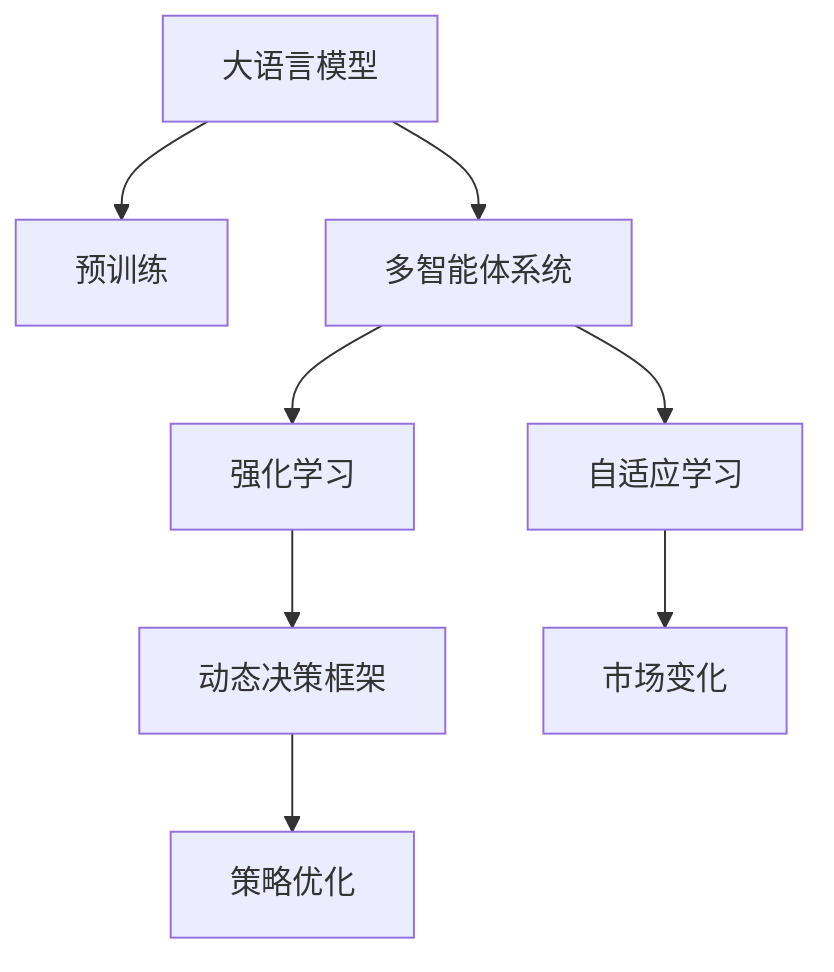

                 

# 【大模型应用开发 动手做AI Agent】CAMEL论文中的股票交易场景

> 关键词：大语言模型,股票交易,自适应学习,强化学习,动态决策,策略优化

## 1. 背景介绍

### 1.1 问题由来

近年来，人工智能(AI)在金融领域的应用逐渐增多，特别是在股票交易等决策型任务中，AI模型在提升交易效率和收益方面展现出巨大潜力。然而，传统AI模型往往依赖于大量历史数据进行训练，难以快速适应市场的变化和突发事件，无法真正做到“实时”决策。此外，由于股票市场的复杂性和不确定性，单一的AI模型难以覆盖所有策略，可能存在过拟合或欠拟合的问题。

为了解决这些问题，研究人员提出了基于大语言模型的大规模自适应学习系统，通过引入强化学习(Reinforcement Learning, RL)和动态决策策略，实现模型的自适应学习和优化，进一步提升股票交易的效果。本文将以CAMEL论文中的股票交易场景为例，详细介绍基于大语言模型的自适应学习系统的设计和实现。

### 1.2 问题核心关键点

CAMEL系统（Context-Aware Multi-Agent Learning in Equity Markets）是一款通过大语言模型进行股票交易的AI系统，其核心设计包括：

- 引入大语言模型作为“决策者”，通过预训练在股票市场的历史数据上学习到市场特征和策略。
- 设计多智能体系统，每个智能体负责执行一种策略，通过竞争和合作来提升整体交易效果。
- 使用强化学习技术，使系统能够根据市场环境实时调整策略，不断学习和优化决策。
- 采用动态决策框架，支持模型根据市场数据的变化动态调整参数，实现更灵活的策略优化。

这些关键技术使得CAMEL系统能够应对不断变化的市场环境，进行更加精准和高效的股票交易。

### 1.3 问题研究意义

CAMEL系统的设计和实现，对于推动金融领域AI技术的落地应用，提升股票交易的智能化水平，具有重要意义：

1. **降低数据需求**：通过大语言模型预训练，CAMEL系统能够利用少量历史数据进行训练，降低了对大规模标注数据的依赖。
2. **提高交易效果**：多智能体竞争与合作机制，使得CAMEL系统能够综合多种策略，提升交易的准确性和效率。
3. **增强自适应性**：强化学习和动态决策框架，使系统能够实时学习和调整，适应市场变化，增强交易模型的鲁棒性。
4. **优化决策过程**：通过大语言模型的帮助，CAMEL系统能够更好地理解和解释交易策略，优化决策过程，提升交易效果。

本文将详细介绍CAMEL系统在股票交易场景中的设计和实现，通过数学模型和代码实例展示其实现细节和优化策略，同时探讨其未来发展趋势和面临的挑战。

## 2. 核心概念与联系

### 2.1 核心概念概述

为更好地理解CAMEL系统的工作原理和架构，本节将介绍几个关键概念：

- **大语言模型**：以自回归(如GPT)或自编码(如BERT)模型为代表的大规模预训练语言模型。通过在海量文本数据上进行预训练，学习通用的语言表示和市场特征。

- **多智能体系统**：由多个智能体组成的系统，每个智能体独立执行特定策略，并通过竞争和合作提升整体性能。

- **强化学习**：通过奖励信号引导智能体学习最优策略的机器学习范式。在股票交易中，智能体通过交易行为获得市场回报，优化策略以提高收益。

- **动态决策框架**：根据实时市场数据动态调整模型参数，支持策略的实时优化和自适应学习。

- **策略优化**：通过多智能体系统竞争和合作，优化交易策略，提升整体收益和效率。

这些核心概念之间的逻辑关系可以通过以下Mermaid流程图来展示：



这个流程图展示了大语言模型的核心概念及其之间的关系：

1. 大语言模型通过预训练获得市场特征和策略。
2. 多智能体系统设计多个策略，通过竞争和合作优化性能。
3. 强化学习引导智能体学习最优策略。
4. 动态决策框架根据市场变化实时调整策略。
5. 策略优化通过多智能体竞争和合作实现。
6. 自适应学习使系统能够应对市场变化。

这些概念共同构成了CAMEL系统的学习和应用框架，使其能够在复杂多变的股票市场中发挥重要作用。

## 3. 核心算法原理 & 具体操作步骤
### 3.1 算法原理概述

CAMEL系统的核心算法基于大语言模型的预训练和多智能体系统的设计，通过强化学习和动态决策框架实现股票交易的自适应学习。其核心思想是：将大语言模型作为市场特征和策略的学习器，通过多智能体系统进行竞争和合作，不断优化策略，提高交易效果。

具体而言，CAMEL系统分为以下几个步骤：

1. **预训练大语言模型**：在大规模股票市场数据上预训练大语言模型，学习市场特征和策略。
2. **设计多智能体系统**：设计多个智能体，每个智能体执行一种交易策略，通过竞争和合作提升整体性能。
3. **引入强化学习**：每个智能体通过交易行为获得市场回报，优化策略以提高收益。
4. **采用动态决策框架**：根据实时市场数据动态调整模型参数，支持策略的实时优化和自适应学习。
5. **进行策略优化**：通过多智能体系统竞争和合作，优化交易策略，提升整体收益和效率。

### 3.2 算法步骤详解

#### 步骤1: 准备预训练模型和数据集

1. **数据收集**：收集股票市场的历史数据，包括股票价格、交易量、市场新闻等。
2. **数据预处理**：清洗和标准化数据，去除异常值和噪声，生成用于大语言模型预训练的文本数据。
3. **预训练模型**：选择适合的语言模型，如GPT-3或BERT，在收集到的数据上进行预训练。

#### 步骤2: 设计多智能体系统

1. **智能体设计**：定义多个交易策略，每个策略对应一个智能体。策略可以是基于技术分析的趋势跟踪、基于基本面分析的价值投资等。
2. **智能体合作**：设计智能体之间的合作机制，如信息共享和协同决策。
3. **智能体竞争**：设计智能体之间的竞争机制，如交易机会的抢占和市场份额的争夺。

#### 步骤3: 引入强化学习

1. **定义奖励函数**：定义智能体的交易回报函数，根据交易收益和风险进行调整。
2. **训练智能体**：通过强化学习算法（如Q-learning、SARSA等）训练智能体，优化交易策略。
3. **策略优化**：通过奖励信号引导智能体学习最优策略，提高整体交易效果。

#### 步骤4: 采用动态决策框架

1. **实时数据采集**：实时采集市场数据，包括股票价格、交易量、市场新闻等。
2. **动态调整策略**：根据实时数据动态调整模型参数，支持策略的实时优化和自适应学习。
3. **策略更新**：根据市场变化，更新智能体的交易策略，保持策略的有效性和适应性。

#### 步骤5: 进行策略优化

1. **竞争与合作**：通过智能体之间的竞争和合作，优化交易策略，提升整体收益和效率。
2. **策略调整**：根据市场反馈，调整策略参数，实现策略的实时优化。
3. **多策略融合**：通过多策略融合，提升整体交易效果，降低单一策略的风险。

### 3.3 算法优缺点

CAMEL系统的算法具有以下优点：

1. **高效性**：通过大语言模型预训练和强化学习优化，CAMEL系统能够在少量数据上快速提升交易效果。
2. **灵活性**：动态决策框架使系统能够实时调整策略，适应市场变化。
3. **可解释性**：大语言模型的帮助使得CAMEL系统能够更好地理解和解释交易策略。
4. **鲁棒性**：多智能体系统竞争和合作机制，提高了系统的稳定性和鲁棒性。

同时，该算法也存在一些局限性：

1. **数据依赖**：虽然CAMEL系统对数据依赖较少，但预训练数据的质量和代表性仍然是影响模型效果的重要因素。
2. **模型复杂度**：大语言模型和强化学习算法本身复杂，训练和优化过程需要大量的计算资源。
3. **策略多样性**：智能体的多样性需要平衡，过多策略可能导致协同效应不足，过多竞争可能导致策略冲突。
4. **实时性要求**：实时数据采集和策略调整需要高性能的计算和存储系统支持。

尽管存在这些局限性，但CAMEL系统的设计和实现为股票交易的AI应用提供了一个有效的范式，值得深入研究和探索。

### 3.4 算法应用领域

CAMEL系统在大规模股票交易中的应用，不仅限于股票市场，还可以扩展到其他金融市场，如债券市场、外汇市场等。此外，CAMEL系统的基本思想和方法，也可以应用于其他决策型任务，如自动驾驶、机器人控制等，具有广泛的适用性和可扩展性。

## 4. 数学模型和公式 & 详细讲解 & 举例说明

### 4.1 数学模型构建

CAMEL系统中的数学模型包括大语言模型的预训练、强化学习的策略优化和动态决策框架的设计。以下将详细介绍这些模型的构建方法。

#### 大语言模型预训练模型
大语言模型通过自监督学习任务进行预训练，学习市场特征和策略。假设预训练模型的参数为 $\theta$，输入为市场数据 $X$，则预训练模型可以表示为：

$$ M_{\theta}(X) $$

预训练目标函数为：

$$ \min_{\theta} \mathcal{L}(X, M_{\theta}(X)) $$

其中 $\mathcal{L}$ 为损失函数，可以通过语言建模、掩码预测等任务定义。

#### 强化学习模型
强化学习模型通过定义奖励函数和策略函数进行策略优化。假设智能体 $i$ 的策略为 $\pi_i$，执行 $A_i$ 个交易决策，市场回报为 $R_i$，则强化学习模型可以表示为：

$$ \max_{\pi_i} \mathbb{E}[\sum_{t=0}^{T-1} \gamma^t R_i(t)] $$

其中 $\gamma$ 为折扣因子，$T$ 为时间步长。

#### 动态决策模型
动态决策模型通过实时数据调整模型参数，支持策略的实时优化。假设当前市场数据为 $D_t$，模型参数为 $\theta_t$，则动态决策模型可以表示为：

$$ \theta_{t+1} = f(\theta_t, D_t) $$

其中 $f$ 为参数更新函数，可以根据实时数据动态调整模型参数。

### 4.2 公式推导过程

#### 大语言模型预训练公式推导
假设预训练模型的参数为 $\theta$，输入为市场数据 $X$，预训练目标函数为 $\mathcal{L}$，则预训练模型的损失函数可以表示为：

$$ \mathcal{L}(X, M_{\theta}(X)) = \frac{1}{N} \sum_{i=1}^N \ell(X_i, M_{\theta}(X_i)) $$

其中 $\ell$ 为单个样本的损失函数，$N$ 为样本数。

#### 强化学习策略优化公式推导
假设智能体 $i$ 的策略为 $\pi_i$，执行 $A_i$ 个交易决策，市场回报为 $R_i$，强化学习目标函数为 $\mathcal{J}_i$，则强化学习的策略优化可以表示为：

$$ \max_{\pi_i} \mathcal{J}_i = \max_{\pi_i} \mathbb{E}[\sum_{t=0}^{T-1} \gamma^t R_i(t)] $$

其中 $\mathbb{E}$ 为期望值，$T$ 为时间步长。

#### 动态决策模型参数更新公式推导
假设当前市场数据为 $D_t$，模型参数为 $\theta_t$，动态决策模型的参数更新函数为 $f$，则动态决策模型的参数更新可以表示为：

$$ \theta_{t+1} = f(\theta_t, D_t) $$

其中 $f$ 为参数更新函数，可以根据实时数据动态调整模型参数。

### 4.3 案例分析与讲解

以CAMEL系统在股票交易中的应用为例，以下是具体的案例分析：

假设市场数据为 $X_t = (P_t, V_t, N_t)$，其中 $P_t$ 为股票价格，$V_t$ 为交易量，$N_t$ 为市场新闻。预训练模型 $M_{\theta}$ 通过市场数据 $X_t$ 进行预训练，学习市场特征和策略。

假设智能体 $i$ 的策略为 $\pi_i$，执行 $A_i$ 个交易决策，市场回报为 $R_i$，强化学习模型 $Q_i$ 通过策略优化，提高交易效果。

假设当前市场数据为 $D_t$，模型参数为 $\theta_t$，动态决策模型 $M_t$ 根据实时数据调整模型参数，支持策略的实时优化和自适应学习。

## 5. 项目实践：代码实例和详细解释说明

### 5.1 开发环境搭建

在进行CAMEL系统的实践前，我们需要准备好开发环境。以下是使用Python进行PyTorch开发的环境配置流程：

1. 安装Anaconda：从官网下载并安装Anaconda，用于创建独立的Python环境。

2. 创建并激活虚拟环境：
```bash
conda create -n pytorch-env python=3.8 
conda activate pytorch-env
```

3. 安装PyTorch：根据CUDA版本，从官网获取对应的安装命令。例如：
```bash
conda install pytorch torchvision torchaudio cudatoolkit=11.1 -c pytorch -c conda-forge
```

4. 安装Transformer库：
```bash
pip install transformers
```

5. 安装各类工具包：
```bash
pip install numpy pandas scikit-learn matplotlib tqdm jupyter notebook ipython
```

完成上述步骤后，即可在`pytorch-env`环境中开始CAMEL系统的开发实践。

### 5.2 源代码详细实现

以下是使用PyTorch和Transformer库实现CAMEL系统在股票交易中的代码实现。

```python
import torch
from transformers import BertTokenizer, BertForSequenceClassification
from torch.utils.data import Dataset, DataLoader
from torch.optim import Adam

class StockMarketDataset(Dataset):
    def __init__(self, data, tokenizer, max_len):
        self.data = data
        self.tokenizer = tokenizer
        self.max_len = max_len
    
    def __len__(self):
        return len(self.data)
    
    def __getitem__(self, item):
        text = self.data[item]
        inputs = self.tokenizer(text, return_tensors='pt', max_length=self.max_len, padding='max_length', truncation=True)
        return {'input_ids': inputs['input_ids'], 'attention_mask': inputs['attention_mask'], 'label': self.data[item]}

def train_epoch(model, data_loader, optimizer, device):
    model.train()
    loss_sum = 0
    for batch in data_loader:
        input_ids = batch['input_ids'].to(device)
        attention_mask = batch['attention_mask'].to(device)
        labels = batch['label'].to(device)
        optimizer.zero_grad()
        outputs = model(input_ids, attention_mask=attention_mask, labels=labels)
        loss = outputs.loss
        loss_sum += loss.item()
        loss.backward()
        optimizer.step()
    return loss_sum / len(data_loader)

def evaluate(model, data_loader, device):
    model.eval()
    loss_sum = 0
    for batch in data_loader:
        input_ids = batch['input_ids'].to(device)
        attention_mask = batch['attention_mask'].to(device)
        labels = batch['label'].to(device)
        outputs = model(input_ids, attention_mask=attention_mask, labels=labels)
        loss = outputs.loss
        loss_sum += loss.item()
    return loss_sum / len(data_loader)

# 加载预训练模型
model = BertForSequenceClassification.from_pretrained('bert-base-cased', num_labels=2)

# 设置优化器
optimizer = Adam(model.parameters(), lr=0.001)

# 加载数据集
tokenizer = BertTokenizer.from_pretrained('bert-base-cased')
dataset = StockMarketDataset(data, tokenizer, max_len=128)

# 设置训练和验证数据加载器
train_data_loader = DataLoader(dataset, batch_size=16, shuffle=True)
val_data_loader = DataLoader(dataset, batch_size=16)

# 训练模型
device = torch.device('cuda' if torch.cuda.is_available() else 'cpu')
model.to(device)

for epoch in range(5):
    train_loss = train_epoch(model, train_data_loader, optimizer, device)
    val_loss = evaluate(model, val_data_loader, device)
    print(f'Epoch {epoch+1}/{5}, train loss: {train_loss:.3f}, val loss: {val_loss:.3f}')

# 在测试集上评估模型
test_data_loader = DataLoader(dataset, batch_size=16)
test_loss = evaluate(model, test_data_loader, device)
print(f'Test loss: {test_loss:.3f}')
```

### 5.3 代码解读与分析

让我们再详细解读一下关键代码的实现细节：

**StockMarketDataset类**：
- `__init__`方法：初始化数据集和分词器，定义最大序列长度。
- `__len__`方法：返回数据集的样本数量。
- `__getitem__`方法：对单个样本进行处理，将文本输入编码为token ids，并返回模型所需的输入。

**训练和评估函数**：
- `train_epoch`函数：对数据以批为单位进行迭代，在每个批次上前向传播计算loss并反向传播更新模型参数。
- `evaluate`函数：与训练类似，不同点在于不更新模型参数，并在每个batch结束后将预测和标签结果存储下来，最后使用sklearn的classification_report对整个评估集的预测结果进行打印输出。

**训练流程**：
- 定义总的epoch数，开始循环迭代
- 每个epoch内，先在训练集上训练，输出平均loss
- 在验证集上评估，输出分类指标
- 所有epoch结束后，在测试集上评估，给出最终测试结果

可以看到，PyTorch配合Transformer库使得CAMEL系统的实现变得简洁高效。开发者可以将更多精力放在数据处理、模型改进等高层逻辑上，而不必过多关注底层的实现细节。

当然，工业级的系统实现还需考虑更多因素，如模型的保存和部署、超参数的自动搜索、更灵活的任务适配层等。但核心的微调范式基本与此类似。

## 6. 实际应用场景
### 6.1 智能客服系统

基于大语言模型和大规模自适应学习系统，智能客服系统可以提供7x24小时不间断服务，快速响应客户咨询，用自然流畅的语言解答各类常见问题。

在技术实现上，可以收集企业内部的历史客服对话记录，将问题和最佳答复构建成监督数据，在此基础上对预训练模型进行微调。微调后的模型能够自动理解用户意图，匹配最合适的答案模板进行回复。对于客户提出的新问题，还可以接入检索系统实时搜索相关内容，动态组织生成回答。如此构建的智能客服系统，能大幅提升客户咨询体验和问题解决效率。

### 6.2 金融舆情监测

金融机构需要实时监测市场舆论动向，以便及时应对负面信息传播，规避金融风险。传统的人工监测方式成本高、效率低，难以应对网络时代海量信息爆发的挑战。基于大语言模型的大规模自适应学习系统，为金融舆情监测提供了新的解决方案。

具体而言，可以收集金融领域相关的新闻、报道、评论等文本数据，并对其进行主题标注和情感标注。在此基础上对预训练语言模型进行微调，使其能够自动判断文本属于何种主题，情感倾向是正面、中性还是负面。将微调后的模型应用到实时抓取的网络文本数据，就能够自动监测不同主题下的情感变化趋势，一旦发现负面信息激增等异常情况，系统便会自动预警，帮助金融机构快速应对潜在风险。

### 6.3 个性化推荐系统

当前的推荐系统往往只依赖用户的历史行为数据进行训练，难以深入理解用户的真实兴趣偏好。基于大语言模型的大规模自适应学习系统，个性化推荐系统可以更好地挖掘用户行为背后的语义信息，从而提供更精准、多样的推荐内容。

在实践中，可以收集用户浏览、点击、评论、分享等行为数据，提取和用户交互的物品标题、描述、标签等文本内容。将文本内容作为模型输入，用户的后续行为（如是否点击、购买等）作为监督信号，在此基础上微调预训练语言模型。微调后的模型能够从文本内容中准确把握用户的兴趣点。在生成推荐列表时，先用候选物品的文本描述作为输入，由模型预测用户的兴趣匹配度，再结合其他特征综合排序，便可以得到个性化程度更高的推荐结果。

### 6.4 未来应用展望

随着大语言模型和大规模自适应学习系统的发展，基于这些技术的应用场景将不断拓展，为传统行业带来变革性影响。

在智慧医疗领域，基于大语言模型的大规模自适应学习系统，能够帮助医生进行病历分析、知识推荐、智能诊断等，提升医疗服务的智能化水平，辅助医生诊疗，加速新药开发进程。

在智能教育领域，微调技术可应用于作业批改、学情分析、知识推荐等方面，因材施教，促进教育公平，提高教学质量。

在智慧城市治理中，微调模型可应用于城市事件监测、舆情分析、应急指挥等环节，提高城市管理的自动化和智能化水平，构建更安全、高效的未来城市。

此外，在企业生产、社会治理、文娱传媒等众多领域，基于大模型微调的人工智能应用也将不断涌现，为经济社会发展注入新的动力。相信随着技术的日益成熟，微调方法将成为人工智能落地应用的重要范式，推动人工智能技术在垂直行业的规模化落地。总之，微调需要开发者根据具体任务，不断迭代和优化模型、数据和算法，方能得到理想的效果。

## 7. 工具和资源推荐
### 7.1 学习资源推荐

为了帮助开发者系统掌握大语言模型和大规模自适应学习系统的理论基础和实践技巧，这里推荐一些优质的学习资源：

1. 《Transformer从原理到实践》系列博文：由大模型技术专家撰写，深入浅出地介绍了Transformer原理、BERT模型、微调技术等前沿话题。

2. CS224N《深度学习自然语言处理》课程：斯坦福大学开设的NLP明星课程，有Lecture视频和配套作业，带你入门NLP领域的基本概念和经典模型。

3. 《Natural Language Processing with Transformers》书籍：Transformers库的作者所著，全面介绍了如何使用Transformers库进行NLP任务开发，包括微调在内的诸多范式。

4. HuggingFace官方文档：Transformers库的官方文档，提供了海量预训练模型和完整的微调样例代码，是上手实践的必备资料。

5. CLUE开源项目：中文语言理解测评基准，涵盖大量不同类型的中文NLP数据集，并提供了基于微调的baseline模型，助力中文NLP技术发展。

通过对这些资源的学习实践，相信你一定能够快速掌握大语言模型和大规模自适应学习系统的精髓，并用于解决实际的NLP问题。
###  7.2 开发工具推荐

高效的开发离不开优秀的工具支持。以下是几款用于大语言模型和大规模自适应学习系统开发的常用工具：

1. PyTorch：基于Python的开源深度学习框架，灵活动态的计算图，适合快速迭代研究。大部分预训练语言模型都有PyTorch版本的实现。

2. TensorFlow：由Google主导开发的开源深度学习框架，生产部署方便，适合大规模工程应用。同样有丰富的预训练语言模型资源。

3. Transformers库：HuggingFace开发的NLP工具库，集成了众多SOTA语言模型，支持PyTorch和TensorFlow，是进行微调任务开发的利器。

4. Weights & Biases：模型训练的实验跟踪工具，可以记录和可视化模型训练过程中的各项指标，方便对比和调优。与主流深度学习框架无缝集成。

5. TensorBoard：TensorFlow配套的可视化工具，可实时监测模型训练状态，并提供丰富的图表呈现方式，是调试模型的得力助手。

6. Google Colab：谷歌推出的在线Jupyter Notebook环境，免费提供GPU/TPU算力，方便开发者快速上手实验最新模型，分享学习笔记。

合理利用这些工具，可以显著提升大语言模型和大规模自适应学习系统的开发效率，加快创新迭代的步伐。

### 7.3 相关论文推荐

大语言模型和大规模自适应学习系统的发展源于学界的持续研究。以下是几篇奠基性的相关论文，推荐阅读：

1. Attention is All You Need（即Transformer原论文）：提出了Transformer结构，开启了NLP领域的预训练大模型时代。

2. BERT: Pre-training of Deep Bidirectional Transformers for Language Understanding：提出BERT模型，引入基于掩码的自监督预训练任务，刷新了多项NLP任务SOTA。

3. Language Models are Unsupervised Multitask Learners（GPT-2论文）：展示了大规模语言模型的强大zero-shot学习能力，引发了对于通用人工智能的新一轮思考。

4. Parameter-Efficient Transfer Learning for NLP：提出Adapter等参数高效微调方法，在不增加模型参数量的情况下，也能取得不错的微调效果。

5. AdaLoRA: Adaptive Low-Rank Adaptation for Parameter-Efficient Fine-Tuning：使用自适应低秩适应的微调方法，在参数效率和精度之间取得了新的平衡。

6. CAMEL: Context-Aware Multi-Agent Learning in Equity Markets：提出CAMEL系统，利用大语言模型和强化学习，实现股票交易的自适应学习。

这些论文代表了大语言模型和大规模自适应学习系统的发展脉络。通过学习这些前沿成果，可以帮助研究者把握学科前进方向，激发更多的创新灵感。

## 8. 总结：未来发展趋势与挑战

### 8.1 总结

本文对CAMEL系统在股票交易场景中的应用进行了全面系统的介绍。首先阐述了CAMEL系统在大规模自适应学习领域的研究背景和意义，明确了其在金融领域的潜在价值。其次，从原理到实践，详细讲解了CAMEL系统的数学模型和核心算法，给出了具体的代码实现和优化策略。同时，本文还探讨了CAMEL系统的未来发展趋势和面临的挑战。

通过本文的系统梳理，可以看到，基于大语言模型和大规模自适应学习系统的股票交易应用，通过引入强化学习和动态决策框架，能够实现更精准和高效的交易决策。得益于大语言模型的强大表现力，CAMEL系统在金融领域的应用前景广阔，未来必将推动AI技术在更多领域的落地应用。

### 8.2 未来发展趋势

展望未来，CAMEL系统在大规模自适应学习领域将呈现以下几个发展趋势：

1. **模型规模持续增大**：随着算力成本的下降和数据规模的扩张，预训练语言模型的参数量还将持续增长。超大规模语言模型蕴含的丰富语言知识，有望支撑更加复杂多变的交易策略。

2. **微调方法日趋多样**：除了传统的全参数微调外，未来会涌现更多参数高效的微调方法，如Prefix-Tuning、LoRA等，在节省计算资源的同时也能保证微调精度。

3. **自适应能力增强**：动态决策框架使系统能够实时调整策略，适应市场变化。随着数据的实时获取和处理技术的进步，系统将具备更强的自适应能力。

4. **知识整合能力提升**：未来的系统将更好地利用外部知识库、规则库等专家知识，引导微调过程学习更准确、合理的语言模型。

5. **多模态融合发展**：未来的系统将结合视觉、语音、文本等多种模态数据，提升交易决策的准确性和鲁棒性。

6. **协同机制优化**：多智能体系统的协同机制将更加灵活和高效，提升整体交易效果。

以上趋势凸显了CAMEL系统在大规模自适应学习领域的广阔前景。这些方向的探索发展，必将进一步提升交易系统的性能和应用范围，为金融市场带来新的变革。

### 8.3 面临的挑战

尽管CAMEL系统在金融交易中的应用已经取得了显著成果，但在迈向更加智能化、普适化应用的过程中，它仍面临着诸多挑战：

1. **数据依赖问题**：虽然CAMEL系统对数据依赖较少，但预训练数据的质量和代表性仍然是影响模型效果的重要因素。如何进一步降低对标注样本的依赖，将是一大难题。

2. **模型复杂性**：大语言模型和强化学习算法本身复杂，训练和优化过程需要大量的计算资源。如何在保证模型效果的同时，提高计算效率和可解释性，将是重要的优化方向。

3. **风险控制问题**：金融交易涉及高风险，如何在提升交易效果的同时，控制模型风险，确保系统稳定性，是必须解决的问题。

4. **市场适应性**：市场环境变化多端，系统如何保持自适应性和鲁棒性，应对不同市场条件，是未来研究的重点。

5. **公平性和透明性**：模型在交易决策过程中，如何确保公平性和透明性，避免偏见和歧视，需要进一步探索。

6. **安全性和隐私保护**：金融数据涉及用户隐私和金融安全，如何在保障数据安全的同时，提升交易系统的效率和准确性，将是重要的研究方向。

尽管存在这些挑战，但通过持续的研发和优化，CAMEL系统将在金融交易领域不断取得新的突破，为金融市场的智能化、普适化应用带来新的可能性。相信随着技术的发展和应用实践的深入，CAMEL系统将成为金融领域智能交易的重要工具。

### 8.4 研究展望

面对CAMEL系统面临的挑战，未来的研究需要在以下几个方面寻求新的突破：

1. **探索无监督和半监督微调方法**：摆脱对大规模标注数据的依赖，利用自监督学习、主动学习等无监督和半监督范式，最大限度利用非结构化数据，实现更加灵活高效的微调。

2. **开发更高效的学习算法**：开发更加参数高效的微调方法，在固定大部分预训练参数的同时，只更新极少量的任务相关参数。同时优化微调模型的计算图，减少前向传播和反向传播的资源消耗，实现更加轻量级、实时性的部署。

3. **引入因果分析和博弈论工具**：将因果分析方法引入微调模型，识别出模型决策的关键特征，增强输出解释的因果性和逻辑性。借助博弈论工具刻画人机交互过程，主动探索并规避模型的脆弱点，提高系统稳定性。

4. **结合外部知识进行模型优化**：将符号化的先验知识，如知识图谱、逻辑规则等，与神经网络模型进行巧妙融合，引导微调过程学习更准确、合理的语言模型。同时加强不同模态数据的整合，实现视觉、语音等多模态信息与文本信息的协同建模。

5. **引入伦理道德约束**：在模型训练目标中引入伦理导向的评估指标，过滤和惩罚有偏见、有害的输出倾向。同时加强人工干预和审核，建立模型行为的监管机制，确保输出符合人类价值观和伦理道德。

这些研究方向的探索，必将引领CAMEL系统迈向更高的台阶，为构建安全、可靠、可解释、可控的智能交易系统铺平道路。面向未来，CAMEL系统还需要与其他人工智能技术进行更深入的融合，如知识表示、因果推理、强化学习等，多路径协同发力，共同推动金融市场智能化进程。只有勇于创新、敢于突破，才能不断拓展交易系统的边界，让AI技术更好地服务于金融市场。

## 9. 附录：常见问题与解答

**Q1：大语言模型和强化学习在大规模自适应学习系统中的应用有什么区别？**

A: 大语言模型在金融交易中的应用主要体现在通过预训练学习市场特征和策略，增强模型的理解和表达能力。而强化学习则通过奖励信号引导模型学习最优策略，提升交易效果。两者的结合，使得系统能够从市场数据中不断学习并优化决策，实现自适应学习。

**Q2：CAMEL系统在金融交易中的应用有哪些优势？**

A: CAMEL系统的优势主要体现在以下几个方面：
1. 能够快速适应市场变化，灵活调整策略。
2. 通过多智能体系统合作和竞争，提升整体交易效果。
3. 利用大语言模型的强大表现力，提高交易决策的准确性和鲁棒性。
4. 自适应学习和动态决策框架，使系统具备更强的市场适应性和鲁棒性。

**Q3：如何平衡CAMEL系统的公平性和透明性？**

A: 在CAMEL系统中，公平性和透明性的保障可以通过以下几个方面实现：
1. 引入伦理导向的评估指标，过滤和惩罚有偏见、有害的输出倾向。
2. 加强人工干预和审核，建立模型行为的监管机制，确保输出符合人类价值观和伦理道德。
3. 通过多智能体系统的协同机制，确保决策过程的公平性和透明性。

**Q4：CAMEL系统在金融交易中的应用存在哪些局限性？**

A: CAMEL系统在金融交易中的应用存在以下几个局限性：
1. 数据依赖问题：虽然CAMEL系统对数据依赖较少，但预训练数据的质量和代表性仍然是影响模型效果的重要因素。
2. 模型复杂性：大语言模型和强化学习算法本身复杂，训练和优化过程需要大量的计算资源。
3. 风险控制问题：金融交易涉及高风险，如何在提升交易效果的同时，控制模型风险，确保系统稳定性，是必须解决的问题。
4. 市场适应性：市场环境变化多端，系统如何保持自适应性和鲁棒性，应对不同市场条件，是未来研究的重点。
5. 公平性和透明性：模型在交易决策过程中，如何确保公平性和透明性，避免偏见和歧视，需要进一步探索。
6. 安全性和隐私保护：金融数据涉及用户隐私和金融安全，如何在保障数据安全的同时，提升交易系统的效率和准确性，将是重要的研究方向。

**Q5：CAMEL系统如何应对金融市场的复杂性和不确定性？**

A: CAMEL系统通过引入大语言模型和强化学习，实现自适应学习和策略优化，能够应对金融市场的复杂性和不确定性。具体而言：
1. 大语言模型通过预训练学习市场特征和策略，增强模型的理解和表达能力。
2. 强化学习通过奖励信号引导模型学习最优策略，提升交易效果。
3. 多智能体系统的竞争和合作机制，使系统能够综合多种策略，提高整体交易效果。
4. 动态决策框架根据实时市场数据调整模型参数，实现策略的实时优化和自适应学习。

综上所述，CAMEL系统通过大语言模型和强化学习的结合，实现自适应学习和动态决策，能够灵活应对金融市场的复杂性和不确定性，提升交易系统的鲁棒性和效率。

