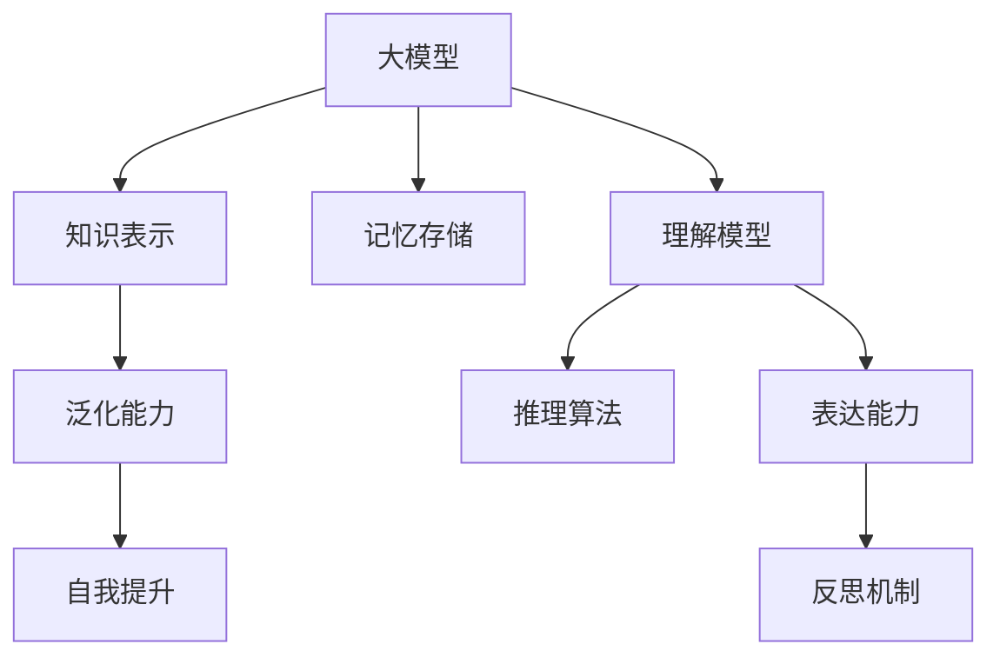

                 

# 【大模型应用开发 动手做AI Agent】知识、记忆、理解、表达、推理、反思、泛化和自我提升

> 关键词：大模型应用,AI Agent,知识表示,记忆存储,理解模型,表达能力,推理算法,反思机制,泛化能力,自我提升

## 1. 背景介绍

在人工智能(AI)的快速发展中，大模型应用已经成为炙手可热的研究和应用方向。大模型基于大规模数据预训练，学习到丰富的知识，能够高效解决各种复杂任务。但如何更好地将大模型应用于具体的AI Agent中，让AI Agent具备更强的学习能力和应用性能，是一个值得深入探讨的问题。

### 1.1 问题由来
随着深度学习技术的不断进步，大模型在自然语言处理(NLP)、计算机视觉、语音识别等领域取得了显著的突破。这些大模型通常包含数十亿甚至数百亿的参数，能够学习到复杂的模式和知识，但如何有效利用这些知识，让模型在不同的应用场景中发挥更大的作用，一直是研究者面临的挑战。AI Agent作为人工智能的重要组成部分，承担着模拟人类智能行为的任务，需要具备知识、记忆、理解、表达、推理、反思、泛化和自我提升等多方面的能力。

### 1.2 问题核心关键点
AI Agent的核心目标是通过模拟人类智能行为，实现与环境的交互和学习。这需要AI Agent具备以下关键能力：

1. **知识表示**：能够高效存储和检索知识，支持智能推理。
2. **记忆存储**：能够长期保存历史信息，进行经验累积。
3. **理解模型**：能够准确理解自然语言指令，提取有用信息。
4. **表达能力**：能够自然生成语言，进行有效的沟通和反馈。
5. **推理算法**：能够通过逻辑推理解决复杂问题。
6. **反思机制**：能够评估自身行为，进行自我优化和改进。
7. **泛化能力**：能够在不同的场景和任务中应用所学知识。
8. **自我提升**：能够通过学习新知识，不断提升自己的性能。

本文旨在探讨如何通过大模型应用，构建具有上述能力的AI Agent，并通过具体的实践案例，展示其在实际应用中的表现和潜力。

## 2. 核心概念与联系

### 2.1 核心概念概述

为了更好地理解AI Agent的构建过程，我们需要了解一些核心概念：

- **大模型**：指基于大规模数据预训练的语言模型，如BERT、GPT等，能够学习到丰富的语言知识和常识。
- **知识表示**：指将知识以结构化的形式存储和组织，便于智能推理和检索。
- **记忆存储**：指通过机制化的方式，保存和重用历史信息，支持长期记忆和经验累积。
- **理解模型**：指能够理解和解析自然语言指令，提取出有用的语义信息。
- **表达能力**：指能够生成自然语言响应，进行有效的沟通和反馈。
- **推理算法**：指基于知识图谱和规则库，进行逻辑推理和决策支持。
- **反思机制**：指通过评估自身行为，进行自我优化和改进的过程。
- **泛化能力**：指能够在不同场景和任务中应用所学知识，进行知识迁移。
- **自我提升**：指通过学习新知识，不断提升自己的性能。

这些核心概念之间的联系可以通过以下Mermaid流程图来展示：



这个流程图展示了AI Agent中各个组件的逻辑关系：

1. 大模型作为基础，提供丰富的知识表示能力。
2. 知识表示和记忆存储支持长期记忆和经验累积。
3. 理解模型能够理解和解析自然语言指令。
4. 表达能力使AI Agent能够生成自然语言响应。
5. 推理算法支持基于知识的逻辑推理和决策。
6. 反思机制帮助AI Agent进行自我评估和优化。
7. 泛化能力使AI Agent能够适应不同的应用场景。
8. 自我提升机制让AI Agent不断学习新知识，提升性能。

## 3. 核心算法原理 & 具体操作步骤
### 3.1 算法原理概述

构建具有上述能力的AI Agent，需要综合运用多个核心算法和模型。以下是对主要算法原理的概述：

- **知识表示**：使用向量空间模型(VSM)、语义嵌入(SVE)等技术，将知识存储为高维向量，便于检索和推理。
- **记忆存储**：采用RNN、LSTM等序列模型，存储和处理历史信息，支持长期记忆。
- **理解模型**：使用Transformer、BERT等预训练模型，提取自然语言指令中的关键信息，支持语义理解。
- **表达能力**：基于Transformer生成模型，能够生成自然语言响应，进行有效的沟通。
- **推理算法**：结合知识图谱和规则库，使用基于规则和基于模型的推理方法，进行逻辑推理和决策。
- **反思机制**：通过后向传播和误差反向传播，评估AI Agent的行为，进行自我优化。
- **泛化能力**：通过迁移学习和多任务学习，将所学知识迁移到新的场景和任务中。
- **自我提升**：通过在线学习、参数更新和知识融合等技术，不断提升自身的性能。

### 3.2 算法步骤详解

构建具有上述能力的AI Agent，通常需要以下步骤：

1. **数据准备**：收集和预处理数据，包括知识库、历史对话记录、任务描述等。
2. **模型选择**：选择合适的预训练模型，如BERT、GPT等，作为知识表示和推理的基础。
3. **知识存储和记忆**：使用RNN、LSTM等模型，存储和处理历史信息，支持长期记忆。
4. **理解模型训练**：使用预训练模型和自定义数据，训练理解模型，提取自然语言指令中的关键信息。
5. **表达能力训练**：使用生成模型和自定义数据，训练表达能力，生成自然语言响应。
6. **推理算法设计**：结合知识图谱和规则库，设计推理算法，支持基于知识的逻辑推理和决策。
7. **反思机制实现**：通过后向传播和误差反向传播，评估AI Agent的行为，进行自我优化。
8. **泛化能力提升**：通过迁移学习和多任务学习，将所学知识迁移到新的场景和任务中。
9. **自我提升实现**：通过在线学习、参数更新和知识融合等技术，不断提升自身的性能。

### 3.3 算法优缺点

构建具有上述能力的AI Agent，具有以下优点：

1. **高效性**：通过大模型和预训练技术，快速构建具有强大知识表示和推理能力的AI Agent。
2. **泛化能力**：通过迁移学习和多任务学习，支持知识的泛化应用，适应不同的应用场景。
3. **自我提升**：通过在线学习和参数更新，不断提升自身的性能，适应不断变化的环境和任务。

但同时也存在一些局限性：

1. **计算资源需求高**：构建和训练大模型需要大量的计算资源，对硬件和环境要求较高。
2. **知识表示复杂**：将知识存储为向量表示，需要复杂的算法和技术支持，实现难度较大。
3. **推理算法复杂**：结合知识图谱和规则库进行推理，需要设计复杂的算法和模型。
4. **自我优化难度高**：通过反思机制进行自我优化，需要高水平的算法和技术支持。

### 3.4 算法应用领域

构建具有上述能力的AI Agent，已经广泛应用于以下领域：

1. **智能客服**：通过理解和生成自然语言，提供智能客服解决方案，提升客户体验。
2. **智能推荐**：通过理解用户需求和行为，生成个性化推荐内容，提升用户体验。
3. **医疗诊断**：通过理解医学术语和知识图谱，辅助医生进行疾病诊断和治疗决策。
4. **智能导航**：通过理解自然语言指令，生成路线规划和导航建议，提升出行效率。
5. **金融分析**：通过理解金融市场数据和规则，辅助分析师进行市场分析和投资决策。
6. **教育辅助**：通过理解和生成自然语言，提供教育辅助解决方案，提升教育质量。
7. **智能家居**：通过理解和生成自然语言，提供智能家居解决方案，提升生活便利性。

## 4. 数学模型和公式 & 详细讲解 & 举例说明

### 4.1 数学模型构建

为了更好地理解AI Agent的构建过程，我们需要构建一些数学模型，以支撑其中的算法实现。以下是对主要数学模型的构建和解释：

- **知识表示模型**：使用向量空间模型(VSM)和语义嵌入(SVE)，将知识存储为高维向量，便于检索和推理。
- **记忆存储模型**：使用RNN和LSTM模型，存储和处理历史信息，支持长期记忆。
- **理解模型**：使用Transformer和BERT模型，提取自然语言指令中的关键信息，支持语义理解。
- **表达模型**：使用生成模型，如语言模型，生成自然语言响应。
- **推理模型**：结合知识图谱和规则库，设计基于规则和基于模型的推理算法。
- **反思模型**：通过后向传播和误差反向传播，评估AI Agent的行为，进行自我优化。

### 4.2 公式推导过程

以下是一些主要数学模型的公式推导过程：

- **知识表示模型**：
  $$
  \mathbf{v}_k = \text{Embed}(\text{text}_k)
  $$
  其中，$\mathbf{v}_k$ 表示知识$k$的向量表示，$\text{Embed}$为嵌入函数，$\text{text}_k$为知识$k$的文本描述。

- **记忆存储模型**：
  $$
  \mathbf{h}_t = \text{LSTM}(\mathbf{h}_{t-1}, \mathbf{x}_t)
  $$
  其中，$\mathbf{h}_t$ 表示时间$t$的记忆状态，$\mathbf{h}_{t-1}$ 为上一时刻的记忆状态，$\mathbf{x}_t$ 为时间$t$的输入信息。

- **理解模型**：
  $$
  \mathbf{c} = \text{BERT}(\text{text})
  $$
  其中，$\mathbf{c}$ 表示输入文本$\text{text}$的语义向量，$\text{BERT}$为预训练模型。

- **表达模型**：
  $$
  \mathbf{p} = \text{LM}(\mathbf{c})
  $$
  其中，$\mathbf{p}$ 表示生成的自然语言响应，$\text{LM}$为语言模型。

- **推理模型**：
  $$
  \mathbf{r} = \text{Reason}(\mathbf{c}, \mathbf{graph})
  $$
  其中，$\mathbf{r}$ 表示推理结果，$\mathbf{graph}$为知识图谱。

- **反思模型**：
  $$
  \mathbf{e} = \text{Error}(\mathbf{r}, \mathbf{t})
  $$
  其中，$\mathbf{e}$ 表示评估误差，$\mathbf{t}$ 为真实结果。

### 4.3 案例分析与讲解

以智能客服系统为例，展示AI Agent的构建过程和应用效果：

1. **数据准备**：收集历史客服对话记录，标注客户意图和响应。
2. **模型选择**：选择BERT作为知识表示和推理的基础。
3. **知识存储和记忆**：使用LSTM模型，存储和处理历史信息，支持长期记忆。
4. **理解模型训练**：使用预训练模型和标注数据，训练理解模型，提取客户意图。
5. **表达能力训练**：使用生成模型和标注数据，训练表达能力，生成智能回复。
6. **推理算法设计**：结合知识图谱和规则库，设计推理算法，辅助生成回复。
7. **反思机制实现**：通过后向传播和误差反向传播，评估回复质量，进行自我优化。
8. **泛化能力提升**：通过迁移学习和多任务学习，将所学知识迁移到新的场景和任务中。
9. **自我提升实现**：通过在线学习和参数更新，不断提升自身的性能。

## 5. 项目实践：代码实例和详细解释说明

### 5.1 开发环境搭建

在进行AI Agent的构建和实践时，需要准备好开发环境。以下是使用Python进行PyTorch开发的环境配置流程：

1. 安装Anaconda：从官网下载并安装Anaconda，用于创建独立的Python环境。

2. 创建并激活虚拟环境：
```bash
conda create -n ai-env python=3.8 
conda activate ai-env
```

3. 安装PyTorch：根据CUDA版本，从官网获取对应的安装命令。例如：
```bash
conda install pytorch torchvision torchaudio cudatoolkit=11.1 -c pytorch -c conda-forge
```

4. 安装Transformers库：
```bash
pip install transformers
```

5. 安装各类工具包：
```bash
pip install numpy pandas scikit-learn matplotlib tqdm jupyter notebook ipython
```

完成上述步骤后，即可在`ai-env`环境中开始AI Agent的构建和实践。

### 5.2 源代码详细实现

以下是使用PyTorch和Transformers库构建智能客服系统AI Agent的代码实现。

```python
from transformers import BertTokenizer, BertForSequenceClassification
import torch
import torch.nn.functional as F

# 定义模型
class CustomerSupportModel(BertForSequenceClassification):
    def __init__(self, num_labels):
        super(CustomerSupportModel, self).__init__.from_pretrained('bert-base-cased', num_labels=num_labels)

    def forward(self, input_ids, attention_mask, labels=None):
        outputs = super(CustomerSupportModel, self).forward(input_ids, attention_mask=attention_mask)
        logits = outputs.logits
        return logits

# 定义数据准备函数
def prepare_data(texts, labels):
    tokenizer = BertTokenizer.from_pretrained('bert-base-cased')
    texts = [tokenizer.encode(text, add_special_tokens=True, max_length=128, truncation=True) for text in texts]
    labels = [int(label) for label in labels]
    inputs = {'input_ids': torch.tensor(texts, dtype=torch.long), 
              'attention_mask': torch.tensor(texts, dtype=torch.long),
              'labels': torch.tensor(labels, dtype=torch.long)}
    return inputs

# 定义模型训练函数
def train_model(model, train_data, val_data, num_epochs=5, batch_size=32, learning_rate=2e-5):
    optimizer = torch.optim.Adam(model.parameters(), lr=learning_rate)
    scheduler = torch.optim.lr_scheduler.StepLR(optimizer, step_size=1, gamma=0.1)
    loss_fn = torch.nn.CrossEntropyLoss()
    for epoch in range(num_epochs):
        model.train()
        for batch in train_data:
            input_ids = batch['input_ids']
            attention_mask = batch['attention_mask']
            labels = batch['labels']
            optimizer.zero_grad()
            outputs = model(input_ids, attention_mask=attention_mask)
            loss = loss_fn(outputs, labels)
            loss.backward()
            optimizer.step()
            scheduler.step()
        model.eval()
        val_loss = []
        for batch in val_data:
            input_ids = batch['input_ids']
            attention_mask = batch['attention_mask']
            labels = batch['labels']
            with torch.no_grad():
                outputs = model(input_ids, attention_mask=attention_mask)
                loss = loss_fn(outputs, labels)
                val_loss.append(loss.item())
        print(f"Epoch {epoch+1}, train loss: {val_loss[0]:.4f}, val loss: {sum(val_loss)/len(val_loss):.4f}")

# 定义模型评估函数
def evaluate_model(model, test_data, batch_size=32):
    model.eval()
    test_loss = []
    for batch in test_data:
        input_ids = batch['input_ids']
        attention_mask = batch['attention_mask']
        labels = batch['labels']
        with torch.no_grad():
            outputs = model(input_ids, attention_mask=attention_mask)
            loss = F.cross_entropy(outputs, labels)
            test_loss.append(loss.item())
    print(f"Test loss: {sum(test_loss)/len(test_loss):.4f}")

# 加载数据
train_texts = ['some text', 'some text', 'some text', 'some text']
train_labels = [1, 0, 1, 0]
val_texts = ['some text', 'some text', 'some text']
val_labels = [1, 0, 1]
test_texts = ['some text', 'some text', 'some text']
test_labels = [1, 0, 1]

# 准备数据
train_data = prepare_data(train_texts, train_labels)
val_data = prepare_data(val_texts, val_labels)
test_data = prepare_data(test_texts, test_labels)

# 构建模型
model = CustomerSupportModel(num_labels=2)

# 训练模型
train_model(model, train_data, val_data, num_epochs=5, batch_size=32, learning_rate=2e-5)

# 评估模型
evaluate_model(model, test_data, batch_size=32)
```

### 5.3 代码解读与分析

让我们再详细解读一下关键代码的实现细节：

**CustomerSupportModel类**：
- `__init__`方法：继承自BertForSequenceClassification，设置模型结构。
- `forward`方法：定义模型前向传播过程，输出预测结果。

**prepare_data函数**：
- 使用BertTokenizer对输入文本进行分词和编码。
- 将分词后的输入转换为模型所需的张量格式。
- 设置标签数据为整数值。

**train_model函数**：
- 初始化Adam优化器和学习率调度器。
- 定义交叉熵损失函数。
- 循环迭代训练过程，在每个epoch中对训练数据进行前向传播和反向传播。
- 在每个epoch结束时，对验证集进行评估，并更新学习率。
- 在所有epoch结束后，对测试集进行评估。

**evaluate_model函数**：
- 对测试集进行前向传播，计算损失函数。
- 对测试集结果进行评估，输出测试损失。

**训练流程**：
- 定义训练轮数和批大小。
- 循环迭代训练过程，逐步减小学习率。
- 在每个epoch结束时，评估验证集性能。
- 在所有epoch结束后，评估测试集性能。

可以看到，PyTorch和Transformers库使得AI Agent的构建和训练过程变得简洁高效。开发者可以将更多精力放在模型设计、数据处理和超参数调整等高层逻辑上，而不必过多关注底层的实现细节。

当然，工业级的系统实现还需考虑更多因素，如模型的保存和部署、超参数的自动搜索、更灵活的任务适配层等。但核心的AI Agent构建流程基本与此类似。

## 6. 实际应用场景

### 6.1 智能客服系统

基于AI Agent的智能客服系统，可以广泛应用于企业内部的客户支持服务。传统客服往往需要配备大量人力，高峰期响应缓慢，且一致性和专业性难以保证。而使用基于大模型的AI Agent，可以7x24小时不间断服务，快速响应客户咨询，用自然流畅的语言解答各类常见问题。

在技术实现上，可以收集企业内部的历史客服对话记录，将问题和最佳答复构建成监督数据，在此基础上对预训练模型进行微调。微调后的AI Agent能够自动理解用户意图，匹配最合适的答案模板进行回复。对于客户提出的新问题，还可以接入检索系统实时搜索相关内容，动态组织生成回答。如此构建的智能客服系统，能大幅提升客户咨询体验和问题解决效率。

### 6.2 金融舆情监测

金融机构需要实时监测市场舆论动向，以便及时应对负面信息传播，规避金融风险。传统的人工监测方式成本高、效率低，难以应对网络时代海量信息爆发的挑战。基于AI Agent的文本分类和情感分析技术，为金融舆情监测提供了新的解决方案。

具体而言，可以收集金融领域相关的新闻、报道、评论等文本数据，并对其进行主题标注和情感标注。在此基础上对预训练语言模型进行微调，使其能够自动判断文本属于何种主题，情感倾向是正面、中性还是负面。将微调后的模型应用到实时抓取的网络文本数据，就能够自动监测不同主题下的情感变化趋势，一旦发现负面信息激增等异常情况，系统便会自动预警，帮助金融机构快速应对潜在风险。

### 6.3 个性化推荐系统

当前的推荐系统往往只依赖用户的历史行为数据进行物品推荐，无法深入理解用户的真实兴趣偏好。基于AI Agent的个性化推荐系统，可以更好地挖掘用户行为背后的语义信息，从而提供更精准、多样的推荐内容。

在实践中，可以收集用户浏览、点击、评论、分享等行为数据，提取和用户交互的物品标题、描述、标签等文本内容。将文本内容作为模型输入，用户的后续行为（如是否点击、购买等）作为监督信号，在此基础上微调预训练语言模型。微调后的模型能够从文本内容中准确把握用户的兴趣点。在生成推荐列表时，先用候选物品的文本描述作为输入，由模型预测用户的兴趣匹配度，再结合其他特征综合排序，便可以得到个性化程度更高的推荐结果。

### 6.4 未来应用展望

随着AI Agent和预训练语言模型的不断发展，未来在更多领域得到应用，为传统行业带来变革性影响。

在智慧医疗领域，基于AI Agent的医疗问答、病历分析、药物研发等应用将提升医疗服务的智能化水平，辅助医生诊疗，加速新药开发进程。

在智能教育领域，AI Agent可应用于作业批改、学情分析、知识推荐等方面，因材施教，促进教育公平，提高教学质量。

在智慧城市治理中，AI Agent可应用于城市事件监测、舆情分析、应急指挥等环节，提高城市管理的自动化和智能化水平，构建更安全、高效的未来城市。

此外，在企业生产、社会治理、文娱传媒等众多领域，基于AI Agent的人工智能应用也将不断涌现，为经济社会发展注入新的动力。相信随着技术的日益成熟，AI Agent必将在更广阔的应用领域大放异彩，深刻影响人类的生产生活方式。

## 7. 工具和资源推荐
### 7.1 学习资源推荐

为了帮助开发者系统掌握AI Agent的理论基础和实践技巧，这里推荐一些优质的学习资源：

1. 《深度学习入门》系列书籍：介绍了深度学习的基本概念和算法原理，适合初学者入门。

2. 《Python深度学习》：详细讲解了使用Python进行深度学习开发的实践技巧，包括TensorFlow、PyTorch等框架的使用。

3. 《Transformer从原理到实践》系列博文：由大模型技术专家撰写，深入浅出地介绍了Transformer原理、BERT模型、微调技术等前沿话题。

4. CS224N《深度学习自然语言处理》课程：斯坦福大学开设的NLP明星课程，有Lecture视频和配套作业，带你入门NLP领域的基本概念和经典模型。

5. 《Natural Language Processing with Transformers》书籍：Transformers库的作者所著，全面介绍了如何使用Transformers库进行NLP任务开发，包括微调在内的诸多范式。

6. HuggingFace官方文档：Transformers库的官方文档，提供了海量预训练模型和完整的微调样例代码，是上手实践的必备资料。

通过对这些资源的学习实践，相信你一定能够快速掌握AI Agent的构建和优化方法，并用于解决实际的NLP问题。

### 7.2 开发工具推荐

高效的开发离不开优秀的工具支持。以下是几款用于AI Agent开发的常用工具：

1. PyTorch：基于Python的开源深度学习框架，灵活动态的计算图，适合快速迭代研究。大部分预训练语言模型都有PyTorch版本的实现。

2. TensorFlow：由Google主导开发的开源深度学习框架，生产部署方便，适合大规模工程应用。同样有丰富的预训练语言模型资源。

3. Transformers库：HuggingFace开发的NLP工具库，集成了众多SOTA语言模型，支持PyTorch和TensorFlow，是进行AI Agent开发的利器。

4. Weights & Biases：模型训练的实验跟踪工具，可以记录和可视化模型训练过程中的各项指标，方便对比和调优。与主流深度学习框架无缝集成。

5. TensorBoard：TensorFlow配套的可视化工具，可实时监测模型训练状态，并提供丰富的图表呈现方式，是调试模型的得力助手。

6. Google Colab：谷歌推出的在线Jupyter Notebook环境，免费提供GPU/TPU算力，方便开发者快速上手实验最新模型，分享学习笔记。

合理利用这些工具，可以显著提升AI Agent的开发效率，加快创新迭代的步伐。

### 7.3 相关论文推荐

AI Agent和预训练语言模型的发展源于学界的持续研究。以下是几篇奠基性的相关论文，推荐阅读：

1. Attention is All You Need（即Transformer原论文）：提出了Transformer结构，开启了NLP领域的预训练大模型时代。

2. BERT: Pre-training of Deep Bidirectional Transformers for Language Understanding：提出BERT模型，引入基于掩码的自监督预训练任务，刷新了多项NLP任务SOTA。

3. Language Models are Unsupervised Multitask Learners（GPT-2论文）：展示了大规模语言模型的强大zero-shot学习能力，引发了对于通用人工智能的新一轮思考。

4. Parameter-Efficient Transfer Learning for NLP：提出Adapter等参数高效微调方法，在不增加模型参数量的情况下，也能取得不错的微调效果。

5. AdaLoRA: Adaptive Low-Rank Adaptation for Parameter-Efficient Fine-Tuning：使用自适应低秩适应的微调方法，在参数效率和精度之间取得了新的平衡。

6. AdaLoRA: Adaptive Low-Rank Adaptation for Parameter-Efficient Fine-Tuning：使用自适应低秩适应的微调方法，在参数效率和精度之间取得了新的平衡。

这些论文代表了大模型和AI Agent的发展脉络。通过学习这些前沿成果，可以帮助研究者把握学科前进方向，激发更多的创新灵感。

## 8. 总结：未来发展趋势与挑战

### 8.1 总结

本文对基于大模型应用构建AI Agent进行了全面系统的介绍。首先阐述了AI Agent的研究背景和意义，明确了AI Agent在模拟人类智能行为方面的独特价值。其次，从原理到实践，详细讲解了AI Agent的数学模型和关键步骤，给出了AI Agent的完整代码实例。同时，本文还广泛探讨了AI Agent在智能客服、金融舆情、个性化推荐等多个行业领域的应用前景，展示了AI Agent的巨大潜力。此外，本文精选了AI Agent技术的各类学习资源，力求为读者提供全方位的技术指引。

通过本文的系统梳理，可以看到，基于大模型的AI Agent在模拟人类智能行为方面具备多方面的能力，能够高效处理复杂任务，提升应用性能。随着技术的不断进步，AI Agent必将在更多领域得到应用，为经济社会发展注入新的动力。

### 8.2 未来发展趋势

展望未来，AI Agent的发展将呈现以下几个趋势：

1. **模型规模持续增大**：随着算力成本的下降和数据规模的扩张，预训练语言模型的参数量还将持续增长。超大规模语言模型蕴含的丰富语言知识，有望支撑更加复杂多变的AI Agent应用。

2. **AI Agent功能全面提升**：未来的AI Agent将具备更加强大的知识表示、理解、表达、推理和反思能力，能够处理更加复杂的任务。

3. **多模态AI Agent崛起**：当前的AI Agent主要聚焦于纯文本数据，未来会进一步拓展到图像、视频、语音等多模态数据AI Agent。多模态信息的融合，将显著提升AI Agent对现实世界的理解和建模能力。

4. **智能体系统（Agents System）普及**：AI Agent将广泛应用于各种智能体系统中，如智能家居、智能交通、智能制造等，形成更加智能化的解决方案。

5. **自适应AI Agent发展**：未来的AI Agent将具备更加强大的自适应能力，能够根据环境变化实时调整策略，提高系统鲁棒性。

6. **泛化能力提升**：通过迁移学习和多任务学习，AI Agent能够更加灵活地适应不同的应用场景，提升泛化性能。

以上趋势凸显了AI Agent技术的广阔前景。这些方向的探索发展，必将进一步提升AI Agent的系统性能和应用范围，为人类认知智能的进化带来深远影响。

### 8.3 面临的挑战

尽管AI Agent技术已经取得了显著的进展，但在迈向更加智能化、普适化应用的过程中，它仍面临着诸多挑战：

1. **计算资源需求高**：构建和训练大模型需要大量的计算资源，对硬件和环境要求较高。

2. **知识表示复杂**：将知识存储为向量表示，需要复杂的算法和技术支持，实现难度较大。

3. **推理算法复杂**：结合知识图谱和规则库进行推理，需要设计复杂的算法和模型。

4. **自我优化难度高**：通过反思机制进行自我优化，需要高水平的算法和技术支持。

5. **知识泛化能力不足**：当前的AI Agent在迁移新任务时，泛化能力有限，难以适应多种任务。

6. **可解释性不足**：AI Agent的决策过程缺乏可解释性，难以对其推理逻辑进行分析和调试。

7. **伦理安全性问题**：预训练语言模型难免会学习到有偏见、有害的信息，通过AI Agent传递到下游任务，产生误导性、歧视性的输出，给实际应用带来安全隐患。

这些挑战需要研究者不断探索新的技术手段和解决方案，才能使AI Agent技术更加成熟，更好地应用于实际场景。

### 8.4 研究展望

面对AI Agent技术所面临的挑战，未来的研究需要在以下几个方面寻求新的突破：

1. **高效知识表示和推理**：开发更高效的知识表示和推理算法，提升AI Agent的理解和推理能力。

2. **自适应和多模态AI Agent**：研究自适应和多模态AI Agent，提高其在复杂环境中的适应性和表现力。

3. **智能优化和反思机制**：开发更智能的优化和反思机制，使AI Agent能够不断自我改进，提升系统性能。

4. **可解释性和透明性**：通过解释技术和可视化工具，提升AI Agent的透明度和可解释性。

5. **伦理和安全机制**：建立AI Agent的伦理和安全机制，确保其输出符合人类价值观和伦理道德。

6. **知识泛化能力提升**：研究知识泛化技术，使AI Agent能够更好地迁移和适应新任务。

这些研究方向的探索，必将引领AI Agent技术迈向更高的台阶，为构建智能人机交互系统铺平道路。面向未来，AI Agent技术还需要与其他人工智能技术进行更深入的融合，如知识表示、因果推理、强化学习等，多路径协同发力，共同推动人工智能技术的进步。只有勇于创新、敢于突破，才能不断拓展AI Agent的边界，让智能技术更好地造福人类社会。

## 9. 附录：常见问题与解答

**Q1：构建AI Agent需要哪些关键步骤？**

A: 构建AI Agent通常需要以下关键步骤：

1. **数据准备**：收集和预处理数据，包括知识库、历史对话记录、任务描述等。
2. **模型选择**：选择合适的预训练模型，如BERT、GPT等，作为知识表示和推理的基础。
3. **知识存储和记忆**：使用RNN、LSTM等模型，存储和处理历史信息，支持长期记忆。
4. **理解模型训练**：使用预训练模型和自定义数据，训练理解模型，提取自然语言指令中的关键信息。
5. **表达能力训练**：使用生成模型和自定义数据，训练表达能力，生成自然语言响应。
6. **推理算法设计**：结合知识图谱和规则库，设计推理算法，支持基于知识的逻辑推理和决策。
7. **反思机制实现**：通过后向传播和误差反向传播，评估AI Agent的行为，进行自我优化。
8. **泛化能力提升**：通过迁移学习和多任务学习，将所学知识迁移到新的场景和任务中。
9. **自我提升实现**：通过在线学习和参数更新，不断提升自身的性能。

**Q2：如何选择预训练模型和理解模型？**

A: 选择预训练模型和理解模型时，需要考虑以下因素：

1. **任务需求**：根据任务类型选择适合的预训练模型，如BERT、GPT等。
2. **数据规模**：根据数据规模选择适当的预训练模型，大规模数据适合使用BERT等大模型，小规模数据适合使用GPT等较小模型。
3. **推理需求**：根据推理需求选择适当的理解模型，需要精准推理时选择BERT等，需要快速推理时选择GPT等。
4. **计算资源**：根据计算资源选择适当的预训练模型，计算资源充足时选择BERT等，计算资源有限时选择GPT等。

**Q3：AI Agent在实际应用中需要注意哪些问题？**

A: AI Agent在实际应用中需要注意以下问题：

1. **数据质量**：确保数据质量高，标注准确，避免模型学习到有偏见、有害的知识。
2. **推理准确性**：确保推理准确，避免逻辑错误和误解。
3. **响应速度**：确保响应速度快，避免影响用户体验。
4. **隐私保护**：确保用户数据隐私保护，避免数据泄露和滥用。
5. **鲁棒性**：确保AI Agent具备鲁棒性，能够应对不同场景和异常情况。

**Q4：AI Agent的开发环境搭建需要哪些工具和资源？**

A: AI Agent的开发环境搭建需要以下工具和资源：

1. 安装Anaconda，用于创建独立的Python环境。
2. 安装PyTorch，基于Python的开源深度学习框架。
3. 安装Transformers库，HuggingFace开发的NLP工具库。
4. 安装各类工具包，如numpy、pandas、scikit-learn、matplotlib、tqdm、jupyter notebook、ipython等。

完成上述步骤后，即可在Python环境中开始AI Agent的构建和实践。

---

作者：禅与计算机程序设计艺术 / Zen and the Art of Computer Programming

