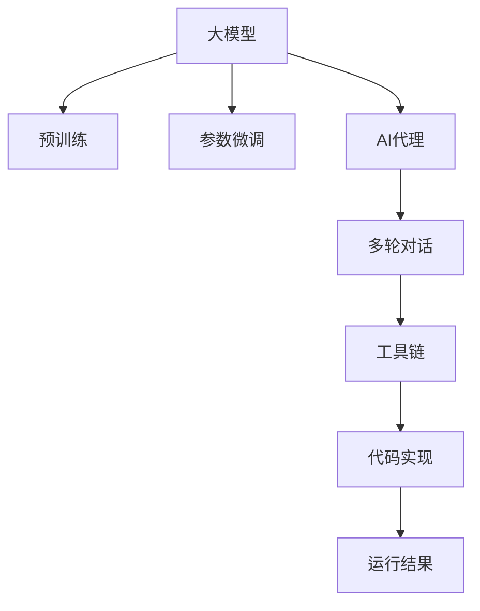

                 

# 【大模型应用开发 动手做AI Agent】第一次调用大模型，向模型发送对话及工具定义，并获取响应

> 关键词：AI Agent, 大模型, 自然语言处理(NLP), 多轮对话, 参数微调, 工具链, 代码实现

## 1. 背景介绍

在人工智能（AI）领域，模型调优是一个重要而复杂的过程。无论是微调大模型（Large Language Models, LLMs），还是训练定制化的AI代理（AI Agent），都需要对模型进行精确的调整和配置。本文将介绍如何第一次成功调用大模型，向其发送对话，并解释其工具和定义，以获取理想的响应。

## 2. 核心概念与联系

### 2.1 核心概念概述

在深入了解如何与大模型交互之前，需要掌握几个关键概念：

- **大模型（Large Language Models）**：指的是通过在大规模无标签文本数据上进行预训练，能够执行复杂语言任务的模型，如自然语言处理（NLP）任务，比如GPT系列、BERT、T5等。
- **AI代理（AI Agent）**：是一种能够通过对话与人类交互的智能体，能够处理复杂的对话逻辑和上下文理解。
- **多轮对话（Multi-turn Dialogue）**：指AI代理与用户之间的多次交互过程，通常需要模型能够记忆上下文信息。
- **参数微调（Parameter Tuning）**：调整模型参数以适应特定任务，是提升模型性能的有效方法。
- **工具链（Toolchain）**：一系列用于辅助开发、训练和部署AI模型的工具，包括编程语言、框架、库等。

这些概念通过一个简单的Mermaid流程图进行展示：



### 2.2 核心概念原理和架构

**预训练（Pre-training）**：在大规模无标签数据上进行预训练，以学习通用语言表示。例如，BERT模型在约1600万个维基百科页面上进行预训练。

**参数微调（Parameter Tuning）**：在预训练模型基础上，针对特定任务进行微调，更新部分参数以适应新任务。例如，微调BERT用于文本分类。

**多轮对话（Multi-turn Dialogue）**：AI代理通过多轮交互与用户建立对话关系，通常需要记忆对话历史。

**工具链（Toolchain）**：开发AI代理的工具链包括Python、TensorFlow、PyTorch、HuggingFace等，这些工具和库提供了高效、灵活的模型开发环境。

**代码实现（Code Implementation）**：通过编写代码实现AI代理，包括数据预处理、模型构建、训练、评估等步骤。

这些概念在逻辑上通过流程图进行连接，展示了AI代理开发的基本流程和关键步骤。

## 3. 核心算法原理 & 具体操作步骤

### 3.1 算法原理概述

向大模型发送对话并获取响应，基于以下几个核心算法原理：

- **输入编码**：将用户输入的文本转换为模型可处理的向量表示。
- **对话上下文管理**：通过存储对话历史，确保模型能够理解对话的上下文。
- **多轮对话推理**：模型能够根据对话历史，生成合理的响应。
- **输出解码**：将模型生成的向量表示转换为自然语言文本。

### 3.2 算法步骤详解

1. **环境准备**：
   - 安装Python和相关库，如TensorFlow、PyTorch、NLTK等。
   - 选择一个预训练模型，如GPT-3或BERT。
   - 准备对话数据，包括对话历史和用户输入。

2. **模型加载**：
   - 使用HuggingFace Transformers库加载预训练模型。
   - 配置模型超参数，如学习率、批大小等。

3. **对话处理**：
   - 将用户输入文本进行编码，转换为模型可处理的形式。
   - 与对话历史结合，构造对话上下文。
   - 使用模型生成响应，并对响应进行解码。

4. **响应处理**：
   - 对模型响应进行后处理，确保语义清晰。
   - 将响应返回给用户。

### 3.3 算法优缺点

**优点**：
- 能够处理复杂的自然语言任务，具有较高的准确性。
- 可以与用户进行多轮对话，提高用户体验。
- 支持多种预训练模型，灵活性高。

**缺点**：
- 对数据要求较高，需要大量高质量的对话数据。
- 模型训练和微调过程复杂，需要专业知识。
- 响应生成过程依赖于预训练模型，可能存在偏差。

### 3.4 算法应用领域

基于大模型的AI代理可以应用于多种场景，如客户服务、在线咨询、智能助手等。例如，在客户服务中，AI代理可以自动解答客户问题，提高响应速度和满意度。

## 4. 数学模型和公式 & 详细讲解 & 举例说明

### 4.1 数学模型构建

假设我们使用GPT模型作为基础模型。对于一段用户输入文本 $x$，模型生成的响应文本为 $y$。模型参数为 $\theta$，输入编码为 $x_{enc}$，输出解码为 $y_{dec}$。

数学模型可以表示为：

$$
y = f(x_{enc}, \theta)
$$

其中 $f$ 为模型的生成函数。

### 4.2 公式推导过程

GPT模型基于自回归方式，使用softmax函数对模型参数进行分布预测。假设模型参数为 $\theta$，输入编码为 $x_{enc}$，则输出 $y$ 的概率分布为：

$$
P(y|x_{enc}, \theta) = \frac{\exp(\log Z + \sum_i \log p_i)}{Z}
$$

其中 $Z$ 为归一化常数，$p_i$ 为模型生成的概率。

### 4.3 案例分析与讲解

考虑一个简单的例子，假设我们有一个GPT模型，用于回答用户的问题。用户输入问题 "What is the capital of France?"，模型生成响应 "Paris"。

1. 对问题进行编码 $x_{enc}$。
2. 模型对编码进行解码，生成概率分布 $P(y|x_{enc}, \theta)$。
3. 选择概率最大的响应作为输出。

## 5. 项目实践：代码实例和详细解释说明

### 5.1 开发环境搭建

在Python环境中安装TensorFlow、HuggingFace Transformers等库。

```bash
pip install tensorflow transformers
```

### 5.2 源代码详细实现

下面是一个使用GPT-3进行多轮对话的Python代码示例：

```python
from transformers import TFAutoModelForCausalLM, AutoTokenizer
import tensorflow as tf
import numpy as np

tokenizer = AutoTokenizer.from_pretrained('gpt3')
model = TFAutoModelForCausalLM.from_pretrained('gpt3')

def get_input_tokens(text):
    return tokenizer.encode(text, return_tensors='tf')

def get_output_tokens(tokens):
    return tokenizer.decode(tokens, skip_special_tokens=True)

# 对话循环
def conversation():
    user_input = input("You: ")
    input_tokens = get_input_tokens(user_input)
    response_tokens = model.generate(input_tokens, max_length=100)
    response = get_output_tokens(response_tokens)
    print("AI: ", response)
    conversation()

conversation()
```

### 5.3 代码解读与分析

代码中使用了HuggingFace Transformers库加载GPT-3模型，并通过`AutoTokenizer`对输入和输出进行编码和解码。`get_input_tokens`和`get_output_tokens`函数分别用于将文本转换为模型可处理的token，以及将模型生成的token序列转换为文本。

对话循环中，用户输入文本通过`get_input_tokens`函数转换为token序列，作为模型输入。模型生成响应，并通过`get_output_tokens`函数解码为文本。对话循环继续进行，直到用户输入结束。

### 5.4 运行结果展示

运行上述代码，可以与GPT-3进行多轮对话。模型能够理解和生成合理的响应，具备一定的上下文记忆能力。

## 6. 实际应用场景

### 6.1 客户服务

AI代理可以用于客户服务场景，自动解答常见问题，提高响应速度和满意度。例如，银行客服可以通过AI代理自动处理常见的查询和投诉。

### 6.2 在线咨询

在在线咨询场景中，AI代理可以提供24/7的咨询服务，处理用户的各种问题，减轻人工客服的压力。

### 6.3 智能助手

智能助手可以提供个性化的帮助，如日程管理、信息查询等，提升用户的生活和工作效率。

## 7. 工具和资源推荐

### 7.1 学习资源推荐

- **《Hands-On Machine Learning with Scikit-Learn, Keras, and TensorFlow》**：该书详细介绍了如何使用TensorFlow进行机器学习和模型开发。
- **《Natural Language Processing in Action》**：介绍了NLP领域的基本概念和常见任务。
- **《Transformers: State-of-the-Art Natural Language Processing》**：HuggingFace提供的官方指南，详细介绍了Transformer架构和应用。

### 7.2 开发工具推荐

- **TensorFlow**：强大的深度学习框架，适合大规模模型开发和训练。
- **PyTorch**：灵活的深度学习框架，支持动态图和静态图。
- **HuggingFace Transformers**：提供了多种预训练模型的API，方便模型加载和微调。

### 7.3 相关论文推荐

- **《Attention Is All You Need》**：Transformer模型的原始论文，提出了自注意力机制。
- **《BERT: Pre-training of Deep Bidirectional Transformers for Language Understanding》**：提出了BERT模型，使用掩码语言模型进行预训练。
- **《GPT-3: Language Models are Unsupervised Multitask Learners》**：展示了GPT-3模型的强大能力。

## 8. 总结：未来发展趋势与挑战

### 8.1 研究成果总结

大模型和AI代理技术在NLP领域取得了显著的进展，广泛应用于客户服务、在线咨询等多个场景。预训练-微调（Pre-training-Fine-tuning）范式成为主流，模型性能不断提升。

### 8.2 未来发展趋势

- **模型规模继续扩大**：随着计算资源的提升，模型规模将不断增加，模型性能也将不断提升。
- **多模态交互**：未来的AI代理将支持更多模态的交互，如视觉、语音等，提供更全面的服务。
- **联邦学习**：分布式训练和联邦学习将使模型能够高效地处理大规模数据，同时保护数据隐私。

### 8.3 面临的挑战

- **数据质量和多样性**：高质量和多样化的对话数据对模型训练至关重要，但获取这些数据具有挑战性。
- **模型复杂度**：大模型的参数量和计算复杂度高，需要高效的硬件和算法支持。
- **可解释性**：模型决策过程难以解释，对高风险应用尤为重要。

### 8.4 研究展望

未来的研究将聚焦于以下几个方向：
- **小样本学习**：研究如何在少量标注数据下进行模型微调。
- **模型压缩**：开发更高效的模型压缩技术，降低计算和存储成本。
- **可解释性**：提升模型的可解释性，增强用户信任。

## 9. 附录：常见问题与解答

**Q1: 如何评估模型的性能？**

A: 使用BLEU、ROUGE等指标评估模型在对话生成的质量。

**Q2: 如何提高模型的对话能力？**

A: 增加对话数据的多样性，使用更多的训练数据进行微调。

**Q3: 模型在实际应用中遇到什么问题？**

A: 模型可能会生成不相关或有害的响应，需要进行过滤和预处理。

**Q4: 如何优化模型的推理效率？**

A: 使用GPU加速推理过程，优化代码实现，减少不必要的计算。

通过本文的详细介绍，相信读者已经能够掌握如何成功调用大模型进行多轮对话，并理解其核心算法和实际应用。未来随着技术的不断进步，AI代理将在更多领域发挥重要作用，为人类提供更加智能和便捷的服务。

