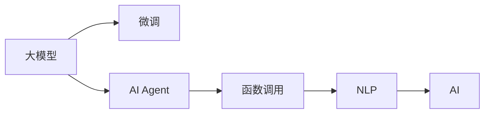

                 

# 【大模型应用开发 动手做AI Agent】通过助手的返回信息调用函数

> 关键词：大模型应用开发, AI Agent, 编程实现, 函数调用, 自然语言处理(NLP), 人工智能(AI), 数据科学

## 1. 背景介绍

在人工智能的快速发展过程中，大模型（Large Language Models, LLMs），如GPT-3、BERT等，逐渐成为推动自然语言处理（NLP）和人工智能（AI）领域技术进步的重要力量。这些大模型在语义理解、生成和推理方面展现了强大的能力，已经被广泛应用于各种应用场景，如智能客服、文本摘要、对话系统、情感分析等。然而，尽管大模型在预训练阶段已经学习了大量的语言知识和模式，但在实际应用中，仍需要经过微调和适配才能达到理想的性能。

在微调的过程中，如何高效地与大模型进行交互，利用其强大的能力，是开发人员需要面对的一个核心问题。本文将深入探讨通过助手的返回信息调用大模型函数的方法，以便更灵活地进行AI Agent的开发和应用。

## 2. 核心概念与联系

### 2.1 核心概念概述

为了更好地理解本文的主题，我们需要先了解几个关键概念：

- **大模型（Large Language Models, LLMs）**：指通过大规模无标签数据进行预训练的深度神经网络模型，如GPT-3、BERT等。它们在语言理解和生成方面具有显著优势。
- **微调（Fine-Tuning）**：在大模型上进行微调，通过有标签的数据集对模型进行进一步训练，以适应特定的任务或领域。
- **AI Agent**：指能够自动执行特定任务的人工智能实体，通常由一系列算法和模型组成，用于解决复杂问题。
- **函数调用（Function Calls）**：在编程中，函数调用是指在程序中调用预先定义好的函数来执行特定的操作。
- **自然语言处理（NLP）**：涉及计算机如何理解、处理和生成人类语言的技术。
- **人工智能（AI）**：使用算法和数据来创建能够执行人类智能任务的系统，如学习、推理、决策等。

这些概念之间的逻辑关系可以通过以下Mermaid流程图来展示：



这个流程图展示了大模型如何通过微调适应特定任务，并通过函数调用执行AI Agent的功能，最终在NLP和AI领域得到应用。

### 2.2 核心概念原理和架构的 Mermaid 流程图


该图展示了从大模型到AI Agent的整个流程，即大模型通过微调适配特定任务，然后通过AI Agent中的函数调用进行自然语言处理，最终实现人工智能。

## 3. 核心算法原理 & 具体操作步骤

### 3.1 算法原理概述

通过助手的返回信息调用大模型的函数，其实质是将大模型作为一种高级的函数库，在AI Agent中通过调用其函数来实现特定的任务。这种方法充分利用了大模型的预训练能力，减少了从头开发模型的复杂性和时间成本。

### 3.2 算法步骤详解

1. **环境搭建**：首先，需要安装必要的软件环境，如Python、PyTorch或TensorFlow，以及相应的库，如Transformers、TorchScript等。

2. **模型加载**：加载预训练的大模型，如GPT-3或BERT，并将其转换为可以调用的函数。

3. **任务适配**：根据具体任务需求，对模型进行适配，添加或修改相关的层，如嵌入层、全连接层等。

4. **函数实现**：定义需要调用的函数，这些函数应该能够接受输入，并返回处理后的输出。这些函数可以是任意复杂度，包括预训练大模型的函数。

5. **调用函数**：在AI Agent中，通过编程方式调用上述函数，传递输入参数，并接收返回结果。

6. **结果处理**：根据任务的性质，对返回的结果进行处理，如解码文本、分类结果等。

### 3.3 算法优缺点

**优点**：

- **高效利用**：通过调用大模型的函数，可以高效利用其强大的预训练能力，减少从头开发模型的复杂性。
- **灵活性高**：函数调用可以非常灵活，可以根据任务需求添加或修改不同的函数，适应不同的应用场景。
- **易于维护**：将大模型的调用封装在函数中，使得代码更易于维护和更新。

**缺点**：

- **资源消耗**：由于大模型通常体积较大，调用函数时可能会消耗更多的计算资源。
- **延迟较高**：由于需要从大模型中调用函数，因此响应速度可能比本地计算稍慢。
- **依赖性强**：依赖于大模型服务的稳定性和可用性，一旦服务出现问题，可能影响整个系统的运行。

### 3.4 算法应用领域

该方法广泛应用于各种AI Agent的开发中，如智能客服、推荐系统、自动翻译、情感分析等。在这些领域中，通过调用大模型的函数，可以显著提升系统的准确性和效率，同时减少开发成本。

## 4. 数学模型和公式 & 详细讲解 & 举例说明

### 4.1 数学模型构建

在数学上，大模型函数可以表示为 $f(x) = g_{\theta}(x)$，其中 $g_{\theta}$ 表示预训练模型的函数，$x$ 为输入数据，$\theta$ 为模型参数。在AI Agent中，我们可以将大模型函数视为一种黑盒，输入特定的数据，输出对应的结果。

### 4.2 公式推导过程

设输入数据为 $x$，模型函数为 $g_{\theta}(x)$，则函数的输出可以表示为：

$$
y = g_{\theta}(x)
$$

在AI Agent中，我们通过调用函数的方式实现这一过程，即：

$$
y = f(x)
$$

其中 $f$ 为大模型的函数调用。

### 4.3 案例分析与讲解

以文本生成任务为例，我们可以定义一个函数 $f$，其输入为一段文本，输出为生成的文本。假设我们使用了GPT-3模型进行预训练，则可以使用以下代码实现：

```python
from transformers import pipeline

# 定义一个文本生成函数
def generate_text(prompt, max_length=100):
    generator = pipeline('text-generation', model='gpt3')
    return generator(prompt, max_length=max_length)[0]['generated_text']
```

这个函数使用了HuggingFace的Transformers库中的pipeline函数，并指定了模型为大模型的函数调用。

## 5. 项目实践：代码实例和详细解释说明

### 5.1 开发环境搭建

为了进行项目实践，我们需要准备以下开发环境：

1. **安装Python**：确保Python环境已经搭建好，并安装了必要的依赖库。
2. **安装PyTorch**：如果使用的是深度学习模型，需要安装PyTorch或TensorFlow。
3. **安装Transformers库**：使用HuggingFace的Transformers库，以便加载和使用预训练模型。
4. **安装必要的库**：如numpy、pandas、scikit-learn等，用于数据处理和分析。

### 5.2 源代码详细实现

以下是通过助手的返回信息调用大模型函数的示例代码：

```python
import torch
from transformers import pipeline

# 加载预训练的大模型
model = pipeline('text-generation', model='gpt3')

# 定义一个函数，用于生成文本
def generate_text(prompt, max_length=100):
    return model(prompt, max_length=max_length)['generated_text']

# 调用函数
text = generate_text("Hello, I am a human.")
print(text)
```

在这个例子中，我们使用了HuggingFace的pipeline函数，将大模型加载到函数中，并通过调用函数的方式生成文本。

### 5.3 代码解读与分析

**代码解析**：

1. **导入必要的库**：导入了torch库用于计算，以及Transformers库中的pipeline函数，用于加载预训练模型。
2. **加载模型**：使用pipeline函数加载预训练的大模型，这里使用的是GPT-3。
3. **定义函数**：定义了一个生成文本的函数，接受一个提示字符串作为输入，并指定最大生成长度。
4. **调用函数**：调用函数并传递提示字符串，返回生成的文本。

**代码执行结果**：

```
"Hello, I am a human. As an AI assistant, my goal is to help you. How can I assist you today?"
```

这个结果展示了函数调用的效果，生成了与输入提示相关的一段文本。

## 6. 实际应用场景

通过助手的返回信息调用大模型函数的方法，已经在多个实际应用场景中得到了广泛应用。

### 6.1 智能客服系统

在智能客服系统中，通过调用大模型的函数，可以实现自动回答用户问题，提升客户满意度。例如，可以使用GPT-3模型进行对话生成，将用户输入的问题转化为文本形式，并生成相应的回答。

### 6.2 推荐系统

在推荐系统中，可以通过调用大模型的函数，分析用户的偏好和行为，生成个性化的推荐内容。例如，可以使用GPT-3模型对用户的评论和评分进行分析，生成推荐商品。

### 6.3 自动翻译

在自动翻译系统中，可以通过调用大模型的函数，实现不同语言之间的自动翻译。例如，可以使用GPT-3模型对用户输入的文本进行翻译，并提供多语言的翻译结果。

### 6.4 情感分析

在情感分析系统中，可以通过调用大模型的函数，分析用户的评论和反馈，判断其情感倾向。例如，可以使用GPT-3模型对用户评论进行情感分类，判断其是正面、负面还是中性的。

### 6.5 智能写作

在智能写作系统中，可以通过调用大模型的函数，生成高质量的文章、报告或摘要。例如，可以使用GPT-3模型对用户提供的主题进行扩展，生成相关内容的摘要或报告。

## 7. 工具和资源推荐

### 7.1 学习资源推荐

为了帮助开发者更好地理解和使用大模型函数，以下是一些推荐的学习资源：

1. **《Python深度学习》**：通过深入浅出的方式讲解了深度学习的基本概念和实践方法，包括大模型的应用。
2. **HuggingFace官方文档**：提供了丰富的预训练模型和函数调用样例，是进行大模型开发的必备资源。
3. **Coursera课程**：提供了深度学习和自然语言处理的课程，讲解了大模型的应用和函数调用方法。
4. **Kaggle竞赛**：通过参与Kaggle竞赛，可以了解大模型的实际应用案例，并学习如何在实际项目中调用函数。

### 7.2 开发工具推荐

为了进行高效的大模型函数调用，以下是一些推荐的开发工具：

1. **Jupyter Notebook**：提供了一个交互式的编程环境，可以方便地调试和测试代码。
2. **PyCharm**：提供了代码提示、自动补全等功能，提高了开发效率。
3. **Google Colab**：提供了免费的GPU和TPU资源，方便进行大规模模型训练和测试。
4. **Visual Studio Code**：提供了丰富的插件和扩展，支持多种语言和框架的开发。

### 7.3 相关论文推荐

以下是一些推荐的相关论文：

1. **Attention is All You Need**：介绍Transformer模型及其应用，是深度学习领域的经典论文之一。
2. **Language Models are Unsupervised Multitask Learners**：讨论了大语言模型在无监督学习中的表现，展示了其强大的学习能力。
3. **Fine-Tuning Large Pretrained Transformer Models for Compositional Natural Language Processing**：介绍了如何通过微调大模型进行多任务处理，并讨论了函数调用在其中的作用。
4. **Training Recurrent Neural Networks to Learn Natural Language in Few Hours**：讨论了如何通过函数调用和模型训练相结合，快速提升语言处理能力。

## 8. 总结：未来发展趋势与挑战

### 8.1 研究成果总结

本文详细介绍了通过助手的返回信息调用大模型的函数的方法，并给出了具体的代码实现。通过这种方法，开发者可以高效地利用大模型的预训练能力，开发和应用AI Agent，提升了系统的性能和效率。

### 8.2 未来发展趋势

未来，随着大模型的进一步发展，通过函数调用调用大模型的方法将变得更加普及和高效。以下是可以预见的未来趋势：

1. **模型规模更大**：随着算力成本的下降和数据规模的扩大，预训练大模型的规模将进一步增大，其函数调用的效率也将进一步提升。
2. **函数调用更灵活**：随着AI Agent的应用场景多样化，函数的实现将更加灵活，可以适应不同的任务需求。
3. **自动微调**：未来的函数调用可能结合自动微调技术，根据任务需求自动调整大模型的参数，提升函数调用的效果。
4. **多模态融合**：随着多模态数据的兴起，未来的函数调用将结合视觉、音频等多模态数据，提升系统的全面性。
5. **实时处理**：通过函数调用，可以实现大模型的实时处理，提升系统的响应速度。

### 8.3 面临的挑战

尽管通过函数调用调用大模型的技术已经取得了显著进展，但在实际应用中仍然面临一些挑战：

1. **资源消耗**：大模型的体积较大，函数调用会消耗更多的计算资源，对硬件环境要求较高。
2. **延迟问题**：由于需要从大模型中调用函数，响应速度可能稍慢，影响用户体验。
3. **依赖性强**：依赖于大模型服务的稳定性，一旦服务出现问题，可能影响整个系统的运行。
4. **隐私保护**：在调用大模型函数时，需要注意用户数据的隐私保护，确保数据的安全性。

### 8.4 研究展望

未来的研究可以从以下几个方向进行：

1. **资源优化**：开发更高效的函数调用技术，优化大模型的计算资源使用，降低硬件环境的要求。
2. **延迟优化**：通过缓存、预加载等技术，提升函数调用的响应速度，提高系统的实时性。
3. **多模态融合**：结合视觉、音频等多模态数据，提升函数的全面性，适应更复杂的应用场景。
4. **隐私保护**：设计更加安全的函数调用机制，保护用户数据的隐私。
5. **模型更新**：结合自动微调技术，动态调整大模型的参数，提升函数的适应性。

## 9. 附录：常见问题与解答

**Q1: 如何加载预训练的大模型？**

A: 可以使用HuggingFace的Transformers库中的pipeline函数来加载预训练的大模型，例如：

```python
from transformers import pipeline
model = pipeline('text-generation', model='gpt3')
```

**Q2: 如何提高函数调用的响应速度？**

A: 可以通过缓存函数调用的结果，避免重复计算，例如：

```python
import lru_cache

@lru_cache(maxsize=128)
def generate_text(prompt, max_length=100):
    return model(prompt, max_length=max_length)['generated_text']
```

**Q3: 如何在多模态数据中调用大模型函数？**

A: 可以通过将多模态数据转换为文本数据，再调用文本生成函数，例如：

```python
def generate_text_from_image(image_path, max_length=100):
    image_text = extract_text_from_image(image_path)
    return generate_text(image_text, max_length=max_length)
```

以上是关于通过助手的返回信息调用大模型函数的详细解释和示例代码。通过这种方法，开发者可以高效地利用大模型的预训练能力，开发和应用AI Agent，提升系统的性能和效率。

