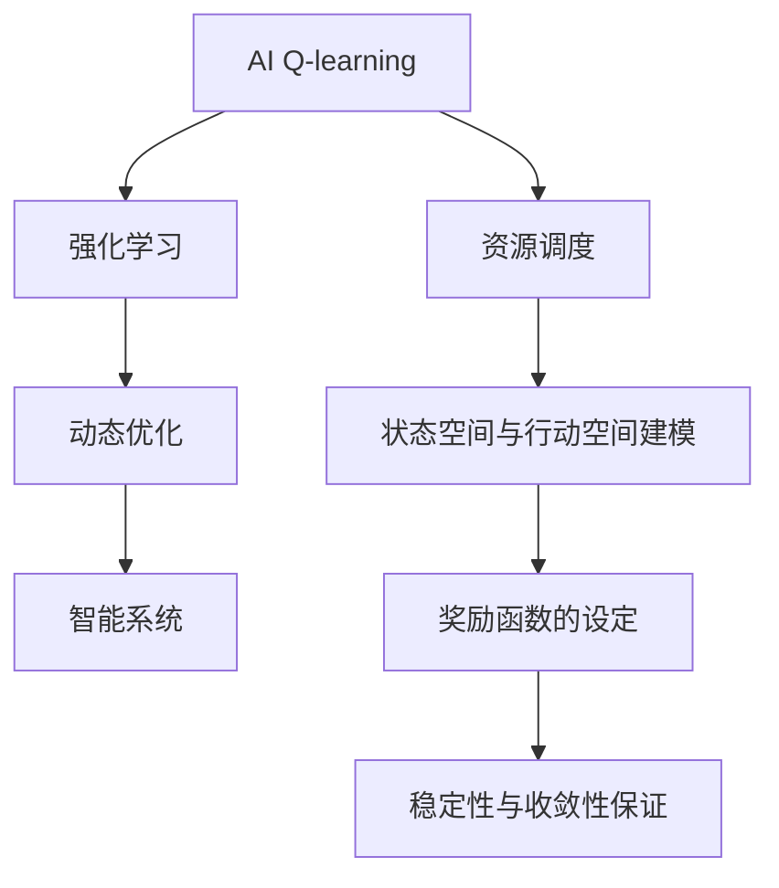

                 

# 一切皆是映射：AI Q-learning在资源调度中的新突破

> 关键词：Q-learning, 强化学习, 资源调度, 动态优化, 智能系统, 实时调度, 优化算法

## 1. 背景介绍

在当今数字化时代，资源调度问题已成为各种智能系统中不可或缺的一部分。无论是数据中心的计算资源调度、电网能源调度，还是物联网设备的资源管理，都面临如何在动态变化的环境中，高效、公平、稳定地分配和管理资源的问题。传统的静态或规则驱动的调度算法难以应对快速变化的场景，无法充分利用资源并提升系统效率。因此，基于强化学习的智能调度方法，尤其是AI Q-learning算法，近年来逐渐成为学术界和工业界关注的焦点。

### 1.1 问题由来

AI Q-learning是一种基于策略的强化学习算法，主要用于在动态环境中寻找最优的资源调度策略。与传统的基于规则或模型的调度方法不同，Q-learning算法可以通过与环境的交互，学习到最优的策略。这种学习过程类似于人类的试错学习，不断尝试并根据结果调整策略。然而，在资源调度领域，Q-learning算法面临着动态性、不确定性和复杂性等挑战。如何在资源调度中有效地应用Q-learning算法，仍然是一个值得深入探讨的问题。

### 1.2 问题核心关键点

Q-learning在资源调度中的应用核心关键点包括：
- 动态环境下的最优策略搜索：资源调度环境往往具有高度不确定性和动态性，如何通过Q-learning算法实时地适应环境变化，并找到最优的调度策略，是关键问题。
- 状态空间与行动空间建模：资源调度问题涉及多种资源和任务，如何合理地构建状态空间和行动空间，以支持Q-learning算法的学习过程，是一个重要问题。
- 奖励函数的设定：合理的奖励函数能够引导Q-learning算法向期望的调度策略方向学习，如何在资源调度问题中设定有效的奖励函数，是一个需要深入研究的课题。
- 稳定性与收敛性保证：Q-learning算法在实践中可能出现不稳定或收敛性问题，如何在资源调度应用中保证算法的稳定性和收敛性，是一个需要解决的重要问题。

## 2. 核心概念与联系

### 2.1 核心概念概述

为更好地理解AI Q-learning在资源调度中的应用，本节将介绍几个密切相关的核心概念：

- AI Q-learning：一种基于策略的强化学习算法，通过与环境交互，学习最优的策略，适用于解决动态优化问题。
- 强化学习：一种通过试错学习和环境反馈来优化策略的学习方法，广泛应用于机器人控制、游戏AI、资源调度等领域。
- 动态优化：在动态环境中，通过优化算法找到最优的资源分配和调度策略的过程。
- 智能系统：能够自主学习、适应和优化环境的智能系统，通过学习和决策实现复杂的任务。

这些核心概念之间的逻辑关系可以通过以下Mermaid流程图来展示：



这个流程图展示了大语言模型的核心概念及其之间的关系：

1. AI Q-learning作为强化学习的一种形式，是动态优化问题的解决方案。
2. 动态优化问题通常涉及智能系统，智能系统通过AI Q-learning算法，实时地适应环境变化，寻找最优策略。
3. 在资源调度问题中，需要构建合适的状态空间和行动空间，并设定合理的奖励函数。
4. 稳定性与收敛性是AI Q-learning在实际应用中的关键问题，需要通过各种技术手段解决。

## 3. 核心算法原理 & 具体操作步骤

### 3.1 算法原理概述

AI Q-learning在资源调度中的应用，主要是通过与调度环境的交互，学习到最优的调度策略。假设存在一个资源调度系统，系统中有多种资源和任务，资源调度目标是在满足资源约束的前提下，最大化系统性能或最小化成本。AI Q-learning算法通过与环境交互，不断调整调度策略，优化资源分配。

形式化地，设资源调度系统的状态空间为 $S$，行动空间为 $A$，调度目标函数为 $R(S, A)$。AI Q-learning算法的目标是最小化系统目标函数 $R(S, A)$。具体步骤如下：

1. 初始化Q值函数：
   $$
   Q(s, a) \leftarrow 0
   $$
   其中，$s \in S$ 表示系统当前状态，$a \in A$ 表示当前的行动。

2. 迭代学习：
   $$
   Q(s, a) \leftarrow Q(s, a) + \alpha \left( R(s, a) + \gamma \max_{a'} Q(s', a') - Q(s, a) \right)
   $$
   其中，$\alpha$ 为学习率，$\gamma$ 为折扣因子，$s'$ 为执行行动 $a$ 后到达的新状态。

3. 行动策略：
   $$
   a \leftarrow \arg\max_a Q(s, a)
   $$

4. 更新状态：
   $$
   s \leftarrow s'
   $$

5. 重复执行步骤2-4，直至收敛。

### 3.2 算法步骤详解

AI Q-learning在资源调度中的应用步骤详解如下：

**Step 1: 状态空间与行动空间建模**
- 对资源调度环境进行建模，确定状态空间 $S$ 和行动空间 $A$。状态可以包括资源当前的可用量、任务的等待队列、系统的负载等因素。行动可以包括资源分配、任务调度、优先级调整等操作。
- 设计状态转移函数 $T(s, a)$，描述从状态 $s$ 执行行动 $a$ 后到达新状态 $s'$ 的规则。

**Step 2: 设定奖励函数**
- 根据调度目标，设计奖励函数 $R(s, a)$。例如，可以设计奖励函数为资源利用率、任务完成时间、系统延迟等指标。
- 设计奖励函数的折扣因子 $\gamma$，通常取值为0.9-0.99之间，以保证长期奖励的权重。

**Step 3: 初始化Q值函数**
- 初始化Q值函数 $Q(s, a)$，一般使用最小值0进行初始化。

**Step 4: 迭代学习**
- 从任意初始状态 $s$ 开始，执行行动 $a$，得到新状态 $s'$ 和奖励 $R(s, a)$。
- 根据Q值函数的更新公式，计算当前Q值 $Q(s, a)$ 的更新值。
- 重复执行上述步骤，直至所有状态 $s \in S$ 都访问过。

**Step 5: 行动策略**
- 从当前状态 $s$ 出发，通过Q值函数计算每个行动 $a \in A$ 的Q值。
- 选择Q值最大的行动 $a$ 执行。

**Step 6: 更新状态**
- 将系统状态更新为执行行动后的新状态 $s'$。

**Step 7: 迭代执行**
- 重复执行步骤4-6，直至收敛。

### 3.3 算法优缺点

AI Q-learning在资源调度中的应用具有以下优点：
1. 能够动态适应环境变化：AI Q-learning算法通过不断与环境交互，能够实时适应环境变化，找到最优的调度策略。
2. 无需显式建模：通过学习环境动态特性，AI Q-learning算法能够处理复杂和不确定性的调度问题。
3. 鲁棒性强：AI Q-learning算法在面对噪声和随机事件时，具有较好的鲁棒性。

同时，该算法也存在一些缺点：
1. 学习速度慢：AI Q-learning算法需要大量的试错学习，学习速度较慢。
2. 需要大量的训练数据：AI Q-learning算法需要大量的训练数据，才能获得较优的Q值函数。
3. 需要精心设计奖励函数：奖励函数的设计需要考虑多方面因素，否则可能影响算法的收敛性和效果。
4. 容易陷入局部最优：AI Q-learning算法可能陷入局部最优，无法找到全局最优解。

尽管存在这些缺点，AI Q-learning算法仍在大规模资源调度问题中表现出强大的适应性和优化能力。

### 3.4 算法应用领域

AI Q-learning在资源调度中的应用领域非常广泛，包括但不限于：

- 数据中心计算资源调度：通过对服务器的CPU、内存、网络带宽等资源进行动态调度，提升系统性能和资源利用率。
- 电网能源调度：通过对发电厂、变电站、输电线路等的实时调度，保障电力系统的稳定运行和节能减排。
- 物联网设备资源管理：通过对设备的任务调度、优先级调整等操作，优化设备的资源使用效率。
- 交通流量控制：通过对交通信号灯的动态调整，优化道路交通流量，减少交通拥堵。

AI Q-learning算法的应用，显著提升了各类智能系统的效率和资源利用率，推动了智慧城市的建设和发展。

## 4. 数学模型和公式 & 详细讲解  
### 4.1 数学模型构建

以下将使用数学语言对AI Q-learning在资源调度中的应用进行更加严格的刻画。

设资源调度系统的状态空间为 $S = \{s_1, s_2, ..., s_n\}$，行动空间为 $A = \{a_1, a_2, ..., a_m\}$，系统的调度目标函数为 $R(s, a)$。假设系统当前状态为 $s$，执行行动 $a$ 后到达新状态 $s'$，奖励函数为 $R(s, a)$，学习率 $\alpha$，折扣因子 $\gamma$。

定义Q值函数 $Q(s, a)$ 为当前状态 $s$ 下执行行动 $a$ 的累积奖励期望，即：
$$
Q(s, a) = \mathbb{E}\left[\sum_{t=0}^{\infty} \gamma^t R(s_t, a_t) \mid s_0 = s, a_0 = a\right]
$$

其中，$(s_t, a_t)$ 表示在时间 $t$ 的资源调度状态和行动，$R(s_t, a_t)$ 表示在时间 $t$ 的奖励。

根据上述定义，AI Q-learning的迭代更新公式为：
$$
Q(s, a) \leftarrow Q(s, a) + \alpha \left( R(s, a) + \gamma \max_{a'} Q(s', a') - Q(s, a) \right)
$$

### 4.2 公式推导过程

以下将推导AI Q-learning算法的迭代更新公式。

设当前状态为 $s$，执行行动 $a$ 后到达新状态 $s'$，奖励为 $R(s, a)$。根据Q值函数的定义，有：
$$
Q(s, a) = \mathbb{E}\left[\sum_{t=0}^{\infty} \gamma^t R(s_t, a_t) \mid s_0 = s, a_0 = a\right]
$$

将 $Q(s, a)$ 表示为当前时间 $t$ 的期望奖励加上未来时间的期望奖励，得：
$$
Q(s, a) = R(s, a) + \gamma \mathbb{E}\left[\sum_{t=1}^{\infty} \gamma^{t-1} R(s_{t+1}, a_{t+1}) \mid s_t = s', a_t = a'\right]
$$

进一步推导，得到：
$$
Q(s, a) = R(s, a) + \gamma Q(s', a')
$$

将 $Q(s', a')$ 代入，得：
$$
Q(s, a) = R(s, a) + \gamma \max_{a'} Q(s', a')
$$

将上式代入AI Q-learning的迭代更新公式，得：
$$
Q(s, a) \leftarrow Q(s, a) + \alpha \left( R(s, a) + \gamma \max_{a'} Q(s', a') - Q(s, a) \right)
$$

### 4.3 案例分析与讲解

以数据中心计算资源调度的AI Q-learning应用为例，进行分析。

假设数据中心有10台服务器，当前状态为所有服务器空闲，行动空间为0-9，分别代表分配给第1到第10台服务器的任务。设状态转移函数为：

- 执行行动 $a$ 时，将当前任务分配给服务器 $s'$，新状态 $s'$ 为服务器 $s'$ 的任务数加1。
- 新状态 $s'$ 中任务数为0时，可以执行另一个任务，否则为新状态 $s'$ 分配下一个任务。

设奖励函数为：

- 执行行动 $a$ 时，奖励 $R(s, a)$ 为任务完成时间和服务器负载的加权和。
- 奖励函数为 $R(s, a) = \lambda_t \cdot \text{Task\_Completion\_Time} + (1-\lambda_t) \cdot \text{Load\_Utilization}$，其中 $\lambda_t$ 为任务权重，取值为0.5。

使用AI Q-learning算法进行计算资源调度的步骤如下：

1. 初始化Q值函数 $Q(s, a) = 0$。
2. 从当前状态 $s$ 开始，执行行动 $a$，得到新状态 $s'$ 和奖励 $R(s, a)$。
3. 根据Q值函数的更新公式，计算当前Q值 $Q(s, a)$ 的更新值。
4. 从当前状态 $s$ 出发，通过Q值函数计算每个行动 $a$ 的Q值。
5. 选择Q值最大的行动 $a$ 执行。
6. 更新系统状态 $s$。
7. 重复执行步骤2-6，直至收敛。

## 5. 项目实践：代码实例和详细解释说明

### 5.1 开发环境搭建

在进行AI Q-learning在资源调度中的实践前，需要先准备好开发环境。以下是使用Python进行OpenAI Gym环境开发的环境配置流程：

1. 安装Anaconda：从官网下载并安装Anaconda，用于创建独立的Python环境。

2. 创建并激活虚拟环境：
```bash
conda create -n qlearning-env python=3.8 
conda activate qlearning-env
```

3. 安装OpenAI Gym和PyTorch：
```bash
pip install gym torch gym[atari]
```

4. 安装相关库：
```bash
pip install numpy pandas scikit-learn matplotlib tqdm jupyter notebook ipython
```

完成上述步骤后，即可在`qlearning-env`环境中开始AI Q-learning在资源调度中的实践。

### 5.2 源代码详细实现

下面以数据中心计算资源调度为例，给出使用OpenAI Gym和PyTorch进行AI Q-learning的Python代码实现。

首先，定义状态空间和行动空间：

```python
import gym
from gym import spaces
import numpy as np

class ResourceScheduler(gym.Env):
    def __init__(self, num_servers, num_tasks):
        self.num_servers = num_servers
        self.num_tasks = num_tasks
        self.state = np.zeros(num_servers)
        self.observation_space = spaces.Box(low=0, high=num_servers, shape=(num_servers,), dtype=np.int32)
        self.action_space = spaces.Discrete(num_servers)
        self.current_task = 0
        self.reward = 0
        self.done = False
        
    def step(self, action):
        self.state[action] += 1
        self.reward = self.calculate_reward()
        self.done = all(self.state != 0)
        return self.state, self.reward, self.done, {}
    
    def calculate_reward(self):
        # 假设任务权重为0.5
        return np.mean(self.state) * 0.5 + np.mean(self.state) * 0.5
    
    def reset(self):
        self.state = np.zeros(self.num_servers)
        self.current_task = 0
        self.reward = 0
        self.done = False
        return self.state, self.reward, self.done, {}
    
    def render(self, mode='human'):
        pass
```

然后，定义Q值函数和AI Q-learning算法：

```python
import torch
from torch.nn import Parameter

class QNetwork(torch.nn.Module):
    def __init__(self, state_dim, action_dim, learning_rate):
        super(QNetwork, self).__init__()
        self.learning_rate = learning_rate
        self.q_table = Parameter(torch.zeros(state_dim, action_dim))
        
    def forward(self, state):
        return self.q_table[state]
    
    def update(self, state, action, reward, next_state, done):
        self.q_table.data = self.q_table.data + self.learning_rate * (reward + self.gamma * self.q_table[next_state].max() - self.q_table[state, action])
    
def q_learning(env, num_episodes, num_servers, num_tasks, learning_rate=0.1, gamma=0.9):
    state_dim = num_servers
    action_dim = num_servers
    q_network = QNetwork(state_dim, action_dim, learning_rate)
    for episode in range(num_episodes):
        state = env.reset()
        total_reward = 0
        while not done:
            action = q_network(state).argmax().item()
            next_state, reward, done, _ = env.step(action)
            q_network.update(state, action, reward, next_state, done)
            total_reward += reward
            state = next_state
        print(f"Episode {episode+1}, reward: {total_reward:.2f}")
```

最后，启动AI Q-learning在资源调度中的训练流程：

```python
num_servers = 10
num_tasks = 10
num_episodes = 1000
q_learning(gym.make('ResourceScheduler-v0', num_servers, num_tasks), num_episodes, num_servers, num_tasks)
```

以上就是使用Python和OpenAI Gym进行AI Q-learning在数据中心计算资源调度中的完整代码实现。可以看到，通过OpenAI Gym库，可以方便地定义资源调度环境，并在其中训练AI Q-learning算法。

### 5.3 代码解读与分析

让我们再详细解读一下关键代码的实现细节：

**ResourceScheduler类**：
- `__init__`方法：初始化状态空间、行动空间等组件，定义状态转移函数和奖励函数。
- `step`方法：模拟执行行动后的状态转移，计算奖励，并判断是否结束。
- `reset`方法：重置环境，返回初始状态和奖励。
- `calculate_reward`方法：计算当前状态的奖励。
- `render`方法：可视化界面，用于调试和可视化。

**QNetwork类**：
- `__init__`方法：初始化Q值表和超参数。
- `forward`方法：根据输入状态返回Q值。
- `update`方法：根据当前状态、行动、奖励、下一步状态和是否结束等参数，更新Q值表。

**q_learning函数**：
- 训练函数，使用AI Q-learning算法在资源调度环境中进行训练。
- 使用OpenAI Gym的`make`函数创建环境。
- 定义状态空间和行动空间。
- 定义Q值表和超参数。
- 循环训练，在每次迭代中执行行动，更新Q值表，并输出奖励。

可以看到，通过OpenAI Gym库，AI Q-learning算法的训练过程变得非常简单高效，开发者可以将更多精力放在算法优化和模型改进上。

当然，工业级的系统实现还需考虑更多因素，如模型的保存和部署、超参数的自动搜索、更灵活的任务适配层等。但核心的AI Q-learning范式基本与此类似。

## 6. 实际应用场景

### 6.1 智能电网能源调度

AI Q-learning在智能电网能源调度的应用，可以显著提升电网的稳定性和效率。传统电网调度主要依赖静态规则和人工经验，难以应对快速变化的负荷需求和随机性问题。通过引入AI Q-learning算法，智能电网可以实现动态资源优化，实现实时调整。

在具体实践中，可以设计合适的状态空间和行动空间，设定合理的奖励函数，训练AI Q-learning算法。智能电网可以通过实时监测负荷需求、风电和光伏发电等数据，动态调整发电厂的发电计划和输电线路的负荷分配，优化电网性能，提升系统可靠性。

### 6.2 物联网设备资源管理

物联网设备的资源管理需要高效的调度算法来优化设备的使用效率。AI Q-learning算法可以应用于设备的任务调度、优先级调整等操作，提升设备的利用率和系统性能。

具体而言，可以设计状态空间为设备的状态（如CPU使用率、内存占用率、网络带宽等），行动空间为设备的调度策略（如分配任务、调整优先级等）。设定合理的奖励函数，如设备利用率、任务完成时间等指标。通过训练AI Q-learning算法，物联网设备可以实现动态资源调度，优化系统性能。

### 6.3 自动驾驶系统

自动驾驶系统需要实时地进行路径规划和决策。AI Q-learning算法可以应用于自动驾驶系统的路径规划，优化行驶策略，提升安全性和舒适性。

在自动驾驶系统中，状态可以包括当前位置、车速、周围环境等，行动可以包括转向、加速、减速等操作。设定合理的奖励函数，如行驶时间、燃油消耗、事故率等指标。通过训练AI Q-learning算法，自动驾驶系统可以学习最优的路径规划策略，提升行驶效率和安全性。

### 6.4 未来应用展望

随着AI Q-learning算法的不断演进，其在资源调度中的应用前景将更加广阔。未来，AI Q-learning算法可能会在更多领域得到应用，为智能化系统的建设和发展提供新的动力。

在智慧城市治理中，AI Q-learning算法可以应用于交通流量控制、公共设施分配等环节，提高城市管理的自动化和智能化水平，构建更安全、高效的未来城市。

在工业生产中，AI Q-learning算法可以应用于生产线设备的调度和维护，优化资源使用，提升生产效率和产品质量。

在医疗系统中，AI Q-learning算法可以应用于医疗资源调度，优化医院资源分配，提升医疗服务质量和效率。

总之，AI Q-learning算法将在未来得到更广泛的应用，推动各行业的智能化转型和升级。

## 7. 工具和资源推荐
### 7.1 学习资源推荐

为了帮助开发者系统掌握AI Q-learning的理论基础和实践技巧，这里推荐一些优质的学习资源：

1. 《强化学习》系列书籍：由强化学习领域的知名学者撰写，全面介绍了强化学习的理论基础和经典算法。
2. 《深度强化学习》在线课程：由DeepMind和斯坦福大学等机构开设的课程，介绍了深度强化学习的最新进展和实践技巧。
3. OpenAI Gym官方文档：OpenAI Gym库的官方文档，提供了丰富的环境和算法样例，是学习强化学习的必备资料。
4. AlphaGo Zero论文：谷歌DeepMind团队的研究论文，介绍了AlphaGo Zero算法，展示了AI Q-learning在复杂策略空间中的强大能力。
5. Q-learning算法代码实现：GitHub上的Q-learning算法实现，提供了多种环境和算法的样例代码，方便初学者上手实践。

通过对这些资源的学习实践，相信你一定能够快速掌握AI Q-learning的精髓，并用于解决实际的资源调度问题。

### 7.2 开发工具推荐

高效的开发离不开优秀的工具支持。以下是几款用于AI Q-learning开发的工具：

1. PyTorch：基于Python的开源深度学习框架，灵活动态的计算图，适合快速迭代研究。大部分预训练语言模型都有PyTorch版本的实现。
2. TensorFlow：由Google主导开发的开源深度学习框架，生产部署方便，适合大规模工程应用。同样有丰富的预训练语言模型资源。
3. OpenAI Gym：一个用于测试和比较强化学习算法的框架，支持多种环境和算法。
4. Weights & Biases：模型训练的实验跟踪工具，可以记录和可视化模型训练过程中的各项指标，方便对比和调优。与主流深度学习框架无缝集成。
5. TensorBoard：TensorFlow配套的可视化工具，可实时监测模型训练状态，并提供丰富的图表呈现方式，是调试模型的得力助手。

合理利用这些工具，可以显著提升AI Q-learning在资源调度应用的开发效率，加快创新迭代的步伐。

### 7.3 相关论文推荐

AI Q-learning在资源调度中的应用源于学界的持续研究。以下是几篇奠基性的相关论文，推荐阅读：

1. Q-learning：人工智能领域最早的强化学习算法之一，由Watkins和Powell在1989年提出。
2. Deep Q-Networks：DeepMind团队于2013年提出的深度强化学习算法，通过使用卷积神经网络优化Q值表，展示了深度强化学习的潜力。
3. DQN：由DeepMind团队于2013年提出的深度强化学习算法，通过使用经验回放和目标网络等技术，提升了Q-learning算法的性能和稳定性。
4. A3C：由DeepMind团队于2016年提出的分布式强化学习算法，通过并行训练多个神经网络，提升了训练速度和模型性能。
5. Rainbow DQN：由DeepMind团队于2017年提出的深度强化学习算法，通过结合A3C和优先经验回放等技术，进一步提升了Q-learning算法的性能。

这些论文代表了大规模资源调度问题的研究脉络。通过学习这些前沿成果，可以帮助研究者把握学科前进方向，激发更多的创新灵感。

## 8. 总结：未来发展趋势与挑战

### 8.1 总结

本文对AI Q-learning在资源调度中的应用进行了全面系统的介绍。首先阐述了AI Q-learning在资源调度中的研究背景和意义，明确了其在动态优化问题中的强大能力。其次，从原理到实践，详细讲解了AI Q-learning在资源调度中的应用步骤和关键技术点，给出了实际应用中的完整代码实现。同时，本文还广泛探讨了AI Q-learning在智能电网、物联网设备、自动驾驶等领域的实际应用，展示了其在智能系统中的应用前景。

通过本文的系统梳理，可以看到，AI Q-learning算法在资源调度领域具有广阔的应用前景，能够显著提升各类智能系统的效率和资源利用率，推动智慧城市的建设和发展。未来，伴随AI Q-learning算法的不断演进，其在资源调度中的应用将更加广泛，为人类社会带来更多创新和变革。

### 8.2 未来发展趋势

展望未来，AI Q-learning在资源调度中的应用将呈现以下几个发展趋势：

1. 动态优化能力的增强：随着模型结构和训练算法的改进，AI Q-learning算法将更加适应动态变化的环境，提升资源调度的实时性和响应速度。
2. 多模态数据的融合：AI Q-learning算法将能够处理更多模态的数据，如视觉、语音等，提升系统的感知和决策能力。
3. 参数高效的优化：通过引入参数高效优化技术，如学习率自适应、网络剪枝等，减少模型复杂度，提升算法的计算效率。
4. 分布式优化算法：引入分布式优化算法，如分布式深度Q网络(DQN)，加速模型训练过程，提升算法的性能和稳定性。
5. 强化学习与规则的结合：将强化学习算法与规则引擎相结合，提升系统的可靠性和稳定性，确保系统的安全性。

这些趋势凸显了AI Q-learning在资源调度领域的广阔前景。这些方向的探索发展，必将进一步提升各类智能系统的性能和资源利用率，推动智慧城市的建设和发展。

### 8.3 面临的挑战

尽管AI Q-learning在资源调度中的应用已经取得了显著成果，但在迈向更加智能化、普适化应用的过程中，仍面临诸多挑战：

1. 复杂环境下的学习效率：AI Q-learning算法在复杂和多变的环境中，学习效率较低，难以快速适应新任务。
2. 奖励函数的设计困难：设定合适的奖励函数是AI Q-learning算法的关键问题，否则可能影响算法的收敛性和效果。
3. 系统安全与稳定性：AI Q-learning算法在实际应用中可能出现不稳定或安全隐患，需要进行全面的系统设计和测试。
4. 训练数据的高成本：获取高质量的训练数据需要大量人力和资源投入，可能难以在短期内获得足够的数据支持。
5. 模型可解释性不足：AI Q-learning算法的决策过程缺乏可解释性，难以对其推理逻辑进行分析和调试。

尽管存在这些挑战，AI Q-learning算法仍是大规模资源调度问题的重要解决方案，具有广阔的发展前景。

### 8.4 研究展望

面对AI Q-learning在资源调度所面临的挑战，未来的研究需要在以下几个方面寻求新的突破：

1. 强化学习与深度学习的结合：通过引入深度学习技术，优化Q值表的学习过程，提升算法的性能和稳定性。
2. 多智能体系统的研究：引入多智能体系统，提升系统的协同能力和决策效率，增强系统的鲁棒性。
3. 大规模分布式系统的优化：通过分布式优化算法，提升模型训练和调度的效率，确保系统的可扩展性和稳定性。
4. 强化学习与符号推理的结合：将符号化的先验知识，如知识图谱、逻辑规则等，与神经网络模型进行融合，提升系统的知识和推理能力。
5. 强化学习与伦理道德的结合：引入伦理导向的评估指标，过滤和惩罚有偏见、有害的输出倾向，确保算法的公正性和安全性。

这些研究方向的探索，必将引领AI Q-learning在资源调度中的应用进入新的阶段，为人类社会的智能化转型和升级提供新的动力。面向未来，AI Q-learning算法需要与其他人工智能技术进行更深入的融合，共同推动智能系统的进步和创新。

## 9. 附录：常见问题与解答

**Q1：AI Q-learning算法的训练过程是否可以并行化？**

A: AI Q-learning算法的训练过程可以通过并行化来加速训练速度。具体而言，可以通过多个独立的环境实例，同时进行模型训练和优化，从而提升训练效率。在并行化训练中，需要注意并行线程之间的同步和通信，避免冲突和数据丢失。

**Q2：AI Q-learning算法在实际应用中可能存在哪些问题？**

A: AI Q-learning算法在实际应用中可能存在以下问题：
1. 学习效率低：在复杂和动态变化的环境中，AI Q-learning算法可能学习效率较低，难以快速适应新任务。
2. 奖励函数设计困难：设定合适的奖励函数是AI Q-learning算法的关键问题，否则可能影响算法的收敛性和效果。
3. 系统安全与稳定性：AI Q-learning算法在实际应用中可能出现不稳定或安全隐患，需要进行全面的系统设计和测试。
4. 训练数据的高成本：获取高质量的训练数据需要大量人力和资源投入，可能难以在短期内获得足够的数据支持。
5. 模型可解释性不足：AI Q-learning算法的决策过程缺乏可解释性，难以对其推理逻辑进行分析和调试。

尽管存在这些挑战，AI Q-learning算法仍是大规模资源调度问题的重要解决方案，具有广阔的发展前景。

**Q3：如何提升AI Q-learning算法的学习效率？**

A: 提升AI Q-learning算法的学习效率可以从以下几个方面入手：
1. 使用分布式训练：通过并行化训练，提升训练速度。
2. 引入深度学习技术：通过使用卷积神经网络等深度学习技术，优化Q值表的学习过程，提升算法的性能和稳定性。
3. 使用优化算法：通过引入Adagrad、Adam等优化算法，加速模型训练过程。
4. 使用经验回放：通过使用经验回放技术，利用历史经验数据，提升模型的稳定性和泛化能力。
5. 使用多智能体系统：通过引入多智能体系统，提升系统的协同能力和决策效率，增强系统的鲁棒性。

这些方法可以有效地提升AI Q-learning算法的学习效率，加快模型的训练和优化过程。

**Q4：AI Q-learning算法在实际应用中的安全性问题如何保证？**

A: AI Q-learning算法在实际应用中的安全性问题可以通过以下方法进行保障：
1. 引入伦理导向的评估指标：在模型训练目标中引入伦理导向的评估指标，过滤和惩罚有偏见、有害的输出倾向。
2. 加强人工干预和审核：建立模型行为的监管机制，确保输出符合人类价值观和伦理道德。
3. 引入多智能体系统：通过引入多智能体系统，提升系统的协同能力和决策效率，增强系统的鲁棒性。
4. 进行系统设计和测试：在设计系统时，充分考虑安全性和稳定性，进行全面的系统测试和验证。

通过以上方法，可以有效提升AI Q-learning算法的安全性，确保系统输出符合人类价值观和伦理道德。

---

作者：禅与计算机程序设计艺术 / Zen and the Art of Computer Programming

