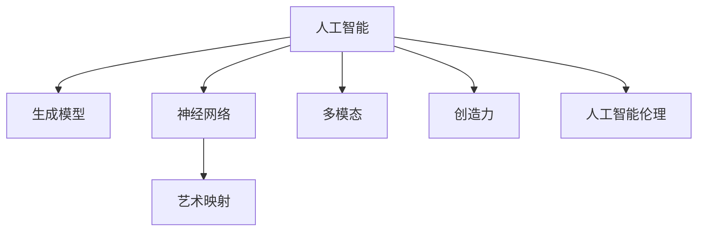

                 

# 一切皆是映射：AI在艺术创作上的新视角

> 关键词：艺术创作, AI, 神经网络, 生成模型, 艺术映射, 创造力, 多模态, 人工智能伦理

## 1. 背景介绍

### 1.1 问题由来
随着人工智能(AI)技术的快速发展，AI在各个领域的应用越来越广泛。特别是在艺术创作领域，AI开始尝试利用其强大的计算能力和学习能力，探索和实现人类艺术创作的新途径。AI在艺术创作中的应用，不仅仅是简单的自动化创作，更是在艺术表达和创意生成方面提供了新的视角和可能性。

### 1.2 问题核心关键点
AI在艺术创作中的应用主要集中在以下几个方面：

1. **艺术风格的生成与再现**：通过学习大量的艺术作品，AI能够生成具有特定风格的新艺术作品。
2. **艺术作品的创作与改编**：AI不仅能够创作新的艺术作品，还可以对现有作品进行改编，使其具有新的创意。
3. **艺术作品的个性化定制**：AI能够根据用户的偏好和需求，生成个性化的艺术作品。
4. **艺术创作工具的辅助**：AI可以作为辅助工具，帮助艺术家提高创作效率，提供新的创意灵感。

这些应用展示了AI在艺术创作中巨大的潜力和可能性，但也引发了对于AI创造力的质疑和探讨。

### 1.3 问题研究意义
研究AI在艺术创作中的应用，对于拓展AI的应用范围，提升艺术创作的效率和质量，探索人工智能伦理和创意性，具有重要意义：

1. **拓展AI应用边界**：将AI技术应用到艺术创作中，能够拓展AI的应用边界，展示其更广泛的应用可能性。
2. **提升艺术创作效率**：AI可以作为艺术创作工具，辅助艺术家完成复杂的艺术创作任务，提升创作效率。
3. **探索人工智能伦理**：艺术创作涉及大量复杂的人文和伦理问题，研究AI在艺术创作中的应用，有助于探索和制定相关伦理规范。
4. **推动艺术创新**：AI在艺术创作中的应用，为艺术创作提供了新的灵感和途径，推动了艺术的创新和变革。

## 2. 核心概念与联系

### 2.1 核心概念概述

为了更好地理解AI在艺术创作中的应用，本节将介绍几个密切相关的核心概念：

- **人工智能(AI)**：使用计算机模拟人脑智能行为的技术。
- **生成模型(Generative Models)**：能够生成新数据或模拟现有数据的AI模型，如GANs、VAEs等。
- **神经网络(Neural Networks)**：模拟人脑神经元网络结构和功能的技术，是深度学习的基础。
- **艺术映射(Artistic Mapping)**：将AI模型的输出映射到艺术创作中的各种元素，如颜色、形状、纹理等，以生成具有艺术感的作品。
- **多模态(Multimodal)**：结合多种信息源（如视觉、听觉、文本等）的技术，以提供更丰富和准确的创作环境。
- **创造力(Creativity)**：人类基于已有知识和经验，创造新事物的智力活动。
- **人工智能伦理(Ethics in AI)**：在AI应用中考虑和解决伦理问题，如隐私、偏见、责任等。

这些核心概念之间的逻辑关系可以通过以下Mermaid流程图来展示：



这个流程图展示了这个核心概念之间的逻辑关系：

1. 人工智能是生成模型、神经网络等技术的基础。
2. 神经网络是生成模型中常用的一种结构。
3. 艺术映射通过神经网络或生成模型将AI的输出映射到艺术创作中。
4. 多模态为艺术创作提供了更加丰富和全面的信息源。
5. 创造力是AI在艺术创作中追求的最终目标。
6. 人工智能伦理是AI应用中不可忽视的重要考虑因素。

## 3. 核心算法原理 & 具体操作步骤
### 3.1 算法原理概述

AI在艺术创作中的应用主要基于生成模型和神经网络技术。其核心思想是通过学习大量的艺术作品，构建模型来生成新的艺术作品。

假设有一组艺术作品 $\{(\mathbf{x}_i, \mathbf{y}_i)\}_{i=1}^N$，其中 $\mathbf{x}_i$ 为艺术作品，$\mathbf{y}_i$ 为作品的风格或主题标签。目标是构建一个生成模型 $G$，使其能够生成具有任意风格或主题的新艺术作品 $\mathbf{z}$，即：

$$
\mathbf{z} = G(\mathbf{u})
$$

其中 $\mathbf{u}$ 为输入的随机噪声向量。

生成模型的训练过程可以分为两个步骤：

1. **无监督学习**：在大量未标注的艺术作品上训练生成模型，使其能够捕获艺术作品的基本特征。
2. **监督学习**：在有标注的艺术作品上微调生成模型，使其能够生成特定风格或主题的作品。

### 3.2 算法步骤详解

以下是具体的生成模型训练和艺术创作步骤：

**Step 1: 数据准备**
- 收集大量的艺术作品，包括绘画、雕塑、音乐等。
- 对每件作品进行风格或主题的标注，形成训练集 $\{(\mathbf{x}_i, \mathbf{y}_i)\}_{i=1}^N$。

**Step 2: 构建生成模型**
- 选择适合的生成模型，如GANs、VAEs等。
- 定义生成模型的架构和损失函数。

**Step 3: 无监督学习**
- 在未标注的艺术作品上训练生成模型，使其能够学习到艺术作品的通用特征。
- 使用对抗训练、自编码等技术提高生成模型的质量。

**Step 4: 监督学习**
- 在有标注的艺术作品上微调生成模型，使其能够生成特定风格或主题的作品。
- 使用交叉熵等损失函数优化模型的输出。

**Step 5: 艺术创作**
- 根据用户需求，选择生成模型的特定输出层和风格/主题标签。
- 将用户输入的随机噪声向量 $\mathbf{u}$ 输入到生成模型中，生成新艺术作品 $\mathbf{z}$。

### 3.3 算法优缺点

AI在艺术创作中的应用有以下优点：

1. **高效性**：相比于人类艺术家，AI可以在短时间内生成大量的艺术作品。
2. **创新性**：AI能够通过学习大量的艺术作品，发现新的风格和主题，生成创新的艺术作品。
3. **多样性**：AI生成的艺术作品可以在风格、主题等方面具有多样性，满足不同用户的需求。

同时，也存在以下缺点：

1. **缺乏情感**：AI生成的艺术作品可能缺乏人类艺术家特有的情感和灵魂。
2. **依赖于数据**：AI生成艺术作品的质量依赖于训练数据的丰富性和多样性。
3. **伦理问题**：AI在艺术创作中的应用可能引发伦理问题，如版权、隐私等。

### 3.4 算法应用领域

AI在艺术创作中的应用已经覆盖了多个领域，包括：

- **绘画创作**：使用GANs等生成模型，生成新的绘画作品。
- **音乐创作**：使用VAEs等生成模型，生成新的音乐作品。
- **雕塑创作**：使用生成模型和3D打印技术，生成新的雕塑作品。
- **交互艺术**：结合VR、AR等技术，生成互动式的艺术作品。
- **艺术教育**：使用AI辅助艺术创作和教育，提升艺术创作水平。

## 4. 数学模型和公式 & 详细讲解 & 举例说明

### 4.1 数学模型构建

假设生成模型为GANs，由生成器 $G$ 和判别器 $D$ 组成。目标是最小化生成器的损失函数 $J_G$ 和判别器的损失函数 $J_D$。

**生成器**：
$$
J_G = -\mathbb{E}_{\mathbf{z}\sim p_z}[\log D(G(\mathbf{z}))]
$$

**判别器**：
$$
J_D = -\mathbb{E}_{\mathbf{x}\sim p_x}[\log D(\mathbf{x})] - \mathbb{E}_{\mathbf{z}\sim p_z}[\log (1-D(G(\mathbf{z}))]
$$

其中 $p_x$ 和 $p_z$ 分别为真实样本和噪声样本的分布。

### 4.2 公式推导过程

将上述目标函数代入优化算法（如Adam）进行求解，即可得到生成器和判别器的更新公式。以下是一个简化的推导过程：

**生成器更新**：
$$
\mathbf{z} \sim p_z
$$
$$
\mathbf{x} = G(\mathbf{z})
$$
$$
D(\mathbf{x}) = \sigma(W_2(D(\mathbf{x})))
$$
$$
J_G = -\mathbb{E}_{\mathbf{z}\sim p_z}[\log D(G(\mathbf{z}))]
$$
$$
\frac{\partial J_G}{\partial \theta_G} = -\mathbb{E}_{\mathbf{z}\sim p_z}[\frac{\partial D(\mathbf{x})}{\partial \theta_G} \cdot \frac{\partial \mathbf{x}}{\partial \theta_G}]
$$

**判别器更新**：
$$
\mathbf{x} \sim p_x
$$
$$
\mathbf{z} \sim p_z
$$
$$
D(\mathbf{x}) = \sigma(W_2(D(\mathbf{x})))
$$
$$
J_D = -\mathbb{E}_{\mathbf{x}\sim p_x}[\log D(\mathbf{x})] - \mathbb{E}_{\mathbf{z}\sim p_z}[\log (1-D(G(\mathbf{z}))]
$$
$$
\frac{\partial J_D}{\partial \theta_D} = -\mathbb{E}_{\mathbf{x}\sim p_x}[\frac{\partial D(\mathbf{x})}{\partial \theta_D} \cdot \frac{\partial \mathbf{x}}{\partial \theta_D}] - \mathbb{E}_{\mathbf{z}\sim p_z}[\frac{\partial D(G(\mathbf{z}))}{\partial \theta_D} \cdot \frac{\partial G(\mathbf{z})}{\partial \theta_D}]
$$

其中 $\theta_G$ 和 $\theta_D$ 分别为生成器和判别器的参数。

### 4.3 案例分析与讲解

以绘画创作为例，分析如何使用GANs生成新绘画作品：

1. **数据准备**：收集大量的绘画作品，将其分为真实绘画作品集 $\mathcal{X}$ 和噪声集 $\mathcal{Z}$。
2. **模型构建**：选择GANs作为生成模型，定义生成器 $G$ 和判别器 $D$ 的架构。
3. **无监督学习**：在噪声集 $\mathcal{Z}$ 上训练生成器 $G$，使其能够生成逼真的绘画作品。
4. **监督学习**：在有标注的绘画作品集 $\mathcal{X}$ 上微调生成器 $G$，使其能够生成特定风格的绘画作品。
5. **艺术创作**：根据用户需求，输入噪声向量 $\mathbf{z}$，生成新的绘画作品 $\mathbf{x} = G(\mathbf{z})$。

## 5. 项目实践：代码实例和详细解释说明
### 5.1 开发环境搭建

在进行艺术创作项目实践前，我们需要准备好开发环境。以下是使用Python进行PyTorch开发的环境配置流程：

1. 安装Anaconda：从官网下载并安装Anaconda，用于创建独立的Python环境。

2. 创建并激活虚拟环境：
```bash
conda create -n pytorch-env python=3.8 
conda activate pytorch-env
```

3. 安装PyTorch：根据CUDA版本，从官网获取对应的安装命令。例如：
```bash
conda install pytorch torchvision torchaudio cudatoolkit=11.1 -c pytorch -c conda-forge
```

4. 安装Transformers库：
```bash
pip install transformers
```

5. 安装各类工具包：
```bash
pip install numpy pandas scikit-learn matplotlib tqdm jupyter notebook ipython
```

完成上述步骤后，即可在`pytorch-env`环境中开始艺术创作项目实践。

### 5.2 源代码详细实现

这里我们以GANs在绘画创作中的应用为例，给出使用PyTorch实现绘画生成器的代码实现。

首先，定义GANs的生成器和判别器：

```python
import torch.nn as nn
import torch.nn.functional as F

class Generator(nn.Module):
    def __init__(self):
        super(Generator, self).__init__()
        self.main = nn.Sequential(
            nn.Linear(100, 256),
            nn.LeakyReLU(0.2),
            nn.Linear(256, 512),
            nn.LeakyReLU(0.2),
            nn.Linear(512, 1024),
            nn.LeakyReLU(0.2),
            nn.Linear(1024, 3*3*256),
            nn.Tanh()
        )

    def forward(self, x):
        img = self.main(x)
        img = img.view(img.size(0), 3, 3, 3)
        return img

class Discriminator(nn.Module):
    def __init__(self):
        super(Discriminator, self).__init__()
        self.main = nn.Sequential(
            nn.Linear(3*3*256, 1024),
            nn.LeakyReLU(0.2),
            nn.Linear(1024, 512),
            nn.LeakyReLU(0.2),
            nn.Linear(512, 256),
            nn.LeakyReLU(0.2),
            nn.Linear(256, 1),
            nn.Sigmoid()
        )

    def forward(self, x):
        img = x.view(img.size(0), -1)
        img = self.main(img)
        return img
```

然后，定义GANs的训练函数：

```python
import torch.optim as optim

def train_GAN(iter=20000, batch_size=64, lr=0.0002):
    device = torch.device("cuda" if torch.cuda.is_available() else "cpu")
    G.to(device)
    D.to(device)
    
    for epoch in range(iter):
        for i, (real_images, _) in enumerate(train_loader):
            real_images = real_images.to(device)

            # Adversarial ground truths
            real_labels = torch.ones(batch_size, 1).to(device)
            fake_labels = torch.zeros(batch_size, 1).to(device)

            # -----------------
            #  Train Generator
            # -----------------
            G.zero_grad()

            # Sample noise and generate a batch of new images
            z = torch.randn(batch_size, z_dim).to(device)
            fake_images = G(z)

            # Adversarial loss
            g_loss = G_loss(G(z), real_labels)

            # Backprop through the generator
            g_loss.backward()
            G_optimizer.step()

            # ---------------------
            #  Train Discriminator
            # ---------------------
            D.zero_grad()

            # Measure the accuracy of the discriminator
            real_pred = D(real_images)
            fake_pred = D(fake_images)

            d_loss_real = D_loss(real_pred, real_labels)
            d_loss_fake = D_loss(fake_pred, fake_labels)
            d_loss = d_loss_real + d_loss_fake

            # Backprop through the discriminator
            d_loss.backward()
            D_optimizer.step()

            # Reporting loss every 100 steps
            if (i + 1) % 100 == 0:
                print(f'Epoch [{epoch+1}/{iter}], Step [{i+1}/{len(train_loader)}], Loss_G: {g_loss.item()}, Loss_D: {d_loss.item()}')
```

最后，启动训练流程并输出生成的绘画作品：

```python
# 设置训练参数
iter = 20000
batch_size = 64
lr = 0.0002

# 训练GAN
train_GAN(iter=iter, batch_size=batch_size, lr=lr)

# 生成新绘画作品
new_image = G(torch.randn(1, z_dim)).detach().cpu().numpy()
plt.imshow(new_image[0,...,0], cmap='gray')
plt.show()
```

以上就是使用PyTorch实现GANs在绘画创作中的应用实例。可以看到，通过简单的代码，我们就可以构建并训练GANs，生成具有艺术感的绘画作品。

### 5.3 代码解读与分析

让我们再详细解读一下关键代码的实现细节：

**Generator类和Discriminator类**：
- `__init__`方法：定义生成器和判别器的架构。
- `forward`方法：实现前向传播，生成新的艺术作品或计算判别器的输出。

**train_GAN函数**：
- 定义生成器和判别器的参数更新过程。
- 通过循环迭代，训练生成器和判别器，直到满足预设的迭代次数。
- 每100步输出一次训练过程中的损失函数值。

**启动训练流程**：
- 设置训练参数，如迭代次数、批次大小、学习率等。
- 调用`train_GAN`函数开始训练。
- 生成新的绘画作品并展示。

通过上述代码，我们可以看到，PyTorch提供了丰富的工具和API，使得GANs在绘画创作中的实现变得简单易懂。开发者只需关注关键算法的实现，而不需要过多关注底层细节。

当然，工业级的系统实现还需考虑更多因素，如模型的保存和部署、超参数的自动搜索、更灵活的输入输出格式等。但核心的训练过程基本与此类似。

## 6. 实际应用场景
### 6.1 艺术创作
AI在艺术创作中的应用已经覆盖了绘画、音乐、雕塑等多个领域。艺术家可以使用AI工具辅助创作，生成新的艺术作品。例如，通过GANs生成新的绘画作品，或使用VAEs生成新的音乐作品。

### 6.2 艺术教育
AI在艺术教育中的应用也越来越广泛。学校和培训机构可以使用AI工具辅助艺术创作教学，提供个性化的教学方案。例如，通过GANs生成新作品，让学生练习绘画技能，或者通过VAEs生成新音乐，培养学生的音乐素养。

### 6.3 艺术辅助设计
AI在艺术辅助设计中的应用也非常广泛。设计师可以使用AI工具辅助完成复杂的设计任务，提高设计效率。例如，通过GANs生成新的设计方案，或者使用VAEs生成新的设计元素，提供灵感和参考。

### 6.4 未来应用展望
随着AI技术的不断进步，AI在艺术创作中的应用将更加广泛和深入。未来，AI不仅能够生成艺术作品，还能够进行艺术风格迁移、艺术作品优化等复杂任务。同时，AI在艺术创作中的应用也将推动相关领域的研究和创新，推动艺术的变革和进步。

## 7. 工具和资源推荐
### 7.1 学习资源推荐

为了帮助开发者系统掌握AI在艺术创作中的应用，这里推荐一些优质的学习资源：

1. 《深度学习》课程：斯坦福大学开设的深度学习课程，由吴恩达教授主讲，涵盖了深度学习的基本概念和应用。
2. 《生成对抗网络(GANs)》课程：由Ian Goodfellow等专家主讲，详细介绍了GANs的基本原理和应用。
3. 《Neural Style Transfer》论文：由Google DeepMind团队发表，介绍了如何使用GANs进行艺术风格迁移。
4. 《AI in Art》书籍：由Mozilla开发者社区出版，详细介绍了AI在艺术创作中的应用和未来发展方向。
5. 《Artificial Intelligence: A Modern Approach》书籍：由AI领域的权威人士 Stuart Russell 和 Peter Norvig 共同编写，全面介绍了AI技术的基本概念和应用。

通过对这些资源的学习实践，相信你一定能够快速掌握AI在艺术创作中的应用，并用于解决实际的创作问题。

### 7.2 开发工具推荐

高效的开发离不开优秀的工具支持。以下是几款用于AI在艺术创作中开发的常用工具：

1. PyTorch：基于Python的开源深度学习框架，灵活动态的计算图，适合快速迭代研究。
2. TensorFlow：由Google主导开发的开源深度学习框架，生产部署方便，适合大规模工程应用。
3. TensorBoard：TensorFlow配套的可视化工具，可实时监测模型训练状态，并提供丰富的图表呈现方式。
4. Weights & Biases：模型训练的实验跟踪工具，可以记录和可视化模型训练过程中的各项指标。
5. Jupyter Notebook：交互式的编程环境，支持代码编写、数据可视化、代码运行等。

合理利用这些工具，可以显著提升AI在艺术创作中的应用效率，加快创新迭代的步伐。

### 7.3 相关论文推荐

AI在艺术创作中的应用领域涉及广泛，以下几篇奠基性的相关论文，推荐阅读：

1. Image-to-Image Translation with Conditional Adversarial Networks（式迁移）：介绍如何使用GANs进行图像风格迁移，推动了艺术创作风格迁移技术的发展。
2. Conditional Image Synthesis with Auxiliary Classifier GANs：介绍如何使用条件GANs生成具有特定标签的艺术作品，提升艺术创作的多样性。
3. Learning Adversarial Generative Adversarial Networks for Artistic Style Transfer：介绍如何使用GANs进行艺术风格迁移，推动了艺术创作风格迁移技术的发展。
4. DCGAN - A New Approach from Scratch：介绍如何使用GANs进行艺术作品生成，推动了艺术创作自动化技术的发展。
5. DeepLearning for AI: A Simplified Approach to the World's Most Challenging Problems：介绍如何使用深度学习技术解决各种复杂问题，包括艺术创作。

这些论文代表了大语言模型微调技术的发展脉络。通过学习这些前沿成果，可以帮助研究者把握学科前进方向，激发更多的创新灵感。

## 8. 总结：未来发展趋势与挑战
### 8.1 研究成果总结

本文对AI在艺术创作中的应用进行了全面系统的介绍。首先阐述了AI在艺术创作中的背景和意义，明确了AI在艺术创作中的独特价值。其次，从原理到实践，详细讲解了生成模型和神经网络的算法原理和关键步骤，给出了AI在艺术创作中的代码实例。同时，本文还广泛探讨了AI在艺术创作中的实际应用场景，展示了AI在艺术创作中的巨大潜力。此外，本文精选了AI在艺术创作中的学习资源，力求为读者提供全方位的技术指引。

通过本文的系统梳理，可以看到，AI在艺术创作中已经成为一种重要的创作工具，正在不断推动艺术创作的发展和变革。

### 8.2 未来发展趋势

展望未来，AI在艺术创作中的应用将呈现以下几个发展趋势：

1. **多样性增强**：AI生成的艺术作品将更加多样化，满足不同用户的需求。
2. **质量提升**：AI生成的艺术作品将更加高质量，与人类艺术家创作的作品相差无几。
3. **技术融合**：AI将与更多技术（如VR、AR等）融合，提供更加丰富和沉浸式的创作体验。
4. **创新驱动**：AI将推动艺术创作领域的创新和变革，带来更多的新兴艺术形式。

这些趋势凸显了AI在艺术创作中的广阔前景。随着AI技术的不断进步，AI在艺术创作中的应用将更加广泛和深入，为艺术创作带来新的革命性变化。

### 8.3 面临的挑战

尽管AI在艺术创作中取得了显著成就，但在迈向更加智能化、普适化应用的过程中，仍然面临诸多挑战：

1. **数据稀缺**：高质量的艺术数据获取难度大，限制了AI在艺术创作中的应用。
2. **伦理问题**：AI在艺术创作中的应用可能引发伦理问题，如版权、隐私等。
3. **创造力局限**：AI生成的艺术作品可能缺乏人类艺术家特有的创造力和情感。
4. **技术门槛**：AI在艺术创作中的应用需要较高的技术门槛，普通用户难以使用。

这些挑战需要相关领域的研究人员和开发者共同努力，积极应对并寻求突破，才能真正实现AI在艺术创作中的大规模应用。

### 8.4 研究展望

面对AI在艺术创作中面临的挑战，未来的研究需要在以下几个方面寻求新的突破：

1. **数据增强**：探索更多的数据增强方法，如数据合成、数据扩充等，提升AI在艺术创作中的应用能力。
2. **伦理规范**：制定AI在艺术创作中的伦理规范，确保应用过程中尊重版权、保护隐私。
3. **创造力提升**：研究如何提升AI的创造力和情感表达能力，使AI生成的艺术作品更具表现力。
4. **技术普及**：降低AI在艺术创作中的应用门槛，使更多普通用户能够使用AI进行艺术创作。

这些研究方向的探索，必将引领AI在艺术创作中的技术进步，为艺术创作带来新的革命性变化。面向未来，AI在艺术创作中需要与其他技术（如VR、AR等）进行更深入的融合，共同推动艺术创作领域的创新和变革。只有勇于创新、敢于突破，才能不断拓展AI在艺术创作中的边界，让智能技术更好地造福人类社会。

## 9. 附录：常见问题与解答

**Q1：AI生成的艺术作品能否取代人类艺术家？**

A: AI生成的艺术作品虽然具有很高的质量和多样性，但仍然无法取代人类艺术家的创造力和情感表达能力。艺术创作不仅仅是技术和工具的运用，更是一种文化和情感的表达。人类艺术家能够通过自身独特的视角和体验，创造出具有深度和内涵的艺术作品，这是目前AI所无法替代的。

**Q2：AI在艺术创作中如何避免版权问题？**

A: AI在艺术创作中避免版权问题的方法包括：
1. 使用公开的艺术数据集，如Kaggle等。
2. 对已有的艺术作品进行迁移学习，减少对原作品的依赖。
3. 在生成新的艺术作品时，尽量不使用现有的作品，或使用公共领域的作品。

**Q3：AI在艺术创作中的伦理问题有哪些？**

A: AI在艺术创作中的伦理问题包括：
1. 版权问题：AI生成的艺术作品是否侵犯了原作者的权利。
2. 隐私问题：AI在创作过程中是否侵犯了用户的隐私。
3. 偏见问题：AI生成的艺术作品是否存在偏见和歧视。
4. 责任问题：AI生成的艺术作品出现问题时，谁来承担责任。

这些问题需要相关领域的研究人员和开发者共同关注和解决，确保AI在艺术创作中的应用具有伦理性和可控性。

通过以上回答，相信读者对于AI在艺术创作中的应用有了更全面的了解。AI在艺术创作中的发展前景广阔，但也面临诸多挑战和伦理问题。只有不断创新、积极应对，才能将AI技术更好地应用于艺术创作中，推动艺术创作领域的进步和发展。

---

作者：禅与计算机程序设计艺术 / Zen and the Art of Computer Programming

