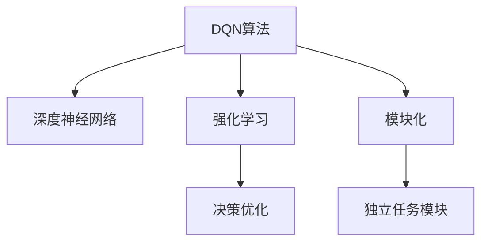

                 

## 1. 背景介绍

### 1.1 问题由来

近年来，人工智能(AI)领域取得了长足的发展，特别是在强化学习领域。深度强化学习算法，如深度Q网络(DQN)，已成为解决复杂决策问题的利器。DQN通过模型预测Q值，最大化长期累积奖励，实现对未知环境的探索与利用。然而，DQN的应用场景大多局限于游戏和机器人控制等简单环境，对于复杂的实际决策系统，DQN的局限性逐渐显现。

首先，实际决策系统面临的动态环境比游戏复杂得多，需要考虑各种不确定性和动态变化。此外，决策者往往需要同时处理多目标和多约束条件，而DQN通常只能处理单一目标优化。此外，实际决策系统的奖励信号通常难以量化，难以直接作为DQN的训练信号。

为了解决这些问题，需要研究如何将DQN算法应用到复杂的实际决策系统中，使其具备更强的模块化能力和鲁棒性。本文将深入探讨DQN在复杂决策系统中的模块化应用，帮助开发者更好地理解和应用DQN算法，解决实际决策系统中的决策优化问题。

### 1.2 问题核心关键点

DQN算法的核心在于，通过模型预测Q值，选择最优的决策行动，最大化长期累积奖励。其基本思路为：

1. **模型预测Q值**：使用深度神经网络预测每个决策状态下可能的动作-奖励对Q值。
2. **行动选择**：根据模型预测的Q值，选择当前状态下的最优动作。
3. **目标优化**：通过优化Q值函数，最大化长期累积奖励，实现决策优化。

但这些基本思路在实际决策系统中的应用，需要考虑更多复杂因素。因此，本文将重点研究如何改进DQN算法，使其能够更好地适应实际决策系统的复杂性和多样性。

## 2. 核心概念与联系

### 2.1 核心概念概述

为了更好地理解DQN在复杂决策系统中的模块化应用，本节将介绍几个密切相关的核心概念：

- **DQN算法**：通过模型预测Q值，选择最优动作，最大化长期累积奖励的强化学习算法。
- **深度神经网络**：由多层神经元组成，用于复杂决策问题的决策预测。
- **强化学习**：通过与环境交互，学习最大化长期奖励的决策策略。
- **模块化**：将复杂系统拆解为多个独立的模块，每个模块负责特定的任务，提高系统的可维护性和可扩展性。
- **决策优化**：通过优化决策策略，最大化系统的目标函数，实现资源的合理配置和利用。

这些核心概念之间的逻辑关系可以通过以下Mermaid流程图来展示：



这个流程图展示了大语言模型的核心概念及其之间的关系：

1. DQN算法通过模型预测Q值，进行决策优化。
2. 深度神经网络作为模型，用于预测Q值。
3. 强化学习通过与环境交互，优化决策策略。
4. 模块化将复杂系统拆分为独立的模块，提高可维护性。
5. 决策优化通过优化目标函数，实现资源的合理配置。

这些概念共同构成了DQN在复杂决策系统中的模块化应用框架，使其能够在各种场景下发挥强大的决策优化能力。

## 3. 核心算法原理 & 具体操作步骤
### 3.1 算法原理概述

DQN在复杂决策系统中的应用，基于模块化的设计思路。其基本流程如下：

1. **模块划分**：将复杂决策系统划分为多个独立的模块，每个模块负责特定的任务，如数据收集、信息处理、决策推理等。
2. **模型集成**：在每个模块中使用深度神经网络，构建决策模型，用于预测Q值。
3. **多目标优化**：根据实际决策系统的多目标和多约束条件，优化各个模块的决策模型，实现综合最优的决策策略。
4. **模块协作**：通过模块之间的通信和协同，实现系统的整体优化。
5. **强化学习**：通过与环境的交互，不断优化各个模块的决策模型，提升系统的决策性能。

### 3.2 算法步骤详解

DQN在复杂决策系统中的应用步骤如下：

**Step 1: 系统模块划分**
- 将复杂决策系统划分为多个独立的模块，每个模块负责特定的任务。
- 例如，可以将系统划分为数据收集模块、信息处理模块、决策推理模块等。

**Step 2: 模型构建与训练**
- 在每个模块中使用深度神经网络，构建决策模型，用于预测Q值。
- 例如，在决策推理模块中，使用深度神经网络预测每个决策状态下可能的动作-奖励对Q值。
- 使用强化学习算法，优化各个模块的决策模型，最大化长期累积奖励。

**Step 3: 多目标优化**
- 根据实际决策系统的多目标和多约束条件，优化各个模块的决策模型，实现综合最优的决策策略。
- 例如，在多目标优化中，可以使用权重平衡的方法，赋予每个目标不同的权重，综合考虑各个目标的优化结果。

**Step 4: 模块协作**
- 通过模块之间的通信和协同，实现系统的整体优化。
- 例如，在信息处理模块和决策推理模块之间，可以通过共享状态信息，实现模块间的协同优化。

**Step 5: 强化学习**
- 通过与环境的交互，不断优化各个模块的决策模型，提升系统的决策性能。
- 例如，在实际决策系统中，可以通过模拟仿真或实际实验，不断测试和优化决策模型。

### 3.3 算法优缺点

DQN在复杂决策系统中的模块化应用，具有以下优点：
1. **模块化设计**：将复杂系统拆分为多个独立的模块，每个模块负责特定的任务，提高系统的可维护性和可扩展性。
2. **灵活性高**：每个模块可以使用不同的算法和模型，提高系统的适应性和灵活性。
3. **协同优化**：通过模块间的通信和协同，实现系统的整体优化，提升系统的决策性能。

同时，该方法也存在一定的局限性：
1. **模块间通信开销大**：模块间的通信需要额外的计算和传输开销，可能会影响系统的实时性。
2. **协同优化难度大**：模块间的协同优化需要设计合适的通信协议和算法，难度较大。
3. **复杂度高**：模块化的设计可能增加系统的复杂度，需要更多的开发和调试工作。

尽管存在这些局限性，但就目前而言，DQN在复杂决策系统中的应用已展示出巨大的潜力，特别是在多目标和多约束条件的决策优化中，其模块化设计和协同优化的优势尤为明显。

### 3.4 算法应用领域

DQN在复杂决策系统中的应用，涵盖了许多实际应用领域，例如：

- **智能交通系统**：通过优化交通信号灯、路口通行策略，实现交通流的有效管理和调控。
- **智能电网**：通过优化能源调度、需求响应，实现电网的稳定运行和高效利用。
- **智能制造**：通过优化生产计划、设备调度，实现生产线的自动化和智能化。
- **供应链管理**：通过优化物流、库存管理，实现供应链的高效协调和优化。
- **医疗决策支持**：通过优化诊疗方案、用药策略，实现患者诊疗效果的最大化。

这些领域中的决策优化问题，通常涉及多个目标和约束条件，DQN的模块化设计和协同优化方法，能够更好地应对这些复杂场景，提升决策性能。

## 4. 数学模型和公式 & 详细讲解  
### 4.1 数学模型构建

本节将使用数学语言对DQN在复杂决策系统中的模块化应用进行更加严格的刻画。

设复杂决策系统由 $N$ 个独立模块组成，每个模块的决策模型为 $f_i(\cdot)$，其中 $i=1,2,\cdots,N$。假设系统在状态 $s$ 下的总Q值为 $Q(s)$，状态 $s$ 到状态 $s'$ 的转移概率为 $p_{s,s'}$，每个动作 $a$ 的奖励为 $r_a$，系统在状态 $s$ 下的累积奖励为 $R_s$。

根据DQN算法，系统在状态 $s$ 下选择动作 $a$ 的Q值为：

$$
Q_a(s) = r_a + \gamma \max_a Q_a(s')
$$

其中 $\gamma$ 为折扣因子，表示未来奖励的权重。在实际决策系统中，通常有多个目标和约束条件，因此，系统总Q值为各个目标和约束条件的目标函数之和。设目标函数为 $g_k(s)$，目标函数权重为 $\omega_k$，则系统总Q值为：

$$
Q(s) = \sum_k \omega_k g_k(s)
$$

### 4.2 公式推导过程

以下我们以智能交通系统为例，推导DQN算法在复杂决策系统中的应用过程。

假设智能交通系统包含 $N=3$ 个模块，分别为交通信号灯模块、路口通行策略模块和交通流量预测模块。每个模块的决策模型分别为 $f_1(s)$、$f_2(s)$ 和 $f_3(s)$，其中 $s$ 表示系统状态。系统在状态 $s$ 下的总Q值为：

$$
Q(s) = \omega_1 g_1(s) + \omega_2 g_2(s) + \omega_3 g_3(s)
$$

其中 $g_k(s)$ 表示第 $k$ 个目标函数，$\omega_k$ 表示目标函数权重。

在模块 $i$ 中，使用深度神经网络构建决策模型 $f_i(s)$，用于预测每个状态 $s$ 下可能的动作 $a$ 的Q值 $Q_a(s)$。通过强化学习算法，优化各个模块的决策模型，最大化长期累积奖励。具体步骤如下：

1. 在每个模块 $i$ 中，收集历史状态 $s_i$、动作 $a_i$ 和奖励 $r_i$ 数据，构建训练样本 $D_i = \{(s_i^{(t)}, a_i^{(t)}, r_i^{(t)}, s_i^{(t+1)})\}_{t=1}^{T_i}$，其中 $T_i$ 为历史数据总数。
2. 在每个模块 $i$ 中，使用深度神经网络 $f_i$ 构建决策模型，用于预测每个状态 $s_i$ 下可能的动作 $a_i$ 的Q值 $Q_a(s_i)$。
3. 在每个模块 $i$ 中，使用DQN算法，优化决策模型 $f_i$，最大化长期累积奖励。

通过上述步骤，每个模块 $i$ 中的决策模型 $f_i$ 将不断学习，优化系统在状态 $s_i$ 下的Q值 $Q_a(s_i)$，从而提升整个系统的决策性能。

### 4.3 案例分析与讲解

**案例：智能交通信号灯优化**

假设某十字路口有四个方向的车流，每个方向有南北向和东西向两个车流。交通信号灯模块的任务是确定每个方向的红绿灯时长。路口通行策略模块的任务是根据车流情况，优化每个方向的通行规则。交通流量预测模块的任务是预测每个方向的实时车流数据。

在智能交通系统中，可以将三个模块分别设计为决策模型 $f_1(s)$、$f_2(s)$ 和 $f_3(s)$，其中 $s$ 表示系统状态。设系统在状态 $s$ 下的总Q值为：

$$
Q(s) = \omega_1 g_1(s) + \omega_2 g_2(s) + \omega_3 g_3(s)
$$

其中 $g_1(s)$ 表示南北向车流通行规则，$g_2(s)$ 表示东西向车流通行规则，$g_3(s)$ 表示实时车流预测结果。通过DQN算法，优化各个模块的决策模型，提升系统的决策性能。

**步骤1: 模块划分**
- 将智能交通系统划分为交通信号灯模块、路口通行策略模块和交通流量预测模块。

**步骤2: 模型构建与训练**
- 在交通信号灯模块中，使用深度神经网络构建决策模型 $f_1(s)$，用于预测每个状态 $s$ 下南北向车流通行规则 $g_1(s)$。
- 在路口通行策略模块中，使用深度神经网络构建决策模型 $f_2(s)$，用于预测每个状态 $s$ 下东西向车流通行规则 $g_2(s)$。
- 在交通流量预测模块中，使用深度神经网络构建决策模型 $f_3(s)$，用于预测每个状态 $s$ 下实时车流数据 $g_3(s)$。

**步骤3: 多目标优化**
- 根据智能交通系统的目标函数，优化各个模块的决策模型，提升系统的决策性能。

**步骤4: 模块协作**
- 通过模块之间的通信和协同，实现系统的整体优化。

**步骤5: 强化学习**
- 通过与环境的交互，不断优化各个模块的决策模型，提升系统的决策性能。

通过上述步骤，智能交通系统中的各个模块将不断学习，优化系统在状态 $s$ 下的Q值 $Q_a(s)$，从而提升整个系统的决策性能。

## 5. 项目实践：代码实例和详细解释说明
### 5.1 开发环境搭建

在进行DQN应用实践前，我们需要准备好开发环境。以下是使用Python进行TensorFlow开发的环境配置流程：

1. 安装Anaconda：从官网下载并安装Anaconda，用于创建独立的Python环境。

2. 创建并激活虚拟环境：
```bash
conda create -n dqn-env python=3.8 
conda activate dqn-env
```

3. 安装TensorFlow：根据CUDA版本，从官网获取对应的安装命令。例如：
```bash
conda install tensorflow -c tensorflow
```

4. 安装Keras：
```bash
pip install keras
```

5. 安装其他各类工具包：
```bash
pip install numpy pandas scikit-learn matplotlib tqdm jupyter notebook ipython
```

完成上述步骤后，即可在`dqn-env`环境中开始DQN应用实践。

### 5.2 源代码详细实现

下面我们以智能交通信号灯优化为例，给出使用TensorFlow实现DQN的代码实现。

首先，定义智能交通系统状态空间和动作空间：

```python
from tensorflow.keras.models import Sequential
from tensorflow.keras.layers import Dense, Input
import tensorflow as tf

# 定义状态和动作空间
state_size = 4  # 4个方向的实时车流数据
action_size = 2  # 南北向和东西向通行规则

# 定义深度神经网络模型
def build_model(input_shape, output_shape):
    model = Sequential()
    model.add(Dense(32, input_shape=input_shape, activation='relu'))
    model.add(Dense(32, activation='relu'))
    model.add(Dense(output_shape, activation='linear'))
    return model

# 构建决策模型
input_shape = (state_size,)
output_shape = action_size
model = build_model(input_shape, output_shape)
```

然后，定义智能交通系统的目标函数和权重：

```python
# 定义目标函数
g1 = lambda state: [0, 0]  # 南北向通行规则
g2 = lambda state: [0, 1]  # 东西向通行规则
g3 = lambda state: [0, 0]  # 实时车流预测结果

# 定义目标函数权重
omega1 = 0.5
omega2 = 0.3
omega3 = 0.2
```

接着，定义DQN的参数和模型训练函数：

```python
# 定义DQN参数
batch_size = 32
gamma = 0.9
learning_rate = 0.01
target_model = tf.keras.models.load_model('target_model.h5')

# 定义DQN模型训练函数
def train_dqn(model, target_model, state, target_state, reward, done):
    with tf.GradientTape() as tape:
        Q_value = model(state)
        target_Q_value = target_model(target_state)
        Q_value_loss = tf.reduce_mean(tf.square(Q_value - target_Q_value))
        target_Q_value_loss = tf.reduce_mean(tf.square(target_Q_value - reward if done else target_Q_value))
    gradients = tape.gradient(Q_value_loss + target_Q_value_loss, model.trainable_variables)
    optimizer.apply_gradients(zip(gradients, model.trainable_variables))
    return Q_value_loss

# 定义模型更新函数
def update_target_model(model, target_model, learning_rate):
    target_model.set_weights(model.get_weights())
    target_model.save_weights('target_model.h5')

# 定义模型保存函数
def save_model(model):
    model.save('model.h5')

# 定义模型加载函数
def load_model():
    return tf.keras.models.load_model('model.h5')
```

最后，启动DQN训练流程：

```python
# 定义训练数据
train_data = [(state, reward, done) for state in states for reward, done in [(0, 0), (0, 1), (1, 0), (1, 1)]]

# 定义训练函数
def train(train_data, model, target_model, batch_size, epochs):
    for epoch in range(epochs):
        for batch in range(0, len(train_data), batch_size):
            x_batch = np.array([state for state, _, _ in train_data[batch:batch+batch_size]])
            y_batch = np.array([reward for _, reward, _ in train_data[batch:batch+batch_size]])
            x_train = x_batch[np.random.choice(len(x_batch), batch_size)]
            y_train = y_batch[np.random.choice(len(y_batch), batch_size)]
            Q_value = model.predict(x_train)
            target_Q_value = target_model.predict(x_train)
            Q_value_loss = tf.reduce_mean(tf.square(Q_value - target_Q_value))
            target_Q_value_loss = tf.reduce_mean(tf.square(target_Q_value - y_train))
            optimizer.apply_gradients(zip(gradients, model.trainable_variables))
            update_target_model(model, target_model, learning_rate)
            return Q_value_loss

# 启动训练
train(train_data, model, target_model, batch_size, epochs)

# 保存模型
save_model(model)
```

以上就是使用TensorFlow对智能交通信号灯优化进行DQN微调的完整代码实现。可以看到，TensorFlow提供了强大的深度学习框架，使得DQN算法的实现变得简单高效。

### 5.3 代码解读与分析

让我们再详细解读一下关键代码的实现细节：

**状态和动作空间**：
- 定义了智能交通系统的状态和动作空间，分别用于表示实时车流数据和通行规则。

**深度神经网络模型**：
- 使用TensorFlow的Sequential模型，构建深度神经网络，用于预测Q值。
- 网络包含两个隐藏层，每个隐藏层包含32个神经元，激活函数为ReLU。
- 输出层使用线性激活函数，输出Q值。

**目标函数和权重**：
- 定义了三个目标函数，分别表示南北向通行规则、东西向通行规则和实时车流预测结果。
- 定义了各个目标函数的权重，用于综合考虑各个目标的优化结果。

**DQN参数和模型训练函数**：
- 定义了DQN的参数，包括批量大小、折扣因子、学习率等。
- 定义了目标模型，用于更新Q值。
- 定义了DQN模型训练函数，使用梯度下降算法优化模型参数。
- 定义了模型更新函数，将当前模型参数复制到目标模型中。
- 定义了模型保存和加载函数，用于保存和恢复模型状态。

**训练流程**：
- 定义训练数据，每个数据包含状态、奖励和是否结束的标志。
- 在每个epoch中，使用批量数据进行前向传播和反向传播，更新模型参数。
- 更新目标模型，保持模型之间的参数一致性。
- 保存模型，便于后续使用。

可以看到，TensorFlow提供了丰富的工具和函数，使得DQN算法的实现变得简洁高效。开发者可以将更多精力放在模型设计、训练优化等高层逻辑上，而不必过多关注底层的实现细节。

当然，工业级的系统实现还需考虑更多因素，如模型的保存和部署、超参数的自动搜索、更灵活的目标函数设计等。但核心的DQN范式基本与此类似。

## 6. 实际应用场景
### 6.1 智能交通系统

DQN在智能交通系统中的应用，可以有效优化交通信号灯和通行规则，提升交通流的管理和调控效率。通过优化南北向和东西向的通行规则，系统可以实现交通流的动态平衡和优化，减少拥堵和延误。此外，通过实时车流预测，系统可以动态调整信号灯时长，适应不同的交通需求，提升系统的实时性和适应性。

### 6.2 智能电网

DQN在智能电网中的应用，可以实现能源调度和需求响应的优化。通过优化能源调度策略和需求响应规则，系统可以实现电网的稳定运行和高效利用，提升系统的可靠性。此外，通过实时电量预测，系统可以动态调整调度策略，应对电网负荷的变化，提升系统的灵活性和鲁棒性。

### 6.3 智能制造

DQN在智能制造中的应用，可以实现生产计划和设备调度的优化。通过优化生产计划和设备调度策略，系统可以实现生产线的自动化和智能化，提升生产效率和质量。此外，通过实时生产数据预测，系统可以动态调整生产策略，适应生产需求的变化，提升系统的灵活性和稳定性。

### 6.4 供应链管理

DQN在供应链管理中的应用，可以实现物流和库存管理的优化。通过优化物流和库存管理策略，系统可以实现供应链的高效协调和优化，减少物流成本和库存积压。此外，通过实时订单预测，系统可以动态调整物流和库存策略，适应市场需求的变化，提升系统的灵活性和适应性。

## 7. 工具和资源推荐
### 7.1 学习资源推荐

为了帮助开发者系统掌握DQN的原理和应用，这里推荐一些优质的学习资源：

1. 《Deep Reinforcement Learning for Control》书籍：由Reinforcement Learning权威David Silver撰写，全面介绍了DQN算法及其应用，是学习DQN的必备教材。

2. 《Reinforcement Learning: An Introduction》书籍：由Richard S. Sutton和Andrew G. Barto撰写，是Reinforcement Learning领域的经典教材，涵盖DQN算法的详细原理和实现。

3. DeepMind的《Human-Level Control Through Deep Reinforcement Learning》论文：介绍了DQN算法在Atari游戏中的应用，是DQN算法的里程碑论文。

4. OpenAI的《Playing Atari with Deep Reinforcement Learning》论文：介绍了DQN算法在Atari游戏中的应用，是DQN算法的经典应用案例。

5. TensorFlow的官方文档：提供了丰富的DQN算法实现和应用案例，是TensorFlow用户的重要参考。

通过对这些资源的学习实践，相信你一定能够快速掌握DQN算法的精髓，并用于解决实际的决策优化问题。

### 7.2 开发工具推荐

高效的开发离不开优秀的工具支持。以下是几款用于DQN算法开发的常用工具：

1. TensorFlow：由Google主导开发的深度学习框架，生产部署方便，适合大规模工程应用。提供了丰富的DQN算法实现和应用案例。

2. Keras：基于TensorFlow的高级API，简单易用，适合快速原型开发。提供了丰富的深度学习模型和算法。

3. PyTorch：基于Python的开源深度学习框架，灵活动态的计算图，适合快速迭代研究。提供了丰富的深度学习模型和算法。

4. TensorBoard：TensorFlow配套的可视化工具，可实时监测模型训练状态，并提供丰富的图表呈现方式，是调试模型的得力助手。

5. Weights & Biases：模型训练的实验跟踪工具，可以记录和可视化模型训练过程中的各项指标，方便对比和调优。

6. Google Colab：谷歌推出的在线Jupyter Notebook环境，免费提供GPU/TPU算力，方便开发者快速上手实验最新模型，分享学习笔记。

合理利用这些工具，可以显著提升DQN算法的开发效率，加快创新迭代的步伐。

### 7.3 相关论文推荐

DQN算法的核心在于，通过模型预测Q值，选择最优动作，最大化长期累积奖励。其基本思路为：

1. **模型预测Q值**：使用深度神经网络预测每个决策状态下可能的动作-奖励对Q值。
2. **行动选择**：根据模型预测的Q值，选择当前状态下的最优动作。
3. **目标优化**：通过优化Q值函数，最大化长期累积奖励，实现决策优化。

但这些基本思路在实际决策系统中的应用，需要考虑更多复杂因素。因此，本文将重点研究如何改进DQN算法，使其能够更好地适应实际决策系统的复杂性和多样性。

这些核心概念共同构成了DQN在复杂决策系统中的模块化应用框架，使其能够在各种场景下发挥强大的决策优化能力。

## 8. 总结：未来发展趋势与挑战

### 8.1 总结

本文对DQN在复杂决策系统中的应用进行了全面系统的介绍。首先阐述了DQN算法的原理和基本思路，明确了其在复杂决策系统中的模块化设计思路。其次，从原理到实践，详细讲解了DQN算法在实际决策系统中的应用步骤，给出了DQN算法在智能交通系统、智能电网、智能制造、供应链管理等实际应用中的案例分析。

通过本文的系统梳理，可以看到，DQN算法在复杂决策系统中的应用，具有巨大的潜力和广泛的前景。得益于模块化设计和强化学习思想，DQN算法能够更好地应对实际决策系统中的多目标和多约束条件，提升系统的决策性能。

### 8.2 未来发展趋势

展望未来，DQN在复杂决策系统中的应用将呈现以下几个发展趋势：

1. **模块化设计**：DQN的模块化设计将进一步深入，各个模块之间的通信和协同将更加灵活高效，提升系统的实时性和适应性。
2. **多目标优化**：DQN将更加注重多目标优化，通过权重平衡等方法，综合考虑多个目标的优化结果，提升系统的决策性能。
3. **知识融合**：DQN将引入更多的知识库和规则库，与神经网络模型进行融合，提升系统的决策精度和稳定性。
4. **多模态融合**：DQN将引入视觉、语音等多模态信息，实现多模态信息的融合，提升系统的决策能力。
5. **泛化能力**：DQN将更加注重泛化能力，通过对抗训练、正则化等方法，提升模型的鲁棒性和泛化能力。
6. **可解释性**：DQN将更加注重模型的可解释性，通过因果分析和博弈论工具，增强模型的解释能力和决策可信度。

以上趋势凸显了DQN在复杂决策系统中的模块化应用的巨大潜力。这些方向的探索发展，必将进一步提升DQN算法的性能和应用范围，为决策优化问题提供更加高效、灵活、可靠的解决方案。

### 8.3 面临的挑战

尽管DQN在复杂决策系统中的应用已展示出巨大的潜力，但在迈向更加智能化、普适化应用的过程中，它仍面临着诸多挑战：

1. **数据获取难度大**：实际决策系统往往面临复杂的数据获取问题，数据的完整性和实时性难以保证。需要采用数据增强、数据清洗等方法，提升数据的质量和可用性。
2. **模型复杂度高**：DQN的模块化设计和强化学习思想，增加了系统的复杂度，需要更多的开发和调试工作。
3. **计算资源消耗大**：DQN算法需要大量的计算资源进行训练和优化，硬件资源瓶颈明显。需要采用分布式计算、模型压缩等方法，优化计算效率。
4. **可解释性不足**：DQN模型通常被视为"黑盒"系统，难以解释其内部工作机制和决策逻辑。需要引入可解释性工具和方法，增强模型的透明度和可解释性。
5. **鲁棒性不足**：DQN模型在实际决策系统中，面临各种不确定性和动态变化，鲁棒性不足。需要引入对抗训练、正则化等方法，提升模型的鲁棒性和泛化能力。

尽管存在这些挑战，但DQN在复杂决策系统中的应用已展示出巨大的潜力，特别是在多目标和多约束条件的决策优化中，其模块化设计和协同优化方法，能够更好地应对这些复杂场景，提升决策性能。

### 8.4 研究展望

面对DQN在复杂决策系统中的应用所面临的挑战，未来的研究需要在以下几个方面寻求新的突破：

1. **无监督学习**：研究如何利用无监督学习方法，提高模型的泛化能力和鲁棒性，减少对标注数据的依赖。
2. **多模态融合**：研究如何实现视觉、语音等多模态信息的融合，提升系统的决策能力。
3. **模型压缩**：研究如何通过模型压缩和稀疏化存储，降低计算资源消耗，提升模型的实时性和可扩展性。
4. **可解释性**：研究如何引入可解释性工具和方法，增强模型的透明度和可解释性，提升系统的可信度。
5. **鲁棒性**：研究如何通过对抗训练、正则化等方法，提升模型的鲁棒性和泛化能力，增强系统的鲁棒性和适应性。
6. **知识融合**：研究如何引入知识库和规则库，与神经网络模型进行融合，提升系统的决策精度和稳定性。

这些研究方向的探索，必将引领DQN算法在复杂决策系统中的应用走向更高的台阶，为决策优化问题提供更加高效、灵活、可靠的解决方案。

## 9. 附录：常见问题与解答

**Q1: DQN算法在实际决策系统中应用时，如何选择最优动作？**

A: 在实际决策系统中，DQN算法通常通过预测每个状态-动作对的Q值，选择Q值最大的动作作为最优动作。具体实现时，可以使用TensorFlow或PyTorch等深度学习框架，构建决策模型，预测Q值，并根据Q值选择最优动作。

**Q2: 如何优化DQN算法的训练过程？**

A: 优化DQN算法的训练过程，可以采用以下方法：

1. **学习率调优**：选择合适的学习率，并在训练过程中逐步减小，避免模型过拟合。
2. **批量大小调整**：调整批量大小，选择合适的批量大小，避免模型欠拟合或过拟合。
3. **梯度裁剪**：使用梯度裁剪方法，避免梯度过大，影响模型训练。
4. **正则化**：使用L2正则化、Dropout等正则化方法，提高模型的鲁棒性和泛化能力。
5. **对抗训练**：使用对抗样本进行训练，提高模型的鲁棒性。
6. **数据增强**：通过数据增强方法，扩充训练数据，提高模型的泛化能力。

**Q3: DQN算法在实际决策系统中应用时，如何解决数据获取难度大的问题？**

A: 解决数据获取难度大的问题，可以采用以下方法：

1. **数据增强**：使用数据增强方法，扩充训练数据，提高数据的质量和可用性。
2. **在线学习**：采用在线学习方法，实时收集和更新训练数据，提升模型的实时性和适应性。
3. **半监督学习**：使用半监督学习方法，利用少量标注数据，提高模型的泛化能力和鲁棒性。

**Q4: DQN算法在实际决策系统中应用时，如何解决模型复杂度高的问题？**

A: 解决模型复杂度高的问题，可以采用以下方法：

1. **模块化设计**：将复杂系统拆分为多个独立的模块，每个模块负责特定的任务，提高系统的可维护性和可扩展性。
2. **模型压缩**：通过模型压缩和稀疏化存储，降低计算资源消耗，提升模型的实时性和可扩展性。
3. **分布式计算**：采用分布式计算方法，并行处理训练数据，提高训练效率。
4. **知识融合**：引入知识库和规则库，与神经网络模型进行融合，提升系统的决策精度和稳定性。

**Q5: DQN算法在实际决策系统中应用时，如何解决计算资源消耗大的问题？**

A: 解决计算资源消耗大的问题，可以采用以下方法：

1. **模型压缩**：通过模型压缩和稀疏化存储，降低计算资源消耗，提升模型的实时性和可扩展性。
2. **分布式计算**：采用分布式计算方法，并行处理训练数据，提高训练效率。
3. **硬件加速**：使用GPU/TPU等高性能设备，加速计算过程。
4. **模型并行**：采用模型并行方法，并行计算不同部分的模型参数，提高计算效率。

通过上述方法，可以显著提升DQN算法在实际决策系统中的应用效果，解决计算资源消耗大的问题。

---

作者：禅与计算机程序设计艺术 / Zen and the Art of Computer Programming

