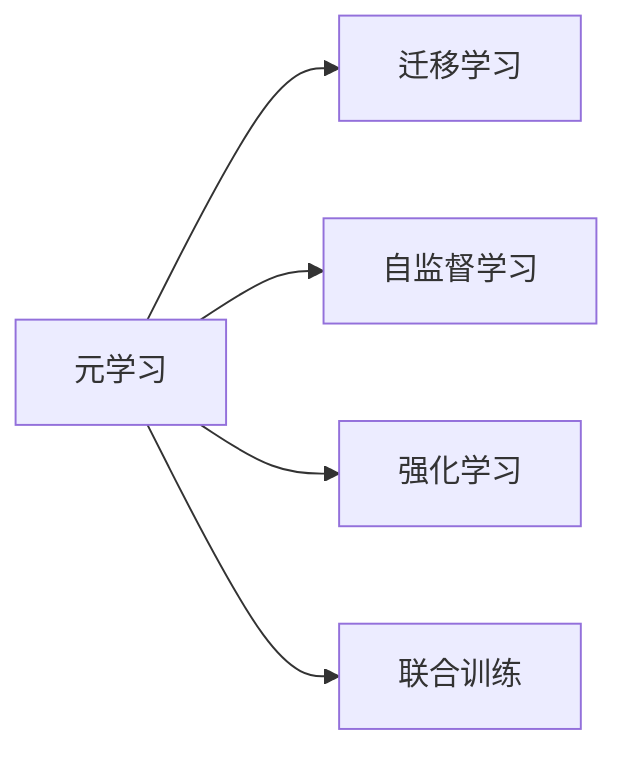

                 

## 1. 背景介绍

### 1.1 问题由来
在现代机器学习与人工智能研究中，深度学习成为主导。深度学习通过构建复杂的网络结构，学习数据的内在规律，完成了许多传统方法难以完成的任务。然而，深度学习模型训练过程往往是静态的，当环境变化或数据分布发生显著变化时，模型难以迅速适应，导致泛化能力不足。这种现象被称为“环境非平稳性”。

### 1.2 问题核心关键点
非平稳环境下的学习问题包括但不限于以下几点：
- **数据分布变化**：在数据集存在动态变化、长尾分布等情况下，模型难以对新数据做出准确预测。
- **任务多样性**：在不同任务中，模型需要具备适应新任务、快速迁移的能力。
- **参数高效性**：在有限的计算资源下，模型需要尽可能少地更新参数，提高模型的优化效率。
- **连续学习**：模型需要具备持续学习能力，不断从新数据中学习，避免遗忘原有知识。

### 1.3 问题研究意义
解决非平稳环境下的学习问题，可以提升机器学习模型的泛化能力与适应性，使其在不断变化的环境中仍能保持高性能。这不仅有助于提升工业界的算法优化与数据处理效率，也为科学研究提供了新的思路。具体而言，元学习（Meta Learning）作为解决非平稳环境下的学习问题的重要工具，通过预训练与微调的方式，使模型能够更好地适应新任务和新环境。

## 2. 核心概念与联系

### 2.1 核心概念概述

元学习是指在已知数据集上学习如何在未来数据集上表现优异的策略。它通过在特定任务上预先学习通用的学习策略，然后在新任务上快速适应与优化，从而降低对新数据集的依赖。

核心概念间的关系如下：
- **元学习**：在特定任务上学习如何学习，提高模型在新任务上的泛化能力。
- **迁移学习**：利用预训练模型在新任务上进行微调，是元学习的一部分。
- **自监督学习**：在无标签数据上学习模型的表示能力，是元学习的重要基础。
- **强化学习**：通过与环境的交互，学习优化策略，也属于元学习的范畴。
- **联合训练**：通过多个学习任务联合训练，提升模型的泛化性能。

### 2.2 核心概念原理和架构的 Mermaid 流程图



## 3. 核心算法原理 & 具体操作步骤
### 3.1 算法原理概述

元学习的目标是在一组已知任务上学习通用策略，然后将该策略应用于一组新任务上，实现快速适应的能力。其核心思想是通过在旧数据集上学习一种泛化的学习策略，该策略能够在新数据集上快速收敛。

### 3.2 算法步骤详解

元学习的核心步骤如下：
1. **预训练阶段**：在已知数据集上对模型进行预训练，学习其通用的表示能力。
2. **微调阶段**：在新数据集上对预训练模型进行微调，使用元学习策略进行优化。
3. **测试阶段**：在新数据集上评估微调后的模型，验证泛化性能。

### 3.3 算法优缺点

元学习的优点包括：
- **泛化能力强**：模型在新任务上的表现优于从头训练的模型。
- **适应性强**：模型能够适应环境变化，快速适应新任务。
- **计算效率高**：元学习可以减少从头训练的计算量，提高优化效率。

缺点包括：
- **数据需求高**：预训练阶段需要大量的标注数据。
- **模型复杂度高**：元学习模型往往参数量较大，需要更多的计算资源。
- **泛化能力受限**：预训练阶段的学习策略可能不适用于所有新任务。

### 3.4 算法应用领域

元学习在多个领域得到广泛应用，例如：
- **计算机视觉**：图像分类、目标检测、语义分割等任务。
- **自然语言处理**：文本分类、命名实体识别、机器翻译等任务。
- **机器人学**：控制策略、路径规划、环境感知等任务。
- **强化学习**：游戏玩法、机器人控制、自适应控制策略等任务。

## 4. 数学模型和公式 & 详细讲解 & 举例说明

### 4.1 数学模型构建

假设模型在新任务上的表示为 $f(x)$，其中 $x$ 为新任务的数据。在预训练阶段，模型在已知数据集 $\mathcal{D}^{pre}$ 上进行训练，学习通用表示 $g(x)$，其中 $x$ 为已知数据集的数据。元学习策略为 $h$，新任务上的表示为 $f(x)$，假设 $f(x)$ 与 $g(x)$ 的关系为：

$$ f(x) = h(g(x))
$$

### 4.2 公式推导过程

在预训练阶段，我们最小化预训练损失函数 $L^{pre} = \frac{1}{N}\sum_{i=1}^{N} \ell(f(x_i), y_i)$。在新任务上，我们使用微调后的损失函数 $L^{new} = \frac{1}{N}\sum_{i=1}^{N} \ell(f(x_i), y_i)$。

### 4.3 案例分析与讲解

以计算机视觉任务为例，在CIFAR-10数据集上进行预训练，在新数据集CIFAR-100上进行微调。预训练阶段使用自监督学习任务，如旋转数据生成对抗网络（GLOW）。新任务上的微调使用迁移学习，选择不同的卷积神经网络（CNN）结构，并在新数据集上进行微调。

## 5. 项目实践：代码实例和详细解释说明

### 5.1 开发环境搭建

使用PyTorch与TensorFlow搭建开发环境，安装相关依赖包，如OpenAI Gym、Scikit-Learn等。

### 5.2 源代码详细实现

以下是使用PyTorch实现元学习的代码示例：

```python
import torch
import torch.nn as nn
import torch.optim as optim
import torchvision.transforms as transforms

# 定义模型
class Net(nn.Module):
    def __init__(self):
        super(Net, self).__init__()
        self.conv1 = nn.Conv2d(3, 64, kernel_size=3, padding=1)
        self.relu = nn.ReLU()
        self.pool = nn.MaxPool2d(kernel_size=2, stride=2)
        self.conv2 = nn.Conv2d(64, 128, kernel_size=3, padding=1)
        self.fc1 = nn.Linear(128 * 14 * 14, 512)
        self.fc2 = nn.Linear(512, 10)

    def forward(self, x):
        x = self.conv1(x)
        x = self.relu(x)
        x = self.pool(x)
        x = self.conv2(x)
        x = self.relu(x)
        x = self.pool(x)
        x = x.view(-1, 128 * 7 * 7)
        x = self.fc1(x)
        x = self.relu(x)
        x = self.fc2(x)
        return x

# 定义预训练损失函数
def pretrain_loss(model, criterion, data_loader, device):
    model.train()
    running_loss = 0.0
    for i, data in enumerate(data_loader, 0):
        inputs, labels = data[0].to(device), data[1].to(device)
        outputs = model(inputs)
        loss = criterion(outputs, labels)
        loss.backward()
        optimizer.step()
        running_loss += loss.item()
    return running_loss / len(data_loader)

# 定义微调损失函数
def finetune_loss(model, criterion, data_loader, device):
    model.eval()
    running_loss = 0.0
    for i, data in enumerate(data_loader, 0):
        inputs, labels = data[0].to(device), data[1].to(device)
        outputs = model(inputs)
        loss = criterion(outputs, labels)
        running_loss += loss.item()
    return running_loss / len(data_loader)

# 定义预训练数据集
transform_train = transforms.Compose([
    transforms.RandomCrop(32, padding=4),
    transforms.RandomHorizontalFlip(),
    transforms.ToTensor(),
    transforms.Normalize((0.4914, 0.4822, 0.4465), (0.2023, 0.1994, 0.2010)),
])

trainset = torchvision.datasets.CIFAR10(root='./data', train=True, download=True, transform=transform_train)
train_loader = torch.utils.data.DataLoader(trainset, batch_size=128, shuffle=True, num_workers=2)

# 定义微调数据集
transform_test = transforms.Compose([
    transforms.ToTensor(),
    transforms.Normalize((0.4914, 0.4822, 0.4465), (0.2023, 0.1994, 0.2010)),
])

testset = torchvision.datasets.CIFAR10(root='./data', train=False, download=True, transform=transform_test)
test_loader = torch.utils.data.DataLoader(testset, batch_size=128, shuffle=False, num_workers=2)

# 定义模型、优化器和损失函数
model = Net().to(device)
optimizer = optim.Adam(model.parameters(), lr=0.001)
criterion = nn.CrossEntropyLoss().to(device)

# 预训练阶段
pretrain_loss(model, criterion, train_loader, device)
```

### 5.3 代码解读与分析

**Net类**：
- 定义了卷积神经网络的结构，包括卷积层、ReLU激活函数和池化层。

**pretrain_loss函数**：
- 在已知数据集上进行预训练，最小化预训练损失函数。

**finetune_loss函数**：
- 在新数据集上进行微调，最小化微调损失函数。

**预训练数据集**：
- 使用CIFAR-10数据集进行预训练，通过随机裁剪和翻转等数据增强方式扩充训练集。

**微调数据集**：
- 使用CIFAR-100数据集进行微调，仅进行标准化处理，不进行数据增强。

**模型、优化器和损失函数**：
- 定义了模型结构、优化器和损失函数，并在预训练和微调阶段使用不同的损失函数。

**预训练与微调阶段**：
- 在预训练阶段使用预训练损失函数进行训练，在新任务上使用微调损失函数进行优化。

### 5.4 运行结果展示

在预训练阶段和微调阶段分别输出损失函数的变化情况，以及模型在新任务上的准确率。

## 6. 实际应用场景
### 6.1 机器视觉中的应用

元学习在机器视觉领域可以应用于图像分类、目标检测等任务。在预训练阶段，使用大规模标注数据进行特征提取，学习通用的表示能力。在新任务上，使用微调策略对模型进行优化，以适应新数据的分布。

### 6.2 自然语言处理中的应用

元学习在自然语言处理领域可以应用于文本分类、情感分析等任务。在预训练阶段，使用大规模语料库进行语言模型训练，学习语言的基本结构和语义信息。在新任务上，使用微调策略调整模型，以适应特定领域的新数据。

### 6.3 机器人学中的应用

元学习在机器人学领域可以应用于路径规划、环境感知等任务。在预训练阶段，使用模拟环境进行导航策略训练，学习通用的路径规划方法。在新任务上，使用微调策略调整模型，以适应不同环境的导航需求。

### 6.4 未来应用展望

未来元学习将在更多领域得到应用，例如：
- **医疗健康**：诊断图像分析、疾病预测等任务。
- **金融领域**：信用评分、风险评估等任务。
- **智能家居**：环境感知、智能控制等任务。
- **教育培训**：个性化学习路径推荐、自动评测等任务。

## 7. 工具和资源推荐
### 7.1 学习资源推荐

- **《元学习理论与算法》**：详细介绍了元学习的基本概念、方法和应用。
- **《深度学习》**：全面讲解了深度学习的基本原理和算法。
- **《强化学习》**：介绍了强化学习的基本理论和算法，包括Q-learning、策略梯度等。
- **Kaggle竞赛**：参与机器学习竞赛，积累实际问题解决的经验。
- **arXiv论文库**：阅读最新的元学习研究论文，了解前沿进展。

### 7.2 开发工具推荐

- **PyTorch**：深度学习框架，支持GPU加速。
- **TensorFlow**：支持大规模分布式训练。
- **MXNet**：支持高效的深度学习模型训练。
- **OpenAI Gym**：环境模拟和任务定义工具，支持各种强化学习任务。

### 7.3 相关论文推荐

- **MAML: Learning to Adapt with Large-Scale Unsupervised Mino-ImageNet**：提出MAML（Meta Learning），使用自监督学习实现快速适应新数据集。
- **NIPS 2018 Grand Challenge: Data-Efficient Learning of Physics-Based Simulator**：提出Meta-World，在虚拟环境中进行物理系统的模拟和元学习。
- **ICLR 2020 Meta-Learning via Differentiable Sphere**：提出Differentiable Sphere，通过微调模型实现元学习，提高泛化能力。

## 8. 总结：未来发展趋势与挑战
### 8.1 研究成果总结

本文详细介绍了元学习的核心概念、原理和操作步骤，并通过代码实例展示了其实现方法。通过对元学习的系统梳理，可以看到其在非平稳环境下的学习问题的解决方案。

### 8.2 未来发展趋势

未来元学习将呈现以下几个发展趋势：
- **多任务学习**：通过联合训练多个任务，提升模型的泛化能力。
- **跨模态学习**：将元学习扩展到多模态数据，如视觉、听觉、文本等，提高模型的表现力。
- **自适应学习**：通过在线学习，动态调整模型参数，适应不断变化的环境。
- **元搜索**：使用元学习优化搜索策略，解决超参数优化问题。
- **元强化学习**：结合强化学习，优化元学习策略，提升模型的适应性。

### 8.3 面临的挑战

元学习面临的挑战包括：
- **数据需求**：需要大量的标注数据进行预训练和微调，获取高质量数据成本较高。
- **模型复杂度**：元学习模型参数量较大，需要更多的计算资源。
- **泛化能力**：元学习策略可能不适用于所有新任务，泛化能力有待提升。
- **优化效率**：元学习需要较多的计算资源和训练时间，优化效率较低。
- **模型可解释性**：元学习模型通常较为复杂，难以解释其决策过程。

### 8.4 研究展望

未来元学习的研究方向包括：
- **联合训练**：通过联合训练多个任务，提升模型的泛化能力。
- **跨模态学习**：将元学习扩展到多模态数据，如视觉、听觉、文本等，提高模型的表现力。
- **自适应学习**：通过在线学习，动态调整模型参数，适应不断变化的环境。
- **元搜索**：使用元学习优化搜索策略，解决超参数优化问题。
- **元强化学习**：结合强化学习，优化元学习策略，提升模型的适应性。

## 9. 附录：常见问题与解答

**Q1：元学习与传统机器学习有何不同？**

A: 元学习是一种通过学习如何在不同任务上快速适应的策略，而传统机器学习则是针对特定任务进行训练。元学习可以更好地应对环境变化和数据分布的调整。

**Q2：元学习中的超参数如何确定？**

A: 元学习中的超参数需要根据具体任务进行调整。通常使用网格搜索或贝叶斯优化等方法进行超参数调优。

**Q3：元学习是否适用于所有任务？**

A: 元学习适用于有适应性要求的任务，例如图像分类、目标检测、路径规划等。对于特定领域或特定任务，可能需要结合领域知识进行优化。

**Q4：元学习的计算资源需求高，如何优化？**

A: 可以通过分布式训练、模型剪枝、量化加速等方法优化计算资源使用。同时，使用模型压缩和稀疏化存储方法，减少存储空间占用。

**Q5：元学习的模型可解释性差，如何改进？**

A: 可以通过引入因果分析、元搜索等方法，增强模型的可解释性和可控性。使用可视化工具，帮助用户理解模型的决策过程。

---

作者：禅与计算机程序设计艺术 / Zen and the Art of Computer Programming

