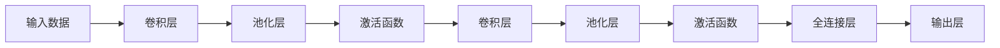

                 

# 一切皆是映射：卷积神经网络(CNN)原理解析

## 1. 背景介绍

### 1.1 问题由来
在深度学习领域，卷积神经网络（Convolutional Neural Networks, CNNs）是一种重要的前馈神经网络结构，广泛应用于计算机视觉、自然语言处理、信号处理等多个领域。其核心思想是利用局部连接和权值共享，通过卷积操作提取输入数据的局部特征，从而实现高效的特征提取和分类。

### 1.2 问题核心关键点
理解CNN的核心原理是进行深度学习项目开发的基础，特别是在图像识别、目标检测、图像分割等视觉任务中，CNN更是不可或缺的工具。本文将详细解析CNN的核心概念、算法原理以及具体操作步骤，帮助读者更好地理解和应用这一强大的神经网络结构。

## 2. 核心概念与联系

### 2.1 核心概念概述

为了更好地理解CNN的原理，首先需要介绍几个核心概念：

- **卷积层(Convolutional Layer)**：卷积层是CNN的基本组成单元，通过滑动卷积核对输入数据进行卷积操作，提取局部特征。
- **池化层(Pooling Layer)**：池化层对卷积层输出的特征图进行降采样，以减少参数量和计算复杂度。
- **激活函数(Activation Function)**：激活函数为卷积层输出引入非线性变换，增加模型的表达能力。
- **全连接层(Fully Connected Layer)**：全连接层将卷积和池化层的特征进行线性变换，最终输出分类结果。
- **损失函数(Loss Function)**：损失函数衡量模型输出与真实标签之间的差异，用于训练模型的反向传播。
- **优化算法(Optimizer)**：优化算法通过最小化损失函数，更新模型参数以提高模型性能。

这些核心概念之间通过卷积、池化、激活等操作，形成了CNN的计算流程。通过理解这些核心概念，我们可以更好地把握CNN的计算逻辑和应用场景。

### 2.2 核心概念原理和架构的 Mermaid 流程图



这个流程图展示了CNN的基本计算流程，从输入数据开始，经过多次卷积和池化操作，最终输出分类结果。

## 3. 核心算法原理 & 具体操作步骤

### 3.1 算法原理概述

CNN的核心算法原理可以概括为以下几个步骤：

1. **卷积操作**：卷积层通过滑动卷积核对输入数据进行卷积操作，提取局部特征。
2. **池化操作**：池化层对卷积层输出的特征图进行降采样，减少参数量和计算复杂度。
3. **非线性变换**：激活函数为卷积层输出引入非线性变换，增加模型的表达能力。
4. **分类输出**：全连接层将卷积和池化层的特征进行线性变换，最终输出分类结果。

### 3.2 算法步骤详解

#### 3.2.1 卷积操作

卷积操作是CNN的核心步骤，通过滑动卷积核对输入数据进行卷积，提取局部特征。具体步骤如下：

1. **卷积核定义**：卷积核是一个小的矩阵，通常为 $h \times w \times c \times o$ 的形式，其中 $h$ 和 $w$ 为卷积核的尺寸，$c$ 为输入通道数，$o$ 为输出通道数。
2. **卷积计算**：卷积操作将卷积核与输入数据的局部区域进行逐点乘积，然后求和。具体计算公式为：

$$
C(i,j,k) = \sum_{m=0}^{h-1} \sum_{n=0}^{w-1} \sum_{c=0}^{c-1} W_{c,m,n} * I(i-m,j-n,c)
$$

其中 $C$ 为卷积层输出，$W$ 为卷积核，$I$ 为输入数据，$*$ 为逐点乘积运算符。

3. **参数共享**：卷积操作通过权值共享，减少了模型的参数数量。对于一个 $h \times w \times c$ 的卷积核，只需训练 $h \times w \times o$ 个参数，相比全连接层的 $c \times o$ 个参数，显著减少了计算复杂度。

#### 3.2.2 池化操作

池化操作用于减少卷积层输出的特征图大小，降低计算复杂度。常用的池化方法包括最大池化（Max Pooling）和平均池化（Average Pooling），具体步骤如下：

1. **最大池化**：将每个池化窗口内的最大值作为输出，可以减少特征图的尺寸。
2. **平均池化**：将每个池化窗口内的平均值作为输出，也可以减少特征图的尺寸。

最大池化公式为：

$$
P(i,j) = \max_{m=0}^{h-1} \max_{n=0}^{w-1} I(i+m,j+n)
$$

平均池化公式为：

$$
P(i,j) = \frac{1}{hw} \sum_{m=0}^{h-1} \sum_{n=0}^{w-1} I(i+m,j+n)
$$

#### 3.2.3 非线性变换

非线性变换通过引入激活函数，为卷积层输出引入非线性，增加模型的表达能力。常用的激活函数包括ReLU、Sigmoid、Tanh等。ReLU激活函数的计算公式为：

$$
A(x) = \max(0, x)
$$

### 3.3 算法优缺点

CNN具有以下优点：

1. **局部连接和权值共享**：减少了参数数量，降低了计算复杂度。
2. **提取局部特征**：通过卷积操作提取输入数据的局部特征，具有很强的空间信息利用能力。
3. **良好的表达能力**：通过多次卷积和池化操作，能够提取复杂的高级特征，实现高精度的分类。

同时，CNN也存在一些缺点：

1. **参数数量依然较多**：虽然减少了参数数量，但与全连接层相比，仍需要大量的参数。
2. **模型结构固定**：卷积核大小和步长固定，无法根据输入数据自动调整。
3. **对输入数据依赖大**：输入数据的尺寸和尺寸变化可能会影响卷积操作的正确性。

### 3.4 算法应用领域

CNN广泛应用于计算机视觉、自然语言处理、信号处理等多个领域，具体应用包括：

1. **图像识别**：通过CNN对输入图像进行卷积和池化操作，提取图像的局部特征，进行分类或检测。
2. **目标检测**：通过CNN提取图像中目标的局部特征，进行目标定位和分类。
3. **图像分割**：通过CNN对图像进行像素级的分类，生成图像的语义分割结果。
4. **语音识别**：通过CNN对语音信号进行卷积操作，提取声学特征，进行语音识别。
5. **自然语言处理**：通过CNN对文本进行卷积和池化操作，提取文本的局部特征，进行情感分析、文本分类等任务。
6. **信号处理**：通过CNN对信号进行卷积操作，提取信号的局部特征，进行信号分类、特征提取等任务。

## 4. 数学模型和公式 & 详细讲解  
### 4.1 数学模型构建

CNN的数学模型可以通过以下步骤进行构建：

1. **输入数据**：记输入数据的尺寸为 $n \times n \times c$，其中 $n$ 为输入数据的尺寸，$c$ 为输入通道数。
2. **卷积核**：记卷积核的尺寸为 $h \times w \times c \times o$，其中 $h$ 和 $w$ 为卷积核的尺寸，$c$ 为输入通道数，$o$ 为输出通道数。
3. **卷积操作**：记卷积层输出特征图的尺寸为 $n' \times n' \times o$，其中 $n'$ 为输出特征图的尺寸。卷积操作的计算公式为：

$$
C(i,j,k) = \sum_{m=0}^{h-1} \sum_{n=0}^{w-1} \sum_{c=0}^{c-1} W_{c,m,n} * I(i-m,j-n,c)
$$

其中 $C$ 为卷积层输出，$W$ 为卷积核，$I$ 为输入数据。

4. **池化操作**：池化层对卷积层输出的特征图进行降采样，输出特征图的尺寸为 $\frac{n'}{p} \times \frac{n'}{p} \times o$，其中 $p$ 为池化操作的尺寸。

### 4.2 公式推导过程

为了更好地理解CNN的计算过程，下面我们将详细推导卷积操作的计算公式。

首先，假设输入数据的尺寸为 $n \times n \times c$，卷积核的尺寸为 $h \times w \times c \times o$，卷积层的输出尺寸为 $n' \times n' \times o$，其中 $n'$ 为输出特征图的尺寸。

卷积操作的计算公式为：

$$
C(i,j,k) = \sum_{m=0}^{h-1} \sum_{n=0}^{w-1} \sum_{c=0}^{c-1} W_{c,m,n} * I(i-m,j-n,c)
$$

其中 $C$ 为卷积层输出，$W$ 为卷积核，$I$ 为输入数据，$*$ 为逐点乘积运算符。

具体计算过程如下：

1. 将卷积核 $W$ 滑动到输入数据 $I$ 的每个局部区域，计算卷积核与输入数据的逐点乘积，然后求和。
2. 输出结果 $C$ 为卷积层输出，包含 $n' \times n' \times o$ 个元素。

通过卷积操作，CNN能够自动提取输入数据的局部特征，实现高效的特征提取。

### 4.3 案例分析与讲解

假设输入数据为 $5 \times 5 \times 3$ 的图像，卷积核为 $3 \times 3 \times 3 \times 1$ 的卷积核，输出特征图的尺寸为 $2 \times 2 \times 1$。

设卷积核为 $W = \begin{bmatrix} \begin{bmatrix} 1 & 2 \\ 3 & 4 \end{bmatrix} & \begin{bmatrix} 5 & 6 \\ 7 & 8 \end{bmatrix} \\ \begin{bmatrix} 9 & 10 \\ 11 & 12 \end{bmatrix} & \begin{bmatrix} 13 & 14 \\ 15 & 16 \end{bmatrix} \end{bmatrix}$。

计算输出结果：

$$
C(0,0,0) = 1 * 1 + 2 * 3 + 3 * 9 + 4 * 11 = 56
$$

$$
C(0,1,0) = 1 * 2 + 2 * 4 + 3 * 10 + 4 * 12 = 68
$$

$$
C(1,0,0) = 5 * 1 + 6 * 3 + 7 * 9 + 8 * 11 = 95
$$

$$
C(1,1,0) = 5 * 2 + 6 * 4 + 7 * 10 + 8 * 12 = 107
$$

$$
C(2,0,0) = 9 * 1 + 10 * 3 + 11 * 9 + 12 * 11 = 145
$$

$$
C(2,1,0) = 9 * 2 + 10 * 4 + 11 * 10 + 12 * 12 = 169
$$

$$
C(3,0,0) = 13 * 1 + 14 * 3 + 15 * 9 + 16 * 11 = 195
$$

$$
C(3,1,0) = 13 * 2 + 14 * 4 + 15 * 10 + 16 * 12 = 209
$$

得到输出特征图为：

$$
C = \begin{bmatrix} \begin{bmatrix} 56 & 68 \\ 95 & 107 \end{bmatrix} & \begin{bmatrix} 145 & 169 \\ 195 & 209 \end{bmatrix} \end{bmatrix}
$$

## 5. 项目实践：代码实例和详细解释说明

### 5.1 开发环境搭建

在开始CNN的实践前，需要先搭建好开发环境。以下是使用Python进行TensorFlow开发的环境配置流程：

1. 安装Anaconda：从官网下载并安装Anaconda，用于创建独立的Python环境。

2. 创建并激活虚拟环境：
```bash
conda create -n tf-env python=3.8 
conda activate tf-env
```

3. 安装TensorFlow：根据CUDA版本，从官网获取对应的安装命令。例如：
```bash
conda install tensorflow
```

4. 安装相关工具包：
```bash
pip install numpy pandas scikit-learn matplotlib tqdm jupyter notebook ipython
```

完成上述步骤后，即可在`tf-env`环境中开始CNN的实践。

### 5.2 源代码详细实现

下面我们将以MNIST手写数字识别为例，使用TensorFlow实现一个简单的CNN模型。

首先，定义MNIST数据集：

```python
import tensorflow as tf
from tensorflow.keras.datasets import mnist

(x_train, y_train), (x_test, y_test) = mnist.load_data()
x_train, x_test = x_train / 255.0, x_test / 255.0
```

然后，定义CNN模型：

```python
import tensorflow as tf
from tensorflow.keras import layers, models

model = models.Sequential([
    layers.Conv2D(32, (3,3), activation='relu', input_shape=(28, 28, 1)),
    layers.MaxPooling2D((2,2)),
    layers.Flatten(),
    layers.Dense(10, activation='softmax')
])
```

接着，编译模型并训练：

```python
model.compile(optimizer='adam', loss='sparse_categorical_crossentropy', metrics=['accuracy'])
model.fit(x_train.reshape(-1, 28, 28, 1), y_train, epochs=5, batch_size=64)
```

最后，评估模型性能：

```python
test_loss, test_acc = model.evaluate(x_test.reshape(-1, 28, 28, 1), y_test, verbose=2)
print('Test accuracy:', test_acc)
```

这就是使用TensorFlow实现一个简单的CNN模型的完整代码实现。可以看到，TensorFlow提供了丰富的API和工具，使得CNN模型的开发和训练变得非常便捷。

### 5.3 代码解读与分析

让我们再详细解读一下关键代码的实现细节：

**Sequential模型定义**：使用Sequential模型定义一个简单的CNN模型，包含卷积层、池化层、全连接层等。

**卷积层定义**：使用Conv2D层定义一个3x3的卷积层，输入尺寸为28x28x1，输出通道数为32，激活函数为ReLU。

**池化层定义**：使用MaxPooling2D层定义一个2x2的最大池化层，对卷积层输出进行降采样。

**Flatten层定义**：使用Flatten层将池化层输出的二维特征图展平为一维向量，方便输入全连接层。

**全连接层定义**：使用Dense层定义一个10个神经元的全连接层，激活函数为softmax。

**模型编译**：使用compile方法编译模型，指定优化器、损失函数和评估指标。

**模型训练**：使用fit方法训练模型，指定训练数据、训练轮数和批次大小。

**模型评估**：使用evaluate方法评估模型性能，指定测试数据。

通过以上步骤，我们成功搭建并训练了一个简单的CNN模型，用于MNIST手写数字识别任务。可以看到，TensorFlow提供了丰富的API和工具，使得CNN模型的开发和训练变得非常便捷。

## 6. 实际应用场景

### 6.1 计算机视觉

CNN在计算机视觉领域具有广泛的应用，如图像识别、目标检测、图像分割等。例如，在图像识别任务中，CNN能够自动提取图像的局部特征，进行分类或检测。以下是一个简单的图像识别示例：

```python
import tensorflow as tf
from tensorflow.keras.preprocessing.image import load_img, img_to_array

img = load_img('cat.jpg', target_size=(28, 28))
img_array = img_to_array(img)
img_array = tf.expand_dims(img_array, 0)
predictions = model.predict(img_array)
```

通过加载图片并输入CNN模型，可以自动提取图片中的特征并进行分类。

### 6.2 自然语言处理

CNN同样可以应用于自然语言处理任务，如情感分析、文本分类等。在情感分析任务中，CNN能够自动提取文本的局部特征，进行情感分类。以下是一个简单的情感分析示例：

```python
import tensorflow as tf
from tensorflow.keras.preprocessing.text import Tokenizer
from tensorflow.keras.preprocessing.sequence import pad_sequences

texts = ['This movie is great!', 'I hate this movie!']
tokenizer = Tokenizer(num_words=1000)
tokenizer.fit_on_texts(texts)
sequences = tokenizer.texts_to_sequences(texts)
padded_sequences = pad_sequences(sequences, maxlen=10)
predictions = model.predict(padded_sequences)
```

通过加载文本并输入CNN模型，可以自动提取文本中的特征并进行情感分类。

### 6.3 信号处理

CNN同样可以应用于信号处理任务，如语音识别、音频分类等。在语音识别任务中，CNN能够自动提取语音信号的局部特征，进行语音识别。以下是一个简单的语音识别示例：

```python
import numpy as np
import tensorflow as tf
from tensorflow.keras.models import Sequential
from tensorflow.keras.layers import Conv2D, MaxPooling2D, Flatten, Dense

# 加载音频数据
sampling_rate = 16000
audio_data = np.random.rand(10, sampling_rate)
# 将音频数据转换为图像数据
audio_image = tf.reshape(audio_data, (10, 1, sampling_rate, 1))
# 定义CNN模型
model = Sequential()
model.add(Conv2D(32, (3, 3), activation='relu', input_shape=(1, sampling_rate, 1)))
model.add(MaxPooling2D((2, 2)))
model.add(Flatten())
model.add(Dense(10, activation='softmax'))
# 编译模型
model.compile(optimizer='adam', loss='sparse_categorical_crossentropy', metrics=['accuracy'])
# 训练模型
model.fit(audio_image, y_train, epochs=5, batch_size=64)
# 评估模型性能
test_loss, test_acc = model.evaluate(audio_image, y_test, verbose=2)
print('Test accuracy:', test_acc)
```

通过加载音频数据并输入CNN模型，可以自动提取音频信号的特征并进行分类。

## 7. 工具和资源推荐

### 7.1 学习资源推荐

为了帮助开发者系统掌握CNN的理论基础和实践技巧，这里推荐一些优质的学习资源：

1. 《深度学习》课程：由斯坦福大学开设的深度学习课程，涵盖了深度学习的基础知识和经典模型，包括CNN的详细介绍。

2. 《计算机视觉：现代方法》：由Richard Szeliski撰写，系统介绍了计算机视觉的各个方面，包括CNN在图像处理和计算机视觉中的应用。

3. 《神经网络与深度学习》：由Michael Nielsen撰写，全面介绍了神经网络和深度学习的原理和应用，包括CNN的基本概念和计算过程。

4. 《TensorFlow实战》：由Tom Hope和Jane Zhang撰写，详细介绍了TensorFlow的使用方法和实践技巧，包括CNN的实现和训练。

5. 《Python深度学习》：由Francois Chollet撰写，全面介绍了使用Keras进行深度学习的实战经验，包括CNN的实现和应用。

### 7.2 开发工具推荐

在CNN的开发过程中，以下工具可以提供很大的帮助：

1. TensorFlow：由Google开发的深度学习框架，提供了丰富的API和工具，使得CNN的开发和训练变得非常便捷。

2. PyTorch：由Facebook开发的深度学习框架，提供了灵活的计算图和自动微分功能，方便进行CNN的开发和训练。

3. Keras：由Francois Chollet开发的高级深度学习API，提供了简单易用的API，方便进行CNN的实现和训练。

4. Jupyter Notebook：一个交互式的编程环境，支持Python、TensorFlow等深度学习框架的使用，方便进行CNN的实现和实验。

### 7.3 相关论文推荐

CNN的研究历史悠久，以下是几篇奠基性的相关论文，推荐阅读：

1. LeNet-5：1998年，Yann LeCun等人发表了LeNet-5网络，是第一个成功的CNN模型，用于手写数字识别任务。

2. AlexNet：2012年，Alex Krizhevsky等人发表了AlexNet模型，用于图像识别任务，开创了深度学习时代。

3. VGGNet：2014年，Karen Simonyan和Andrew Zisserman发表了VGGNet模型，通过深度卷积网络实现了优秀的图像分类性能。

4. ResNet：2015年，Kaiming He等人发表了ResNet模型，通过残差连接解决了深度神经网络训练中的梯度消失问题。

5. InceptionNet：2014年，Christian Szegedy等人发表了InceptionNet模型，通过多尺度卷积实现了优秀的图像分类性能。

6. MobileNet：2017年，Alex Howard等人发表了MobileNet模型，通过深度可分离卷积实现了高效的图像分类性能。

这些论文代表了CNN技术的发展脉络，通过学习这些前沿成果，可以帮助研究者把握学科前进方向，激发更多的创新灵感。

## 8. 总结：未来发展趋势与挑战

### 8.1 研究成果总结

CNN作为深度学习领域的重要组成部分，已经在计算机视觉、自然语言处理、信号处理等多个领域取得了显著的应用效果。其核心思想是通过卷积操作提取输入数据的局部特征，实现高效的特征提取和分类。通过不断优化模型结构和算法，CNN的性能和应用范围也在不断扩展。

### 8.2 未来发展趋势

未来，CNN技术将继续在以下几个方向发展：

1. **更深层次的卷积网络**：通过增加网络深度，进一步提升CNN的表达能力和分类性能。

2. **更高效的卷积操作**：通过引入新的卷积操作（如空洞卷积、反卷积等），提高CNN的性能和效率。

3. **多任务学习**：通过多任务学习（MTL），提高CNN在不同任务之间的迁移能力。

4. **融合注意力机制**：通过引入注意力机制，提高CNN对输入数据的注意力关注度，增强特征提取能力。

5. **迁移学习**：通过迁移学习，提高CNN在相似任务之间的迁移能力，加速模型训练。

6. **模型压缩与加速**：通过模型压缩和加速技术，提高CNN的推理速度和计算效率，实现更轻量级的部署。

### 8.3 面临的挑战

虽然CNN技术已经取得了显著的成果，但在未来发展过程中，仍面临以下挑战：

1. **过拟合问题**：CNN模型在训练过程中容易出现过拟合问题，尤其是在数据量不足的情况下。

2. **模型复杂度**：深度卷积网络增加了模型复杂度，导致训练和推理过程的计算成本增加。

3. **训练时间和成本**：深度卷积网络需要大量的计算资源进行训练，导致训练时间和成本的增加。

4. **模型可解释性**：深度卷积网络通常被视为"黑盒"模型，难以解释其内部工作机制和决策逻辑。

5. **模型泛化能力**：CNN模型在不同的数据集上表现不稳定，泛化能力有待进一步提升。

### 8.4 研究展望

未来，研究者需要在以下几个方向进行探索：

1. **解决过拟合问题**：引入正则化技术，如Dropout、Batch Normalization等，缓解过拟合问题。

2. **降低模型复杂度**：通过模型压缩、剪枝等技术，降低模型复杂度，提高计算效率。

3. **优化训练过程**：通过迁移学习、多任务学习等技术，提高模型的迁移能力和训练效率。

4. **提高模型可解释性**：引入可解释性技术，如Attention机制、层级激活图等，提高模型的可解释性。

5. **提高模型泛化能力**：通过数据增强、模型融合等技术，提高模型的泛化能力和鲁棒性。

6. **结合其他技术**：与其他深度学习技术，如强化学习、因果推理等，进行协同优化，提高模型的性能和效果。

通过这些探索和研究，相信CNN技术将在未来取得更加显著的成果，推动深度学习技术的发展和应用。

## 9. 附录：常见问题与解答

**Q1：CNN中的卷积层和池化层有什么区别？**

A: CNN中的卷积层和池化层是两个重要的操作，共同构成CNN的基本计算流程。

卷积层通过滑动卷积核对输入数据进行卷积操作，提取局部特征。具体而言，卷积操作将卷积核与输入数据的局部区域进行逐点乘积，然后求和，得到卷积层的输出。卷积层通过权值共享，减少了模型的参数数量，提高了模型的泛化能力。

池化层对卷积层输出的特征图进行降采样，减少参数量和计算复杂度。常用的池化方法包括最大池化和平均池化，分别将每个池化窗口内的最大值和平均值作为输出。池化层通过降采样，提高了模型的计算效率和特征表示能力。

**Q2：CNN中的激活函数为什么重要？**

A: CNN中的激活函数是引入非线性的关键，能够提高模型的表达能力和泛化能力。

没有激活函数，卷积层和池化层的输出将是线性变换，无法学习复杂的非线性关系。激活函数通过引入非线性，能够增加模型的表达能力，使得CNN能够学习更复杂的特征和模式。

常用的激活函数包括ReLU、Sigmoid、Tanh等，其中ReLU是最常用的激活函数，能够有效地缓解梯度消失问题，加速模型训练。

**Q3：CNN中的模型结构设计有哪些技巧？**

A: CNN中的模型结构设计是一个重要的环节，以下是一些常用的技巧：

1. **网络深度**：增加网络深度，可以提高模型的表达能力和分类性能，但需要考虑过拟合问题。

2. **卷积核大小**：选择合适的卷积核大小，能够提高模型的特征提取能力。通常使用3x3、5x5等较小的卷积核，能够提取更细腻的特征。

3. **步长大小**：选择合适的步长大小，能够控制卷积核的滑动步长，影响特征提取的范围。

4. **池化层**：选择合适的池化层，能够提高模型的特征提取能力和计算效率。

5. **批量归一化**：引入批量归一化（Batch Normalization）技术，能够加速模型训练，提高模型的泛化能力。

6. **残差连接**：引入残差连接（Residual Connection）技术，能够缓解梯度消失问题，提高模型的表达能力。

7. **多尺度卷积**：使用多尺度卷积（Multi-scale Convolution）技术，能够提高模型的特征提取能力和鲁棒性。

8. **注意力机制**：引入注意力机制（Attention Mechanism）技术，能够提高模型的特征关注度和表达能力。

**Q4：CNN中的正则化技术有哪些？**

A: CNN中的正则化技术用于缓解过拟合问题，以下是一些常用的技术：

1. **Dropout**：随机丢弃一部分神经元，能够降低模型的复杂度，缓解过拟合问题。

2. **L2正则化**：在损失函数中加入L2正则项，惩罚模型参数的大小，缓解过拟合问题。

3. **数据增强**：通过图像翻转、旋转等数据增强技术，扩充训练集，提高模型的泛化能力。

4. **批归一化**：引入批归一化（Batch Normalization）技术，能够加速模型训练，提高模型的泛化能力。

5. **早期停止**：在模型训练过程中，定期在验证集上评估模型性能，如果性能不再提升，则停止训练，避免过拟合。

6. **混合精度训练**：使用混合精度（Mixed-Precision）训练技术，提高模型的训练效率和泛化能力。

通过这些正则化技术，可以有效地缓解CNN中的过拟合问题，提高模型的泛化能力和表达能力。

**Q5：CNN中的模型压缩技术有哪些？**

A: CNN中的模型压缩技术用于降低模型的计算量和存储量，以下是一些常用的技术：

1. **参数剪枝**：通过剪枝技术，减少模型的参数数量，降低模型的计算量和存储量。

2. **量化技术**：使用量化技术（如8位量化），将浮点模型转换为定点模型，压缩存储量，提高计算效率。

3. **知识蒸馏**：通过知识蒸馏（Knowledge Distillation）技术，将大型模型压缩为小型模型，提高模型的计算效率和泛化能力。

4. **模型分割**：将大型模型分割为多个小型模型，提高模型的推理效率和计算效率。

5. **模型融合**：将多个小型模型进行融合，提高模型的泛化能力和计算效率。

通过这些模型压缩技术，可以有效地降低CNN的计算量和存储量，提高模型的推理效率和计算效率，实现更轻量级的部署。

**Q6：CNN中的迁移学习有哪些技巧？**

A: CNN中的迁移学习用于提高模型的迁移能力和泛化能力，以下是一些常用的技巧：

1. **预训练模型**：使用预训练模型（如ImageNet预训练模型），提高模型的迁移能力和泛化能力。

2. **多任务学习**：通过多任务学习（MTL），提高模型在不同任务之间的迁移能力。

3. **任务适应层**：设计合适的任务适应层，能够提高模型在特定任务上的性能。

4. **特征复用**：通过复用预训练模型的特征，提高模型的泛化能力和训练效率。

5. **自适应学习**：引入自适应学习技术，能够提高模型在不同数据集上的迁移能力。

通过这些迁移学习技巧，可以有效地提高CNN的迁移能力和泛化能力，加速模型的训练和优化。

通过这些详细解析和解答，相信读者对CNN的核心概念和应用技巧有了更加深入的理解，能够更好地应用于实际项目开发中。希望本文能够帮助开发者更好地掌握CNN技术，推动深度学习技术的发展和应用。

---

作者：禅与计算机程序设计艺术 / Zen and the Art of Computer Programming

