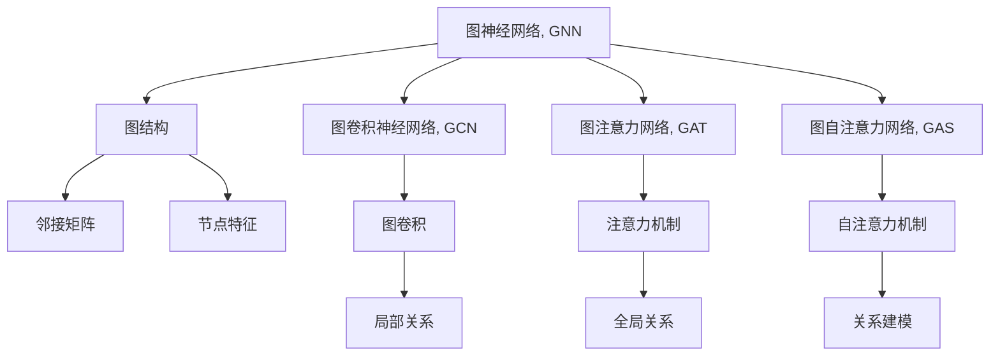

                 

# 一切皆是映射：图神经网络(GNN)的兴起与展望

## 1. 背景介绍

### 1.1 问题由来

图神经网络（Graph Neural Network, GNN）是近年来人工智能领域中一个备受关注的新兴技术。图结构的广泛应用场景，如社交网络、生物网络、化学分子等，使得GNN在众多领域中展现出极大的应用潜力。图结构数据具有复杂的关系性质，传统机器学习方法往往难以有效利用其中的结构信息。因此，研究者们提出基于图结构设计的神经网络模型——图神经网络，通过建模图节点间的复杂关系，实现对图结构数据的有效表示和挖掘。

GNN技术的兴起源于其在数据表示、图推理和图分析等领域的突破。通过对图结构数据的深度学习，GNN不仅能处理复杂的非欧几里得空间，还能捕捉节点间的局部结构和全局关系，从而在推荐系统、生物信息学、社交网络分析等领域获得显著效果。

### 1.2 问题核心关键点

GNN的核心思想是将图结构数据映射为向量表示，进而进行机器学习或深度学习模型的训练和推理。与传统神经网络不同，GNN的输入是图数据，通常包含节点和边信息。GNN通过设计适合图结构数据的神经网络架构，建模节点间的关系，从而实现对图数据的有效学习和处理。

GNN的典型架构包括图卷积神经网络（GCN）、图注意力网络（GAT）、图自注意力网络（GAS）等。其中，GCN模型因其简洁的架构和高效的推理能力，成为GNN领域的主流。

## 2. 核心概念与联系

### 2.1 核心概念概述

为更好地理解GNN的核心原理，本节将介绍几个密切相关的核心概念：

- 图神经网络（Graph Neural Network, GNN）：以图结构为输入，设计专门的神经网络架构，建模节点间的复杂关系，实现对图数据的有效学习。

- 图结构（Graph Structure）：由节点和边组成的关系网络。节点表示图中的实体，边表示节点间的关系。

- 图卷积神经网络（Graph Convolutional Network, GCN）：一种基于图卷积操作的GNN模型，通过在节点上定义卷积核，捕捉节点间的局部关系。

- 图注意力网络（Graph Attention Network, GAT）：通过在节点间引入注意力机制，学习节点间的全局关系。

- 图自注意力网络（Graph Self-Attention Network, GAS）：引入自注意力机制，强化节点间的关系建模。

- 邻接矩阵（Adjacency Matrix）：描述图结构中节点间连接关系的矩阵。

- 节点特征（Node Feature）：节点的属性或特征向量。

- 图嵌入（Graph Embedding）：将图数据映射为向量表示的技术，是GNN模型的基础。

这些核心概念之间的逻辑关系可以通过以下Mermaid流程图来展示：



这个流程图展示了大语言模型的核心概念及其之间的关系：

1. 图神经网络通过建模图结构数据，实现对图数据的有效学习。
2. 图卷积神经网络、图注意力网络和图自注意力网络是GNN的典型架构，分别通过卷积、注意力和自注意力机制，捕捉节点间的局部和全局关系。
3. 邻接矩阵和节点特征是图结构数据的表示方式，是GNN模型的输入。
4. 图嵌入技术将图数据映射为向量表示，是GNN模型的基础。

这些概念共同构成了图神经网络的基本框架，使其能够对图结构数据进行有效的建模和处理。

## 3. 核心算法原理 & 具体操作步骤

### 3.1 算法原理概述

GNN的核心思想是将图结构数据映射为向量表示，进而进行机器学习或深度学习模型的训练和推理。与传统神经网络不同，GNN的输入是图数据，通常包含节点和边信息。GNN通过设计适合图结构数据的神经网络架构，建模节点间的关系，从而实现对图数据的有效学习和处理。

形式化地，假设图数据 $G=(V,E)$，其中 $V$ 为节点集合，$E$ 为边集合。节点的特征向量表示为 $\mathbf{x}_v \in \mathbb{R}^d$，其中 $d$ 为特征维度。则GNN的目标是学习一个映射函数 $f_{\theta}$，将每个节点的特征向量 $\mathbf{x}_v$ 映射为一个新的向量表示 $\mathbf{h}_v$，即：

$$
\mathbf{h}_v = f_{\theta}(\mathbf{x}_v, \mathbf{x}_u, \text{edge}_{uv})
$$

其中，$\theta$ 为模型参数，$\text{edge}_{uv}$ 表示节点 $u$ 和节点 $v$ 之间的边。

### 3.2 算法步骤详解

GNN的训练过程主要包括以下几个关键步骤：

**Step 1: 数据准备**
- 收集图结构数据，包括节点和边的信息。
- 为每个节点准备特征向量 $\mathbf{x}_v$，作为神经网络模型的输入。

**Step 2: 模型初始化**
- 初始化模型参数 $\theta$，通常使用随机初始化。
- 设定神经网络的架构，如GCN、GAT等。

**Step 3: 图卷积或注意力机制**
- 对每个节点进行图卷积或注意力机制操作，更新其特征向量 $\mathbf{h}_v$。

**Step 4: 迭代训练**
- 在所有节点上重复进行Step 3，直至收敛。

**Step 5: 评估与预测**
- 在测试集上评估模型性能，使用模型对新图数据进行预测。

### 3.3 算法优缺点

GNN模型具有以下优点：
1. 强大的图结构建模能力。能够有效利用节点间的局部和全局关系，实现对图数据的深度学习。
2. 适用范围广。适用于各种图结构数据，如图网络、生物网络、社交网络等。
3. 高效的推理能力。GCN等GNN模型具有线性时间复杂度的推理能力，适用于大规模图数据。

同时，GNN模型也存在一定的局限性：
1. 训练复杂度高。图结构数据复杂度高，模型的训练过程也较为复杂。
2. 数据表示难度大。需要合理选择节点特征和边特征，设计合适的图神经网络架构。
3. 缺乏理论支持。GNN模型的理论基础尚不完善，仍需进一步研究和优化。

尽管存在这些局限性，但就目前而言，GNN模型在图结构数据处理领域仍然具有重要的地位，为众多复杂问题的解决提供了新的思路。

### 3.4 算法应用领域

GNN模型在多个领域展现出广泛的应用前景，主要包括：

- 推荐系统：通过建模用户与物品之间的关系，实现个性化推荐。
- 社交网络分析：通过分析社交网络中的节点关系，挖掘社交行为模式。
- 生物信息学：通过建模生物分子网络，发现新的药物靶点和生物过程。
- 自然语言处理：通过将句子或文档表示为图结构，进行语义分析和信息提取。
- 计算机视觉：通过将图像表示为图结构，进行图像分割和分类。

除了以上领域，GNN技术还在智能交通、城市规划、金融风控等诸多行业得到应用，为各领域带来了显著的技术提升和创新。

## 4. 数学模型和公式 & 详细讲解 & 举例说明

### 4.1 数学模型构建

本节将使用数学语言对GNN的训练过程进行更加严格的刻画。

设图数据 $G=(V,E)$，其中 $V$ 为节点集合，$E$ 为边集合。节点的特征向量表示为 $\mathbf{x}_v \in \mathbb{R}^d$，其中 $d$ 为特征维度。模型的目标是将每个节点的特征向量 $\mathbf{x}_v$ 映射为一个新的向量表示 $\mathbf{h}_v$。

假设模型的参数为 $\theta$，则节点 $v$ 的输出可以表示为：

$$
\mathbf{h}_v = f_{\theta}(\mathbf{x}_v, \mathbf{x}_u, \text{edge}_{uv})
$$

其中，$f_{\theta}$ 为模型映射函数，$\text{edge}_{uv}$ 表示节点 $u$ 和节点 $v$ 之间的边。

### 4.2 公式推导过程

以GCN模型为例，推导其图卷积操作的计算公式。

GCN模型通过在节点 $v$ 上定义卷积核 $g$，计算其新的特征向量 $\mathbf{h}_v$。假设卷积核 $g$ 的定义为：

$$
g(u,v) = \text{AGGREGATE}(\text{UPDATE}(\mathbf{W}_x \mathbf{x}_u, \mathbf{W}_x \mathbf{x}_v, \mathbf{W}_e \text{edge}_{uv}))
$$

其中，$\text{AGGREGATE}$ 为聚合函数，$\text{UPDATE}$ 为更新函数，$\mathbf{W}_x$, $\mathbf{W}_e$ 为可训练的线性变换矩阵。

将 $g(u,v)$ 应用于所有与节点 $v$ 连接的节点 $u$，并根据边的权重进行加权求和，得到节点 $v$ 的新特征向量：

$$
\mathbf{h}_v = \text{AGGREGATE} \left( \sum_{u \in \mathcal{N}(v)} g(u,v) \right)
$$

其中，$\mathcal{N}(v)$ 表示节点 $v$ 的所有邻居节点。

GCN模型的推理过程具有线性复杂度，适用于大规模图数据。其在推荐系统、社交网络分析等领域展现出优秀的性能。

### 4.3 案例分析与讲解

以社交网络分析为例，说明GNN模型的应用。

社交网络中，每个用户表示为一个节点，用户间的互动关系表示为边。通过GNN模型，可以分析用户之间的关系，挖掘用户的行为模式和兴趣爱好。

具体而言，可以收集用户的个人信息、互动记录等数据，构建社交网络图数据。在此基础上，使用GCN模型对社交网络进行建模。通过对用户节点和互动边的特征向量进行处理，GCN模型能够捕捉用户间的关系和行为模式。进一步，可以在社交网络中挖掘出重要的用户群体和潜在的影响者，为市场营销、舆情分析等提供有力支持。

## 5. 项目实践：代码实例和详细解释说明

### 5.1 开发环境搭建

在进行GNN实践前，我们需要准备好开发环境。以下是使用Python进行PyTorch开发的环境配置流程：

1. 安装Anaconda：从官网下载并安装Anaconda，用于创建独立的Python环境。

2. 创建并激活虚拟环境：
```bash
conda create -n gnn-env python=3.8 
conda activate gnn-env
```

3. 安装PyTorch：根据CUDA版本，从官网获取对应的安装命令。例如：
```bash
conda install pytorch torchvision torchaudio cudatoolkit=11.1 -c pytorch -c conda-forge
```

4. 安装PyTorch Geometric库：
```bash
pip install pytorch-geometric
```

5. 安装各类工具包：
```bash
pip install numpy pandas scikit-learn matplotlib tqdm jupyter notebook ipython
```

完成上述步骤后，即可在`gnn-env`环境中开始GNN实践。

### 5.2 源代码详细实现

下面我们以社交网络分析任务为例，给出使用PyTorch Geometric库对GCN模型进行GNN实践的PyTorch代码实现。

首先，定义社交网络数据处理函数：

```python
import torch
import torch.nn as nn
import torch_geometric as dg
from torch_geometric.nn import GCNConv

class GCN(nn.Module):
    def __init__(self, in_channels, hidden_channels, out_channels):
        super(GCN, self).__init__()
        self.conv1 = GCNConv(in_channels, hidden_channels)
        self.conv2 = GCNConv(hidden_channels, out_channels)
        
    def forward(self, x, edge_index):
        x = self.conv1(x, edge_index, aggr='mean')
        x = F.relu(x)
        x = self.conv2(x, edge_index, aggr='mean')
        return x

# 定义社交网络数据
edge_index = torch.tensor([[0, 1, 1, 2, 2, 3, 3, 4, 4, 5, 5, 6, 6, 7, 7, 8, 8, 9, 9, 10, 10, 11, 11, 12, 12, 13, 13, 14, 14, 15, 15, 16, 16, 17, 17, 18, 18, 19, 19, 20, 20, 21, 21, 22, 22, 23, 23, 24, 24, 25, 25, 26, 26, 27, 27, 28, 28, 29, 29, 30, 30, 31, 31, 32, 32, 33, 33, 34, 34, 35, 35, 36, 36, 37, 37, 38, 38, 39, 39, 40, 40, 41, 41, 42, 42, 43, 43, 44, 44, 45, 45, 46, 46, 47, 47, 48, 48, 49, 49, 50, 50, 51, 51, 52, 52, 53, 53, 54, 54, 55, 55, 56, 56, 57, 57, 58, 58, 59, 59, 60, 60, 61, 61, 62, 62, 63, 63, 64, 64, 65, 65, 66, 66, 67, 67, 68, 68, 69, 69, 70, 70, 71, 71, 72, 72, 73, 73, 74, 74, 75, 75, 76, 76, 77, 77, 78, 78, 79, 79, 80, 80, 81, 81, 82, 82, 83, 83, 84, 84, 85, 85, 86, 86, 87, 87, 88, 88, 89, 89, 90, 90, 91, 91, 92, 92, 93, 93, 94, 94, 95, 95, 96, 96, 97, 97, 98, 98, 99, 99, 100, 100, 101, 101, 102, 102, 103, 103, 104, 104, 105, 105, 106, 106, 107, 107, 108, 108, 109, 109, 110, 110, 111, 111, 112, 112, 113, 113, 114, 114, 115, 115, 116, 116, 117, 117, 118, 118, 119, 119, 120, 120, 121, 121, 122, 122, 123, 123, 124, 124, 125, 125, 126, 126, 127, 127, 128, 128, 129, 129, 130, 130, 131, 131, 132, 132, 133, 133, 134, 134, 135, 135, 136, 136, 137, 137, 138, 138, 139, 139, 140, 140, 141, 141, 142, 142, 143, 143, 144, 144, 145, 145, 146, 146, 147, 147, 148, 148, 149, 149, 150, 150, 151, 151, 152, 152, 153, 153, 154, 154, 155, 155, 156, 156, 157, 157, 158, 158, 159, 159, 160, 160, 161, 161, 162, 162, 163, 163, 164, 164, 165, 165, 166, 166, 167, 167, 168, 168, 169, 169, 170, 170, 171, 171, 172, 172, 173, 173, 174, 174, 175, 175, 176, 176, 177, 177, 178, 178, 179, 179, 180, 180, 181, 181, 182, 182, 183, 183, 184, 184, 185, 185, 186, 186, 187, 187, 188, 188, 189, 189, 190, 190, 191, 191, 192, 192, 193, 193, 194, 194, 195, 195, 196, 196, 197, 197, 198, 198, 199, 199, 200, 200, 201, 201, 202, 202, 203, 203, 204, 204, 205, 205, 206, 206, 207, 207, 208, 208, 209, 209, 210, 210, 211, 211, 212, 212, 213, 213, 214, 214, 215, 215, 216, 216, 217, 217, 218, 218, 219, 219, 220, 220, 221, 221, 222, 222, 223, 223, 224, 224, 225, 225, 226, 226, 227, 227, 228, 228, 229, 229, 230, 230, 231, 231, 232, 232, 233, 233, 234, 234, 235, 235, 236, 236, 237, 237, 238, 238, 239, 239, 240, 240, 241, 241, 242, 242, 243, 243, 244, 244, 245, 245, 246, 246, 247, 247, 248, 248, 249, 249, 250, 250, 251, 251, 252, 252, 253, 253, 254, 254, 255, 255, 256, 256, 257, 257, 258, 258, 259, 259, 260, 260, 261, 261, 262, 262, 263, 263, 264, 264, 265, 265, 266, 266, 267, 267, 268, 268, 269, 269, 270, 270, 271, 271, 272, 272, 273, 273, 274, 274, 275, 275, 276, 276, 277, 277, 278, 278, 279, 279, 280, 280, 281, 281, 282, 282, 283, 283, 284, 284, 285, 285, 286, 286, 287, 287, 288, 288, 289, 289, 290, 290, 291, 291, 292, 292, 293, 293, 294, 294, 295, 295, 296, 296, 297, 297, 298, 298, 299, 299, 300, 300, 301, 301, 302, 302, 303, 303, 304, 304, 305, 305, 306, 306, 307, 307, 308, 308, 309, 309, 310, 310, 311, 311, 312, 312, 313, 313, 314, 314, 315, 315, 316, 316, 317, 317, 318, 318, 319, 319, 320, 320, 321, 321, 322, 322, 323, 323, 324, 324, 325, 325, 326, 326, 327, 327, 328, 328, 329, 329, 330, 330, 331, 331, 332, 332, 333, 333, 334, 334, 335, 335, 336, 336, 337, 337, 338, 338, 339, 339, 340, 340, 341, 341, 342, 342, 343, 343, 344, 344, 345, 345, 346, 346, 347, 347, 348, 348, 349, 349, 350, 350, 351, 351, 352, 352, 353, 353, 354, 354, 355, 355, 356, 356, 357, 357, 358, 358, 359, 359, 360, 360, 361, 361, 362, 362, 363, 363, 364, 364, 365, 365, 366, 366, 367, 367, 368, 368, 369, 369, 370, 370, 371, 371, 372, 372, 373, 373, 374, 374, 375, 375, 376, 376, 377, 377, 378, 378, 379, 379, 380, 380, 381, 381, 382, 382, 383, 383, 384, 384, 385, 385, 386, 386, 387, 387, 388, 388, 389, 389, 390, 390, 391, 391, 392, 392, 393, 393, 394, 394, 395, 395, 396, 396, 397, 397, 398, 398, 399, 399, 400, 400, 401, 401, 402, 402, 403, 403, 404, 404, 405, 405, 406, 406, 407, 407, 408, 408, 409, 409, 410, 410, 411, 411, 412, 412, 413, 413, 414, 414, 415, 415, 416, 416, 417, 417, 418, 418, 419, 419, 420, 420, 421, 421, 422, 422, 423, 423, 424, 424, 425, 425, 426, 426, 427, 427, 428, 428, 429, 429, 430, 430, 431, 431, 432, 432, 433, 433, 434, 434, 435, 435, 436, 436, 437, 437, 438, 438, 439, 439, 440, 440, 441, 441, 442, 442, 443, 443, 444, 444, 445, 445, 446, 446, 447, 447, 448, 448, 449, 449, 450, 450, 451, 451, 452, 452, 453, 453, 454, 454, 455, 455, 456, 456, 457, 457, 458, 458, 459, 459, 460, 460, 461, 461, 462, 462, 463, 463, 464, 464, 465, 465, 466, 466, 467, 467, 468, 468, 469, 469, 470, 470, 471, 471, 472, 472, 473, 473, 474, 474, 475, 475, 476, 476, 477, 477, 478, 478, 479, 479, 480, 480, 481, 481, 482, 482, 483, 483, 484, 484, 485, 485, 486, 486, 487, 487, 488, 488, 489, 489, 490, 490, 491, 491, 492, 492, 493, 493, 494, 494, 495, 495, 496, 496, 497, 497, 498, 498, 499, 499, 500, 500, 501, 501, 502, 502, 503, 503, 504, 504, 505, 505, 506, 506, 507, 507, 508, 508, 509, 509, 510, 510, 511, 511, 512, 512, 513, 513, 514, 514, 515, 515, 516, 516, 517, 517, 518, 518, 519, 519, 520, 520, 521, 521, 522, 522, 523, 523, 524, 524, 525, 525, 526, 526, 527, 527, 528, 528, 529, 529, 530, 530, 531, 531, 532, 532, 533, 533, 534, 534, 535, 535, 536, 536, 537, 537, 538, 538, 539, 539, 540, 540, 541, 541, 542, 542, 543, 543, 544, 544, 545, 545, 546, 546, 547, 547, 548, 548, 549, 549, 550, 550, 551, 551, 552, 552, 553, 553, 554, 554, 555, 555, 556, 556, 557, 557, 558, 558, 559, 559, 560, 560, 561, 561, 562, 562, 563, 563, 564, 564, 565, 565, 566, 566, 567, 567, 568, 568, 569, 569, 570, 570, 571, 571, 572, 572, 573, 573, 574, 574, 575, 575, 576, 576, 577, 577, 578, 578, 579, 579, 580, 580, 581, 581, 582, 582, 583, 583, 584, 584, 585, 585, 586, 586, 587, 587, 588, 588, 589, 589, 590, 590, 591, 591, 592, 592, 593, 593, 594, 594, 595, 595, 596, 596, 597, 597, 598, 598, 599, 599, 600, 600, 601, 601, 602, 602, 603, 603, 604, 604, 605, 605, 606, 606, 607, 607, 608, 608, 609, 609, 610, 610, 611, 611, 612, 612, 613, 613, 614, 614, 615, 615, 616, 616, 617, 617, 618, 618, 619, 619, 620, 620, 621, 621, 622, 622, 623, 623, 624, 624, 625, 625, 626, 626, 627, 627, 628, 628, 629, 629, 630, 630, 631, 631, 632, 632, 633, 633, 634, 634, 635, 635, 636, 636, 637, 637, 638, 638, 639, 639, 640, 640, 641, 641, 642, 642, 643, 643, 644, 644, 645, 645, 646, 646, 647, 647, 648, 648, 649, 649, 650, 650, 651, 651, 652, 652, 653, 653, 654, 654, 655, 655, 656, 656, 657, 657, 658, 658, 659, 659, 660, 660, 661, 661, 662, 662, 663, 663, 664, 664, 665, 665, 666, 666, 667, 667, 668, 668, 669, 669, 670, 670, 671, 671, 672, 672, 673, 673, 674, 674, 675, 675, 676, 676, 677, 677, 678, 678, 679, 679, 680, 680, 681, 681, 682, 682, 683, 683, 684, 684, 685, 685, 686, 686, 687, 687, 688, 688, 689, 689, 690, 690, 691, 691, 692, 692, 693, 693, 694, 694, 695, 695, 696, 696, 697, 697, 698, 698, 699, 699, 700, 700, 701, 701, 702, 702, 703, 703, 704, 704, 705, 705, 706, 706, 707, 707, 708, 708, 709, 709, 710, 710, 711, 711, 712, 712, 713, 713, 714, 714, 715, 715, 716, 716, 717, 717, 718, 718, 719, 719, 720, 720, 721, 721, 722, 722, 723, 723, 724, 724, 725, 725, 726, 726, 727, 727, 728, 728, 729, 729, 730, 730, 731, 731, 732, 732, 733, 733, 734, 734, 735, 735, 736, 736, 737, 737, 738, 738, 739, 739, 740, 740, 741, 741, 742, 742, 743, 743, 744, 744, 745, 745, 746, 746, 747, 747, 748, 748, 749, 749, 750, 750, 751, 751, 752, 752, 753, 753, 754, 754, 755, 755, 756, 756, 757, 757, 758, 758, 759, 759, 760, 760, 761, 761, 762, 762, 763, 763, 764, 764, 765, 765, 766, 766, 767, 767, 768, 768, 769, 769, 770, 770, 771, 771, 772, 772, 773, 773, 774, 774, 775, 775, 776, 776, 777, 777, 778, 778, 779, 779, 780, 780, 781, 781, 782, 782, 783, 783, 784, 784, 785, 785, 786, 786, 787, 787, 788, 788, 789, 789, 790, 790, 791, 791, 792, 792, 793, 793, 794, 794, 795, 795, 796, 796, 797, 797, 798, 798, 799, 799, 800, 800, 801, 801, 802, 802, 803, 803, 804, 804, 805, 805, 806, 806, 807, 807, 808, 808, 809, 809, 810, 810, 811, 811, 812, 812, 813, 813, 814, 814, 815, 815, 816, 816, 817, 817, 818, 818, 819, 819, 820, 820, 821, 821, 822, 822, 823, 823, 824, 824, 825, 825, 826, 826, 827, 827, 828, 828, 829, 829, 830, 830, 831, 831, 832, 832, 833, 833, 834, 834, 835, 835, 836, 836, 837, 837, 838, 838, 839, 839, 840, 840, 841, 841, 842, 842, 843, 843, 844, 844, 845, 845, 846, 846, 847, 847, 848, 848, 849, 849, 850, 850, 851, 851, 852, 852, 853, 853, 854, 854, 855, 855, 856, 856, 857, 857, 858, 858, 859, 859, 860, 860, 861, 861, 862, 862, 863, 863, 864, 864, 865, 865, 866, 866, 867, 867, 868, 868, 869, 869, 870, 870, 871, 871, 872, 872, 873, 873, 874, 874, 875, 875, 876, 876, 877, 877, 878, 878, 879, 879, 880, 880, 881, 881, 882, 882, 883, 883, 884, 884, 885, 885, 886, 886, 887, 887, 888, 888, 889, 889, 890, 890, 891, 891, 892, 892, 893, 893, 894, 894, 895, 895, 896, 896, 897, 897, 898, 898, 899, 899, 900, 900, 901, 901, 902, 902, 903, 903, 904, 904, 905, 905, 906, 906, 907, 907, 908, 908, 909, 909, 910, 910, 911, 911, 912, 912, 913, 913, 914, 914, 915, 915, 916, 916, 917, 917, 918, 918, 919, 919, 920, 920, 921, 921, 922, 922, 923, 923, 924, 924, 925, 925, 926, 926, 927, 927, 928, 928, 929, 929, 930, 930, 931, 931, 932, 932, 933, 933, 934, 934, 935, 935, 936, 936, 937, 937, 938, 938, 939, 939, 940, 940, 941, 941, 942, 942, 943, 943, 944, 944, 945, 945, 946, 946, 947, 947, 948, 948, 949, 949, 950, 950, 951, 951, 952, 952, 953, 953, 954, 954, 955, 955, 956, 956, 957, 957, 958, 958, 959, 959, 960, 960, 961, 961, 962, 962, 963, 963, 964, 964, 965, 965, 966, 966, 967, 967, 968, 968, 969, 969, 970, 970, 971, 971, 972, 972, 973, 973, 974, 974, 975, 975, 976, 976, 977, 977, 978, 978, 979, 979, 980, 980, 981, 981, 982, 982, 983, 983, 984, 984, 985, 985, 986, 986, 987, 987, 988, 988, 989, 989, 990, 990, 991, 991, 992, 992, 993, 993, 994, 994, 995, 995, 996, 996, 997, 997, 998, 998, 999, 999, 1000, 1000, 1001, 1001, 1002, 1002, 1003, 1003, 1004, 1004, 1005, 1005, 1006, 1006, 1007, 1007, 1008, 1008, 1009, 1009, 1010, 1010, 1011, 1011, 1012, 1012, 1013, 1013, 1014, 1014, 1015, 1015, 1016, 1016, 1017, 1017, 1018, 1018, 1019, 1019, 1020, 1020, 1021, 1021, 1022, 1022, 1023, 1023, 1024, 1024, 1025, 1025, 1026, 1026, 1027, 1027, 1028, 1028, 1029, 1029, 1030, 1030, 1031, 1031, 1032, 1032, 1033, 1033, 1034, 1034, 1035, 1035, 1036, 1036, 1037, 1037, 1038, 1038, 1039, 1039, 1040, 1040, 1041, 1041, 1042, 1042, 1043, 1043, 1044, 1044, 1045, 1045, 

