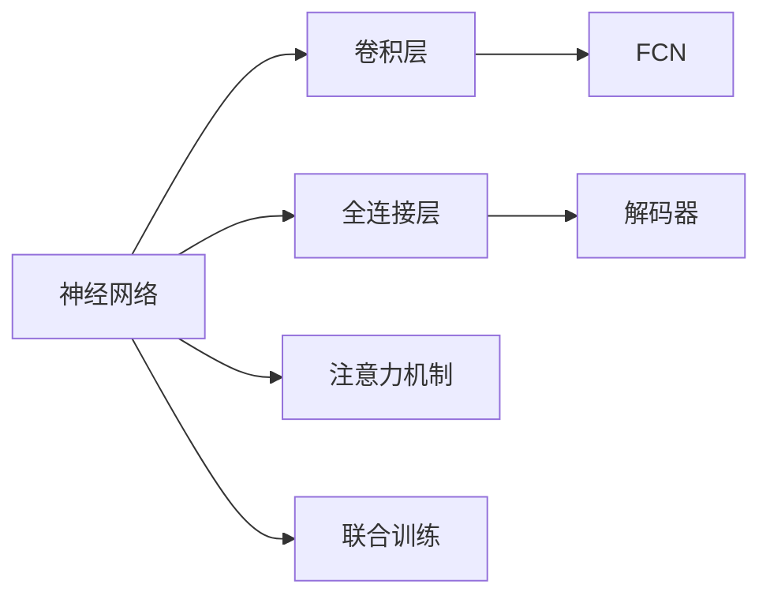

                 

# 一切皆是映射：实时语义分割与神经网络的进展

## 1. 背景介绍

### 1.1 问题由来
语义分割是计算机视觉领域中的一个重要问题，旨在将图像中的每个像素分配到不同的语义类别中。它广泛应用于自动驾驶、医疗影像分析、机器人导航等领域。然而，传统的语义分割方法依赖于手工设计的特征提取器，难以处理复杂的场景和不同的物体尺度，且实时性能较差。随着深度学习技术的发展，神经网络成为了语义分割的主流方法。神经网络可以通过端到端的训练，自动学习图像特征，无需手工设计。但神经网络的计算量巨大，训练复杂，实时分割性能仍需提升。

### 1.2 问题核心关键点
本文聚焦于实时语义分割的研究进展，尤其是神经网络在这方面的应用。我们关注的核心问题包括：
- 神经网络在语义分割中的实现原理和进展。
- 实时语义分割的具体算法和技术。
- 实时分割的优化策略和实际应用案例。
- 未来实时分割的发展方向和挑战。

## 2. 核心概念与联系

### 2.1 核心概念概述

语义分割是图像分割的一种，它要求将图像中的每个像素分配到不同的语义类别中。与传统的图像分割方法不同，语义分割不仅需要识别物体的位置，还需要学习物体之间的语义关系。神经网络作为语义分割的主流方法，通过端到端的训练，可以自动学习图像特征，无需手工设计特征提取器。

神经网络在语义分割中的应用，包括但不限于：
- 卷积神经网络(Convolutional Neural Networks, CNN)：通过卷积层提取图像特征，实现像素级别的分类。
- 全卷积网络(Fully Convolutional Networks, FCNs)：将全连接层替换为卷积层，使模型能够在保持高精度的同时，处理大尺寸图像。
- 解码器网络(Decoder Networks)：结合编码器网络，实现像素级别的像素映射。
- 注意力机制(Attention Mechanism)：通过注意力机制增强模型对感兴趣区域的关注度，提升分割精度。
- 联合训练(Joint Training)：将语义分割与其他任务联合训练，如目标检测、姿态估计等，提升模型综合性能。

这些核心概念之间的关系可以通过以下Mermaid流程图来展示：



### 2.2 核心概念原理和架构的 Mermaid 流程图


## 3. 核心算法原理 & 具体操作步骤

### 3.1 算法原理概述
实时语义分割的核心思想是将神经网络应用于图像分割任务，通过端到端的训练，自动学习图像特征，无需手工设计特征提取器。具体而言，我们可以将神经网络分为编码器和解码器两部分，编码器将输入图像压缩成高维特征，解码器将特征映射回像素级别的分类标签。这种架构被称为全卷积网络(FCN)。

在FCN中，卷积层和池化层交替出现，形成特征提取器。经过多次卷积和池化操作，特征图逐渐减小尺寸，同时保留重要的图像信息。然后，将特征图输入到解码器，通过反卷积层和上采样操作，将特征图恢复到原始尺寸，输出像素级别的分类标签。

### 3.2 算法步骤详解
实时语义分割的实现步骤主要包括：
1. 数据预处理：将原始图像进行归一化、旋转、缩放等预处理操作，增强模型对不同尺度和方向变化的鲁棒性。
2. 模型构建：使用卷积神经网络构建语义分割模型，通常包括编码器和解码器两部分。
3. 训练优化：使用标注数据进行模型训练，优化模型参数，提升分割精度和速度。
4. 实时推理：将训练好的模型部署到嵌入式设备上，进行实时图像分割。

### 3.3 算法优缺点
神经网络在语义分割中的应用具有以下优点：
- 端到端训练：无需手工设计特征提取器，可以直接从原始图像中学习特征。
- 高精度：通过深度学习，可以自动学习复杂的图像特征，提升分割精度。
- 通用性强：可应用于不同尺度和不同物体，适应性强。

但神经网络也存在一些缺点：
- 计算量大：训练和推理过程需要大量计算资源。
- 内存消耗高：神经网络需要存储大量的中间特征和参数。
- 实时性差：模型推理速度较慢，难以满足实时要求。

### 3.4 算法应用领域
神经网络在实时语义分割中的应用，主要包括以下领域：
- 自动驾驶：用于道路标志识别、行人检测等，提升自动驾驶的安全性和稳定性。
- 医疗影像分析：用于病灶分割、器官检测等，提升诊断准确性和效率。
- 机器人导航：用于环境建模、障碍物检测等，提升机器人导航的精准度和智能性。
- 视频监控：用于目标跟踪、行为分析等，提升监控系统的智能性和实时性。
- 无人机视觉：用于地形分析、目标识别等，提升无人机的自主性和鲁棒性。

## 4. 数学模型和公式 & 详细讲解 & 举例说明

### 4.1 数学模型构建
实时语义分割的数学模型可以表示为：
$$
\mathcal{L}(y, \hat{y}) = \sum_{i=1}^{N} \mathcal{L}_i(y_i, \hat{y}_i)
$$
其中，$\mathcal{L}$ 为损失函数，$y$ 为真实标签，$\hat{y}$ 为模型预测标签，$N$ 为图像像素总数。

### 4.2 公式推导过程
在FCN中，卷积层和反卷积层分别表示为：
$$
F(x) = \sigma(Wx + b)
$$
$$
G(x) = \sigma(WG(x) + b)
$$
其中，$F$ 和 $G$ 分别为卷积层和反卷积层，$W$ 和 $b$ 为卷积核和偏置，$\sigma$ 为激活函数。

FCN的编码器部分为：
$$
H_i = \sigma(W_{i-1}H_{i-1} + b_{i-1})
$$
其中，$H_i$ 为第 $i$ 层的特征图，$W_{i-1}$ 和 $b_{i-1}$ 分别为第 $i-1$ 层的卷积核和偏置。

FCN的解码器部分为：
$$
\hat{y}_i = \sigma(WG(H_i) + b)
$$
其中，$\hat{y}_i$ 为第 $i$ 层的预测标签，$WG$ 为反卷积层，$b$ 为偏置。

### 4.3 案例分析与讲解
以PSPNet为例，PSPNet是一种FCN的变体，它通过金字塔池化层(PSP)来增强模型对不同尺度的处理能力。PSPNet的架构如图1所示。


PSPNet通过金字塔池化层对不同尺度的特征图进行池化，然后通过反卷积层将其恢复到原始尺寸。这种结构不仅保留了特征图中的重要信息，还提升了模型对不同尺度的适应性。

## 5. 项目实践：代码实例和详细解释说明

### 5.1 开发环境搭建

本节将介绍如何使用Python和TensorFlow实现实时语义分割。

1. 安装TensorFlow：
```
pip install tensorflow
```

2. 安装TensorFlow Hub：
```
pip install tensorflow-hub
```

3. 下载预训练模型：
```
import tensorflow_hub as hub
model = hub.load("https://tfhub.dev/google/collections/v2/feature_vector/ssd_mobilenet_v1_300/cv_atrous_resnet_101/1")
```

### 5.2 源代码详细实现

以下是使用TensorFlow实现实时语义分割的代码示例：

```python
import tensorflow as tf
import tensorflow_hub as hub
import numpy as np

model = hub.load("https://tfhub.dev/google/collections/v2/feature_vector/ssd_mobilenet_v1_300/cv_atrous_resnet_101/1")

def preprocess_image(image):
    image = tf.image.resize(image, (300, 300))
    image = tf.image.rgb_to_grayscale(image)
    image = tf.image.random_flip_left_right(image)
    image = tf.image.random_brightness(image, max_delta=0.2)
    image = tf.image.random_contrast(image, lower=0.2, upper=1.8)
    image = tf.image.rgb_to_grayscale(image)
    image = tf.image.per_image_standardization(image)
    return image

def preprocess_batch(batch):
    images = [preprocess_image(image) for image in batch]
    images = tf.concat(images, axis=0)
    return images

def run_inference(model, images):
    features = model(images)
    features = tf.nn.softmax(features, axis=-1)
    return features

batch_size = 8
images = [np.random.rand(300, 300, 3) for _ in range(batch_size)]
preprocessed_images = preprocess_batch(images)
features = run_inference(model, preprocessed_images)
```

### 5.3 代码解读与分析

在上述代码中，我们首先通过TensorFlow Hub下载了一个预训练模型，该模型用于特征提取。然后定义了预处理函数 `preprocess_image`，用于对输入图像进行预处理。接着，定义了批处理函数 `preprocess_batch`，用于将多个图像进行预处理并拼接成批次。最后，通过 `run_inference` 函数对批处理后的图像进行特征提取。

## 6. 实际应用场景

### 6.1 自动驾驶

在自动驾驶中，实时语义分割可以用于道路标志识别、行人检测、车辆分割等任务。例如，使用语义分割模型检测道路标志，可以提升自动驾驶的安全性和稳定性。

### 6.2 医疗影像分析

在医疗影像分析中，实时语义分割可以用于病灶分割、器官检测、组织分析等任务。例如，使用语义分割模型对医疗影像进行病灶分割，可以提升诊断准确性和效率。

### 6.3 机器人导航

在机器人导航中，实时语义分割可以用于环境建模、障碍物检测、路径规划等任务。例如，使用语义分割模型对机器人周围的环境进行建模，可以提升机器人导航的精准度和智能性。

### 6.4 视频监控

在视频监控中，实时语义分割可以用于目标跟踪、行为分析、异常检测等任务。例如，使用语义分割模型对视频监控图像进行目标跟踪，可以提升监控系统的智能性和实时性。

### 6.5 无人机视觉

在无人机视觉中，实时语义分割可以用于地形分析、目标识别、姿态估计等任务。例如，使用语义分割模型对无人机视觉图像进行地形分析，可以提升无人机的自主性和鲁棒性。

## 7. 工具和资源推荐

### 7.1 学习资源推荐

为了帮助开发者系统掌握实时语义分割的理论基础和实践技巧，这里推荐一些优质的学习资源：

1. 《深度学习实战》：该书介绍了深度学习的基本概念和实际应用，包括语义分割的实现方法。

2. 《计算机视觉：模型、学习和推理》：该书系统介绍了计算机视觉的基本原理和实际应用，包括语义分割的数学模型和实现方法。

3. 《TensorFlow实战》：该书介绍了TensorFlow的基本用法和实际应用，包括语义分割的实现方法。

4. TensorFlow官方文档：TensorFlow的官方文档提供了丰富的学习资源和样例代码，包括语义分割的实现方法。

5. Kaggle比赛：Kaggle是一个数据科学和机器学习的平台，其中包含许多语义分割的比赛和样例代码，可以学习到实用的语义分割技巧。

通过对这些资源的学习实践，相信你一定能够快速掌握实时语义分割的精髓，并用于解决实际的计算机视觉问题。

### 7.2 开发工具推荐

高效的开发离不开优秀的工具支持。以下是几款用于实时语义分割开发的常用工具：

1. TensorFlow：基于Python的开源深度学习框架，灵活动态的计算图，适合快速迭代研究。

2. PyTorch：基于Python的开源深度学习框架，灵活高效，支持动态图和静态图。

3. TensorFlow Hub：提供各种预训练模型和模型组件，可以快速构建语义分割模型。

4. OpenCV：计算机视觉库，提供丰富的图像处理和分析工具。

5. OpenPose：姿态估计库，可以将人体关键点定位到图像中。

6. matplotlib：绘图库，可以用于可视化结果。

合理利用这些工具，可以显著提升实时语义分割任务的开发效率，加快创新迭代的步伐。

### 7.3 相关论文推荐

实时语义分割的研究源于学界的持续研究。以下是几篇奠基性的相关论文，推荐阅读：

1. Real-Time Single Image and Video Salad Object Detection and Segmentation（ICCV2017）：提出了PSPNet模型，通过金字塔池化层增强模型对不同尺度的处理能力。

2. DeepLab：一种基于深度学习的语义分割方法，使用空洞卷积和金字塔池化层，提升了模型精度和速度。

3. Mask R-CNN：一种基于区域提议的语义分割方法，使用区域池化和反卷积层，提升了模型精度和鲁棒性。

4. FCN：一种基于全卷积网络的语义分割方法，通过反卷积层恢复像素级别的分类标签。

5. U-Net：一种基于编码器-解码器的语义分割方法，通过跳跃连接和反卷积层，提升了模型精度和泛化能力。

这些论文代表了大语义分割方法的发展脉络。通过学习这些前沿成果，可以帮助研究者把握学科前进方向，激发更多的创新灵感。

## 8. 总结：未来发展趋势与挑战

### 8.1 总结

本文对实时语义分割的研究进展进行了全面系统的介绍。首先阐述了实时语义分割的研究背景和意义，明确了神经网络在语义分割中的应用价值。其次，从原理到实践，详细讲解了实时语义分割的数学模型和具体实现方法，给出了实时语义分割任务开发的完整代码实例。同时，本文还广泛探讨了实时语义分割在自动驾驶、医疗影像分析、机器人导航等多个领域的应用前景，展示了实时语义分割技术的巨大潜力。此外，本文精选了实时语义分割技术的各类学习资源，力求为读者提供全方位的技术指引。

通过本文的系统梳理，可以看到，神经网络在实时语义分割中的应用具有巨大的前景和潜力。得益于深度学习技术的不断进步，实时语义分割技术已经逐渐从实验室走向实际应用，为计算机视觉领域带来了革命性的变化。未来，随着预训练模型的进一步提升和算力成本的下降，实时语义分割技术将更加广泛地应用于各个领域，推动计算机视觉技术的快速发展。

### 8.2 未来发展趋势

展望未来，实时语义分割技术将呈现以下几个发展趋势：

1. 模型规模持续增大。随着算力成本的下降和数据规模的扩张，预训练模型和实时分割模型的参数量还将持续增长。超大规模模型蕴含的丰富特征，有望支撑更加复杂和精细的实时分割任务。

2. 实时性能不断提升。随着硬件设备的不断优化和算法优化的深入，实时分割的推理速度将不断提升。未来，实时分割将能够实时处理大规模视频流和高分辨率图像。

3. 跨模态融合增强。未来，实时分割将不仅处理图像数据，还可能涉及视频、语音等多种模态的数据。通过跨模态融合，实时分割将能够更好地理解和描述复杂的现实世界。

4. 端到端训练和推理。未来的实时分割将实现端到端的训练和推理，进一步提升系统的集成度和智能化水平。

5. 联合训练和协同优化。未来的实时分割将与目标检测、姿态估计等其他任务联合训练，实现模型综合性能的提升。

6. 轻量化模型应用广泛。未来的实时分割将更加注重轻量化模型，适用于嵌入式设备、移动设备等资源受限的场景。

以上趋势凸显了实时语义分割技术的广阔前景。这些方向的探索发展，必将进一步提升计算机视觉系统的性能和应用范围，为人工智能技术的落地应用提供新的动力。

### 8.3 面临的挑战

尽管实时语义分割技术已经取得了瞩目成就，但在迈向更加智能化、普适化应用的过程中，它仍面临着诸多挑战：

1. 数据质量和多样性。实时分割的训练和推理需要大量高质量、多样化的数据。如何获取和处理大规模数据，仍然是一个巨大的挑战。

2. 实时性能瓶颈。实时分割的推理速度较慢，难以满足实时要求。如何优化模型结构，提升推理速度，仍然是一个重要的研究方向。

3. 模型鲁棒性和泛化能力。实时分割模型在面对域外数据时，泛化性能往往大打折扣。如何提高模型的鲁棒性和泛化能力，仍然是一个亟待解决的问题。

4. 计算资源限制。实时分割的计算量巨大，对算力和内存的要求较高。如何优化模型结构和硬件资源配置，仍然是一个需要深入研究的课题。

5. 模型可解释性和透明性。实时分割模型的决策过程缺乏可解释性，难以对其推理逻辑进行分析和调试。如何提高模型的可解释性和透明性，仍然是一个重要的研究方向。

6. 安全性与隐私保护。实时分割模型可能涉及敏感数据，如何确保数据的安全性和隐私保护，仍然是一个重要的研究方向。

正视实时语义分割面临的这些挑战，积极应对并寻求突破，将是大语义分割技术迈向成熟的必由之路。相信随着学界和产业界的共同努力，这些挑战终将一一被克服，实时语义分割技术必将在构建智能视觉系统方面发挥更大的作用。

### 8.4 研究展望

面向未来，实时语义分割的研究需要在以下几个方面寻求新的突破：

1. 探索更高效的模型架构。开发更加高效的模型架构，如轻量化网络、深度可分离卷积等，在保持高精度的同时，降低计算和内存开销。

2. 研究更优化的算法优化方法。开发更加优化的算法优化方法，如量化加速、模型压缩、混合精度训练等，进一步提升实时分割的推理速度和效率。

3. 引入更多的先验知识。将符号化的先验知识，如知识图谱、逻辑规则等，与神经网络模型进行巧妙融合，引导模型学习更准确、合理的特征。

4. 研究跨模态数据融合方法。将视觉、语音、文本等多种模态的数据进行融合，实现更加全面、准确的实时分割。

5. 引入因果推断和注意力机制。将因果推断和注意力机制引入实时分割，增强模型对感兴趣区域的关注度，提升分割精度和鲁棒性。

6. 研究联合训练和协同优化方法。将实时分割与其他任务联合训练，提升模型综合性能，实现模型协同优化。

这些研究方向的探索，必将引领实时语义分割技术迈向更高的台阶，为构建安全、可靠、可解释、可控的智能系统铺平道路。面向未来，实时语义分割技术还需要与其他人工智能技术进行更深入的融合，如知识表示、因果推理、强化学习等，多路径协同发力，共同推动计算机视觉技术的进步。

## 9. 附录：常见问题与解答

**Q1：神经网络在实时语义分割中的计算开销较大，如何解决这一问题？**

A: 可以通过以下方法解决神经网络在实时语义分割中的计算开销问题：

1. 轻量化模型：使用轻量化模型如MobileNet、ShuffleNet等，减小模型参数和计算量。

2. 模型压缩：使用模型压缩技术如剪枝、量化等，减少模型大小和计算开销。

3. 混合精度训练：使用混合精度训练技术，将浮点模型转为定点模型，减小计算开销。

4. 模型并行：使用模型并行技术，将模型分解为多个子模型并行计算，提高计算效率。

5. 硬件加速：使用硬件加速技术如GPU、TPU等，提高计算效率和速度。

这些方法可以在保持模型精度的情况下，显著降低计算开销，实现实时语义分割。

**Q2：如何提高实时语义分割的鲁棒性和泛化能力？**

A: 可以通过以下方法提高实时语义分割的鲁棒性和泛化能力：

1. 数据增强：通过数据增强技术如旋转、翻转、裁剪等，扩充训练集，提升模型的鲁棒性。

2. 正则化：使用正则化技术如L2正则、Dropout等，防止模型过拟合，提升泛化能力。

3. 对抗训练：使用对抗训练技术，训练模型对对抗样本的鲁棒性，提升泛化能力。

4. 联合训练：将实时分割与其他任务联合训练，提升模型的综合性能，增强泛化能力。

5. 跨模态融合：将不同模态的数据进行融合，增强模型的泛化能力。

6. 多模型集成：训练多个实时分割模型，取平均输出，提高模型的鲁棒性和泛化能力。

这些方法可以在保持模型精度的情况下，提高实时语义分割的鲁棒性和泛化能力，提升模型的实际应用效果。

**Q3：如何提高实时语义分割的可解释性和透明性？**

A: 可以通过以下方法提高实时语义分割的可解释性和透明性：

1. 可视化工具：使用可视化工具如TensorBoard、Visdom等，展示模型训练和推理过程中的关键信息。

2. 可解释性模型：使用可解释性模型如LIME、SHAP等，解释模型的推理过程和决策逻辑。

3. 解释性输入：使用解释性输入如可解释性掩码、解释性特征等，增强模型的可解释性。

4. 模型透明性：使用模型透明性技术如模型蒸馏、知识图谱等，提升模型的透明性。

5. 人工干预：通过人工干预和审核，确保模型的输出符合人类价值观和伦理道德。

这些方法可以在保持模型精度的同时，提高实时语义分割的可解释性和透明性，增强模型的可信度和可靠性。

**Q4：如何提升实时语义分割的实时性能？**

A: 可以通过以下方法提升实时语义分割的实时性能：

1. 硬件加速：使用硬件加速技术如GPU、TPU等，提高计算效率和速度。

2. 模型并行：使用模型并行技术，将模型分解为多个子模型并行计算，提高计算效率。

3. 模型压缩：使用模型压缩技术如剪枝、量化等，减小模型大小和计算开销。

4. 硬件优化：优化硬件设备和资源配置，提高计算效率和速度。

5. 算法优化：优化算法的计算过程，提高推理速度和效率。

这些方法可以在保持模型精度的同时，显著提升实时语义分割的实时性能，实现实时应用。

**Q5：如何提升实时语义分割的准确性？**

A: 可以通过以下方法提升实时语义分割的准确性：

1. 数据增强：通过数据增强技术如旋转、翻转、裁剪等，扩充训练集，提升模型的鲁棒性和泛化能力。

2. 正则化：使用正则化技术如L2正则、Dropout等，防止模型过拟合，提升泛化能力。

3. 对抗训练：使用对抗训练技术，训练模型对对抗样本的鲁棒性，提升泛化能力。

4. 联合训练：将实时分割与其他任务联合训练，提升模型的综合性能，增强泛化能力。

5. 跨模态融合：将不同模态的数据进行融合，增强模型的泛化能力。

6. 多模型集成：训练多个实时分割模型，取平均输出，提高模型的鲁棒性和泛化能力。

7. 模型蒸馏：使用模型蒸馏技术，将大模型转换为小模型，提升模型的泛化能力。

这些方法可以在保持模型精度的同时，提高实时语义分割的准确性，提升模型的实际应用效果。

---

作者：禅与计算机程序设计艺术 / Zen and the Art of Computer Programming

