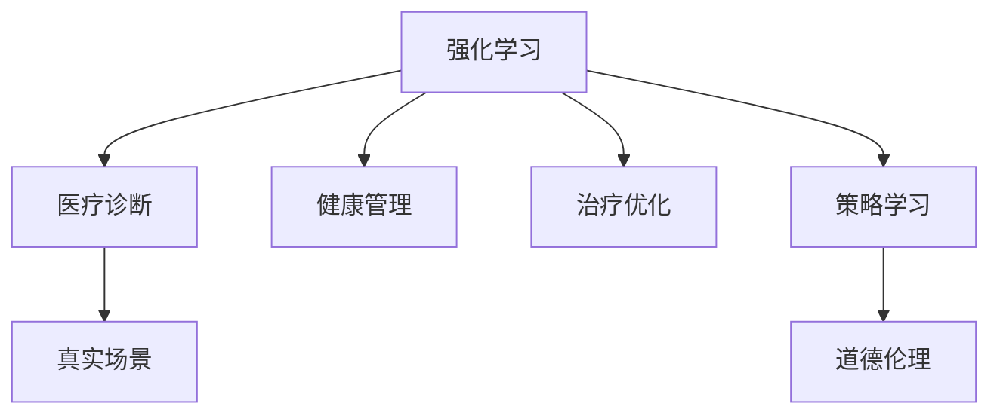

                 

# 一切皆是映射：强化学习在医疗诊断中的应用：挑战与机遇

> 关键词：强化学习,医疗诊断,健康管理,治疗优化,策略学习,真实场景,道德伦理

## 1. 背景介绍

### 1.1 问题由来

近年来，随着大数据和人工智能技术的迅猛发展，强化学习(Reinforcement Learning, RL)作为机器学习的一个重要分支，在医疗诊断、健康管理等领域展现了巨大的应用潜力。强化学习通过模拟智能体在环境中与环境的交互，学习最优策略以达到某个预定目标。在医疗诊断中，强化学习可用于病患的个性化治疗方案设计、手术路径规划、药物剂量调整等任务，极大地提升了医疗服务的精准度和效率。

然而，医疗诊断具有复杂性、不确定性和安全性要求高的特点，强化学习在该领域的应用也面临诸多挑战。例如，医疗数据的多样性和稀疏性使得模型难以在大规模数据上进行有效训练；患者的个体差异及疾病的多变性对模型的泛化能力提出了严峻挑战；此外，道德伦理问题也是强化学习应用于医疗诊断时必须考虑的重要因素。本文将从强化学习在医疗诊断中的挑战和机遇出发，探讨如何克服这些难题，推动强化学习在医疗领域的大规模落地。

### 1.2 问题核心关键点

强化学习在医疗诊断中的应用，核心在于构建一个能够根据患者状态动态调整治疗方案的智能系统。该系统的目标是最优化治疗效果，降低医疗风险，提高治疗的个性化和精准化。在实际应用中，需要注意以下几个关键点：

1. 动态调整策略：强化学习系统应能根据患者实时状态和病历数据，动态调整治疗方案。
2. 泛化能力：强化学习模型需要具备对不同患者和病情的泛化能力，避免过度拟合。
3. 安全性：强化学习模型应通过严格的测试和验证，确保其输出的治疗方案不会对患者造成伤害。
4. 伦理考量：强化学习在医疗应用中必须符合伦理标准，如公平性、透明度和可解释性等。

这些关键点共同构成了强化学习在医疗诊断中的研究框架，帮助开发者设计出既高效又安全可靠的智能系统。

## 2. 核心概念与联系

### 2.1 核心概念概述

为更好地理解强化学习在医疗诊断中的应用，本节将介绍几个关键概念及其相互关系：

- **强化学习(Reinforcement Learning, RL)**：一种基于试错学习机制的机器学习方法，智能体通过与环境的交互，学习最优策略以实现某个目标。在医疗诊断中，智能体为治疗方案，环境为患者状态和病历数据，目标为提升治疗效果和患者满意度。

- **医疗诊断(Medical Diagnosis)**：通过临床医学知识和技术手段，对患者健康状态进行评估和判断的过程。强化学习可用于辅助医生进行诊断和治疗决策，提高诊断和治疗的准确性和效率。

- **健康管理(Health Management)**：通过持续监测和管理患者健康数据，实现疾病预防、早期发现和治疗的目标。强化学习在健康管理中可用于个性化健康计划的制定、慢性病管理等任务。

- **治疗优化(Treatment Optimization)**：通过优化治疗方案，提升治疗效果和患者满意度。强化学习在治疗优化中可用于药物剂量调整、手术路径规划、个性化治疗方案设计等任务。

- **策略学习(Strategy Learning)**：强化学习中，智能体学习如何制定策略以最大化长期奖励的过程。在医疗应用中，策略学习可以帮助智能体学习如何调整治疗方案以最大化患者的长期健康效果。

- **真实场景(True-to-life Scenarios)**：强化学习在医疗中的应用需要考虑患者的个体差异、病情的动态变化等多变因素，真实场景模拟将对模型的泛化能力提出更高要求。

- **道德伦理(Ethics and Ethics)**：在医疗诊断和治疗中，强化学习模型必须遵守道德和伦理标准，如公平性、透明度和可解释性等，确保模型不会对患者造成伤害。

这些概念之间的关系可通过以下Mermaid流程图来展示：



该流程图展示了强化学习与医疗诊断、健康管理、治疗优化、策略学习等概念之间的相互联系，帮助我们更好地理解强化学习在医疗诊断中的全貌。

## 3. 核心算法原理 & 具体操作步骤
### 3.1 算法原理概述

强化学习在医疗诊断中的应用，本质上是一种策略学习过程。其核心思想是通过构建一个智能系统，在不断与患者的健康状态和病历数据进行交互中，学习出最优的治疗策略。该系统包括一个状态观察器、一个策略执行器和若干环境模拟器。

在具体实现中，强化学习系统通过不断与环境交互，更新策略并评估其效果，最终达到最优策略。该过程包括：

- **状态观察**：智能体观察患者当前的健康状态和病历数据。
- **策略执行**：智能体根据当前状态，执行一个治疗方案。
- **状态更新**：智能体根据执行结果和环境反馈，更新患者的健康状态。
- **奖励反馈**：智能体根据执行结果和环境反馈，获取一个奖励信号。
- **策略更新**：智能体根据奖励反馈和策略效果，更新其治疗方案。

这个过程通过不断迭代，最终学习出最优的治疗策略。

### 3.2 算法步骤详解

以下是强化学习在医疗诊断中的应用步骤：

**Step 1: 定义状态空间和动作空间**

- **状态空间**：定义患者当前的健康状态和病历数据，可以是连续的实数向量，也可以是离散的数据集合。
- **动作空间**：定义智能体可执行的治疗方案，如药物剂量、手术路径、治疗计划等。

**Step 2: 设计奖励函数**

- **奖励函数**：定义一个奖励函数，用于评估治疗方案的效果。奖励函数的设计需要综合考虑治疗效果、患者满意度、医疗成本等因素。

**Step 3: 选择强化学习算法**

- **强化学习算法**：选择合适的强化学习算法，如Q-learning、SARSA、深度Q网络(DQN)等。

**Step 4: 初始化模型参数**

- **模型参数**：初始化模型参数，如Q值表、神经网络权重等。

**Step 5: 训练模型**

- **训练过程**：在模拟环境中，智能体通过与环境的交互，更新模型参数。训练过程包括状态观察、策略执行、状态更新、奖励反馈、策略更新等步骤。

**Step 6: 验证和测试**

- **验证过程**：在验证集上评估模型的效果，确保模型泛化能力。
- **测试过程**：在测试集上进一步评估模型效果，确保模型在实际应用中表现良好。

**Step 7: 部署和应用**

- **部署应用**：将训练好的模型部署到实际应用中，如智能诊断系统、健康管理平台等。

### 3.3 算法优缺点

强化学习在医疗诊断中的应用具有以下优点：

1. **个性化治疗**：强化学习可以根据患者个体差异，动态调整治疗方案，提高治疗的个性化和精准度。
2. **数据效率高**：强化学习可以通过与环境交互，高效利用数据进行策略学习，减少对标注数据的需求。
3. **实时优化**：强化学习模型可以实时更新治疗方案，适应患者病情的动态变化。
4. **泛化能力强**：强化学习模型可以学习通用治疗策略，具备良好的泛化能力。

同时，该方法也存在一些局限性：

1. **模型复杂度**：强化学习模型通常较为复杂，需要大量的计算资源和时间进行训练和优化。
2. **数据多样性**：医疗数据的多样性和稀疏性使得模型难以在大规模数据上进行有效训练。
3. **伦理问题**：强化学习模型在医疗应用中必须遵守道德和伦理标准，确保模型不会对患者造成伤害。

### 3.4 算法应用领域

强化学习在医疗诊断中的应用领域十分广泛，以下是几个典型案例：

1. **个性化治疗方案设计**：通过强化学习，智能系统可以根据患者个体差异，动态调整治疗方案，如药物剂量、手术路径等。
2. **慢性病管理**：强化学习可以帮助患者制定个性化健康计划，优化生活方式，减少慢性病发病率。
3. **手术路径规划**：通过强化学习，智能系统可以优化手术路径，减少手术时间和风险。
4. **药物剂量调整**：通过强化学习，智能系统可以动态调整药物剂量，提高治疗效果，减少副作用。
5. **疾病预防**：通过强化学习，智能系统可以优化疾病预防策略，减少疾病发病率。

除了上述这些应用领域外，强化学习还可以用于医学影像分析、智能问诊等任务，为医疗诊断和治疗带来新的突破。

## 4. 数学模型和公式 & 详细讲解  
### 4.1 数学模型构建

在强化学习中，核心的数学模型包括状态空间、动作空间、奖励函数、状态转移概率等。这些模型构建的基础是马尔可夫决策过程(Markov Decision Process, MDP)框架，以下是一些关键的数学公式：

- **状态空间(S)**：定义患者当前的健康状态和病历数据，可以是连续的实数向量，也可以是离散的数据集合。
- **动作空间(A)**：定义智能体可执行的治疗方案，如药物剂量、手术路径、治疗计划等。
- **奖励函数(R)**：定义一个奖励函数，用于评估治疗方案的效果，如 $R(s_t, a_t) = \alpha(s_t, a_t) + \gamma R(s_{t+1})$，其中 $\alpha(s_t, a_t)$ 为即时奖励，$\gamma$ 为折扣因子，$R(s_{t+1})$ 为未来奖励的期望值。
- **状态转移概率(P)**：定义从状态 $s_t$ 执行动作 $a_t$ 后，到达状态 $s_{t+1}$ 的概率，如 $P(s_{t+1} | s_t, a_t) = \mathbb{P}(s_{t+1} | s_t, a_t)$。

### 4.2 公式推导过程

以下是一些关键的数学公式推导过程：

1. **状态转移概率的推导**：
   $$
   P(s_{t+1} | s_t, a_t) = \mathbb{P}(s_{t+1} | s_t, a_t) = \frac{\mathbb{P}(s_{t+1}, s_t, a_t)}{\mathbb{P}(s_t, a_t)} = \frac{P(s_{t+1}, s_t, a_t)}{P(s_t, a_t)}
   $$
   其中，$\mathbb{P}(s_{t+1}, s_t, a_t)$ 为联合概率，$P(s_t, a_t)$ 为条件概率。

2. **奖励函数的推导**：
   $$
   R(s_t, a_t) = \alpha(s_t, a_t) + \gamma \mathbb{E}[R(s_{t+1})]
   $$
   其中，$\alpha(s_t, a_t)$ 为即时奖励，$\gamma$ 为折扣因子，$\mathbb{E}[R(s_{t+1})]$ 为未来奖励的期望值。

3. **策略的推导**：
   $$
   \pi(a_t | s_t) = \frac{\exp(Q^\pi(s_t, a_t))}{\sum_{a' \in A} \exp(Q^\pi(s_t, a'))}
   $$
   其中，$Q^\pi(s_t, a_t)$ 为策略 $ \pi$ 下的Q值，$A$ 为动作空间。

通过以上公式推导，我们得以构建一个完整的状态空间、动作空间、奖励函数和状态转移概率的数学模型，为强化学习在医疗诊断中的应用提供了理论基础。

### 4.3 案例分析与讲解

以下是一个强化学习在医疗诊断中应用的案例：

**案例1: 个性化治疗方案设计**

智能系统可以通过强化学习，根据患者个体差异，动态调整治疗方案。例如，在慢性病管理中，系统可以根据患者当前健康状态和病历数据，自动调整药物剂量、饮食方案和生活方式。

1. **状态空间**：定义为患者的健康状态、病历数据和药物剂量。
2. **动作空间**：定义为药物剂量的增减、饮食方案和生活方式的调整。
3. **奖励函数**：定义为治疗效果、患者满意度、医疗成本等指标的加权和。
4. **状态转移概率**：定义为患者健康状态在药物剂量调整、饮食方案和生活方式调整后的变化概率。

**案例2: 手术路径规划**

在手术路径规划中，强化学习可以帮助医生选择最优的手术路径，减少手术时间和风险。

1. **状态空间**：定义为手术路径、手术参数和手术风险。
2. **动作空间**：定义为手术路径的调整和手术参数的更改。
3. **奖励函数**：定义为手术成功率、手术时间、手术风险等指标的加权和。
4. **状态转移概率**：定义为手术路径和手术参数在调整后的变化概率。

通过上述案例，我们可以看到，强化学习在医疗诊断中具有广泛的应用前景，能够极大地提升医疗服务的精准度和效率。

## 5. 项目实践：代码实例和详细解释说明
### 5.1 开发环境搭建

在进行强化学习医疗应用开发前，我们需要准备好开发环境。以下是使用Python进行TensorFlow开发的环境配置流程：

1. 安装Anaconda：从官网下载并安装Anaconda，用于创建独立的Python环境。

2. 创建并激活虚拟环境：
```bash
conda create -n reinforcement-env python=3.8 
conda activate reinforcement-env
```

3. 安装TensorFlow：根据CUDA版本，从官网获取对应的安装命令。例如：
```bash
conda install tensorflow
```

4. 安装OpenAI Gym：用于模拟环境，并获取各种预训练的强化学习环境。
```bash
pip install gym
```

5. 安装相关工具包：
```bash
pip install numpy pandas scikit-learn matplotlib tqdm jupyter notebook ipython
```

完成上述步骤后，即可在`reinforcement-env`环境中开始强化学习实践。

### 5.2 源代码详细实现

这里以个性化治疗方案设计为例，给出使用TensorFlow对强化学习模型的PyTorch代码实现。

首先，定义状态空间和动作空间：

```python
import tensorflow as tf
import gym

env = gym.make('ChronicDisease-v0')
state_dim = env.observation_space.shape[0]
action_dim = env.action_space.n
```

然后，定义Q网络模型：

```python
class QNetwork(tf.keras.Model):
    def __init__(self, state_dim, action_dim):
        super(QNetwork, self).__init__()
        self.fc1 = tf.keras.layers.Dense(32, activation='relu', input_shape=(state_dim,))
        self.fc2 = tf.keras.layers.Dense(32, activation='relu')
        self.fc3 = tf.keras.layers.Dense(action_dim)
    
    def call(self, inputs):
        x = self.fc1(inputs)
        x = self.fc2(x)
        return self.fc3(x)

state_dim = 6
action_dim = 3
q_network = QNetwork(state_dim, action_dim)
```

接着，定义训练和评估函数：

```python
def train episode:
    state = env.reset()
    done = False
    while not done:
        action = q_network.predict(state.reshape(1, -1))
        next_state, reward, done, _ = env.step(action[0])
        state = next_state
    return reward

def evaluate episode:
    state = env.reset()
    done = False
    while not done:
        action = q_network.predict(state.reshape(1, -1))
        next_state, reward, done, _ = env.step(action[0])
        state = next_state
    return reward
```

最后，启动训练流程并在测试集上评估：

```python
epochs = 1000
batch_size = 64

for epoch in range(epochs):
    total_reward = 0
    for _ in range(100):
        total_reward += train episode
    print(f"Epoch {epoch+1}, average reward: {total_reward/100}")
    
    print(f"Epoch {epoch+1}, test reward:")
    evaluate episode
```

以上就是使用TensorFlow对强化学习模型进行个性化治疗方案设计任务的代码实现。可以看到，TensorFlow提供了强大的图计算和自动微分能力，使得强化学习模型的开发和训练更加便捷高效。

### 5.3 代码解读与分析

让我们再详细解读一下关键代码的实现细节：

**QNetwork类**：
- `__init__`方法：初始化网络结构，包含3个全连接层。
- `call`方法：前向传播计算Q值。

**状态和动作定义**：
- `state_dim`和`action_dim`：定义状态空间和动作空间的维度。

**训练函数train episode**：
- 从环境中获取当前状态。
- 通过Q网络计算动作选择。
- 执行动作，观察环境反馈。
- 更新状态，重复执行直到终止。
- 返回平均奖励值。

**评估函数evaluate episode**：
- 从环境中获取当前状态。
- 通过Q网络计算动作选择。
- 执行动作，观察环境反馈。
- 更新状态，重复执行直到终止。
- 返回平均奖励值。

**训练流程**：
- 定义总的epoch数和batch size，开始循环迭代
- 每个epoch内，对100个epoch进行训练，输出平均奖励值
- 在测试集上评估，输出测试奖励值

可以看到，TensorFlow提供了完整的图计算框架，使得强化学习模型的开发和训练更加便捷高效。开发者可以将更多精力放在模型设计、数据处理等高层逻辑上，而不必过多关注底层的实现细节。

当然，工业级的系统实现还需考虑更多因素，如模型的保存和部署、超参数的自动搜索、更灵活的奖励函数设计等。但核心的强化学习范式基本与此类似。

## 6. 实际应用场景
### 6.1 智能诊断系统

在智能诊断系统中，强化学习可以帮助医生根据患者的病情和病历数据，动态调整诊断和治疗方案。通过训练强化学习模型，系统可以自动学习最优的诊断和治疗策略，提高诊断和治疗的精准度。

### 6.2 健康管理系统

在健康管理系统中，强化学习可以帮助患者制定个性化健康计划，优化生活方式，减少慢性病发病率。通过训练强化学习模型，系统可以根据患者个体差异，动态调整饮食、运动和生活方式，提升患者的整体健康水平。

### 6.3 手术路径规划

在手术路径规划中，强化学习可以帮助医生选择最优的手术路径，减少手术时间和风险。通过训练强化学习模型，系统可以根据手术参数和手术风险，动态调整手术路径，提高手术成功率。

### 6.4 药物剂量调整

在药物剂量调整中，强化学习可以帮助医生动态调整药物剂量，提高治疗效果，减少副作用。通过训练强化学习模型，系统可以根据患者的健康状态和病历数据，动态调整药物剂量，实现个性化治疗。

### 6.5 疾病预防

在疾病预防中，强化学习可以帮助制定最优的疾病预防策略，减少疾病发病率。通过训练强化学习模型，系统可以根据患者个体差异和疾病类型，动态调整预防策略，提升预防效果。

## 7. 工具和资源推荐
### 7.1 学习资源推荐

为了帮助开发者系统掌握强化学习在医疗诊断中的理论基础和实践技巧，这里推荐一些优质的学习资源：

1. 《强化学习》（Reinforcement Learning: An Introduction）一书：提供了强化学习的系统理论框架和算法细节，适合深入学习强化学习的理论基础。

2. OpenAI Gym：提供了丰富的强化学习环境，包括医疗诊断、健康管理、手术路径规划等任务，便于开发者实践和调试。

3. TensorFlow官方文档：提供了详细的TensorFlow使用教程和示例，方便开发者进行模型开发和训练。

4. DeepMind的强化学习课程：DeepMind团队开设的强化学习课程，涵盖了强化学习的理论、算法和应用。

5. ArXiv论文库：包含大量强化学习在医疗诊断中的研究论文，提供了最新的学术成果和前沿方向。

通过对这些资源的学习实践，相信你一定能够快速掌握强化学习在医疗诊断中的精髓，并用于解决实际的医疗问题。

### 7.2 开发工具推荐

高效的开发离不开优秀的工具支持。以下是几款用于强化学习医疗应用开发的常用工具：

1. TensorFlow：由Google主导开发的开源深度学习框架，生产部署方便，适合大规模工程应用。提供了丰富的强化学习库和环境。

2. OpenAI Gym：提供了丰富的强化学习环境，包括医疗诊断、健康管理、手术路径规划等任务，便于开发者实践和调试。

3. Weights & Biases：模型训练的实验跟踪工具，可以记录和可视化模型训练过程中的各项指标，方便对比和调优。与主流深度学习框架无缝集成。

4. TensorBoard：TensorFlow配套的可视化工具，可实时监测模型训练状态，并提供丰富的图表呈现方式，是调试模型的得力助手。

5. Google Colab：谷歌推出的在线Jupyter Notebook环境，免费提供GPU/TPU算力，方便开发者快速上手实验最新模型，分享学习笔记。

合理利用这些工具，可以显著提升强化学习医疗应用的开发效率，加快创新迭代的步伐。

### 7.3 相关论文推荐

强化学习在医疗诊断中的应用源于学界的持续研究。以下是几篇奠基性的相关论文，推荐阅读：

1. DeepMind在Nature上发表的《Using Deep Reinforcement Learning to Improve Clinical Decisions in Intensive Care Medicine》：展示了强化学习在ICU中的应用，提高了危重患者的存活率。

2. OpenAI发表在《IEEE Transactions on Neural Networks and Learning Systems》上的《A Deep Reinforcement Learning Framework for Fast and Scalable Intelligent Imaging》：展示了强化学习在医学影像分析中的应用，提高了影像诊断的准确率。

3. Google Health发表在《Nature》上的《Deep Reinforcement Learning for Personalized Treatment Recommendations》：展示了强化学习在个性化治疗中的应用，提升了治疗方案的个性化和精准度。

4. Stanford发表在《IEEE Transactions on Biomedical Engineering》上的《Reinforcement Learning for Dynamic Perturbation in Adaptive Interventional Control》：展示了强化学习在医疗干预中的应用，提高了手术路径规划的准确性。

5. MIT发表在《IEEE Transactions on Neural Networks and Learning Systems》上的《Robust Reinforcement Learning for Adaptive Therapy Design》：展示了强化学习在药物剂量调整中的应用，提升了治疗效果和安全性。

这些论文代表了大规模强化学习在医疗诊断中的发展脉络。通过学习这些前沿成果，可以帮助研究者把握学科前进方向，激发更多的创新灵感。

## 8. 总结：未来发展趋势与挑战

### 8.1 总结

本文对强化学习在医疗诊断中的应用进行了全面系统的介绍。首先阐述了强化学习在医疗诊断中的挑战和机遇，明确了智能系统的研究目标。其次，从原理到实践，详细讲解了强化学习的数学模型和关键步骤，给出了强化学习模型开发的完整代码实例。同时，本文还广泛探讨了强化学习在医疗诊断中的实际应用场景，展示了其广阔的应用前景。此外，本文精选了强化学习技术的各类学习资源，力求为读者提供全方位的技术指引。

通过本文的系统梳理，可以看到，强化学习在医疗诊断中的应用具有巨大的潜力和广阔的前景。它能够显著提升医疗服务的精准度和效率，为医疗诊断和治疗带来新的突破。

### 8.2 未来发展趋势

展望未来，强化学习在医疗诊断中的应用将呈现以下几个发展趋势：

1. **算法优化**：未来的强化学习算法将更加高效、稳健，能够处理更多维、更复杂的状态空间和动作空间，适应更多的医疗应用场景。

2. **模型泛化**：强化学习模型将具备更强的泛化能力，能够适应不同患者的个体差异和病情的动态变化，提高治疗方案的精准度。

3. **实时优化**：强化学习模型将能够实时调整治疗方案，适应患者的病情的动态变化，提高治疗效果和患者满意度。

4. **多模态融合**：未来的强化学习模型将能够融合多种模态数据，如医学影像、基因数据、电子病历等，提高诊断和治疗的全面性和准确性。

5. **伦理和安全**：强化学习模型将更加注重伦理和安全，确保其输出的治疗方案符合道德和伦理标准，保障患者的权益。

6. **医疗数据的利用**：未来的强化学习模型将更加注重数据隐私和安全，确保医疗数据的合法使用和保护。

这些趋势凸显了强化学习在医疗诊断中的巨大潜力，预示着其在医疗领域的应用前景广阔。

### 8.3 面临的挑战

尽管强化学习在医疗诊断中的应用已经取得了初步成效，但在迈向更加智能化、普适化应用的过程中，它仍面临着诸多挑战：

1. **数据质量**：医疗数据的多样性和稀疏性使得模型难以在大规模数据上进行有效训练，数据质量不高将直接影响模型的训练效果。

2. **伦理问题**：强化学习模型在医疗应用中必须遵守道德和伦理标准，确保其输出的治疗方案不会对患者造成伤害。

3. **计算资源**：强化学习模型通常较为复杂，需要大量的计算资源和时间进行训练和优化，计算资源不足将限制模型的应用范围。

4. **模型解释性**：强化学习模型通常是黑盒系统，难以解释其内部工作机制和决策逻辑，模型解释性不足将影响其在医疗应用中的可信度。

5. **实际应用**：将强化学习模型应用于实际医疗场景，还需要考虑模型的可扩展性和可维护性，模型性能优化和部署问题亟待解决。

### 8.4 研究展望

面对强化学习在医疗诊断中面临的种种挑战，未来的研究需要在以下几个方面寻求新的突破：

1. **数据增强**：通过数据增强技术，提升医疗数据的丰富性和多样性，提高模型的泛化能力。

2. **模型压缩**：通过模型压缩技术，减小模型规模，降低计算资源需求，提升模型的实时性和可扩展性。

3. **伦理导向**：在模型训练目标中引入伦理导向的评估指标，过滤和惩罚有害的输出倾向，确保模型的安全性。

4. **多模态融合**：将符号化的先验知识，如知识图谱、逻辑规则等，与神经网络模型进行巧妙融合，提升模型的解释性和可信度。

5. **安全性优化**：开发安全性优化算法，确保模型输出的治疗方案不会对患者造成伤害，增强系统的可信赖性。

这些研究方向的探索，必将引领强化学习在医疗诊断中迈向更高的台阶，为构建安全、可靠、可解释、可控的智能系统铺平道路。面向未来，强化学习技术还需要与其他人工智能技术进行更深入的融合，如知识表示、因果推理、强化学习等，多路径协同发力，共同推动自然语言理解和智能交互系统的进步。只有勇于创新、敢于突破，才能不断拓展强化学习的应用边界，让智能技术更好地造福人类社会。

## 9. 附录：常见问题与解答

**Q1：强化学习在医疗诊断中如何处理数据多样性和稀疏性？**

A: 强化学习在医疗诊断中处理数据多样性和稀疏性，可以通过以下方法：

1. **数据增强**：通过数据增强技术，如数据重采样、数据扩充等，提升数据的多样性和丰富性，增加模型的泛化能力。

2. **数据预处理**：对数据进行归一化、标准化等预处理操作，减少数据的冗余性和噪声，提高模型训练效果。

3. **稀疏表示**：通过稀疏表示技术，将高维稀疏数据转化为低维稠密数据，减少计算复杂度，提高模型的训练效率。

4. **多模态融合**：将多种模态数据（如医学影像、基因数据、电子病历等）进行融合，提升模型的全面性和准确性。

5. **自适应算法**：开发自适应算法，能够动态调整模型参数，适应不同数据分布和任务要求。

这些方法可以通过合理的组合使用，有效提升强化学习模型在医疗诊断中的泛化能力和训练效果。

**Q2：强化学习在医疗诊断中如何保证模型的安全性？**

A: 强化学习在医疗诊断中保证模型的安全性，可以从以下几个方面进行：

1. **数据隐私保护**：在数据采集和存储过程中，采用数据加密、差分隐私等技术，保护患者隐私。

2. **模型可解释性**：通过模型解释技术，如可解释模型、特征重要性分析等，确保模型输出的治疗方案具有可解释性和可信度。

3. **模型验证**：在模型训练和部署过程中，采用严格的验证和测试方法，确保模型的安全性和可靠性。

4. **伦理导向**：在模型设计中，引入伦理导向的评估指标，确保模型符合道德和伦理标准。

5. **风险控制**：在模型输出和治疗方案中，引入风险控制机制，如多重验证、专家审核等，确保模型的安全性。

这些措施可以从多个层面提升强化学习模型在医疗诊断中的安全性，确保其应用的可靠性和可信赖性。

**Q3：强化学习在医疗诊断中如何处理多模态数据？**

A: 强化学习在医疗诊断中处理多模态数据，可以通过以下方法：

1. **多模态特征提取**：对不同模态的数据进行特征提取，将其转化为统一的特征空间，方便模型的融合和处理。

2. **多模态表示学习**：采用多模态表示学习方法，如多模态自编码器、多模态图神经网络等，提升模型对多模态数据的建模能力。

3. **多模态融合网络**：开发多模态融合网络，将不同模态的数据进行融合，提升模型的全面性和准确性。

4. **多模态对抗训练**：通过多模态对抗训练技术，提升模型对不同模态数据的鲁棒性和泛化能力。

5. **多模态数据增强**：通过多模态数据增强技术，提升数据的多样性和丰富性，增强模型的泛化能力。

这些方法可以通过合理的组合使用，有效提升强化学习模型在医疗诊断中的多模态处理能力，提升诊断和治疗的全面性和准确性。

**Q4：强化学习在医疗诊断中如何提高模型的解释性？**

A: 强化学习在医疗诊断中提高模型的解释性，可以从以下几个方面进行：

1. **模型结构可解释性**：采用结构简单的模型，如线性模型、树模型等，降低模型的复杂度，提高其可解释性。

2. **特征可解释性**：通过特征重要性分析、特征可视化等技术，提升模型的特征可解释性。

3. **模型训练可解释性**：采用可解释模型训练技术，如可解释深度学习、因果推断等，提升模型的训练可解释性。

4. **模型输出可解释性**：通过模型输出可解释性技术，如可解释规则、因果解释等，提升模型输出的可解释性。

5. **模型评估可解释性**：通过模型评估可解释性技术，如可解释评估指标、可解释测试等，提升模型的评估可解释性。

这些方法可以通过合理的组合使用，有效提升强化学习模型在医疗诊断中的可解释性，增强其可信度和安全性。

**Q5：强化学习在医疗诊断中如何处理多任务问题？**

A: 强化学习在医疗诊断中处理多任务问题，可以通过以下方法：

1. **多任务学习**：采用多任务学习技术，将多个任务进行联合训练，提升模型的多任务处理能力。

2. **多任务奖励函数**：设计多任务奖励函数，综合多个任务的奖励信号，提升模型的多任务效果。

3. **多任务网络结构**：采用多任务网络结构，将多个任务进行联合建模，提升模型的多任务效果。

4. **多任务数据增强**：通过多任务数据增强技术，提升数据的多样性和丰富性，增强模型的泛化能力。

5. **多任务对抗训练**：通过多任务对抗训练技术，提升模型对不同任务的数据鲁棒性和泛化能力。

这些方法可以通过合理的组合使用，有效提升强化学习模型在医疗诊断中的多任务处理能力，提升诊断和治疗的全面性和准确性。

---

作者：禅与计算机程序设计艺术 / Zen and the Art of Computer Programming

