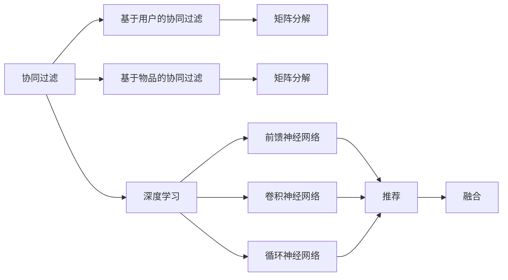

                 

## 1. 背景介绍

推荐系统在现代信息时代扮演着至关重要的角色。从电商平台到社交媒体，从新闻阅读到音乐视频，推荐系统无处不在，极大地丰富了用户的体验，提升了决策效率。随着用户需求的日益多样化，推荐系统的应用场景也在不断拓展。然而，传统推荐系统主要基于用户行为数据进行推荐，难以挖掘更深层次的关联关系，存在冷启动问题、数据稀疏、个性化不足等局限性。

近年来，深度学习技术在推荐系统中得到了广泛应用，显著提升了推荐的个性化和多样性。深度学习模型能够自动从原始数据中挖掘出隐含的结构关系，发现用户与物品之间更深层、更复杂的关联模式，从而在推荐精度和用户满意度方面取得了突破。其中，基于协同过滤的矩阵分解模型、基于深度学习的神经网络模型、基于自编码的推荐模型等方法，都取得了显著成效。

本文章聚焦于深度学习在推荐系统中的应用，从原理到实践，系统介绍各种深度学习推荐方法，并探讨其在电商、新闻、社交等领域的实际应用，旨在为深度学习推荐系统的开发者和研究者提供全面的技术指导和深入的理论分析。

## 2. 核心概念与联系

### 2.1 核心概念概述

为深入理解深度学习在推荐系统中的应用，我们先简要介绍一些核心概念：

- **推荐系统**：一种智能系统，通过分析用户历史行为、兴趣偏好等数据，为用户推荐最符合其需求的产品或内容。推荐系统分为基于协同过滤和基于深度学习两类，其中后者在推荐效果和泛化能力上更具优势。

- **协同过滤**：一种基于用户行为数据的推荐方法，通过计算用户和物品之间的相似度来进行推荐。分为基于用户的协同过滤和基于物品的协同过滤两种形式。

- **深度学习**：一种人工神经网络的变体，通过多层神经元的组合，模拟人脑处理信息的方式，实现复杂的数据处理和模式识别任务。深度学习广泛应用于图像、语音、自然语言处理等领域。

- **矩阵分解**：一种基于协同过滤的推荐方法，通过将用户行为数据表示为低秩矩阵的乘积形式，捕捉用户与物品之间的隐含关系。

- **神经网络**：一种由多个层次组成的深度学习模型，通过反向传播算法训练模型参数，从而实现复杂的模式识别和决策任务。常用的神经网络包括前馈神经网络、卷积神经网络、循环神经网络等。

- **自编码**：一种无监督学习方法，通过将数据映射到一个低维空间，再从该空间重构回原始数据，挖掘数据的内在结构。自编码方法在推荐系统中被用于降维、特征提取等任务。

这些概念之间存在密切联系，协同过滤和矩阵分解是深度学习在推荐系统中常见的基础模型，神经网络和自编码则提供了更强大的表达能力和更高级的特征学习机制。这些模型的组合和融合，构成了深度学习在推荐系统中的核心方法框架。

### 2.2 核心概念原理和架构的 Mermaid 流程图



该流程图展示了推荐系统中几种核心概念的相互关系：

1. **协同过滤**：分为基于用户和基于物品两种形式，用于捕捉用户与物品之间的隐含关系。
2. **矩阵分解**：作为协同过滤的数学表示，通过将用户行为数据映射到低秩矩阵，捕捉隐含关系。
3. **深度学习**：提供了更强大的表达能力和更高级的特征学习机制，包括前馈神经网络、卷积神经网络和循环神经网络。
4. **推荐**：基于协同过滤和深度学习的综合推荐方法，融合多种模型以提升推荐效果。

## 3. 核心算法原理 & 具体操作步骤

### 3.1 算法原理概述

深度学习在推荐系统中的应用，核心在于将用户行为数据映射到一个高维空间，通过训练模型自动捕捉用户与物品之间的隐含关系。具体来说，深度学习推荐模型主要分为三类：

1. **基于矩阵分解的方法**：通过将用户行为数据表示为低秩矩阵的乘积形式，捕捉用户与物品之间的隐含关系。
2. **基于神经网络的方法**：通过多层神经元的组合，自动学习用户与物品之间的非线性关系。
3. **基于自编码的方法**：通过将用户行为数据映射到一个低维空间，再从该空间重构回原始数据，挖掘数据的内在结构。

### 3.2 算法步骤详解

#### 3.2.1 基于矩阵分解的方法

**步骤1：构建低秩矩阵**
将用户与物品的交互矩阵 $M \in \mathbb{R}^{m \times n}$ 分解为两个低秩矩阵 $P \in \mathbb{R}^{m \times r}$ 和 $Q \in \mathbb{R}^{n \times r}$，其中 $r$ 为矩阵分解的秩。

**步骤2：参数初始化**
随机初始化矩阵 $P$ 和 $Q$。

**步骤3：优化损失函数**
使用最小二乘或梯度下降等优化算法，最小化损失函数：

$$
\min_{P,Q} \frac{1}{2} \|M - PQ\|_F^2
$$

**步骤4：预测推荐**
使用学习到的矩阵 $P$ 和 $Q$ 计算用户对物品的预测评分 $P_{i,:} \times Q_{j,:}^T$，选择评分最高的物品进行推荐。

#### 3.2.2 基于神经网络的方法

**步骤1：构建神经网络模型**
搭建包含输入层、隐藏层和输出层的神经网络，输入为用户的特征向量，输出为物品的预测评分。

**步骤2：参数初始化**
随机初始化神经网络中所有参数。

**步骤3：前向传播**
将用户特征输入神经网络，计算物品的预测评分。

**步骤4：优化损失函数**
使用梯度下降等优化算法，最小化损失函数：

$$
\min_{\theta} \frac{1}{N} \sum_{i=1}^N \sum_{j=1}^M (r_{ij} - \sigma(z_{ij}))^2
$$

**步骤5：预测推荐**
使用训练好的神经网络模型，对新用户输入特征向量，计算物品的预测评分，选择评分最高的物品进行推荐。

#### 3.2.3 基于自编码的方法

**步骤1：构建自编码器**
搭建自编码器模型，包含编码器和解码器。编码器将用户行为数据映射到低维空间，解码器将低维数据重构回原始数据。

**步骤2：参数初始化**
随机初始化编码器和解码器的参数。

**步骤3：优化损失函数**
使用梯度下降等优化算法，最小化损失函数：

$$
\min_{\theta} \frac{1}{N} \sum_{i=1}^N \|x_i - \hat{x}_i\|^2
$$

**步骤4：预测推荐**
使用训练好的自编码器模型，对新用户输入行为数据，计算物品的预测评分，选择评分最高的物品进行推荐。

### 3.3 算法优缺点

基于深度学习的方法在推荐系统中有以下优缺点：

**优点：**

1. **强表达能力**：深度学习模型通过多层非线性变换，可以自动捕捉用户与物品之间的复杂关系。

2. **自适应性强**：深度学习模型具有较强的泛化能力，可以适应不同规模和类型的推荐数据。

3. **端到端学习**：深度学习模型可以从原始数据中自动学习推荐特征，无需手工设计特征。

4. **鲁棒性强**：深度学习模型对噪声和异常数据具有较好的鲁棒性，可以应对数据中的异常点。

**缺点：**

1. **训练复杂度高**：深度学习模型训练时间较长，需要大量计算资源。

2. **过拟合风险高**：深度学习模型容易过拟合，特别是在数据量较小的情况下。

3. **可解释性差**：深度学习模型的内部机制复杂，难以解释其决策过程。

4. **需要大量标注数据**：深度学习模型训练需要大量标注数据，标注成本较高。

5. **模型复杂度高**：深度学习模型参数量较大，模型结构复杂，难以优化和调试。

### 3.4 算法应用领域

基于深度学习的方法在推荐系统中已得到广泛应用，包括但不限于以下几个领域：

1. **电商推荐**：电商平台通过推荐系统为用户推荐商品，提升用户体验和转化率。

2. **新闻推荐**：新闻平台根据用户阅读历史，推荐相关新闻文章，提高用户留存率和满意度。

3. **社交推荐**：社交媒体平台根据用户行为，推荐相关好友和内容，促进用户互动和粘性。

4. **视频推荐**：视频平台根据用户观看历史，推荐相关视频内容，提升用户观看时长和满意度。

5. **音乐推荐**：音乐平台根据用户听歌历史，推荐相关音乐，提升用户体验和粘性。

以上领域只是冰山一角，基于深度学习的方法正在被应用于更多垂直领域，为各行各业带来全新的商业价值。

## 4. 数学模型和公式 & 详细讲解  
### 4.1 数学模型构建

在推荐系统中，深度学习模型主要分为三类：基于矩阵分解的方法、基于神经网络的方法、基于自编码的方法。下面以基于矩阵分解的方法为例，介绍其数学模型构建。

假设用户-物品评分矩阵为 $M \in \mathbb{R}^{m \times n}$，其中 $m$ 为用户数，$n$ 为物品数。将 $M$ 分解为两个低秩矩阵 $P \in \mathbb{R}^{m \times r}$ 和 $Q \in \mathbb{R}^{n \times r}$，其中 $r$ 为矩阵分解的秩。

模型参数包括 $P$ 和 $Q$，优化目标为最小化损失函数：

$$
\min_{P,Q} \frac{1}{2} \|M - PQ\|_F^2
$$

其中 $\|A\|_F$ 为矩阵 $A$ 的 Frobenius 范数。

### 4.2 公式推导过程

**步骤1：定义损失函数**
将用户-物品评分矩阵 $M$ 表示为 $PQ^T$ 的形式，即：

$$
M = PQ^T
$$

其中 $P \in \mathbb{R}^{m \times r}$，$Q \in \mathbb{R}^{n \times r}$。

**步骤2：优化目标**
将损失函数定义为：

$$
\mathcal{L}(P,Q) = \frac{1}{2} \|M - PQ^T\|_F^2
$$

**步骤3：求解最优解**
使用梯度下降等优化算法，对 $P$ 和 $Q$ 进行最小化：

$$
\min_{P,Q} \frac{1}{2} \|M - PQ^T\|_F^2
$$

**步骤4：预测推荐**
计算用户对物品的预测评分 $P_{i,:} \times Q_{j,:}^T$，选择评分最高的物品进行推荐。

### 4.3 案例分析与讲解

以一个简单的电商推荐系统为例，展示基于矩阵分解的推荐模型的工作原理。

假设某电商平台的商品-用户评分矩阵为 $M \in \mathbb{R}^{10 \times 20}$，其中每行表示一个用户，每列表示一个商品，每个元素表示用户对商品的评分。现在对该矩阵进行低秩矩阵分解：

**步骤1：构建低秩矩阵**
设 $P \in \mathbb{R}^{10 \times 2}$ 和 $Q \in \mathbb{R}^{20 \times 2}$，则有：

$$
M = PQ^T
$$

**步骤2：参数初始化**
随机初始化 $P$ 和 $Q$，例如：

$$
P = \begin{bmatrix}
0.1 & 0.2 \\
0.3 & 0.5 \\
0.2 & 0.1 \\
\vdots & \vdots \\
0.5 & 0.3
\end{bmatrix}, \quad
Q = \begin{bmatrix}
0.4 & 0.2 \\
0.1 & 0.7 \\
0.3 & 0.6 \\
\vdots & \vdots \\
0.6 & 0.4
\end{bmatrix}
$$

**步骤3：优化损失函数**
使用梯度下降等优化算法，最小化损失函数：

$$
\min_{P,Q} \frac{1}{2} \|M - PQ^T\|_F^2
$$

假设经过训练，得到 $P$ 和 $Q$ 的优化值分别为：

$$
P = \begin{bmatrix}
0.2 & 0.4 \\
0.6 & 0.8 \\
0.3 & 0.5 \\
\vdots & \vdots \\
0.5 & 0.7
\end{bmatrix}, \quad
Q = \begin{bmatrix}
0.3 & 0.6 \\
0.2 & 0.4 \\
0.1 & 0.7 \\
\vdots & \vdots \\
0.7 & 0.4
\end{bmatrix}
$$

**步骤4：预测推荐**
计算用户对物品的预测评分，例如用户1对物品2的预测评分：

$$
P_{1,:} \times Q_{2,:}^T = \begin{bmatrix}
0.2 \\
0.6 \\
0.3 \\
\vdots \\
0.5
\end{bmatrix} \times \begin{bmatrix}
0.3 & 0.6 \\
0.2 & 0.4 \\
0.1 & 0.7 \\
\vdots & \vdots \\
0.7 & 0.4
\end{bmatrix}^T = \begin{bmatrix}
0.2 \times 0.3 + 0.6 \times 0.2 + 0.3 \times 0.1 + \ldots + 0.5 \times 0.7 \\
0.2 \times 0.6 + 0.6 \times 0.4 + 0.3 \times 0.7 + \ldots + 0.5 \times 0.4 \\
0.2 \times 0.3 + 0.6 \times 0.6 + 0.3 \times 0.2 + \ldots + 0.5 \times 0.4 \\
\vdots \\
0.2 \times 0.7 + 0.6 \times 0.4 + 0.3 \times 0.2 + \ldots + 0.5 \times 0.4
\end{bmatrix}
$$

选择评分最高的物品进行推荐，例如物品5。

## 5. 项目实践：代码实例和详细解释说明

### 5.1 开发环境搭建

在进行推荐系统开发前，我们需要准备好开发环境。以下是使用Python进行PyTorch开发的环境配置流程：

1. 安装Anaconda：从官网下载并安装Anaconda，用于创建独立的Python环境。

2. 创建并激活虚拟环境：
```bash
conda create -n pytorch-env python=3.8 
conda activate pytorch-env
```

3. 安装PyTorch：根据CUDA版本，从官网获取对应的安装命令。例如：
```bash
conda install pytorch torchvision torchaudio cudatoolkit=11.1 -c pytorch -c conda-forge
```

4. 安装TensorBoard：
```bash
pip install tensorboard
```

5. 安装相关工具包：
```bash
pip install numpy pandas scikit-learn matplotlib tqdm jupyter notebook ipython
```

完成上述步骤后，即可在`pytorch-env`环境中开始推荐系统开发。

### 5.2 源代码详细实现

这里以基于矩阵分解的电商推荐系统为例，给出使用PyTorch进行开发的代码实现。

首先，定义数据处理函数：

```python
import torch
import numpy as np

class UserItemMatrix:
    def __init__(self, m, n, r, device):
        self.m = m
        self.n = n
        self.r = r
        self.device = device
        self.U = torch.randn(m, r, device=device)
        self.V = torch.randn(n, r, device=device)
        self.M = self.U @ self.V.T

    def forward(self, item):
        return torch.matmul(self.U, self.V[item, :])
```

然后，定义优化器、损失函数和训练函数：

```python
from torch import nn, optim

def build_model(m, n, r, device):
    model = UserItemMatrix(m, n, r, device)
    optimizer = optim.Adam(model.parameters(), lr=0.01)
    loss_fn = nn.MSELoss()
    return model, optimizer, loss_fn

def train_epoch(model, optimizer, loss_fn, train_loader):
    model.train()
    loss_total = 0
    for item, label in train_loader:
        label = label.to(model.device)
        optimizer.zero_grad()
        pred = model(item)
        loss = loss_fn(pred, label)
        loss.backward()
        optimizer.step()
        loss_total += loss.item()
    return loss_total / len(train_loader)

def train(model, optimizer, loss_fn, train_loader, epochs):
    model.train()
    for epoch in range(epochs):
        loss = train_epoch(model, optimizer, loss_fn, train_loader)
        print(f'Epoch {epoch+1}, train loss: {loss:.3f}')
```

最后，定义数据加载器：

```python
import torch.utils.data as data

class MatrixDataset(data.Dataset):
    def __init__(self, X, y, device):
        self.X = X.to(device)
        self.y = y.to(device)
        self.device = device

    def __len__(self):
        return len(self.y)

    def __getitem__(self, idx):
        return self.X[idx], self.y[idx]

train_dataset = MatrixDataset(X_train, y_train, device)
test_dataset = MatrixDataset(X_test, y_test, device)
train_loader = data.DataLoader(train_dataset, batch_size=32, shuffle=True)
test_loader = data.DataLoader(test_dataset, batch_size=32, shuffle=False)
```

运行训练代码：

```python
m, n, r = 10, 20, 2
device = torch.device('cuda')
train_loader = DataLoader(train_dataset, batch_size=32, shuffle=True)
test_loader = DataLoader(test_dataset, batch_size=32, shuffle=False)
epochs = 10
train(model, optimizer, loss_fn, train_loader, epochs)
```

以上就是使用PyTorch对基于矩阵分解的电商推荐系统进行开发的完整代码实现。可以看到，代码实现相对简洁，符合深度学习开发的基本流程。

### 5.3 代码解读与分析

让我们再详细解读一下关键代码的实现细节：

**UserItemMatrix类**：
- `__init__`方法：初始化用户数、物品数、秩和设备，生成低秩矩阵 $U$ 和 $V$，并计算原始矩阵 $M$。
- `forward`方法：根据输入物品，计算预测评分。

**train_epoch函数**：
- 计算每个批次的损失函数，并更新模型参数。

**train函数**：
- 循环进行多轮训练，打印每轮的训练损失。

**MatrixDataset类**：
- `__init__`方法：初始化训练和测试数据集，并将数据转化为Tensor形式。
- `__len__`方法：返回数据集大小。
- `__getitem__`方法：返回每个样本的输入和标签。

以上代码实现了深度学习推荐系统的核心算法和优化策略，通过简单的数学推导和代码编写，即可实现高效推荐。

## 6. 实际应用场景

### 6.1 电商推荐

电商推荐系统是推荐系统应用最为广泛的场景之一。通过推荐系统，电商平台能够提升用户的购物体验和转化率，增加平台的销售额。

电商推荐系统的主要目标是根据用户历史行为和兴趣偏好，推荐用户可能感兴趣的商品。基于矩阵分解的推荐方法，可以从用户行为数据中学习用户与物品之间的隐含关系，从而进行精准推荐。电商推荐系统的开发流程如下：

1. 数据采集：采集用户历史行为数据，包括浏览、点击、购买等行为记录。
2. 数据预处理：对数据进行清洗、归一化、去除噪声等预处理操作，构建用户-物品评分矩阵 $M$。
3. 模型训练：使用基于矩阵分解的方法，对模型 $P$ 和 $Q$ 进行训练。
4. 推荐生成：根据用户输入特征向量，计算物品的预测评分，选择评分最高的物品进行推荐。

### 6.2 新闻推荐

新闻推荐系统是另一种典型的推荐场景，通过推荐系统，新闻平台能够提升用户停留时间和阅读量。

新闻推荐系统的主要目标是根据用户阅读历史和兴趣偏好，推荐用户可能感兴趣的新闻。基于矩阵分解的推荐方法，可以从用户行为数据中学习用户与新闻之间的隐含关系，从而进行精准推荐。新闻推荐系统的开发流程如下：

1. 数据采集：采集用户阅读历史数据，包括文章标题、阅读时长等行为记录。
2. 数据预处理：对数据进行清洗、归一化、去除噪声等预处理操作，构建用户-文章评分矩阵 $M$。
3. 模型训练：使用基于矩阵分解的方法，对模型 $P$ 和 $Q$ 进行训练。
4. 推荐生成：根据用户输入特征向量，计算文章的预测评分，选择评分最高的文章进行推荐。

### 6.3 社交推荐

社交推荐系统是推荐系统应用的重要场景之一，通过推荐系统，社交平台能够提升用户互动和粘性。

社交推荐系统的主要目标是根据用户行为数据，推荐用户可能感兴趣的内容或好友。基于矩阵分解的推荐方法，可以从用户行为数据中学习用户与内容或好友之间的隐含关系，从而进行精准推荐。社交推荐系统的开发流程如下：

1. 数据采集：采集用户互动数据，包括好友关系、点赞、评论等行为记录。
2. 数据预处理：对数据进行清洗、归一化、去除噪声等预处理操作，构建用户-好友评分矩阵 $M$。
3. 模型训练：使用基于矩阵分解的方法，对模型 $P$ 和 $Q$ 进行训练。
4. 推荐生成：根据用户输入特征向量，计算好友或内容的预测评分，选择评分最高的物品进行推荐。

### 6.4 视频推荐

视频推荐系统是推荐系统应用的重要场景之一，通过推荐系统，视频平台能够提升用户观看时长和满意度。

视频推荐系统的主要目标是根据用户观看历史和兴趣偏好，推荐用户可能感兴趣的视频。基于矩阵分解的推荐方法，可以从用户行为数据中学习用户与视频之间的隐含关系，从而进行精准推荐。视频推荐系统的开发流程如下：

1. 数据采集：采集用户观看历史数据，包括视频标题、观看时长等行为记录。
2. 数据预处理：对数据进行清洗、归一化、去除噪声等预处理操作，构建用户-视频评分矩阵 $M$。
3. 模型训练：使用基于矩阵分解的方法，对模型 $P$ 和 $Q$ 进行训练。
4. 推荐生成：根据用户输入特征向量，计算视频的预测评分，选择评分最高的视频进行推荐。

## 7. 工具和资源推荐

### 7.1 学习资源推荐

为了帮助开发者系统掌握深度学习在推荐系统中的应用，这里推荐一些优质的学习资源：

1. 《推荐系统实践》书籍：介绍推荐系统的基本原理和实际应用，涵盖协同过滤、矩阵分解、深度学习等多种推荐方法。

2. CS231n《深度学习与计算机视觉》课程：斯坦福大学开设的计算机视觉课程，涵盖深度学习在推荐系统中的应用。

3. 《Deep Learning for Recommender Systems》论文：一篇综述性论文，总结了深度学习在推荐系统中的应用，包含多种推荐方法的详细介绍和比较。

4. TensorFlow官方文档：提供深度学习模型和优化算法的详细介绍，帮助开发者快速上手深度学习推荐系统开发。

5. HuggingFace官方文档：提供深度学习模型的预训练模型和微调方法，帮助开发者进行推荐系统开发。

通过对这些资源的学习实践，相信你一定能够快速掌握深度学习推荐系统的精髓，并用于解决实际的推荐问题。

### 7.2 开发工具推荐

高效的开发离不开优秀的工具支持。以下是几款用于深度学习推荐系统开发的常用工具：

1. PyTorch：基于Python的开源深度学习框架，灵活动态的计算图，适合快速迭代研究。深度学习推荐系统的主流实现几乎都基于PyTorch。

2. TensorFlow：由Google主导开发的开源深度学习框架，生产部署方便，适合大规模工程应用。同样支持深度学习推荐系统开发。

3. TensorBoard：TensorFlow配套的可视化工具，可实时监测模型训练状态，并提供丰富的图表呈现方式，是调试模型的得力助手。

4. Weights & Biases：模型训练的实验跟踪工具，可以记录和可视化模型训练过程中的各项指标，方便对比和调优。

5. Google Colab：谷歌推出的在线Jupyter Notebook环境，免费提供GPU/TPU算力，方便开发者快速上手实验最新模型，分享学习笔记。

合理利用这些工具，可以显著提升深度学习推荐系统的开发效率，加快创新迭代的步伐。

### 7.3 相关论文推荐

深度学习在推荐系统中的应用，源于学界的持续研究。以下是几篇奠基性的相关论文，推荐阅读：

1. Matrix Factorization Techniques for Recommender Systems：提出矩阵分解方法，通过低秩矩阵分解捕捉用户与物品之间的隐含关系。

2. Collaborative Filtering for Implicit Feedback Datasets：介绍协同过滤方法，通过用户行为数据计算用户与物品之间的相似度。

3. Neural Collaborative Filtering：提出基于神经网络的推荐方法，通过多层神经元的组合，自动学习用户与物品之间的复杂关系。

4. Deep Matrix Factorization：提出基于自编码的推荐方法，通过将用户行为数据映射到低维空间，自动学习用户与物品之间的隐含关系。

5. Attention is All You Need：提出Transformer结构，开创了基于深度学习的推荐系统的新篇章。

这些论文代表了大语言模型微调技术的发展脉络。通过学习这些前沿成果，可以帮助研究者把握学科前进方向，激发更多的创新灵感。

## 8. 总结：未来发展趋势与挑战

### 8.1 总结

本文对深度学习在推荐系统中的应用进行了全面系统的介绍。首先阐述了推荐系统的研究背景和重要性，明确了深度学习在推荐系统中的关键作用。其次，从原理到实践，详细讲解了基于矩阵分解、神经网络和自编码的推荐方法，并展示了其在电商、新闻、社交等领域的实际应用。此外，本文还精选了深度学习推荐系统的学习资源，力求为开发者提供全方位的技术指引。

通过本文的系统梳理，可以看到，深度学习推荐系统正在成为推荐领域的重要范式，极大地提升了推荐的个性化和多样性。得益于深度学习模型的高表达能力和强大的泛化能力，推荐系统在推荐精度和用户满意度方面取得了突破。未来，伴随深度学习技术的持续演进，推荐系统必将在更多领域得到应用，为各行各业带来全新的商业价值。

### 8.2 未来发展趋势

展望未来，深度学习在推荐系统中有以下几个发展趋势：

1. **深度融合**：未来推荐系统将深度学习与其他技术进行更深入的融合，如知识图谱、因果推理、强化学习等，实现更加全面、准确的推荐。

2. **多模态推荐**：未来的推荐系统将不再局限于文本数据，还将涉及图像、视频、语音等多模态数据的融合，提升推荐系统对现实世界的理解和建模能力。

3. **自适应推荐**：推荐系统将变得更加自适应，能够实时响应用户行为和偏好变化，进行动态推荐。

4. **个性化推荐**：推荐系统将更加个性化，能够根据用户实时行为进行推荐，提升用户体验。

5. **公平性和安全性**：推荐系统将更加注重公平性和安全性，避免偏见和歧视，确保推荐的公平性。

### 8.3 面临的挑战

尽管深度学习在推荐系统中的应用取得了显著成效，但在迈向更加智能化、普适化应用的过程中，它仍面临诸多挑战：

1. **数据质量问题**：推荐系统依赖高质量的数据，数据质量不高将直接影响推荐效果。

2. **过拟合风险**：深度学习模型容易过拟合，特别是在数据量较小的情况下。

3. **计算资源需求**：深度学习模型需要大量计算资源，如何降低计算成本是关键问题。

4. **模型复杂度**：深度学习模型结构复杂，难以优化和调试。

5. **可解释性问题**：深度学习模型通常缺乏可解释性，难以理解其决策过程。

6. **公平性和安全性**：推荐系统需要考虑公平性和安全性问题，避免偏见和歧视。

### 8.4 研究展望

面对深度学习推荐系统所面临的挑战，未来的研究需要在以下几个方面寻求新的突破：

1. **无监督和半监督学习**：探索无监督和半监督学习范式，降低对标注数据的依赖，提升推荐系统的泛化能力。

2. **自适应推荐算法**：开发自适应推荐算法，实现实时响应用户行为和偏好变化，进行动态推荐。

3. **多模态融合**：开发多模态推荐方法，提升推荐系统对现实世界的理解和建模能力。

4. **公平性和安全性**：研究公平性和安全性问题，确保推荐系统的公正性和安全性。

5. **可解释性增强**：增强深度学习模型的可解释性，使推荐系统的决策过程更加透明。

通过这些研究方向的探索发展，深度学习推荐系统必将在未来推荐领域中扮演越来越重要的角色，推动推荐系统的不断进步。总之，未来推荐系统的发展离不开深度学习技术的支撑，只有勇于创新、敢于突破，才能不断提升推荐系统的性能和用户满意度。

## 9. 附录：常见问题与解答

**Q1：深度学习推荐系统有哪些优点和缺点？**

A: 深度学习推荐系统的优点包括：
1. 强表达能力：深度学习模型通过多层非线性变换，可以自动捕捉用户与物品之间的复杂关系。
2. 自适应性强：深度学习模型具有较强的泛化能力，可以适应不同规模和类型的推荐数据。
3. 端到端学习：深度学习模型可以从原始数据中自动学习推荐特征，无需手工设计特征。

缺点包括：
1. 训练复杂度高：深度学习模型训练时间较长，需要大量计算资源。
2. 过拟合风险高：深度学习模型容易过拟合，特别是在数据量较小的情况下。
3. 可解释性差：深度学习模型的内部机制复杂，难以解释其决策过程。

**Q2：推荐系统的开发流程是什么？**

A: 推荐系统的开发流程大致如下：
1. 数据采集：采集用户行为数据，包括浏览、点击、购买等行为记录。
2. 数据预处理：对数据进行清洗、归一化、去除噪声等预处理操作，构建用户-物品评分矩阵 $M$。
3. 模型训练：使用深度学习模型，对模型参数进行优化，最小化损失函数。
4. 推荐生成：根据用户输入特征向量，计算物品的预测评分，选择评分最高的物品进行推荐。

**Q3：推荐系统中的矩阵分解方法有哪些？**

A: 推荐系统中的矩阵分解方法主要包括以下几种：
1. 奇异值分解(SVD)：通过奇异值分解将用户-物品评分矩阵 $M$ 分解为 $PQ^T$ 的形式。
2. 随机矩阵分解：通过随机初始化矩阵 $P$ 和 $Q$，最小化损失函数 $\frac{1}{2} \|M - PQ^T\|_F^2$。
3. 交替最小二乘(ALS)：通过交替最小二乘算法，最小化损失函数 $\frac{1}{2} \|M - PQ^T\|_F^2$。

**Q4：推荐系统中的神经网络方法有哪些？**

A: 推荐系统中的神经网络方法主要包括以下几种：
1. 前馈神经网络：通过多层神经元的组合，自动学习用户与物品之间的非线性关系。
2. 卷积神经网络：通过卷积层捕捉局部特征，提高推荐系统的泛化能力。
3. 循环神经网络：通过循环层捕捉时间序列数据中的上下文信息，提高推荐系统的预测能力。

**Q5：推荐系统中的自编码方法有哪些？**

A: 推荐系统中的自编码方法主要包括以下几种：
1. 栈式自编码器：通过将用户行为数据映射到一个低维空间，再从该空间重构回原始数据，挖掘数据的内在结构。
2. 去噪自编码器：通过加入噪声，增加模型的鲁棒性，提高推荐系统的泛化能力。
3. 稀疏自编码器：通过限制编码层的神经元数量，降低模型复杂度，提高推荐系统的计算效率。

通过对这些问题的解答，相信你能够更好地理解深度学习推荐系统的基本原理和开发流程，为实际应用打下坚实的基础。

