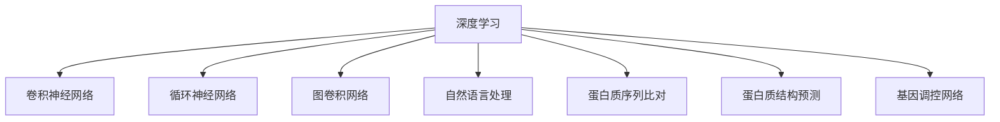

                 

# 一切皆是映射：深度学习在生物信息学中的应用前景

## 1. 背景介绍

### 1.1 问题由来

生物信息学(Bioinformatics)是研究生命科学大数据处理和分析的交叉学科，涵盖基因组学、蛋白质组学、代谢组学等多个方向。近年来，随着高通量测序技术、计算生物学算法等迅猛发展，生物信息学已经从传统的序列比对、序列比对、蛋白质折叠等传统应用领域，拓展到更复杂的基因调控、蛋白质功能预测、药物设计、个性化医疗等前沿方向。

尽管生物信息学领域的数据量庞大，但数据本身往往难以直接解答复杂生物问题。传统的统计分析方法，如机器学习、统计模型等，往往需要大量手工特征工程和专家知识，难以快速高效地处理复杂生物数据。近年来，随着深度学习技术的飞速发展，尤其是深度神经网络的应用，生物信息学领域开始引入新的研究范式，通过对大数据进行有效映射，提取高层次特征，推断复杂生物系统的内在规律，成为当前研究的热点。

### 1.2 问题核心关键点

深度学习在生物信息学中的应用，核心在于通过神经网络模型对数据进行映射，提取高层次的特征表示。深度学习的核心思想是通过多层非线性映射，对输入数据进行抽象和转换，从而自动捕捉数据中的复杂关系和规律。这一思想对于生物数据的高维复杂性尤为适用。

具体而言，深度学习在生物信息学中的应用关键点包括：

- **数据的高维性**：生物数据，如基因组、蛋白质序列、代谢产物等，通常具有高维度的复杂结构，难以直接使用传统统计方法分析。
- **数据的多样性**：生物数据类型多样，包括序列数据、图像数据、文本数据、网络数据等，需要统一处理方式。
- **特征的多样性**：生物数据中包含的特征种类繁多，如氨基酸序列、RNA结构、蛋白质-蛋白质相互作用等，需要提取不同的特征表示。
- **任务的多样性**：生物信息学中涉及的任务广泛，包括序列比对、结构预测、功能注释、药物设计等，需要统一映射模型。

## 2. 核心概念与联系

### 2.1 核心概念概述

为更好地理解深度学习在生物信息学中的应用，本节将介绍几个密切相关的核心概念：

- **深度学习(DL)**：一种通过多层神经网络进行非线性映射的机器学习方法，旨在通过多层次的特征提取，捕捉数据中的复杂关系。
- **卷积神经网络(CNN)**：一种主要用于图像数据处理的深度学习模型，通过卷积层和池化层对输入数据进行特征提取。
- **循环神经网络(RNN)**：一种主要用于序列数据处理的深度学习模型，通过循环层和LSTM/GRU等结构对序列数据进行建模。
- **图卷积网络(GCN)**：一种主要用于网络数据处理的深度学习模型，通过图卷积层对图结构数据进行特征提取。
- **自然语言处理(NLP)**：一种研究计算机如何理解、生成和处理人类语言的领域，深度学习在此领域取得了巨大成功。
- **蛋白质序列比对**：将不同物种的蛋白质序列进行比对，以识别它们之间的同源关系和演化差异。
- **蛋白质结构预测**：通过序列比对结果，预测蛋白质的三维结构，进而研究其功能和作用。
- **基因调控网络**：研究基因之间的调控关系，以及基因调控网络的构建和分析。

这些核心概念之间的逻辑关系可以通过以下Mermaid流程图来展示：

这个流程图展示了深度学习在生物信息学中的应用场景，以及其中几个核心的子领域。

## 3. 核心算法原理 & 具体操作步骤
### 3.1 算法原理概述

深度学习在生物信息学中的应用，本质上是通过神经网络模型对生物数据进行有效映射，提取高层次的特征表示。深度学习的核心思想是通过多层非线性映射，对输入数据进行抽象和转换，从而自动捕捉数据中的复杂关系和规律。

具体而言，深度学习在生物信息学中的应用原理包括以下几个关键点：

- **特征映射**：神经网络通过多层特征提取器，对输入数据进行多层次映射，生成高维特征空间。每一层都通过非线性变换捕捉数据的不同特征，形成逐渐抽象的特征表示。
- **映射表达**：深度神经网络通过多层权重和偏置，构建非线性映射函数，对输入数据进行表示。在生物信息学中，这一映射能够捕捉到基因序列、蛋白质结构、代谢途径等复杂结构的特征。
- **损失函数**：通过定义损失函数，衡量模型输出与真实标签之间的差距，并使用梯度下降等优化算法最小化损失函数，使模型不断逼近真实标签。在生物信息学中，损失函数通常用于衡量预测的蛋白质结构、功能注释等与真实结果的差异。
- **参数优化**：深度学习模型通常包含大量参数，通过优化算法调整参数，使得模型在训练集上表现良好，并在测试集上泛化性强。在生物信息学中，这一过程通常需要大量的计算资源和数据。

### 3.2 算法步骤详解

深度学习在生物信息学中的应用步骤一般包括以下几个关键步骤：

**Step 1: 数据预处理**
- 收集生物数据集，如基因序列、蛋白质结构、代谢产物等。
- 对数据进行清洗、归一化、标准化等预处理操作，确保数据的质量和一致性。
- 将数据划分为训练集、验证集和测试集，用于模型训练、验证和测试。

**Step 2: 模型选择**
- 根据生物数据的特性选择合适的深度学习模型，如卷积神经网络、循环神经网络、图卷积网络等。
- 确定模型的层数、每层的神经元数量等超参数。
- 使用预训练模型作为初始化参数，加速模型训练。

**Step 3: 特征提取**
- 使用神经网络模型对输入数据进行特征提取，生成高维特征表示。
- 对提取的特征进行降维、归一化等处理，以减小计算量和提高计算效率。
- 引入正则化技术，如Dropout、L2正则化等，防止过拟合。

**Step 4: 模型训练**
- 定义损失函数和优化器，使用梯度下降等优化算法更新模型参数。
- 对训练集进行批次处理，不断迭代优化模型。
- 在验证集上评估模型性能，防止过拟合。
- 重复训练过程，直到模型收敛或满足预设的停止条件。

**Step 5: 模型评估**
- 在测试集上评估模型的泛化性能，评估指标包括准确率、召回率、F1分数等。
- 分析模型的优缺点，总结经验教训，进行模型优化。
- 发布模型，提供API接口供外部调用。

### 3.3 算法优缺点

深度学习在生物信息学中的应用具有以下优点：

- **高效性**：深度学习能够自动捕捉数据的复杂关系，无需人工设计特征工程，大大提高了模型训练和推理的效率。
- **泛化能力**：深度学习模型能够处理复杂多样的生物数据，具有较强的泛化能力，能够适应不同的生物任务。
- **可解释性**：通过特征映射和损失函数的设计，深度学习模型具有较强的可解释性，能够理解输入数据的重要特征。

同时，深度学习在生物信息学中的应用也存在一些缺点：

- **计算资源需求高**：深度学习模型通常需要大量的计算资源，如GPU、TPU等高性能设备，增加了实验成本。
- **模型复杂性**：深度学习模型结构复杂，难以解释和调试，需要丰富的领域知识和经验。
- **数据需求大**：深度学习模型需要大量的标注数据进行训练，而在生物信息学中，高质量的标注数据获取难度较大。

尽管存在这些局限性，但就目前而言，深度学习仍然是大数据处理和分析中的重要工具，特别在生物信息学等复杂数据处理领域，深度学习的应用前景广阔。

### 3.4 算法应用领域

深度学习在生物信息学中的应用广泛，以下是几个典型应用领域：

- **基因组学**：通过深度学习模型对基因序列进行比对、分类、聚类等处理，以识别基因变异、基因调控关系等。
- **蛋白质组学**：利用深度学习模型对蛋白质序列、结构、功能进行预测和注释，以及蛋白质-蛋白质相互作用关系的预测。
- **代谢组学**：使用深度学习模型对代谢产物进行分类、预测，以及代谢途径的构建和分析。
- **个性化医疗**：通过深度学习模型对患者基因、蛋白质等数据进行分析，以制定个性化的治疗方案。
- **药物设计**：利用深度学习模型对蛋白质结构进行预测和分析，设计新药分子，加速新药研发。
- **疾病预测与诊断**：使用深度学习模型对电子病历、基因组数据等进行分析，以预测疾病风险、辅助临床诊断。
- **生物信息学工具开发**：开发深度学习驱动的生物信息学工具，如序列比对工具、结构预测工具、功能注释工具等，提升生物信息学研究效率。

## 4. 数学模型和公式 & 详细讲解 & 举例说明

### 4.1 数学模型构建

在生物信息学中，深度学习模型的构建通常包括两个部分：特征提取和分类预测。

**特征提取**：
- 假设输入数据为 $\mathbf{x} \in \mathbb{R}^n$，表示生物数据的高维特征向量。
- 使用卷积神经网络(CNN)对输入数据进行特征提取，生成高维特征表示 $\mathbf{h} \in \mathbb{R}^m$，其中 $m$ 表示特征映射的维度。
- 使用全连接层将高维特征映射到输出空间 $\mathbf{y} \in \mathbb{R}^k$，其中 $k$ 表示输出维数。

**分类预测**：
- 定义分类损失函数 $\mathcal{L}$，如交叉熵损失、对数似然损失等。
- 使用梯度下降等优化算法最小化损失函数 $\mathcal{L}$，更新模型参数 $\theta$。
- 在测试集上评估模型性能，如准确率、召回率、F1分数等。

### 4.2 公式推导过程

以下是深度学习在生物信息学中使用的核心公式和推导过程：

**卷积神经网络**：
- 卷积层定义：$h^{(l+1)}=\sigma(\mathbf{W}^{(l+1)} * h^{(l)} + b^{(l+1)})$
- 池化层定义：$h^{(l+1)}=\max(\mathbf{C} * h^{(l)})$
- 激活函数：$\sigma(x) = \frac{1}{1+e^{-x}}$

**循环神经网络**：
- 循环层定义：$h_t = \sigma(\mathbf{W} * [h_{t-1}, x_t] + b)$
- 循环层中使用的LSTM/GRU等结构，用于处理序列数据的记忆性和非线性特征提取。

**图卷积网络**：
- 图卷积层定义：$\mathbf{H}^{(l+1)} = \mathbf{D}^{-1/2}\mathbf{H}^{(l)}\mathbf{W}^{(l+1)}$
- 其中 $\mathbf{D}$ 表示拉普拉斯矩阵的对角线元素，用于归一化处理。

**自然语言处理**：
- 使用Transformer模型进行语言建模，模型定义：$y_t = softmax(\mathbf{W} * [y_{t-1}, x_t] + b)$

**蛋白质结构预测**：
- 使用深度学习模型对蛋白质序列进行结构预测，定义损失函数 $\mathcal{L} = -\frac{1}{N}\sum_{i=1}^N(y_i - \hat{y}_i)^2$
- 通过最小化损失函数，训练模型预测蛋白质结构。

**基因调控网络**：
- 使用深度学习模型对基因调控关系进行建模，定义损失函数 $\mathcal{L} = -\frac{1}{N}\sum_{i=1}^N(y_i - \hat{y}_i)^2$
- 通过最小化损失函数，训练模型预测基因调控关系。

### 4.3 案例分析与讲解

以下是一个使用深度学习模型进行蛋白质结构预测的案例分析：

假设我们有一个蛋白质序列 $x = MLMKSPRVHTFYHGEVEHLWVLFFNPEPMSAEGNTLDGLNFQTYADTLDRFDPDARITAIFAIVEAGRVLSYQALEHVLTTRFFVTSYPLSSLALGGEIGGASLIYDRYQYSGVDAVPSVGEGKIARQVFYKLKRFFGELIQGLRYTDVIHDAEVKGLKGDGPGSQNGDGYVQIDGTELTDEARPFQGLSVKFQPVNLAFRYALGPAPYREVGLEESIATDLKLLTYTTISGRLLSLDRREYGRQLTRKLGQNLADLTASSVALTDITGDALLRGESPVTEEPIDALNGMIELRHLVKQGFAAIALNMFVTPRLAENEADLIGTASALGSVVAFGDVADLRFGKDQTYLMDVFVHYASDRGKQFQLADFGLFSGGSVQGARLIVDADDDDIPEYVKKKYQLQTYHGLHIVAPLGIIGSPFGVFGGADDEGVSSVFKNKVAFESVMEDDSEITLGSVYYADLSEILARQLASSQYPPADYSPGDGASGDEERARVTDGARERFQGDLAVAAYQGFKLGKYAAEILTLLDASDKYVLSFGSIAATGRVQAFAFLKVGQGATQEIVGATKDSSGGGDVLNISYKGEILLGGLLGVIRKRYVALGQKAAFDFGGVDRKSGGKFTTADKSTYRVGYITVDDQQLTIIDSPGSSGGGKGESAAVVRKIDGDVDLLMQPFEGGNTDKEGWKGLNLVFLLTYGKRMDGTDAPGLEVPELRGTDAVGYYGSGLLRGHSALGDDVAVIDRYDEEPQKFVDGSSLRRGSKNVGDYEISSFRYDVRLESPGEGQDIATQEIALNGFELVGLAEEGKGEQLKYIELPGQREIIASQRPDYEGTPRVVLTFTLTLLGDEEDREFDIHGEIAFGTPRGPLRKYRFSGSGGSVGGYYGSAEELQIQEGRVADIFERFDAIELIGSVGVSIFFGQGEFPALAVSGLFRAIQHGPYIATADFAIVAEEGDPITDEIQAVQILTGSGSKIPHYYEGGDGLPTNVVIQGAEIEELLFQVFGGGAFDGPRAVVKKVGAVVTRPYDEEHELLGQATDTEYRGESGDKSTDPYAAEGVTTGGEVDDIGGALGDIPRPGRSGEKDFSGTEYIVVGVVPEDSLYEGRYYGEAAQKGVGPGGGLAHKDVEAFGGEVRFRKRGPKKTFTLSLLVDEGHSAGNLEKVDEDEIPKLEAIEGIEVYIVRRGVALGAVATGDDPEIQAGLGTGQNPGAIATATGGFGEVRFGKNIHDLGDQIGGGRLGEFDIELGEGRYGSIVGDGSEVVAVDRGPVLQVGKGSTVFEASLLTTGALDRVKYQQVVAPAAPTYPSLGGRYYDSAIELGLGKEEGSHPKYFPSGEVETLEKGPGDPVEEVPGVGSLRQLGTHYDDPAQGQGGGSIGLEEQHYYGIIGGPGTKPGVQGEDELQDFDKGFQQTEGTLYQGPESRSVGGIDKEANIENYADSDLRILRVINFDLIDVQEFDEQVIGEVALISGQEGRDLGGRRQVALGGEFGAQEEVGKARARRGKDLEDEGGGLSGTIASGKDGDGLRRDIDDAVQLSVRDFENATLIFIVIDSGVFDRADVTEQVLPATKQEGLYSSLDGFGIVQKDDLLTSSVDEGYAAGKSGGAEGDDYVDPGSGGSPQRGFFRKAARYLTGAYYLDKRGRDEGNSFQRDLAITYPGEEEEALLDDIVRVLGQVGGGRRYVGDDISGDDAALLGPGLRRFGVGFGGRIEETGRGLGQEKYYKRSGGSGGEVADALLGVQLGVYRQQGAVTSGGDVRQLDEGFFGPQVSEVDRLGAYYVDVEIKLLIYDGGIVLAVDSEKADTRADILLGLQGEEFIINDFATLQEVLGLAFALGSHMGAKGGEVDFYKDEGDPDGLAGGYAISFGGGGFDGEVDPGVIVGEEFDDDAEGEGAQLPFDFLLGELELYTGYDGGEVDDFVIKDADFGDRYFGGSGDPGGGDDAPRVQEKHVVQLDIYRGGGSPGGRADVGGVVDRVVTTMEEKIPKEGDTNVAPGFEGGRGSGGLGQGVGTYLLGAVGGGYAGERGTTTYYGSSGEGDGLFLLATDQVISGDGQAIIQMARGGPVGAVDEEGGPGGRLRGVFDTEIRAEIDNQVLSGAADYDIEGDPYQAPSVGQRTKRERGDDQDLRVLSRPAFRDDYSRSVRVPLGQKVRGALGTGAVGVFFEGSLDGLYYQSGGPDAMKVSEGGLVPGEPEEKRQGQQQLDLGKRGYVSRAEYGVAVRRDGDDIGVEYRRAIGDDRAGGEVVEYYFNLGLARERGDPGVNNLGLDDELPQGEEGEGELQEKRSPGWGGLRGARPYAEGGAVLPGPGVGDDSEGVGDVPDVVIGQLFEPLKYQEEIEEKKFLLADALDDKYVRADGTVDGKGGRFEADNPDGGDDLEIGQKERGELGAAKATGGSFEVRKGDGSVFVPFEKDQDKTRVSLAQSVYVPRAAVVVDAEGKDAKFRPVDDKYRKAEEAQSVGAAEGSGDDGADGPRYALDDYDAGGFKVAQRGAKYVPVDRYQGIPGQRGEEGGVGLFEDRPVRRIGGQRGFQLKKQEDEEQGDASNPGLEEGGALGLEHYYGYVQLDGGGTLRYFDPGVGDEGEEGRIKKKVTRGSGGVLGARFFGPKRPQAAFVRVRQLRRSLLFQDPGYIATLGRPGGFYRVGGGIEEPKLLYGSVYVSDDRVPGRADRINVLYQQAQKTIIVPGGGDIPSVRRRKEGADIELGYYVPGVFVGAVSVAYGDQAEGTVKPLAVAADSGGLRVKSGGAVRRYPTVVVGRYSVFVDQEKRRPLLMDYQRLFGGEFLGSGGAEEYGGDIFPRVALYAVDIEGDEEGPQRGGQDLDRIVYLSAVDIDRIEGGKSGVYGSGEEKAEAFIDYGGGRFSSSYLQRVAPAGGQSKRYQGGEALDYEVQLVLGDAAGGAVSDGTNGGGVAVSLVSKYDADQGDHVESIVGGGIEFDDTIRYVEVVGIGEDEEQEGRGDVLGALSSMGDVRAGYVSTGEQDRLTTDRYVGNGYYGLDTRVLVGAAGGSGRVGATGGAVRVVPGYYRADVHADGATGVDQLVSDGGLFFVGYFDDKQAEGGRYFLSLLRAAPRFGGFFGGVTEEVLFHHLQEEGRGAKATITSGEEVVLEERQVSVDAVGKYRYFTEGVGADEQDKGRIGTYGAVGRGAFGSGQGQGRYCVRGGGSGGVVGVVQRGLGKRIIRIPQVVPLYYKGVKEGGLDDEEPQLRVEENYYEVLKSGATSGDGDASSGGNKRFKVDVEEQGGGIYKLLGQGGSKLLGFFQGATVQSGYYVRGEPLRIRHFGGRFGGCGGRGGSDFRSGGGYGSVDDQGEAASGEGGASDLFGERLRLRGSKKAEVSSDSGDEEGRVSYRVIEGKWSEPRNGIVFADLRYYQGEIEKIPRAAAVFRDLSGHSQRADDSGMVRLELGFEGLGSGGSLGEFDDAFGEEEELGSSLLLSIVYVGNNVPVRYSGTTGQAVIDLYGQGGEVGAVVADGQDGLYQGDFALGSVRGDAIRVTRDYLFQVRRNGGEVDDSQNYSVDSSEGAEVGGYQLRVVYEQGFFGLELQHTEGGEIVQGAQFEYASLYGRLDDYERDEGFFRYYADGAEKVKVGIVVDAAEETVGPEELVNQEETVLRFGTTDQDDDDTAYFVLAVGFEVADTPVGDDPSSVRGGDDPGGGLARIGGTVHGSPAGGGLLRVTPGQRKYPRYCVFRDKYHVRVQRVGGRYYGDPYVDGGGVVRPRDAPVGGLDFFEQGDALDSGGAYLKRGGEAGEEFVLQQKEREDYCVALVGADYYEIVGGAEGGEFRRLLAVRFFLSLKSGGGPGGDDIEERLRSYYDDEGEEEVLGFFGLEEAVEVKEEEGGEGGADVGSGAEIELGRVLGEGDVEEAKGEEVGVGTRKIYYNQEYGEVVGGADLEEAGGAAQRDDLFVFDFGVGSDFSLTEADGEEEGGGGGATGYYVYEEFLLVLSVFFDGVADQVLLVGVGDAEADVRDPVFPELVQEVVADALFVKKKGSGGAVGADLAVYFFGGRGGIQERAEKLLFDNLVTDNGTKEDGQDDGSGGASDLFDLAFFGEETIQEVGVKEVAFGRYYQIERRFAEADRVFAYHVHQRVDGSEGKSKKGEVPVVTDQEVVLFVLGADFASGGGAGGKGGVGTVLDYVMVVGFLLGEGLDSGGAEGGGLFTRSEVGKVLYYSFVAGAVFGEEERSEAIDPYGGEVVRRKSGGAVGAETSEAVSLVKFSGDGYTRGDLYEEVEEVLGQRSLGLDAEGTVRIRAFLLYVGGDIEELVSLGAVLFAYDHEARVAAVLYGRYYFVQFSGAVENQDYGDFFRLGSASSGGEKVRGDGGGGDVDPGAAEGVGFPYEEQQQEVGLGDDVTVDGEGGGVVQEQRDEGTGSGGEEKSVGEVLQVFKKKALVNNNLRGKKGGGYYVGDAEAVTVQVFYGDGSGFEGGAPGGLYSGEEVVFGEEGGVLGLGSSIGRVEIGFFGATGDAGGTGVGGSVGIQRGVEVGGSVRQDVRQRVGGSVTDISAGGVGGYQVGGVGFYEEGFGVVVDTEIYYGSPGLEQEGGAVDGSFQVGGYYRVGADYVGAVEGFLLLLGEGGAVGGGGLGQLVNALDNLPGDVRGAVGYSDDRGAEEGKAPDGSVGEEEEVVIVKFVGVPVGVGYSVAAEGVVGGGDSVLALGRGAFRRVGGSEFADGKADGVNVTVQGFVDENLYMGSGGGRVGESGDEESEVARIEAEKRQQAVIDEEGFGDGYYVGVGSGVRADGQVKGAAEGQLGFGGAEEERGDELTETYGDGLRRYQIVGADSKYHSGGGGLAQGQGRRVGSYMGDDDLYKDDAFGGGAAEDGSGRRGVGGELQQDGKDGRLLLLGDDGGQVRRGESEEVGARFDGGRYYGSGGRGAFRVSFFGVLRVEGKFFEGALFFADMGSLGIRGDRVVGGYEGADFVGGGIQLRLPGEVVVRGRGYYIRVIGGGAVKDLQAALAKFGGDGSFSSGGRGLLLDDVVVGGYRFRIGEEELKKQGGRDFSVGGAIAVVYVSQEGGGAVAEYYGAAEVVYGGDDDGKGLDDGADGQSGVVVGGAAGGDDDDGSGLEELGYYTVKFSGDYDGQDGDLYGAGAGGGGIQGGYDSSVVFQEKTFGEEYYGEEVIRSGGGGLYQALQEEGIKYYGKAVGGGGGAAQEEGEAEEGGAEGEGGAVIQDPGQGSGGGEADGVADYARLELLFDEGVGVDFEVVVFRRVHEGERGGYRGDDGGAEEVRGRGDDDEEGSGGGDKTYRYEERIGDDDDGTTSGGSVVRVRYEEQQGGVREVGVVRLLAHGGGAEGGGGAAVVGAVVGLTVPGVRDQLGDAVFDGGAVKYVGSPGAAVLLSLGAKLIEAKEYFGGTVFQGAVVDTEVRVRGGSGYVVQAIAEFDDDVVQSGGGVVDYDEEGVQSVGAVVVDVVQGGGEGFGQTVKLGVSGVVDGVVLGTYRRGDLVGGVTTTGGEVVGVVEGEEGRGVGFGGVAEGFYRGEVVGAGGGRVYRGGGDDDYVGGADDDQVVGAAAAVDVLIGTTSLGVEEKEAAVVGAAAQAAAALYYEERASAAAQAAAAQAAAAWASAAAQAAAAWASAAAQAAAAWASAAAQAAAAWASAAAQAAAAWASAAAQAAAAWASAAAQAAAAWASAAAQAAAAWASAAAQAAAAWASAAAQAAAAWASAAAQAAAAWASAAAQAAAAWASAAAQAAAAWASAAAQAAAAWASAAAQAAAAWASAAAQAAAAWASAAAQAAAAWASAAAQAAAAWASAAAQAAAAWASAAAQAAAAWASAAAQAAAAWASAAAQAAAAWASAAAQAAAAWASAAAQAAAAWASAAAQAAAAWASAAAQAAAAWASAAAQAAAAWASAAAQAAAAWASAAAQAAAAWASAAAQAAAAWASAAAQAAAAWASAAAQAAAAWASAAAQAAAAWASAAAQAAAAWASAAAQAAAAWASAAAQAAAAWASAAAQAAAAWASAAAQAAAAWASAAAQAAAAWASAAAQAAAAWASAAAQAAAAWASAAAQAAAAWASAAAQAAAAWASAAAQAAAAWASAAAQAAAAWASAAAQAAAAWASAAAQAAAAWASAAAQAAAAWASAAAQAAAAWASAAAQAAAAWASAAAQAAAAWASAAAQAAAAWASAAAQAAAAWASAAAQAAAAWASAAAQAAAAWASAAAQAAAAWASAAAQAAAAWASAAAQAAAAWASAAAQAAAAWASAAAQAAAAWASAAAQAAAAWASAAAQAAAAWASAAAQAAAAWASAAAQAAAAWASAAAQAAAAWASAAAQAAAAWASAAAQAAAAWASAAAQAAAAWASAAAQAAAAWASAAAQAAAAWASAAAQAAAAWASAAAQAAAAWASAAAQAAAAWASAAAQAAAAWASAAAQAAAAWASAAAQAAAAWASAAAQAAAAWASAAAQAAAAWASAAAQAAAAWASAAAQAAAAWASAAAQAAAAWASAAAQAAAAWASAAAQAAAAWASAAAQAAAAWASAAAQAAAAWASAAAQAAAAWASAAAQAAAAWASAAAQAAAAWASAAAQAAAAWASAAAQAAAAWASAAAQAAAAWASAAAQAAAAWASAAAQAAAAWASAAAQAAAAWASAAAQAAAAWASAAAQAAAAWASAAAQAAAAWASAAAQAAAAWASAAAQAAAAWASAAAQAAAAWASAAAQAAAAWASAAAQAAAAWASAAAQAAAAWASAAAQAAAAWASAAAQAAAAWASAAAQAAAAWASAAAQAAAAWASAAAQAAAAWASAAAQAAAAWASAAAQAAAAWASAAAQAAAAWASAAAQAAAAWASAAAQAAAAWASAAAQAAAAWASAAAQAAAAWASAAAQAAAAWASAAAQAAAAWASAAAQAAAAWASAAAQAAAAWASAAAQAAAAWASAAAQAAAAWASAAAQAAAAWASAAAQAAAAWASAAAQAAAAWASAAAQAAAAWASAAAQAAAAWASAAAQAAAAWASAAAQAAAAWASAAAQAAAAWASAAAQAAAAWASAAAQAAAAWASAAAQAAAAWASAAAQAAAAWASAAAQAAAAWASAAAQAAAAWASAAAQAAAAWASAAAQAAAAWASAAAQAAAAWASAAAQAAAAWASAAAQAAAAWASAAAQAAAAWASAAAQAAAAWASAAAQAAAAWASAAAQAAAAWASAAAQAAAAWASAAAQAAAAWASAAAQAAAAWASAAAQAAAAWASAAAQAAAAWASAAAQAAAAWASAAAQAAAAWASAAAQAAAAWASAAAQAAAAWASAAAQAAAAWASAAAQAAAAWASAAAQAAAAWASAAAQAAAAWASAAAQAAAAWASAAAQAAAAWASAAAQAAAAWASAAAQAAAAWASAAAQAAAAWASAAAQAAAAWASAAAQAAAAWASAAAQAAAAWASAAAQAAAAWASAAAQAAAAWASAAAQAAAAWASAAAQAAAAWASAAAQAAAAWASAAAQAAAAWASAAAQAAAAWASAAAQAAAAWASAAAQAAAAWASAAAQAAAAWASAAAQAAAAWASAAAQAAAAWASAAAQAAAAWASAAAQAAAAWASAAAQAAAAWASAAAQAAAAWASAAAQAAAAWASAAAQAAAAWASAAAQAAAAWASAAAQAAAAWASAAAQAAAAWASAAAQAAAAWASAAAQAAAAWASAAAQAAAAWASAAAQAAAAWASAAAQAAAAWASAAAQAAAAWASAAAQAAAAWASAAAQAAAAWASAAAQAAAAWASAAAQAAAAWASAAAQAAAAWASAAAQAAAAWASAAAQAAAAWASAAAQAAAAWASAAAQAAAAWASAAAQAAAAWASAAAQAAAAWASAAAQAAAAWASAAAQAAAAWASAAAQAAAAWASAAAQAAAAWASAAAQAAAAWASAAAQAAAAWASAAAQAAAAWASAAAQAAAAWASAAAQAAAAWASAAAQAAAAWASAAAQAAAAWASAAAQAAAAWASAAAQAAAAWASAAAQAAAAWASAAAQAAAAWASAAAQAAAAWASAAAQAAAAWASAAAQAAAAWASAAAQAAAAWASAAAQAAAAWASAAAQAAAAWASAAAQAAAAWASAAAQAAAAWASAAAQAAAAWASAAAQAAAAWASAAAQAAAAWASAAAQAAAAWASAAAQAAAAWASAAAQAAAAWASAAAQAAAAWASAAAQAAAAWASAAAQAAAAWASAAAQAAAAWASAAAQAAAAWASAAAQAAAAWASAAAQAAAAWASAAAQAAAAWASAAAQAAAAWASAAAQAAAAWASAAAQAAAAWASAAAQAAAAWASAAAQAAAAWASAAAQAAAAWASAAAQAAAAWASAAAQAAAAWASAAAQAAAAWASAAAQAAAAWASAAAQAAAAWASAAAQAAAAWASAAAQAAAAWASAAAQAAAAWASAAAQAAAAWASAAAQAAAAWASAAAQAAAAWASAAAQAAAAWASAAAQAAAAWASAAAQAAAAWASAAAQAAAAWASAAAQAAAAWASAAAQAAAAWASAAAQAAAAWASAAAQAAAAWASAAAQAAAAWASAAAQAAAAWASAAAQAAAAWASAAAQAAAAWASAAAQAAAAWASAAAQAAAAWASAAAQAAAAWASAAAQAAAAWASAAAQAAAAWASAAAQAAAAWASAAAQAAAAWASAAAQAAAAWASAAAQAAAAWASAAAQAAAAWASAAAQAAAAWASAAAQAAAAWASAAAQAAAAWASAAAQAAAAWASAAAQAAAAWASAAAQAAAAWASAAAQAAAAWASAAAQAAAAWASAAAQAAAAWASAAAQAAAAWASAAAQAAAAWASAAAQAAAAWASAAAQAAAAWASAAAQAAAAWASAAAQAAAAWASAAAQAAAAWASAAAQAAAAWASAAAQAAAAWASAAAQAAAAWASAAAQAAAAWASAAAQAAAAWASAAAQAAAAWASAAAQAAAAWASAAAQAAAAWASAAAQAAAAWASAAAQAAAAWASAAAQAAAAWASAAAQAAAAWASAAAQAAAAWASAAAQAAAAWASAAAQAAAAWASAAAQAAAAWASAAAQAAAAWASAAAQAAAAWASAAAQAAAAWASAAAQAAAAWASAAAQAAAAWASAAAQAAAAWASAAAQAAAAWASAAAQAAAAWASAAAQAAAAWASAAAQAAAAWASAAAQAAAAWASAAAQAAAAWASAAAQAAAAWASAAAQAAAAWASAAAQAAAAWASAAAQAAAAWASAAAQAAAAWASAAAQAAAAWASAAAQAAAAWASAAAQAAAAWASAAAQAAAAWASAAAQAAAAWASAAAQAAAAWASAAAQAAAAWASAAAQAAAAWASAAAQAAAAWASAAAQAAAAWASAAAQAAAAWASAAAQAAAAWASAAAQAAAAWASAAAQAAAAWASAAAQAAAAWASAAAQAAAAWASAAAQAAAAWASAAAQAAAAWASAAAQAAAAWASAAAQAAAAWASAAAQAAAAWASAAAQAAAAWASAAAQAAAAWASAAAQAAAAWASAAAQAAAAWASAAAQAAAAWASAAAQAAAAWASAAAQAAAAWASAAAQAAAAWASAAAQAAAAWASAAAQAAAAWASAAAQAAAAWASAAAQAAAAWASAAAQAAAAWASAAAQAAAAWASAAAQAAAAWASAAAQAAAAWASAAAQAAAAWASAAAQAAAAWASAAAQAAAAWASAAAQAAAAWASAAAQAAAAWASAAAQAAAAWASAAAQAAAAWASAAAQAAAAWASAAAQAAAAWASAAAQAAAAWASAAAQAAAAWASAAAQAAAAWASAAAQAAAAWASAAAQAAAAWASAAAQAAAAWASAAAQAAAAWASAAAQAAAAWASAAAQAAAAWASAAAQAAAAWASAAAQAAAAWASAAAQAAAAWASAAAQAAAAWASAAAQAAAAWASAAAQAAAAWASAAAQAAAAWASAAAQAAAAWASAAAQAAAAWASAAAQAAAAWASAAAQAAAAWASAAAQAAAAWASAAAQAAAAWASAAAQAAAAWASAAAQAAAAWASAAAQAAAAWASAAAQAAAAWASAAAQAAAAWASAAAQAAAAWASAAAQAAAAWASAAAQAAAAWASAAAQAAAAWASAAAQAAAAWASAAAQAAAAWASAAAQAAAAWASAAAQAAAAWASAAAQAAAAWASAAAQAAAAWASAAAQAAAAWASAAAQAAAAWASAAAQAAAAWASAAAQAAAAWASAAAQAAAAWASAAAQAAAAWASAAAQAAAAWASAAAQAAAAWASAAAQAAAAWASAAAQAAAAWASAAAQAAAAWASAAAQAAAAWASAAAQAAAAWASAAAQAAAAWASAAAQAAAAWASAAAQAAAAWASAAAQAAAAWASAAAQAAAAWASAAAQAAAAWASAAAQAAAAWASAAAQAAAAWASAAAQAAAAWASAAAQAAAAWASAAAQAAAAWASAAAQAAAAWASAAAQAAAAWASAAAQAAAAWASAAAQAAAAWASAAAQAAAAWASAAAQAAAAWASAAAQAAAAWASAAAQAAAAWASAAAQAAAAWASAAAQAAAAWASAAAQAAAAWASAAAQAAAAWASAAAQAAAAWASAAAQAAAAWASAAAQAAAAWASAAAQAAAAWASAAAQAAAAWASAAAQAAAAWASAAAQAAAAWASAAAQAAAAWASAAAQAAAAWASAAAQAAAAWASAAAQAAAAWASAAAQAAAAWASAAAQAAAAWASAAAQAAAAWASAAAQAAAAWASAAAQAAAAWASAAAQAAAAWASAAAQAAAAWASAAAQAAAAWASAAAQAAAAWASAAAQAAAAWASAAAQAAAAWASAAAQAAAAWASAAAQAAAAWASAAAQAAAAWASAAAQAAAAWASAAAQAAAAWASAAAQAAAAWASAAAQAAAAWASAAAQAAAAWASAAAQAAAAWASAAAQAAAAWASAAAQAAAAWASAAAQAAAAWASAAAQAAAAWASAAAQAAAAWASAAAQAAAAWASAAAQAAAAWASAAAQAAAAWASAAAQAAAAWASAAAQAAAAWASAAAQAAAAWASAAAQAAAAWASAAAQAAAAWASAAAQAAAAWASAAAQAAAAWASAAAQAAAAWASAAAQAAAAWASAAAQAAAAWASAAAQAAAAWASAAAQAAAAWASAAAQAAAAWASAAAQAAAAWASAAAQAAAAWASAAAQAAAAWASAAAQAAAAWASAAAQAAAAWASAAAQAAAAWASAAAQAAAAWASAAAQAAAAWASAAAQAAAAWASAAAQAAAAWASAAAQAAAAWASAAAQAAAAWASAAAQAAAAWASAAAQAAAAWASAAAQAAAAWASAAAQAAAAWASAAAQAAAAWASAAAQAAAAWASAAAQAAAAWASAAAQAAAAWASAAAQAAAAWASAAAQAAAAWASAAAQAAAAWASAAAQAAAAWASAAAQAAAAWASAAAQAAAAWASAAAQAAAAWASAAAQAAAAWASAAAQAAAAWASAAAQAAAAWASAAAQAAAAWASAAAQAAAAWASAAAQAAAAWASAAAQAAAAWASAAAQAAAAWASAAAQAAAAWASAAAQAAAAWASAAAQAAAAWASAAAQAAAAWASAAAQAAAAWASAAAQAAAAWASAAAQAAAAWASAAAQAAAAWASAAAQAAAAWASAAAQAAAAWASAAAQAAAAWASAAAQAAAAWASAAAQAAAAWASAAAQAAAAWASAAAQAAAAWASAAAQAAAAWASAAAQAAAAWASAAAQAAAAWASAAAQAAAAWASAAAQAAAAWASAAAQAAAAWASAAAQAAAAWASAAAQAAAAWASAAAQAAAAWASAAAQAAAAWASAAAQAAAAWASAAAQAAAAWASAAAQAAAAWASAAAQAAAAWASAAAQAAAAWASAAAQAAAAWASAAAQAAAAWASAAAQAAAAWASAAAQAAAAWASAAAQAAAAWASAAAQAAAAWASAAAQAAAAWASAAAQAAAAWASAAAQAAAAWASAAAQAAAAWASAAAQAAAAWASAAAQAAAAWASAAAQAAAAWASAAAQAAAAWASAAAQAAAAWASAAAQAAAAWASAAAQAAAAWASAAAQAAAAWASAAAQAAAAWASAAAQAAAAWASAAAQAAAAWASAAAQAAAAWASAAAQAAAAWASAAAQAAAAWASAAAQAAAAWASAAAQAAAAWASAAAQAAAAWASAAAQAAAAWASAAAQAAAAWASAAAQAAAAWASAAAQAAAAWASAAAQAAAAWASAAAQAAAAWASAAAQAAAAWASAAAQAAAAWASAAAQAAAAWASAAAQAAAAWASAAAQAAAAWASAAAQAAAAWASAAAQAAAAWASAAAQAAAAWASAAAQAAAAWASAAAQAAAAWASAAAQAAAAWASAAAQ

