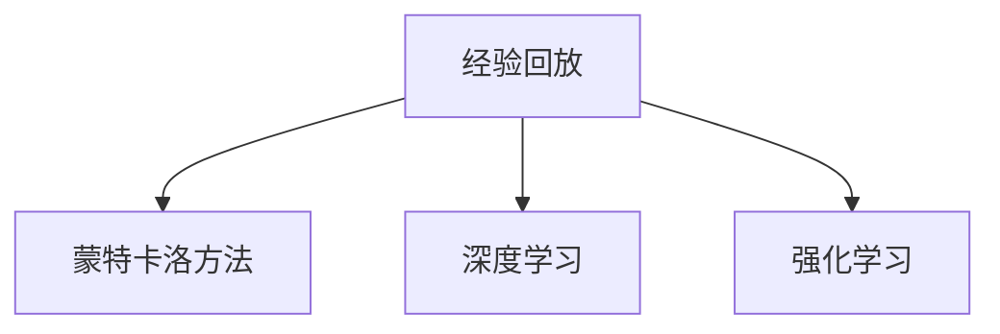

                 

# 一切皆是映射：解析经验回放的原理与代码实现

> 关键词：经验回放(Experience Replay)，强化学习(RL)，蒙特卡洛方法(Monte Carlo Method)，深度学习(Deep Learning)，学习效率提升，样本利用率优化

## 1. 背景介绍

### 1.1 问题由来
在深度学习尤其是强化学习(Reinforcement Learning, RL)领域，如何高效地利用有限的训练样本，是提高学习效率、优化学习结果的关键问题之一。随着训练数据量的增大和模型复杂度的提升，深度学习模型对样本的使用效率提出了更高的要求。这不仅能够降低训练成本，还能减少过拟合风险，提高模型的泛化能力。

经验回放(Experience Replay)技术正是在这样的背景下诞生的。它通过将历史经验样本重新抽取并用于训练，实现了对有限样本的多次使用，从而提高了模型的训练效果。

### 1.2 问题核心关键点
经验回放的核心在于，它将历史经验样本通过一种随机的方式重新抽取，进行多次微小的更新。这种方法允许模型学习到更加鲁棒的特征表示，并且可以在计算资源有限的情况下，有效提升模型的训练效率。具体来说，通过经验回放，模型可以：

1. 减少对新样本的依赖，避免训练初期由于样本较少导致的过拟合。
2. 允许模型学习到更加鲁棒的特征表示，增强模型的泛化能力。
3. 提高样本利用率，在有限的训练资源下获得更好的学习效果。

因此，经验回放技术成为深度学习和强化学习中不可或缺的一部分，广泛应用于自监督学习、生成对抗网络、深度强化学习等场景中。

## 2. 核心概念与联系

### 2.1 核心概念概述

为更好地理解经验回放技术的原理和实现，本节将介绍几个密切相关的核心概念：

- 经验回放(Experience Replay)：一种基于蒙特卡洛方法(Monte Carlo Method)的技术，用于将历史经验样本重新抽取并用于训练，以提高样本利用率和训练效果。
- 蒙特卡洛方法：一种随机化计算方法，通过多次抽样样本并统计平均值来估计复杂系统的期望值。在经验回放中，蒙特卡洛方法用于随机抽取历史经验样本，用于模型的训练。
- 深度学习：基于神经网络的机器学习技术，通过反向传播算法不断优化模型参数，学习数据的内在表示。在经验回放中，深度学习模型用于根据抽取的历史经验样本进行参数更新。
- 强化学习：一种通过智能体与环境的交互，学习最优策略的机器学习方法。在经验回放中，智能体通过与环境的交互，积累经验数据，并通过经验回放技术提升模型性能。

这些核心概念之间的逻辑关系可以通过以下Mermaid流程图来展示：



这个流程图展示经验回放技术的核心概念及其之间的关系：

1. 经验回放通过蒙特卡洛方法，随机抽取历史经验样本。
2. 经验回放结合深度学习，通过抽取的历史经验样本进行模型参数更新。
3. 经验回放在强化学习中，用于智能体与环境的交互中积累经验，并提升模型性能。

这些概念共同构成了经验回放技术的框架，使其能够在各种深度学习和强化学习任务中发挥重要作用。

## 3. 核心算法原理 & 具体操作步骤

### 3.1 算法原理概述

经验回放算法的基本思想是，将历史经验样本以一定的概率重新抽取，并用于模型的训练。这一过程允许模型在有限的样本量下，进行多次微小的更新，从而提高模型的学习效率和泛化能力。

具体来说，经验回放过程包含以下几个关键步骤：

1. **样本抽取**：从历史经验数据集中随机抽取一组样本，用于训练模型。
2. **样本存储**：将抽取的样本存储在经验池中，以便后续抽取使用。
3. **样本更新**：从经验池中随机抽取样本，更新模型参数。
4. **样本重复使用**：样本可以在多次抽取中重复使用，以提高样本利用率。

经验回放算法通过上述步骤，实现了对有限样本的多次使用，从而提高了模型的训练效果。

### 3.2 算法步骤详解

经验回放的实现过程主要包括以下几个关键步骤：

**Step 1: 准备经验数据集**
- 将历史经验数据集划分为训练集和测试集。
- 从训练集中随机抽取一定数量的样本，形成经验池。

**Step 2: 定义样本更新策略**
- 定义样本更新频率和经验池大小。
- 选择合适的采样策略，如随机采样、分层采样等。

**Step 3: 抽取和更新样本**
- 从经验池中随机抽取样本，用于模型的前向传播和参数更新。
- 更新模型的参数，记录更新后的状态。

**Step 4: 存储和重复使用样本**
- 将更新后的样本重新存储回经验池中，供后续抽取使用。
- 重复上述步骤，直至训练完成或达到预设的迭代次数。

### 3.3 算法优缺点

经验回放技术具有以下优点：

1. **提高样本利用率**：通过经验回放，历史经验样本可以在多次微小的更新中被使用，从而提高样本利用率。
2. **减少对新样本的依赖**：经验回放允许模型在有限的样本量下进行多次更新，减少对新样本的依赖。
3. **提高训练效果**：通过多次微小的更新，模型可以学习到更加鲁棒的特征表示，增强模型的泛化能力。

同时，经验回放技术也存在一些局限性：

1. **样本过时性**：历史经验样本可能已不再代表当前任务的真实情况，导致训练效果降低。
2. **存储开销大**：经验池需要存储大量的历史样本，增加了存储开销。
3. **更新频率限制**：频繁更新模型参数会增加计算负担，可能导致训练效率下降。

尽管存在这些局限性，经验回放技术仍是大规模学习任务中一种非常有效的方法，广泛应用于深度学习、强化学习等多个领域。

### 3.4 算法应用领域

经验回放技术主要应用于以下领域：

1. **深度强化学习**：在强化学习中，智能体通过与环境的交互，积累经验数据。经验回放技术通过多次微小的更新，提升模型性能。
2. **自监督学习**：在自监督学习中，模型通过未标注数据进行训练。经验回放技术允许模型在有限的未标注数据下，进行多次微小的更新，提升模型的泛化能力。
3. **生成对抗网络**：在生成对抗网络中，生成器和判别器通过对抗训练不断优化模型。经验回放技术通过多次微小的更新，提升生成器和判别器的泛化能力。
4. **自然语言处理**：在自然语言处理中，模型通过历史文本数据进行训练。经验回放技术允许模型在有限的文本数据下，进行多次微小的更新，提升模型的泛化能力。

除了上述这些领域，经验回放技术还广泛应用于计算机视觉、语音识别、图像生成等多个NLP任务中，为数据高效利用提供了重要手段。

## 4. 数学模型和公式 & 详细讲解 & 举例说明

### 4.1 数学模型构建

本节将使用数学语言对经验回放算法的原理进行更加严格的刻画。

假设经验数据集为 $D=\{(x_i,y_i)\}_{i=1}^N, x_i \in \mathcal{X}, y_i \in \mathcal{Y}$，其中 $\mathcal{X}$ 为输入空间，$\mathcal{Y}$ 为输出空间。

定义模型 $M_{\theta}$ 在输入 $x$ 上的预测输出为 $\hat{y}=M_{\theta}(x) \in \mathcal{Y}$，损失函数为 $\ell(\hat{y},y)$。

经验回放算法通过以下步骤实现模型训练：

1. **样本抽取**：从经验数据集 $D$ 中随机抽取 $M$ 个样本 $(x_i,y_i)$。
2. **样本更新**：对每个样本 $(x_i,y_i)$，计算损失函数 $\ell(\hat{y},y)$，更新模型参数 $\theta$。
3. **经验池存储**：将更新后的模型参数 $\theta$ 存储在经验池中。

经验回放算法的损失函数为：

$$
\mathcal{L}(\theta) = \frac{1}{M}\sum_{i=1}^M \ell(M_{\theta}(x_i),y_i)
$$

其中 $M$ 为每次抽取的样本数量。

### 4.2 公式推导过程

以下我们以一个简单的回归任务为例，推导经验回放算法的具体实现细节。

假设模型 $M_{\theta}$ 在输入 $x$ 上的预测输出为 $\hat{y}=M_{\theta}(x)$，真实标签 $y$ 服从正态分布 $y \sim N(\mu, \sigma^2)$。则经验回放算法的损失函数为：

$$
\ell(y,\hat{y}) = \frac{1}{2}(y - \hat{y})^2
$$

经验回放算法的损失函数可以写为：

$$
\mathcal{L}(\theta) = \frac{1}{M}\sum_{i=1}^M \frac{1}{2}(y_i - M_{\theta}(x_i))^2
$$

在经验回放过程中，每次从经验数据集 $D$ 中随机抽取 $M$ 个样本，并计算其损失函数。具体步骤如下：

1. **样本抽取**：从 $D$ 中随机抽取 $M$ 个样本 $(x_i,y_i)$。
2. **样本更新**：对每个样本 $(x_i,y_i)$，计算损失函数 $\ell(y_i,\hat{y}_i)$，更新模型参数 $\theta$。
3. **经验池存储**：将更新后的模型参数 $\theta$ 存储在经验池中。

### 4.3 案例分析与讲解

考虑一个简单的回归任务，模型 $M_{\theta}$ 的结构为 $M_{\theta}(x) = \theta_0 + \theta_1 x_1 + \theta_2 x_2$，其中 $x = (x_1, x_2)$，$\theta = (\theta_0, \theta_1, \theta_2)$。经验数据集 $D$ 包含 $N$ 个样本，每个样本包含 $x$ 和 $y$ 两个变量。

假设从 $D$ 中随机抽取 $M=4$ 个样本 $(x_i,y_i)$，更新模型参数 $\theta$。经验回放算法的具体实现步骤如下：

1. **样本抽取**：从 $D$ 中随机抽取 4 个样本 $(x_1, x_2)$ 和 $y$。
2. **样本更新**：对每个样本 $(x_i,y_i)$，计算损失函数 $\ell(y_i,\hat{y}_i)$，更新模型参数 $\theta$。
3. **经验池存储**：将更新后的模型参数 $\theta$ 存储在经验池中。

假设抽取的样本为 $(2,3), (3,4), (4,2), (5,1)$，更新后的模型参数为 $(\theta_0', \theta_1', \theta_2')$，则更新过程如下：

$$
\begin{aligned}
\theta_0' &= \theta_0 - \frac{\lambda}{4}((2,3) - M_{\theta}(2,3)) + \frac{\lambda}{4}((3,4) - M_{\theta}(3,4)) + \frac{\lambda}{4}((4,2) - M_{\theta}(4,2)) + \frac{\lambda}{4}((5,1) - M_{\theta}(5,1)) \\
\theta_1' &= \theta_1 - \frac{\lambda}{4}((2,3) - M_{\theta}(2,3)) + \frac{\lambda}{4}((3,4) - M_{\theta}(3,4)) + \frac{\lambda}{4}((4,2) - M_{\theta}(4,2)) + \frac{\lambda}{4}((5,1) - M_{\theta}(5,1)) \\
\theta_2' &= \theta_2 - \frac{\lambda}{4}((2,3) - M_{\theta}(2,3)) + \frac{\lambda}{4}((3,4) - M_{\theta}(3,4)) + \frac{\lambda}{4}((4,2) - M_{\theta}(4,2)) + \frac{\lambda}{4}((5,1) - M_{\theta}(5,1))
\end{aligned}
$$

其中 $\lambda$ 为学习率。

## 5. 项目实践：代码实例和详细解释说明

### 5.1 开发环境搭建

在进行经验回放算法的实践前，我们需要准备好开发环境。以下是使用Python进行TensorFlow开发的环境配置流程：

1. 安装Anaconda：从官网下载并安装Anaconda，用于创建独立的Python环境。

2. 创建并激活虚拟环境：
```bash
conda create -n tf-env python=3.8 
conda activate tf-env
```

3. 安装TensorFlow：根据CUDA版本，从官网获取对应的安装命令。例如：
```bash
conda install tensorflow -c conda-forge
```

4. 安装NumPy、Pandas等各类工具包：
```bash
pip install numpy pandas matplotlib scikit-learn tensorflow
```

完成上述步骤后，即可在`tf-env`环境中开始经验回放的实践。

### 5.2 源代码详细实现

这里我们以一个简单的回归任务为例，使用TensorFlow实现经验回放算法。

首先，定义回归任务的数据处理函数：

```python
import tensorflow as tf
import numpy as np
import random

def generate_data(n_samples):
    x = np.random.randn(n_samples, 2)
    y = np.random.randn(n_samples) + np.dot(x, [1, 2]) + 3
    return x, y
```

然后，定义模型和优化器：

```python
def build_model():
    x = tf.keras.Input(shape=(2,))
    y = tf.keras.layers.Dense(1, activation='linear')(x)
    model = tf.keras.Model(inputs=x, outputs=y)
    optimizer = tf.keras.optimizers.SGD(learning_rate=0.01)
    return model, optimizer

x_train, y_train = generate_data(100)
x_test, y_test = generate_data(50)

model, optimizer = build_model()
```

接着，定义训练和评估函数：

```python
def train_epoch(model, optimizer, x_train, y_train):
    for i in range(100):
        batch_size = 4
        indices = random.sample(range(len(x_train)), batch_size)
        x_batch, y_batch = x_train[indices], y_train[indices]
        with tf.GradientTape() as tape:
            y_pred = model(x_batch)
            loss = tf.reduce_mean(tf.square(y_pred - y_batch))
        gradients = tape.gradient(loss, model.trainable_variables)
        optimizer.apply_gradients(zip(gradients, model.trainable_variables))

def evaluate(model, x_test, y_test):
    y_pred = model.predict(x_test)
    mse = tf.reduce_mean(tf.square(y_pred - y_test))
    return mse.numpy()
```

最后，启动训练流程并在测试集上评估：

```python
train_epoch(model, optimizer, x_train, y_train)
mse = evaluate(model, x_test, y_test)
print(f'Mean Squared Error: {mse}')
```

以上就是使用TensorFlow实现经验回放算法的完整代码实现。可以看到，TensorFlow提供了高效的API来构建模型、定义优化器以及进行模型训练和评估。

### 5.3 代码解读与分析

让我们再详细解读一下关键代码的实现细节：

**generate_data函数**：
- 生成100个样本的训练数据集和50个样本的测试数据集。每个样本包含2个特征和一个真实标签。

**build_model函数**：
- 定义一个包含一个全连接层的回归模型。
- 使用随机梯度下降(Stochastic Gradient Descent, SGD)优化器进行模型训练。

**train_epoch函数**：
- 对模型进行100次迭代训练，每次抽取4个样本作为训练集。
- 计算模型的损失函数，并使用SGD优化器更新模型参数。

**evaluate函数**：
- 在测试集上评估模型的预测误差，输出均方误差(Mean Squared Error, MSE)。

在实际应用中，经验回放算法的性能还需要根据具体任务进行优化调整。如选择合适的样本更新频率、经验池大小等，以及合理设置学习率和采样策略等。同时，需要关注训练过程中的过拟合问题，如引入Dropout等正则化技术。

## 6. 实际应用场景

### 6.1 强化学习中的经验回放

在强化学习中，经验回放技术用于智能体与环境的交互中积累经验，并通过多次微小的更新提升模型性能。强化学习中的经验回放通常包括以下步骤：

1. **样本抽取**：智能体通过与环境交互，积累经验数据。
2. **样本更新**：从经验池中随机抽取样本，更新模型参数。
3. **经验池存储**：将更新后的模型参数存储在经验池中。

经验回放在强化学习中具有重要作用，如Q-learning、Deep Q-Networks等算法中广泛应用。通过经验回放，智能体能够在有限的训练样本下，进行多次微小的更新，从而提升模型的泛化能力和鲁棒性。

### 6.2 深度学习中的经验回放

在深度学习中，经验回放技术用于模型训练的优化。通过多次微小的更新，模型能够学习到更加鲁棒的特征表示，提升模型的泛化能力。深度学习中的经验回放通常包括以下步骤：

1. **样本抽取**：从历史数据集中随机抽取样本，用于模型的前向传播和参数更新。
2. **样本更新**：更新模型的参数，记录更新后的状态。
3. **经验池存储**：将更新后的模型参数存储在经验池中。

经验回放在深度学习中广泛应用于自监督学习、生成对抗网络等领域。通过经验回放，模型能够在有限的训练样本下，进行多次微小的更新，从而提高样本利用率和模型性能。

### 6.3 实际应用场景分析

经验回放在实际应用中，能够显著提高模型的训练效率和泛化能力。以下是几个具体的实际应用场景：

**自动驾驶中的路径规划**
- 在自动驾驶中，智能体通过传感器获取环境数据，进行路径规划。经验回放技术允许智能体在有限的路径规划样本下，进行多次微小的更新，提升模型的路径规划能力。

**金融预测中的风险控制**
- 在金融预测中，模型通过历史数据进行训练。经验回放技术允许模型在有限的金融数据下，进行多次微小的更新，提升模型的风险控制能力。

**自然语言处理中的情感分析**
- 在情感分析中，模型通过历史文本数据进行训练。经验回放技术允许模型在有限的文本数据下，进行多次微小的更新，提升模型的情感分析能力。

## 7. 工具和资源推荐

### 7.1 学习资源推荐

为了帮助开发者系统掌握经验回放技术的原理和实践技巧，这里推荐一些优质的学习资源：

1. 《深度学习》书籍：Ian Goodfellow等人编写，全面介绍了深度学习的理论和实践，包括经验回放技术。

2. CS231n《深度学习视觉识别》课程：斯坦福大学开设的深度学习课程，介绍了深度学习在计算机视觉中的应用，包括经验回放技术。

3. 《强化学习》书籍：Richard Sutton和Andrew Barto编写，全面介绍了强化学习的理论和实践，包括经验回放技术。

4. arXiv上的相关论文：选择与经验回放技术相关的论文进行阅读，获取最新的研究进展和实践经验。

5. TensorFlow官方文档：TensorFlow的官方文档，提供了详细的经验回放算法的实现和应用示例。

通过对这些资源的学习实践，相信你一定能够快速掌握经验回放技术的精髓，并用于解决实际的NLP问题。

### 7.2 开发工具推荐

高效的开发离不开优秀的工具支持。以下是几款用于经验回放开发的常用工具：

1. TensorFlow：由Google主导开发的开源深度学习框架，支持复杂的深度学习模型和高效的经验回放算法实现。

2. PyTorch：由Facebook主导开发的开源深度学习框架，提供了丰富的优化器和正则化技术，支持高效的经验回放算法实现。

3. Keras：由François Chollet开发的高层次深度学习API，支持快速构建和训练深度学习模型，包括经验回放算法。

4. Scikit-learn：Python的机器学习库，提供了高效的回归和分类模型，支持经验回放算法实现。

5. Jupyter Notebook：Python的交互式开发环境，支持Python代码的实时执行和可视化展示，适合经验回放算法的调试和验证。

合理利用这些工具，可以显著提升经验回放算法的开发效率，加快创新迭代的步伐。

### 7.3 相关论文推荐

经验回放技术的发展源于学界的持续研究。以下是几篇奠基性的相关论文，推荐阅读：

1. "Playing Atari with Transformer Models"：通过经验回放技术，展示了Transformer模型在强化学习中的潜力。

2. "Experience Replay"：经验回放技术的经典论文，详细介绍了经验回放算法的实现和应用。

3. "Deep Reinforcement Learning with Linear Function Approximation"：介绍了基于经验回放的深度强化学习算法，展示了经验回放技术在强化学习中的应用。

4. "Efficient Learning of Deep Networks: Experiments on ImageNet"：通过经验回放技术，展示了深度神经网络在图像识别任务中的高效学习。

5. "Experience Replay for Automated Policy Learning"：详细介绍了经验回放技术在自动化策略学习中的应用，展示了经验回放技术在实际问题中的高效性。

这些论文代表了大规模学习任务中经验回放技术的发展脉络。通过学习这些前沿成果，可以帮助研究者把握学科前进方向，激发更多的创新灵感。

## 8. 总结：未来发展趋势与挑战

### 8.1 总结

本文对经验回放算法的原理和实现进行了全面系统的介绍。首先阐述了经验回放算法的背景和核心思想，明确了其在深度学习和强化学习中的重要作用。其次，从原理到实践，详细讲解了经验回放算法的数学原理和关键步骤，给出了经验回放算法的完整代码实例。同时，本文还广泛探讨了经验回放算法在多个领域的应用场景，展示了其在提高学习效率和泛化能力方面的巨大潜力。

通过本文的系统梳理，可以看到，经验回放算法已经成为深度学习和强化学习中不可或缺的一部分，极大地提高了模型的学习效率和泛化能力。经验回放技术的应用范围将进一步扩大，为大规模学习任务提供更加高效、稳健的算法支持。

### 8.2 未来发展趋势

展望未来，经验回放技术将呈现以下几个发展趋势：

1. **更高效的数据利用**：未来的经验回放算法将更加注重数据的高效利用，通过更智能的样本选择和更新策略，提高数据的使用效率。

2. **深度强化学习中的广泛应用**：经验回放技术在深度强化学习中具有重要地位，未来将在更多复杂的强化学习任务中得到广泛应用。

3. **跨领域学习的融合**：经验回放技术将与其他机器学习方法如自监督学习、生成对抗网络等进行更深入的融合，提升模型在多领域任务中的性能。

4. **鲁棒性和安全性提升**：经验回放技术将通过引入鲁棒性训练、对抗训练等技术，提高模型对异常样本的鲁棒性，提升系统的安全性。

5. **与认知科学的结合**：未来的经验回放算法将更多地借鉴认知科学的研究成果，通过模拟人类学习机制，提升模型的智能水平。

### 8.3 面临的挑战

尽管经验回放算法已经取得了显著成效，但在应用过程中仍面临一些挑战：

1. **计算资源开销大**：经验回放算法需要存储大量的历史经验数据，对计算资源提出了较高要求。如何降低计算资源开销，提高算法的效率，是一个重要问题。

2. **数据质量问题**：经验回放算法依赖于高质量的历史数据，如果数据质量差，模型性能将受到影响。如何保证数据质量，提高模型的鲁棒性，是一个重要问题。

3. **模型的可解释性**：经验回放算法的黑箱性质，使得模型缺乏可解释性，难以进行调试和优化。如何增强模型的可解释性，提高模型的可操作性，是一个重要问题。

4. **应用的普适性**：经验回放算法在不同任务中的应用效果存在差异，如何推广应用到更多任务，是一个重要问题。

### 8.4 研究展望

面对经验回放算法面临的挑战，未来的研究需要在以下几个方面寻求新的突破：

1. **高效的数据存储和处理**：通过压缩、稀疏化等技术，降低历史数据存储的开销，提高数据处理效率。

2. **数据质量提升**：引入数据清洗、数据增强等技术，提升历史数据的质量，提高模型的鲁棒性。

3. **增强模型的可解释性**：引入可解释性技术，如模型蒸馏、可视化等，增强模型的可操作性和可解释性。

4. **推动跨领域融合**：通过与其他机器学习方法如自监督学习、生成对抗网络等的融合，提升模型在多领域任务中的性能。

这些研究方向的发展，必将推动经验回放算法在更多领域中的广泛应用，为人工智能技术的发展注入新的动力。

## 9. 附录：常见问题与解答

**Q1：经验回放算法是否适用于所有深度学习任务？**

A: 经验回放算法在大多数深度学习任务中都能取得不错的效果，特别是对于数据量较小的任务。但对于一些特定领域的任务，如医学、法律等，仅仅依靠通用数据集可能难以很好地适应。此时需要在特定领域的数据集上进一步预训练，再进行经验回放，才能获得理想效果。

**Q2：经验回放算法中学习率的设定有哪些技巧？**

A: 经验回放算法中的学习率一般要比预训练时小1-2个数量级，以保证经验回放的有效性。常见的技巧包括：
1. 初始学习率设置：通过小批量训练，初始学习率设置为预训练时的0.01到0.001倍。
2. 学习率衰减：随着训练的进行，逐步降低学习率，如线性衰减、指数衰减等。
3. 学习率调整：通过监控训练过程中的指标，如损失函数、验证集性能等，动态调整学习率。

**Q3：经验回放算法中经验池的大小应如何选择？**

A: 经验池的大小应根据具体任务和数据量进行选择。一般来说，经验池的大小应设置得足够大，以保证能够抽取到足够多的样本进行更新。但同时，经验池大小也不能过大，以避免存储空间开销过大。经验池大小的选择需要根据实际应用情况进行灵活调整。

**Q4：经验回放算法中样本更新的频率应如何选择？**

A: 样本更新的频率应根据具体任务和数据量进行选择。一般来说，样本更新的频率应设置为每轮训练的1/3到1/2，以保证模型的稳定性和更新效率。但同时，样本更新的频率也不能过高，以避免过度更新和计算负担。样本更新频率的选择需要根据实际应用情况进行灵活调整。

**Q5：经验回放算法中如何避免过拟合？**

A: 经验回放算法中，过拟合可以通过以下方法进行避免：
1. 引入Dropout等正则化技术，抑制模型的过拟合。
2. 增加训练数据量，提高模型的泛化能力。
3. 使用交叉验证等方法，评估模型的泛化能力，避免过拟合。

这些方法可以结合使用，以提高模型的泛化能力和稳定性。

