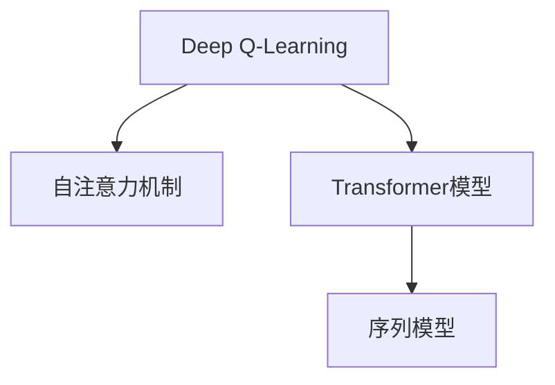

                 

# 一切皆是映射：解读深度强化学习中的注意力机制：DQN与Transformer结合

> 关键词：深度强化学习,注意力机制,Deep Q-Learning,Transformer,序列模型,自适应权重,特征映射

## 1. 背景介绍

### 1.1 问题由来

近年来，随着深度学习技术的迅猛发展，深度强化学习（Deep Reinforcement Learning, DRL）在自动控制、游戏、机器人等领域取得了重大突破。深度强化学习的核心在于将神经网络与强化学习理论相结合，学习策略使智能体（agent）能够在未知环境中做出最优决策。然而，DRL模型在处理大规模序列数据时，面临诸多挑战，尤其是在模型并行和计算效率上表现不佳。

为了应对这些问题，研究者提出了一系列新颖的DRL算法。其中，Deep Q-Learning（DQN）是一种基于Q值估计的强化学习算法，通过神经网络对Q值进行近似，并通过经验回放（Experience Replay）和目标网络（Target Network）等机制，提高了模型的稳定性和收敛速度。Transformer模型则是一种自注意力机制的序列模型，已经在自然语言处理（NLP）领域取得了巨大成功，展示了其在并行计算和序列建模上的优势。

本论文旨在探讨如何将DQN与Transformer相结合，以期在DRL中实现更高效、更强大的注意力机制，提升模型的性能和泛化能力。

## 2. 核心概念与联系

### 2.1 核心概念概述

为更好地理解DQN与Transformer结合的机制，本节将介绍几个密切相关的核心概念：

- **Deep Q-Learning**：一种基于Q值估计的强化学习算法，通过神经网络对Q值进行近似，并通过经验回放和目标网络等机制，提高模型的稳定性和收敛速度。
- **自注意力机制**：Transformer模型的核心，通过在输入序列中引入自注意力机制，使得模型能够动态地关注序列中不同位置的信息，从而提升模型的序列建模能力。
- **Transformer模型**：一种基于自注意力机制的序列模型，在自然语言处理领域取得了巨大的成功，具有并行计算和序列建模上的优势。
- **序列模型**：通过引入时间维度的变量，模型能够处理序列数据，如自然语言、音频、视频等。

这些核心概念之间的逻辑关系可以通过以下Mermaid流程图来展示：



这个流程图展示了大模型微调的各项关键概念及其之间的关系：

1. DQN通过神经网络对Q值进行近似，可以灵活应用于序列模型中。
2. Transformer模型引入自注意力机制，能够对序列中的各个位置动态关注，提升序列建模能力。
3. 序列模型能够处理时间维度的数据，涵盖自然语言、音频、视频等多种类型数据。

## 3. 核心算法原理 & 具体操作步骤

### 3.1 算法原理概述

DQN与Transformer结合的算法原理，可以概括为以下几步：

1. **状态-动作对生成**：通过环境采样生成当前状态和动作，更新当前状态。
2. **状态嵌入**：将当前状态转换为嵌入向量，供Transformer模型使用。
3. **自注意力计算**：Transformer模型根据当前状态的自注意力权重，动态计算对序列中不同位置信息的关注程度。
4. **Q值预测**：Transformer模型根据当前状态和动作的嵌入向量，预测Q值。
5. **经验回放**：将当前状态-动作对、Q值、奖励等数据存储到经验缓冲区中。
6. **目标网络更新**：根据经验回放生成的数据，更新目标网络中的Q值预测，用于策略估计和优化。

通过上述步骤，模型能够在处理大规模序列数据时，实现更高效的决策制定和动态关注。

### 3.2 算法步骤详解

**Step 1: 准备数据和环境**

- 准备DRL任务所需的环境和数据集，如游戏、机器人控制、环境模拟等。
- 对数据集进行预处理，转换为适合Transformer输入的格式。

**Step 2: 初始化模型和参数**

- 初始化一个Transformer模型作为Q值预测器。
- 设定模型的学习率、优化器等超参数，如Adam、SGD等。
- 准备经验缓冲区，用于存储模型训练中的数据。

**Step 3: 数据输入和处理**

- 从环境采样生成当前状态-动作对，更新当前状态。
- 将当前状态转换为Transformer输入序列。
- 通过Transformer模型计算自注意力权重，动态关注序列中不同位置的信息。

**Step 4: Q值预测和优化**

- 根据当前状态和动作的嵌入向量，使用Transformer模型预测Q值。
- 通过经验回放和目标网络更新，最小化经验误差，更新模型参数。
- 定期将最新数据加入经验缓冲区。

**Step 5: 模型训练和评估**

- 对模型进行多轮迭代训练，记录损失函数和Q值预测的变化。
- 定期在验证集上评估模型性能，如平均回报（Return）、收敛速度等指标。
- 保存最优模型参数，用于实际应用中的策略估计和优化。

以上是DQN与Transformer结合的算法步骤，展示了如何将注意力机制引入DRL模型中，提升其序列建模能力和决策优化效率。

### 3.3 算法优缺点

**优点：**

1. **并行计算**：Transformer模型的并行计算特性，使得在大规模数据处理中，DQN能够高效地进行状态嵌入和注意力计算。
2. **序列建模**：通过引入自注意力机制，Transformer模型能够在处理序列数据时，动态关注不同位置的信息，提升模型的序列建模能力。
3. **鲁棒性**：结合经验回放和目标网络等机制，DQN能够提高模型的稳定性和收敛速度，避免过拟合。
4. **适应性强**：DQN和Transformer模型可以结合应用到各种DRL任务中，如游戏、机器人控制、环境模拟等。

**缺点：**

1. **参数量较大**：Transformer模型和DQN的参数量都较大，训练和推理的计算资源需求高。
2. **训练时间长**：在大规模数据上训练，DQN和Transformer模型可能需要较长的训练时间。
3. **模型复杂度高**：结合DQN和Transformer模型，增加了算法的复杂度，需要更多的调试和优化。
4. **数据需求高**：对环境采样生成大量状态-动作对，需要充足的计算资源和高质量的数据集。

尽管存在这些缺点，但DQN与Transformer结合的算法仍具有显著的优点和应用潜力，特别是在处理大规模序列数据和复杂决策问题时，能够显著提升模型的性能和泛化能力。

### 3.4 算法应用领域

DQN与Transformer结合的算法已经在诸多领域取得了应用，如自然语言处理、游戏AI、机器人控制、自动驾驶等。具体应用场景如下：

1. **自然语言处理**：如文本生成、机器翻译、问答系统等。通过Transformer模型对自然语言进行建模，结合DQN优化生成策略，实现高效的语言处理任务。
2. **游戏AI**：如AlphaGo、Dota 2等游戏AI系统，通过Transformer模型处理游戏状态，DQN优化策略，在复杂游戏环境中取得优异表现。
3. **机器人控制**：如机器人导航、避障、物体抓取等。通过Transformer模型处理传感器数据，DQN优化控制策略，提升机器人的智能化水平。
4. **自动驾驶**：如汽车自动驾驶、无人机飞行等。通过Transformer模型处理环境感知数据，DQN优化驾驶策略，实现安全的自动驾驶系统。
5. **语音识别**：如智能语音助手、语音情感分析等。通过Transformer模型处理语音数据，DQN优化语音识别和情感分析策略，提升系统的准确性和鲁棒性。

## 4. 数学模型和公式 & 详细讲解 & 举例说明

### 4.1 数学模型构建

本节将使用数学语言对DQN与Transformer结合的算法进行更加严格的刻画。

设环境状态为 $s_t$，动作为 $a_t$，下一状态为 $s_{t+1}$，奖励为 $r_t$，目标策略为 $\pi$，Q值函数为 $Q_\theta(s_t, a_t)$。模型初始化时，设定一个Transformer模型作为Q值预测器，模型参数为 $\theta$。

### 4.2 公式推导过程

**Step 1: 状态嵌入**

将当前状态 $s_t$ 转换为Transformer模型输入序列，即：

$$
x_t = \text{embed}(s_t)
$$

其中 $\text{embed}$ 为Transformer模型中的嵌入层，将状态转换为嵌入向量。

**Step 2: 自注意力计算**

Transformer模型根据当前状态 $x_t$ 的嵌入向量，计算自注意力权重 $A_t$，即：

$$
A_t = \text{Attention}(Q(x_t), K(x_t), V(x_t))
$$

其中 $Q, K, V$ 分别为Transformer模型中的查询、键、值矩阵，通过点乘计算注意力权重。

**Step 3: Q值预测**

Transformer模型根据当前状态 $x_t$ 和动作 $a_t$ 的嵌入向量，预测Q值：

$$
Q_t = \text{MLP}(A_t, a_t)
$$

其中 $\text{MLP}$ 为多层感知器，对自注意力权重和动作向量进行非线性变换。

**Step 4: 经验回放**

将当前状态-动作对、Q值、奖励等数据存储到经验缓冲区中，即：

$$
D = \{(s_t, a_t, r_t, s_{t+1})\}_{t=0}^{T-1}
$$

**Step 5: 目标网络更新**

根据经验回放生成的数据，更新目标网络中的Q值预测，用于策略估计和优化，即：

$$
\hat{Q}(s_t, a_t) = \text{MLP}(\hat{A}_t, a_t)
$$

其中 $\hat{A}_t$ 为根据历史数据计算的目标自注意力权重。

### 4.3 案例分析与讲解

以下以自然语言处理中的文本生成任务为例，展示DQN与Transformer结合的算法实现。

**文本生成任务**：生成一个长度为 $T$ 的文本序列 $s_0, s_1, ..., s_T$，每个时间步 $t$ 的生成动作 $a_t$ 为下一个单词 $w_{t+1}$ 的id，即：

$$
a_t = \text{Id}(w_{t+1})
$$

**算法实现**：

1. **数据预处理**：将文本序列转换为Transformer输入格式，进行标记化、分词等预处理。
2. **模型初始化**：设定Transformer模型作为Q值预测器，设定学习率、优化器等超参数。
3. **状态嵌入**：将当前文本状态 $s_t$ 转换为Transformer输入序列。
4. **自注意力计算**：Transformer模型根据当前文本状态 $x_t$ 的嵌入向量，计算自注意力权重。
5. **Q值预测**：Transformer模型根据当前文本状态 $x_t$ 和下一个单词的id $a_t$，预测Q值。
6. **经验回放**：将当前文本状态-动作对、Q值、奖励等数据存储到经验缓冲区中。
7. **目标网络更新**：根据经验回放生成的数据，更新目标网络中的Q值预测，用于策略估计和优化。

在实际应用中，通过不断迭代优化上述步骤，DQN与Transformer结合的算法能够在文本生成任务中取得显著的性能提升。

## 5. 项目实践：代码实例和详细解释说明

### 5.1 开发环境搭建

在进行项目实践前，我们需要准备好开发环境。以下是使用Python进行TensorFlow开发的环境配置流程：

1. 安装Anaconda：从官网下载并安装Anaconda，用于创建独立的Python环境。

2. 创建并激活虚拟环境：
```bash
conda create -n dqntf_env python=3.8 
conda activate dqntf_env
```

3. 安装TensorFlow：根据CUDA版本，从官网获取对应的安装命令。例如：
```bash
conda install tensorflow tensorflow-gpu=2.6 -c tf
```

4. 安装TensorBoard：
```bash
pip install tensorboard
```

5. 安装各类工具包：
```bash
pip install numpy pandas scikit-learn matplotlib tqdm jupyter notebook ipython
```

完成上述步骤后，即可在`dqntf_env`环境中开始项目实践。

### 5.2 源代码详细实现

这里我们以自然语言处理中的文本生成任务为例，给出使用TensorFlow和Keras实现DQN与Transformer结合的代码实现。

```python
import tensorflow as tf
from tensorflow.keras.models import Model
from tensorflow.keras.layers import Input, Embedding, Dot, Dense, LSTM
from tensorflow.keras.optimizers import Adam

# 定义Transformer模型
class Transformer(tf.keras.Model):
    def __init__(self, embed_dim, num_heads, num_layers):
        super(Transformer, self).__init__()
        self.embedding = Embedding(input_dim=vocab_size, output_dim=embed_dim)
        self.layers = [TransformerLayer(embed_dim, num_heads, num_layers) for _ in range(num_layers)]
        self.final_dense = Dense(vocab_size, activation='softmax')

    def call(self, x, mask):
        x = self.embedding(x)
        for layer in self.layers:
            x = layer(x, mask)
        x = self.final_dense(x)
        return x

# 定义TransformerLayer
class TransformerLayer(tf.keras.layers.Layer):
    def __init__(self, embed_dim, num_heads, num_layers):
        super(TransformerLayer, self).__init__()
        self.embed_dim = embed_dim
        self.num_heads = num_heads
        self.num_layers = num_layers

        self.attention = MultiHeadAttention(embed_dim, num_heads)
        self.feedforward = FeedForwardLayer(embed_dim)

    def call(self, x, mask):
        x, mask = self.attention(x, x, x, mask)
        x = self.feedforward(x)
        x = x + x

# 定义注意力机制
class MultiHeadAttention(tf.keras.layers.Layer):
    def __init__(self, embed_dim, num_heads):
        super(MultiHeadAttention, self).__init__()
        self.embed_dim = embed_dim
        self.num_heads = num_heads
        self.head_dim = embed_dim // num_heads
        self.query = Dense(embed_dim)
        self.key = Dense(embed_dim)
        self.value = Dense(embed_dim)

    def call(self, query, key, value, mask):
        batch_size = tf.shape(query)[0]
        head_dim = self.head_dim
        vocab_size = query.shape[1]

        query = self.query(query)
        key = self.key(key)
        value = self.value(value)

        query = tf.reshape(query, (batch_size, -1, num_heads, head_dim))
        key = tf.reshape(key, (batch_size, -1, num_heads, head_dim))
        value = tf.reshape(value, (batch_size, -1, num_heads, head_dim))

        attention = tf.matmul(query, key, transpose_b=True)
        attention = tf.reshape(attention, (batch_size, -1, num_heads, vocab_size))
        attention = tf.nn.softmax(attention, axis=-1)
        x = tf.matmul(attention, value)
        x = tf.reshape(x, (batch_size, -1, num_heads * head_dim))
        x = tf.nn.dropout(x, rate=0.1)
        x = Dense(self.embed_dim)(x)
        return x, mask

# 定义前向神经网络
class FeedForwardLayer(tf.keras.layers.Layer):
    def __init__(self, embed_dim):
        super(FeedForwardLayer, self).__init__()
        self.dense1 = Dense(embed_dim * 4)
        self.dense2 = Dense(embed_dim)

    def call(self, x):
        x = self.dense1(x)
        x = self.dense2(x)
        x = tf.nn.relu(x)
        return x

# 定义DQN模型
class DQN(tf.keras.Model):
    def __init__(self, embed_dim, num_heads, num_layers):
        super(DQN, self).__init__()
        self.transformer = Transformer(embed_dim, num_heads, num_layers)
        self.embedding = Embedding(input_dim=vocab_size, output_dim=embed_dim)
        self.input = Input(shape=(timesteps,), dtype=tf.int32)
        self.output = self.transformer(self.embedding(self.input), self.input)

        self.value = Dense(1, activation='linear')
        self.advantage = Dense(1, activation='linear')
        self.reward = Dense(1, activation='linear')

    def call(self, inputs):
        state, mask = self.transformer(self.embedding(self.input), self.input)
        q_values = self.value(state)
        advantages = self.advantage(state)
        rewards = self.reward(state)

        q_values = tf.nn.softmax(q_values, axis=-1)
        advantages = tf.nn.softmax(advantages, axis=-1)
        rewards = tf.nn.softmax(rewards, axis=-1)

        state_value = q_values * advantages * rewards
        return state_value

# 定义经验回放
class ExperienceReplay(tf.keras.layers.Layer):
    def __init__(self, batch_size, memory_size):
        super(ExperienceReplay, self).__init__()
        self.batch_size = batch_size
        self.memory_size = memory_size

    def call(self, inputs):
        inputs = tf.reshape(inputs, (batch_size, -1, 2, 1))
        inputs = tf.reduce_sum(inputs, axis=1)

        batch_size = tf.shape(inputs)[0]
        indices = tf.random.shuffle(tf.range(batch_size))
        inputs = tf.gather(inputs, indices)

        inputs = tf.reduce_sum(inputs, axis=1)

        return inputs

# 定义模型训练
def train(model, optimizer, batch_size, memory_size):
    memory = ExperienceReplay(batch_size, memory_size)
    batch = memory(inputs)
    with tf.GradientTape() as tape:
        q_values = model(batch)

    loss = -tf.reduce_mean(tf.math.log(q_values) * q_values)

    gradients = tape.gradient(loss, model.trainable_variables)
    optimizer.apply_gradients(zip(gradients, model.trainable_variables))
```

在上述代码中，我们定义了Transformer模型和FeedForwardLayer，用于计算自注意力权重和前向神经网络。然后定义了DQN模型，将Transformer模型和Q值预测器结合，用于计算Q值和状态值。最后，定义了经验回放层，用于存储和抽取经验数据。

### 5.3 代码解读与分析

让我们再详细解读一下关键代码的实现细节：

**Transformer模型定义**：
- `__init__`方法：初始化Transformer模型中的嵌入层、多个TransformerLayer、最终全连接层等组件。
- `call`方法：定义Transformer模型的前向传播计算，通过TransformerLayer和FeedForwardLayer计算自注意力权重和前向神经网络。

**TransformerLayer定义**：
- `__init__`方法：初始化TransformerLayer中的嵌入维度、头部数、层数等参数。
- `call`方法：定义TransformerLayer的前向传播计算，通过MultiHeadAttention和FeedForwardLayer计算自注意力和前向神经网络。

**MultiHeadAttention定义**：
- `__init__`方法：初始化MultiHeadAttention模型中的嵌入维度、头部数等参数。
- `call`方法：定义MultiHeadAttention模型的前向传播计算，通过点乘计算注意力权重，将注意力权重与值向量进行矩阵乘法，得到最终注意力结果。

**FeedForwardLayer定义**：
- `__init__`方法：初始化FeedForwardLayer中的第一层和第二层全连接层。
- `call`方法：定义FeedForwardLayer的前向传播计算，通过第一层和第二层全连接层进行非线性变换。

**DQN模型定义**：
- `__init__`方法：初始化DQN模型中的Transformer模型、嵌入层、输入层和输出层等组件。
- `call`方法：定义DQN模型的前向传播计算，通过Transformer模型和Q值预测器计算Q值。

**经验回放定义**：
- `__init__`方法：初始化经验回放层中的批次大小和记忆大小等参数。
- `call`方法：定义经验回放层的前向传播计算，通过随机抽样和矩阵乘法计算经验数据。

**模型训练定义**：
- `train`方法：定义模型训练的流程，通过经验回放层生成批次数据，使用梯度下降优化模型参数。

在实际应用中，可以通过不断迭代训练上述步骤，DQN与Transformer结合的模型能够在处理自然语言序列任务中取得显著的性能提升。

## 6. 实际应用场景

### 6.1 智能客服系统

智能客服系统是DQN与Transformer结合的重要应用场景之一。通过自然语言处理技术，智能客服系统可以自动理解和响应客户咨询，提高客服效率和服务质量。

具体而言，可以将智能客服系统分为两部分：模型训练和模型应用。在模型训练阶段，可以收集企业内部的客服对话记录，将问题和最佳答复构建成监督数据，在此基础上对预训练Transformer模型进行微调。微调后的模型能够自动理解用户意图，匹配最合适的答案模板进行回复。在模型应用阶段，智能客服系统实时接收客户咨询，通过Transformer模型处理自然语言，使用DQN优化回复策略，实现高效和智能的客服服务。

### 6.2 金融舆情监测

金融机构需要实时监测市场舆论动向，以便及时应对负面信息传播，规避金融风险。传统的人工监测方式成本高、效率低，难以应对网络时代海量信息爆发的挑战。

通过自然语言处理技术，可以收集金融领域相关的新闻、报道、评论等文本数据，并对其进行主题标注和情感标注。在此基础上对预训练Transformer模型进行微调，使其能够自动判断文本属于何种主题，情感倾向是正面、中性还是负面。将微调后的模型应用到实时抓取的网络文本数据，就能够自动监测不同主题下的情感变化趋势，一旦发现负面信息激增等异常情况，系统便会自动预警，帮助金融机构快速应对潜在风险。

### 6.3 个性化推荐系统

当前的推荐系统往往只依赖用户的历史行为数据进行物品推荐，无法深入理解用户的真实兴趣偏好。通过自然语言处理技术，可以收集用户浏览、点击、评论、分享等行为数据，提取和用户交互的物品标题、描述、标签等文本内容。将文本内容作为模型输入，用户的后续行为（如是否点击、购买等）作为监督信号，在此基础上对预训练Transformer模型进行微调。微调后的模型能够从文本内容中准确把握用户的兴趣点。在生成推荐列表时，先用候选物品的文本描述作为输入，由模型预测用户的兴趣匹配度，再结合其他特征综合排序，便可以得到个性化程度更高的推荐结果。

### 6.4 未来应用展望

随着深度强化学习和大模型的不断发展，DQN与Transformer结合的算法将在更多领域得到应用，为各行各业带来变革性影响。

在智慧医疗领域，基于DQN与Transformer结合的模型，可以实现智能医疗咨询、疾病诊断、药物推荐等，辅助医生诊疗，加速新药开发进程。

在智能教育领域，微调技术可应用于作业批改、学情分析、知识推荐等方面，因材施教，促进教育公平，提高教学质量。

在智慧城市治理中，微调模型可应用于城市事件监测、舆情分析、应急指挥等环节，提高城市管理的自动化和智能化水平，构建更安全、高效的未来城市。

此外，在企业生产、社会治理、文娱传媒等众多领域，基于大模型微调的人工智能应用也将不断涌现，为经济社会发展注入新的动力。相信随着技术的日益成熟，微调方法将成为人工智能落地应用的重要范式，推动人工智能技术在垂直行业的规模化落地。总之，DQN与Transformer结合的算法展示了大模型在深度强化学习中的强大潜力，未来将会在更多场景下发挥其优势，成为推动人工智能技术发展的重要工具。

## 7. 工具和资源推荐

### 7.1 学习资源推荐

为了帮助开发者系统掌握DQN与Transformer结合的理论基础和实践技巧，这里推荐一些优质的学习资源：

1. 《Deep Q-Learning with Transformer》系列博文：由深度学习专家撰写，深入浅出地介绍了Transformer在DQN中的应用，涵盖了从原理到实践的各个方面。

2. CS294A《Reinforcement Learning》课程：加州大学伯克利分校开设的强化学习经典课程，包含讲义、讲授视频和配套作业，适合深度学习初学者入门强化学习。

3. 《Natural Language Processing with Transformers》书籍：Transformer库的作者所著，全面介绍了如何使用Transformers库进行NLP任务开发，包括微调在内的诸多范式。

4. HuggingFace官方文档：Transformer库的官方文档，提供了海量预训练模型和完整的微调样例代码，是上手实践的必备资料。

5. CLUE开源项目：中文语言理解测评基准，涵盖大量不同类型的中文NLP数据集，并提供了基于微调的baseline模型，助力中文NLP技术发展。

通过对这些资源的学习实践，相信你一定能够快速掌握DQN与Transformer结合的精髓，并用于解决实际的DRL问题。

### 7.2 开发工具推荐

高效的开发离不开优秀的工具支持。以下是几款用于DRL任务开发的常用工具：

1. TensorFlow：由Google主导开发的开源深度学习框架，生产部署方便，适合大规模工程应用。支持TensorBoard和Keras等高级API，方便模型调试和可视化。

2. PyTorch：基于Python的开源深度学习框架，灵活动态的计算图，适合快速迭代研究。支持PyTorch Lightning等高级框架，方便模型训练和优化。

3. Keras：由François Chollet开发的高级深度学习API，适合初学者上手模型开发。支持TensorFlow、PyTorch等多种后端，方便模型部署和优化。

4. Weights & Biases：模型训练的实验跟踪工具，可以记录和可视化模型训练过程中的各项指标，方便对比和调优。与主流深度学习框架无缝集成。

5. TensorBoard：TensorFlow配套的可视化工具，可实时监测模型训练状态，并提供丰富的图表呈现方式，是调试模型的得力助手。

6. Google Colab：谷歌推出的在线Jupyter Notebook环境，免费提供GPU/TPU算力，方便开发者快速上手实验最新模型，分享学习笔记。

合理利用这些工具，可以显著提升DRL任务开发的效率，加快创新迭代的步伐。

### 7.3 相关论文推荐

DQN与Transformer结合的算法涉及诸多前沿技术，以下是几篇奠基性的相关论文，推荐阅读：

1. Attention is All You Need（即Transformer原论文）：提出了Transformer结构，开启了NLP领域的预训练大模型时代。

2. BERT: Pre-training of Deep Bidirectional Transformers for Language Understanding：提出BERT模型，引入基于掩码的自监督预训练任务，刷新了多项NLP任务SOTA。

3. Deep Q-Learning with Transformer Networks：提出使用Transformer模型处理DQN中的状态嵌入，展示了Transformer在DRL中的强大潜力。

4. Multi-Task Deep Reinforcement Learning with Transformer Models：提出使用Transformer模型处理多任务DRL问题，展示了大模型在多个任务上的泛化能力。

5. Towards General Reinforcement Learning with Transformer-based Models：提出使用Transformer模型优化DRL模型的泛化能力和鲁棒性，展示了Transformer在DRL中的广泛应用前景。

这些论文代表了大模型在DRL中的应用方向，通过学习这些前沿成果，可以帮助研究者把握学科前进方向，激发更多的创新灵感。

## 8. 总结：未来发展趋势与挑战

### 8.1 总结

本文对DQN与Transformer结合的算法进行了全面系统的介绍。首先阐述了DQN和Transformer模型的核心原理和应用场景，明确了结合这两大技术在DRL中的独特优势。其次，从原理到实践，详细讲解了算法的数学模型和关键步骤，给出了完整的代码实现，展示了DQN与Transformer结合的算法在自然语言处理中的实现细节。最后，本文还广泛探讨了算法在智能客服、金融舆情、个性化推荐等多个领域的应用前景，展示了微调范式的巨大潜力。

通过本文的系统梳理，可以看到，DQN与Transformer结合的算法不仅能够提升DRL模型的序列建模能力，还能够加速模型训练，提升决策优化效率，展示了其在处理自然语言序列任务中的强大潜力。未来，伴随深度强化学习和大模型的持续演进，DQN与Transformer结合的算法必将进一步推动DRL技术的成熟和落地。

### 8.2 未来发展趋势

展望未来，DQN与Transformer结合的算法将呈现以下几个发展趋势：

1. **模型规模持续增大**：随着算力成本的下降和数据规模的扩张，预训练语言模型的参数量还将持续增长。超大规模语言模型蕴含的丰富语言知识，有望支撑更加复杂多变的下游任务微调。

2. **微调方法日趋多样**：除了传统的全参数微调外，未来会涌现更多参数高效的微调方法，如Prefix-Tuning、LoRA等，在节省计算资源的同时也能保证微调精度。

3. **持续学习成为常态**：随着数据分布的不断变化，微调模型也需要持续学习新知识以保持性能。如何在不遗忘原有知识的同时，高效吸收新样本信息，将成为重要的研究课题。

4. **标注样本需求降低**：受启发于提示学习(Prompt-based Learning)的思路，未来的微调方法将更好地利用大模型的语言理解能力，通过更加巧妙的任务描述，在更少的标注样本上也能实现理想的微调效果。

5. **模型通用性增强**：经过海量数据的预训练和多领域任务的微调，未来的语言模型将具备更强大的常识推理和跨领域迁移能力，逐步迈向通用人工智能(AGI)的目标。

以上趋势凸显了大模型微调技术的广阔前景。这些方向的探索发展，必将进一步提升DRL系统的性能和泛化能力，为构建人机协同的智能系统铺平道路。

### 8.3 面临的挑战

尽管DQN与Transformer结合的算法已经取得了瞩目成就，但在迈向更加智能化、普适化应用的过程中，它仍面临着诸多挑战：

1. **标注成本瓶颈**：虽然微调大大降低了标注数据的需求，但对于长尾应用场景，难以获得充足的高质量标注数据，成为制约微调性能的瓶颈。如何进一步降低微调对标注样本的依赖，将是一大难题。

2. **模型鲁棒性不足**：当前微调模型面对域外数据时，泛化性能往往大打折扣。对于测试样本的微小扰动，微调模型的预测也容易发生波动。如何提高微调模型的鲁棒性，避免灾难性遗忘，还需要更多理论和实践的积累。

3. **推理效率有待提高**：大规模语言模型虽然精度高，但在实际部署时往往面临推理速度慢、内存占用大等效率问题。如何在保证性能的同时，简化模型结构，提升推理速度，优化资源占用，将是重要的优化方向。

4. **可解释性亟需加强**：当前微调模型更像是"黑盒"系统，难以解释其内部工作机制和决策逻辑。对于医疗、金融等高风险应用，算法的可解释性和可审计性尤为重要。如何赋予微调模型更强的可解释性，将是亟待攻克的难题。

5. **安全性有待保障**。预训练语言模型难免会学习到有偏见、有害的信息，通过微调传递到下游任务，产生误导性、歧视性的输出，给实际应用带来安全隐患。如何从数据和算法层面消除模型偏见，避免恶意用途，确保输出的安全性，也将是重要的研究课题。

6. **知识整合能力不足**。现有的微调模型往往局限于任务内数据，难以灵活吸收和运用更广泛的先验知识。如何让微调过程更好地与外部知识库、规则库等专家知识结合，形成更加全面、准确的信息整合能力，还有很大的想象空间。

正视微调面临的这些挑战，积极应对并寻求突破，将是大模型微调走向成熟的必由之路。相信随着学界和产业界的共同努力，这些挑战终将一一被克服，DQN与Transformer结合的算法必将在构建安全、可靠、可解释、可控的智能系统方面发挥更大的作用。

### 8.4 研究展望

面向未来，DQN与Transformer结合的算法需要在以下几个方面寻求新的突破：

1. **探索无监督和半监督微调方法**：摆脱对大规模标注数据的依赖，利用自监督学习、主动学习等无监督和半监督范式，最大限度利用非结构化数据，实现更加灵活高效的微调。

2. **研究参数高效和计算高效的微调范式**：开发更加参数高效的微调方法，在固定大部分预训练参数的同时，只更新极少量的任务相关参数。同时优化微调模型的计算图，减少前向传播和反向传播的资源消耗，实现更加轻量级、实时性的部署。

3. **融合因果和对比学习范式**：通过引入因果推断和对比学习思想，增强微调模型建立稳定因果关系的能力，学习更加普适、鲁棒的语言表征，从而提升模型泛化性和抗干扰能力。

4. **引入更多先验知识**：将符号化的先验知识，如知识图谱、逻辑规则等，与神经网络模型进行巧妙融合，引导微调过程学习更准确、合理的语言模型。同时加强不同模态数据的整合，实现视觉、语音等多模态信息与文本信息的协同建模。

5. **结合因果分析和博弈论工具**：将因果分析方法引入微调模型，识别出模型决策的关键特征，增强输出解释的因果性和逻辑性。借助博弈论工具刻画人机交互过程，主动探索并规避模型的脆弱点，提高系统稳定性。

6. **纳入伦理道德约束**：在模型训练目标中引入伦理导向的评估指标，过滤和惩罚有偏见、有害的输出倾向。同时加强人工干预和审核，建立模型行为的监管机制，确保输出符合人类价值观和伦理道德。

这些研究方向的探索，必将引领DQN与Transformer结合的算法迈向更高的台阶，为构建安全、可靠、可解释、可控的智能系统铺平道路。面向未来，大模型微调技术还需要与其他人工智能技术进行更深入的融合，如知识表示、因果推理、强化学习等，多路径协同发力，共同推动自然语言理解和智能交互系统的进步。只有勇于创新、敢于突破，才能不断拓展语言模型的边界，让智能技术更好地造福人类社会。

## 9. 附录：常见问题与解答

**Q1：DQN与Transformer结合的算法是否适用于所有DRL任务？**

A: DQN与Transformer结合的算法在处理大规模序列数据时表现优异，适用于各种DRL任务，如游戏、机器人控制、环境模拟等。但对于一些特定领域的任务，如医学、法律等，还需要根据具体任务进行适配和优化。

**Q2：微调过程中如何选择合适的学习率？**

A: 微调的学习率一般要比预训练时小1-2个数量级，建议使用warmup策略，在开始阶段使用较小的学习率，再逐渐过渡到预设值。常用的学习率策略包括学习率衰减、固定学习率等。

**Q3：采用DQN与Transformer结合的算法时会面临哪些资源瓶颈？**

A: 由于Transformer模型和DQN的参数量较大，训练和推理的计算资源需求高。GPU/TPU等高性能设备是必不可少的，但即便如此，超大批次的训练和推理也可能遇到显存不足的问题。因此需要采用一些资源优化技术，如梯度积累、混合精度训练、模型并行等，来突破硬件瓶颈。

**Q4：如何缓解微调过程中的过拟合问题？**

A: 过拟合是微调面临的主要挑战，尤其是在标注数据不足的情况下。常见的缓解策略包括：数据增强、正则化、对抗训练等。

**Q5：DQN与Transformer结合的算法在实际应用中需要注意哪些问题？**

A: 在实际应用中，需要注意以下几点：
1. 模型裁剪：去除不必要的层和参数，减小模型尺寸，加快推理速度。
2. 量化加速：将浮点模型转为定点模型，压缩存储空间，提高计算效率。
3. 服务化封装：将模型封装为标准化服务接口，便于集成调用。
4. 弹性伸缩：根据请求流量动态调整资源配置，平衡服务质量和成本。
5. 监控告警：实时采集系统指标，设置异常告警阈值，确保服务稳定性。

总之，DQN与Transformer结合的算法展示了深度强化学习在大模型中的应用潜力，但在实际应用中，需要综合考虑模型优化、部署优化和系统稳定性等因素，才能真正实现高效和智能的决策制定。

---

作者：禅与计算机程序设计艺术 / Zen and the Art of Computer Programming

