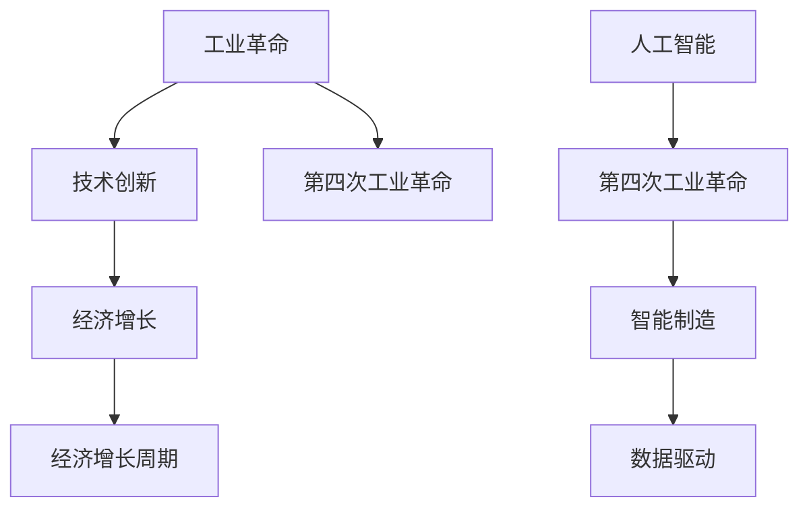

                 

## 1. 背景介绍

### 1.1 问题由来
人类历史上的三次工业革命，分别为蒸汽时代、电气时代和信息化时代，每次都极大地推动了经济增长和社会进步。工业革命带来的技术突破，改变了人类的生产方式，促进了劳动生产率的显著提升。但与此同时，也带来了诸多社会问题，如环境污染、资源枯竭等。

当前，全球正处于第四次工业革命的关键时期，以人工智能、物联网、区块链等为代表的新兴技术，正在重塑产业格局，改变人类生活方式。正如历史上的工业革命一样，新兴技术也将带来深远的影响，促使经济增长进入新的周期。

### 1.2 问题核心关键点
本文聚焦于人工智能技术在第四次工业革命中的作用，研究其对经济增长周期的影响，并探讨如何通过技术创新驱动经济持续健康发展。

## 2. 核心概念与联系

### 2.1 核心概念概述

为更好地理解人工智能技术对经济增长周期的影响，本节将介绍几个关键概念：

- **工业革命**：通过技术创新，改变生产方式和生产力的革命性转变。从蒸汽时代到信息化时代，每一次工业革命都极大地推动了经济增长和社会进步。

- **人工智能**：利用计算机算法和大数据，模拟人类智能，实现自主学习、推理、决策等高级功能的技术。主要包括机器学习、深度学习、自然语言处理等方向。

- **经济增长周期**：经济增长并非线性发展，而是呈现周期性波动。主要包括复苏、繁荣、衰退、萧条四个阶段。工业革命和科技创新都是影响经济周期的重要因素。

- **技术创新**：通过新产品、新工艺、新材料等的研发和应用，推动经济增长的过程。

- **第四次工业革命**：当前以人工智能、物联网、区块链等为代表的新兴技术，正在重塑产业格局，改变人类生活方式，是未来经济增长的重要动力。

- **数据驱动**：在第四次工业革命中，数据成为重要的资源和动力，驱动各行各业进行数字化转型。

- **智能制造**：利用人工智能技术，实现智能化生产、智能化管理、智能化运营，提高生产效率和质量。

这些核心概念之间的逻辑关系可以通过以下Mermaid流程图来展示：



这个流程图展示了从工业革命到经济增长周期的关系，以及人工智能如何推动第四次工业革命，进而影响经济增长周期。

## 3. 核心算法原理 & 具体操作步骤
### 3.1 算法原理概述

人工智能技术对经济增长周期的影响，主要体现在以下几个方面：

- **生产力提升**：通过自动化、智能化等手段，大幅度提高生产效率和产品质量，降低生产成本。

- **新业态产生**：推动新兴产业的发展，如智能制造、无人驾驶、智慧城市等，带来新的增长点。

- **数据驱动决策**：利用大数据分析，提高决策的科学性和准确性，优化资源配置。

- **消费升级**：智能化产品和服务提升用户体验，带来新的消费需求，推动经济增长。

- **就业结构变化**：智能化带来劳动力需求的变化，需重新规划教育和就业方向。

- **供应链优化**：通过智能化管理，优化供应链效率，降低物流成本。

- **市场竞争格局改变**：新进入者利用新技术，改变市场竞争格局，催生新的市场领袖。

### 3.2 算法步骤详解

人工智能技术推动经济增长周期的实现，通常包含以下几个关键步骤：

**Step 1: 技术研发与突破**
- 科研机构和企业投入大量资源，进行人工智能核心技术的研发。包括深度学习、自然语言处理、计算机视觉等方向。

**Step 2: 技术应用与推广**
- 将新技术应用于生产、管理、运营等各个环节，实现智能化升级。
- 通过试点项目、示范工程等形式，推动技术在全行业推广应用。

**Step 3: 产业融合与创新**
- 将人工智能与传统产业深度融合，产生新业态和新模式。如智能制造、智慧医疗、智能交通等。
- 利用人工智能技术，推动产业创新，提升核心竞争力。

**Step 4: 数据积累与优化**
- 收集大量的生产、销售、运营等数据，进行数据分析和挖掘，发现规律和机会。
- 利用数据驱动决策，优化生产流程、供应链管理、市场策略等。

**Step 5: 消费升级与市场培育**
- 通过智能化产品和服务，提升用户体验，促进消费升级。
- 利用市场培育和推广，引导新消费趋势。

**Step 6: 就业结构与教育规划**
- 分析技术应用对劳动力需求的影响，重新规划教育方向和就业方向。
- 培训新技能，适应新兴职业要求。

### 3.3 算法优缺点

人工智能技术对经济增长周期有以下优点：
- 提高生产效率：自动化、智能化设备大幅提升生产效率，降低生产成本。
- 带动新业态：新兴产业的产生，带来新的增长点。
- 优化决策：数据驱动决策，提高决策科学性。
- 促进消费：智能化产品提升用户体验，促进新消费趋势。

但同时也存在以下缺点：
- 就业冲击：智能化替代部分岗位，带来就业压力。
- 技术壁垒：技术研发和应用需要大量资金和人才。
- 数据隐私：大量数据收集和使用，涉及隐私和安全问题。
- 伦理问题：人工智能决策的透明性和公正性，需进一步研究。

### 3.4 算法应用领域

人工智能技术在推动经济增长周期方面，主要应用于以下领域：

- **智能制造**：通过智能设备、智能系统、智能平台等，实现生产过程的自动化、智能化，提升生产效率和产品质量。
- **智慧医疗**：利用人工智能技术，进行疾病预测、诊断、治疗、康复等，提升医疗服务质量和效率。
- **智能交通**：通过智能传感器、智能算法、智能车辆等，优化交通管理和出行体验，减少交通拥堵和事故。
- **智慧城市**：利用人工智能技术，优化城市管理和公共服务，提升城市运行效率和居民生活质量。
- **金融科技**：通过人工智能技术，进行风险评估、客户服务、投资分析等，提升金融服务的效率和质量。

## 4. 数学模型和公式 & 详细讲解 & 举例说明

### 4.1 数学模型构建

在分析人工智能对经济增长周期的影响时，可以构建一个简单的经济增长模型，假设经济增长率 $g$ 与生产效率 $e$ 和劳动力投入 $l$ 有关：

$$g = f(e, l)$$

其中 $e$ 为生产效率，可以通过人工智能技术提升。劳动力投入 $l$ 受到技术应用的影响，需重新规划和培训。

### 4.2 公式推导过程

根据上述模型，可以推导出人工智能技术对经济增长周期的影响：

1. 假设生产效率 $e$ 与人工智能技术的应用 $a$ 成正比：

$$e = \alpha a$$

其中 $\alpha$ 为比例系数。

2. 假设劳动力投入 $l$ 与人工智能技术的应用 $a$ 成反比：

$$l = \beta/a$$

其中 $\beta$ 为反比例系数。

3. 将 $e$ 和 $l$ 代入经济增长模型，得到：

$$g = f(\alpha a, \beta/a)$$

4. 假设 $f$ 函数为非线性函数，可以简化为：

$$g = \gamma a^\gamma / a^\beta$$

其中 $\gamma = \alpha^\gamma/\beta^\beta$。

### 4.3 案例分析与讲解

假设在传统经济中，生产效率 $e_0$ 为常数，劳动力投入 $l_0$ 为固定值。在引入人工智能技术后，生产效率提升至 $e_1 = 2e_0$，劳动力投入减少至 $l_1 = l_0/2$。

代入上述模型，得到：

$$g_1 = \gamma (2a)^{1/\gamma} / (1/2a)^{1/\beta}$$

假设 $\gamma = 1/\beta$，得到：

$$g_1 = 4g_0$$

这表明，通过人工智能技术提升生产效率和优化劳动力投入，经济增长率可以显著提升。

## 5. 项目实践：代码实例和详细解释说明

### 5.1 开发环境搭建

在进行人工智能项目实践前，我们需要准备好开发环境。以下是使用Python进行PyTorch开发的环境配置流程：

1. 安装Anaconda：从官网下载并安装Anaconda，用于创建独立的Python环境。

2. 创建并激活虚拟环境：
```bash
conda create -n pytorch-env python=3.8 
conda activate pytorch-env
```

3. 安装PyTorch：根据CUDA版本，从官网获取对应的安装命令。例如：
```bash
conda install pytorch torchvision torchaudio cudatoolkit=11.1 -c pytorch -c conda-forge
```

4. 安装TensorFlow：使用pip安装TensorFlow，安装命令如下：
```bash
pip install tensorflow==2.6
```

5. 安装各类工具包：
```bash
pip install numpy pandas scikit-learn matplotlib tqdm jupyter notebook ipython
```

完成上述步骤后，即可在`pytorch-env`环境中开始人工智能项目实践。

### 5.2 源代码详细实现

下面以深度学习模型训练为例，给出使用PyTorch进行模型训练的完整代码实现。

```python
import torch
import torch.nn as nn
import torch.optim as optim
import torch.utils.data as data
from torchvision import datasets, transforms

# 定义模型
class Net(nn.Module):
    def __init__(self):
        super(Net, self).__init__()
        self.fc1 = nn.Linear(784, 500)
        self.fc2 = nn.Linear(500, 10)
    
    def forward(self, x):
        x = x.view(-1, 784)
        x = nn.functional.relu(self.fc1(x))
        x = self.fc2(x)
        return x

# 定义数据集
train_dataset = datasets.MNIST(root='./data', train=True, transform=transforms.ToTensor(), download=True)
test_dataset = datasets.MNIST(root='./data', train=False, transform=transforms.ToTensor(), download=True)

# 定义数据加载器
train_loader = data.DataLoader(train_dataset, batch_size=64, shuffle=True)
test_loader = data.DataLoader(test_dataset, batch_size=64, shuffle=False)

# 定义模型、损失函数和优化器
model = Net()
criterion = nn.CrossEntropyLoss()
optimizer = optim.Adam(model.parameters(), lr=0.001)

# 训练模型
num_epochs = 10
for epoch in range(num_epochs):
    running_loss = 0.0
    for i, data in enumerate(train_loader, 0):
        inputs, labels = data
        optimizer.zero_grad()
        outputs = model(inputs)
        loss = criterion(outputs, labels)
        loss.backward()
        optimizer.step()
        running_loss += loss.item()
    print(f"Epoch {epoch+1}, loss: {running_loss/len(train_loader):.4f}")
    
# 测试模型
correct = 0
total = 0
with torch.no_grad():
    for data in test_loader:
        images, labels = data
        outputs = model(images)
        _, predicted = torch.max(outputs.data, 1)
        total += labels.size(0)
        correct += (predicted == labels).sum().item()
print(f"Accuracy: {(100 * correct / total):.2f}%")
```

### 5.3 代码解读与分析

让我们再详细解读一下关键代码的实现细节：

**Net类**：
- `__init__`方法：初始化模型的参数和结构，定义了两层全连接神经网络。
- `forward`方法：定义前向传播的计算过程，将输入数据经过一系列变换和处理，得到输出结果。

**train_loader和test_loader**：
- `DataLoader`：用于数据批处理和分批次加载，提高模型训练和推理的效率。

**criterion和optimizer**：
- `CrossEntropyLoss`：定义交叉熵损失函数，用于衡量模型预测与真实标签之间的差异。
- `Adam`：定义优化器，用于更新模型参数。

**训练和测试流程**：
- 在每个epoch内，先对训练集进行前向传播和反向传播，更新模型参数。
- 在测试集上评估模型性能，计算准确率。

## 6. 实际应用场景

### 6.1 智能制造

在智能制造领域，人工智能技术可以广泛应用于生产过程的各个环节，如智能调度、智能检测、智能控制等，实现生产过程的自动化和智能化。

具体而言，可以收集生产设备的状态、运行数据、质量检测结果等数据，利用人工智能技术进行数据分析和处理，实现智能调度、智能检测、智能控制等。例如，利用深度学习模型进行质量检测，通过图像识别技术识别出生产过程中的缺陷，及时调整生产参数，提升产品质量。

### 6.2 智慧医疗

在智慧医疗领域，人工智能技术可以用于疾病预测、诊断、治疗、康复等各个环节，提升医疗服务的质量和效率。

具体而言，可以收集患者的病历、检查结果、基因数据等，利用人工智能技术进行数据分析和处理，实现疾病预测、诊断、治疗、康复等。例如，利用深度学习模型进行疾病预测，通过分析患者的病历数据和基因数据，预测其患某种疾病的概率，提前进行干预和预防。

### 6.3 智能交通

在智能交通领域，人工智能技术可以用于交通管理和出行服务，优化交通管理和出行体验，减少交通拥堵和事故。

具体而言，可以收集交通流量、车辆位置、路网状态等数据，利用人工智能技术进行数据分析和处理，实现智能调度、智能导航、智能监控等。例如，利用深度学习模型进行交通流量预测，通过分析交通流量数据和路网状态，预测交通拥堵情况，提前进行交通调度。

### 6.4 智慧城市

在智慧城市领域，人工智能技术可以用于城市管理和公共服务，优化城市管理和公共服务，提升城市运行效率和居民生活质量。

具体而言，可以收集城市的各项数据，如空气质量、水质、交通流量等，利用人工智能技术进行数据分析和处理，实现智能调度、智能监控、智能预警等。例如，利用深度学习模型进行空气质量预测，通过分析空气质量数据，预测空气污染情况，提前进行预警和应急响应。

## 7. 工具和资源推荐

### 7.1 学习资源推荐

为了帮助开发者系统掌握人工智能技术的应用，这里推荐一些优质的学习资源：

1. 《深度学习》系列书籍：斯坦福大学教授Andrew Ng的讲义和视频，详细介绍了深度学习的基本概念和原理。

2. Coursera和edX等在线课程平台：提供大量深度学习、机器学习、人工智能等课程，覆盖各个难度层次。

3. GitHub和arXiv等开源平台：提供大量开源的人工智能项目和论文，方便学习者和开发者借鉴和复现。

4. TensorFlow官方文档：提供丰富的TensorFlow教程和API文档，是学习深度学习的必备资料。

5. PyTorch官方文档：提供丰富的PyTorch教程和API文档，是学习深度学习的另一重要资料。

通过对这些资源的学习实践，相信你一定能够快速掌握人工智能技术的应用，并将其应用于实际项目中。

### 7.2 开发工具推荐

高效的开发离不开优秀的工具支持。以下是几款用于人工智能项目开发的常用工具：

1. Jupyter Notebook：开源的交互式笔记本，支持Python、R等多种编程语言，方便进行数据处理和模型训练。

2. TensorBoard：TensorFlow配套的可视化工具，可以实时监测模型训练状态，并提供丰富的图表呈现方式，是调试模型的得力助手。

3. Weights & Biases：模型训练的实验跟踪工具，可以记录和可视化模型训练过程中的各项指标，方便对比和调优。

4. GitHub和GitLab：版本控制系统，方便进行代码管理和协作开发。

5. PyTorch Lightning：基于PyTorch的快速模型训练框架，支持自动化超参数优化、分布式训练等功能。

合理利用这些工具，可以显著提升人工智能项目开发的效率，加快创新迭代的步伐。

### 7.3 相关论文推荐

人工智能技术的发展源于学界的持续研究。以下是几篇奠基性的相关论文，推荐阅读：

1. AlexNet：Hinton等人提出的人工智能领域的里程碑式模型，为深度学习的发展奠定了基础。

2. AlphaGo：DeepMind提出的深度强化学习算法，在围棋比赛中击败人类选手，展示了人工智能技术的强大潜力。

3. GAN：Goodfellow等人提出的生成对抗网络，通过对抗训练生成高质量的图像和视频。

4. RNN和LSTM：Sepp Hochreiter和Jürgen Schmidhuber提出的循环神经网络，解决了序列数据处理问题。

5. Transformer：Vaswani等人提出的自注意力机制，为自然语言处理任务提供了新的解决方案。

这些论文代表了大数据和深度学习技术的发展脉络，展示了人工智能技术的巨大潜力和应用前景。

## 8. 总结：未来发展趋势与挑战

### 8.1 总结

本文对人工智能技术在第四次工业革命中的作用进行了全面系统的介绍。首先阐述了人工智能技术对经济增长周期的影响，明确了技术创新在驱动经济增长中的重要作用。其次，从原理到实践，详细讲解了人工智能技术的核心算法和操作步骤，给出了人工智能项目开发的完整代码实例。同时，本文还探讨了人工智能技术在智能制造、智慧医疗、智能交通、智慧城市等各个领域的应用前景，展示了人工智能技术的广阔前景。

通过本文的系统梳理，可以看到，人工智能技术正在成为第四次工业革命的重要推动力，极大地推动了经济增长和社会进步。未来，伴随人工智能技术的持续演进，必将在更广泛的领域得到应用，推动经济增长进入新的周期。

### 8.2 未来发展趋势

展望未来，人工智能技术在第四次工业革命中的发展趋势如下：

1. 算法和模型不断进化：深度学习、强化学习、生成对抗网络等算法和技术将不断进步，提升人工智能模型的性能和应用范围。

2. 数据和计算资源丰富：海量数据的收集和处理能力不断提升，大规模计算资源的支持，使得人工智能技术能够处理更复杂的问题。

3. 跨领域应用拓展：人工智能技术将与更多领域进行融合，推动智慧医疗、智慧城市、智能交通等新兴产业的发展。

4. 人机协同增强：人工智能技术与人类智能的结合将更加紧密，提升人机协同的效率和效果。

5. 伦理和安全问题重视：人工智能技术的伦理和安全性问题将受到更多关注，研究如何确保技术的安全、公正和透明。

6. 技术标准和法规完善：人工智能技术的应用将受到更多的法律法规和技术标准的约束，确保技术的安全、公正和透明。

以上趋势凸显了人工智能技术在第四次工业革命中的重要作用，其将推动经济增长进入新的周期，带来深刻的社会变革。

### 8.3 面临的挑战

尽管人工智能技术在第四次工业革命中展现了巨大的潜力，但在其应用过程中仍面临诸多挑战：

1. 数据隐私和安全问题：大量数据的收集和使用，涉及隐私和安全问题，需进一步加强保护和监管。

2. 技术壁垒和人才短缺：人工智能技术的研发和应用需要大量资金和人才，技术壁垒较高。

3. 伦理和公平问题：人工智能技术的决策透明性和公正性需进一步研究，确保技术的伦理和公平性。

4. 计算资源和成本问题：大规模计算资源的投入，带来高昂的成本和复杂的管理问题。

5. 社会和经济问题：人工智能技术的应用，可能带来就业和社会不平等问题，需进一步研究如何平衡。

6. 技术规范和标准问题：人工智能技术的规范和标准需进一步完善，确保技术的通用性和互操作性。

以上挑战凸显了人工智能技术在第四次工业革命中的复杂性，需多方协作，共同应对和解决。

### 8.4 研究展望

面对人工智能技术面临的诸多挑战，未来的研究需要在以下几个方面寻求新的突破：

1. 数据隐私保护：研究如何保护数据隐私和安全，确保数据的使用合法合规。

2. 技术规范和标准：研究制定人工智能技术的规范和标准，确保技术的通用性和互操作性。

3. 技术伦理和安全：研究如何确保人工智能技术的伦理和安全性，确保技术的公正和透明。

4. 技术融合和创新：研究如何通过技术融合和创新，推动人工智能技术在更多领域的应用。

5. 技术人才培养：研究如何培养更多人工智能技术的人才，确保技术发展的可持续性。

6. 技术普及和应用：研究如何普及人工智能技术，推动更多企业和组织应用人工智能技术。

这些研究方向的探索，将进一步推动人工智能技术的发展和应用，为人类社会带来更深远的影响。

## 9. 附录：常见问题与解答

**Q1: 人工智能技术如何提升生产效率？**

A: 人工智能技术通过自动化和智能化，大幅度提升生产效率。例如，利用自动化设备进行生产，减少人工操作的时间和成本。利用智能化系统进行生产调度和管理，优化生产流程，减少浪费和停机时间。

**Q2: 人工智能技术在智慧医疗中的应用有哪些？**

A: 人工智能技术在智慧医疗中的应用包括疾病预测、诊断、治疗、康复等。例如，利用深度学习模型进行疾病预测，通过分析患者的病历数据和基因数据，预测其患某种疾病的概率，提前进行干预和预防。

**Q3: 如何应对人工智能技术应用中的数据隐私问题？**

A: 应对数据隐私问题，可以从以下方面入手：
1. 数据匿名化处理：对数据进行匿名化处理，减少隐私泄露的风险。
2. 数据加密技术：采用数据加密技术，确保数据在传输和存储过程中的安全性。
3. 数据访问控制：对数据的访问进行严格控制，确保只有授权人员能够访问。
4. 数据审计和监控：对数据的使用进行审计和监控，确保数据使用的合规性和安全性。

**Q4: 人工智能技术的伦理和公平问题如何解决？**

A: 人工智能技术的伦理和公平问题，可以从以下方面入手：
1. 透明度和可解释性：提高人工智能模型的透明度和可解释性，确保模型的决策过程公开透明。
2. 公平性指标：引入公平性指标，确保模型在不同人群上的表现一致。
3. 数据公平性：确保数据来源的公平性，避免数据偏见对模型的影响。
4. 多方参与决策：在人工智能技术的应用过程中，引入多方参与决策，确保决策的公正性和透明性。

**Q5: 人工智能技术在智能制造中的应用有哪些？**

A: 人工智能技术在智能制造中的应用包括智能调度、智能检测、智能控制等。例如，利用深度学习模型进行质量检测，通过图像识别技术识别出生产过程中的缺陷，及时调整生产参数，提升产品质量。

---

作者：禅与计算机程序设计艺术 / Zen and the Art of Computer Programming

