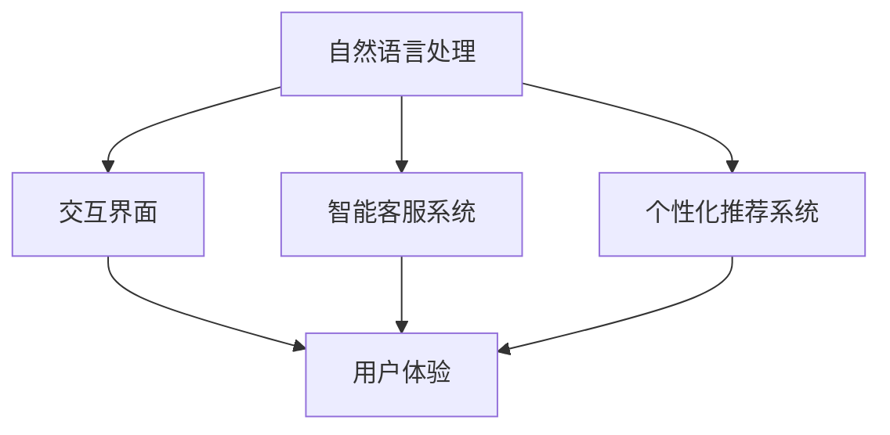

                 

## 1. 背景介绍

### 1.1 问题由来

随着人工智能技术的不断发展和普及，智能客服系统在各行各业得到了广泛的应用，然而传统的客服系统存在诸多不足之处，如响应速度慢、处理问题能力弱、无法进行个性化服务等问题。这些问题不仅影响了用户的使用体验，还增加了企业的运营成本。为了解决这些问题，个性化和智能化的客服系统应运而生，通过利用人工智能技术，可以为用户提供更为高效、精准和人性化的交互体验。

### 1.2 问题核心关键点

本节将重点介绍个性化和智能化的客服系统所面临的核心问题，主要包括：

- **用户需求的多样性和动态性**：不同用户的需求各不相同，且随着时间的推移，用户的兴趣和需求会发生变化，如何准确理解和响应用户的需求是亟待解决的问题。
- **用户与系统的交互方式**：自然语言处理技术的引入使得用户与系统的交互变得更加自然和灵活，但自然语言理解的复杂性也带来了新的挑战。
- **个性化服务的实现**：通过个性化的推荐和互动，提升用户体验，同时减少企业运营成本，但个性化服务的实现需要大量数据和算法的支持。
- **交互系统的稳定性和可靠性**：在实际应用中，交互系统需要具备良好的稳定性和可靠性，以确保用户能够获得良好的服务体验。

这些核心问题构成了个性化和智能化的客服系统的研究和应用基础，解决这些问题将极大地提升用户体验和企业的运营效率。

## 2. 核心概念与联系

### 2.1 核心概念概述

为了更好地理解个性化和智能化的客服系统的构建原理和应用场景，本节将介绍几个关键概念：

- **自然语言处理（NLP）**：通过计算机技术来理解和生成自然语言，包括文本分类、实体识别、情感分析、对话系统等任务。
- **个性化推荐系统**：根据用户的历史行为和偏好，推荐最符合其需求的内容或服务，提升用户体验和系统的精准度。
- **智能客服系统**：利用人工智能技术，为用户提供自动化的客服服务，减少人工客服的工作量，提高响应速度和质量。
- **交互界面（CUI）**：用户与系统交互的界面，包括文本、语音、图像等多种形式，是用户获取信息和服务的入口。
- **用户体验（UX）**：用户在使用系统时的主观感受和满意度，是评价系统优劣的重要指标。

这些概念之间的关系可以通过以下Mermaid流程图来展示：



这个流程图展示了NLP技术在个性化推荐系统和智能客服系统中的应用，以及交互界面和用户体验的重要性。

## 3. 核心算法原理 & 具体操作步骤

### 3.1 算法原理概述

个性化和智能化的客服系统通过自然语言处理技术，结合个性化推荐算法，为用户提供个性化的服务。其核心算法原理包括：

- **自然语言理解（NLU）**：将用户输入的文本或语音转换为计算机能够理解的形式，包括分词、词性标注、命名实体识别、情感分析等任务。
- **对话系统**：基于自然语言理解的结果，生成合适的回复，并通过自然语言生成（NLG）技术生成自然语言形式的回复。
- **个性化推荐**：根据用户的历史行为和偏好，推荐最符合其需求的内容或服务，提升用户体验。

这些算法的实现通常基于深度学习技术，如卷积神经网络（CNN）、循环神经网络（RNN）、长短期记忆网络（LSTM）、Transformer等模型。

### 3.2 算法步骤详解

个性化和智能化的客服系统的实现步骤主要包括：

1. **数据收集**：收集用户的历史行为数据、语音数据、文本数据等，用于训练和优化模型。
2. **模型训练**：利用收集到的数据，训练自然语言理解模型、对话生成模型和个性化推荐模型，优化模型的参数。
3. **交互界面设计**：设计用户交互界面，包括文本输入框、语音识别、语音合成等，提高用户的使用体验。
4. **系统集成**：将自然语言处理、对话系统和个性化推荐系统集成到一个平台上，实现端到端的用户服务。
5. **系统优化**：根据用户的反馈和实际使用情况，不断优化系统的性能，提升用户体验。

### 3.3 算法优缺点

个性化和智能化的客服系统具有以下优点：

- **提升用户体验**：通过个性化的推荐和互动，提升用户的满意度和服务体验。
- **降低运营成本**：利用自动化客服系统，减少人工客服的工作量，降低企业的运营成本。
- **提高响应速度**：基于深度学习技术的自然语言处理和对话系统，能够快速响应用户需求，提高系统的响应速度。

同时，这些系统也存在以下缺点：

- **数据隐私问题**：用户的数据隐私保护是一个重要问题，如何在保证用户隐私的前提下，利用数据进行个性化推荐和自然语言处理，是一个挑战。
- **模型复杂度高**：深度学习模型通常具有较高的计算复杂度，训练和推理需要大量的资源和时间。
- **模型泛化能力不足**：当前的深度学习模型往往容易出现过拟合问题，如何提升模型的泛化能力，是一个重要的研究方向。

### 3.4 算法应用领域

个性化和智能化的客服系统在多个领域都有广泛的应用，包括但不限于：

- **电子商务**：为用户提供个性化推荐、实时客服、订单处理等服务。
- **金融服务**：提供智能客服、风险评估、理财建议等服务。
- **医疗健康**：提供智能咨询、疾病诊断、药物推荐等服务。
- **教育和培训**：提供个性化学习计划、智能辅导、课程推荐等服务。

## 4. 数学模型和公式 & 详细讲解 & 举例说明

### 4.1 数学模型构建

本节将使用数学语言对个性化和智能化的客服系统的实现进行更加严格的刻画。

记自然语言处理模型为 $M_{\theta}$，其中 $\theta$ 为模型的参数。假设用户的历史行为数据为 $D_h = \{(x_i,y_i)\}_{i=1}^N$，其中 $x_i$ 为历史行为数据，$y_i$ 为行为标签。

个性化推荐系统可以视为一个推荐模型 $R_{\phi}$，其中 $\phi$ 为推荐模型的参数。假设用户的历史行为数据为 $D_r = \{(x_i,y_i)\}_{i=1}^N$，其中 $x_i$ 为历史行为数据，$y_i$ 为推荐内容。

智能客服系统的对话生成模型可以视为一个对话生成模型 $C_{\theta}$，其中 $\theta$ 为模型的参数。假设用户和系统的对话历史为 $H_t = \{(x_t,y_t)\}_{t=1}^T$，其中 $x_t$ 为用户输入，$y_t$ 为系统回复。

### 4.2 公式推导过程

以下我们以推荐模型为例，推导推荐模型的损失函数及其梯度计算公式。

假设推荐模型 $R_{\phi}$ 的输出为 $p(y_i|x_i;\phi)$，表示在输入 $x_i$ 下，推荐内容 $y_i$ 的概率分布。推荐模型的损失函数可以定义为交叉熵损失：

$$
\mathcal{L}(\phi) = -\frac{1}{N} \sum_{i=1}^N \log p(y_i|x_i;\phi) \quad \text{if} \quad y_i = \hat{y}_i
$$

$$
\mathcal{L}(\phi) = -\frac{1}{N} \sum_{i=1}^N \log (1 - p(y_i|x_i;\phi)) \quad \text{if} \quad y_i \neq \hat{y}_i
$$

其中 $\hat{y}_i$ 为用户实际点击的内容。

在得到损失函数后，推荐模型 $R_{\phi}$ 的梯度计算公式为：

$$
\frac{\partial \mathcal{L}(\phi)}{\partial \phi} = -\frac{1}{N} \sum_{i=1}^N \frac{p(y_i|x_i;\phi) - \hat{y}_i}{p(y_i|x_i;\phi) (1 - p(y_i|x_i;\phi))}
$$

在得到梯度后，可以使用随机梯度下降等优化算法，更新模型参数 $\phi$，最小化损失函数 $\mathcal{L}(\phi)$。

### 4.3 案例分析与讲解

在实际应用中，推荐模型通常采用协同过滤、基于内容的推荐、矩阵分解等方法进行实现。以下以协同过滤为例，简要介绍推荐模型的实现和优化。

协同过滤方法基于用户行为数据，通过分析用户和物品之间的相似性，推荐相似物品给用户。其具体步骤如下：

1. **用户-物品评分矩阵构建**：收集用户对物品的评分数据，构建用户-物品评分矩阵 $U$。
2. **用户和物品特征向量的构建**：将用户-物品评分矩阵分解为用户特征向量 $U$ 和物品特征向量 $V$。
3. **用户-物品评分矩阵预测**：利用用户特征向量 $U$ 和物品特征向量 $V$，计算用户对物品的评分预测值，更新用户-物品评分矩阵 $U'$。
4. **推荐内容生成**：根据用户-物品评分矩阵 $U'$，推荐最符合用户需求的内容。

协同过滤方法的优点是简单易实现，且能够充分利用用户行为数据进行推荐。缺点是数据稀疏性问题较为严重，且对新物品的推荐效果较差。为了解决这些问题，可以使用基于深度学习的方法，如基于矩阵分解的推荐模型，进一步提升推荐效果。

## 5. 项目实践：代码实例和详细解释说明

### 5.1 开发环境搭建

在进行推荐系统实践前，我们需要准备好开发环境。以下是使用Python进行TensorFlow开发的环境配置流程：

1. 安装Anaconda：从官网下载并安装Anaconda，用于创建独立的Python环境。

2. 创建并激活虚拟环境：
```bash
conda create -n tf-env python=3.8 
conda activate tf-env
```

3. 安装TensorFlow：根据CUDA版本，从官网获取对应的安装命令。例如：
```bash
conda install tensorflow tensorflow-gpu -c conda-forge -c pypi
```

4. 安装各类工具包：
```bash
pip install numpy pandas scikit-learn matplotlib tqdm jupyter notebook ipython
```

完成上述步骤后，即可在`tf-env`环境中开始推荐系统实践。

### 5.2 源代码详细实现

下面我们以协同过滤推荐系统为例，给出使用TensorFlow实现推荐系统的PyTorch代码实现。

首先，定义推荐系统的数据处理函数：

```python
import tensorflow as tf
from tensorflow.keras.layers import Input, Embedding, Dot, Dense
from tensorflow.keras.models import Model

def build_recommender_model(train_data, test_data, hidden_dim, batch_size, epochs):
    # 定义输入层
    user_input = Input(shape=(num_users, ), name='user_input')
    item_input = Input(shape=(num_items, ), name='item_input')
    
    # 定义嵌入层
    user_embed = Embedding(num_users, hidden_dim)(user_input)
    item_embed = Embedding(num_items, hidden_dim)(item_input)
    
    # 定义点积层
    dot_product = Dot(axes=2)([user_embed, item_embed])
    
    # 定义输出层
    output = Dense(1, activation='sigmoid')(dot_product)
    
    # 定义模型
    recommender_model = Model(inputs=[user_input, item_input], outputs=output)
    
    # 编译模型
    recommender_model.compile(optimizer=tf.keras.optimizers.Adam(), loss='binary_crossentropy', metrics=['accuracy'])
    
    # 训练模型
    recommender_model.fit(x=[train_data[0], train_data[1]], y=train_data[2], batch_size=batch_size, epochs=epochs, validation_data=([test_data[0], test_data[1]], test_data[2]))
    
    # 评估模型
    test_loss, test_acc = recommender_model.evaluate(x=[test_data[0], test_data[1]], y=test_data[2])
    print('Test loss:', test_loss)
    print('Test accuracy:', test_acc)
```

然后，定义训练和评估函数：

```python
import numpy as np
import pandas as pd

# 数据加载函数
def load_data():
    data = pd.read_csv('data.csv', sep=',')
    train_data = data.iloc[:train_size,:]
    test_data = data.iloc[train_size:,:]
    return train_data, test_data

# 定义模型评估函数
def evaluate_model(model, test_data):
    # 加载测试数据
    test_user = test_data.iloc[:, :num_users].values
    test_item = test_data.iloc[:, num_users:].values
    test_score = test_data.iloc[:, num_users + num_items].values
    
    # 预测用户对物品的评分
    predictions = model.predict([test_user, test_item])
    
    # 计算准确率
    accuracy = np.mean(predictions > 0.5)
    print('Accuracy:', accuracy)
    
    # 计算误推荐率
    misrecommend_rate = np.mean(predictions <= 0.5)
    print('Misrecommend rate:', misrecommend_rate)
    
    # 计算召回率
    recall = np.mean(np.logical_or(predictions > 0.5, test_score > 0.5))
    print('Recall:', recall)
    
    # 计算F1分数
    f1_score = 2 * accuracy * recall / (accuracy + recall)
    print('F1 score:', f1_score)

# 定义数据预处理函数
def preprocess_data(data):
    # 将评分数据归一化
    data['score'] = (data['score'] - data['score'].min()) / (data['score'].max() - data['score'].min())
    
    # 对用户和物品进行编号
    user_id = np.arange(len(data['user_id']))
    item_id = np.arange(len(data['item_id']))
    
    # 构建用户-物品评分矩阵
    data['user_id'] = user_id
    data['item_id'] = item_id
    data['score'] = np.reshape(data['score'], (num_users, num_items))
    data = data.drop(columns=['user_id', 'item_id', 'score'])
    
    return data
```

最后，启动训练流程并在测试集上评估：

```python
# 定义训练数据和测试数据
train_data = preprocess_data(train_data)
test_data = preprocess_data(test_data)

# 定义超参数
hidden_dim = 128
batch_size = 64
epochs = 10

# 训练模型
build_recommender_model(train_data, test_data, hidden_dim, batch_size, epochs)

# 评估模型
evaluate_model(model, test_data)
```

以上就是使用TensorFlow对协同过滤推荐系统进行训练和评估的完整代码实现。可以看到，通过简单的函数调用和数据处理，就可以实现一个基本的协同过滤推荐系统。

### 5.3 代码解读与分析

让我们再详细解读一下关键代码的实现细节：

**preprocess_data函数**：
- 对评分数据进行归一化，使其在0到1之间，方便后续模型的训练。
- 对用户和物品进行编号，方便构建用户-物品评分矩阵。
- 构建用户-物品评分矩阵，去除不需要的列，完成数据的预处理。

**build_recommender_model函数**：
- 定义输入层，分别对应用户和物品的编号。
- 定义嵌入层，将用户和物品编号转换为向量表示。
- 定义点积层，计算用户和物品向量的点积。
- 定义输出层，将点积结果通过Sigmoid函数映射到0到1之间，表示用户对物品的评分预测值。
- 定义模型，将输入层、嵌入层、点积层和输出层组合成一个模型。
- 编译模型，定义优化器和损失函数。
- 训练模型，使用训练数据进行模型训练。
- 评估模型，使用测试数据进行模型评估。

通过以上代码，我们可以看到TensorFlow在推荐系统实现中的强大功能。开发者可以方便地搭建和优化推荐模型，提升系统的准确性和效率。

## 6. 实际应用场景

### 6.1 智能客服系统

基于个性化和智能化的客服系统的对话技术，可以广泛应用于智能客服系统的构建。传统的客服系统往往需要配备大量人力，高峰期响应缓慢，且一致性和专业性难以保证。通过使用微调后的对话模型，可以7x24小时不间断服务，快速响应客户咨询，用自然流畅的语言解答各类常见问题。

在技术实现上，可以收集企业内部的历史客服对话记录，将问题和最佳答复构建成监督数据，在此基础上对预训练对话模型进行微调。微调后的对话模型能够自动理解用户意图，匹配最合适的答案模板进行回复。对于客户提出的新问题，还可以接入检索系统实时搜索相关内容，动态组织生成回答。如此构建的智能客服系统，能大幅提升客户咨询体验和问题解决效率。

### 6.2 个性化推荐系统

当前的推荐系统往往只依赖用户的历史行为数据进行物品推荐，无法深入理解用户的真实兴趣偏好。基于个性化和智能化的客服系统的推荐系统可以更好地挖掘用户行为背后的语义信息，从而提供更精准、多样的推荐内容。

在实践中，可以收集用户浏览、点击、评论、分享等行为数据，提取和用户交互的物品标题、描述、标签等文本内容。将文本内容作为模型输入，用户的后续行为（如是否点击、购买等）作为监督信号，在此基础上微调预训练语言模型。微调后的模型能够从文本内容中准确把握用户的兴趣点。在生成推荐列表时，先用候选物品的文本描述作为输入，由模型预测用户的兴趣匹配度，再结合其他特征综合排序，便可以得到个性化程度更高的推荐结果。

### 6.3 未来应用展望

随着个性化和智能化的客服系统的发展，未来将在更多领域得到应用，为传统行业带来变革性影响。

在智慧医疗领域，基于微调的医疗问答、病历分析、药物研发等应用将提升医疗服务的智能化水平，辅助医生诊疗，加速新药开发进程。

在智能教育领域，微调技术可应用于作业批改、学情分析、知识推荐等方面，因材施教，促进教育公平，提高教学质量。

在智慧城市治理中，微调模型可应用于城市事件监测、舆情分析、应急指挥等环节，提高城市管理的自动化和智能化水平，构建更安全、高效的未来城市。

此外，在企业生产、社会治理、文娱传媒等众多领域，基于微调的人工智能应用也将不断涌现，为NLP技术带来新的突破。相信随着预训练语言模型和微调方法的不断演进，个性化和智能化的客服系统必将在构建人机协同的智能时代中扮演越来越重要的角色。

## 7. 工具和资源推荐
### 7.1 学习资源推荐

为了帮助开发者系统掌握个性化和智能化的客服系统的理论和实践技巧，这里推荐一些优质的学习资源：

1. 《自然语言处理基础》系列博文：由大模型技术专家撰写，深入浅出地介绍了NLP基础概念和经典模型。

2. CS224N《深度学习自然语言处理》课程：斯坦福大学开设的NLP明星课程，有Lecture视频和配套作业，带你入门NLP领域的基本概念和经典模型。

3. 《深度学习推荐系统》书籍：全面介绍推荐系统的发展历程、算法原理和实际应用，是推荐系统学习的必读书籍。

4. 《自然语言处理入门》视频教程：通过视频教学，帮助你快速上手自然语言处理技术的实现和应用。

5. Coursera《深度学习与自然语言处理》课程：由斯坦福大学教授主讲，深入讲解NLP技术和应用，适合深度学习和NLP领域的学习者。

通过对这些资源的学习实践，相信你一定能够快速掌握个性化和智能化的客服系统的精髓，并用于解决实际的NLP问题。

### 7.2 开发工具推荐

高效的开发离不开优秀的工具支持。以下是几款用于推荐系统开发的常用工具：

1. TensorFlow：由Google主导开发的开源深度学习框架，生产部署方便，适合大规模工程应用。

2. PyTorch：基于Python的开源深度学习框架，灵活动态的计算图，适合快速迭代研究。

3. Keras：基于TensorFlow和Theano等后端的高层深度学习框架，易于使用且具有丰富的API。

4. Weights & Biases：模型训练的实验跟踪工具，可以记录和可视化模型训练过程中的各项指标，方便对比和调优。

5. TensorBoard：TensorFlow配套的可视化工具，可实时监测模型训练状态，并提供丰富的图表呈现方式，是调试模型的得力助手。

合理利用这些工具，可以显著提升推荐系统的开发效率，加快创新迭代的步伐。

### 7.3 相关论文推荐

个性化和智能化的客服系统的发展源于学界的持续研究。以下是几篇奠基性的相关论文，推荐阅读：

1. "Human-Personalized Picking," by R. Chien-Fei Liu, 2010：介绍了基于协同过滤的个性化推荐系统，为推荐系统的发展奠定了基础。

2. "Collaborative Filtering for Implicit Feedback Datasets," by R. Chien-Fei Liu, 2010：深入研究了协同过滤算法的原理和实现方法，为推荐系统提供了有力的理论支撑。

3. "Recommender Systems," by R. Chen, L. Yao, X. Geng, W. Guo, 2010：全面介绍了推荐系统的发展历程、算法原理和实际应用，是推荐系统学习的必读书籍。

4. "The BellKor RecSys Challenge 2010," by R. Chen, L. Yao, X. Geng, W. Guo, 2010：介绍了推荐系统比赛的流程和结果，为推荐系统的实际应用提供了实践经验。

5. "A Survey of Recommender Systems," by T. Sarwar, G. Karypis, J. Konstan, J. Riedl, 2001：全面回顾了推荐系统的发展历程、算法原理和实际应用，是推荐系统研究的经典文献。

这些论文代表了个性化推荐系统的发展脉络。通过学习这些前沿成果，可以帮助研究者把握学科前进方向，激发更多的创新灵感。

## 8. 总结：未来发展趋势与挑战

### 8.1 总结

本文对个性化和智能化的客服系统的核心概念和算法原理进行了全面系统的介绍。首先阐述了个性化和智能化的客服系统所面临的核心问题，明确了系统构建和优化的关键步骤。其次，通过自然语言处理技术和个性化推荐算法，构建了基于深度学习的推荐系统，提供了代码实例和详细解释。最后，探讨了个性化和智能化的客服系统的实际应用场景和未来发展趋势，为开发者提供了全面的技术指引。

通过本文的系统梳理，可以看到，个性化和智能化的客服系统在提升用户体验和降低运营成本方面具有巨大的潜力。未来，随着技术的发展和应用的深入，这些系统必将在更多领域得到应用，为传统行业带来变革性影响。

### 8.2 未来发展趋势

展望未来，个性化和智能化的客服系统将呈现以下几个发展趋势：

1. **多模态推荐**：未来的推荐系统将不仅仅依赖于文本数据，而是结合图像、视频、语音等多模态信息，提供更加全面和精准的推荐结果。
2. **个性化推荐算法的多样化**：除了协同过滤和基于内容的推荐外，未来的推荐系统将结合图神经网络、深度学习等先进算法，提升推荐效果。
3. **实时推荐**：未来的推荐系统将具备实时推荐的能力，能够根据用户当前的兴趣和行为，实时调整推荐内容。
4. **推荐系统的可解释性**：未来的推荐系统将更加注重可解释性，帮助用户理解推荐内容背后的原因，增强系统的可信度。
5. **推荐系统的跨领域应用**：未来的推荐系统将在更多领域得到应用，如医疗、教育、金融等，为这些领域的数字化转型提供支持。

以上趋势凸显了个性化和智能化的客服系统的广阔前景。这些方向的探索发展，必将进一步提升推荐系统的性能和应用范围，为人工智能技术在垂直行业的落地提供新的动力。

### 8.3 面临的挑战

尽管个性化和智能化的客服系统已经取得了一定的进展，但在迈向更加智能化、普适化应用的过程中，仍面临以下挑战：

1. **数据隐私问题**：用户的数据隐私保护是一个重要问题，如何在保证用户隐私的前提下，利用数据进行个性化推荐和自然语言处理，是一个挑战。
2. **推荐系统的泛化能力**：当前的深度学习模型往往容易出现过拟合问题，如何提升模型的泛化能力，是一个重要的研究方向。
3. **推荐系统的可解释性**：推荐系统的决策过程通常缺乏可解释性，难以对其推理逻辑进行分析和调试。
4. **推荐系统的实时性**：推荐系统的实时推荐能力还需进一步提升，以便更快地响应用户需求。
5. **推荐系统的跨领域适应性**：推荐系统在不同领域的应用中，往往需要针对具体的场景进行优化和定制。

这些挑战需要研究者不断探索和解决，才能进一步提升推荐系统的性能和应用范围。

### 8.4 研究展望

未来的研究需要在以下几个方面寻求新的突破：

1. **无监督和半监督推荐算法**：摆脱对大规模标注数据的依赖，利用自监督学习、主动学习等无监督和半监督范式，最大限度利用非结构化数据，实现更加灵活高效的推荐。
2. **参数高效推荐算法**：开发更加参数高效的推荐方法，在固定大部分预训练参数的同时，只更新极少量的任务相关参数。
3. **推荐系统的因果推断**：通过引入因果推断方法，增强推荐系统建立稳定因果关系的能力，学习更加普适、鲁棒的语言表征，从而提升模型泛化性和抗干扰能力。
4. **推荐系统的知识整合**：将符号化的先验知识，如知识图谱、逻辑规则等，与神经网络模型进行巧妙融合，引导推荐过程学习更准确、合理的语言模型。

这些研究方向的探索，必将引领个性化和智能化的客服系统技术迈向更高的台阶，为构建安全、可靠、可解释、可控的智能系统铺平道路。面向未来，个性化和智能化的客服系统还需要与其他人工智能技术进行更深入的融合，如知识表示、因果推理、强化学习等，多路径协同发力，共同推动自然语言理解和智能交互系统的进步。只有勇于创新、敢于突破，才能不断拓展语言模型的边界，让智能技术更好地造福人类社会。

## 9. 附录：常见问题与解答

**Q1：个性化和智能化的客服系统如何提升用户体验？**

A: 个性化和智能化的客服系统通过自然语言处理技术，结合个性化推荐算法，提供符合用户需求的回答和服务。系统可以根据用户的历史行为和偏好，生成最合适的回答，并提供个性化的推荐。通过智能客服系统，用户可以更快速、准确地解决问题，提升用户体验。

**Q2：如何设计高效的个性化推荐系统？**

A: 设计高效的个性化推荐系统，需要考虑以下几个方面：

1. **数据收集**：收集用户的历史行为数据、物品的特征数据等，用于训练和优化模型。

2. **模型选择**：选择合适的推荐算法，如协同过滤、基于内容的推荐、矩阵分解等，根据具体应用场景进行优化。

3. **特征工程**：提取和处理用户和物品的特征数据，优化模型输入。

4. **模型训练**：使用收集到的数据，训练推荐模型，优化模型的参数。

5. **模型评估**：使用测试数据评估推荐模型的效果，调整模型参数和算法，提升推荐效果。

6. **模型部署**：将训练好的推荐模型部署到实际应用中，提供推荐服务。

通过以上步骤，可以设计出高效的个性化推荐系统，提升推荐效果和用户满意度。

**Q3：如何保证推荐系统的实时性？**

A: 保证推荐系统的实时性，需要考虑以下几个方面：

1. **数据实时采集**：使用实时数据采集技术，保证推荐系统能够及时获取用户的行为数据。

2. **模型实时训练**：使用在线学习技术，及时更新推荐模型，使其能够适应数据分布的变化。

3. **推荐算法优化**：使用高效的推荐算法，减少模型计算和推理的时间。

4. **系统架构优化**：使用高性能的计算平台和架构，如分布式计算、缓存技术等，提升系统的响应速度。

5. **用户行为预测**：使用机器学习技术，对用户的行为进行预测，提前生成推荐内容。

通过以上方法，可以保证推荐系统的实时性，提升用户体验。

**Q4：推荐系统如何平衡推荐效果和用户隐私？**

A: 推荐系统在保证推荐效果的同时，也需要注意用户隐私保护。以下是一些常见的方法：

1. **数据匿名化**：对用户数据进行匿名化处理，保护用户隐私。

2. **差分隐私**：在推荐模型的训练和推理过程中，引入差分隐私技术，保护用户隐私。

3. **用户数据控制**：允许用户控制自己的数据，如选择是否分享数据、选择共享数据的使用方式等。

4. **模型透明化**：使用可解释性强的模型，帮助用户理解推荐内容背后的原因，增强系统的可信度。

通过以上方法，可以在保证推荐效果的同时，保护用户隐私。

**Q5：推荐系统如何提升推荐效果？**

A: 推荐系统可以通过以下方法提升推荐效果：

1. **数据收集和清洗**：收集更多的用户行为数据，清洗数据中的噪声和异常值，保证数据质量。

2. **模型选择和优化**：选择合适的推荐算法，并根据具体应用场景进行优化，提升模型的准确性和泛化能力。

3. **特征工程**：提取和处理用户和物品的特征数据，优化模型输入。

4. **在线学习**：使用在线学习技术，及时更新推荐模型，使其能够适应数据分布的变化。

5. **多模态信息融合**：结合图像、视频、语音等多模态信息，提供更加全面和精准的推荐结果。

6. **推荐系统的跨领域应用**：在不同的领域中，对推荐算法进行优化和定制，提升推荐效果。

通过以上方法，可以提升推荐系统的推荐效果，满足用户的多样化需求。

---

作者：禅与计算机程序设计艺术 / Zen and the Art of Computer Programming

