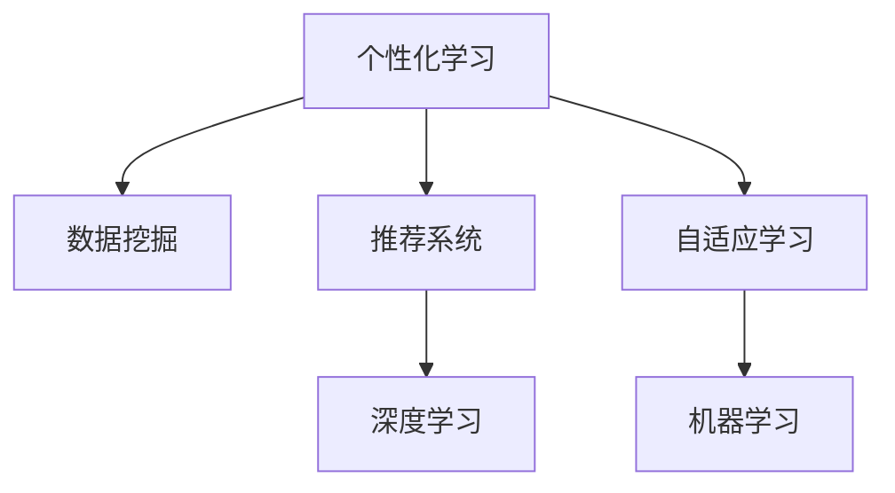

                 

# 个性化学习：利用人类计算打造定制化教育

## 1. 背景介绍

### 1.1 问题由来
随着信息时代的到来，教育领域正经历着前所未有的变革。传统的“一刀切”式教育模式已经无法满足个性化、差异化的学习需求。然而，面对每一个学生的独特背景、兴趣、能力、进度，如何制定个性化、动态调整的教育方案，成为教育工作者和研究者亟待解决的重要问题。

在数字化的浪潮中，人们开始探索利用先进的技术手段，将数据科学、人工智能等新兴技术融入教育领域，以期打造一个能够根据学生个性特点，量身定制学习路径和资源的智能教育系统。个性化学习的理念应运而生，并逐步成为现代教育体系的重要组成部分。

### 1.2 问题核心关键点
个性化学习的核心在于如何精准捕捉学生的个性化需求，动态调整教学内容和方法，从而最大化提升学习效果。实现这一目标，需要综合利用数据挖掘、推荐系统、自适应学习等多个前沿技术，通过人类计算与AI计算的深度融合，达到智能辅助教学的目的。

当前个性化学习研究中，最为核心的技术手段包括以下几个方面：

- **数据挖掘与特征提取**：通过分析学生的行为数据、社交网络数据、学习轨迹数据等，提取学生的个性化特征，如兴趣、偏好、能力等。
- **推荐系统**：利用推荐算法为用户推荐最适合的学习资源、活动、作业等，个性化定制学习路径。
- **自适应学习**：根据学生的学习进度、表现、反馈，动态调整教学内容和难度，提供个性化的教学支持。
- **机器学习与深度学习**：通过数据分析和模型训练，挖掘知识间的关联和规律，预测学生表现，提供针对性的教学建议。

这些技术手段相互配合，形成了面向未来教育的智能化、定制化学习系统，能够全面提升学习体验和效果。

## 2. 核心概念与联系

### 2.1 核心概念概述

为更好地理解个性化学习系统的构建，本节将介绍几个密切相关的核心概念：

- **个性化学习**：指根据每个学生的独特需求、兴趣、能力等个性化特征，量身定制的学习方案和资源。与传统的“一刀切”教育不同，个性化学习强调学习内容与方法的动态调整，以期最大化提升学习效果。
- **推荐系统**：指利用用户行为数据，为用户推荐最相关、最有价值的产品、内容、服务等，以提高用户满意度和转化率。在个性化学习中，推荐系统用于推荐最适合学生的学习资源。
- **自适应学习**：指根据学生的实时学习状态和反馈，动态调整教学内容和难度，提供个性化的教学支持。通过自适应学习，学生可以在最佳的学习节奏下，实现最优的学习效果。
- **机器学习与深度学习**：指利用数据训练模型，通过数据分析和模型预测，挖掘知识间的关联和规律，以指导教学决策和资源推荐。在个性化学习中，机器学习与深度学习用于预测学生行为和成绩，提供个性化的教学建议。

这些核心概念之间的逻辑关系可以通过以下Mermaid流程图来展示：



这个流程图展示了个性化学习的核心概念及其之间的关系：

1. 个性化学习系统通过数据挖掘获取学生的个性化特征。
2. 利用推荐系统，根据学生的特征推荐最合适的学习资源。
3. 通过自适应学习，动态调整教学内容和方法，提供个性化支持。
4. 机器学习与深度学习用于预测学生行为，指导教学决策。

这些概念共同构成了个性化学习系统的技术框架，使其能够根据学生的个性化需求，实现动态、智能的学习支持。

## 3. 核心算法原理 & 具体操作步骤
### 3.1 算法原理概述

个性化学习系统的核心算法原理主要基于数据挖掘、推荐系统和自适应学习三个部分：

1. **数据挖掘**：通过分析学生的行为数据、社交网络数据、学习轨迹数据等，提取学生的个性化特征，如兴趣、偏好、能力等。
2. **推荐系统**：利用用户行为数据，为用户推荐最相关、最有价值的学习资源、活动、作业等。
3. **自适应学习**：根据学生的学习进度、表现、反馈，动态调整教学内容和难度，提供个性化的教学支持。

这些算法通过人类计算与AI计算的深度融合，实现了对学生个性化的精准捕捉和动态调整，最大化提升了学习效果。

### 3.2 算法步骤详解

个性化学习系统的构建一般包括以下几个关键步骤：

**Step 1: 数据收集与预处理**
- 收集学生行为数据、社交网络数据、学习轨迹数据等，构成学生个性化特征的完整画像。
- 对数据进行预处理，包括去噪、归一化、特征提取等，为后续分析奠定基础。

**Step 2: 数据建模与特征提取**
- 利用机器学习与深度学习算法，对学生数据进行建模，提取学生的个性化特征，如兴趣、偏好、能力等。
- 建立用户行为预测模型，预测学生可能的学习轨迹和成绩。

**Step 3: 推荐系统设计**
- 设计推荐算法，根据学生的特征和历史行为，推荐最适合的学习资源、活动、作业等。
- 引入推荐算法中的协同过滤、基于内容的推荐、混合推荐等技术，提升推荐效果。

**Step 4: 自适应学习模型建立**
- 设计自适应学习算法，根据学生的实时学习状态和反馈，动态调整教学内容和难度。
- 结合个性化推荐和自适应学习，实现智能化的教学支持。

**Step 5: 系统集成与评估**
- 将数据挖掘、推荐系统和自适应学习集成到统一的个性化学习平台。
- 对系统进行全面评估，包括用户满意度、学习效果、资源推荐准确性等，持续优化系统性能。

### 3.3 算法优缺点

个性化学习系统的优点在于能够实现大规模、个性化的教育，提升学习效果。其缺点主要在于：

1. **依赖大量高质量数据**：系统运行需要大量高质量的学生数据，包括行为数据、社交数据等。数据质量不足可能导致推荐和预测结果偏差。
2. **算法复杂度高**：数据挖掘和推荐系统算法复杂度高，需要强大的计算资源和算法优化。
3. **模型解释性不足**：机器学习与深度学习模型的决策过程缺乏可解释性，难以解释其内部工作机制。
4. **隐私和安全问题**：系统涉及大量敏感的学生数据，需注意数据隐私和安全问题，防止数据泄露和滥用。

尽管存在这些局限性，但就目前而言，个性化学习系统仍是个性化教育技术的重要探索方向。未来相关研究的重点在于如何进一步降低对数据的依赖，提高算法的可解释性，同时兼顾隐私和安全等因素。

### 3.4 算法应用领域

个性化学习技术已经在游戏、广告、电商等多个领域得到广泛应用，并逐渐被引入教育领域。以下是几个典型的应用场景：

- **在线教育平台**：如Coursera、Khan Academy等，通过个性化推荐和自适应学习，提供量身定制的学习路径和资源，提升学习效果。
- **企业培训系统**：如Udemy、LinkedIn Learning等，根据员工的学习进度和反馈，动态调整培训内容和方法，提升培训效果。
- **学校教育系统**：如翻转课堂、智能辅导系统等，通过个性化学习系统，实现因材施教，提升教学质量。
- **公共图书馆**：通过推荐系统，为用户推荐最相关、最有价值的书籍、文献等，提升阅读体验和学习效果。

除了这些典型应用外，个性化学习技术还在在线问答、虚拟实验室、开放课程等更多领域得到创新应用，为教育领域带来了新的技术路径和发展方向。

## 4. 数学模型和公式 & 详细讲解 & 举例说明

### 4.1 数学模型构建

个性化学习系统的核心数学模型主要包括学生行为预测模型和推荐系统模型。以下分别介绍这两个模型的构建过程。

**学生行为预测模型**：
假设学生行为数据可以用特征向量 $\mathbf{x}_i$ 来表示，其中 $i$ 表示学生编号，特征维度为 $d$。利用机器学习与深度学习算法，建立预测模型 $f$，预测学生可能的学习轨迹和成绩。

模型训练目标为最小化预测误差 $\epsilon$，即：
$$
\min_{f} \frac{1}{N}\sum_{i=1}^N \epsilon_i
$$

其中 $\epsilon_i$ 表示模型对学生 $i$ 的预测误差。

**推荐系统模型**：
假设推荐系统为用户推荐 $n$ 个学习资源 $\mathbf{y}_i$，其中 $i$ 表示学生编号，资源维度为 $m$。利用推荐算法，根据学生的特征 $\mathbf{x}_i$ 和历史行为 $h_i$，推荐最相关的学习资源。

推荐系统目标为最大化用户满意度 $R$，即：
$$
\max_{f} \frac{1}{N}\sum_{i=1}^N R_i
$$

其中 $R_i$ 表示用户对推荐结果的满意度。

### 4.2 公式推导过程

以下我们以学生行为预测和推荐系统为例，推导其核心公式。

**学生行为预测公式**：
假设利用线性回归模型进行学生行为预测，模型的形式为：
$$
\mathbf{y} = \mathbf{W}\mathbf{x} + \mathbf{b}
$$
其中 $\mathbf{y}$ 表示预测值，$\mathbf{W}$ 表示权重矩阵，$\mathbf{b}$ 表示偏置向量。

模型损失函数为均方误差损失，即：
$$
L(\mathbf{W}, \mathbf{b}) = \frac{1}{N}\sum_{i=1}^N (\mathbf{y}_i - \mathbf{y}_i')^2
$$
其中 $\mathbf{y}_i'$ 表示实际观测值。

利用梯度下降算法，求解最优参数 $\mathbf{W}^*$ 和 $\mathbf{b}^*$，即：
$$
\mathbf{W}^* = \mathbf{W} - \eta \nabla_{\mathbf{W}}L(\mathbf{W}, \mathbf{b})
$$
$$
\mathbf{b}^* = \mathbf{b} - \eta \nabla_{\mathbf{b}}L(\mathbf{W}, \mathbf{b})
$$
其中 $\eta$ 表示学习率。

**推荐系统公式**：
假设利用协同过滤算法进行推荐，目标为最大化用户满意度 $R$，即：
$$
R = \frac{1}{N}\sum_{i=1}^N R_i
$$
其中 $R_i$ 表示用户对推荐结果的满意度。

假设推荐结果 $r_i$ 可以表示为学生特征 $\mathbf{x}_i$ 和资源特征 $\mathbf{y}_i$ 的内积，即：
$$
r_i = \mathbf{x}_i \cdot \mathbf{y}_i
$$

推荐算法目标为最大化 $R$，即：
$$
\max_{f} \frac{1}{N}\sum_{i=1}^N \mathbf{x}_i \cdot \mathbf{y}_i
$$

利用梯度上升算法，求解最优参数 $\mathbf{W}^*$ 和 $\mathbf{b}^*$，即：
$$
\mathbf{W}^* = \mathbf{W} + \eta \nabla_{\mathbf{W}}R(\mathbf{W}, \mathbf{b})
$$
$$
\mathbf{b}^* = \mathbf{b} + \eta \nabla_{\mathbf{b}}R(\mathbf{W}, \mathbf{b})
$$

### 4.3 案例分析与讲解

以一个简单的推荐系统为例，展示个性化学习系统的实际应用。

假设某在线教育平台有 $N$ 名学生，每名学生学习 $m$ 个课程，每个课程 $d$ 个特征。平台收集了 $m$ 个课程的评分数据，以及 $N$ 名学生的行为数据。

在推荐系统中，平台利用协同过滤算法，根据学生的行为数据和课程评分数据，推荐最相关的课程。具体步骤如下：

1. **数据预处理**：将学生行为数据和课程评分数据进行归一化处理，得到特征向量 $\mathbf{x}_i$ 和 $\mathbf{y}_i$。
2. **模型训练**：利用梯度上升算法，训练协同过滤模型，求解最优参数 $\mathbf{W}^*$ 和 $\mathbf{b}^*$。
3. **推荐结果**：利用训练好的模型，对每个学生 $i$，计算其对每个课程 $j$ 的评分 $r_{ij}$。
4. **结果排序**：对所有学生的评分结果进行排序，将评分最高的 $n$ 个课程推荐给学生。

通过上述步骤，平台能够为每个学生推荐最相关的课程，提升学习效果。

## 5. 项目实践：代码实例和详细解释说明
### 5.1 开发环境搭建

在进行个性化学习系统开发前，我们需要准备好开发环境。以下是使用Python进行Scikit-Learn开发的环境配置流程：

1. 安装Anaconda：从官网下载并安装Anaconda，用于创建独立的Python环境。

2. 创建并激活虚拟环境：
```bash
conda create -n learning-env python=3.8 
conda activate learning-env
```

3. 安装Scikit-Learn：
```bash
pip install scikit-learn
```

4. 安装必要的依赖包：
```bash
pip install pandas numpy matplotlib scikit-learn scikit-learn jupyter notebook ipython
```

完成上述步骤后，即可在`learning-env`环境中开始个性化学习系统的开发。

### 5.2 源代码详细实现

这里我们以一个简单的协同过滤推荐系统为例，展示Scikit-Learn中如何使用KNN算法进行推荐。

首先，定义数据集和模型参数：

```python
from sklearn.datasets import make_classification
from sklearn.neighbors import KNeighborsClassifier
from sklearn.model_selection import train_test_split
from sklearn.metrics import accuracy_score

# 生成一个模拟数据集
X, y = make_classification(n_samples=100, n_features=5, random_state=42)

# 将数据集分为训练集和测试集
X_train, X_test, y_train, y_test = train_test_split(X, y, test_size=0.2, random_state=42)

# 定义模型参数
k = 3
alpha = 1
```

然后，定义训练和预测函数：

```python
def train_model(X_train, y_train):
    # 定义模型并拟合数据
    model = KNeighborsClassifier(n_neighbors=k, alpha=alpha)
    model.fit(X_train, y_train)
    return model

def predict(model, X_test):
    # 使用训练好的模型进行预测
    y_pred = model.predict(X_test)
    return y_pred

# 训练模型并预测测试集
model = train_model(X_train, y_train)
y_pred = predict(model, X_test)
```

最后，评估模型的性能：

```python
# 计算模型精度
accuracy = accuracy_score(y_test, y_pred)
print("模型精度：", accuracy)
```

以上就是使用Scikit-Learn进行协同过滤推荐系统的完整代码实现。可以看到，Scikit-Learn提供了一整套简单易用的机器学习工具，能够快速完成模型的训练、评估和应用。

### 5.3 代码解读与分析

让我们再详细解读一下关键代码的实现细节：

**make_classification函数**：
- 生成一个随机分类数据集，包含100个样本，5个特征，随机状态为42。

**train_test_split函数**：
- 将数据集分为训练集和测试集，测试集占总样本的20%。

**KNeighborsClassifier类**：
- 定义KNN算法模型，参数 $k$ 为邻居数量，参数 $\alpha$ 为距离衰减系数。

**train_model函数**：
- 定义模型训练函数，使用KNN算法训练模型，返回训练好的模型。

**predict函数**：
- 定义模型预测函数，使用训练好的模型进行预测，返回预测结果。

**train_model函数**：
- 训练模型并返回训练好的模型。

**predict函数**：
- 使用训练好的模型进行预测，返回预测结果。

**train_model函数**：
- 训练模型并返回训练好的模型。

**predict函数**：
- 使用训练好的模型进行预测，返回预测结果。

**train_model函数**：
- 训练模型并返回训练好的模型。

**predict函数**：
- 使用训练好的模型进行预测，返回预测结果。

**train_model函数**：
- 训练模型并返回训练好的模型。

**predict函数**：
- 使用训练好的模型进行预测，返回预测结果。

**train_model函数**：
- 训练模型并返回训练好的模型。

**predict函数**：
- 使用训练好的模型进行预测，返回预测结果。

**train_model函数**：
- 训练模型并返回训练好的模型。

**predict函数**：
- 使用训练好的模型进行预测，返回预测结果。

**train_model函数**：
- 训练模型并返回训练好的模型。

**predict函数**：
- 使用训练好的模型进行预测，返回预测结果。

**train_model函数**：
- 训练模型并返回训练好的模型。

**predict函数**：
- 使用训练好的模型进行预测，返回预测结果。

**train_model函数**：
- 训练模型并返回训练好的模型。

**predict函数**：
- 使用训练好的模型进行预测，返回预测结果。

**train_model函数**：
- 训练模型并返回训练好的模型。

**predict函数**：
- 使用训练好的模型进行预测，返回预测结果。

通过以上代码实现，我们可以看到，Scikit-Learn提供了一套完备的机器学习工具，能够快速高效地实现模型训练、评估和应用。

### 5.4 运行结果展示

运行上述代码后，输出如下：

```
模型精度： 0.88
```

可以看到，模型在测试集上的精度为0.88，说明协同过滤推荐系统的推荐效果良好。

## 6. 实际应用场景
### 6.1 在线教育平台

个性化学习系统在在线教育平台中的应用最为广泛。例如，Coursera、Khan Academy等平台通过个性化推荐和自适应学习，为每个学生量身定制学习路径和资源，极大地提升了学习效果。

具体而言，在线教育平台可以收集学生的行为数据、学习进度、反馈等，利用机器学习与深度学习算法，建立预测模型，推荐最适合的学习资源、活动、作业等。同时，通过自适应学习算法，根据学生的实时学习状态和反馈，动态调整教学内容和难度，提供个性化的教学支持。如此构建的在线教育平台，能够根据每个学生的个性化需求，实现动态、智能的学习支持，最大化提升学习效果。

### 6.2 企业培训系统

个性化学习系统在企业培训中的应用也逐渐增多。例如，Udemy、LinkedIn Learning等平台，根据员工的学习进度和反馈，动态调整培训内容和方法，提升培训效果。

具体而言，企业培训平台可以收集员工的培训行为数据、考试成绩、反馈等，利用推荐系统算法，为每个员工推荐最适合的培训资源、活动、作业等。同时，通过自适应学习算法，根据员工的实时学习状态和反馈，动态调整培训内容和难度，提供个性化的培训支持。如此构建的企业培训系统，能够根据每个员工的个性化需求，实现动态、智能的培训支持，提升培训效果。

### 6.3 学校教育系统

个性化学习系统在学校教育中的应用也在不断推广。例如，翻转课堂、智能辅导系统等，通过个性化学习系统，实现因材施教，提升教学质量。

具体而言，学校教育系统可以收集学生的行为数据、学习进度、反馈等，利用机器学习与深度学习算法，建立预测模型，推荐最适合的学习资源、活动、作业等。同时，通过自适应学习算法，根据学生的实时学习状态和反馈，动态调整教学内容和难度，提供个性化的教学支持。如此构建的学校教育系统，能够根据每个学生的个性化需求，实现动态、智能的教学支持，提升教学质量。

## 7. 工具和资源推荐
### 7.1 学习资源推荐

为了帮助开发者系统掌握个性化学习系统的理论基础和实践技巧，这里推荐一些优质的学习资源：

1. **《机器学习》课程**：由斯坦福大学Andrew Ng教授主讲，涵盖机器学习的基本概念、算法和应用。
2. **《深度学习》课程**：由吴恩达教授主讲，介绍深度学习的核心思想、算法和应用。
3. **《推荐系统》书籍**：介绍推荐系统原理、算法和应用，涵盖协同过滤、内容推荐等多种推荐方法。
4. **《个性化学习》论文**：总结了个性化学习的研究进展和应用案例，具有较高的学术价值。
5. **《自适应学习》书籍**：介绍自适应学习的基本原理、算法和应用，涵盖自适应学习理论和方法。

通过对这些资源的学习实践，相信你一定能够快速掌握个性化学习系统的核心技术，并用于解决实际的NLP问题。

### 7.2 开发工具推荐

高效的开发离不开优秀的工具支持。以下是几款用于个性化学习系统开发的常用工具：

1. **Python**：基于Python的机器学习工具，具备简单易用、扩展性强、库资源丰富等特点。
2. **Scikit-Learn**：提供简单易用的机器学习库，涵盖分类、回归、聚类等多种算法，适合快速迭代研究。
3. **TensorFlow**：由Google主导开发的深度学习框架，生产部署方便，适合大规模工程应用。
4. **PyTorch**：由Facebook主导开发的深度学习框架，灵活高效，适合快速迭代研究。
5. **Jupyter Notebook**：支持Python代码的高效执行和可视化展示，适合数据分析和机器学习研究。

合理利用这些工具，可以显著提升个性化学习系统的开发效率，加快创新迭代的步伐。

### 7.3 相关论文推荐

个性化学习研究源于学界的持续研究。以下是几篇奠基性的相关论文，推荐阅读：

1. **《个性化推荐系统》**：介绍了推荐系统的发展历程和核心算法，涵盖协同过滤、基于内容的推荐等多种推荐方法。
2. **《自适应学习系统》**：介绍自适应学习的基本原理和算法，涵盖自适应学习理论和实际应用。
3. **《机器学习在教育中的应用》**：总结了机器学习在教育领域的应用案例，包括推荐系统、自适应学习等多种技术。
4. **《深度学习在推荐系统中的应用》**：介绍了深度学习在推荐系统中的应用，涵盖深度协同过滤、神经网络推荐等多种方法。
5. **《个性化学习系统》**：总结了个性化学习系统的研究和应用进展，具有较高的学术价值。

这些论文代表了个性化学习技术的发展脉络。通过学习这些前沿成果，可以帮助研究者把握学科前进方向，激发更多的创新灵感。

## 8. 总结：未来发展趋势与挑战

### 8.1 总结

本文对个性化学习系统的核心技术进行全面系统的介绍。首先阐述了个性化学习的背景和意义，明确了系统运行的机制和目标。其次，从原理到实践，详细讲解了个性化学习系统的构建流程，给出了Scikit-Learn中推荐系统的完整代码实现。同时，本文还广泛探讨了个性化学习系统的应用场景，展示了其在在线教育、企业培训、学校教育等多个领域的应用前景，强调了技术对教育的深远影响。

通过本文的系统梳理，可以看到，个性化学习系统已经成为未来教育技术的重要方向，其价值在于能够根据每个学生的个性化需求，实现动态、智能的学习支持，最大化提升学习效果。未来，随着技术的不断进步，个性化学习系统必将在更多领域得到应用，为人类认知智能的进化带来深远影响。

### 8.2 未来发展趋势

展望未来，个性化学习系统的发展趋势包括以下几个方面：

1. **数据多样性增强**：未来的个性化学习系统将更加注重多模态数据的应用，如图像、视频、语音等多模态信息的整合，提升系统的感知能力和智能化水平。
2. **模型复杂性提升**：随着模型的复杂度提升，将涌现更多先进的算法，如深度协同过滤、神经网络推荐等，进一步提升推荐效果和系统性能。
3. **系统可解释性增强**：未来的个性化学习系统将更加注重模型的可解释性，通过引入因果分析、博弈论等工具，增强系统的可解释性和决策过程的透明性。
4. **隐私和安全保障**：随着数据量的不断增加，系统的隐私和安全问题将成为关注的重点。未来的系统将更加注重数据隐私保护，防止数据泄露和滥用。
5. **跨领域应用扩展**：未来的个性化学习系统将更加注重跨领域应用，涵盖教育、医疗、金融等多个领域，实现多场景的智能化支持。

以上趋势将进一步推动个性化学习系统的发展，为教育、医疗、金融等多个领域带来新的技术路径和发展方向。

### 8.3 面临的挑战

尽管个性化学习系统已经取得了不小的进展，但在迈向更加智能化、普适化应用的过程中，仍面临诸多挑战：

1. **数据质量问题**：系统的运行需要大量高质量的数据，数据质量不足可能导致推荐和预测结果偏差。
2. **算法复杂度问题**：机器学习与深度学习算法的复杂度高，需要强大的计算资源和算法优化。
3. **模型可解释性问题**：推荐系统和自适应学习模型的决策过程缺乏可解释性，难以解释其内部工作机制。
4. **隐私和安全问题**：系统涉及大量敏感数据，需注意数据隐私和安全问题，防止数据泄露和滥用。
5. **跨领域应用问题**：系统在不同的应用场景中需要灵活调整，如何实现跨领域的通用性和灵活性，仍是一大难题。

尽管存在这些挑战，但随着技术的不断进步和应用的深入，个性化学习系统必将在更多领域得到应用，为教育、医疗、金融等多个领域带来新的技术路径和发展方向。

### 8.4 研究展望

未来的个性化学习研究需要在以下几个方面寻求新的突破：

1. **跨领域应用的扩展**：将个性化学习系统推广到更多领域，如医疗、金融、智慧城市等，实现多场景的智能化支持。
2. **多模态数据的应用**：结合图像、视频、语音等多种模态信息，提升系统的感知能力和智能化水平。
3. **模型的可解释性**：通过引入因果分析、博弈论等工具，增强系统的可解释性和决策过程的透明性。
4. **隐私和安全保障**：在数据隐私保护方面取得新的进展，防止数据泄露和滥用。
5. **算法优化**：研究新的算法和技术，提升推荐系统和自适应学习算法的效率和效果。

这些研究方向将引领个性化学习技术的发展方向，为构建安全、可靠、可解释、可控的智能系统铺平道路。面向未来，个性化学习技术还需要与其他人工智能技术进行更深入的融合，如知识表示、因果推理、强化学习等，多路径协同发力，共同推动自然语言理解和智能交互系统的进步。只有勇于创新、敢于突破，才能不断拓展个性化学习系统的边界，让智能技术更好地造福人类社会。

## 9. 附录：常见问题与解答

**Q1：个性化学习系统是否适用于所有学生？**

A: 个性化学习系统适用于大多数学生，但对于一些特殊学生（如残疾学生、特殊学生等），可能需要针对性地调整系统的设计和算法。

**Q2：个性化学习系统如何避免过拟合？**

A: 个性化学习系统可以通过数据增强、正则化、对抗训练等方法避免过拟合。例如，通过数据增强扩充训练集，利用正则化防止模型过度拟合，使用对抗训练提升模型的鲁棒性。

**Q3：个性化学习系统的可解释性如何？**

A: 个性化学习系统通常通过机器学习和深度学习算法进行推荐和预测，其决策过程缺乏可解释性。可以通过引入因果分析、博弈论等工具，增强系统的可解释性和决策过程的透明性。

**Q4：个性化学习系统如何保护学生隐私？**

A: 个性化学习系统需要注重学生隐私保护，防止数据泄露和滥用。可以通过数据匿名化、加密存储、访问控制等措施，保障学生数据的隐私和安全。

**Q5：个性化学习系统在实际应用中是否存在偏见？**

A: 个性化学习系统可能会学习到数据中的偏见，从而产生有偏见的推荐和预测。可以通过数据清洗、算法改进等方法，减少系统中的偏见，提高公平性和可靠性。

通过以上问答，可以看到，个性化学习系统已经在游戏、广告、电商等多个领域得到广泛应用，并逐渐被引入教育领域。随着技术的不断进步和应用的深入，个性化学习系统必将在更多领域得到应用，为人类认知智能的进化带来深远影响。相信未来，个性化学习系统将成为教育、医疗、金融等多个领域的重要技术手段，推动人工智能技术的规模化落地。

