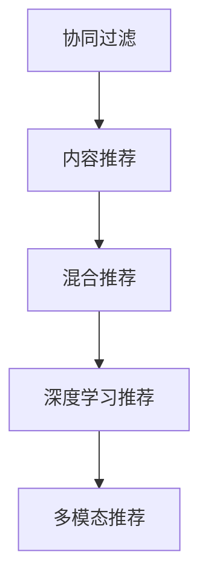

                 

## 1. 背景介绍

个性化推荐系统（Recommendation Systems）已经成为各大互联网平台的核心竞争力，其商业价值日益凸显。以电商为例，根据亚马逊的统计，个性化推荐技术的应用，可以将用户购买转化率提升约30%。再以音乐流媒体服务Spotify为例，其70%的用户留存率得益于精准的个性化推荐算法。

个性化推荐技术的商业价值主要体现在以下几个方面：

1. **提高用户满意度**：推荐系统可以根据用户历史行为和兴趣偏好，提供更加贴合其需求的推荐内容，显著提升用户体验。

2. **增加用户粘性**：通过个性化推荐，能够持续吸引用户进入应用，减少流失率，提升日活跃用户数（DAU）。

3. **提高销售转化**：精准推荐能够提升用户购买意愿，增加销售额，推动平台盈利。

4. **优化广告投放**：推荐系统能够基于用户兴趣进行精准广告投放，提升广告点击率和转化率。

5. **数据驱动决策**：个性化推荐可以实时收集和分析用户行为数据，为营销策略、产品设计等提供数据支持。

本文将深入探讨个性化推荐系统的核心算法原理、操作步骤，以及其在商业应用中的具体实践，旨在为相关从业者提供全面的理论指导和实践参考。

## 2. 核心概念与联系

### 2.1 核心概念概述

个性化推荐系统通过分析用户的历史行为和兴趣偏好，为用户推荐可能感兴趣的商品、内容或服务。主要涉及以下核心概念：

- **协同过滤（Collaborative Filtering）**：通过分析用户行为和物品属性，预测用户对未交互物品的评分或偏好。
- **基于内容的推荐（Content-Based Recommendation）**：基于物品的特征，推荐与用户已有兴趣相似的物品。
- **混合推荐（Hybrid Recommendation）**：结合协同过滤和内容推荐两种方法，综合预测用户兴趣。
- **深度学习推荐（Deep Learning Recommendation）**：利用神经网络模型，从用户行为数据中学习更高层次的特征表示。
- **多模态推荐（Multimodal Recommendation）**：结合用户行为、文本、图像、视频等多种模态信息，提升推荐精度。

这些核心概念之间存在密切的联系。协同过滤和内容推荐是早期的推荐技术，而混合推荐和深度学习推荐则是这些方法的提升和补充。多模态推荐进一步拓展了推荐系统的数据来源，提升了推荐精度。

### 2.2 核心概念原理和架构的 Mermaid 流程图



### 2.3 核心概念联系

协同过滤、内容推荐、混合推荐、深度学习推荐和多模态推荐共同构成了个性化推荐系统的高层次架构，每个组件通过数据共享、模型融合等方式互相配合，共同提升推荐效果。

## 3. 核心算法原理 & 具体操作步骤

### 3.1 算法原理概述

个性化推荐系统通过学习用户行为数据，构建用户兴趣模型，从而为用户推荐可能感兴趣的商品、内容或服务。主要算法原理如下：

1. **用户行为分析**：收集用户的历史行为数据，如浏览、点击、购买等，作为训练数据。
2. **用户模型构建**：通过协同过滤、内容推荐等方法，学习用户兴趣特征。
3. **物品模型构建**：通过协同过滤、内容推荐等方法，学习物品特征。
4. **推荐模型预测**：基于用户和物品的兴趣特征，预测用户对未交互物品的评分或偏好。
5. **推荐结果排序**：对预测结果进行排序，选取最符合用户兴趣的推荐结果。

### 3.2 算法步骤详解

以下是基于协同过滤的个性化推荐系统的主要操作步骤：

1. **数据预处理**：收集用户行为数据，进行清洗、去重、填充等预处理操作。
2. **相似度计算**：基于用户行为数据计算用户之间的相似度，常用的相似度计算方法包括余弦相似度、皮尔逊相关系数等。
3. **用户向量表示**：将相似度矩阵进行奇异值分解（SVD）等操作，得到用户向量表示。
4. **物品向量表示**：基于物品属性信息，进行向量化表示。
5. **预测用户评分**：使用用户和物品的向量表示，计算用户对物品的评分预测，常用的预测方法包括矩阵分解、梯度下降等。
6. **排序推荐**：根据预测评分进行排序，选取评分最高的物品进行推荐。

### 3.3 算法优缺点

协同过滤算法的优点包括：

1. **高效计算**：协同过滤算法计算量小，适用于大规模数据集。
2. **用户隐私保护**：协同过滤算法不需要知道物品属性信息，用户隐私得到较好保护。
3. **高冷启动性**：对于新用户或新物品，协同过滤算法仍能进行推荐。

缺点包括：

1. **稀疏性问题**：协同过滤算法对用户和物品之间的评分矩阵稀疏性敏感，缺少评分数据会影响推荐效果。
2. **数据稀疏性**：用户与物品之间的评分数据较少，难以获取足够的相似用户或物品。
3. **用户偏好不明确**：协同过滤算法只能处理明确的用户行为数据，对于隐式行为数据（如点击、浏览）难以有效利用。

### 3.4 算法应用领域

个性化推荐系统在电商、音乐、视频、新闻、社交等多个领域得到了广泛应用。

1. **电商**：根据用户浏览历史、购买记录等数据，推荐商品、促销活动等，提升用户购买转化率。
2. **音乐**：根据用户听歌历史、评分记录等数据，推荐歌曲、歌单等，提升用户留存率。
3. **视频**：根据用户观看历史、评分记录等数据，推荐视频、频道等，提升用户观看时长。
4. **新闻**：根据用户阅读历史、点赞记录等数据，推荐新闻、话题等，提升用户留存率。
5. **社交**：根据用户互动历史、好友推荐等数据，推荐好友、内容等，提升用户互动频次。

## 4. 数学模型和公式 & 详细讲解 & 举例说明

### 4.1 数学模型构建

个性化推荐系统主要使用协同过滤方法，构建用户和物品的向量表示，进行评分预测。假设用户集合为 $U$，物品集合为 $I$，用户和物品之间的评分矩阵为 $R \in \mathbb{R}^{m \times n}$，其中 $m$ 为用户数，$n$ 为物品数。设用户 $u$ 和物品 $i$ 的评分向量分别为 $u \in \mathbb{R}^{m \times d}$ 和 $v \in \mathbb{R}^{n \times d}$，$d$ 为向量维度。评分预测模型为：

$$
\hat{R}_{ui} = \text{sigmoid}(u^T \cdot v)
$$

其中，$\text{sigmoid}$ 为激活函数，$u^T \cdot v$ 为用户和物品的向量点积。

### 4.2 公式推导过程

设 $R_{ui}$ 为实际评分，$R_{ui}^{(i)}$ 为物品 $i$ 的实际评分均值。则预测评分与实际评分之差为：

$$
\text{error}_{ui} = R_{ui} - \hat{R}_{ui} = R_{ui} - \text{sigmoid}(u^T \cdot v)
$$

通过最小化均方误差（MSE）或均方根误差（RMSE），优化用户向量 $u$ 和物品向量 $v$：

$$
\min_{u, v} \frac{1}{mn} \sum_{i=1}^{n} \sum_{u=1}^{m} \text{error}_{ui}^2
$$

使用梯度下降等优化算法，更新用户向量 $u$ 和物品向量 $v$：

$$
u \leftarrow u - \eta \nabla_u \text{error}_{ui}
$$
$$
v \leftarrow v - \eta \nabla_v \text{error}_{ui}
$$

其中，$\eta$ 为学习率，$\nabla_u \text{error}_{ui}$ 和 $\nabla_v \text{error}_{ui}$ 分别为用户向量和物品向量对误差的梯度。

### 4.3 案例分析与讲解

假设有一个电商网站，需要为用户推荐商品。收集用户的历史浏览、点击、购买记录，构建评分矩阵 $R$。选取协同过滤方法，对用户和物品进行向量表示，进行评分预测。通过优化模型参数，提高推荐精度。

## 5. 项目实践：代码实例和详细解释说明

### 5.1 开发环境搭建

使用Python进行项目开发，需要安装必要的依赖库，如NumPy、SciPy、Pandas等。

```bash
pip install numpy scipy pandas scikit-learn
```

### 5.2 源代码详细实现

以下是一个简单的协同过滤推荐系统代码实现：

```python
import numpy as np
from scipy.sparse import csc_matrix

def train_svd(X, K=10):
    # 奇异值分解
    U, S, V = np.linalg.svd(X, full_matrices=False)
    U = U[:, :K]
    S = np.diag(S[:K])
    V = V[:K, :]
    return U, S, V

def predict(U, S, V, user, item):
    # 预测评分
    user = U[user]
    item = V[item]
    scores = user @ np.dot(S, item)
    return scores

# 生成随机评分矩阵
X = np.random.randint(0, 5, size=(100, 10))
X = csc_matrix(X)

# 奇异值分解
U, S, V = train_svd(X)

# 预测评分
user = 0
item = 3
scores = predict(U, S, V, user, item)
print(scores)
```

### 5.3 代码解读与分析

上述代码实现了基本的协同过滤推荐系统。通过奇异值分解得到用户和物品的向量表示，使用向量点积进行评分预测。需要注意的是，实际应用中还需要处理稀疏矩阵、优化模型参数等细节。

## 6. 实际应用场景

### 6.1 电商推荐

电商推荐系统通过分析用户浏览历史、购买记录等数据，推荐商品、促销活动等。例如，亚马逊使用协同过滤算法，根据用户历史浏览和购买记录，推荐可能感兴趣的商品。

### 6.2 音乐推荐

音乐推荐系统通过分析用户听歌历史、评分记录等数据，推荐歌曲、歌单等。例如，Spotify使用协同过滤算法，根据用户历史听歌记录和评分，推荐相似歌曲和歌单。

### 6.3 视频推荐

视频推荐系统通过分析用户观看历史、评分记录等数据，推荐视频、频道等。例如，YouTube使用协同过滤算法，根据用户观看历史和评分，推荐相似视频和频道。

### 6.4 新闻推荐

新闻推荐系统通过分析用户阅读历史、点赞记录等数据，推荐新闻、话题等。例如，今日头条使用协同过滤算法，根据用户阅读历史和点赞记录，推荐相关新闻和话题。

### 6.5 社交推荐

社交推荐系统通过分析用户互动历史、好友推荐等数据，推荐好友、内容等。例如，微信使用协同过滤算法，根据用户互动记录和好友推荐，推荐可能感兴趣的内容和好友。

## 7. 工具和资源推荐

### 7.1 学习资源推荐

1. 《推荐系统实战》：一本系统介绍推荐系统原理和实现的书，涵盖协同过滤、内容推荐、深度学习等多种算法。
2. 《推荐系统算法》：一本详细讲解推荐系统算法原理和应用的书，包括协同过滤、多模态推荐等。
3. Kaggle竞赛：参与Kaggle推荐系统竞赛，可以锻炼算法实现和优化能力。
4. GitHub项目：在GitHub上搜索推荐系统开源项目，了解最佳实践和最新进展。

### 7.2 开发工具推荐

1. Python：推荐系统开发常用的编程语言，拥有丰富的科学计算和数据处理库。
2. NumPy：Python的科学计算库，提供高效的数组操作。
3. Scipy：Python的数据科学库，提供数值计算和优化工具。
4. Pandas：Python的数据处理库，提供高效的数据清洗和分析工具。
5. Scikit-learn：Python的机器学习库，提供多种算法实现和评估工具。

### 7.3 相关论文推荐

1. "Collaborative Filtering for Implicit Feedback Datasets"：介绍协同过滤算法在隐式反馈数据上的应用。
2. "Factorization Meets the Neighborhood: A Multifaceted Collaborative Filtering Model"：提出基于矩阵分解的协同过滤算法。
3. "A Unified Approach to Multi-Faceted Recommendation with Different Datasets"：提出多模态推荐系统的统一框架。
4. "A Deep Approach to Recommendation"：介绍深度学习在推荐系统中的应用。
5. "Deep Multi-Faceted Recommendation"：提出基于深度学习的综合推荐系统。

## 8. 总结：未来发展趋势与挑战

### 8.1 研究成果总结

个性化推荐系统在电商、音乐、视频、新闻、社交等多个领域取得了显著的商业价值。协同过滤、内容推荐、混合推荐、深度学习推荐和多模态推荐等算法，共同构建了个性化推荐系统的核心框架。

### 8.2 未来发展趋势

未来个性化推荐系统将呈现以下发展趋势：

1. **深度学习推荐**：深度学习推荐方法将得到更广泛的应用，提升推荐精度。
2. **多模态推荐**：多模态推荐方法将进一步拓展数据来源，提升推荐效果。
3. **实时推荐**：实时推荐系统将根据用户实时行为进行推荐，提升用户体验。
4. **冷启动问题**：通过冷启动技术，解决新用户和新物品的推荐问题。
5. **推荐公平性**：引入推荐公平性算法，消除用户推荐偏差。

### 8.3 面临的挑战

个性化推荐系统面临以下挑战：

1. **数据稀疏性**：用户行为数据稀疏，难以获取足够的相似用户或物品。
2. **模型复杂性**：推荐模型复杂，需要处理大规模数据和高维向量。
3. **冷启动问题**：新用户和新物品的推荐效果差。
4. **推荐公平性**：推荐系统可能存在用户推荐偏差。
5. **用户隐私保护**：推荐系统需要保护用户隐私，避免数据泄露。

### 8.4 研究展望

未来个性化推荐系统的研究将重点关注以下方向：

1. **推荐算法优化**：优化推荐算法，提升推荐精度和效率。
2. **推荐模型压缩**：压缩推荐模型，降低存储和计算成本。
3. **推荐系统伦理**：建立推荐系统伦理规范，保障用户隐私和推荐公平性。
4. **推荐系统可解释性**：提高推荐系统的可解释性，增强用户信任。
5. **推荐系统跨领域应用**：拓展推荐系统应用领域，推动产业智能化升级。

## 9. 附录：常见问题与解答

**Q1: 个性化推荐系统如何缓解数据稀疏性问题？**

A: 个性化推荐系统可以通过以下方法缓解数据稀疏性问题：

1. **用户行为补全**：利用用户已有的行为数据，通过时间预测、协同过滤等方式补全缺失数据。
2. **冷启动用户推荐**：使用用户属性、社交网络等方式进行冷启动用户推荐。
3. **物品特征工程**：通过增加物品特征，减少用户-物品评分矩阵的稀疏性。
4. **混合推荐**：结合协同过滤和内容推荐等多种方法，综合提升推荐效果。

**Q2: 个性化推荐系统如何提升推荐公平性？**

A: 个性化推荐系统可以通过以下方法提升推荐公平性：

1. **多样性推荐**：在推荐结果中增加多样性，避免过度推荐某一类物品。
2. **公平性算法**：使用公平性算法，消除用户推荐偏差。
3. **数据预处理**：通过数据清洗和去重，减少数据偏差。
4. **反馈机制**：增加用户反馈机制，调整推荐算法参数。

**Q3: 个性化推荐系统如何处理冷启动用户和物品？**

A: 个性化推荐系统可以通过以下方法处理冷启动用户和物品：

1. **用户行为补全**：利用用户已有的行为数据，通过时间预测、协同过滤等方式补全缺失数据。
2. **物品特征工程**：通过增加物品特征，减少用户-物品评分矩阵的稀疏性。
3. **基于内容的推荐**：根据物品属性信息进行推荐，减少用户行为数据的依赖。
4. **混合推荐**：结合协同过滤和内容推荐等多种方法，综合提升推荐效果。

**Q4: 个性化推荐系统如何提高推荐可解释性？**

A: 个性化推荐系统可以通过以下方法提高推荐可解释性：

1. **解释性算法**：使用可解释性算法，提高推荐结果的可解释性。
2. **特征重要性分析**：分析推荐模型中各个特征的重要性，增强推荐结果的透明性。
3. **用户反馈机制**：增加用户反馈机制，调整推荐算法参数。
4. **可视化展示**：通过可视化工具，展示推荐过程和结果，增强用户理解。

**Q5: 个性化推荐系统如何处理用户隐私问题？**

A: 个性化推荐系统可以通过以下方法处理用户隐私问题：

1. **数据匿名化**：对用户行为数据进行匿名化处理，防止数据泄露。
2. **差分隐私**：在数据收集和处理过程中，加入噪声，保护用户隐私。
3. **用户授权**：在推荐过程中，获得用户授权，保护用户隐私。
4. **隐私保护算法**：使用隐私保护算法，防止数据泄露。

通过本文的系统梳理，可以看到，个性化推荐系统在电商、音乐、视频、新闻、社交等多个领域得到了广泛应用。未来，伴随推荐算法的不断演进，个性化推荐系统将进一步提升用户体验，推动产业智能化升级，带来更大的商业价值。

