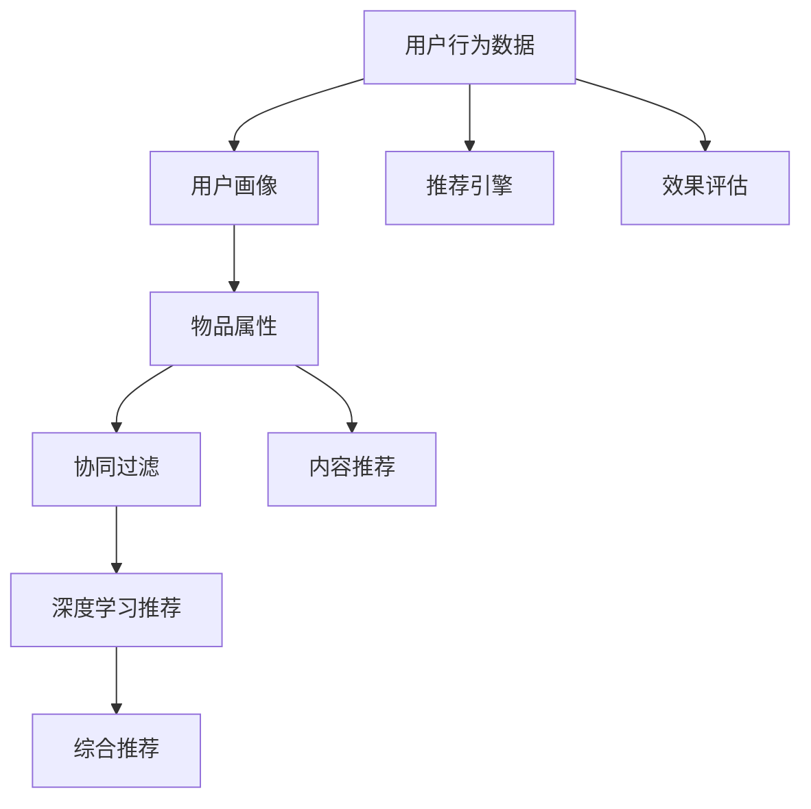

                 

# 个性化推荐的用户体验优化

## 1. 背景介绍

在当前数字化时代，个性化推荐已成为各大平台提升用户满意度、增加用户粘性的重要手段。无论是电商网站、视频流媒体，还是新闻资讯、社交网络，推荐系统都在不断尝试改进用户体验，提升用户停留时间。然而，随着推荐算法的日趋复杂，如何在不降低系统性能的前提下，优化用户体验，成为了推荐系统开发者需要解决的重要问题。

本文将从个性化推荐系统的发展历程、核心原理出发，深入探讨如何通过算法和工程手段，实现个性化推荐的性能优化，并在实际应用中确保用户体验。

## 2. 核心概念与联系

### 2.1 核心概念概述

- **个性化推荐系统（Personalized Recommendation System）**：通过分析用户的历史行为、偏好，提供个性化的物品推荐，提升用户体验的系统。常见的推荐方法包括协同过滤、基于内容的推荐、深度学习推荐等。

- **协同过滤（Collaborative Filtering）**：利用用户之间的相似性，通过用户的历史行为数据，推测出用户可能感兴趣的物品。协同过滤包括基于用户的协同过滤（User-Based CF）和基于物品的协同过滤（Item-Based CF）两种方法。

- **基于内容的推荐（Content-Based Recommendation）**：利用物品的属性信息，匹配用户的历史偏好，从而推荐相似的物品。

- **深度学习推荐（Deep Learning-Based Recommendation）**：通过构建复杂的神经网络模型，挖掘用户和物品之间的深层特征，实现更准确的推荐。

- **用户行为数据（User Behavior Data）**：记录用户浏览、点击、购买等行为信息，是推荐算法的重要数据来源。

- **物品属性（Item Attributes）**：描述物品的各类属性信息，包括文本描述、价格、标签等。

这些核心概念通过协同工作，构建了个性化推荐系统的完整框架。然而，实际应用中，推荐系统的优化往往需要跨多个维度进行。下面将详细讲解核心算法原理，并通过具体实例演示操作步骤。

### 2.2 核心概念原理和架构的 Mermaid 流程图



## 3. 核心算法原理 & 具体操作步骤

### 3.1 算法原理概述

个性化推荐系统的核心目标是根据用户的历史行为和偏好，预测用户可能感兴趣的物品，从而实现个性化的推荐。常见的推荐算法包括协同过滤、基于内容的推荐和深度学习推荐。本文将重点介绍深度学习推荐，因为其在用户行为数据的利用、物品属性挖掘等方面具有天然优势。

深度学习推荐系统主要由两个部分组成：用户嵌入（User Embedding）和物品嵌入（Item Embedding）。用户嵌入表示用户的兴趣偏好，物品嵌入表示物品的特征。推荐算法通过计算用户嵌入和物品嵌入的相似度，排序推荐结果，并返回用户最感兴趣的物品。

常用的深度学习推荐模型包括矩阵分解（如SVD）、深度神经网络（如Neural Collaborative Filtering）和注意力机制（如Attention-Based Recommendation）。这些模型在各自领域内均有广泛的应用和研究。

### 3.2 算法步骤详解

深度学习推荐算法的基本步骤如下：

1. **数据准备**：收集用户行为数据和物品属性数据，并进行预处理。

2. **用户嵌入构建**：使用用户行为数据构建用户嵌入。常见的模型包括SVD、MF等。

3. **物品嵌入构建**：使用物品属性数据构建物品嵌入。常用的模型包括深度神经网络、Embedding等。

4. **推荐模型训练**：将用户嵌入和物品嵌入输入推荐模型，进行训练。常用的模型包括Neural Collaborative Filtering、Attention-Based Recommendation等。

5. **推荐结果排序**：计算用户嵌入和物品嵌入的相似度，并排序推荐结果。

6. **效果评估**：使用指标如精确度、召回率、F1-Score等评估推荐模型的性能。

7. **用户行为实时更新**：不断收集新的用户行为数据，实时更新用户嵌入和物品嵌入。

### 3.3 算法优缺点

深度学习推荐算法的主要优点包括：

- **模型灵活**：能够捕捉用户和物品之间的复杂关系，适用于多维数据的建模。
- **预测精度高**：在大规模数据上训练后，能够提供较为准确的推荐结果。
- **可扩展性好**：可以灵活添加新的用户行为数据和物品属性，实时调整模型。

然而，深度学习推荐算法也存在一些缺点：

- **计算复杂度高**：模型参数量较大，需要较大的计算资源和较长的训练时间。
- **过拟合风险**：模型复杂度较高，容易在数据噪声和模型复杂性上出现过拟合。
- **冷启动问题**：对于新用户和新物品，缺少足够的历史数据，难以提供有效的推荐。

### 3.4 算法应用领域

深度学习推荐算法已经广泛应用于多个领域，如电商推荐、视频推荐、新闻推荐等。在实际应用中，通过不断优化算法，提升推荐精度，同时减少计算成本，深度学习推荐正在逐步成为推荐系统的主流范式。

## 4. 数学模型和公式 & 详细讲解 & 举例说明

### 4.1 数学模型构建

推荐算法通常采用矩阵分解的形式，将用户行为数据表示为矩阵形式：

$$
U = [u_1, u_2, ..., u_m]
$$

其中 $u_i$ 表示用户 $i$ 的嵌入向量，$m$ 表示用户数量。同理，物品属性数据也可以表示为矩阵形式：

$$
V = [v_1, v_2, ..., v_n]
$$

其中 $v_j$ 表示物品 $j$ 的嵌入向量，$n$ 表示物品数量。推荐算法的目标是最小化预测误差：

$$
\min_{U,V} ||Y - \hat{Y}||_F^2
$$

其中 $Y$ 为真实用户行为矩阵，$\hat{Y}$ 为推荐算法预测的用户行为矩阵，$||.||_F$ 为矩阵的Frobenius范数。

### 4.2 公式推导过程

在推荐算法中，常用的模型包括矩阵分解模型（如SVD）和神经网络模型（如Neural Collaborative Filtering）。这里以矩阵分解模型为例，推导其基本公式。

假设用户 $i$ 对物品 $j$ 的行为表示为 $r_{i,j}$，其中 $r_{i,j}$ 可以表示为用户嵌入 $u_i$ 和物品嵌入 $v_j$ 的点积：

$$
r_{i,j} \approx u_i^TV_j
$$

在实际应用中，可以通过矩阵分解的方式逼近上述公式。假设 $u_i$ 和 $v_j$ 可以分解为低秩矩阵：

$$
u_i \approx \alpha_iU, v_j \approx \beta_jV
$$

其中 $U$ 和 $V$ 为低秩矩阵，$\alpha_i$ 和 $\beta_j$ 为投影矩阵。通过最小化误差平方和，可以得到推荐模型的训练目标：

$$
\min_{U,V,\alpha,\beta} \frac{1}{2} ||Y - \hat{Y}||_F^2
$$

其中 $\hat{Y}$ 表示通过分解后的矩阵 $U$ 和 $V$ 计算得到的预测矩阵。

### 4.3 案例分析与讲解

以电商推荐为例，假设用户 $i$ 对物品 $j$ 的评分表示为 $r_{i,j}$，通过矩阵分解模型，可以将 $u_i$ 和 $v_j$ 分解为低秩矩阵 $U$ 和 $V$：

$$
u_i \approx \alpha_iU, v_j \approx \beta_jV
$$

其中 $U$ 和 $V$ 分别表示用户嵌入和物品嵌入的低秩矩阵，$\alpha_i$ 和 $\beta_j$ 表示投影矩阵。通过计算用户嵌入 $u_i$ 和物品嵌入 $v_j$ 的点积，即可得到用户 $i$ 对物品 $j$ 的预测评分：

$$
\hat{r}_{i,j} = u_i^TV_j
$$

在实际应用中，可以通过梯度下降等优化算法，不断调整矩阵 $U$ 和 $V$ 的参数，使得预测评分 $\hat{r}_{i,j}$ 逼近真实评分 $r_{i,j}$，从而实现个性化推荐。

## 5. 项目实践：代码实例和详细解释说明

### 5.1 开发环境搭建

在进行个性化推荐系统开发前，需要先搭建好开发环境。以下是在Python环境下使用TensorFlow搭建推荐系统环境的示例：

1. 安装TensorFlow：

   ```bash
   pip install tensorflow
   ```

2. 安装Keras：

   ```bash
   pip install keras
   ```

3. 安装相关数据集，如用户行为数据和物品属性数据。

4. 安装Scikit-learn，用于数据预处理和特征提取。

5. 安装Numpy，用于矩阵运算。

6. 安装Pandas，用于数据读取和处理。

### 5.2 源代码详细实现

以下是一个简单的基于矩阵分解的推荐系统示例代码：

```python
import tensorflow as tf
from tensorflow.keras.layers import Input, Embedding, Flatten, Dot, Dense
from tensorflow.keras.models import Model

# 定义用户和物品的嵌入层
user_embeddings = Input(shape=(1,), name='user_embeddings')
item_embeddings = Input(shape=(1,), name='item_embeddings')

# 用户和物品的嵌入层
user_embedding_layer = Embedding(input_dim=n_users, output_dim=10, name='user_embedding')
user_embeddings = user_embedding_layer(user_embeddings)

item_embedding_layer = Embedding(input_dim=n_items, output_dim=10, name='item_embedding')
item_embeddings = item_embedding_layer(item_embeddings)

# 计算用户和物品的嵌入向量的点积
predictions = Dot(axes=1)([user_embeddings, item_embeddings])

# 定义输出层
output_layer = Dense(1, activation='sigmoid', name='output')
predictions = output_layer(predictions)

# 定义模型
model = Model(inputs=[user_embeddings, item_embeddings], outputs=predictions)

# 编译模型
model.compile(optimizer='adam', loss='binary_crossentropy', metrics=['accuracy'])

# 训练模型
model.fit([user_data, item_data], user_ratings, epochs=10, batch_size=32)
```

### 5.3 代码解读与分析

- `Input`：用于定义模型的输入层。
- `Embedding`：用于构建用户和物品的嵌入层，每个嵌入层输出一个向量表示用户或物品的特征。
- `Dot`：用于计算两个向量的点积，实现用户嵌入和物品嵌入的匹配。
- `Dense`：用于定义输出层，输出用户对物品的评分预测。
- `Model`：用于构建模型，将输入层、嵌入层、匹配层和输出层组装成一个完整的模型。
- `compile`：用于配置模型的优化器、损失函数和评估指标。
- `fit`：用于训练模型，将输入数据和标签传递给模型，完成模型的训练。

### 5.4 运行结果展示

在训练完成后，可以使用以下代码对模型进行预测：

```python
# 读取用户和物品的嵌入向量
user_embeddings = model.get_layer('user_embedding').get_weights()[0]
item_embeddings = model.get_layer('item_embedding').get_weights()[0]

# 读取新的用户行为数据
new_user_data = ...
new_item_data = ...

# 计算新的用户对物品的评分预测
new_predictions = Dot(axes=1)([user_embeddings, item_embeddings])

# 对预测结果进行二值化处理，生成推荐结果
new_recommendations = (new_predictions > 0.5).astype(int)
```

通过上述代码，即可实现对新用户行为数据的预测，并生成推荐结果。

## 6. 实际应用场景

### 6.1 电商平台

在电商平台中，推荐系统主要用于提升用户购买转化率，增加销售额。通过收集用户的浏览、点击、购买等行为数据，构建用户嵌入和物品嵌入，并使用深度学习推荐算法进行预测，可以为用户推荐最感兴趣的商品。

### 6.2 视频流媒体

视频流媒体平台使用推荐系统为用户推荐电影、电视剧等视频内容。通过分析用户的历史观看记录和评分，推荐系统可以为用户推荐类似风格的影片，提升用户观看体验。

### 6.3 新闻资讯

新闻资讯平台使用推荐系统为用户推荐感兴趣的新闻文章。通过分析用户的历史阅读记录和评分，推荐系统可以为用户推荐相关主题的文章，提升用户的阅读体验。

## 7. 工具和资源推荐

### 7.1 学习资源推荐

1. 《深度学习推荐系统》（Deep Learning for Recommendation Systems）书籍：由GuoBing、WenWang等作者编写，系统介绍了推荐系统的基本原理和多种算法实现。

2. 《推荐系统实战》（Recommender Systems in Practice）书籍：由HanSung和JianWen等作者编写，介绍了推荐系统的工程实现细节和案例。

3. Kaggle：Kaggle平台上有很多推荐系统相关的竞赛和数据集，可以用于学习和实践。

4. GitHub：GitHub上有很多开源推荐系统项目和代码，可以参考学习。

5. TensorFlow官方文档：TensorFlow文档详细介绍了推荐系统的实现和应用，提供了丰富的案例和代码示例。

### 7.2 开发工具推荐

1. TensorFlow：TensorFlow是目前最流行的深度学习框架之一，支持构建推荐系统的神经网络模型。

2. PyTorch：PyTorch也是流行的深度学习框架，支持构建推荐系统的神经网络模型。

3. Keras：Keras是一个高级的深度学习框架，可以简化神经网络的搭建和训练过程。

4. Scikit-learn：Scikit-learn是一个流行的机器学习库，可以用于数据预处理和特征提取。

5. Numpy：Numpy是一个流行的数值计算库，可以用于矩阵运算和数组操作。

6. Pandas：Pandas是一个流行的数据处理库，可以用于数据读取和处理。

### 7.3 相关论文推荐

1. "Neural Collaborative Filtering"（Bengio等，2008）：提出了神经网络协同过滤算法，解决了传统协同过滤算法中的隐式反馈问题。

2. "Wide & Deep Collaborative Filtering"（Chen等，2016）：提出了Wide & Deep模型，结合了宽模型和深度模型的优点，提升了推荐系统的精度和泛化能力。

3. "Attention-Based Recommender Systems"（Jiang等，2016）：提出了基于注意力机制的推荐系统，提升了推荐系统的表达能力和用户满意度。

## 8. 总结：未来发展趋势与挑战

### 8.1 总结

本文详细讲解了深度学习推荐算法的基本原理和操作步骤，并通过代码实例演示了推荐系统的实现。推荐系统通过分析用户行为数据和物品属性数据，构建用户嵌入和物品嵌入，并使用深度学习模型进行预测，实现了个性化推荐。

推荐系统已经成为各大平台提升用户体验的重要手段。未来，随着深度学习技术的不断进步，推荐系统将更加智能化和个性化，能够为用户提供更加精准的推荐服务。

### 8.2 未来发展趋势

1. **推荐算法多样化**：未来的推荐系统将更加注重算法的多样化，结合协同过滤、深度学习、内容推荐等多种算法，提升推荐系统的性能。

2. **数据融合**：未来的推荐系统将更加注重跨领域、跨平台的数据融合，提升推荐系统的综合能力。

3. **实时推荐**：未来的推荐系统将更加注重实时推荐，通过实时收集用户行为数据，动态调整推荐策略。

4. **个性化推荐**：未来的推荐系统将更加注重个性化推荐，通过多维数据挖掘，实现更准确的推荐结果。

5. **可解释性**：未来的推荐系统将更加注重可解释性，通过解释推荐结果，提升用户信任度和满意度。

### 8.3 面临的挑战

推荐系统在发展过程中，也面临着诸多挑战：

1. **冷启动问题**：对于新用户和新物品，缺少足够的历史数据，难以提供有效的推荐。

2. **数据质量问题**：用户行为数据和物品属性数据的质量直接影响推荐结果的精度。

3. **计算资源问题**：深度学习模型需要较大的计算资源和较长的训练时间，难以满足实时推荐的需求。

4. **公平性问题**：推荐系统容易产生偏见和歧视，需要考虑公平性和多样性。

5. **隐私保护**：用户行为数据和物品属性数据包含大量隐私信息，需要保护用户隐私。

### 8.4 研究展望

未来的推荐系统需要从数据、算法、工程等多个维度进行优化，提升推荐系统的性能和用户体验。以下是一些研究展望：

1. **跨领域推荐**：结合多领域数据，提升推荐系统的综合能力。

2. **实时推荐引擎**：通过实时收集数据和动态调整模型，实现实时推荐。

3. **可解释性推荐**：通过解释推荐结果，提升用户信任度和满意度。

4. **隐私保护推荐**：通过匿名化处理和差分隐私等技术，保护用户隐私。

5. **公平性推荐**：通过公平性约束和多样性机制，提升推荐系统的公平性。

## 9. 附录：常见问题与解答

**Q1: 推荐系统的冷启动问题如何解决？**

A: 推荐系统的冷启动问题可以通过以下方法解决：

1. **基于用户的人口统计特征**：利用用户的年龄、性别、地理位置等人口统计特征，初始化用户嵌入。

2. **基于物品的隐式反馈**：利用物品的属性特征，对新用户进行隐式推荐。

3. **基于上下文信息的推荐**：利用用户的上下文信息，如设备、时间等，对新用户进行推荐。

**Q2: 推荐系统如何保护用户隐私？**

A: 推荐系统保护用户隐私的方法包括：

1. **数据匿名化处理**：通过去除敏感信息，对用户数据进行匿名化处理。

2. **差分隐私**：通过加入噪声，限制用户数据的敏感性。

3. **用户数据加密**：对用户数据进行加密处理，防止数据泄露。

4. **用户数据本地处理**：将数据存储在本地设备上，避免数据上传和传输。

**Q3: 推荐系统如何应对数据质量问题？**

A: 推荐系统应对数据质量问题的方法包括：

1. **数据清洗**：通过去除异常值和噪声，对数据进行清洗和预处理。

2. **数据去重**：去除重复的数据，避免对推荐结果的影响。

3. **数据补全**：对缺失的数据进行补全，提升数据的完整性。

4. **数据标注**：对不完整的数据进行标注和补充，提升数据的准确性。

---

作者：禅与计算机程序设计艺术 / Zen and the Art of Computer Programming

