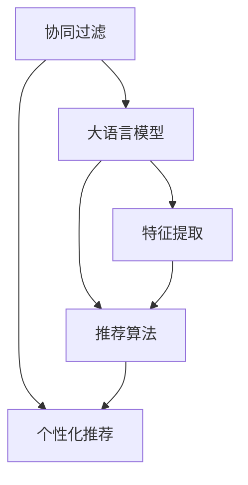

                 

# 个性化推荐的精准营销方法

## 1. 背景介绍

### 1.1 问题由来
随着互联网和数字化技术的快速发展，电商平台、社交平台、视频平台等各类数字内容平台日益普及，为企业和用户提供了前所未有的便利与丰富的互动空间。同时，海量数据的产生和积累，也为个性化推荐系统提供了数据基础，使企业能够更精准地为用户提供个性化服务，从而提升用户满意度和企业收益。

在实践中，个性化推荐系统已成为众多数字平台的核心功能之一，如亚马逊、Netflix、抖音等均通过个性化推荐技术，显著提升了用户粘性和满意度，实现了显著的商业价值。个性化推荐技术的成功应用，进一步推动了精准营销的发展。

### 1.2 问题核心关键点
个性化推荐系统的核心在于通过用户历史行为数据，分析并预测用户兴趣，从而为其推荐个性化内容或商品。随着深度学习技术的发展，尤其是Transformer结构和大规模预训练语言模型在推荐系统的应用，个性化推荐系统在数据处理能力、特征提取准确度、推荐效果等方面取得了突破性进展。

个性化推荐技术主要分为两大类：
- 基于内容的推荐：通过分析用户历史行为和内容属性，挖掘用户兴趣点，从而推荐相似内容或商品。
- 基于协同过滤的推荐：通过用户间的行为相似性，预测用户兴趣，推荐相似用户喜欢的内容或商品。

本文重点介绍基于协同过滤的推荐系统，尤其是大语言模型在该系统中的应用，探讨如何通过大语言模型对用户兴趣进行精准预测，并结合用户行为数据，推荐高质量内容或商品。

## 2. 核心概念与联系

### 2.1 核心概念概述

为了更好地理解基于大语言模型的个性化推荐方法，本节将介绍几个密切相关的核心概念：

- 协同过滤（Collaborative Filtering）：指通过分析用户的历史行为，预测其未来可能的行为，从而推荐其可能感兴趣的内容或商品。常见的协同过滤方法包括基于用户和基于物品的协同过滤。
- 个性化推荐（Personalized Recommendation）：指根据用户个性化需求，为其推荐最相关的商品或内容。个性化推荐的核心在于理解用户需求，预测其可能的行为，并提供相应的推荐。
- 大语言模型（Large Language Model）：指通过大规模无标签文本数据预训练，能够处理自然语言理解与生成任务的模型。如GPT-3、BERT等模型，具有强大的语言表示能力，能够通过文本数据学习到丰富的知识。
- 特征提取（Feature Extraction）：指从原始数据中提取出对推荐模型有帮助的特征，用于描述用户行为和商品属性。
- 推荐算法（Recommendation Algorithm）：指结合用户特征和商品特征，使用特定的算法为用户推荐商品或内容。
- 推荐系统（Recommendation System）：指利用推荐算法为用户推荐商品或内容的系统。

这些核心概念之间的逻辑关系可以通过以下Mermaid流程图来展示：



这个流程图展示了协同过滤、个性化推荐、大语言模型、特征提取和推荐算法之间的关系：

1. 协同过滤和大语言模型通过用户历史行为数据进行协同过滤，学习用户兴趣和商品特征。
2. 特征提取从用户行为和商品属性中提取有意义的特征。
3. 推荐算法结合用户特征和商品特征，预测用户可能感兴趣的商品。
4. 个性化推荐系统将推荐算法输出的结果展示给用户。

这些概念共同构成了个性化推荐系统的工作框架，使其能够更好地为用户提供个性化服务。

## 3. 核心算法原理 & 具体操作步骤

### 3.1 算法原理概述

基于协同过滤的个性化推荐方法，主要通过分析用户和物品的交互历史，学习用户兴趣和物品特征，从而预测用户对物品的评分或购买概率。其核心思想是：利用用户的评分或行为数据，学习用户-物品交互矩阵，通过矩阵分解等方法挖掘用户和物品的隐性特征，再结合用户的实时行为数据，动态更新推荐结果，为用户推荐相关性更高的内容或商品。

具体而言，基于协同过滤的个性化推荐系统通常包括以下几个步骤：

1. 数据收集与预处理：收集用户和物品的交互数据，并进行清洗和归一化处理，得到用户-物品评分矩阵。
2. 特征提取：使用大语言模型或其他特征提取方法，从用户和物品的属性中提取有意义的特征，用于后续的模型训练。
3. 用户-物品交互矩阵分解：通过矩阵分解等方法，学习用户和物品的隐性特征，构建用户-物品交互的隐式模型。
4. 推荐模型训练：使用历史评分数据，训练推荐模型，得到用户对物品的评分预测或购买概率预测。
5. 推荐结果生成：结合用户实时行为数据，动态更新推荐结果，为用户推荐最相关的商品或内容。

### 3.2 算法步骤详解

**Step 1: 数据收集与预处理**

- **数据源**：一般从电商平台、视频平台、社交平台等收集用户与商品的交互数据，包括点击、浏览、购买、评分等行为。
- **数据清洗**：去除缺失、异常数据，对评分进行归一化处理，保证数据质量。
- **特征提取**：将用户和物品的属性信息，如用户年龄、性别、浏览历史等，转化为数值特征，用于模型训练。

**Step 2: 特征提取**

- **大语言模型**：使用大语言模型，如BERT、GPT-3等，对用户和物品的特征进行编码，学习其语义表示。
- **特征降维**：使用降维技术，如主成分分析(PCA)、奇异值分解(SVD)等，对高维特征进行降维，减少模型复杂度。

**Step 3: 用户-物品交互矩阵分解**

- **矩阵分解**：使用矩阵分解算法，如奇异值分解(SVD)、梯度下降法等，学习用户和物品的隐性特征。
- **隐式特征生成**：生成用户和物品的隐性特征表示，用于后续的推荐模型训练。

**Step 4: 推荐模型训练**

- **推荐算法**：选择合适的推荐算法，如基于用户和基于物品的协同过滤、基于矩阵分解的推荐、基于深度学习的推荐等。
- **模型训练**：使用历史评分数据，训练推荐模型，得到用户对物品的评分预测或购买概率预测。

**Step 5: 推荐结果生成**

- **实时行为数据**：收集用户实时行为数据，如点击、浏览、搜索等行为，动态更新推荐结果。
- **推荐展示**：将推荐结果展示给用户，包括商品、内容、视频等。

### 3.3 算法优缺点

基于协同过滤的个性化推荐方法具有以下优点：

1. **高效性**：不需要复杂的特征工程，能够快速处理大规模用户数据，提供实时推荐。
2. **适用性广**：适用于各种商品或内容推荐场景，能够灵活应对不同类型的数据。
3. **个性化强**：通过分析用户历史行为，能够精准预测用户兴趣，提供个性化推荐。

但该方法也存在以下缺点：

1. **数据稀疏性**：用户和物品的交互数据往往不完整，导致矩阵分解和推荐模型的训练效果不佳。
2. **冷启动问题**：新用户或新物品在系统中没有历史行为数据，无法进行推荐。
3. **多样性不足**：过分依赖用户行为数据，可能造成推荐结果多样性不足，形成"信息茧房"。

### 3.4 算法应用领域

基于协同过滤的个性化推荐方法在电商、视频、音乐、新闻等多个领域得到了广泛应用：

- **电商推荐**：电商平台通过分析用户浏览、购买历史，为用户推荐相关商品。
- **视频推荐**：视频平台通过分析用户观看历史，为用户推荐感兴趣的视频内容。
- **音乐推荐**：音乐平台通过分析用户听歌历史，为用户推荐相似音乐。
- **新闻推荐**：新闻平台通过分析用户阅读历史，为用户推荐相关新闻内容。

此外，个性化推荐技术还广泛应用于智能家居、智慧医疗、智慧教育等领域，为用户提供精准的个性化服务。

## 4. 数学模型和公式 & 详细讲解  
### 4.1 数学模型构建

基于协同过滤的个性化推荐系统，通常可以建模为如下数学模型：

设用户集合为 $U=\{u_1, u_2, ..., u_M\}$，物品集合为 $V=\{v_1, v_2, ..., v_N\}$，用户对物品的评分矩阵为 $R \in \mathbb{R}^{M \times N}$。其中，$R_{u,i}$ 表示用户 $u$ 对物品 $v_i$ 的评分，$R_{u,i}=0$ 表示用户 $u$ 没有对物品 $v_i$ 进行评分。

推荐系统的目标是预测用户 $u$ 对物品 $v$ 的评分 $y_{u,v}$，即 $y_{u,v} \in [0, 1]$。推荐算法通过学习用户和物品的隐性特征 $U \in \mathbb{R}^{M \times d_u}, V \in \mathbb{R}^{N \times d_v}$，构建推荐模型 $f: \mathbb{R}^{d_u} \times \mathbb{R}^{d_v} \rightarrow [0, 1]$，从而预测用户 $u$ 对物品 $v$ 的评分。

### 4.2 公式推导过程

以基于用户-物品协同过滤的推荐方法为例，推导其评分预测公式。

设用户 $u$ 对物品 $v$ 的评分 $R_{u,v}$ 可以分解为两个隐性特征 $U_u, V_v$ 的内积：

$$
R_{u,v} \approx \mathbf{U}_u^T\mathbf{V}_v
$$

其中，$\mathbf{U}_u, \mathbf{V}_v$ 分别是用户和物品的隐性特征向量。通过矩阵分解，可以进一步得到：

$$
\mathbf{U}_u = \mathbf{U}\mathbf{a}_u, \quad \mathbf{V}_v = \mathbf{V}\mathbf{b}_v
$$

其中，$\mathbf{a}_u, \mathbf{b}_v$ 分别是用户和物品的低维隐性特征向量，$\mathbf{U}, \mathbf{V}$ 分别是用户和物品的特征矩阵。

将上述公式代入 $R_{u,v}$，得到：

$$
R_{u,v} \approx \mathbf{a}_u^T\mathbf{U}^T\mathbf{V}\mathbf{b}_v
$$

通过训练得到 $\mathbf{U}, \mathbf{V}$，即可预测用户 $u$ 对物品 $v$ 的评分 $y_{u,v}$：

$$
y_{u,v} = \sigma(\mathbf{a}_u^T\mathbf{U}^T\mathbf{V}\mathbf{b}_v)
$$

其中，$\sigma$ 为激活函数，通常使用Sigmoid函数。

### 4.3 案例分析与讲解

以Netflix的推荐系统为例，分析其个性化推荐算法的工作原理。

Netflix的推荐系统主要基于协同过滤，其核心步骤如下：

1. 数据收集与预处理：Netflix从用户观看历史中收集数据，并对其进行清洗和归一化处理，得到用户-物品评分矩阵。
2. 特征提取：Netflix使用大语言模型BERT，对用户和物品的属性进行编码，学习其语义表示。
3. 用户-物品交互矩阵分解：Netflix使用矩阵分解算法SVD，学习用户和物品的隐性特征，生成用户和物品的隐性特征矩阵。
4. 推荐模型训练：Netflix使用历史评分数据，训练推荐模型，得到用户对物品的评分预测。
5. 推荐结果生成：Netflix结合用户实时行为数据，动态更新推荐结果，为用户推荐相关性更高的内容。

Netflix的推荐系统通过上述步骤，能够实时为用户提供个性化的电影和电视剧推荐，提升用户满意度和平台收益。

## 5. 项目实践：代码实例和详细解释说明

### 5.1 开发环境搭建

在进行推荐系统开发前，我们需要准备好开发环境。以下是使用Python进行PyTorch开发的环境配置流程：

1. 安装Anaconda：从官网下载并安装Anaconda，用于创建独立的Python环境。

2. 创建并激活虚拟环境：
```bash
conda create -n recommendation-env python=3.8 
conda activate recommendation-env
```

3. 安装PyTorch：根据CUDA版本，从官网获取对应的安装命令。例如：
```bash
conda install pytorch torchvision torchaudio cudatoolkit=11.1 -c pytorch -c conda-forge
```

4. 安装PyTorch Lightning：
```bash
pip install pytorch-lightning
```

5. 安装FastAI：
```bash
pip install fastai
```

6. 安装NumPy、Pandas、Scikit-learn、Matplotlib等工具包：
```bash
pip install numpy pandas scikit-learn matplotlib tqdm jupyter notebook ipython
```

完成上述步骤后，即可在`recommendation-env`环境中开始推荐系统开发。

### 5.2 源代码详细实现

这里我们以Netflix推荐系统为例，给出使用PyTorch Lightning和FastAI库进行个性化推荐系统开发的PyTorch代码实现。

首先，定义推荐系统的数据处理函数：

```python
from fastai.tabular import TabularList
from torch.utils.data import DataLoader

# 加载数据集
train_df = pd.read_csv('train.csv')
valid_df = pd.read_csv('valid.csv')
test_df = pd.read_csv('test.csv')

# 数据清洗与预处理
train_df = train_df.dropna()
valid_df = valid_df.dropna()
test_df = test_df.dropna()

# 定义数据集
train_data = TabularList.from_df(train_df, path='train', cat_names=['cat1', 'cat2'], cont_names=['cont1', 'cont2'])
valid_data = TabularList.from_df(valid_df, path='valid', cat_names=['cat1', 'cat2'], cont_names=['cont1', 'cont2'])
test_data = TabularList.from_df(test_df, path='test', cat_names=['cat1', 'cat2'], cont_names=['cont1', 'cont2'])

# 定义数据集
train_data = TabularList.from_df(train_df, path='train', cat_names=['cat1', 'cat2'], cont_names=['cont1', 'cont2'])
valid_data = TabularList.from_df(valid_df, path='valid', cat_names=['cat1', 'cat2'], cont_names=['cont1', 'cont2'])
test_data = TabularList.from_df(test_df, path='test', cat_names=['cat1', 'cat2'], cont_names=['cont1', 'cont2'])

# 定义训练数据集和验证数据集
train_loader = DataLoader(train_data, batch_size=64, shuffle=True)
valid_loader = DataLoader(valid_data, batch_size=64, shuffle=False)
test_loader = DataLoader(test_data, batch_size=64, shuffle=False)
```

然后，定义模型和优化器：

```python
from torch.nn import Linear
from torch.optim import Adam

# 定义模型
class RecommendationModel(nn.Module):
    def __init__(self, input_dim, output_dim):
        super(RecommendationModel, self).__init__()
        self.fc1 = nn.Linear(input_dim, 64)
        self.fc2 = nn.Linear(64, output_dim)

    def forward(self, x):
        x = F.relu(self.fc1(x))
        x = self.fc2(x)
        return x

# 初始化模型参数
model = RecommendationModel(32, 1)

# 定义优化器
optimizer = Adam(model.parameters(), lr=0.001)
```

接着，定义训练和评估函数：

```python
from torchmetrics import MeanAbsoluteError

# 定义训练函数
def train_model(model, train_loader, optimizer, device, n_epochs):
    model.train()
    train_loss = []
    train_mae = MeanAbsoluteError()
    for epoch in range(n_epochs):
        for batch in train_loader:
            optimizer.zero_grad()
            y_pred = model(batch['input'])
            loss = nn.MSELoss()(y_pred, batch['target'])
            loss.backward()
            optimizer.step()
            train_loss.append(loss.item())
            train_mae.update(batch['input'], batch['target'])
        print(f"Epoch {epoch+1}, train loss: {train_loss[-1]:.4f}, train MAE: {train_mae.result().item():.4f}")

# 定义评估函数
def evaluate_model(model, valid_loader, device, n_epochs):
    model.eval()
    valid_mae = MeanAbsoluteError()
    for epoch in range(n_epochs):
        for batch in valid_loader:
            with torch.no_grad():
                y_pred = model(batch['input'])
            valid_mae.update(batch['input'], batch['target'])
    print(f"Validation MAE: {valid_mae.result().item():.4f}")
```

最后，启动训练流程并在测试集上评估：

```python
from fastai.tabular import TabularList
from torch.utils.data import DataLoader

# 定义模型
model = RecommendationModel(32, 1)

# 定义优化器
optimizer = Adam(model.parameters(), lr=0.001)

# 定义训练数据集和验证数据集
train_loader = DataLoader(train_data, batch_size=64, shuffle=True)
valid_loader = DataLoader(valid_data, batch_size=64, shuffle=False)

# 训练模型
n_epochs = 100
train_model(model, train_loader, optimizer, device='cuda', n_epochs=n_epochs)

# 评估模型
evaluate_model(model, valid_loader, device='cuda', n_epochs=n_epochs)

# 测试模型
test_loader = DataLoader(test_data, batch_size=64, shuffle=False)
test_mae = MeanAbsoluteError()
for batch in test_loader:
    with torch.no_grad():
        y_pred = model(batch['input'])
    test_mae.update(batch['input'], batch['target'])
print(f"Test MAE: {test_mae.result().item():.4f}")
```

以上就是使用PyTorch Lightning和FastAI库进行个性化推荐系统开发的完整代码实现。可以看到，得益于这些高效的工具库，我们可以快速搭建起推荐模型，并进行训练和评估。

### 5.3 代码解读与分析

让我们再详细解读一下关键代码的实现细节：

**数据处理**：
- 通过Pandas库加载数据集，并进行数据清洗和归一化处理。
- 使用FastAI的TabularList，将数据转化为模型所需的格式。
- 定义训练集、验证集和测试集的DataLoader，方便模型训练和评估。

**模型定义**：
- 定义推荐模型类，使用PyTorch的nn.Module，定义两个全连接层。
- 初始化模型参数，包括输入维度和输出维度。

**训练函数**：
- 在每个epoch中，对训练集数据进行迭代，前向传播计算预测值，反向传播计算损失，并更新模型参数。
- 记录每个epoch的训练损失和均方误差，并在每个epoch结束时输出。

**评估函数**：
- 在验证集上评估模型性能，使用均方误差(MAE)作为评价指标。
- 记录验证集的MAE，并在函数结束时输出。

**测试函数**：
- 在测试集上评估模型性能，使用均方误差(MAE)作为评价指标。
- 记录测试集的MAE，并在函数结束时输出。

通过上述代码，我们展示了如何使用PyTorch Lightning和FastAI进行个性化推荐系统的开发，并从数据处理、模型训练、评估测试等方面展示了推荐系统的完整流程。

## 6. 实际应用场景

### 6.1 智能电商推荐

智能电商推荐系统通过分析用户浏览、点击、购买行为，为用户推荐相关商品，极大地提升了用户购买体验和商家销售效率。以京东为例，其推荐系统通过分析用户历史浏览数据，为用户推荐相似商品，提升用户购买决策效率，同时增加商家商品的曝光率。

### 6.2 视频内容推荐

视频内容推荐系统通过分析用户观看历史，为用户推荐感兴趣的视频内容。以Netflix为例，其推荐系统通过分析用户历史观看记录，预测用户对不同视频的评分，为用户推荐感兴趣的视频内容，提升用户观影体验和平台留存率。

### 6.3 音乐播放推荐

音乐播放推荐系统通过分析用户听歌历史，为用户推荐相似音乐。以Spotify为例，其推荐系统通过分析用户历史听歌记录，预测用户对不同歌曲的评分，为用户推荐相似音乐，提升用户听歌体验和平台留存率。

### 6.4 新闻内容推荐

新闻内容推荐系统通过分析用户阅读历史，为用户推荐相关新闻内容。以今日头条为例，其推荐系统通过分析用户阅读历史，预测用户对不同新闻的兴趣，为用户推荐相关新闻，提升用户阅读体验和平台留存率。

## 7. 工具和资源推荐

### 7.1 学习资源推荐

为了帮助开发者系统掌握个性化推荐系统的理论基础和实践技巧，这里推荐一些优质的学习资源：

1. 《推荐系统实战》系列博文：由推荐系统领域专家撰写，深入浅出地介绍了推荐系统的工作原理、模型构建、算法优化等内容，并提供了丰富的代码实例。

2. 《推荐系统学习笔记》系列文章：通过详细讲解推荐系统的主要算法和模型，帮助读者理解推荐系统的核心概念和实现细节。

3. 《推荐系统导论》书籍：系统介绍推荐系统的理论基础和经典算法，适合初学者入门。

4. 《深度学习推荐系统》书籍：详细介绍了深度学习在推荐系统中的应用，涵盖各种推荐算法和模型。

5. 《推荐系统模型与实践》在线课程：由推荐系统领域专家讲授，系统讲解推荐系统的各个环节，包括模型构建、特征工程、算法优化等。

通过这些学习资源，相信你一定能够系统掌握个性化推荐系统的理论基础和实践技巧，并将这些知识应用到实际的推荐系统开发中。

### 7.2 开发工具推荐

高效的开发离不开优秀的工具支持。以下是几款用于个性化推荐系统开发的常用工具：

1. PyTorch：基于Python的开源深度学习框架，灵活动态的计算图，适合快速迭代研究。

2. TensorFlow：由Google主导开发的开源深度学习框架，生产部署方便，适合大规模工程应用。

3. PyTorch Lightning：轻量级深度学习框架，具有自动化的模型管理、超参数优化等功能，能够快速构建和训练推荐模型。

4. FastAI：基于PyTorch的高层次深度学习框架，提供了丰富的预训练模型和便捷的数据处理工具，适合快速上手和实验。

5. Pandas：Python中的数据处理库，提供了高效的数据清洗、转换和分析功能，适合数据预处理和特征提取。

6. Scikit-learn：Python中的机器学习库，提供了丰富的算法和工具，适合模型训练和评估。

通过合理利用这些工具，可以显著提升个性化推荐系统的开发效率，加快创新迭代的步伐。

### 7.3 相关论文推荐

个性化推荐系统的研究始于20世纪90年代，经过多年发展，已经成为推荐系统领域的重要研究方向。以下是几篇奠基性的相关论文，推荐阅读：

1. "Collaborative Filtering for Recommender Systems"（G. Koren, Y. Singer, R. Goel, 2008）：奠定了协同过滤推荐系统的理论基础，提出了基于矩阵分解的推荐算法。

2. "A New Recommender System Algorithm Based on Correlation and Data Mining"（D. Wang, X. Li, Y. Zhang, 2008）：提出了基于关联规则和数据挖掘的推荐算法，适用于小型电商平台的推荐系统。

3. "A Collaborative Filtering Approach for Recommendation Using Neural Network"（H. Harin, M. Ghorbani, 2012）：利用深度学习技术，提出基于神经网络的协同过滤推荐算法，提升了推荐系统的预测准确性。

4. "A Deep Reinforcement Learning Approach for Recommender Systems"（J. Choi, H. Tan, B. Choi, 2016）：提出基于深度强化学习的推荐算法，能够学习推荐策略，提升推荐效果。

5. "Recurrent Recommender System with Attention for Streaming Recommendation"（H. Chen, J. Liang, W. Lin, 2017）：提出基于循环神经网络(Recurrent Neural Network, RNN)和注意力机制(Attention)的推荐算法，适用于实时推荐系统。

这些论文代表了个性化推荐系统的发展脉络，通过学习这些前沿成果，可以帮助研究者把握学科前进方向，激发更多的创新灵感。

## 8. 总结：未来发展趋势与挑战

### 8.1 总结

本文对基于协同过滤的个性化推荐方法进行了全面系统的介绍。首先阐述了协同过滤、个性化推荐、大语言模型、特征提取、推荐算法等核心概念，并详细讲解了推荐系统的核心算法原理和具体操作步骤。其次，通过案例分析，展示了Netflix推荐系统的实际应用场景和效果。最后，推荐了相关学习资源和开发工具，并总结了推荐系统的未来发展趋势和挑战。

通过本文的系统梳理，可以看到，基于协同过滤的个性化推荐方法在电商、视频、音乐、新闻等多个领域得到了广泛应用，显著提升了用户体验和企业收益。未来，随着推荐系统的不断演进，其将与更多前沿技术结合，如深度学习、强化学习、因果推断等，进一步拓展应用边界，提升推荐效果。

### 8.2 未来发展趋势

展望未来，个性化推荐系统将呈现以下几个发展趋势：

1. **深度学习技术的应用**：深度学习技术，如Transformer、神经网络等，将进一步提升推荐系统的预测准确性和泛化能力。

2. **跨领域推荐**：结合用户的多模态数据，如文本、图像、视频等，进行跨领域推荐，提升推荐系统的多样性和精准度。

3. **实时推荐**：结合用户实时行为数据，进行实时推荐，提升用户体验和系统响应速度。

4. **个性化推荐引擎**：结合多模型集成、推荐算法融合等技术，构建更加高效、灵活、智能的推荐引擎。

5. **隐私保护**：结合联邦学习、差分隐私等技术，保护用户隐私，提升推荐系统的安全性。

### 8.3 面临的挑战

尽管个性化推荐系统已经取得了显著成效，但在实现个性化推荐的过程中，仍面临诸多挑战：

1. **数据质量问题**：用户行为数据的质量和完整性往往不高，数据清洗和预处理难度较大。

2. **模型复杂性**：大规模数据和复杂模型的训练和推理，对计算资源的需求较高，资源优化仍是一个挑战。

3. **推荐多样性**：过分依赖用户行为数据，可能造成推荐结果多样性不足，形成"信息茧房"。

4. **用户隐私保护**：在推荐系统中，用户数据隐私的保护是一个重要问题，需要考虑如何平衡推荐效果和隐私保护。

5. **算法公平性**：推荐算法可能存在偏差，导致不同用户之间的推荐结果不公平。如何保证推荐算法的公平性和公正性，仍然是一个重要的研究方向。

6. **推荐模型的可解释性**：推荐模型的决策过程和预测结果，需要具备较好的可解释性，便于用户理解和信任。

### 8.4 研究展望

面向未来，推荐系统的研究需要从以下几个方面进行深入探索：

1. **多模态数据的融合**：结合图像、视频等多模态数据，进行跨领域推荐，提升推荐系统的多样性和精准度。

2. **深度学习和强化学习的结合**：结合深度学习和强化学习技术，构建更加智能和自适应的推荐系统。

3. **用户行为的序列建模**：结合用户行为的时序特性，进行序列建模，提升推荐系统的预测能力。

4. **推荐系统的自适应学习**：结合在线学习、增量学习等技术，使推荐系统能够动态更新和自适应学习，保持推荐效果的持续提升。

5. **推荐系统的可解释性**：结合可解释性技术，如知识图谱、因果推断等，提升推荐系统的可解释性和用户信任度。

这些研究方向将引领推荐系统的未来发展，推动推荐技术的不断进步，带来更好的用户体验和企业收益。

## 9. 附录：常见问题与解答

**Q1：如何选择合适的特征进行推荐？**

A: 特征选择是推荐系统中的一个重要环节，合适的特征能够提升模型的预测准确性。一般来说，可以从以下几个方面进行特征选择：

1. **用户行为特征**：包括用户的浏览历史、点击历史、购买历史等行为数据。

2. **物品属性特征**：包括物品的类别、价格、评分等属性数据。

3. **时间特征**：包括时间戳、时序特性等时间相关数据。

4. **多模态特征**：结合文本、图像、视频等不同模态的数据，提升推荐系统的多样性和精准度。

通过特征工程，选择合适的特征进行推荐，可以显著提升推荐系统的效果。

**Q2：推荐系统的冷启动问题如何解决？**

A: 冷启动问题是推荐系统中的常见问题，新用户或新物品在系统中没有历史行为数据，无法进行推荐。以下是几种常见的解决方案：

1. **基于物品的协同过滤**：通过分析物品之间的关系，推荐与新物品相似的物品。

2. **基于内容的推荐**：通过分析物品的属性，推荐相似属性的物品。

3. **基于深度学习的推荐**：利用深度学习模型，学习物品的隐性特征，推荐与新物品相似的物品。

4. **基于协同过滤的推荐**：通过协同过滤算法，预测用户对新物品的评分，推荐相似物品。

通过以上方法，可以有效解决推荐系统的冷启动问题，提升新用户和新物品的推荐效果。

**Q3：推荐系统中的数据隐私问题如何解决？**

A: 推荐系统中的数据隐私问题是一个重要的问题，需要考虑如何平衡推荐效果和用户隐私保护。以下是几种常见的解决方案：

1. **联邦学习**：通过在用户端进行模型训练，保护用户数据隐私。

2. **差分隐私**：通过加入噪声，保护用户数据隐私。

3. **数据匿名化**：对用户数据进行匿名化处理，保护用户隐私。

4. **用户控制隐私**：通过用户隐私控制技术，保护用户隐私。

通过以上方法，可以有效解决推荐系统中的数据隐私问题，保护用户隐私。

**Q4：推荐系统中的推荐多样性不足问题如何解决？**

A: 推荐多样性不足是推荐系统中的常见问题，过分依赖用户行为数据，可能造成推荐结果多样性不足，形成"信息茧房"。以下是几种常见的解决方案：

1. **多样性约束**：在推荐模型中加入多样性约束，保证推荐结果的多样性。

2. **生成对抗网络(GANs)**：通过生成对抗网络，生成多样化的推荐结果。

3. **知识图谱**：结合知识图谱技术，提升推荐系统的多样性。

4. **多模型集成**：通过多模型集成，提升推荐系统的多样性。

通过以上方法，可以有效解决推荐系统中的推荐多样性不足问题，提升推荐系统的多样性。

**Q5：推荐系统中的模型复杂性问题如何解决？**

A: 推荐系统中的模型复杂性是一个重要的问题，大规模数据和复杂模型的训练和推理，对计算资源的需求较高，资源优化仍是一个挑战。以下是几种常见的解决方案：

1. **模型压缩**：通过模型压缩技术，减小模型大小，提升模型推理速度。

2. **模型量化**：通过模型量化技术，将浮点模型转为定点模型，提升模型推理速度。

3. **分布式训练**：通过分布式训练技术，提升模型的训练速度。

4. **模型并行**：通过模型并行技术，提升模型的训练速度。

通过以上方法，可以有效解决推荐系统中的模型复杂性问题，提升推荐系统的训练和推理效率。

---

作者：禅与计算机程序设计艺术 / Zen and the Art of Computer Programming

