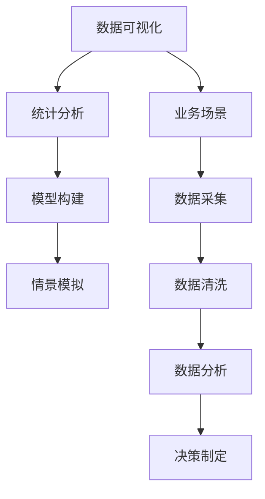

                 

# 丰富模型思维:增强管理者洞悉力

> 关键词：模型思维, 管理者洞悉力, 数据分析, 商业决策, 创新思维, 数据驱动

## 1. 背景介绍

### 1.1 问题由来

在当前信息化和数字化高速发展的时代背景下，数据已成为企业竞争的核心资源之一。能否有效地获取、分析和利用数据，已经成为决定企业成败的关键因素之一。然而，随着数据量的爆炸式增长，企业面临着如何处理海量数据、提取有用信息、做出合理决策的挑战。

面对这一问题，许多企业尝试引入数据科学和人工智能技术，如机器学习和深度学习，以提升数据处理和决策能力。但这些技术往往高门槛、易误用，给非专业人士带来了极大的挑战。为此，本文提出“模型思维”这一概念，旨在通过构建直观易懂的模型，帮助管理者更好地理解和利用数据，从而做出更加精准的商业决策。

### 1.2 问题核心关键点

模型思维强调通过建立简单直观的数据模型，增强管理者的数据洞察力和决策能力。具体来说，它包括如下几个关键点：

- **数据可视化**：将复杂的数据通过图表、图形等形式展示，帮助管理者直观地理解数据特征和趋势。
- **统计分析**：通过简单的统计方法，识别数据的规律和异常，为决策提供依据。
- **模型构建**：根据业务需求，建立简单的数学模型，预测未来趋势，辅助决策。
- **情景模拟**：通过模拟不同的业务场景，评估模型在不同条件下的表现，选择最优方案。

通过模型思维，管理者能够将复杂的数据和决策问题简化，更好地把握数据的本质和趋势，从而做出更精准、更科学的决策。

### 1.3 问题研究意义

模型思维不仅有助于提升管理者的数据洞察力，还能推动企业向数据驱动决策的转型。具体而言，其研究意义如下：

1. **提升决策质量**：模型思维使管理者能够更准确地理解数据，减少基于直觉或经验的决策偏差。
2. **降低决策风险**：通过数据驱动的决策，降低因主观判断错误而带来的风险。
3. **加速决策速度**：模型思维简化了决策流程，缩短了从数据获取到决策执行的时间。
4. **增强创新能力**：模型思维使企业能够更快地识别市场变化，快速调整策略，提升创新能力。
5. **改善团队协作**：模型思维促进了数据的共享和透明，增强了团队协作效率。

通过模型思维的推广应用，企业能够在信息时代中占据更有利的位置，提升竞争力。

## 2. 核心概念与联系

### 2.1 核心概念概述

模型思维是一种通过构建简单直观的数据模型，提升管理者数据分析和决策能力的思维模式。其核心概念包括：

- **数据可视化**：通过图表、图形等形式直观展示数据，帮助管理者理解数据特征和趋势。
- **统计分析**：利用简单的统计方法，识别数据规律和异常，为决策提供依据。
- **模型构建**：根据业务需求，建立数学模型，预测未来趋势，辅助决策。
- **情景模拟**：通过模拟不同业务场景，评估模型表现，选择最优方案。

这些概念相互联系，共同构成了模型思维的基础框架。

### 2.2 核心概念原理和架构的 Mermaid 流程图



### 2.3 核心概念之间的联系

模型思维的各个核心概念之间存在紧密联系：

1. **数据可视化与统计分析**：数据可视化帮助管理者理解数据特征，而统计分析则用于识别数据中的规律和异常，两者相辅相成，为决策提供数据基础。
2. **模型构建与统计分析**：模型构建通过建立数学模型，进一步分析数据特征，为预测和决策提供支持。
3. **情景模拟与模型构建**：情景模拟通过模拟不同业务场景，验证模型在不同条件下的表现，选择最优方案。

这些联系使得模型思维成为一个完整的决策支持系统，能够全面提升管理者的决策能力。

## 3. 核心算法原理 & 具体操作步骤

### 3.1 算法原理概述

模型思维的算法原理主要基于统计分析和数据建模。其核心在于通过简单的统计方法，建立易于理解的模型，从而帮助管理者做出更加精准的决策。以下是模型思维的核心算法原理：

1. **数据预处理**：包括数据清洗、数据标准化等，为后续分析提供可靠的数据基础。
2. **描述性统计**：通过均值、中位数、标准差等统计量，描述数据的分布和特征。
3. **相关性分析**：利用皮尔逊相关系数、斯皮尔曼相关系数等方法，评估变量之间的关系。
4. **回归分析**：建立线性回归、逻辑回归等模型，预测变量之间的关系，为决策提供依据。
5. **假设检验**：通过t检验、卡方检验等方法，验证模型的假设是否成立。
6. **情景模拟**：建立蒙特卡洛模拟模型，评估不同决策场景下的效果，选择最优方案。

### 3.2 算法步骤详解

模型思维的算法步骤主要包括以下几个关键环节：

**Step 1: 数据收集与预处理**
- 确定需要分析的数据来源，收集相关数据。
- 对数据进行清洗，去除噪声和异常值，进行标准化处理。
- 进行数据探索性分析，了解数据的基本特征和分布情况。

**Step 2: 数据可视化**
- 利用数据可视化工具（如Tableau、Power BI、Matplotlib等），将数据通过图表、图形等形式展示出来。
- 使用散点图、柱状图、饼图等可视化方法，直观展示数据特征和趋势。

**Step 3: 统计分析**
- 使用描述性统计方法（如均值、中位数、标准差等），描述数据的分布和特征。
- 使用相关性分析方法（如皮尔逊相关系数、斯皮尔曼相关系数等），评估变量之间的关系。
- 进行回归分析，建立数学模型，预测变量之间的关系。

**Step 4: 模型构建**
- 根据业务需求，选择合适的统计模型（如线性回归、逻辑回归等）。
- 使用假设检验方法（如t检验、卡方检验等），验证模型的假设是否成立。
- 使用蒙特卡洛模拟方法，评估不同决策场景下的效果，选择最优方案。

**Step 5: 结果展示与决策制定**
- 将分析结果通过可视化工具展示出来，帮助管理者理解和应用。
- 根据分析结果，制定相应的决策方案，并进行实施。

### 3.3 算法优缺点

模型思维的算法优点主要包括：

1. **易理解易操作**：模型思维利用简单的统计方法和数学模型，降低了数据处理的复杂度，易于理解和操作。
2. **决策依据明确**：模型思维通过建立数学模型，提供了明确的决策依据，减少决策的主观性和不确定性。
3. **适用范围广泛**：模型思维适用于多种业务场景，如销售预测、市场分析、客户满意度等。

其缺点主要包括：

1. **模型假设限制**：模型思维假设数据符合一定的分布，如果数据不符合假设，模型的预测效果可能会受到影响。
2. **无法处理复杂问题**：对于复杂的非线性问题，简单的模型可能无法提供准确的预测结果。
3. **需要专业知识**：模型思维需要一定的统计学和数学基础，对于非专业人士可能存在一定的学习门槛。

### 3.4 算法应用领域

模型思维在多个领域都有广泛的应用，以下是其中几个典型的应用领域：

1. **市场营销**：通过分析消费者行为数据，预测市场趋势，制定精准营销策略。
2. **客户关系管理**：通过分析客户反馈数据，提升客户满意度，优化客户服务。
3. **供应链管理**：通过分析供应链数据，优化库存管理，降低运营成本。
4. **产品开发**：通过分析市场和用户数据，指导产品设计和改进。
5. **财务分析**：通过分析财务数据，评估企业财务状况，制定合理的财务策略。

## 4. 数学模型和公式 & 详细讲解

### 4.1 数学模型构建

模型思维的数学模型构建主要包括以下几个步骤：

1. **数据收集与预处理**：收集数据，并进行清洗和标准化处理。
2. **描述性统计**：使用均值、中位数、标准差等统计量，描述数据的分布和特征。
3. **相关性分析**：利用皮尔逊相关系数、斯皮尔曼相关系数等方法，评估变量之间的关系。
4. **回归分析**：建立线性回归、逻辑回归等模型，预测变量之间的关系。

### 4.2 公式推导过程

以下以线性回归模型为例，推导其公式及其推导过程。

假设有一组数据集 $(x_i, y_i)$，$i=1,2,...,n$。我们的目标是找到一条直线 $y = ax + b$，使得该直线能最好地拟合这组数据。

设 $y_i = ax_i + b + \epsilon_i$，其中 $\epsilon_i$ 为随机误差。根据最小二乘法的思想，我们希望最小化损失函数：

$$
J(a, b) = \frac{1}{n}\sum_{i=1}^n (y_i - ax_i - b)^2
$$

对 $a$ 和 $b$ 求偏导数，得到：

$$
\frac{\partial J}{\partial a} = \frac{-2}{n}\sum_{i=1}^n (y_i - ax_i - b)x_i = 0
$$

$$
\frac{\partial J}{\partial b} = \frac{-2}{n}\sum_{i=1}^n (y_i - ax_i - b) = 0
$$

解以上方程组，得到：

$$
a = \frac{\sum_{i=1}^n (x_i - \bar{x})(y_i - \bar{y})}{\sum_{i=1}^n (x_i - \bar{x})^2}
$$

$$
b = \bar{y} - a\bar{x}
$$

其中 $\bar{x}$ 和 $\bar{y}$ 分别为 $x$ 和 $y$ 的均值。

### 4.3 案例分析与讲解

假设某电商公司希望预测某个产品的销售量，以便更好地进行库存管理。公司收集了过去一年的销售数据，包括每个月的销售量和促销活动情况。

**Step 1: 数据收集与预处理**
- 收集过去一年的销售数据和促销活动信息。
- 清洗数据，去除异常值和噪声。
- 标准化数据，使得数据符合均值为0、标准差为1的正态分布。

**Step 2: 数据可视化**
- 绘制过去一年的销售量和促销活动的关系图。
- 使用散点图展示每个月的销售量和促销活动。

**Step 3: 统计分析**
- 计算过去一年的平均销售量和促销活动的平均值。
- 计算销售量和促销活动的相关性系数。

**Step 4: 模型构建**
- 使用线性回归模型，建立销售量与促销活动之间的关系。
- 使用t检验，验证回归模型的假设是否成立。

**Step 5: 结果展示与决策制定**
- 将回归模型的结果通过可视化工具展示出来。
- 根据模型预测，制定合理的库存管理策略，降低运营成本。

## 5. 项目实践：代码实例和详细解释说明

### 5.1 开发环境搭建

在进行模型思维项目实践前，我们需要准备好开发环境。以下是使用Python进行Pandas、Matplotlib和Scikit-learn开发的环境配置流程：

1. 安装Anaconda：从官网下载并安装Anaconda，用于创建独立的Python环境。

2. 创建并激活虚拟环境：
```bash
conda create -n modelthinking-env python=3.8 
conda activate modelthinking-env
```

3. 安装Python库：
```bash
conda install pandas matplotlib scikit-learn
```

4. 安装Jupyter Notebook：
```bash
conda install jupyterlab
```

完成上述步骤后，即可在`modelthinking-env`环境中开始项目实践。

### 5.2 源代码详细实现

下面是使用Pandas、Matplotlib和Scikit-learn进行模型思维项目开发的Python代码实现。

```python
import pandas as pd
import matplotlib.pyplot as plt
from sklearn.linear_model import LinearRegression

# 数据读取
data = pd.read_csv('sales_data.csv')

# 数据清洗
data = data.dropna()

# 数据可视化
plt.scatter(data['promotion'], data['sales'])
plt.xlabel('促销活动')
plt.ylabel('销售量')
plt.show()

# 描述性统计
print(data.describe())

# 相关性分析
correlation = data.corr()
print(correlation)

# 线性回归模型
model = LinearRegression()
model.fit(data[['promotion']], data['sales'])
y_pred = model.predict(data[['promotion']])

# 结果展示
print(model.coef_)
print(model.intercept_)
```

### 5.3 代码解读与分析

让我们再详细解读一下关键代码的实现细节：

**Step 1: 数据读取与清洗**
- 使用Pandas库读取CSV格式的数据文件。
- 使用dropna方法去除缺失数据，清洗数据。

**Step 2: 数据可视化**
- 使用Matplotlib库绘制散点图，展示销售量和促销活动的关系。

**Step 3: 描述性统计**
- 使用Pandas库的describe方法，输出数据的均值、中位数、标准差等统计量。

**Step 4: 相关性分析**
- 使用Pandas库的corr方法，计算销售量和促销活动的相关性系数。

**Step 5: 线性回归模型**
- 使用Scikit-learn库的LinearRegression类，建立线性回归模型。
- 使用fit方法拟合模型，并使用predict方法预测销售量。

**Step 6: 结果展示**
- 输出回归模型的系数和截距。

通过以上代码实现，我们成功地建立了线性回归模型，并利用该模型对销售量和促销活动的关系进行了预测。

## 6. 实际应用场景

### 6.1 智能制造

在智能制造领域，模型思维可以通过对生产数据的分析，优化生产流程，提升生产效率。例如，通过对机器设备运行数据的分析，预测设备故障，提前进行维护，减少停机时间。同时，通过对员工操作数据的分析，优化生产调度，提升生产效率。

### 6.2 金融风险管理

在金融风险管理领域，模型思维可以通过对市场数据的分析，预测市场趋势，规避金融风险。例如，通过对历史交易数据的分析，预测市场波动，制定合理的投资策略，降低投资风险。同时，通过对客户信用数据的分析，评估客户信用风险，制定合理的贷款策略，降低贷款风险。

### 6.3 医疗健康管理

在医疗健康管理领域，模型思维可以通过对患者数据的分析，预测疾病发展趋势，提供个性化的健康管理方案。例如，通过对患者健康数据的分析，预测疾病发展，制定个性化的治疗方案，提高治疗效果。同时，通过对患者行为数据的分析，提供健康生活方式建议，提升患者生活质量。

### 6.4 未来应用展望

随着数据量的不断增长和技术的不断进步，模型思维的应用场景将更加广泛。未来，模型思维将进一步应用于以下领域：

1. **智能交通**：通过对交通数据的分析，优化交通管理，减少交通拥堵。
2. **智慧能源**：通过对能源数据的分析，优化能源管理，提升能源利用效率。
3. **环境保护**：通过对环境数据的分析，预测环境变化趋势，制定环保政策。
4. **个性化推荐**：通过对用户数据的分析，提供个性化的产品推荐，提升用户体验。

## 7. 工具和资源推荐

### 7.1 学习资源推荐

为了帮助开发者系统掌握模型思维的理论基础和实践技巧，这里推荐一些优质的学习资源：

1. 《模型思维：数据驱动的决策》系列博文：由数据科学专家撰写，深入浅出地介绍了模型思维的基本概念和实践方法。

2. 《商业智能与数据分析》课程：由知名大学开设的在线课程，涵盖数据分析和商业智能的多个方面，适合初学者和进阶者学习。

3. 《Python数据科学手册》书籍：由知名数据科学家撰写，全面介绍了Python在数据科学中的应用，包括数据清洗、数据分析、数据可视化等。

4. 《模型思维工具包》文档：包括Pandas、Matplotlib、Scikit-learn等工具的详细文档，适合开发者参考和实践。

5. 《数据驱动决策：模型思维的实践》电子书：由数据科学实践者撰写，包含多个案例和实践经验，适合实战学习。

通过对这些资源的学习实践，相信你一定能够快速掌握模型思维的精髓，并用于解决实际的决策问题。

### 7.2 开发工具推荐

高效的开发离不开优秀的工具支持。以下是几款用于模型思维开发的常用工具：

1. Jupyter Notebook：基于Web的交互式开发环境，支持Python、R等多种语言，适合模型思维项目开发。
2. Python：易学易用、功能强大的编程语言，适合数据科学和机器学习应用。
3. Pandas：基于NumPy的Python数据分析库，适合数据清洗和处理。
4. Matplotlib：Python的可视化库，支持多种图表绘制方式，适合数据可视化。
5. Scikit-learn：Python的机器学习库，支持多种机器学习算法，适合模型构建和分析。
6. Weights & Biases：模型训练的实验跟踪工具，可以记录和可视化模型训练过程中的各项指标，方便对比和调优。

合理利用这些工具，可以显著提升模型思维项目的开发效率，加快创新迭代的步伐。

### 7.3 相关论文推荐

模型思维的研究源于学界的持续研究。以下是几篇奠基性的相关论文，推荐阅读：

1. 《模型思维：数据分析的实践》论文：介绍了模型思维的基本原理和应用，是模型思维理论研究的开篇之作。
2. 《模型思维在商业决策中的应用》论文：探讨了模型思维在商业决策中的实际应用，展示了模型思维的巨大潜力。
3. 《模型思维与数据驱动决策》论文：分析了模型思维和数据驱动决策的联系，提出了模型思维在数据驱动决策中的应用策略。

这些论文代表了大数据时代下模型思维的研究脉络。通过学习这些前沿成果，可以帮助研究者把握学科前进方向，激发更多的创新灵感。

## 8. 总结：未来发展趋势与挑战

### 8.1 总结

本文对模型思维这一概念进行了全面系统的介绍。首先阐述了模型思维的背景和意义，明确了其在提升决策质量、降低决策风险等方面的独特价值。其次，从原理到实践，详细讲解了模型思维的核心算法步骤和操作流程，给出了模型思维项目开发的完整代码实例。同时，本文还广泛探讨了模型思维在智能制造、金融风险管理、医疗健康管理等多个行业领域的应用前景，展示了模型思维的广泛应用。

通过本文的系统梳理，可以看到，模型思维不仅有助于提升管理者的数据洞察力，还能推动企业向数据驱动决策的转型。未来，伴随数据量的不断增长和技术的不断进步，模型思维的应用将更加广泛，为企业的决策提供更强大的支持。

### 8.2 未来发展趋势

展望未来，模型思维将呈现以下几个发展趋势：

1. **智能化程度提高**：随着人工智能技术的不断进步，模型思维将引入更多的智能算法，提升模型分析的精度和效率。
2. **可视化水平提升**：数据可视化技术将更加成熟，模型思维的展示形式将更加多样、直观。
3. **决策支持多样化**：模型思维将与大数据、人工智能等技术融合，提供更加全面、多维度的决策支持。
4. **跨领域应用广泛**：模型思维将拓展到更多行业，如智能交通、智慧能源、环境保护等领域。

这些趋势使得模型思维在未来具有广阔的应用前景，将成为企业决策支持的重要工具。

### 8.3 面临的挑战

尽管模型思维已经在多个领域得到了广泛应用，但在推广过程中仍面临诸多挑战：

1. **数据质量问题**：数据不完整、不准确、不一致等问题，会影响模型分析的结果。
2. **模型选择困难**：模型选择不当，会导致模型分析结果失真，影响决策效果。
3. **技术门槛高**：模型思维需要一定的数据科学和机器学习基础，对非专业人士可能存在一定的学习门槛。
4. **结果解释困难**：模型思维的结果缺乏可解释性，难以理解模型的决策过程。
5. **应用场景限制**：模型思维的应用场景相对有限，难以涵盖所有行业和领域。

尽管存在这些挑战，模型思维的推广和应用仍具有广阔前景。未来，通过不断的技术进步和实践积累，这些挑战有望得到有效解决。

### 8.4 研究展望

未来，模型思维的研究将在以下几个方面进行突破：

1. **提升数据质量**：通过数据清洗、数据标注等技术，提升数据的完整性、准确性和一致性。
2. **优化模型选择**：通过模型评估、模型融合等技术，选择合适的模型，提升模型分析效果。
3. **增强可解释性**：通过可解释性技术，如LIME、SHAP等，增强模型分析的可解释性。
4. **拓展应用场景**：通过模型扩展、模型融合等技术，拓展模型思维的应用场景，提升其在更多领域的应用价值。

这些研究方向的探索，必将使模型思维在企业决策支持中发挥更大的作用，推动企业向智能化、数据化方向转型。

## 9. 附录：常见问题与解答

**Q1：模型思维是否适用于所有决策场景？**

A: 模型思维适用于大多数决策场景，特别是数据量较大、问题复杂的场景。但对于一些简单的、基于直觉的决策，模型思维可能显得过于繁琐。因此，需要根据具体情况选择合适的决策工具。

**Q2：如何选择合适的模型思维工具？**

A: 选择合适的模型思维工具需要考虑多个因素，如数据的复杂度、问题的性质、分析的目的等。一般来说，可以选择Pandas、Matplotlib、Scikit-learn等常用工具，或者根据具体需求选择更加专业的工具，如Tableau、Power BI等。

**Q3：模型思维的局限性有哪些？**

A: 模型思维的局限性主要包括：
1. 数据质量问题：数据不完整、不准确、不一致等问题会影响模型分析的结果。
2. 模型选择困难：模型选择不当，会导致模型分析结果失真，影响决策效果。
3. 技术门槛高：模型思维需要一定的数据科学和机器学习基础，对非专业人士可能存在一定的学习门槛。
4. 结果解释困难：模型思维的结果缺乏可解释性，难以理解模型的决策过程。
5. 应用场景限制：模型思维的应用场景相对有限，难以涵盖所有行业和领域。

**Q4：如何克服模型思维的局限性？**

A: 克服模型思维的局限性需要采取以下措施：
1. 提升数据质量：通过数据清洗、数据标注等技术，提升数据的完整性、准确性和一致性。
2. 优化模型选择：通过模型评估、模型融合等技术，选择合适的模型，提升模型分析效果。
3. 增强可解释性：通过可解释性技术，如LIME、SHAP等，增强模型分析的可解释性。
4. 拓展应用场景：通过模型扩展、模型融合等技术，拓展模型思维的应用场景，提升其在更多领域的应用价值。

通过这些措施，可以有效地克服模型思维的局限性，充分发挥其在决策支持中的作用。

**Q5：如何评估模型思维的效果？**

A: 评估模型思维的效果主要通过以下几个方面进行：
1. 数据质量：评估数据的完整性、准确性和一致性。
2. 模型选择：评估模型选择的合理性，包括模型的简单性、泛化能力等。
3. 模型分析：评估模型分析的精度和可靠性，包括预测误差、模型解释性等。
4. 决策效果：评估模型分析对决策的影响，包括决策的准确性、稳定性等。

通过上述评估，可以全面了解模型思维的效果，为决策提供可靠的依据。

---

作者：禅与计算机程序设计艺术 / Zen and the Art of Computer Programming

