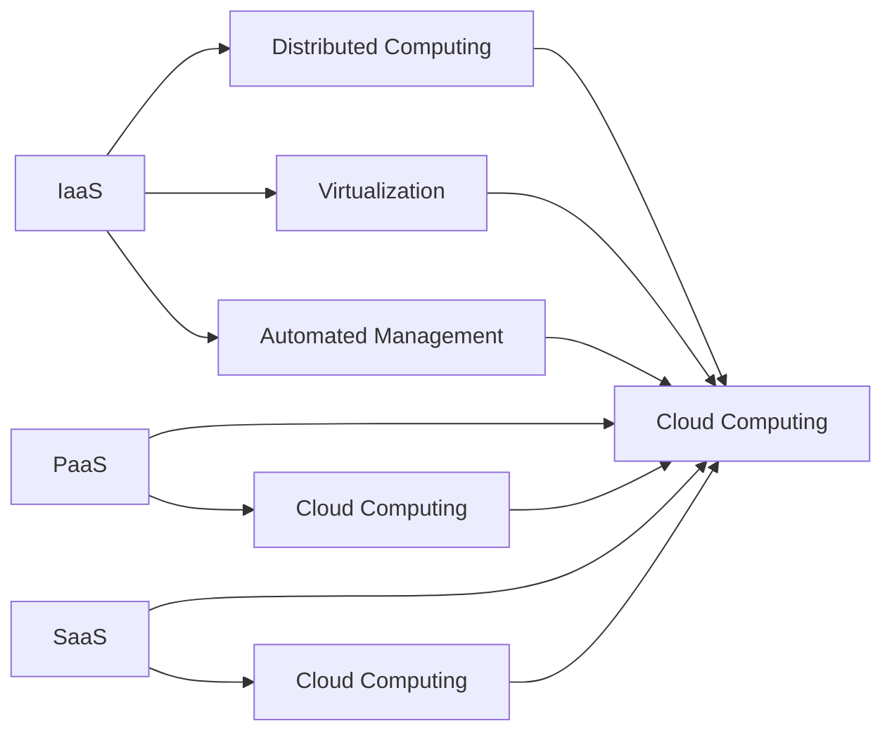

                 

## 1. 背景介绍

### 1.1 问题由来
云计算作为一种新的计算范式，自2006年被首次提出以来，已经深刻改变了IT行业的格局。它打破了传统的IT基础设施架构，将计算资源以服务形式提供给用户，实现了资源的按需使用和弹性扩展。云计算的出现极大地简化了企业IT管理复杂度，降低了应用开发和运维成本，为各行各业带来了巨大的经济效益。

### 1.2 问题核心关键点
云计算的核心在于资源按需提供、服务弹性和成本效益。它通过分布式计算、虚拟化技术、自动化管理等手段，实现了资源的有效管理和调度。云计算的主要类型包括公共云、私有云和混合云，每种类型都有其独特的特点和适用场景。

云计算的优势在于：
- **按需使用**：用户可以根据需求动态申请和释放计算资源，无需一次性投入大量资金购买硬件设备。
- **弹性扩展**：云平台可以根据业务负载自动调整资源分配，确保系统始终处于最优运行状态。
- **成本效益**：通过共享资源和减少冗余，云计算显著降低了IT成本，同时提高了资源利用率。

### 1.3 问题研究意义
研究云计算的原理与应用，对于理解其技术实现、优化资源管理、提升应用性能具有重要意义：

1. **技术理解**：掌握云计算的核心技术，包括分布式计算、虚拟化、自动化管理等，有助于深入理解云计算的基础设施架构。
2. **资源优化**：了解如何通过云平台对资源进行高效管理与调度，可以提升系统的稳定性和可靠性。
3. **应用提升**：掌握云计算环境下的应用开发与运维策略，可以提升应用性能和用户体验。
4. **成本控制**：掌握云平台的使用技巧，可以降低IT投入，提升企业的经济效益。

## 2. 核心概念与联系

### 2.1 核心概念概述

为了更好地理解云计算的基本原理，我们首先介绍一些关键概念：

- **云基础设施即服务（Infrastructure as a Service, IaaS）**：提供硬件计算资源，如虚拟机、存储和网络，用户可以自行安装操作系统和应用程序。
- **平台即服务（Platform as a Service, PaaS）**：提供应用开发和部署的平台，如数据库、中间件等，用户只需开发应用逻辑。
- **软件即服务（Software as a Service, SaaS）**：提供软件应用，用户通过浏览器或客户端访问，无需安装和维护。
- **分布式计算**：通过网络将计算任务分布到多个计算节点上进行并行处理。
- **虚拟化技术**：通过抽象和隔离底层硬件资源，实现多个虚拟机共享物理资源。
- **自动化管理**：通过编程和API，自动管理云资源，包括部署、扩缩容、故障恢复等。

这些概念之间的逻辑关系可以通过以下Mermaid流程图来展示：



这个流程图展示了云计算的核心概念及其之间的关系：

1. **IaaS、PaaS和SaaS**：云计算的三种主要服务模式，分别提供不同的资源和服务级别。
2. **分布式计算、虚拟化技术和自动化管理**：云计算实现的基础技术。
3. **云基础设施**：所有云服务的基础，提供计算资源和服务支持。

这些概念共同构成了云计算的技术框架，为云服务的实现提供了必要的技术支持。

## 3. 核心算法原理 & 具体操作步骤
### 3.1 算法原理概述

云计算的核心算法原理主要围绕资源管理、调度优化和负载均衡展开。资源管理包括资源分配、回收和迁移，确保资源的高效利用和稳定运行。调度优化涉及任务调度和资源分配，以实现系统的最优性能。负载均衡则是通过将请求分发到多个节点，避免单点故障和资源过载。

**资源管理**：通过自动化的策略和工具，云平台可以动态调整计算资源，包括虚拟机、存储和网络，确保资源的高效利用和稳定运行。资源管理通常包括资源分配、回收和迁移三个步骤。

**任务调度**：通过算法优化任务调度和资源分配，确保系统负载均衡，避免资源过载和浪费。任务调度算法包括公平调度、优化调度和负载均衡等。

**负载均衡**：通过将请求分发到多个节点，避免单点故障和资源过载。负载均衡算法包括轮询、随机和最小连接等。

### 3.2 算法步骤详解

以下详细介绍云计算的核心算法步骤：

**Step 1: 资源管理**
1. **资源分配**：根据用户需求和业务负载，自动分配计算资源，包括虚拟机、存储和网络等。
2. **资源回收**：在资源不再需要时，自动回收并释放资源，避免资源浪费。
3. **资源迁移**：根据业务负载和资源利用情况，动态迁移资源到更优的节点，提高资源利用率。

**Step 2: 任务调度**
1. **公平调度**：确保所有任务获得公平的资源分配，避免特定任务资源过载。
2. **优化调度**：根据任务特性和资源利用情况，优化资源分配，提升系统性能。
3. **负载均衡**：将任务分发到多个节点，避免单点故障和资源过载。

**Step 3: 负载均衡**
1. **轮询**：根据请求到达顺序，将请求轮流分配到多个节点。
2. **随机**：随机选择节点处理请求。
3. **最小连接**：将请求分配到连接最少的节点，避免资源过载。

### 3.3 算法优缺点

云计算的资源管理和任务调度算法具有以下优点：

1. **高效性**：通过自动化管理，云计算可以动态调整资源分配，确保资源的高效利用和稳定运行。
2. **可扩展性**：云计算可以按需扩展和缩减资源，支持大规模应用和高负载业务。
3. **灵活性**：云计算可以灵活应对不同业务需求和变化，提供量身定制的服务。

同时，云计算算法也存在一些局限性：

1. **延迟**：云计算通过网络传输数据，可能会引入一定的延迟和带宽开销。
2. **安全**：云计算中的数据和计算资源需要通过网络传输，存在一定的安全风险。
3. **成本**：尽管云计算可以降低IT成本，但初始部署和后期维护仍然需要一定的投入。
4. **复杂性**：云计算的自动化管理和复杂算法，可能带来一定的管理和调试难度。

### 3.4 算法应用领域

云计算算法在多个领域得到广泛应用，包括但不限于：

- **企业IT管理**：通过自动化管理，优化资源分配，提升企业IT系统的稳定性和可靠性。
- **数据中心**：通过负载均衡和任务调度，确保数据中心的高效运行和数据安全。
- **移动应用**：通过云计算基础设施，支持大规模移动应用的部署和运行。
- **物联网**：通过云计算平台，实现物联网设备的集中管理和数据处理。
- **高可用性和容错性**：通过多节点部署和负载均衡，确保系统的高度可用性和容错性。

## 4. 数学模型和公式 & 详细讲解 & 举例说明

### 4.1 数学模型构建

云计算的数学模型通常基于资源分配和调度优化的需求。例如，可以使用优化模型来计算资源分配的效率，使用排队论模型来预测任务调度的响应时间和等待时间等。

假设有一个云计算平台，有$N$个虚拟机和$M$个任务，每个任务需要$C$个虚拟机资源。定义资源利用率$\alpha$和负载均衡系数$\beta$，则资源分配的目标函数可以表示为：

$$
\min_{x} \sum_{i=1}^N c_i x_i
$$

其中$c_i$为虚拟机$i$的单位资源成本，$x_i$为虚拟机$i$的资源分配量，需满足以下约束条件：

$$
\begin{cases}
\sum_{i=1}^N x_i = M \\
0 \leq x_i \leq C, \forall i \in \{1,...,N\}
\end{cases}
$$

任务调度的目标函数可以表示为：

$$
\min_{y} \sum_{j=1}^M \Delta_j y_j
$$

其中$\Delta_j$为任务$j$的响应时间，$y_j$为任务$j$的资源分配量，需满足以下约束条件：

$$
\begin{cases}
\sum_{j=1}^M y_j = N \\
0 \leq y_j \leq C, \forall j \in \{1,...,M\}
\end{cases}
$$

### 4.2 公式推导过程

以任务调度为例，使用线性规划模型求解。假设任务调度问题为：

$$
\min_{y} \sum_{j=1}^M \Delta_j y_j
$$

需满足以下约束条件：

$$
\begin{cases}
\sum_{j=1}^M y_j = N \\
0 \leq y_j \leq C, \forall j \in \{1,...,M\}
\end{cases}
$$

则对应的线性规划模型为：

$$
\begin{cases}
\min \Delta^T y \\
A y = b \\
y \geq 0
\end{cases}
$$

其中$A = [e_i^T]_{i=1,...,N}, b = [C]_{i=1,...,N}, e_i$为单位向量，$\Delta^T$为任务响应时间矩阵，$y$为资源分配向量。

使用单纯形法或内点法求解线性规划模型，即可得到最优的任务资源分配方案。

### 4.3 案例分析与讲解

假设一个云平台有5个虚拟机和3个任务，每个任务需要2个虚拟机资源，任务响应时间分别为10、20和30分钟，虚拟机成本为每小时1元。使用线性规划模型求解任务调度，得到最优的资源分配方案：

| 任务编号 | 虚拟机编号 | 资源分配 |
|---|---|---|
| 1 | 1, 2 | 2 |
| 2 | 3, 4 | 2 |
| 3 | 5 | 2 |

最优资源分配方案下，任务响应时间为：

- 任务1响应时间为20分钟。
- 任务2响应时间为40分钟。
- 任务3响应时间为50分钟。

此案例展示了如何通过数学模型和算法优化任务调度，确保云计算平台的高效运行。

## 5. 项目实践：代码实例和详细解释说明

### 5.1 开发环境搭建

云计算项目开发通常需要使用云平台提供的SDK和API，如AWS SDK、Azure SDK等。开发环境搭建步骤如下：

1. **安装开发工具**：如Python、Java等。
2. **配置云平台账号**：访问云平台官网，注册账号并设置权限。
3. **安装SDK**：使用pip、maven等工具安装云平台SDK。
4. **配置环境变量**：设置云平台访问密钥、区域等信息。
5. **测试连接**：使用SDK提供的测试函数，验证连接和权限。

### 5.2 源代码详细实现

以下是一个使用AWS SDK进行云资源管理的Python代码示例：

```python
import boto3

# 创建EC2客户端
ec2 = boto3.client('ec2', region_name='us-west-2', aws_access_key_id='access_key', aws_secret_access_key='secret_key')

# 创建虚拟机
response = ec2.run_instances(
    ImageId='ami-0c55b159e3b899c88', 
    InstanceType='t2.micro',
    MinCount=1,
    MaxCount=1
)
instance_id = response['Instances'][0]['InstanceId']
print('虚拟机创建成功，ID为', instance_id)

# 获取虚拟机状态
response = ec2.describe_instances(InstanceIds=[instance_id])
instance_state = response['Reservations'][0]['Instances'][0]['State']['Name']
print('虚拟机状态为', instance_state)

# 停止并释放虚拟机
response = ec2.stop_instances(InstanceIds=[instance_id])
print('虚拟机停止成功，ID为', instance_id)

# 释放虚拟机
response = ec2.terminate_instances(InstanceIds=[instance_id])
print('虚拟机释放成功，ID为', instance_id)
```

此代码示例展示了如何使用AWS SDK创建、获取、停止和释放虚拟机。

### 5.3 代码解读与分析

以上代码示例中，首先通过创建EC2客户端连接到AWS云平台，然后使用run_instances函数创建虚拟机。在创建虚拟机时，指定了镜像ID、实例类型、最小和最大实例数量。创建成功后，通过describe_instances函数获取虚拟机状态。最后，使用stop_instances和terminate_instances函数分别停止和释放虚拟机。

### 5.4 运行结果展示

运行上述代码，输出的结果可能包括虚拟机ID、状态等。例如：

```
虚拟机创建成功，ID为 i-0123456789abcdef0
虚拟机状态为 running
虚拟机停止成功，ID为 i-0123456789abcdef0
虚拟机释放成功，ID为 i-0123456789abcdef0
```

## 6. 实际应用场景

### 6.1 企业IT管理

云计算在企业IT管理中的应用包括资源分配、负载均衡、故障恢复等。企业可以使用云计算平台集中管理服务器、存储和网络等基础设施，优化资源利用率和系统可靠性。

**示例**：某公司使用AWS云平台，将所有的服务器和存储资源集中管理。在业务高峰期，通过自动化的资源扩展策略，动态增加计算资源，确保系统稳定运行。在业务低谷期，自动释放资源，降低IT成本。同时，通过负载均衡策略，确保高并发请求能够高效分发，避免单点故障。

### 6.2 数据中心

数据中心是云计算基础设施的重要组成部分，通过云计算平台实现高效管理和调度。

**示例**：某大型数据中心使用AWS云平台管理所有的服务器和存储资源。在业务高峰期，通过自动化的资源扩展策略，动态增加计算资源，确保系统稳定运行。同时，通过负载均衡策略，确保高并发请求能够高效分发，避免单点故障。

### 6.3 移动应用

移动应用通常需要依赖云基础设施提供计算资源和数据存储，实现按需使用和弹性扩展。

**示例**：某移动应用公司使用AWS云平台管理所有的服务器和存储资源。在业务高峰期，通过自动化的资源扩展策略，动态增加计算资源，确保系统稳定运行。同时，通过负载均衡策略，确保高并发请求能够高效分发，避免单点故障。

### 6.4 未来应用展望

云计算的未来发展趋势包括：

- **边缘计算**：将计算资源部署在网络边缘，减少延迟和带宽开销，提高应用响应速度。
- **混合云**：通过多个云平台集成，实现跨云资源管理和调度。
- **AI和ML**：结合人工智能和机器学习技术，优化资源分配和任务调度，提升系统性能。
- **安全性**：通过加密、访问控制等技术，保障云平台和数据的安全性。
- **合规性**：符合各种行业标准和法规，确保数据隐私和安全。

## 7. 工具和资源推荐

### 7.1 学习资源推荐

为了帮助开发者系统掌握云计算的理论基础和实践技巧，这里推荐一些优质的学习资源：

1. **《云计算：原理与实践》**：由著名云计算专家撰写，详细介绍了云计算的基本原理、架构和应用。
2. **AWS官方文档**：AWS云平台的官方文档，提供了详尽的API接口和操作指南。
3. **Azure官方文档**：Azure云平台的官方文档，提供了详尽的API接口和操作指南。
4. **Google云官方文档**：Google云平台的官方文档，提供了详尽的API接口和操作指南。
5. **Cloud Guru**：在线课程平台，提供大量的云计算和云平台实战课程。

通过对这些资源的学习实践，相信你一定能够快速掌握云计算的核心技术和应用方法，熟练开发和运维云计算系统。

### 7.2 开发工具推荐

云计算开发和运维通常需要使用云平台提供的SDK和API，以下是几款常用的开发工具：

1. **AWS SDK**：Amazon Web Services提供的SDK，支持多种编程语言，包括Python、Java等。
2. **Azure SDK**：Microsoft Azure提供的SDK，支持多种编程语言，包括Python、Java等。
3. **Google Cloud SDK**：Google Cloud提供的SDK，支持多种编程语言，包括Python、Java等。
4. **OpenStack SDK**：OpenStack云平台提供的SDK，支持多种编程语言，包括Python、Java等。
5. **Ansible**：自动化运维工具，支持多云平台集成和资源管理。

合理利用这些工具，可以显著提升云计算系统的开发效率，加快创新迭代的步伐。

### 7.3 相关论文推荐

云计算的研究涉及多个领域，以下是几篇奠基性的相关论文，推荐阅读：

1. **《云计算：概念、技术与应用》**：介绍了云计算的基本概念、技术架构和应用场景。
2. **《资源调度与优化在云计算中的应用》**：详细介绍了云计算中的资源管理和调度优化算法。
3. **《分布式计算与云计算》**：探讨了分布式计算与云计算的关系，提出了多种云计算调度算法。
4. **《云计算安全与隐私保护》**：讨论了云计算平台的安全性和隐私保护问题，提出了多种解决方案。
5. **《边缘计算与云计算的融合》**：介绍了边缘计算与云计算的融合技术，提出了多种边缘计算方案。

这些论文代表了大云计算技术的发展脉络。通过学习这些前沿成果，可以帮助研究者把握学科前进方向，激发更多的创新灵感。

## 8. 总结：未来发展趋势与挑战

### 8.1 总结

本文对云计算的基本原理和实践进行了全面系统的介绍。首先阐述了云计算的核心概念和技术架构，明确了云计算在企业IT管理、数据中心、移动应用等场景中的应用价值。其次，从原理到实践，详细讲解了云计算的资源管理、任务调度和负载均衡等核心算法，给出了云资源管理的完整代码实现。同时，本文还探讨了云计算的未来发展趋势和面临的挑战，提供了有价值的实践建议。

通过本文的系统梳理，可以看到，云计算技术已经成为现代IT基础设施的重要组成部分，为各行各业带来了巨大的经济效益。未来，云计算将在更广泛的应用场景中发挥更大的作用，不断推动社会的数字化转型。

### 8.2 未来发展趋势

展望未来，云计算技术将呈现以下几个发展趋势：

1. **边缘计算**：将计算资源部署在网络边缘，减少延迟和带宽开销，提高应用响应速度。
2. **混合云**：通过多个云平台集成，实现跨云资源管理和调度。
3. **AI和ML**：结合人工智能和机器学习技术，优化资源分配和任务调度，提升系统性能。
4. **安全性**：通过加密、访问控制等技术，保障云平台和数据的安全性。
5. **合规性**：符合各种行业标准和法规，确保数据隐私和安全。

这些趋势凸显了云计算技术的广阔前景。随着云计算技术的持续演进，其在各行各业的应用将更加广泛，带来更大的经济效益和社会价值。

### 8.3 面临的挑战

尽管云计算技术已经取得了显著成果，但在迈向更加智能化、普适化应用的过程中，它仍面临诸多挑战：

1. **延迟和带宽开销**：云计算通过网络传输数据，可能会引入一定的延迟和带宽开销，影响应用性能。
2. **安全性**：云计算中的数据和计算资源需要通过网络传输，存在一定的安全风险。
3. **成本**：尽管云计算可以降低IT成本，但初始部署和后期维护仍然需要一定的投入。
4. **复杂性**：云计算的自动化管理和复杂算法，可能带来一定的管理和调试难度。
5. **兼容性和互操作性**：跨云平台资源管理和调度仍存在一定挑战。

这些挑战需要业界持续探索和优化，以确保云计算技术的持续发展和应用。

### 8.4 研究展望

面对云计算技术面临的挑战，未来的研究需要在以下几个方面寻求新的突破：

1. **边缘计算**：进一步优化边缘计算技术，提高计算资源利用率和应用响应速度。
2. **混合云**：探索跨云平台资源管理和调度的新技术，实现无缝集成和高效协作。
3. **AI和ML**：结合人工智能和机器学习技术，提升云计算系统的智能化和自动化水平。
4. **安全性**：研究更安全、更可靠的云平台架构和数据保护技术。
5. **合规性**：探索符合各种行业标准和法规的云计算解决方案，确保数据隐私和安全。

这些研究方向的探索，必将引领云计算技术迈向更高的台阶，为构建安全、可靠、高效、智能的云平台提供有力的技术支持。

## 9. 附录：常见问题与解答

**Q1: 云计算是否适用于所有业务场景？**

A: 云计算适用于大多数业务场景，特别是对计算资源和弹性扩展有需求的应用。但对于一些需要高安全性和低延迟的场景，如金融交易、医疗诊断等，可能需要选择本地部署或混合云方案。

**Q2: 如何选择合适的云平台？**

A: 选择云平台应考虑以下几个因素：
1. **业务需求**：根据业务特点和需求，选择适合的平台，如AWS、Azure、Google Cloud等。
2. **成本预算**：根据IT预算，选择性价比高的平台，如AWS、阿里云、腾讯云等。
3. **技术支持**：选择技术支持完善、服务质量高的平台，如AWS、Google Cloud、阿里云等。
4. **生态系统**：选择生态系统丰富的平台，如AWS、Azure、Google Cloud等。

**Q3: 云计算的安全性如何保障？**

A: 云计算的安全性保障主要通过以下措施：
1. **加密**：使用加密技术保护数据传输和存储。
2. **访问控制**：使用身份验证和权限控制，确保只有授权用户可以访问资源。
3. **审计和监控**：实时监控和记录云平台的活动，及时发现和应对安全威胁。
4. **合规性**：符合各种行业标准和法规，确保数据隐私和安全。

**Q4: 云计算的扩展性和弹性如何实现？**

A: 云计算的扩展性和弹性主要通过以下措施：
1. **自动扩展**：通过自动化的资源扩展策略，动态增加计算资源，确保系统稳定运行。
2. **负载均衡**：通过负载均衡策略，将请求分发到多个节点，避免单点故障和资源过载。
3. **弹性伸缩**：根据业务负载动态调整资源配置，确保系统始终处于最优运行状态。

**Q5: 云计算对业务运行有哪些影响？**

A: 云计算对业务运行有以下影响：
1. **成本效益**：通过共享资源和减少冗余，云计算显著降低了IT成本，同时提高了资源利用率。
2. **可扩展性**：云计算可以按需扩展和缩减资源，支持大规模应用和高负载业务。
3. **稳定性**：通过自动化管理和负载均衡，云计算确保系统的高可用性和容错性。

---

作者：禅与计算机程序设计艺术 / Zen and the Art of Computer Programming

