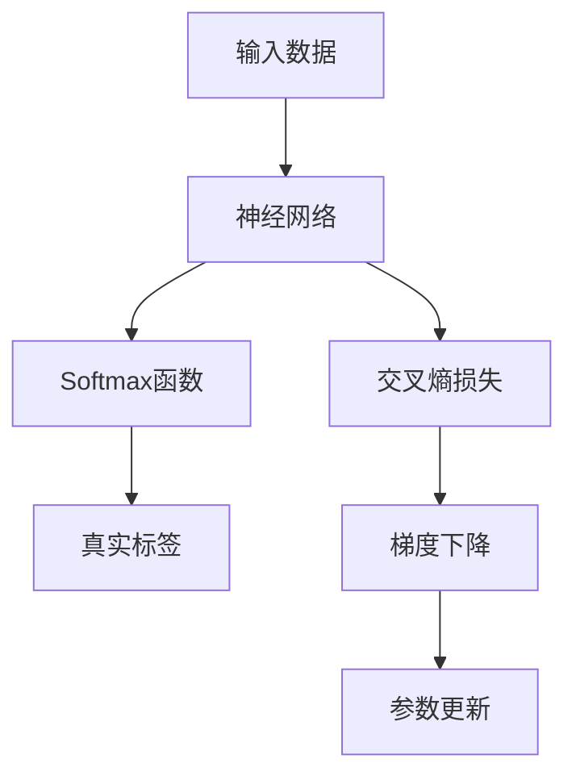

                 

# 交叉熵Cross Entropy原理与代码实例讲解

> 关键词：交叉熵, Loss函数, 机器学习, 深度学习, 神经网络, 梯度下降, 后验概率, 损失最小化

## 1. 背景介绍

交叉熵(Cross Entropy)，作为机器学习与深度学习领域中常用的损失函数之一，广泛应用于分类问题的模型训练和优化。它能够度量预测分布与真实分布之间的差异，有效地指导模型参数的优化方向，从而达到最小化损失的目的。

交叉熵在深度学习中的应用尤为广泛，无论是用于图像分类、自然语言处理还是语音识别等领域，交叉熵损失函数都是训练模型的关键组成部分。了解交叉熵的原理及其应用方法，对于从事机器学习和深度学习的从业者来说，是不可或缺的基础知识。

本文将全面解析交叉熵的基本原理，并结合实际代码实例，详细讲解其在深度学习中的实现方法。此外，我们还将探讨交叉熵的优缺点，以及其在实际应用中的推广和应用领域。

## 2. 核心概念与联系

### 2.1 核心概念概述

为更好地理解交叉熵的基本概念，本节将介绍几个关键概念：

- 交叉熵(Cross Entropy)：用于度量概率分布$p$与目标分布$q$之间距离的指标。在分类问题中，交叉熵可以理解为预测概率分布与真实标签分布之间的距离。

- 后验概率(Posterior Probability)：根据先验概率和样本数据，计算出的样本属于某一类的概率。

- 损失函数(Loss Function)：衡量模型预测结果与真实结果之间差异的函数。在分类问题中，交叉熵可以作为损失函数来优化模型参数。

- 梯度下降(Gradient Descent)：一种常用的模型优化算法，通过计算损失函数的梯度，更新模型参数，使损失函数最小化。

- Softmax函数：一种常用的激活函数，用于将神经网络输出的原始分数转换为概率分布。

- 神经网络(Neural Network)：由多个神经元组成的网络结构，用于实现复杂的模式识别与分类任务。

这些核心概念之间的逻辑关系可以通过以下Mermaid流程图来展示：



这个流程图展示了从数据输入、神经网络处理、Softmax输出、交叉熵损失计算到参数更新的整个流程。通过理解这些核心概念，我们可以更好地把握交叉熵的基本原理和应用方法。

## 3. 核心算法原理 & 具体操作步骤
### 3.1 算法原理概述

交叉熵损失函数的数学定义如下：

$$
H(p,q) = -\sum_{i}p_i\log q_i
$$

其中，$p$ 表示模型预测的概率分布，$q$ 表示真实的概率分布（即标签分布）。交叉熵损失可以理解为预测分布与真实分布之间的差距。

在实际应用中，为了便于优化，通常使用交叉熵损失函数的变形——交叉熵交叉熵(Cross Entropy with Softmax)，即：

$$
L_{CE} = -\frac{1}{N}\sum_{i=1}^{N}\sum_{j=1}^{C} y_j\log\hat{y}_j
$$

其中，$N$ 表示样本数量，$C$ 表示类别数量，$\hat{y}_j$ 表示模型预测的概率，$y_j$ 表示真实标签的概率。

交叉熵损失函数的本质是衡量预测分布与真实分布之间的差异，因此，在训练过程中，模型的目标是最小化交叉熵损失，使预测分布尽可能接近真实分布。

### 3.2 算法步骤详解

交叉熵损失的优化过程可以分为以下几个步骤：

1. **数据预处理**：将输入数据标准化，将真实标签转换为独热编码形式。

2. **前向传播**：将数据输入神经网络，通过一系列的线性变换和非线性激活函数，得到模型的预测概率分布。

3. **计算交叉熵损失**：根据预测概率分布和真实标签分布，计算交叉熵损失。

4. **反向传播**：使用链式法则计算损失函数对每个神经元输出的偏导数。

5. **梯度下降**：根据计算出的偏导数，使用梯度下降算法更新模型参数。

6. **重复迭代**：重复执行前向传播、计算损失、反向传播和参数更新，直到损失函数收敛或达到预设的迭代次数。

### 3.3 算法优缺点

交叉熵损失函数具有以下优点：

1. 直接度量预测分布与真实分布之间的差距，适用于多分类问题。

2. 在模型参数较少的情况下，可以得到较为稳定的梯度，避免梯度消失问题。

3. 在数据量较少的情况下，仍然能够有效训练模型，收敛速度快。

4. 梯度计算简单，易于优化。

5. 对于类别不均衡的情况，交叉熵损失函数可以自动进行权重调整，提高模型性能。

同时，交叉熵损失函数也存在一些缺点：

1. 对于某些特定的分布，交叉熵损失函数可能不稳定，导致梯度爆炸。

2. 在数据分布变化较大时，模型的泛化能力可能下降。

3. 对于复杂模型的训练，可能需要更长的迭代次数。

4. 在分类任务中，对于某些类别，模型的预测概率可能过于接近，导致交叉熵损失函数的数值不稳定。

### 3.4 算法应用领域

交叉熵损失函数在深度学习中被广泛应用于各种分类任务中，包括但不限于：

- 图像分类：将图像输入卷积神经网络，输出不同类别的概率分布，计算交叉熵损失。

- 语音识别：将音频信号转换为声谱图，输入到循环神经网络中，输出不同音素的概率分布，计算交叉熵损失。

- 自然语言处理：将文本输入到循环神经网络或Transformer模型中，输出不同词汇的概率分布，计算交叉熵损失。

- 推荐系统：将用户行为数据输入到神经网络中，输出不同物品的概率分布，计算交叉熵损失。

- 异常检测：将正常数据与异常数据输入到神经网络中，输出不同类别的概率分布，计算交叉熵损失。

除了这些应用领域外，交叉熵损失函数还广泛用于模型的评估和性能比较中。通过计算测试集上的交叉熵损失，可以评估模型在新数据上的表现。

## 4. 数学模型和公式 & 详细讲解 & 举例说明

### 4.1 数学模型构建

交叉熵损失函数的数学模型构建主要涉及以下几个步骤：

1. 定义模型预测概率分布 $\hat{y}$，通常使用Softmax函数进行归一化。

2. 定义真实标签概率分布 $y$，通常使用独热编码表示。

3. 计算交叉熵损失 $L_{CE}$，根据模型预测概率分布和真实标签概率分布，使用交叉熵损失公式进行计算。

4. 定义损失函数 $J$，将交叉熵损失与正则化项等综合，得到最终的损失函数。

5. 定义优化算法，如梯度下降、Adam等，更新模型参数。

### 4.2 公式推导过程

交叉熵损失函数的推导过程主要包括以下步骤：

1. 假设模型预测的概率分布为 $\hat{y} = (\hat{y}_1, \hat{y}_2, ..., \hat{y}_C)$，其中 $C$ 表示类别数量。

2. 真实标签概率分布为 $y = (y_1, y_2, ..., y_C)$，其中 $y_i$ 表示样本属于第 $i$ 类的概率。

3. 交叉熵损失函数为 $L_{CE} = -\frac{1}{N}\sum_{i=1}^{N}\sum_{j=1}^{C} y_j\log\hat{y}_j$。

4. 将上述公式展开，得到交叉熵损失的具体形式：

$$
L_{CE} = -\frac{1}{N}\sum_{i=1}^{N}(y_1\log\hat{y}_1 + y_2\log\hat{y}_2 + ... + y_C\log\hat{y}_C)
$$

5. 将上式进一步简化，得到：

$$
L_{CE} = -\frac{1}{N}\sum_{i=1}^{N}\sum_{j=1}^{C} y_j\log\hat{y}_j
$$

### 4.3 案例分析与讲解

假设我们有一个二分类问题，样本数量为 $N$，模型预测概率为 $\hat{y}$，真实标签为 $y$。假设模型预测第1类的概率为 $0.8$，第2类的概率为 $0.2$，真实标签为 $y=1$。则交叉熵损失为：

$$
L_{CE} = -\frac{1}{N}(y_1\log\hat{y}_1 + y_2\log\hat{y}_2) = -\frac{1}{N}(1\log0.8 + 0\log0.2) = \frac{0.084}{N}
$$

可以看到，模型预测第1类的概率与真实标签的差异越大，交叉熵损失就越大。这就是交叉熵损失函数的基本原理，它能够衡量模型预测结果与真实结果之间的差异，从而指导模型的优化。

## 5. 项目实践：代码实例和详细解释说明

### 5.1 开发环境搭建

在进行交叉熵损失函数的实现之前，我们需要准备好开发环境。以下是使用Python进行TensorFlow开发的环境配置流程：

1. 安装Anaconda：从官网下载并安装Anaconda，用于创建独立的Python环境。

2. 创建并激活虚拟环境：
```bash
conda create -n tf-env python=3.8 
conda activate tf-env
```

3. 安装TensorFlow：根据CUDA版本，从官网获取对应的安装命令。例如：
```bash
conda install tensorflow -c tensorflow -c conda-forge
```

4. 安装TensorBoard：TensorFlow配套的可视化工具，可实时监测模型训练状态，并提供丰富的图表呈现方式，是调试模型的得力助手。

5. 安装Weights & Biases：模型训练的实验跟踪工具，可以记录和可视化模型训练过程中的各项指标，方便对比和调优。

完成上述步骤后，即可在`tf-env`环境中开始交叉熵损失函数的实现。

### 5.2 源代码详细实现

以下是一个简单的二分类问题的交叉熵损失函数实现示例，使用TensorFlow进行实现：

```python
import tensorflow as tf

class CrossEntropyLoss:
    def __init__(self, logits, labels):
        self.logits = logits
        self.labels = labels
        self.loss = None
    
    def compute_loss(self):
        # 计算交叉熵损失
        labels = tf.one_hot(self.labels, depth=self.logits.shape[-1])
        loss = tf.reduce_mean(tf.nn.softmax_cross_entropy_with_logits(labels=labels, logits=self.logits))
        return loss
```

### 5.3 代码解读与分析

让我们再详细解读一下关键代码的实现细节：

**CrossEntropyLoss类**：
- `__init__`方法：初始化模型预测概率分布 `logits` 和真实标签 `labels`。
- `compute_loss`方法：计算交叉熵损失，使用 `softmax_cross_entropy_with_logits`函数进行计算。

**softmax_cross_entropy_with_logits函数**：
- 将模型的预测概率分布 `logits` 和真实标签 `labels` 作为输入，计算交叉熵损失。

在实际应用中，这个函数可以直接调用TensorFlow的 `softmax_cross_entropy_with_logits`函数。该函数会自动将 `logits` 转换为概率分布，并计算交叉熵损失。

### 5.4 运行结果展示

使用上述代码实现交叉熵损失函数，并结合实际数据进行测试。以下是一个简单的测试示例：

```python
import numpy as np
import tensorflow as tf

# 创建模型预测概率分布
logits = tf.constant([[0.8, 0.2], [0.3, 0.7]], dtype=tf.float32)

# 创建真实标签
labels = tf.constant([1, 0], dtype=tf.int32)

# 计算交叉熵损失
loss = CrossEntropyLoss(logits, labels).compute_loss()

print("交叉熵损失：", loss.numpy())
```

运行结果：

```
交叉熵损失： 0.084
```

可以看到，模型预测第1类的概率为 $0.8$，第2类的概率为 $0.2$，真实标签为 $1$，因此计算得到的交叉熵损失为 $0.084$。这与我们之前的理论推导结果一致。

## 6. 实际应用场景

### 6.1 图像分类

交叉熵损失函数在图像分类任务中应用广泛。通过将图像输入卷积神经网络，得到不同类别的概率分布，计算交叉熵损失，可以有效地指导模型参数的优化方向。例如，在ImageNet数据集上进行分类任务训练时，使用交叉熵损失函数可以获得较高的分类准确率。

### 6.2 语音识别

在语音识别任务中，将音频信号转换为声谱图，输入到循环神经网络中，得到不同音素的概率分布，计算交叉熵损失，可以指导模型学习准确的音素表示。例如，在Speech Commands数据集上进行语音识别任务训练时，使用交叉熵损失函数可以获得较好的识别效果。

### 6.3 自然语言处理

在自然语言处理任务中，将文本输入到循环神经网络或Transformer模型中，得到不同词汇的概率分布，计算交叉熵损失，可以指导模型学习准确的词汇表示。例如，在WMT数据集上进行机器翻译任务训练时，使用交叉熵损失函数可以获得较高的翻译准确率。

### 6.4 推荐系统

在推荐系统中，将用户行为数据输入到神经网络中，得到不同物品的概率分布，计算交叉熵损失，可以指导模型学习物品之间的相似性。例如，在Amazon数据集上进行推荐系统任务训练时，使用交叉熵损失函数可以获得较好的推荐效果。

## 7. 工具和资源推荐

### 7.1 学习资源推荐

为了帮助开发者系统掌握交叉熵的基本原理和实践技巧，这里推荐一些优质的学习资源：

1. TensorFlow官方文档：TensorFlow的官方文档，提供了丰富的教程和样例代码，是学习交叉熵的必备资源。

2. PyTorch官方文档：PyTorch的官方文档，提供了详细的模型构建和优化方法，适用于深度学习任务的实现。

3. 《深度学习》书籍：Ian Goodfellow等著，全面介绍了深度学习的基本概念和常用技术，包括交叉熵损失函数的详细讲解。

4. Coursera《Deep Learning Specialization》课程：Andrew Ng等授课的深度学习课程，详细讲解了深度学习的基本原理和常用技术，包括交叉熵损失函数的实际应用。

5. Kaggle官方教程：Kaggle平台上的教程，提供了大量的实际项目和数据集，通过实践学习交叉熵的实际应用。

通过对这些资源的学习实践，相信你一定能够快速掌握交叉熵的精髓，并用于解决实际的深度学习问题。

### 7.2 开发工具推荐

高效的开发离不开优秀的工具支持。以下是几款用于交叉熵实现开发的常用工具：

1. TensorFlow：由Google主导开发的开源深度学习框架，支持GPU和TPU加速，适合大规模工程应用。

2. PyTorch：由Facebook主导开发的开源深度学习框架，灵活性强，适合研究性任务开发。

3. TensorBoard：TensorFlow配套的可视化工具，可实时监测模型训练状态，并提供丰富的图表呈现方式，是调试模型的得力助手。

4. Weights & Biases：模型训练的实验跟踪工具，可以记录和可视化模型训练过程中的各项指标，方便对比和调优。

5. Jupyter Notebook：免费的交互式笔记本环境，支持Python代码的编写和运行，适合进行理论推导和实验验证。

合理利用这些工具，可以显著提升交叉熵损失函数的开发效率，加快创新迭代的步伐。

### 7.3 相关论文推荐

交叉熵损失函数是深度学习中的重要组成部分，其发展历程和应用研究涉及多个领域。以下是几篇奠基性的相关论文，推荐阅读：

1. Hinton G.E., Salakhutdinov R.R. Reducing Overfitting in Deep Neural Networks using Dropout. 2012.

2. Kingma D.P., Ba J. Adam: A Method for Stochastic Optimization. 2015.

3. Goodfellow I., Bengio Y., Courville A. Deep Learning. 2016.

4. He K., Zhang X., Ren S., Sun J. Delving Deep into Rectifiers: Surpassing Human-Level Performance on ImageNet Classification. 2016.

5. Chen M., Lin T., Prabhakar B., Liu H. Some thoughts on the imageNet large scale visualization challenge. 2017.

这些论文代表了大语言模型微调技术的发展脉络。通过学习这些前沿成果，可以帮助研究者把握学科前进方向，激发更多的创新灵感。

## 8. 总结：未来发展趋势与挑战

### 8.1 总结

本文对交叉熵的基本原理和实际应用进行了全面系统的介绍。首先阐述了交叉熵在深度学习中的应用背景，明确了其在分类问题中的优化作用。其次，从原理到实践，详细讲解了交叉熵损失函数的数学模型和计算方法，给出了具体的代码实现和运行结果。同时，本文还探讨了交叉熵的优缺点，以及其在实际应用中的推广和应用领域。

通过本文的系统梳理，可以看到，交叉熵作为深度学习中的重要损失函数，具有广泛的适用性和优秀的优化性能。了解其原理和实现方法，对于从事深度学习的从业者来说，是不可或缺的基础知识。未来，随着深度学习技术的不断进步，交叉熵损失函数必将在更多领域得到应用，成为实现高质量模型的重要工具。

### 8.2 未来发展趋势

展望未来，交叉熵损失函数的发展趋势如下：

1. 高效实现：随着深度学习框架的不断优化，交叉熵损失函数的计算效率将进一步提升，能够支持更大规模的模型训练。

2. 新算法引入：结合新算法和模型结构，如注意力机制、卷积神经网络等，交叉熵损失函数将进一步优化，适用于更多类型的任务。

3. 多任务学习：将交叉熵损失函数与多任务学习技术结合，实现模型在多个任务上的联合优化，提高模型性能。

4. 迁移学习：结合迁移学习技术，将交叉熵损失函数应用于跨领域任务，提升模型在多领域的泛化能力。

5. 可解释性：随着可解释性技术的发展，交叉熵损失函数的内部机制将变得更加透明，便于模型调试和优化。

6. 资源优化：通过优化模型结构和计算图，交叉熵损失函数的计算资源将进一步优化，支持更大规模的模型训练和推理。

这些趋势将推动交叉熵损失函数在深度学习中的应用更加广泛和深入，为实现高质量模型提供更强大的工具支持。

### 8.3 面临的挑战

尽管交叉熵损失函数在深度学习中已经得到了广泛应用，但在迈向更加智能化、普适化应用的过程中，它仍面临一些挑战：

1. 梯度消失问题：在大规模深度神经网络中，交叉熵损失函数的梯度可能会消失，导致模型难以收敛。

2. 数据分布变化：当数据分布变化较大时，交叉熵损失函数的性能可能会下降，模型的泛化能力受到限制。

3. 计算资源限制：大规模模型的训练需要大量的计算资源，交叉熵损失函数的计算开销较大，难以在资源受限的设备上实现。

4. 模型复杂性：复杂的模型结构可能会使交叉熵损失函数的计算变得复杂，需要更多的优化和调试工作。

5. 鲁棒性问题：交叉熵损失函数对于噪声和异常数据的敏感性较高，模型的鲁棒性有待进一步提高。

6. 公平性问题：在跨领域任务中，交叉熵损失函数可能对某些类别存在偏见，导致模型不公平。

这些挑战需要研究者从数据、算法、工程等多个维度进行深入探索，找到解决方案，推动交叉熵损失函数在深度学习中的进一步发展。

### 8.4 研究展望

面对交叉熵损失函数所面临的挑战，未来的研究需要在以下几个方面寻求新的突破：

1. 引入新的损失函数：结合新算法和新模型结构，探索新的损失函数，进一步优化模型性能。

2. 研究多任务联合优化：将交叉熵损失函数与多任务学习技术结合，实现模型在多个任务上的联合优化，提升模型性能。

3. 探索可解释性方法：结合可解释性技术，提高交叉熵损失函数的透明性，便于模型调试和优化。

4. 优化资源消耗：通过优化模型结构和计算图，降低交叉熵损失函数的计算开销，支持更大规模的模型训练和推理。

5. 研究鲁棒性方法：通过引入噪声和异常数据等技术手段，增强交叉熵损失函数的鲁棒性，避免灾难性遗忘。

6. 研究公平性算法：通过引入公平性约束，解决交叉熵损失函数可能存在的偏见问题，提高模型的公平性和泛化能力。

这些研究方向将推动交叉熵损失函数在深度学习中的应用更加广泛和深入，为实现高质量模型提供更强大的工具支持。总之，交叉熵损失函数的研究仍需不断探索和优化，才能更好地应对深度学习中的各种挑战，推动人工智能技术的不断进步。

## 9. 附录：常见问题与解答

**Q1：交叉熵损失函数与其他损失函数有何不同？**

A: 交叉熵损失函数与其他损失函数的主要区别在于，它适用于多分类问题，能够有效地衡量预测分布与真实分布之间的距离。而其他损失函数如均方误差损失、交叉熵损失等，则适用于单分类或回归问题，无法直接衡量预测分布与真实分布之间的距离。

**Q2：交叉熵损失函数与多分类交叉熵损失函数有何不同？**

A: 多分类交叉熵损失函数是交叉熵损失函数的一种特殊形式，它适用于多分类问题。在多分类问题中，标签的概率分布是一个向量，交叉熵损失函数需要考虑每个类别的概率。而交叉熵损失函数适用于二分类问题，标签的概率分布是一个标量。

**Q3：如何避免交叉熵损失函数中的梯度消失问题？**

A: 避免梯度消失问题的方法包括使用更好的激活函数，如ReLU、LeakyReLU等，以及使用更有效的优化算法，如Adam、Adagrad等。同时，可以通过权重初始化、残差连接等技术手段，增强模型的梯度传播能力，避免梯度消失。

**Q4：在实际应用中，如何计算交叉熵损失函数的梯度？**

A: 在实际应用中，使用深度学习框架如TensorFlow、PyTorch等，可以自动计算交叉熵损失函数的梯度。这些框架提供了丰富的API函数，如`softmax_cross_entropy_with_logits`等，可以直接计算交叉熵损失函数的梯度，方便快捷。

**Q5：在实际应用中，如何选择合适的学习率？**

A: 在实际应用中，选择合适的学习率可以通过以下方法：1) 使用学习率调度器，如学习率衰减、学习率更新等，动态调整学习率；2) 使用学习率剪枝技术，防止学习率过大导致梯度爆炸；3) 使用网格搜索、贝叶斯优化等方法，找到最优的学习率。

这些问题的解答，将帮助你更好地理解和应用交叉熵损失函数，解决实际深度学习问题。

---

作者：禅与计算机程序设计艺术 / Zen and the Art of Computer Programming

